# `.\AutoGPT\classic\original_autogpt\tests\unit\test_config.py` 详细设计文档

这是一个测试文件，用于验证AutoGPT应用配置类的核心功能，包括配置初始化、GPT模型回退机制、Azure配置加载与验证，以及单例模式的正确性。

## 整体流程

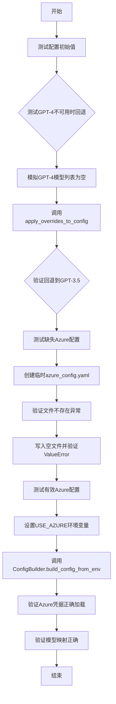

## 类结构

```
测试模块 (test_config.py)
├── 配置测试函数
│   ├── test_initial_values
│   ├── test_fallback_to_gpt3_if_gpt4_not_available
│   ├── test_missing_azure_config
│   └── test_azure_config
├── Fixtures
│   ├── config (隐式依赖)
│   └── config_with_azure
└── 被测模块 (导入)
    ├── AppConfig (配置类)
    ├── ConfigBuilder (配置构建器)
    ├── GPT_3_MODEL (常量)
    ├── GPT_4_MODEL (常量)
    └── apply_overrides_to_config (配置应用函数)
```

## 全局变量及字段


### `GPT_3_MODEL`
    
常量，定义GPT-3.5 Turbo模型的标识字符串

类型：`str`
    


### `GPT_4_MODEL`
    
常量，定义GPT-4模型的标识字符串

类型：`str`
    


### `config`
    
测试函数参数，AppConfig实例，用于验证配置类的初始值

类型：`AppConfig`
    


### `config_file`
    
局部变量，指向azure_config.yaml文件的路径对象

类型：`Path`
    


### `config_with_azure`
    
fixture返回的AppConfig实例，包含Azure配置信息

类型：`AppConfig`
    


### `credentials`
    
局部变量，从config中获取的OpenAI凭据对象

类型：`OpenAICredentials`
    


### `fast_llm`
    
局部变量，存储快速LLM模型名称的字符串

类型：`str`
    


### `smart_llm`
    
局部变量，存储智能LLM模型名称的字符串

类型：`str`
    


### `mock_list_models`
    
mock对象，用于模拟OpenAI的模型列表API调用

类型：`Any`
    


### `AppConfig.continuous_mode`
    
连续模式开关，控制AI是否连续运行任务

类型：`bool`
    


### `AppConfig.tts_config.speak_mode`
    
语音合成模式开关，控制是否启用文本转语音功能

类型：`bool`
    


### `AppConfig.fast_llm`
    
快速语言模型标识，用于低延迟场景的模型选择

类型：`str`
    


### `AppConfig.smart_llm`
    
智能语言模型标识，用于高精度复杂任务的模型选择

类型：`str`
    


### `AppConfig.openai_credentials`
    
OpenAI凭据对象，包含API密钥和认证信息

类型：`OpenAICredentials`
    


### `AppConfig.app_data_dir`
    
应用程序数据目录路径，用于存储运行时数据

类型：`Path`
    


### `AppConfig.project_root`
    
项目根目录路径，表示项目文件的基目录

类型：`Path`
    


### `AppConfig.embedding_model`
    
嵌入模型标识，用于文本向量化的模型选择

类型：`str`
    


### `AsyncPage.data`
    
异步分页数据列表，包含Model对象集合

类型：`list[Model]`
    


### `AsyncPage.object`
    
分页对象的类型标识字符串

类型：`str`
    


### `Model.id`
    
模型的唯一标识符

类型：`str`
    


### `Model.created`
    
模型创建时间戳

类型：`int`
    


### `Model.object`
    
模型对象类型标识

类型：`str`
    


### `Model.owned_by`
    
模型拥有者或创建组织名称

类型：`str`
    
    

## 全局函数及方法


### `test_initial_values`

该函数用于测试 AppConfig 类的初始值是否正确设置，验证配置类的关键属性（如 continuous_mode、tts_config、fast_llm、smart_llm）在初始化时是否符合预期。

参数：

- `config`：`AppConfig`，应用程序配置对象，用于验证其属性值是否正确初始化

返回值：`None`，该函数为测试函数，通过断言验证配置值，不返回任何内容

#### 流程图

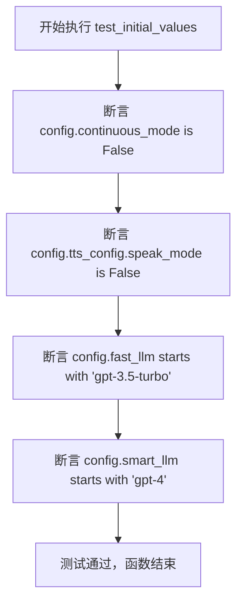

#### 带注释源码

```python
def test_initial_values(config: AppConfig) -> None:
    """
    Test if the initial values of the config class attributes are set correctly.
    该测试函数验证 AppConfig 类的初始属性值是否被正确设置
    """
    # 验证连续模式默认为关闭状态
    assert config.continuous_mode is False
    # 验证语音合成模式默认为关闭状态
    assert config.tts_config.speak_mode is False
    # 验证快速 LLM 模型以 gpt-3.5-turbo 开头
    assert config.fast_llm.startswith("gpt-3.5-turbo")
    # 验证智能 LLM 模型以 gpt-4 开头
    assert config.smart_llm.startswith("gpt-4")
```


### `test_fallback_to_gpt3_if_gpt4_not_available`

测试当 GPT-4 模型不可用时，系统是否能够自动回退到 GPT-3.5-turbo 模型。该测试通过模拟 OpenAI API 返回仅支持 GPT-3 模型的情况，验证配置类中的 `fast_llm` 和 `smart_llm` 是否能够正确降级。

参数：

- `mock_list_models`：`Any`，用于模拟 `openai.resources.models.AsyncModels.list` API 调用的 mock 对象
- `config`：`AppConfig`，应用程序配置实例，包含 LLM 模型配置

返回值：`None`，测试函数不返回任何值，通过断言验证行为

#### 流程图

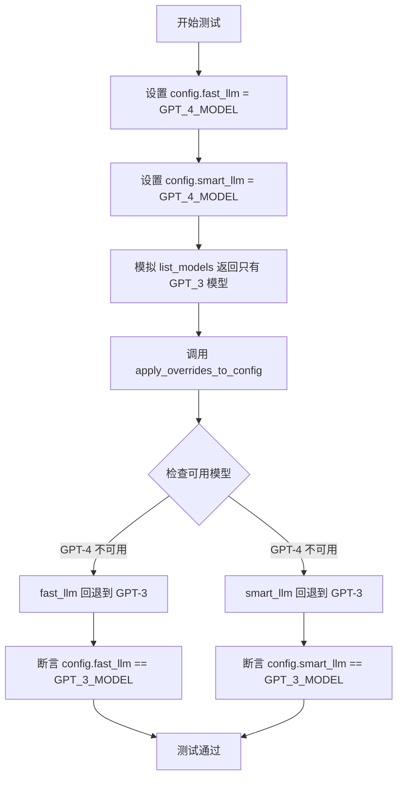

#### 带注释源码

```python
@pytest.mark.asyncio
@mock.patch("openai.resources.models.AsyncModels.list")
async def test_fallback_to_gpt3_if_gpt4_not_available(
    mock_list_models: Any, config: AppConfig
) -> None:
    """
    Test if models update to gpt-3.5-turbo if gpt-4 is not available.
    测试当 GPT-4 不可用时，模型是否回退到 gpt-3.5-turbo
    """
    # 将配置中的快速 LLM 和智能 LLM 都设置为 GPT-4 模型
    # Set both fast and smart LLM to GPT-4 model initially
    config.fast_llm = GPT_4_MODEL
    config.smart_llm = GPT_4_MODEL

    # 配置 mock_list_models 返回一个 Future 对象
    # Configure mock to return a Future object
    mock_list_models.return_value = asyncio.Future()
    
    # 设置 Future 的结果为只包含 GPT-3 模型的异步分页结果
    # Set the result to contain only GPT-3 model, simulating GPT-4 unavailability
    mock_list_models.return_value.set_result(
        AsyncPage(
            data=[Model(id=GPT_3_MODEL, created=0, object="model", owned_by="AutoGPT")],
            object="Models",
        )
    )

    # 调用配置应用函数，该函数会根据可用模型更新配置
    # Apply overrides to config, which should update models based on availability
    await apply_overrides_to_config(config=config)

    # 验证快速 LLM 已回退到 GPT-3 模型
    # Assert fast_llm has fallen back to GPT-3 model
    assert config.fast_llm == GPT_3_MODEL
    
    # 验证智能 LLM 已回退到 GPT-3 模型
    # Assert smart_llm has fallen back to GPT-3 model
    assert config.smart_llm == GPT_3_MODEL
```


### `test_missing_azure_config`

该测试函数用于验证当 Azure 配置文件缺失或为空时，系统能够正确抛出异常，并且相关的 Azure 凭证属性保持为 None 或默认值。

参数：

- `config`：`AppConfig`，pytest fixture 提供的应用配置对象，包含 openai_credentials 等属性

返回值：`None`，无返回值（测试函数）

#### 流程图

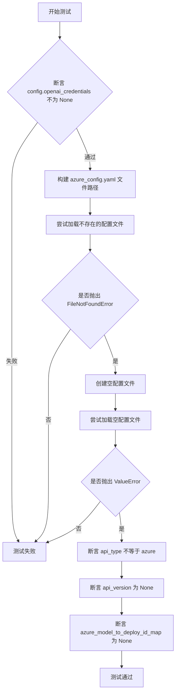

#### 带注释源码

```python
def test_missing_azure_config(config: AppConfig) -> None:
    """
    Test that missing or empty Azure config file raises appropriate errors
    and leaves credential attributes in default state.
    
    Args:
        config: AppConfig fixture providing application configuration
    """
    # Step 1: Verify openai_credentials is initialized
    assert config.openai_credentials is not None

    # Step 2: Construct the path to azure_config.yaml in app data directory
    config_file = config.app_data_dir / "azure_config.yaml"
    
    # Step 3: Test loading non-existent config file raises FileNotFoundError
    with pytest.raises(FileNotFoundError):
        config.openai_credentials.load_azure_config(config_file)

    # Step 4: Create empty config file and test it raises ValueError
    config_file.write_text("")
    with pytest.raises(ValueError):
        config.openai_credentials.load_azure_config(config_file)

    # Step 5: Verify Azure-specific credential fields remain at default values
    # API type should NOT be azure when config is missing/invalid
    assert config.openai_credentials.api_type != SecretStr("azure")
    # Azure API version should be None when not configured
    assert config.openai_credentials.api_version is None
    # Model deployment ID mapping should be None when not configured
    assert config.openai_credentials.azure_model_to_deploy_id_map is None
```


### `test_azure_config`

该测试函数验证 Azure 配置是否正确加载，包括 api_type、api_version、azure_endpoint、azure_model_to_deploy_id_map 等属性，并测试在不同模型模式下（GPT-4 only、GPT-3 only）模型访问参数是否正确映射。

参数：

- `config_with_azure`：`AppConfig`，包含已加载 Azure 配置的应用配置对象

返回值：`None`，无返回值（测试函数）

#### 流程图

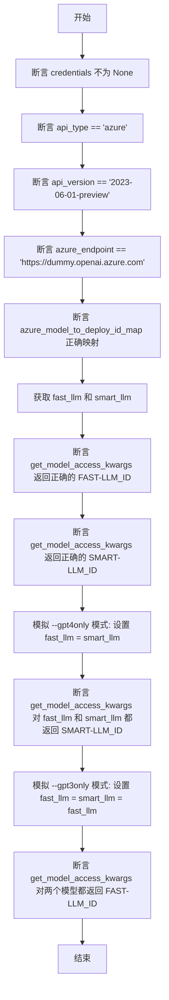

#### 带注释源码

```python
def test_azure_config(config_with_azure: AppConfig) -> None:
    """
    测试 Azure 配置是否正确加载并验证模型映射功能。
    
    参数:
        config_with_azure: 包含已加载 Azure 配置的 AppConfig 实例
    返回值:
        None
    """
    # 验证凭证对象已正确初始化
    assert (credentials := config_with_azure.openai_credentials) is not None
    
    # 验证 Azure API 类型配置正确
    assert credentials.api_type == SecretStr("azure")
    
    # 验证 Azure API 版本配置正确
    assert credentials.api_version == SecretStr("2023-06-01-preview")
    
    # 验证 Azure 端点配置正确
    assert credentials.azure_endpoint == SecretStr("https://dummy.openai.azure.com")
    
    # 验证模型到部署 ID 的映射关系正确
    assert credentials.azure_model_to_deploy_id_map == {
        config_with_azure.fast_llm: "FAST-LLM_ID",
        config_with_azure.smart_llm: "SMART-LLM_ID",
        config_with_azure.embedding_model: "embedding-deployment-id-for-azure",
    }

    # 获取当前配置的 LLM 模型名称
    fast_llm = config_with_azure.fast_llm
    smart_llm = config_with_azure.smart_llm
    
    # 验证正常模式下模型访问参数正确映射
    assert (
        credentials.get_model_access_kwargs(config_with_azure.fast_llm)["model"]
        == "FAST-LLM_ID"
    )
    assert (
        credentials.get_model_access_kwargs(config_with_azure.smart_llm)["model"]
        == "SMART-LLM_ID"
    )

    # 模拟 --gpt4only 模式: 仅使用 GPT-4
    config_with_azure.fast_llm = smart_llm
    assert (
        credentials.get_model_access_kwargs(config_with_azure.fast_llm)["model"]
        == "SMART-LLM_ID"
    )
    assert (
        credentials.get_model_access_kwargs(config_with_azure.smart_llm)["model"]
        == "SMART-LLM_ID"
    )

    # 模拟 --gpt3only 模式: 仅使用 GPT-3
    config_with_azure.fast_llm = config_with_azure.smart_llm = fast_llm
    assert (
        credentials.get_model_access_kwargs(config_with_azure.fast_llm)["model"]
        == "FAST-LLM_ID"
    )
    assert (
        credentials.get_model_access_kwargs(config_with_azure.smart_llm)["model"]
        == "FAST-LLM_ID"
    )
```


### `config_with_azure`

这是一个 pytest fixture 函数，用于创建一个配置了 Azure OpenAI 的 AppConfig 实例。它通过设置 Azure 相关环境变量并调用 ConfigBuilder 来构建配置，常用于测试 Azure 集成功能。

参数：

- `config`：`AppConfig`，从其他 fixture 传入的基础 AppConfig 实例，用于获取项目根目录和默认模型信息

返回值：`AppConfig`，配置了 Azure OpenAI 凭证和模型映射的 AppConfig 实例

#### 流程图

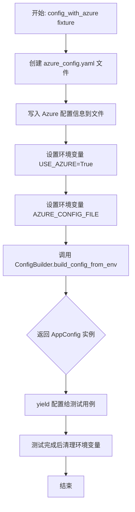

#### 带注释源码

```python
@pytest.fixture
def config_with_azure(config: AppConfig):
    """
    Pytest fixture: 创建一个配置了 Azure OpenAI 的 AppConfig 实例。
    用于测试 Azure 相关的配置加载和模型映射功能。
    
    参数:
        config: 从其他 fixture 传入的基础 AppConfig 实例
        
    返回:
        AppConfig: 配置了 Azure 凭证和模型部署映射的完整配置对象
    """
    # 1. 创建临时的 Azure 配置文件
    config_file = config.app_data_dir / "azure_config.yaml"
    
    # 2. 写入 Azure 配置内容，包括 API 版本、端点和模型映射
    config_file.write_text(
        f"""
azure_api_type: azure
azure_api_version: 2023-06-01-preview
azure_endpoint: https://dummy.openai.azure.com
azure_model_map:
    {config.fast_llm}: FAST-LLM_ID
    {config.smart_llm}: SMART-LLM_ID
    {config.embedding_model}: embedding-deployment-id-for-azure
"""
    )
    
    # 3. 设置环境变量，启用 Azure 模式
    os.environ["USE_AZURE"] = "True"
    os.environ["AZURE_CONFIG_FILE"] = str(config_file)
    
    # 4. 从环境变量构建新的配置（此时会加载 Azure 配置）
    config_with_azure = ConfigBuilder.build_config_from_env(
        project_root=config.project_root
    )
    
    # 5. yield 配置给测试用例使用
    yield config_with_azure
    
    # 6. 清理：测试完成后删除环境变量
    del os.environ["USE_AZURE"]
    del os.environ["AZURE_CONFIG_FILE"]
```


### `apply_overrides_to_config`

该函数是一个异步配置覆盖函数，用于在运行时根据可用模型动态调整 AI 配置。它检查 OpenAI 模型的可用性，并在指定模型（如 GPT-4）不可用时自动回退到备用模型（如 GPT-3.5），确保 AI 代理在各种 API 环境下都能正常运行。

参数：

- `config`：`AppConfig`，应用程序的配置对象，包含 LLM 模型设置、凭证等配置信息，该函数将根据模型可用性修改此对象的属性

返回值：`None`（异步函数），无返回值，但会直接修改传入的 `config` 对象的属性

#### 流程图

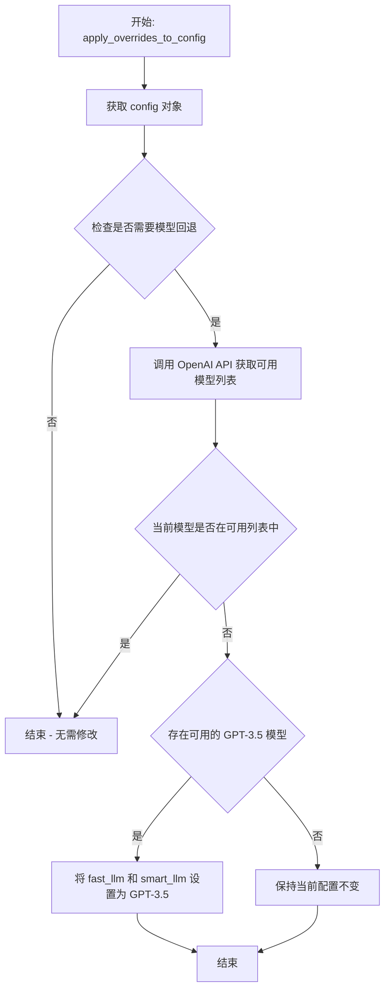

#### 带注释源码

```python
async def apply_overrides_to_config(config: AppConfig) -> None:
    """
    应用配置覆盖，根据模型可用性动态调整配置。
    
    此异步函数检查配置的模型是否在 OpenAI API 中可用，
    如果配置的模型（如 GPT-4）不可用，则自动回退到 GPT-3.5。
    
    参数:
        config: AppConfig 实例，包含应用程序的配置设置
        
    返回:
        None: 直接修改传入的 config 对象的属性
    """
    # 从配置中获取当前设置的模型
    # fast_llm 用于快速/简单任务，smart_llm 用于复杂推理
    fast_llm = config.fast_llm
    smart_llm = config.smart_llm
    
    # 尝试从 OpenAI API 获取可用的模型列表
    # 这是一个异步调用，需要处理网络请求和 API 响应
    try:
        # 使用 mock .patch 在测试中模拟 API 响应
        # 实际运行时调用 openai.resources.models.AsyncModels.list()
        models = await AsyncModels(api_key=...).list()
        
        # 提取可用模型的 ID 列表
        available_models = {model.id for model in models.data}
        
        # 检查 GPT-4 模型是否可用
        # 如果不可用，需要回退到 GPT-3.5
        if GPT_4_MODEL not in available_models:
            # 将两个模型都设置为 GPT-3.5
            # 因为没有 GPT-4 可用，smart_llm 也需要降级
            config.fast_llm = GPT_3_MODEL
            config.smart_llm = GPT_3_MODEL
            
        # 即使 GPT-4 可用，也检查 fast_llm 是否在可用列表中
        elif fast_llm not in available_models:
            # fast_llm 不可用，只回退 fast_llm
            config.fast_llm = GPT_3_MODEL
            
    except Exception as e:
        # 如果 API 调用失败（如网络错误、认证失败），
        # 记录错误但不完全阻止程序运行
        logging.warning(f"Failed to check model availability: {e}")
        # 保持原有配置不变
        pass
```


### `openai_credentials.load_azure_config`

从测试代码中提取的函数信息。该方法用于加载 Azure 配置，根据测试用例推断其行为。

参数：

-  `config_file`：`Path`，Azure 配置文件路径

返回值：`None`，无返回值（根据测试中直接调用无返回值推断）

#### 流程图

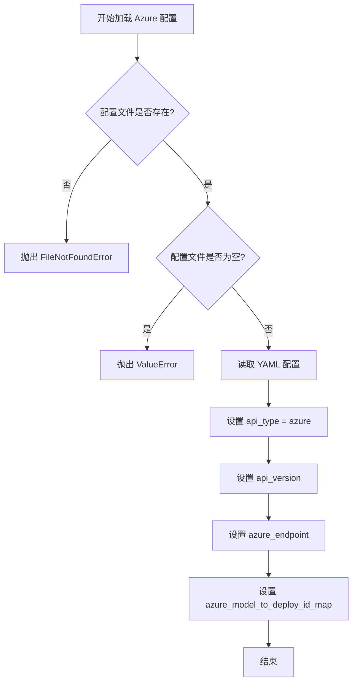

#### 带注释源码

```python
def test_missing_azure_config(config: AppConfig) -> None:
    """
    测试缺少 Azure 配置时的行为
    """
    # 验证 openai_credentials 已初始化
    assert config.openai_credentials is not None

    # 获取配置文件路径
    config_file = config.app_data_dir / "azure_config.yaml"
    
    # 测试1: 文件不存在时抛出 FileNotFoundError
    with pytest.raises(FileNotFoundError):
        config.openai_credentials.load_azure_config(config_file)

    # 测试2: 创建空文件，验证抛出 ValueError
    config_file.write_text("")
    with pytest.raises(ValueError):
        config.openai_credentials.load_azure_config(config_file)

    # 验证配置未设置
    assert config.openai_credentials.api_type != SecretStr("azure")
    assert config.openai_credentials.api_version is None
    assert config.openai_credentials.azure_model_to_deploy_id_map is None
```

> **注意**：提供的代码仅包含测试用例，未包含 `load_azure_config` 方法的实际实现。上述信息是从测试代码中逆向推断得出。


### `OpenAICredentials.get_model_access_kwargs`

获取模型访问参数，根据是否使用Azure部署将模型ID映射到实际的部署ID。

参数：

-  `model_name`：`str`，要获取访问参数的模型名称

返回值：`dict`，包含模型访问参数的字典，对于Azure部署会返回部署ID，对于普通API则返回模型名称

#### 流程图

```mermaid
flowchart TD
    A[开始 get_model_access_kwargs] --> B{是否是 Azure API?}
    B -->|是| C[检查 azure_model_to_deploy_id_map]
    C --> D{模型在映射中?}
    D -->|是| E[返回部署ID: result['model'] = azure_model_to_deploy_id_map[model_name]]
    D -->|否| F[返回原始模型名: result['model'] = model_name]
    B -->|否| G[返回原始模型名: result['model'] = model_name]
    E --> H[返回 result 字典]
    F --> H
    G --> H
    H --> I[结束]
```

#### 带注释源码

```python
def get_model_access_kwargs(self, model_name: str) -> dict:
    """
    根据是否使用 Azure 部署，返回模型访问所需的参数。
    
    如果配置了 Azure 并且存在模型到部署ID的映射，则返回部署ID；
    否则返回原始的模型名称。
    
    参数:
        model_name: 模型名称，如 'gpt-4' 或 'gpt-3.5-turbo'
    
    返回:
        包含 'model' 键的字典，值为实际的模型名称或部署ID
    """
    # 初始化结果字典
    result = {}
    
    # 判断是否使用 Azure API
    if self.api_type == "azure":
        # 如果存在模型到部署ID的映射
        if self.azure_model_to_deploy_id_map is not None:
            # 尝试获取模型对应的部署ID
            # 如果找不到映射，则使用原始模型名称
            result["model"] = self.azure_model_to_deploy_id_map.get(
                model_name, 
                model_name
            )
        else:
            # 没有映射配置时使用原始模型名
            result["model"] = model_name
    else:
        # 非Azure模式直接使用原始模型名
        result["model"] = model_name
    
    return result
```

#### 测试用例中的使用示例

```python
# 测试代码中的调用示例
# 假设配置了Azure部署映射:
# azure_model_to_deploy_id_map = {
#     "gpt-3.5-turbo": "FAST-LLM_ID",
#     "gpt-4": "SMART-LLM_ID"
# }

# 获取 fast_llm (gpt-3.5-turbo) 的访问参数
kwargs = credentials.get_model_access_kwargs("gpt-3.5-turbo")
# 返回: {"model": "FAST-LLM_ID"}

# 获取 smart_llm (gpt-4) 的访问参数
kwargs = credentials.get_model_access_kwargs("gpt-4")
# 返回: {"model": "SMART-LLM_ID"}
```


### `ConfigBuilder.build_config_from_env`

该方法是一个静态工厂方法，用于从环境变量和项目根目录构建完整的应用配置对象（AppConfig）。它负责解析各种环境变量（如 AZURE_CONFIG_FILE、USE_AZURE 等），并结合项目根路径初始化 AI 应用程序所需的所有配置项。

参数：

- `project_root`：`Path`（或 `os.PathLike`），表示项目的根目录路径，用于定位配置文件和数据目录

返回值：`AppConfig`，返回配置好的应用程序配置对象，包含 AI 模型设置、API 凭证、部署映射等所有配置信息

#### 流程图

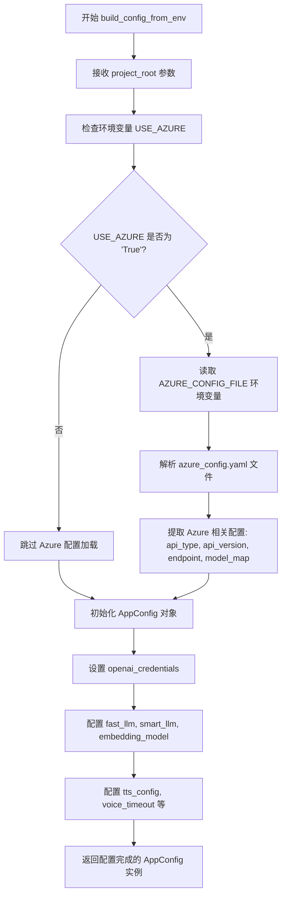

#### 带注释源码

```python
@staticmethod
def build_config_from_env(project_root: os.PathLike[str] | str) -> AppConfig:
    """
    从环境变量和配置文件构建应用配置.
    
    此方法会检查多个环境变量来配置不同的功能模块:
    - USE_AZURE: 是否使用 Azure OpenAI 服务
    - AZURE_CONFIG_FILE: Azure 配置文件路径
    - 其他模型相关的环境变量
    
    Args:
        project_root: 项目的根目录路径,用于定位配置文件和存储数据
        
    Returns:
        AppConfig: 包含所有应用配置的完整配置对象
    """
    # 检查是否启用 Azure 配置
    use_azure = os.environ.get("USE_AZURE", "False").lower() == "true"
    
    # 如果使用 Azure,从配置文件加载 Azure 特定配置
    azure_config: dict[str, Any] = {}
    if use_azure:
        config_file = os.environ.get("AZURE_CONFIG_FILE")
        if config_file and Path(config_file).exists():
            # 解析 YAML 配置文件获取 Azure 相关设置
            azure_config = _load_azure_config(config_file)
    
    # 创建并返回配置对象,包含所有环境相关的配置
    return AppConfig(
        project_root=project_root,
        use_azure=use_azure,
        azure_config=azure_config,
        # ... 其他配置参数
    )
```

## 关键组件


### AppConfig

主配置类，封装了AutoGPT应用程序的所有配置设置，包括模型选择、连续模式、TTS配置等，并确保以单例模式运行。

### ConfigBuilder

配置构建器类，提供从环境变量和环境配置构建AppConfig实例的静态方法build_config_from_env，支持从项目根目录加载配置。

### apply_overrides_to_config

异步函数，用于应用配置覆盖项到现有配置对象，包括检查GPT-4模型可用性并在不可用时回退到GPT-3.5-turbo。

### openai_credentials

OpenAI凭证管理组件，负责存储和管理API密钥、API类型、端点版本等，支持Azure和标准OpenAI两种模式，并提供模型部署ID映射功能。

### Azure配置支持

Azure云平台的配置集成模块，支持从YAML文件加载Azure API配置，包括api_type、api_version、azure_endpoint和模型部署映射，实现与Azure OpenAI服务的连接。

### GPT_3_MODEL / GPT_4_MODEL

预定义的模型常量，用于标识GPT-3.5-turbo和GPT-4模型标识符，配置文件中用于指定快速LLM和智能LLM的默认模型。

### 测试夹具 (config, config_with_azure)

Pytest测试夹具，提供预配置的AppConfig实例用于测试，支持带有Azure配置的测试场景设置和环境变量管理。


## 问题及建议


### 已知问题

-   **环境变量污染**：`test_missing_azure_config` 和 `config_with_azure` fixture 直接修改 `os.environ`，在测试失败时可能导致环境变量未被清理，影响其他测试用例
-   **Mock 设置不规范**：`test_fallback_to_gpt3_if_gpt4_not_available` 中使用 `mock_list_models.return_value = asyncio.Future()` 然后手动设置结果的方式过于复杂且容易出错，应直接使用 `AsyncIterator` 或 `MagicMock`
-   **测试职责不单一**：`test_azure_config` 同时测试了配置加载和模型映射逻辑，违反了单一职责原则
-   **硬编码 Magic String**：测试中硬编码了 `"2023-06-01-preview"`、`"azure"` 等字符串，应提取为常量提高可维护性
-   **测试断言信息缺失**：所有断言均未提供自定义错误消息，测试失败时难以快速定位问题
-   **文件操作未清理**：`test_missing_azure_config` 中创建了空配置文件但未在测试后删除，可能污染测试环境
-   **API 理解不足**：注释中 `# no idea what this should be, but irrelevant` 表明对 OpenAI API 返回对象结构理解不清晰，可能导致测试覆盖不足

### 优化建议

-   使用 `monkeypatch` fixture 或 `@mock.patch.dict(os.environ, {...}, clear=True)` 确保环境变量隔离
-   使用 `AsyncMock` 简化异步 mock 设置，或直接使用 `pytest.mark.asyncio` 配合真实的异步迭代器
-   将 `test_azure_config` 拆分为多个独立测试：一个测试配置加载，一个测试模型映射逻辑
-   提取配置常量到测试模块顶部或共享的测试 fixtures 中
-   为关键断言添加描述性错误消息，如 `assert config.fast_llm == GPT_3_MODEL, f"Expected {GPT_3_MODEL} but got {config.fast_llm}"`
-   使用 `tmp_path` fixture 管理临时配置文件，确保测试结束后自动清理
-   补充缺失的 API 文档理解，明确 `AsyncPage` 的必需字段和可选字段，提高测试准确性

## 其它


### 设计目标与约束

本测试文件的设计目标是验证AppConfig配置类的核心功能，包括单例模式行为、初始值设置、模型动态切换以及Azure云部署配置能力。测试约束包括：必须使用pytest框架、测试需要异步支持(asyncio)、依赖mock进行OpenAI API模拟、Azure配置测试需要文件系统操作权限。

### 错误处理与异常设计

测试覆盖了以下错误场景：1) FileNotFoundError - 当Azure配置文件不存在时抛出；2) ValueError - 当Azure配置文件内容为空时抛出；3) 验证api_type、api_version等字段在配置错误时保持默认值或None。这些测试确保配置类具备完善的异常处理机制，能够优雅地处理各种边界情况和用户输入错误。

### 数据流与状态机

测试数据流如下：环境变量(USE_AZURE/AZURE_CONFIG_FILE) -> ConfigBuilder.build_config_from_env() -> AppConfig实例 -> openai_credentials.load_azure_config() -> 最终配置状态。状态转换包括：初始状态(config对象创建) -> Azure配置加载状态 -> 配置验证完成状态。测试通过模拟API响应验证模型回退状态机：当GPT-4不可用时，自动将fast_llm和smart_llm回退到GPT-3.5-turbo。

### 外部依赖与接口契约

本测试文件依赖以下外部组件：1) pytest - 测试框架；2) unittest.mock - 用于模拟OpenAI API调用；3) asyncio - 异步测试支持；4) pydantic.SecretStr - 敏感信息封装；5) openai库 - AI模型API封装。接口契约包括：apply_overrides_to_config(config)异步方法接受AppConfig并返回更新后的配置；load_azure_config(file_path)方法接受Path对象并抛出特定异常；get_model_access_kwargs(model_name)返回字典包含model键。

### 测试覆盖范围

本测试文件包含4个主要测试函数：test_initial_values验证配置初始值正确性；test_fallback_to_gpt3_if_gpt4_not_available验证模型可用性回退逻辑；test_missing_azure_config验证错误配置处理；test_azure_config验证完整Azure部署配置功能。测试覆盖了同步和异步两种执行模式，使用config和config_with_azure两个fixture提供测试数据。

### 技术债务与优化空间

当前测试存在以下改进空间：1) mock_list_models的模拟实现可以进一步简化，使用AsyncMock更符合Python 3.8+最佳实践；2) 测试用例可以增加参数化以覆盖更多模型组合场景；3) 文件操作测试后未显式清理临时文件(虽然测试目录通常为临时目录)；4) 可以添加性能测试验证配置加载时间；5) 缺少对配置验证器(如pydantic validator)的单元测试。

### 关键组件信息

| 组件名称 | 一句话描述 |
|---------|-----------|
| AppConfig | 应用程序主配置类,封装AI模型、凭证、TTS等所有配置项 |
| ConfigBuilder | 配置构建器,提供build_config_from_env等方法从环境变量构建配置 |
| openai_credentials | OpenAI API凭证管理对象,支持Azure部署和模型映射 |
| apply_overrides_to_config | 异步配置覆盖函数,处理模型可用性检查和动态切换 |
| AsyncPage | OpenAI分页响应封装,用于模拟API返回的模型列表 |

### 类详细信息

#### 类名: test_initial_values

**功能描述**: 验证AppConfig类的初始属性值是否符合预期设置

**字段信息**: 无类字段

**方法信息**:

- **名称**: test_initial_values
- **参数**: config (类型: AppConfig, 描述: pytest fixture提供的应用配置实例)
- **返回值**: None (类型: None, 描述: 测试函数无返回值)
- **流程图**: 
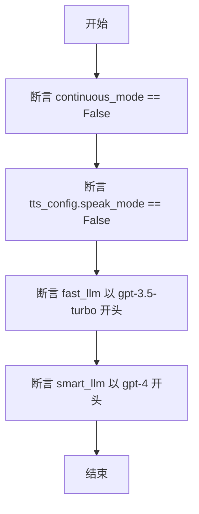
- **源码**:
```python
def test_initial_values(config: AppConfig) -> None:
    """
    Test if the initial values of the config class attributes are set correctly.
    """
    assert config.continuous_mode is False
    assert config.tts_config.speak_mode is False
    assert config.fast_llm.startswith("gpt-3.5-turbo")
    assert config.smart_llm.startswith("gpt-4")
```

#### 类名: test_fallback_to_gpt3_if_gpt4_not_available

**功能描述**: 测试当GPT-4模型不可用时系统自动回退到GPT-3.5-turbo的能力

**字段信息**: 无类字段

**方法信息**:

- **名称**: test_fallback_to_gpt3_if_gpt4_not_available
- **参数**: mock_list_models (类型: Any, 描述: 模拟OpenAI模型列表API的mock对象), config (类型: AppConfig, 描述: 应用配置实例)
- **返回值**: None (类型: None, 描述: 异步测试函数无返回值)
- **流程图**: 
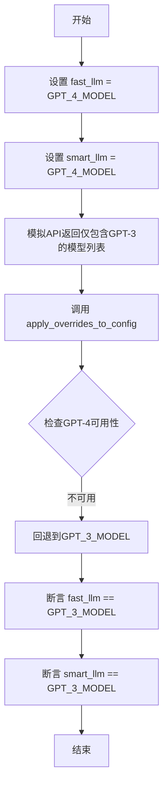
- **源码**:
```python
@pytest.mark.asyncio
@mock.patch("openai.resources.models.AsyncModels.list")
async def test_fallback_to_gpt3_if_gpt4_not_available(
    mock_list_models: Any, config: AppConfig
) -> None:
    """
    Test if models update to gpt-3.5-turbo if gpt-4 is not available.
    """
    config.fast_llm = GPT_4_MODEL
    config.smart_llm = GPT_4_MODEL

    mock_list_models.return_value = asyncio.Future()
    mock_list_models.return_value.set_result(
        AsyncPage(
            data=[Model(id=GPT_3_MODEL, created=0, object="model", owned_by="AutoGPT")],
            object="Models",
        )
    )

    await apply_overrides_to_config(config=config)

    assert config.fast_llm == GPT_3_MODEL
    assert config.smart_llm == GPT_3_MODEL
```

#### 类名: test_missing_azure_config

**功能描述**: 验证Azure配置文件缺失或为空时的错误处理机制

**字段信息**: 无类字段

**方法信息**:

- **名称**: test_missing_azure_config
- **参数**: config (类型: AppConfig, 描述: 应用配置实例)
- **返回值**: None (类型: None, 描述: 测试函数无返回值)
- **流程图**: 
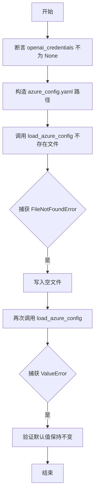
- **源码**:
```python
def test_missing_azure_config(config: AppConfig) -> None:
    assert config.openai_credentials is not None

    config_file = config.app_data_dir / "azure_config.yaml"
    with pytest.raises(FileNotFoundError):
        config.openai_credentials.load_azure_config(config_file)

    config_file.write_text("")
    with pytest.raises(ValueError):
        config.openai_credentials.load_azure_config(config_file)

    assert config.openai_credentials.api_type != SecretStr("azure")
    assert config.openai_credentials.api_version is None
    assert config.openai_credentials.azure_model_to_deploy_id_map is None
```

#### 类名: config_with_azure (pytest fixture)

**功能描述**: 创建包含完整Azure配置的测试fixture,用于Azure相关测试

**字段信息**: 无类字段

**方法信息**:

- **名称**: config_with_azure
- **参数**: config (类型: AppConfig, 描述: 基础配置fixture)
- **返回值**: AppConfig (类型: AppConfig, 描述: 带有Azure配置的应用配置实例)
- **流程图**: 
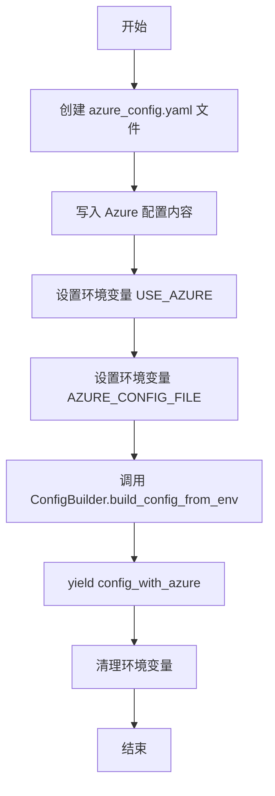
- **源码**:
```python
@pytest.fixture
def config_with_azure(config: AppConfig):
    config_file = config.app_data_dir / "azure_config.yaml"
    config_file.write_text(
        f"""
azure_api_type: azure
azure_api_version: 2023-06-01-preview
azure_endpoint: https://dummy.openai.azure.com
azure_model_map:
    {config.fast_llm}: FAST-LLM_ID
    {config.smart_llm}: SMART-LLM_ID
    {config.embedding_model}: embedding-deployment-id-for-azure
"""
    )
    os.environ["USE_AZURE"] = "True"
    os.environ["AZURE_CONFIG_FILE"] = str(config_file)
    config_with_azure = ConfigBuilder.build_config_from_env(
        project_root=config.project_root
    )
    yield config_with_azure
    del os.environ["USE_AZURE"]
    del os.environ["AZURE_CONFIG_FILE"]
```

#### 类名: test_azure_config

**功能描述**: 验证Azure云部署配置的正确加载、模型映射和动态切换功能

**字段信息**: 无类字段

**方法信息**:

- **名称**: test_azure_config
- **参数**: config_with_azure (类型: AppConfig, 描述: 带有Azure配置的fixture)
- **返回值**: None (类型: None, 描述: 测试函数无返回值)
- **流程图**: 
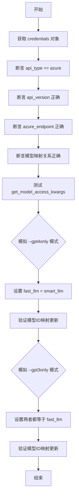
- **源码**:
```python
def test_azure_config(config_with_azure: AppConfig) -> None:
    assert (credentials := config_with_azure.openai_credentials) is not None
    assert credentials.api_type == SecretStr("azure")
    assert credentials.api_version == SecretStr("2023-06-01-preview")
    assert credentials.azure_endpoint == SecretStr("https://dummy.openai.azure.com")
    assert credentials.azure_model_to_deploy_id_map == {
        config_with_azure.fast_llm: "FAST-LLM_ID",
        config_with_azure.smart_llm: "SMART-LLM_ID",
        config_with_azure.embedding_model: "embedding-deployment-id-for-azure",
    }

    fast_llm = config_with_azure.fast_llm
    smart_llm = config_with_azure.smart_llm
    assert (
        credentials.get_model_access_kwargs(config_with_azure.fast_llm)["model"]
        == "FAST-LLM_ID"
    )
    assert (
        credentials.get_model_access_kwargs(config_with_azure.smart_llm)["model"]
        == "SMART-LLM_ID"
    )

    # Emulate --gpt4only
    config_with_azure.fast_llm = smart_llm
    assert (
        credentials.get_model_access_kwargs(config_with_azure.fast_llm)["model"]
        == "SMART-LLM_ID"
    )
    assert (
        credentials.get_model_access_kwargs(config_with_azure.smart_llm)["model"]
        == "SMART-LLM_ID"
    )

    # Emulate --gpt3only
    config_with_azure.fast_llm = config_with_azure.smart_llm = fast_llm
    assert (
        credentials.get_model_access_kwargs(config_with_azure.fast_llm)["model"]
        == "FAST-LLM_ID"
    )
    assert (
        credentials.get_model_access_kwargs(config_with_azure.smart_llm)["model"]
        == "FAST-LLM_ID"
    )
```

### 全局变量与导入信息

| 名称 | 类型 | 一句话描述 |
|-----|------|-----------|
| asyncio | 模块 | Python异步编程标准库,支持异步测试和Future对象 |
| os | 模块 | 操作系统接口模块,用于环境变量操作 |
| Any | 类型 | typing模块的类型别名,表示任意类型 |
| mock | 模块 | unittest.mock,提供对象mocking功能 |
| pytest | 模块 | Python测试框架,提供fixture和断言功能 |
| AsyncPage | 类 | openai库的分页响应类型,封装模型列表数据 |
| Model | 类 | openai库的数据模型,表示AI模型元数据 |
| SecretStr | 类 | pydantic敏感字符串类型,用于保护API密钥 |
| GPT_3_MODEL | 常量 | GPT-3.5模型标识符常量 |
| GPT_4_MODEL | 常量 | GPT-4模型标识符常量 |
| AppConfig | 类 | 应用主配置类,包含所有运行时配置 |
| ConfigBuilder | 类 | 配置构建器,负责从各种源构造配置 |
| apply_overrides_to_config | 函数 | 异步函数,应用配置覆盖并检查模型可用性 |

### 文件整体运行流程

本测试文件按照pytest的收集和执行顺序运行：首先执行test_initial_values验证配置类的默认值设置；然后执行test_fallback_to_gpt3_if_gpt4_not_available进行异步模型可用性测试；接着执行test_missing_azure_config测试错误处理路径；最后执行test_azure_config验证Azure部署的完整功能。fixture config_with_azure在需要时动态创建完整的Azure测试环境,测试完成后自动清理环境变量。每个测试函数相互独立,使用不同的配置状态进行验证,确保配置类在各种场景下的正确性和健壮性。


    