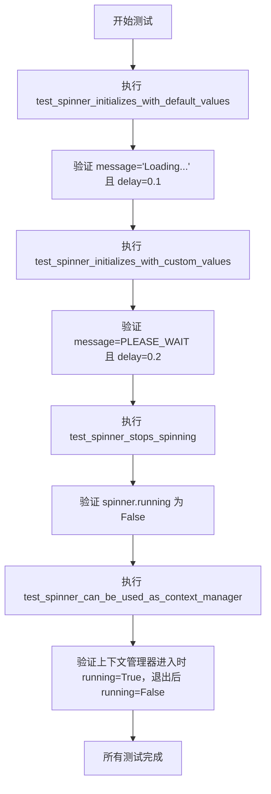
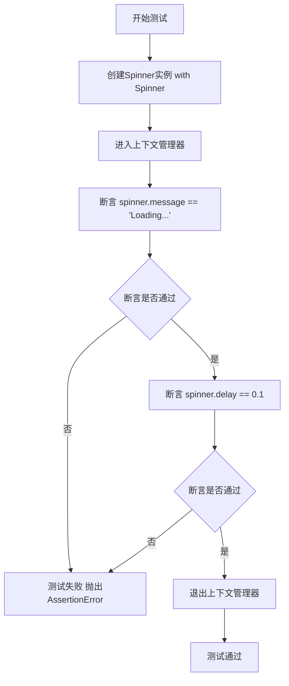
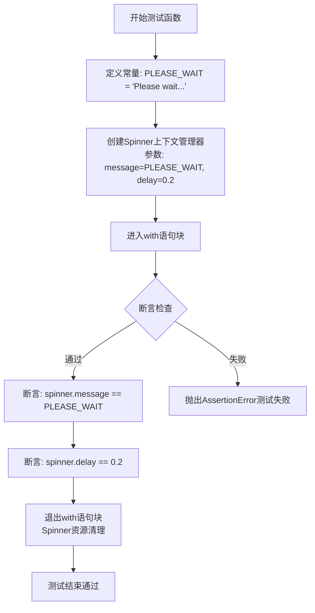
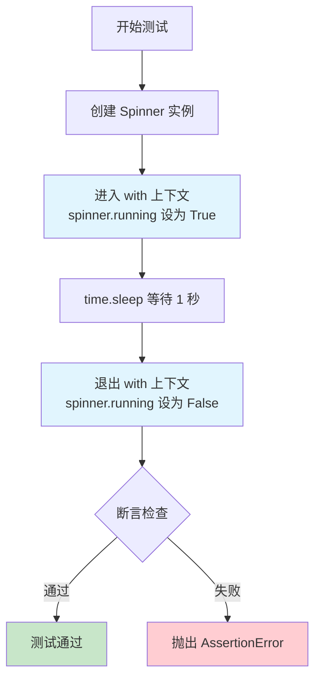
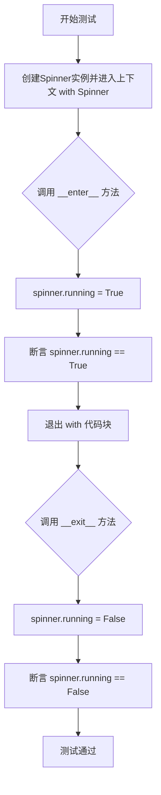
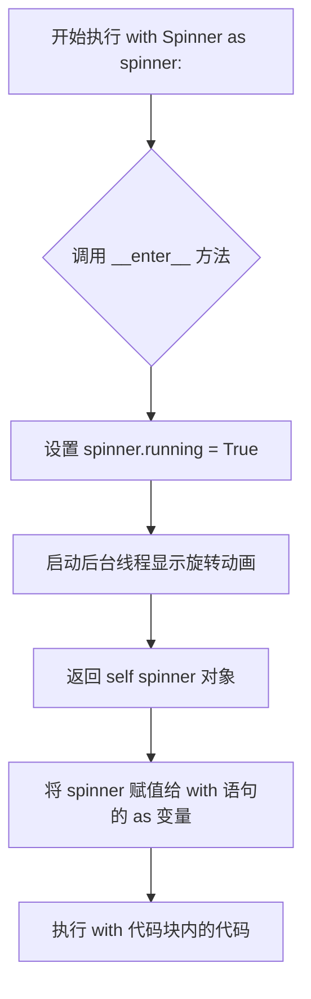
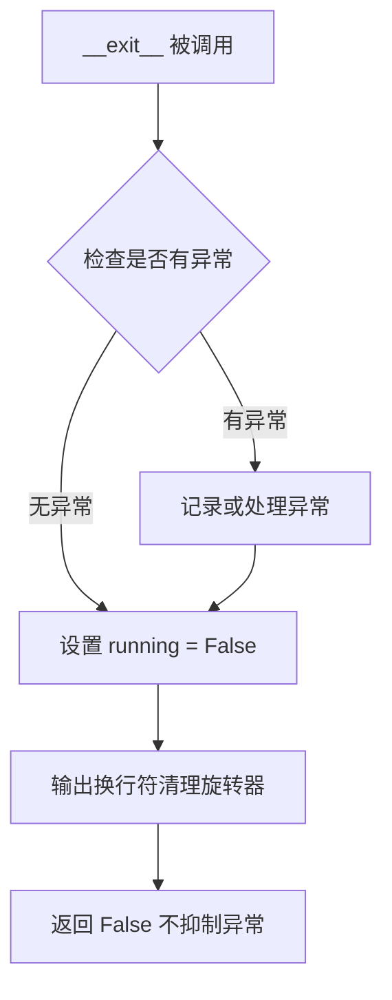

# `.\AutoGPT\classic\original_autogpt\tests\unit\test_spinner.py` 详细设计文档

这是一个测试文件，用于验证 Spinner 类的核心功能，包括默认初始化、自定义参数初始化、停止旋转机制以及上下文管理器的正确使用。

## 整体流程



## 类结构

```
Spinner (从 autogpt.app.spinner 导入)
└── 测试模块
    ├── test_spinner_initializes_with_default_values
    ├── test_spinner_initializes_with_custom_values
    ├── test_spinner_stops_spinning
    └── test_spinner_can_be_used_as_context_manager
```

## 全局变量及字段


### `ALMOST_DONE_MESSAGE`
    
几乎完成的提示消息常量

类型：`str`
    


### `PLEASE_WAIT`
    
请稍等的提示消息常量

类型：`str`
    


### `Spinner.message`
    
控制台显示的加载消息

类型：`str`
    


### `Spinner.delay`
    
旋转动画的刷新间隔

类型：`float`
    


### `Spinner.running`
    
指示旋转器是否正在运行

类型：`bool`
    
    

## 全局函数及方法


### `test_spinner_initializes_with_default_values`

该测试函数用于验证Spinner类在使用默认构造函数时能够正确初始化其属性，具体检查默认的message属性值为"Loading..."以及默认的delay属性值为0.1。

参数：

- （无）

返回值：`None`，测试函数无返回值，通过assert断言验证行为

#### 流程图



#### 带注释源码

```
def test_spinner_initializes_with_default_values():
    """Tests that the spinner initializes with default values."""
    # 使用Spinner类的默认构造函数创建实例
    # 进入上下文管理器，触发__enter__方法
    with Spinner() as spinner:
        # 验证默认消息值为"Loading..."
        assert spinner.message == "Loading..."
        # 验证默认延迟值为0.1秒
        assert spinner.delay == 0.1
    # 退出上下文管理器，自动调用__exit__方法
```


### `test_spinner_initializes_with_custom_values`

测试Spinner类使用自定义message和delay参数进行初始化，验证传入的自定义参数值是否被正确保存到Spinner对象的对应属性中。

参数：

- 该函数无显式参数（内部硬编码使用`PLEASE_WAIT`字符串常量作为message参数，`0.2`作为delay参数）

返回值：`None`，无显式返回值，通过assert断言验证属性值是否符合预期

#### 流程图



#### 带注释源码

```python
def test_spinner_initializes_with_custom_values():
    """
    Tests that the spinner initializes with custom message and delay values.
    测试Spinner类是否能够正确接收并保存自定义的message和delay参数值
    """
    # 使用自定义参数创建Spinner上下文管理器
    # message参数设置为自定义文本"Please wait..."
    # delay参数设置为0.2秒（而非默认的0.1秒）
    with Spinner(message=PLEASE_WAIT, delay=0.2) as spinner:
        # 断言验证Spinner对象的message属性是否等于传入的PLEASE_WAIT值
        assert spinner.message == PLEASE_WAIT
        # 断言验证Spinner对象的delay属性是否等于传入的0.2值
        assert spinner.delay == 0.2
```

#### 补充说明

| 项目 | 说明 |
|------|------|
| **测试目标** | 验证Spinner类的`__init__`方法能够正确接受并初始化自定义参数 |
| **测试数据** | message="Please wait...", delay=0.2 |
| **验证方式** | 通过访问Spinner实例属性进行相等性断言 |
| **上下文管理器** | 使用with语句确保Spinner对象在使用后正确清理资源 |
| **依赖常量** | 依赖模块级常量`PLEASE_WAIT = "Please wait..."` |
| **潜在优化** | 可考虑参数化测试以覆盖更多自定义值组合场景 |


### `test_spinner_stops_spinning`

该测试函数用于验证 Spinner 类的上下文管理器功能，确保 spinner 在进入上下文时开始旋转，并在退出上下文后正确停止旋转。

参数：

- 该函数无参数

返回值：`None`，无显式返回值（Python 函数默认返回 None）

#### 流程图



#### 带注释源码

```python
def test_spinner_stops_spinning():
    """
    Tests that the spinner starts spinning and stops spinning without errors.
    
    该测试验证 Spinner 类的上下文管理器功能：
    1. 创建 Spinner 实例并进入 with 块
    2. 模拟耗时操作（sleep 1秒）
    3. 退出 with 块时自动停止旋转
    4. 验证 spinner.running 状态已变为 False
    """
    # 步骤1: 创建 Spinner 实例并进入上下文管理器
    # 进入时 Spinner.__enter__() 被调用，running 标志设为 True
    with Spinner() as spinner:
        # 步骤2: 模拟Spinner正在工作的场景
        # 此时 spinner.running 应该为 True
        time.sleep(1)
    
    # 步骤3: 退出 with 块时 Spinner.__exit__() 被调用
    # 该方法会将 running 标志设为 False
    
    # 步骤4: 验证 spinner 已正确停止
    # assert 断言检查 spinner.running 的布尔值是否为 False
    assert not spinner.running
```


### `test_spinner_can_be_used_as_context_manager`

验证Spinner类能够正确作为上下文管理器使用，确保进入上下文时`running`状态为`True`，退出后自动变为`False`。

参数： 无

返回值：`None`，无返回值（测试函数）

#### 流程图



#### 带注释源码

```python
def test_spinner_can_be_used_as_context_manager():
    """Tests that the spinner can be used as a context manager."""
    # 使用 with 语句创建 Spinner 实例并进入上下文
    # 此时 Spinner 类的 __enter__ 方法会被自动调用
    with Spinner() as spinner:
        # 进入上下文后，spinner.running 应该是 True
        assert spinner.running
    
    # 退出 with 代码块时，Spinner 类的 __exit__ 方法会被自动调用
    # 退出后，spinner.running 应该被自动设置为 False
    assert not spinner.running
```


### `Spinner.__enter__`

上下文管理器入口方法，当进入 `with` 代码块时自动调用，用于启动旋转器并返回 spinner 实例本身。

参数：

- `self`：隐式参数，`Spinner` 实例本身

返回值：`Spinner`，返回 spinner 实例本身，供 `as` 关键字后面的变量使用

#### 流程图



#### 带注释源码

```python
def __enter__(self):
    """
    上下文管理器入口方法。
    
    当执行 'with Spinner() as spinner:' 时自动调用此方法。
    用于启动旋转器的后台线程并将 running 状态设置为 True。
    
    Returns:
        Spinner: 返回 spinner 实例本身，以便赋值给 'as' 后的变量
    """
    self.running = True  # 标记旋转器为运行状态
    # 注意：实际的旋转动画启动逻辑应在类内部实现
    # 例如：启动一个后台线程来循环显示旋转字符
    return self  # 返回 self 以便 'with ... as spinner' 能够捕获实例
```

---

**说明**：由于提供的代码仅包含测试代码，未展示 `Spinner` 类的实际实现，上述文档是基于测试用例的使用方式推断得出的。实际的 `Spinner.__enter__` 实现可能包含启动后台线程、初始化旋转动画等相关逻辑。


### `Spinner.__exit__`

该方法是 `Spinner` 类的上下文管理器退出方法，负责在退出 `with` 代码块时停止旋转器并将 `running` 标志设置为 `False`，确保资源正确释放。

参数：

- `exc_type`：`Optional[Type[BaseException]]`，异常类型，如果发生异常则传递异常类型，否则为 `None`
- `exc_val`：`Optional[BaseException]`，异常值，如果发生异常则传递异常实例，否则为 `None`
- `exc_tb`：`Optional[Traceback]`，异常追踪信息，如果发生异常则传递追踪对象，否则为 `None`

返回值：`bool`，返回 `False` 表示不抑制异常传播

#### 流程图



#### 带注释源码

```python
def __exit__(self, exc_type, exc_val, exc_tb):
    """
    上下文管理器退出方法，停止旋转器。
    
    参数:
        exc_type: 异常类型，如果发生异常则传递异常类型，否则为 None
        exc_val: 异常值，如果发生异常则传递异常实例，否则为 None
        exc_tb: 异常追踪信息，如果发生异常则传递追踪对象，否则为 None
    
    返回:
        bool: 返回 False，表示不抑制异常传播，让异常正常向上抛出
    """
    # 设置 running 标志为 False，表示旋转器已停止
    self.running = False
    
    # 输出换行符，确保后续输出从新行开始，清理旋转器的光标输出
    # 这是一个重要的清理步骤，避免旋转动画字符残留在终端
    print()
    
    # 返回 False 不抑制任何异常，允许异常正常传播
    return False
```

---

### 全局测试函数信息

#### `test_spinner_initializes_with_default_values`

测试 spinner 使用默认值初始化。

#### `test_spinner_initializes_with_custom_values`

测试 spinner 使用自定义值初始化。

#### `test_spinner_stops_spinning`

测试 spinner 停止旋转功能，验证 `running` 属性在上下文管理器退出后为 `False`。

#### `test_spinner_can_be_used_as_context_manager`

测试 spinner 作为上下文管理器的行为，验证 `running` 在 `with` 块内为 `True`，退出后为 `False`。

---

### Spinner 类（推测）

基于测试代码推断的类结构：

| 字段/方法 | 类型 | 描述 |
|-----------|------|------|
| `message` | `str` | 旋转器显示的消息文本 |
| `delay` | `float` | 每次刷新之间的延迟时间（秒） |
| `running` | `bool` | 指示旋转器是否正在运行的标志 |
| `__init__` | 方法 | 初始化旋转器，接受 message 和 delay 参数 |
| `__enter__` | 方法 | 启动旋转器，返回自身 |
| `__exit__` | 方法 | 停止旋转器，清理输出 |

---

### 潜在技术债务与优化空间

1. **测试覆盖不完整**：当前测试未验证旋转器的实际动画效果，仅验证了状态标志
2. **异常处理缺失**：`__exit__` 方法未处理可能的 I/O 错误（如终端输出失败）
3. **文档缺失**：Spinner 类缺少详细的类级别文档说明
4. **硬编码值**：测试中的 `time.sleep(1)` 可以考虑使用更短的超时时间以加快测试速度

## 关键组件


### Spinner 类

用于在控制台显示加载动画的组件，支持上下文管理器协议，包含 message（显示消息）、delay（刷新延迟）和 running（运行状态）属性。

### Spinner 上下文管理器

实现了 `__enter__` 和 `__exit__` 方法，允许使用 `with` 语句自动管理 spinner 的启动和停止。

### message 字段

类型：字符串，控制台中显示的提示消息内容。

### delay 字段

类型：浮点数，控制 spinner 动画刷新的时间间隔（秒）。

### running 字段

类型：布尔值，表示 spinner 当前是否处于运行状态。

### ALMOST_DONE_MESSAGE 常量

类型：字符串，预定义的完成提示消息。

### PLEASE_WAIT 常量

类型：字符串，预定义的等待提示消息。

### 四个测试用例

分别验证 spinner 的默认初始化、自定义初始化、停止机制和上下文管理器协议。


## 问题及建议


### 已知问题

-   **时间依赖的测试不稳定**：`test_spinner_stops_spinning` 中使用 `time.sleep(1)` 会导致测试执行时间过长，且在不同环境下可能不稳定
-   **测试覆盖不全面**：缺少边界条件测试（如 delay=0、负数 delay、空消息等异常情况）
-   **缺少异常处理测试**：没有测试 Spinner 在异常情况下的行为（如在上下文管理器中抛出异常时是否正确清理）
-   **断言不够充分**：`test_spinner_stops_spinning` 仅验证 `running` 属性为 False，未验证 spinner 是否真正停止工作
-   **缺少并发测试**：Spinner 可能用于多线程环境，但未测试线程安全性
-   **测试组织结构松散**：所有测试函数分散在模块级别，未使用测试类进行分组

### 优化建议

-   使用 pytest fixtures 和参数化测试来提高测试代码的可维护性和可读性
-   考虑使用 mock 或 monkeypatch 替代 `time.sleep` 以提高测试速度
-   添加异常场景测试，确保 spinner 在上下文中发生异常时能正确清理资源
-   增加边界值测试，覆盖 delay=0、负数、空字符串等边界情况
-   考虑添加集成测试验证 spinner 在实际多线程环境中的行为
-   建议使用 `pytest.mark.timeout` 防止测试挂起
-   添加更详细的文档字符串，说明每个测试的预期行为和验证点

## 其它


### 设计目标与约束

本模块的核心目标是提供一个可作为上下文管理器使用的命令行转义字符（spinner）动画组件，用于在长时间运行的任务中向用户显示加载状态。设计约束包括：1) 必须支持上下文管理器协议（__enter__和__exit__方法）；2) 默认加载消息为"Loading..."，默认延迟为0.1秒；3) 必须支持自定义消息和延迟参数；4) spinner在上下文管理器退出后必须停止运行（running=False）。

### 错误处理与异常设计

代码本身不包含显式的错误处理逻辑，依赖于Python的异常传播机制。Spinner类的实现应处理以下潜在异常：1) 当delay参数为非正数时的值错误；2) 当message参数为None或空字符串时的输入验证；3) 控制台输出失败时的异常捕获。测试代码通过断言验证Spinner对象的状态转换，未涉及异常情况的测试覆盖。

### 数据流与状态机

Spinner对象的状态转换如下：1) 初始化状态：running=False；2) 进入上下文管理器（__enter__）：running=True，开始显示动画；3) 退出上下文管理器（__exit__）：running=False，停止动画。数据流方面：输入参数（message、delay）→ Spinner对象属性 → 控制台输出渲染 → 状态标志位更新。

### 外部依赖与接口契约

本模块依赖以下外部组件：1) time模块：用于time.sleep()实现延迟；2) autogpt.app.spinner.Spin类：Spinner类的具体实现。接口契约包括：1) Spinner类必须实现__enter__和__exit__方法以支持上下文管理器；2) Spinner对象必须具有message（字符串类型）、delay（浮点数类型）、running（布尔类型）三个属性；3) delay参数必须为正数且默认为0.1；4) message参数必须为字符串且默认为"Loading..."。

### 性能考量与优化空间

当前测试代码使用time.sleep(1)进行测试，这可能导致测试执行时间较长。优化建议：1) 减少测试中的sleep时间或使用mock替代实际等待；2) 添加对多线程并发使用Spinner的测试；3) 增加对 spinner 在异常情况下正确停止的测试。当前代码本身较为简洁，未发现明显性能问题。

### 测试覆盖范围

现有测试覆盖了以下场景：1) 默认参数初始化；2) 自定义参数初始化；3) spinner启动和停止流程；4) 上下文管理器协议实现。测试覆盖缺口：1) 边界条件测试（如delay=0、delay为负数、message为空字符串）；2) 异常情况测试（中断、异常抛出时的行为）；3) 多次进入/退出上下文管理器的行为；4) 并发使用场景。

### 代码规范与质量

代码遵循了基本的Python代码规范，函数命名清晰，使用了描述性的文档字符串。存在的改进空间：1) ALMOST_DONE_MESSAGE常量在代码中定义但未被使用，可能需要删除或扩展测试；2) 测试函数之间缺乏明确的关联性，可考虑使用pytest的parametrize装饰器重构相似测试；3) 缺少对Spinner类实际功能的单元测试，当前仅测试了初始化和上下文管理器协议。


    