# `.\AutoGPT\classic\original_autogpt\tests\unit\test_utils.py` 详细设计文档

这是一个Python测试文件，用于测试autogpt.app.utils模块中的实用工具函数，包括从网络获取公告、获取最新公告、获取当前Git分支、从响应中提取JSON以及设置环境配置值等功能。

## 整体流程

```mermaid
graph TD
A[开始测试] --> B{测试用例类型}
B --> C[网络请求测试]
B --> D[文件操作测试]
B --> E[Git操作测试]
B --> F[JSON解析测试]
B --> G[环境变量配置测试]
C --> C1[test_get_bulletin_from_web_success]
C --> C2[test_get_bulletin_from_web_failure]
C --> C3[test_get_bulletin_from_web_exception]
D --> D1[test_get_latest_bulletin_no_file]
D --> D2[test_get_latest_bulletin_with_file]
D --> D3[test_get_latest_bulletin_with_new_bulletin]
D --> D4[test_get_latest_bulletin_new_bulletin_same_as_old_bulletin]
E --> E1[test_get_current_git_branch]
E --> E2[test_get_current_git_branch_success]
E --> E3[test_get_current_git_branch_failure]
F --> F1[test_extract_json_from_response]
F --> F2[test_extract_json_from_response_wrapped_in_code_block]
F --> F3[test_extract_json_from_response_wrapped_in_code_block_with_language]
F --> F4[test_extract_json_from_response_json_contained_in_string]
G --> G1[test_set_env_config_value_updates_existing_key]
G --> G2[test_set_env_config_value_uncomments_and_updates_disabled_key]
G --> G3[test_set_env_config_value_adds_new_key]
```

## 类结构

```
Test Module (test_utils.py)
├── Fixtures
│   ├── valid_json_response
│   ├── invalid_json_response
│   ├── mock_env_file_path
│   ├── mock_env_file
│   └── mock_environ
├── 网络请求测试组 (test_get_bulletin_from_web_*)
├── 文件操作测试组 (test_get_latest_bulletin_*)
├── Git操作测试组 (test_get_current_git_branch_*)
├── JSON解析测试组 (test_extract_json_from_response_*)
└── 环境配置测试组 (test_set_env_config_value_*)
```

## 全局变量及字段


### `env_file_initial_content`
    
包含环境变量配置示例的多行字符串，用于测试set_env_config_value函数对环境变量文件的读取、修改和添加功能

类型：`str`
    


    

## 全局函数及方法


### `test_get_bulletin_from_web_success`

这是一个测试函数，用于验证当 HTTP 请求成功（状态码 200）时，`get_bulletin_from_web` 函数能够正确从远程 URL 获取公告内容并返回。

参数：

- `mock_get`：`unittest.mock.MagicMock`，用于模拟 `requests.get` 的行为，拦截真实的 HTTP 请求并提供预设的响应数据

返回值：`None`，该函数为测试函数，使用断言进行验证，不返回具体数据

#### 流程图

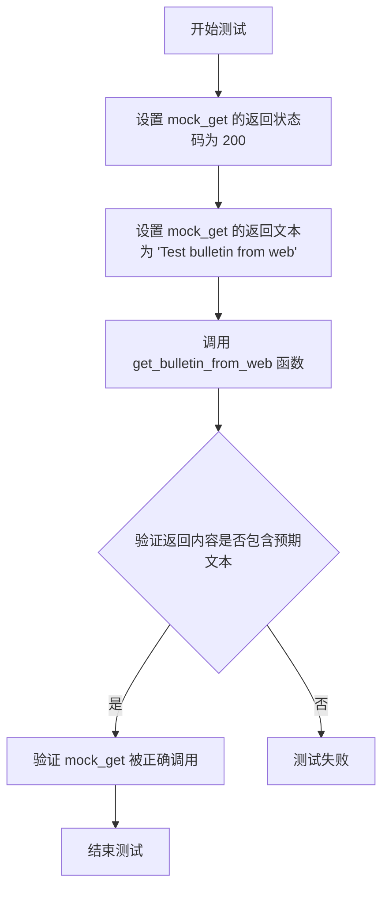

#### 带注释源码

```python
@patch("requests.get")  # 使用 unittest.mock.patch 装饰器模拟 requests.get 函数
def test_get_bulletin_from_web_success(mock_get):
    """
    测试 get_bulletin_from_web 函数在 HTTP 请求成功时的行为
    
    该测试验证：
    1. 当远程服务器返回 200 状态码时，函数能正常获取内容
    2. 函数返回的内容与服务器响应的文本一致
    3. requests.get 被调用时使用了正确的 URL
    """
    # 定义期望的公告内容
    expected_content = "Test bulletin from web"

    # 配置 mock_get 的返回值：状态码为 200（成功）
    mock_get.return_value.status_code = 200
    # 配置 mock_get 的返回值：响应文本为期望内容
    mock_get.return_value.text = expected_content
    
    # 调用被测试的函数
    bulletin = get_bulletin_from_web()

    # 断言：验证返回的公告内容包含预期的文本
    assert expected_content in bulletin
    
    # 断言：验证 requests.get 被调用时使用的 URL 是否正确
    # 这里验证调用了 GitHub 上的原始 AutoGPT 公告文件
    mock_get.assert_called_with(
        "https://raw.githubusercontent.com/Significant-Gravitas/AutoGPT/master/classic/original_autogpt/BULLETIN.md"  # noqa: E501
    )
```


### `test_get_bulletin_from_web_failure`

这是一个测试函数，用于验证当 `get_bulletin_from_web` 函数在接收到 HTTP 404 错误响应时的行为是否符合预期，即返回空字符串。

参数：

- `mock_get`：`unittest.mock.Mock`（或 `MagicMock`），由 `@patch("requests.get")` 装饰器自动注入的模拟对象，用于模拟 `requests.get` 的行为。

返回值：`None`，该函数不返回任何值，仅执行断言验证。

#### 流程图

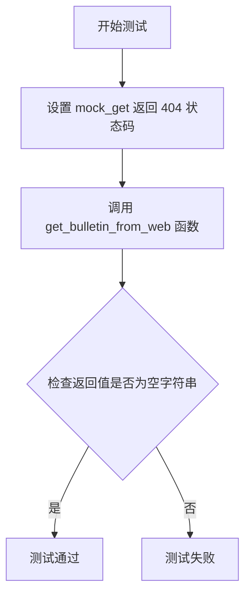

#### 带注释源码

```python
@patch("requests.get")  # 装饰器：模拟 requests.get 函数，避免真实网络请求
def test_get_bulletin_from_web_failure(mock_get):
    """
    测试 get_bulletin_from_web 函数在 HTTP 响应为 404 时的行为。
    
    验证点：
    1. 当远程服务器返回 404 状态码时，函数应返回空字符串
    2. 确保函数正确处理 HTTP 错误响应而不是抛出异常
    """
    # 设置 mock 对象的返回值：状态码为 404（Not Found）
    mock_get.return_value.status_code = 404
    
    # 调用被测试的函数，获取返回值
    bulletin = get_bulletin_from_web()
    
    # 断言：验证在 404 错误情况下，返回值应该是空字符串
    assert bulletin == ""
```

#### 关联信息

**被测试函数**: `get_bulletin_from_web`

- **模块**: `autogpt.app.utils`
- **功能**: 从 GitHub 远程获取公告内容

**测试目的**: 验证 `get_bulletin_from_web` 函数的错误处理能力，确保在 HTTP 404 情况下能够优雅地返回空字符串而不是抛出异常或返回其他不正确的值。

**相关测试用例**:

- `test_get_bulletin_from_web_success`: 测试成功获取公告的情况
- `test_get_bulletin_from_web_exception`: 测试网络请求抛出异常的情况


### `test_get_bulletin_from_web_exception`

该测试函数用于验证 `get_bulletin_from_web` 函数在网络请求抛出异常时的容错能力，确保其返回空字符串。

参数：此测试函数无显式参数（`mock_get` 由 `@patch` 装饰器注入）。

返回值：`None`（测试函数无返回值）。

#### 流程图

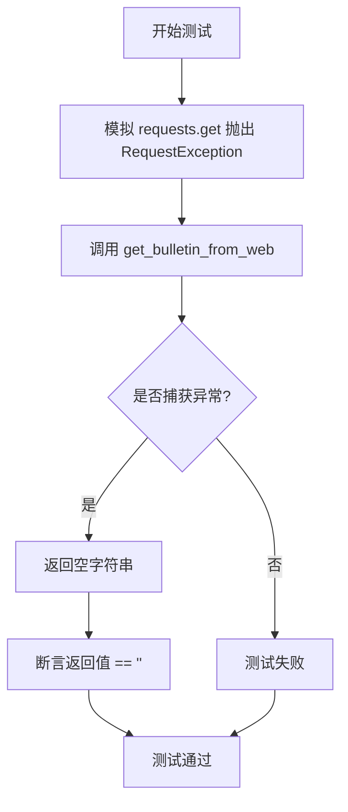

#### 带注释源码

```python
@patch("requests.get")  # 装饰器：模拟 requests.get 函数,避免实际网络请求
def test_get_bulletin_from_web_exception(mock_get):
    """
    测试 get_bulletin_from_web 函数在网络请求异常时的行为
    
    预期行为: 当 requests.get 抛出任何 RequestException 时,
    get_bulletin_from_web 应捕获异常并返回空字符串
    """
    # 步骤1: 设置 mock 对象,使其抛出 RequestException 异常
    # side_effect 用于模拟请求过程中可能发生的各种错误
    # 如网络超时、连接错误、DNS 解析失败等
    mock_get.side_effect = requests.exceptions.RequestException()
    
    # 步骤2: 调用被测试的函数
    # 期望该函数能优雅地处理异常而不是崩溃
    bulletin = get_bulletin_from_web()
    
    # 步骤3: 验证函数返回空字符串
    # 这是容错设计的体现 - 允许功能降级而不是抛出未处理异常
    assert bulletin == ""
```


### `test_get_latest_bulletin_no_file`

该测试函数用于验证当本地公告文件不存在时，`get_latest_bulletin()` 函数能够正确返回新的公告内容，并正确设置 `is_new` 标志为 `True`。

参数：此函数无参数

返回值：`None`，该函数为测试函数，不返回任何值，仅通过断言验证行为

#### 流程图

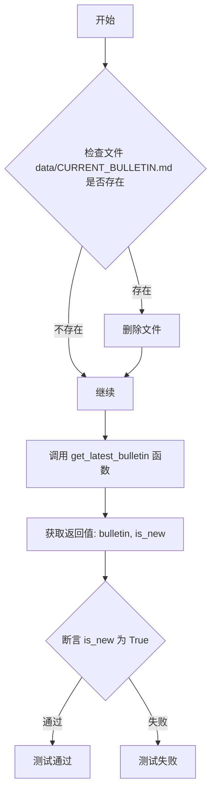

#### 带注释源码

```python
def test_get_latest_bulletin_no_file():
    """
    测试当本地公告文件不存在时，get_latest_bulletin 函数的行为。
    
    预期行为：
    - 如果 data/CURRENT_BULLETIN.md 文件不存在
    - 调用 get_latest_bulletin() 会从网络获取新公告
    - 返回的 is_new 参数应为 True，表示获取到了新的公告
    """
    
    # 检查公告文件是否存在，如果存在则删除
    # 这样模拟第一次运行程序时没有本地缓存公告文件的场景
    if os.path.exists("data/CURRENT_BULLETIN.md"):
        os.remove("data/CURRENT_BULLETIN.md")

    # 调用 get_latest_bulletin 获取最新公告
    # 返回值为元组 (bulletin_content, is_new_flag)
    bulletin, is_new = get_latest_bulletin()
    
    # 断言 is_new 为 True，验证函数正确识别这是新的公告
    # 因为本地没有文件，所以获取到的应该是新的网络公告
    assert is_new
```


### `test_get_latest_bulletin_with_file`

该测试函数用于验证当本地存在公告文件（`data/CURRENT_BULLETIN.md`）时，`get_latest_bulletin` 函数能够正确读取本地文件内容并返回 `is_new` 为 `False`，表明使用的是已有的公告而非从网络获取的新公告。

参数： 无

返回值：`None`，该函数为测试函数，不返回任何值

#### 流程图

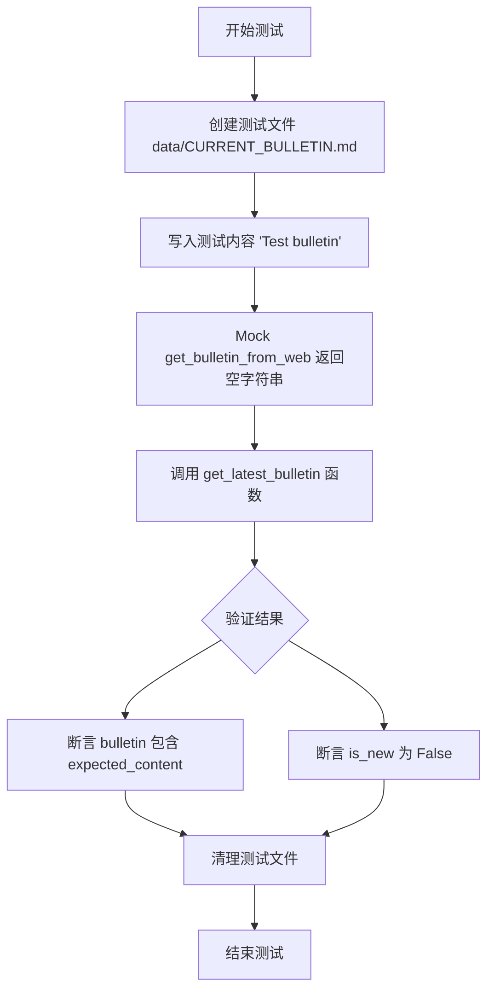

#### 带注释源码

```python
def test_get_latest_bulletin_with_file():
    """
    测试当本地存在公告文件时，get_latest_bulletin 函数的行为。
    预期：读取本地文件内容，is_new 应为 False
    """
    # 定义预期的公告内容
    expected_content = "Test bulletin"
    
    # 创建本地公告文件并写入测试内容
    # 使用 utf-8 编码确保跨平台兼容性
    with open("data/CURRENT_BULLETIN.md", "w", encoding="utf-8") as f:
        f.write(expected_content)

    # Mock get_bulletin_from_web 函数，使其返回空字符串
    # 模拟网络请求失败或无新公告的情况
    with patch("autogpt.app.utils.get_bulletin_from_web", return_value=""):
        # 调用被测试的函数
        bulletin, is_new = get_latest_bulletin()
        
        # 断言：返回的 bulletin 应包含文件中的内容
        assert expected_content in bulletin
        
        # 断言：is_new 应为 False，表示使用的是本地已有公告
        assert is_new is False

    # 清理测试环境，删除创建的临时文件
    os.remove("data/CURRENT_BULLETIN.md")
```


### `test_get_latest_bulletin_with_new_bulletin`

这是一个测试函数，用于验证当网络上的公告比本地保存的公告更新时，`get_latest_bulletin` 函数能正确检测到新公告并返回相应的标记。

参数： 无

返回值： 无（该函数为测试函数，不返回任何值，通过断言验证逻辑）

#### 流程图

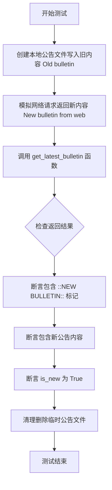

#### 带注释源码

```python
def test_get_latest_bulletin_with_new_bulletin():
    """
    测试场景：当网络上存在新公告时的行为
    
    测试步骤：
    1. 创建本地公告文件并写入旧内容
    2. 模拟网络返回新的公告内容
    3. 调用 get_latest_bulletin 获取公告
    4. 验证返回结果包含新公告标记和内容
    5. 验证 is_new 标志为 True
    6. 清理测试环境
    """
    
    # 步骤1：创建本地公告文件，写入旧内容
    with open("data/CURRENT_BULLETIN.md", "w", encoding="utf-8") as f:
        f.write("Old bulletin")

    # 步骤2：准备期望的新公告内容
    expected_content = "New bulletin from web"
    
    # 步骤3：使用 patch 模拟 get_bulletin_from_web 函数返回新公告
    with patch(
        "autogpt.app.utils.get_bulletin_from_web", return_value=expected_content
    ):
        # 步骤4：调用被测试的函数
        bulletin, is_new = get_latest_bulletin()
        
        # 步骤5：断言验证返回结果
        # 验证1：公告中包含新公告标记
        assert "::NEW BULLETIN::" in bulletin
        # 验证2：公告中包含实际的最新内容
        assert expected_content in bulletin
        # 验证3：确认 is_new 标志为 True，表示检测到新公告
        assert is_new

    # 步骤6：清理测试环境，删除临时创建的公告文件
    os.remove("data/CURRENT_BULLETIN.md")
```


### `test_get_latest_bulletin_new_bulletin_same_as_old_bulletin`

这是一个测试函数，用于验证当从网络获取的最新公告内容与本地存储的旧公告内容完全相同时，`get_latest_bulletin()` 函数能够正确处理这种情况——即不会将 `is_new` 标记为 `True`，并返回本地公告内容。

参数： 无

返回值： 无（`None`），该函数为测试函数，不返回任何值

#### 流程图

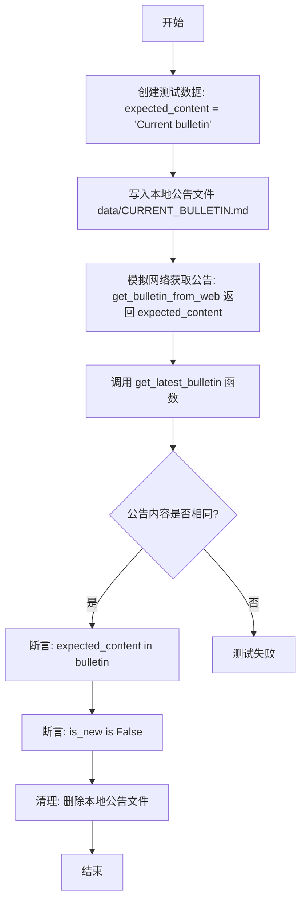

#### 带注释源码

```python
def test_get_latest_bulletin_new_bulletin_same_as_old_bulletin():
    """
    测试场景：当网络获取的最新公告与本地存储的旧公告内容相同时，
    get_latest_bulletin 应返回 False 作为 is_new 标志
    """
    # 1. 准备测试数据：定义预期的公告内容
    expected_content = "Current bulletin"
    
    # 2. 创建本地公告文件，写入当前公告内容
    with open("data/CURRENT_BULLETIN.md", "w", encoding="utf-8") as f:
        f.write(expected_content)

    # 3. 模拟网络获取公告的函数行为，返回与本地相同的内容
    with patch(
        "autogpt.app.utils.get_bulletin_from_web", return_value=expected_content
    ):
        # 4. 调用被测试的函数 get_latest_bulletin
        bulletin, is_new = get_latest_bulletin()
        
        # 5. 断言验证：返回的公告内容包含预期的内容
        assert expected_content in bulletin
        
        # 6. 断言验证：由于内容相同，is_new 应为 False
        assert is_new is False

    # 7. 清理测试环境：删除临时创建的公告文件
    os.remove("data/CURRENT_BULLETIN.md")
```


### `test_get_current_git_branch`

该测试函数用于验证 `get_current_git_branch()` 函数能够正确获取当前 Git 仓库的分支名称，并通过断言确保返回的分支名称不为空字符串。

参数： 无

返回值：`None`，此函数为测试函数，不返回任何值，通过 assert 语句验证 `get_current_git_branch()` 的返回值不为空。

#### 流程图

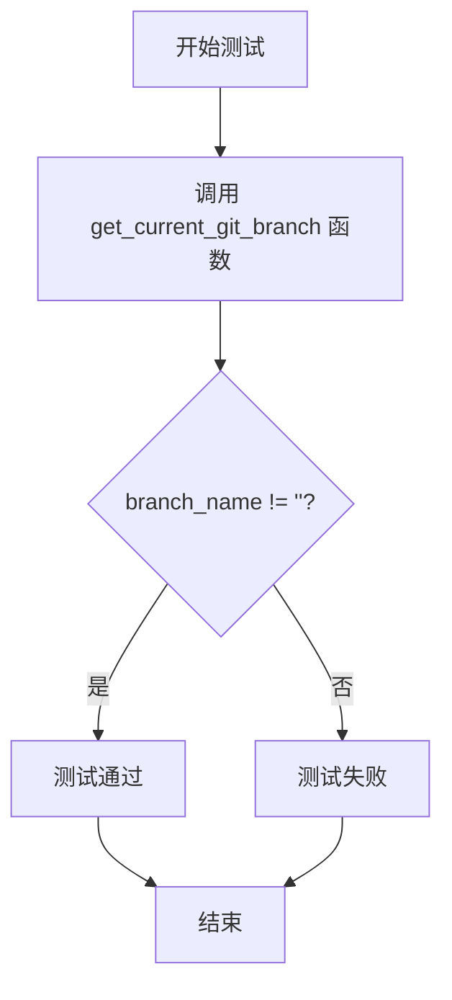

#### 带注释源码

```python
@skip_in_ci  # 装饰器：在 CI 环境中跳过此测试
def test_get_current_git_branch():
    """
    测试 get_current_git_branch 函数是否能获取到有效的分支名称
    
    该测试函数执行以下操作：
    1. 调用 get_current_git_branch() 获取当前 Git 分支名称
    2. 使用 assert 断言确保返回的分支名称不为空字符串
    """
    branch_name = get_current_git_branch()  # 调用被测试的函数获取当前分支名
    assert branch_name != ""  # 断言：确保分支名称不为空，否则测试失败
```


### `test_get_current_git_branch_success`

这是一个单元测试函数，用于测试 `get_current_git_branch` 函数在成功获取 Git 分支时的正确性。该测试通过模拟 Git 仓库对象，验证函数能够正确返回当前的分支名称。

参数：

- `mock_repo`：`<unittest.mock.MagicMock>`，由 `@patch("autogpt.app.utils.Repo")` 装饰器自动注入的 Mock 对象，用于模拟 `Repo` 类的行为

返回值：`None`，该函数为测试函数，无显式返回值，通过 `assert` 断言验证行为

#### 流程图

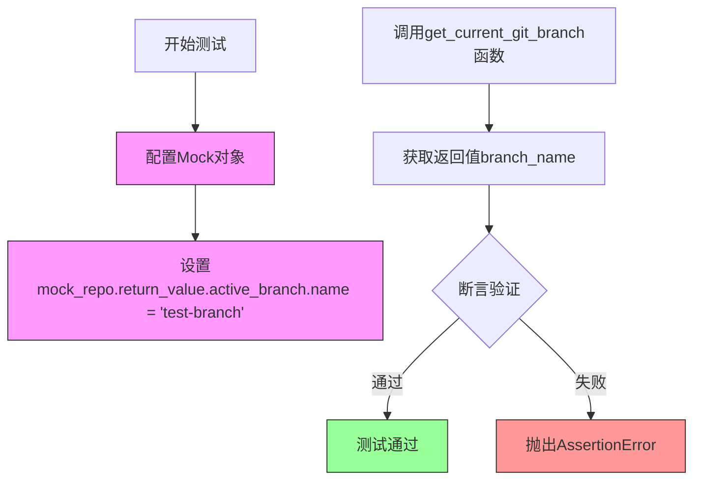

#### 带注释源码

```python
@patch("autogpt.app.utils.Repo")  # 装饰器：拦截autogpt.app.utils模块中的Repo类调用
def test_get_current_git_branch_success(mock_repo):
    """
    测试 get_current_git_branch 函数在成功获取分支时的行为
    
    Args:
        mock_repo: Mock对象，模拟Repo类的返回值
    """
    # Step 1: 配置Mock对象的返回值
    # 模拟Repo实例的active_branch属性的name为'test-branch'
    mock_repo.return_value.active_branch.name = "test-branch"
    
    # Step 2: 调用被测试的函数
    # 执行get_current_git_branch()并获取返回值
    branch_name = get_current_git_branch()
    
    # Step 3: 断言验证
    # 验证返回的分支名称是否为预期的'test-branch'
    assert branch_name == "test-branch"
```

---

### 附：`get_current_git_branch`（被测函数）

由于 `test_get_current_git_branch_success` 是测试 `get_current_git_branch` 的函数，以下是被测函数的参考信息：

参数：

- 无参数

返回值：`<str>`，返回当前 Git 仓库的分支名称，如果无法获取分支则返回空字符串

#### 源码（推断）

```python
def get_current_git_branch():
    """
    获取当前Git仓库的分支名称
    
    Returns:
        str: 当前分支名称，如果不在Git仓库中则返回空字符串
    """
    try:
        # 使用GitPython库的Repo类获取当前仓库信息
        repo = Repo()
        # 返回当前活跃分支的名称
        return repo.active_branch.name
    except InvalidGitRepositoryError:
        # 如果不是有效的Git仓库，返回空字符串
        return ""
```


### `test_get_current_git_branch_failure`

该测试函数用于验证当 Git 仓库无效时，`get_current_git_branch` 函数能够正确捕获 `InvalidGitRepositoryError` 异常并返回空字符串。

参数：

- `mock_repo`：`Mock`，由 `@patch` 装饰器提供的 Mock 对象，用于模拟 `Repo` 类的行为

返回值：`None`，该函数为测试函数，无显式返回值，通过断言验证行为

#### 流程图

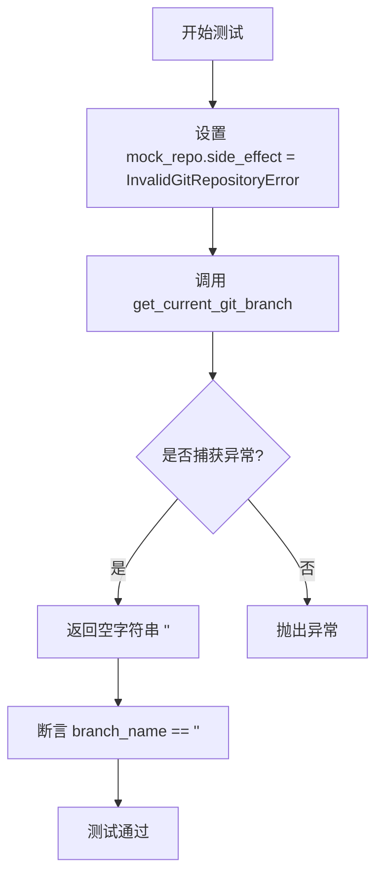

#### 带注释源码

```python
@patch("autogpt.app.utils.Repo")  # 装饰器: 模拟 Repo 类的行为
def test_get_current_git_branch_failure(mock_repo):
    """
    测试 get_current_git_branch 函数在无法获取 Git 仓库时的失败处理。
    
    当 Repo 类抛出 InvalidGitRepositoryError 异常时,
    函数应捕获该异常并返回空字符串。
    """
    # 设置 mock_repo 的 side_effect 为 InvalidGitRepositoryError
    # 这样当代码尝试创建 Repo 实例时会抛出该异常
    mock_repo.side_effect = InvalidGitRepositoryError()
    
    # 调用被测试的函数
    branch_name = get_current_git_branch()
    
    # 断言: 在异常情况下函数应返回空字符串
    assert branch_name == ""
```


### `test_extract_json_from_response`

该测试函数用于验证 `extract_dict_from_json` 函数能够正确地从标准 JSON 字符串中提取并解析出原始的 Python 字典对象。测试通过模拟 OpenAI 格式的响应数据，验证解析功能的正确性和完整性。

参数：

- `valid_json_response`：`dict`，表示一个包含 thoughts 和 command 结构的有效 JSON 响应字典，用于作为测试的输入数据和期望输出

返回值：`None`，该函数为测试函数，使用 assert 断言验证功能，不返回具体值

#### 流程图

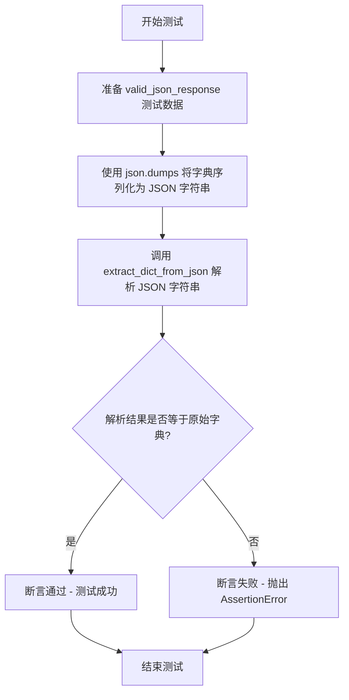

#### 带注释源码

```python
def test_extract_json_from_response(valid_json_response: dict):
    """
    测试 extract_dict_from_json 函数从标准 JSON 字符串中提取字典的能力
    
    参数:
        valid_json_response: dict - 包含完整 thoughts 和 command 结构的标准响应字典
    """
    
    # Step 1: 将 Python 字典对象序列化为 JSON 字符串格式
    # 模拟来自 OpenAI API 的原始响应数据（JSON 字符串格式）
    emulated_response_from_openai = json.dumps(valid_json_response)
    
    # Step 2: 调用待测试的 extract_dict_from_json 函数
    # 该函数应能正确解析 JSON 字符串并返回原始字典对象
    # Step 3: 使用 assert 断言验证解析结果与原始输入字典完全一致
    assert extract_dict_from_json(emulated_response_from_openai) == valid_json_response
```


### `test_extract_json_from_response_wrapped_in_code_block`

该测试函数用于验证 `extract_dict_from_json` 函数能否正确解析被 Markdown 代码块标记（```）包裹的 JSON 字符串。它模拟了来自 OpenAI 的响应格式，该响应将 JSON 数据封装在三个反引号中，确保函数能处理这种常见的 LLM 输出格式。

参数：

- `valid_json_response`：`dict`，一个预先定义好的包含完整 thoughts 和 command 结构的模拟有效 JSON 响应字典，用于作为测试的预期输入和期望输出基准。

返回值：`None`，该函数为测试函数，无显式返回值，通过 `assert` 断言进行验证。

#### 流程图

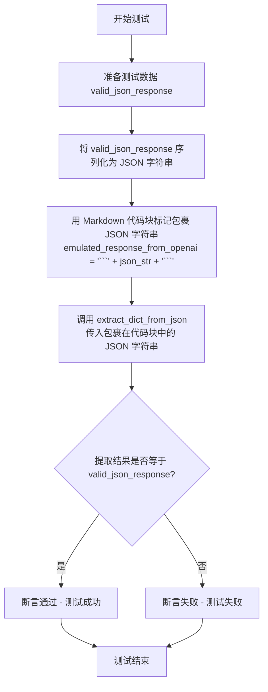

#### 带注释源码

```python
def test_extract_json_from_response_wrapped_in_code_block(valid_json_response: dict):
    """
    测试 extract_dict_from_json 函数是否能正确解析被 Markdown 代码块包裹的 JSON。
    
    该测试模拟了 LLM（如 OpenAI）可能返回的一种常见输出格式：
    将 JSON 包含在 Markdown 代码块标记 ``` 中间。
    
    参数:
        valid_json_response: dict，包含完整 thoughts 和 command 结构的模拟有效 JSON 响应
        
    返回值:
        None（通过 assert 断言验证功能正确性）
    """
    
    # Step 1: 将有效的 JSON 响应字典序列化为 JSON 字符串
    # 例如: '{"thoughts": {...}, "command": {...}}'
    json_str = json.dumps(valid_json_response)
    
    # Step 2: 模拟 LLM 输出格式 - 用 Markdown 代码块标记包裹 JSON
    # 格式: "```" + JSON字符串 + "```"
    # 例如: "```{'thoughts': {...}, 'command': {...}}```"
    emulated_response_from_openai = "```" + json_str + "```"
    
    # Step 3: 调用待测函数 extract_dict_from_json 进行解析
    # 期望该函数能识别并提取出代码块中的 JSON 内容
    result = extract_dict_from_json(emulated_response_from_openai)
    
    # Step 4: 断言解析结果与原始输入字典完全一致
    # 如果函数正确实现了代码块剥离和 JSON 解析，此断言应通过
    assert result == valid_json_response
```


### `test_extract_json_from_response_wrapped_in_code_block_with_language`

该测试函数用于验证 `extract_dict_from_json` 函数能够正确解析被包裹在带有语言标记（如 "json"）的 Markdown 代码块中的 JSON 字符串。它通过构造一个模拟的 OpenAI 响应（格式为 "```json{json_data}```"）来测试解析功能的鲁棒性。

参数：

- `valid_json_response`：`dict`，从 pytest fixture `valid_json_response` 获取的模拟有效 JSON 响应数据，包含 thoughts（包含 text、reasoning、plan、criticism、speak 字段）和 command（包含 name 和 args 字段）两部分结构

返回值：`None`，该函数为测试函数，不返回任何值，通过 assert 断言验证 `extract_dict_from_json` 的解析结果是否与原始 `valid_json_response` 完全相等

#### 流程图

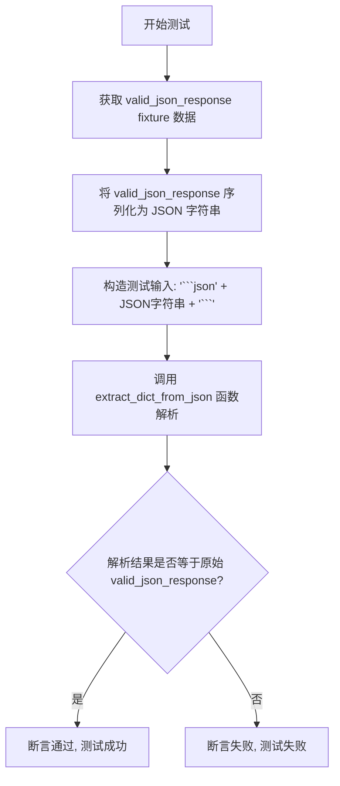

#### 带注释源码

```python
def test_extract_json_from_response_wrapped_in_code_block_with_language(
    valid_json_response: dict,  # 参数: 从 fixture 获取的有效 JSON 响应数据
):
    """
    测试函数: 验证从带语言标记的代码块中提取 JSON 的功能
    
    测试场景: 模拟 OpenAI 返回的 JSON 数据被包裹在 Markdown 代码块中
    例如: ```json{...}```
    """
    # 第一步: 将有效的 JSON 响应字典序列化为 JSON 字符串
    emulated_response_from_openai = "```json" + json.dumps(valid_json_response) + "```"
    
    # 构造说明:
    # - "```json" 是 Markdown 代码块的语言标记前缀
    # - json.dumps(valid_json_response) 将字典转换为 JSON 字符串
    # - "```" 是 Markdown 代码块的后缀
    
    # 第二步: 调用待测试的解析函数
    # extract_dict_from_json 应该能识别并去除代码块标记, 提取出 JSON 内容
    result = extract_dict_from_json(emulated_response_from_openai)
    
    # 第三步: 验证解析结果与原始数据完全一致
    assert result == valid_json_response
```


### `test_extract_json_from_response_json_contained_in_string`

该测试函数用于验证 `extract_dict_from_json` 函数能否从一段包含 JSON 字符串的文本中正确提取出 JSON 对象。测试构造了一个在 JSON 前后分别添加了无关文本的字符串，并断言提取结果与原始 JSON 数据一致。

参数：

- `valid_json_response`：`dict`，有效的 JSON 响应字典，包含测试用的标准数据结构

返回值：`None`，测试函数无返回值，通过 assert 断言验证逻辑正确性

#### 流程图

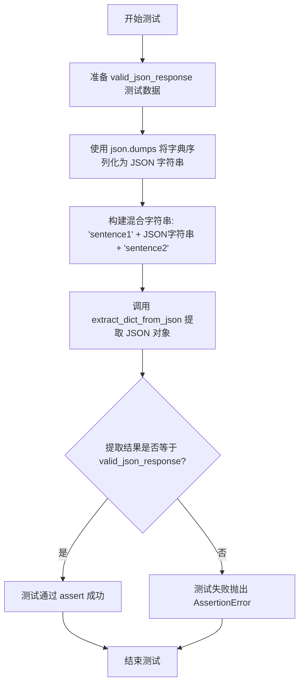

#### 带注释源码

```python
def test_extract_json_from_response_json_contained_in_string(valid_json_response: dict):
    """
    测试 extract_dict_from_json 函数能否从包含 JSON 的字符串中提取 JSON 对象。
    
    该测试验证了当 JSON 字符串被嵌入到一段普通文本中时，
    extract_dict_from_json 函数仍能正确解析并返回原始字典。
    
    参数:
        valid_json_response (dict): 包含有效 JSON 结构的字典，作为预期输出
    """
    
    # 第一步：构造包含 JSON 的混合字符串
    # 使用 json.dumps 将字典序列化为 JSON 格式，然后在前后添加无关文本
    # 这样模拟了真实场景中 OpenAI 返回的可能格式（JSON 被包裹在普通文本中）
    emulated_response_from_openai = (
        "sentence1" + json.dumps(valid_json_response) + "sentence2"
    )
    
    # 第二步：调用被测函数 extract_dict_from_json
    # 期望该函数能够从混合字符串中识别并提取出 JSON 对象
    result = extract_dict_from_json(emulated_response_from_openai)
    
    # 第三步：断言提取结果与原始字典完全一致
    # 如果匹配，测试通过；否则抛出 AssertionError
    assert result == valid_json_response
```


### `test_set_env_config_value_updates_existing_key`

该测试函数用于验证 `set_env_config_value` 函数能够正确更新 `.env` 文件中已存在的环境变量键的值，并同步更新 `os.environ` 字典。

参数：

- `mock_env_file`：`Path`，模拟的 .env 文件路径，由 pytest fixture 提供
- `mock_environ`：`dict`，模拟的 os.environ 字典，由 pytest fixture 提供

返回值：`None`，测试函数无返回值

#### 流程图

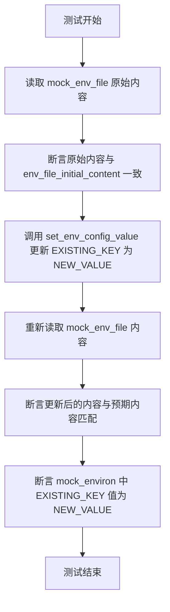

#### 带注释源码

```python
def test_set_env_config_value_updates_existing_key(
    mock_env_file: Path, mock_environ: dict
):
    # Before updating, ensure the original content is as expected
    # 打开环境变量文件，读取所有行
    with mock_env_file.open("r") as file:
        # 断言文件原始内容与初始定义的内容一致
        assert file.readlines() == env_file_initial_content.splitlines(True)

    # 调用被测试的函数，尝试更新已存在的键 EXISTING_KEY
    set_env_config_value("EXISTING_KEY", "NEW_VALUE")
    
    # 更新后重新读取文件内容
    with mock_env_file.open("r") as file:
        content = file.readlines()

    # Ensure only the relevant line is altered
    # 定义期望的文件内容行列表，注意只有 EXISTING_KEY 的值从 EXISTING_VALUE 变为了 NEW_VALUE
    expected_content_lines = [
        "\n",
        "# This is a comment\n",
        "EXISTING_KEY=NEW_VALUE\n",  # existing key + new value
        "\n",
        "## This is also a comment\n",
        "# DISABLED_KEY=DISABLED_VALUE\n",
        "\n",
        "# Another comment\n",
        "UNUSED_KEY=UNUSED_VALUE\n",
    ]
    
    # 断言文件内容与期望内容完全匹配
    assert content == expected_content_lines
    
    # 断言 os.environ 模拟对象中的值也已同步更新
    assert mock_environ["EXISTING_KEY"] == "NEW_VALUE"
```


### `test_set_env_config_value_uncomments_and_updates_disabled_key`

该测试函数验证 `set_env_config_value` 函数能够将 .env 文件中已注释（禁用）的配置键取消注释并更新为新值。测试创建一个包含注释掉的 `DISABLED_KEY` 的 mock .env 文件，然后调用函数将值更新为 "ENABLED_NEW_VALUE"，最后验证该键已被取消注释且值已更新，同时环境变量也已被正确设置。

参数：

-  `mock_env_file`：`Path`，pytest fixture，提供临时 .env 文件的路径，用于模拟 .env 配置文件
-  `mock_environ`：`dict`，pytest fixture，提供模拟的 os.environ 字典，用于验证环境变量的设置

返回值：`None`，该函数为测试函数，使用断言进行验证，无返回值

#### 流程图

```mermaid
flowchart TD
    A[开始测试] --> B[读取原始 .env 文件内容]
    B --> C{验证原始内容是否正确}
    C -->|是| D[调用 set_env_config_value<br/>'DISABLED_KEY', 'ENABLED_NEW_VALUE']
    C -->|否| E[测试失败]
    D --> F[读取更新后的 .env 文件内容]
    F --> G{验证文件内容}
    G -->|内容匹配| H[验证环境变量 mock_environ<br/>['DISABLED_KEY'] == 'ENABLED_NEW_VALUE']
    G -->|内容不匹配| I[测试失败]
    H --> J{环境变量验证}
    J -->|通过| K[测试通过]
    J -->|失败| L[测试失败]
```

#### 带注释源码

```python
def test_set_env_config_value_uncomments_and_updates_disabled_key(
    mock_env_file: Path, mock_environ: dict
):
    # Before adding, ensure the original content is as expected
    # 验证测试前的初始 .env 文件内容是否符合预期
    with mock_env_file.open("r") as file:
        assert file.readlines() == env_file_initial_content.splitlines(True)

    # 调用 set_env_config_value 函数，将被注释的 DISABLED_KEY 取消注释并更新值
    set_env_config_value("DISABLED_KEY", "ENABLED_NEW_VALUE")
    
    # 读取更新后的文件内容
    with mock_env_file.open("r") as file:
        content = file.readlines()

    # Ensure only the relevant line is altered
    # 定义期望的文件内容行，验证 DISABLED_KEY 从注释变为有效键
    expected_content_lines = [
        "\n",
        "# This is a comment\n",
        "EXISTING_KEY=EXISTING_VALUE\n",
        "\n",
        "## This is also a comment\n",
        "DISABLED_KEY=ENABLED_NEW_VALUE\n",  # disabled -> enabled + new value
        "\n",
        "# Another comment\n",
        "UNUSED_KEY=UNUSED_VALUE\n",
    ]
    
    # 验证文件内容是否与期望一致
    assert content == expected_content_lines
    
    # 验证环境变量 mock_environ 中已正确设置 DISABLED_KEY
    assert mock_environ["DISABLED_KEY"] == "ENABLED_NEW_VALUE"
```


### `test_set_env_config_value_adds_new_key`

该测试函数验证 `set_env_config_value` 函数能够正确地将新的键值对添加到环境配置文件中，同时保持现有内容不变，并更新环境变量字典。

参数：

- `mock_env_file`：`Path`，模拟的环境文件路径（pytest fixture）
- `mock_environ`：`dict`，模拟的操作系统环境变量字典（pytest fixture）

返回值：`None`，该函数为测试函数，不返回任何值

#### 流程图

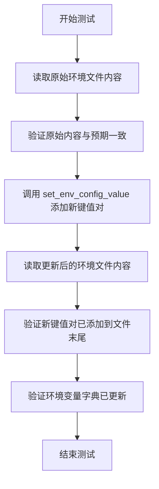

#### 带注释源码

```python
def test_set_env_config_value_adds_new_key(mock_env_file: Path, mock_environ: dict):
    """
    测试 set_env_config_value 函数添加新键值对的功能
    
    参数:
        mock_env_file: 模拟的 .env 文件路径 (pytest fixture)
        mock_environ: 模拟的 os.environ 字典 (pytest fixture)
    """
    
    # 步骤1: 在添加新键值对之前，验证原始文件内容符合预期
    # 原始文件包含注释、已存在的键、已禁用的键等
    with mock_env_file.open("r") as file:
        assert file.readlines() == env_file_initial_content.splitlines(True)

    # 步骤2: 调用被测试的函数，添加一个新的键值对
    # 这应该将 'NEW_KEY=NEW_VALUE' 添加到文件末尾
    set_env_config_value("NEW_KEY", "NEW_VALUE")
    
    # 步骤3: 读取更新后的文件内容
    with mock_env_file.open("r") as file:
        content = file.readlines()

    # 步骤4: 验证新键值对已正确添加到文件末尾，且其他内容保持不变
    expected_content_lines = [
        "\n",
        "# This is a comment\n",
        "EXISTING_KEY=EXISTING_VALUE\n",
        "\n",
        "## This is also a comment\n",
        "# DISABLED_KEY=DISABLED_VALUE\n",
        "\n",
        "# Another comment\n",
        "UNUSED_KEY=UNUSED_VALUE\n",
        "NEW_KEY=NEW_VALUE\n",  # 新键值对被添加到文件末尾
    ]
    assert content == expected_content_lines
    
    # 步骤5: 验证 os.environ 模拟对象中的环境变量也已更新
    assert mock_environ["NEW_KEY"] == "NEW_VALUE"
```

## 关键组件


### JSON解析

从各种格式的文本中提取JSON对象，包括纯JSON、Markdown代码块包裹的JSON、以及嵌入在其他文本中的JSON。

### 环境配置管理

支持更新现有配置项、取消注释并更新被禁用的配置项、以及添加新的配置项到.env文件。

### 公告获取

从GitHub获取最新公告，并支持与本地缓存的公告进行比较，判断是否为新公告。

### Git分支信息获取

获取当前Git仓库的活跃分支名称，包含异常处理机制。


## 问题及建议


### 已知问题

- **路径硬编码问题**：多处使用硬编码路径 `"data/CURRENT_BULLETIN.md"`，缺乏灵活性，难以适配不同环境或配置需求
- **测试资源未正确清理**：多个测试使用 `os.remove()` 删除文件，但若测试中途失败，文件将无法被清理，导致测试污染
- **网络请求URL硬编码**：请求的URL直接写在代码中 `"https://raw.githubusercontent.com/..."`，未通过配置或参数注入，变更不灵活
- **测试隔离性不足**：`test_get_latest_bulletin_no_file` 依赖手动删除文件来准备测试状态，与其他测试执行顺序可能产生冲突
- **异常处理粒度不当**：`get_bulletin_from_web` 使用 `requests.exceptions.RequestException` 捕获所有异常，但未区分网络超时、连接错误等不同情况
- **Git操作错误处理不完善**：`get_current_git_branch` 在 `InvalidGitRepositoryError` 时返回空字符串，但未记录日志，难以排查问题
- **魔法字符串/重复字符串**：公告相关字符串如 `"::NEW BULLETIN::"` 散落在代码中，缺乏常量定义
- **环境变量修改未回滚**：修改 `os.environ` 后未在测试结束时恢复，可能影响后续测试

### 优化建议

- **配置化管理**：将文件路径、URL等硬编码值提取为配置文件或环境变量，使用 `pathlib.Path` 配合默认配置
- **使用 fixture 管理资源**：利用 pytest fixture 的 teardown 机制确保文件清理，使用 `tmp_path` fixture 替代硬编码路径
- **增强异常分类**：对网络请求进行细分处理，区分超时、连接错误、HTTP错误码等，提供更精确的错误反馈
- **添加日志记录**：在 Git 操作失败、文件读取异常等场景添加日志，便于生产环境问题排查
- **定义常量**：将公告前缀等魔法字符串提取为模块级常量，提高代码可维护性
- **改进测试隔离**：每个测试应独立准备环境，不依赖其他测试的执行结果或状态

## 其它


### 设计目标与约束

本模块的设计目标是为一组工具函数提供全面的单元测试，确保核心功能的正确性和稳定性。测试覆盖了四个主要功能模块：公告获取（从Web和本地文件）、Git分支信息获取、JSON解析以及环境配置管理。设计约束包括：测试必须在CI环境中可跳过（如Git分支测试），需要处理网络请求失败、文件不存在、Git仓库无效等异常情况，并确保所有文件操作使用UTF-8编码。

### 错误处理与异常设计

测试代码展示了以下错误处理场景：

1. **网络请求错误处理**：测试了HTTP 404错误和请求异常（RequestException）两种失败情况，两种情况下都返回空字符串`""`作为默认值
2. **Git仓库错误处理**：当Git仓库无效时（InvalidGitRepositoryError），`get_current_git_branch`返回空字符串
3. **文件操作错误处理**：测试了文件不存在时`get_latest_bulletin`的行为，返回`(bulletin, True)`表示新公告

### 数据流与状态机

测试代码验证了以下数据流：

1. **公告数据流**：Web获取 → 文件缓存 → 返回（包含"::NEW BULLETIN::"标记）
2. **JSON解析数据流**：原始文本 → 提取JSON → 字典对象，支持多种包装格式（纯JSON、代码块包裹、带语言标记的代码块）
3. **环境配置数据流**：读取.env文件 → 解析内容 → 定位键值对 → 更新/添加/取消注释 → 写回文件 → 更新os.environ

### 外部依赖与接口契约

测试代码涉及以下外部依赖：

1. **requests库**：用于HTTP GET请求获取远程公告，URL为`https://raw.githubusercontent.com/Significant-Gravitas/AutoGPT/master/classic/original_autogpt/BULLETIN.md`
2. **GitPython库**：使用`git.Repo`获取当前分支信息
3. **文件系统**：通过`pathlib.Path`操作临时目录和.env文件
4. **forge.json.parsing**：提供`extract_dict_from_json`函数进行JSON提取
5. **autogpt.app.utils**：被测模块，提供公告获取、Git分支获取、环境配置等功能

### 性能考虑与资源使用

测试中使用了pytest的`tmp_path`fixture创建临时文件，避免污染真实文件系统。测试完成后通过`os.remove`清理临时文件。对于网络请求测试，使用`@patch`进行模拟，避免实际网络调用。所有测试使用内存中的数据结构处理测试数据，最小化I/O操作。

### 安全性考虑

测试代码验证了以下安全相关功能：`set_env_config_value`函数能够正确处理.env文件中的注释行（#开头的行），不会修改或删除注释，确保配置文件的完整性。测试验证了只修改目标键值对，其他内容保持不变。

### 可测试性设计

代码设计上体现了良好的可测试性：使用纯函数风格（输入确定则输出确定），通过依赖注入（传入文件路径），使用标准库和常见第三方库便于mock。测试使用了pytest的fixture机制管理测试数据和状态，使用`monkeypatch`和`@patch`模拟外部依赖。

### 配置与运维相关

测试涉及以下配置管理场景：公告文件路径为`data/CURRENT_BULLETIN.md`（相对路径），环境配置文件默认为`.env`（通过`autogpt.app.utils.ENV_FILE_PATH`访问），测试使用临时目录隔离真实环境。

### 测试覆盖矩阵

| 测试函数 | 测试场景 | 预期行为 |
|---------|---------|---------|
| test_get_bulletin_from_web_success | HTTP 200响应 | 返回Web内容 |
| test_get_bulletin_from_web_failure | HTTP 404响应 | 返回空字符串 |
| test_get_bulletin_from_web_exception | 请求异常 | 返回空字符串 |
| test_get_latest_bulletin_no_file | 文件不存在 | 标记为新公告 |
| test_get_latest_bulletin_with_file | 文件存在且相同 | 返回文件内容，不标记新 |
| test_get_latest_bulletin_with_new_bulletin | Web内容与本地不同 | 标记新公告并返回新内容 |
| test_get_current_git_branch_success | Git仓库有效 | 返回分支名 |
| test_get_current_git_branch_failure | Git仓库无效 | 返回空字符串 |
| test_extract_json_from_response_* | 各种JSON格式 | 正确提取字典 |
| test_set_env_config_value_updates_existing_key | 更新已存在键 | 更新值和文件 |
| test_set_env_config_value_uncomments_and_updates_disabled_key | 取消注释并更新 | 取消注释并设置新值 |
| test_set_env_config_value_adds_new_key | 添加新键 | 文件末尾添加新键值对 |


    