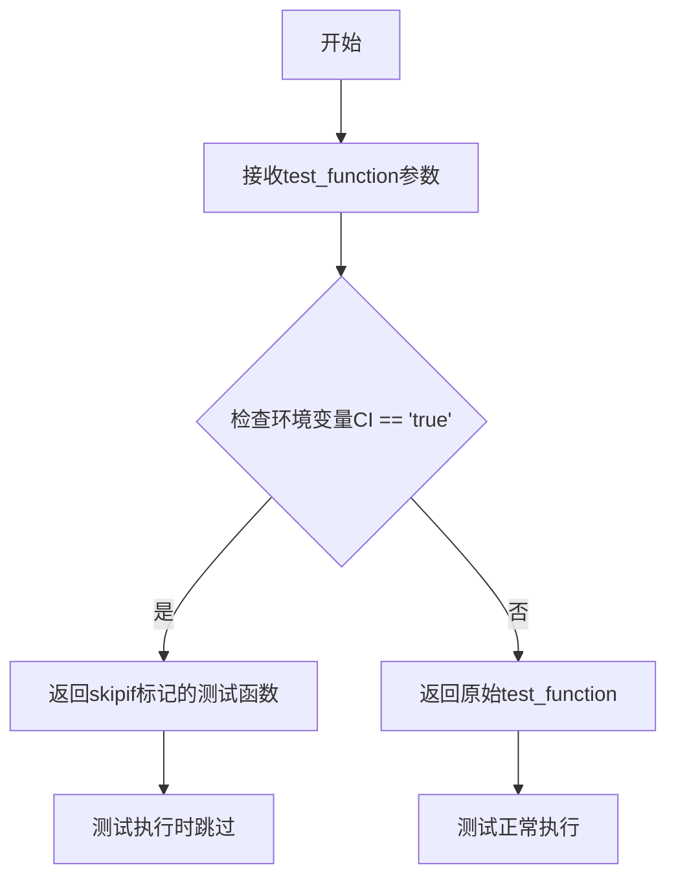
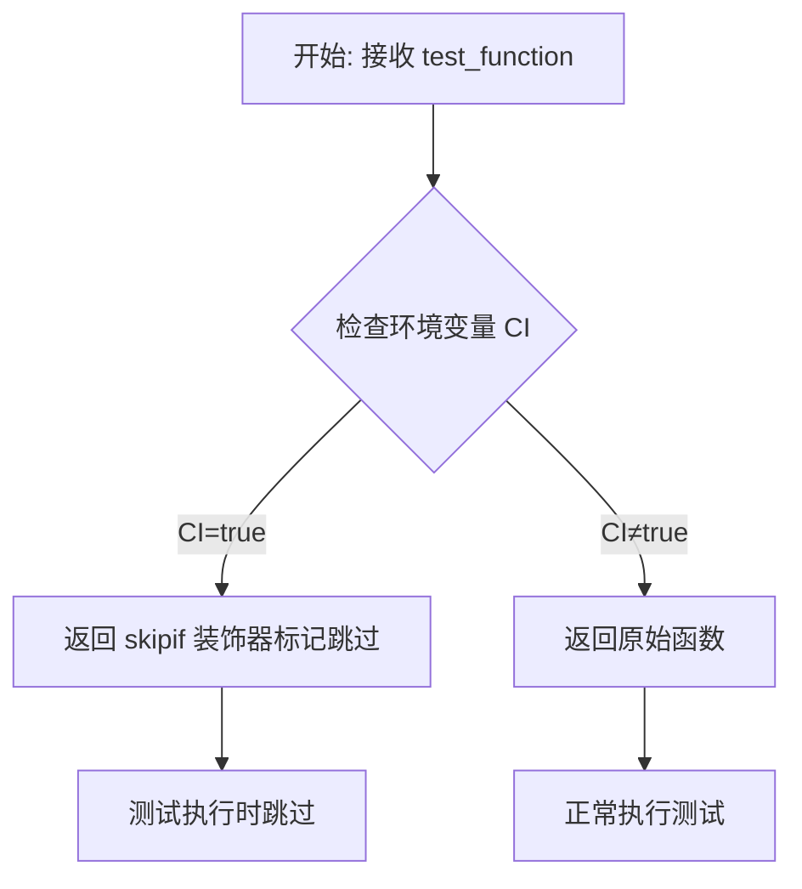

# `.\AutoGPT\classic\original_autogpt\tests\utils.py` 详细设计文档

一个pytest装饰器函数，用于在CI环境（如GitHub Actions）中跳过指定的测试函数，避免在不兼容的CI环境中执行失败的测试。

## 整体流程



## 类结构

```
无类层次结构（该文件仅包含函数和导入）
```

## 全局变量及字段


### `os`
    
Python标准库模块，用于访问操作系统环境变量

类型：`module`
    


### `pytest`
    
Python测试框架模块，提供测试装饰器和跳过标记功能

类型：`module`
    


### `skip_in_ci`
    
装饰器函数，用于在CI环境为true时跳过测试

类型：`function`
    


    

## 全局函数及方法


### `skip_in_ci`

这是一个装饰器函数，用于在 CI（持续集成）环境中根据环境变量 `CI` 的值动态跳过测试。如果检测到在 GitHub Actions 等 CI 环境中运行，会将目标测试标记为跳过。

参数：

- `test_function`：`Callable`，需要被装饰的测试函数

返回值：`Callable`，经过 `pytest.mark.skipif` 装饰器处理后的函数

#### 流程图



#### 带注释源码

```python
import os  # 导入 os 模块用于访问环境变量

import pytest  # 导入 pytest 用于创建 skipif 标记


def skip_in_ci(test_function):
    """
    装饰器函数：根据 CI 环境变量决定是否跳过测试
    
    参数:
        test_function: 需要装饰的测试函数
    
    返回:
        经过 skipif 装饰器处理后的函数
    """
    return pytest.mark.skipif(
        os.environ.get("CI") == "true",  # 检查环境变量 CI 是否为 "true"
        reason="This test doesn't work on GitHub Actions.",  # 跳过原因
    )(test_function)  # 应用装饰器到测试函数
```

---

### 关键组件信息

| 组件名称 | 一句话描述 |
|---------|-----------|
| `os.environ.get("CI")` | 获取环境变量 `CI` 的值，用于判断是否在 CI 环境中 |
| `pytest.mark.skipif` | pytest 的条件跳过标记，用于根据条件跳过测试 |
| `test_function` | 被装饰的目标测试函数 |

### 潜在的技术债务或优化空间

1. **硬编码的 CI 值**：只检查 `"true"` 字符串，如果 CI 环境使用其他值（如 `1`、`yes`）会导致判断失效
2. **缺少对其他 CI 平台的支持**：仅提到 GitHub Actions，但其他 CI 平台（如 GitLab CI、Jenkins）的环境变量可能不同
3. **装饰器返回值不明确**：如果 `os.environ.get("CI")` 返回 `None`（变量不存在），条件为 `False`，直接返回原函数，这种行为可以通过文档更明确地说明

## 关键组件


### skip_in_ci 函数

用于在 CI 环境中根据环境变量 `CI` 是否为 `"true"` 来跳过测试的 pytest 标记装饰器工厂函数。


## 问题及建议


### 已知问题

-   **CI环境变量值硬编码**：将CI环境变量值硬编码为字符串"true"，但实际CI环境可能设置不同的值（如"1"、"True"等），导致在某些CI环境中装饰器失效。
-   **仅支持单一CI检测**：仅检查"CI"环境变量，但不同CI平台可能使用不同的环境变量（如GitHub Actions使用"GITHUB_ACTIONS"，CircleCI使用"CIRCLECI"等），覆盖面有限。
-   **缺乏配置灵活性**：装饰器不支持自定义跳过条件，无法根据项目需求扩展其他跳过逻辑。

### 优化建议

-   **增强环境变量检测**：使用更宽松的布尔转换（如将环境变量转换为小写后检查），或支持多个常见的CI环境变量。
-   **提供配置选项**：允许调用者传入自定义的环境变量名和期望值，提高装饰器的通用性。
-   **考虑使用pytest内置的skipif**：可以提供更灵活的标记方式，支持从配置文件读取条件。
-   **添加文档注释**：为装饰器添加docstring，说明其用途、参数和示例用法，提高代码可维护性。


## 其它


### 设计目标与约束

本装饰器的设计目标是提供一个便捷的方式来在CI（持续集成）环境中自动跳过不适用的测试。约束条件包括：只能用于pytest测试函数、需要依赖pytest.mark.skipif装饰器、仅支持环境变量CI的检查。

### 错误处理与异常设计

本代码不涉及复杂的错误处理逻辑。若环境变量CI未定义，os.environ.get("CI")将返回None，条件判断为False，测试将正常执行。若pytest模块未安装，将导致ImportError，需要在使用前确保pytest已正确安装。

### 数据流与状态机

装饰器的工作流程如下：1) 接收待装饰的测试函数；2) 检查环境变量CI的值；3) 若CI="true"，返回带有skipif标记的测试函数，测试将被跳过；4) 若CI不为"true"或未定义，返回原始测试函数，测试正常执行。

### 外部依赖与接口契约

外部依赖包括：Python标准库os模块用于获取环境变量；pytest框架用于创建skipif标记。接口契约：输入参数test_function应为pytest测试函数；返回值应为可调用对象，可作为装饰器使用。

### 使用场景与示例

典型使用场景包括：需要访问外部资源但在CI环境中不可用的测试；依赖特定操作系统功能的测试；在CI中运行不稳定的测试。示例用法：在测试函数上方添加@skip_in_ci装饰器即可。

### 兼容性说明

本代码兼容Python 3.x版本及pytest 3.6+版本。os.environ.get方法在所有支持的Python版本中行为一致。pytest.mark.skipif在较新版本中保持API稳定。

### 性能影响

该装饰器性能开销极低，仅在装饰时执行一次环境变量读取和条件判断。测试执行时几乎没有额外开销。


    