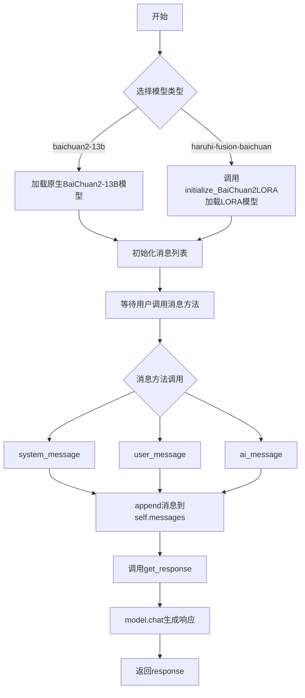
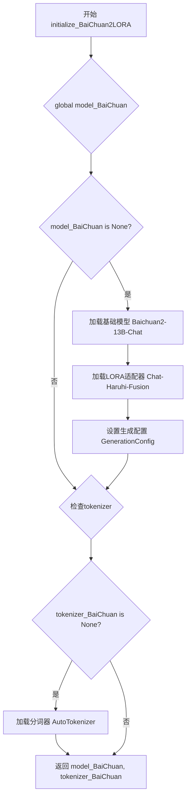
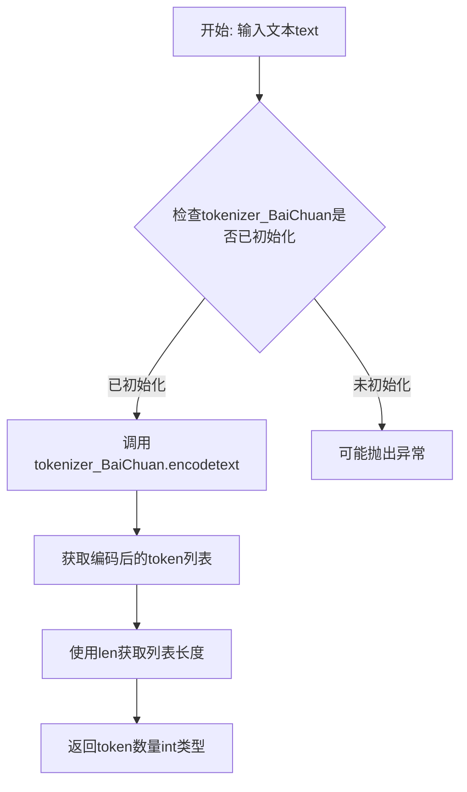
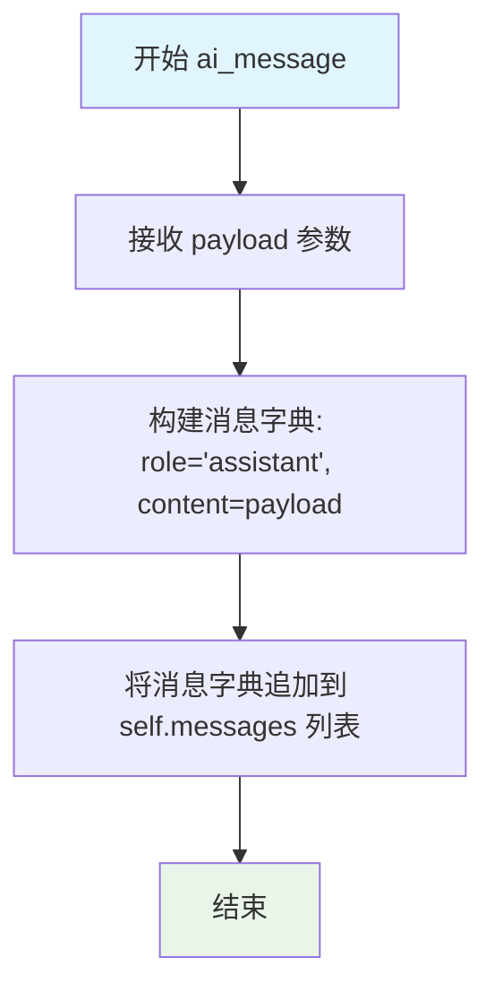
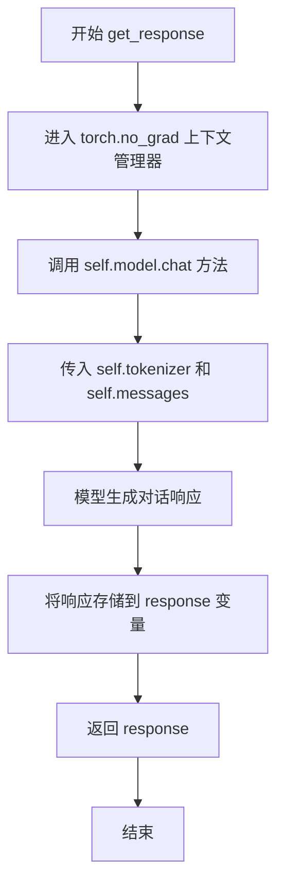
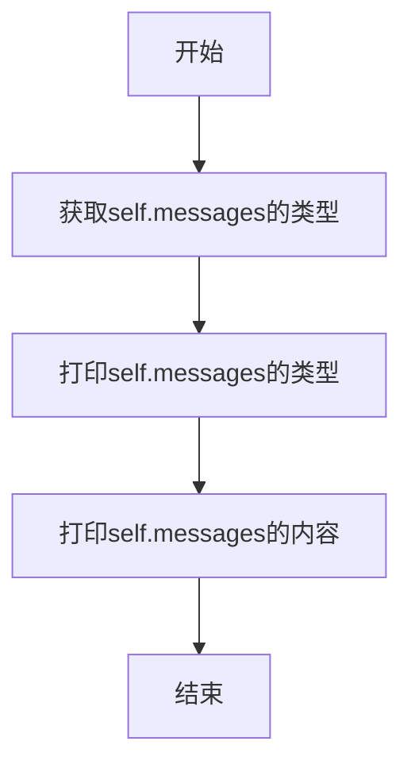

# `Chat-Haruhi-Suzumiya\ChatHaruhi2.0\ChatHaruhi\BaiChuan2GPT.py` 详细设计文档

这是一个基于BaiChuan2-13B-Chat大语言模型的封装类，提供了模型加载（支持原生模型和LORA微调模型）、消息管理（system/user/assistant消息）、对话生成等功能，继承自BaseLLM基类，实现了统一的LLM接口。

## 整体流程



## 类结构

```
BaseLLM (抽象基类)
└── BaiChuan2GPT (BaiChuan2模型封装类)
```

## 全局变量及字段


### `tokenizer_BaiChuan`
    
全局分词器对象，用于对文本进行分词处理BaiChuan模型

类型：`AutoTokenizer`
    


### `model_BaiChuan`
    
全局模型对象，存储经过LoRA适配的BaiChuan2-13B聊天模型实例

类型：`PeftModel`
    


### `BaiChuan2GPT.model`
    
模型实例，存储BaiChuan2大语言模型（可能是原始模型或LoRA适配版本）

类型：`PeftModel`
    


### `BaiChuan2GPT.tokenizer`
    
分词器实例，用于对输入文本进行编码和对输出文本进行解码

类型：`AutoTokenizer`
    


### `BaiChuan2GPT.messages`
    
消息列表，存储对话历史，包含role和content字段的字典

类型：`list`
    
    

## 全局函数及方法


### `initialize_BaiChuan2LORA`

该函数负责初始化百川2代大语言模型（13B参数）的LORA（Low-Rank Adaptation）版本，通过单例模式加载预训练模型、分词器以及LORA适配器，并返回模型和分词器实例供后续对话使用。

参数：
- 无参数

返回值：`Tuple[PeftModel, AutoTokenizer]`，返回加载完成的模型（包含LORA适配器）和分词器元组

#### 流程图



#### 带注释源码

```python
def initialize_BaiChuan2LORA():
    """
    初始化百川2代13B聊天模型的LORA版本（用于角色融合）
    采用单例模式避免重复加载模型资源
    """
    # 声明使用全局变量以保存模型和分词器实例
    global model_BaiChuan, tokenizer_BaiChuan
    
    # ====== 模型初始化部分 ======
    # 仅当模型未加载时执行加载逻辑
    if model_BaiChuan is None:
        # 1. 加载百川2代13B基础预训练模型
        #    - device_map="auto": 自动分配到可用设备（GPU/CPU）
        #    - torch.bfloat16: 使用BF16精度减少显存占用
        #    - trust_remote_code: 允许执行远程代码（百川模型需要）
        model_BaiChuan = AutoModelForCausalLM.from_pretrained(
            "baichuan-inc/Baichuan2-13B-Chat",
            device_map="auto",
            torch_dtype=torch.bfloat16,
            trust_remote_code=True,
        )
        
        # 2. 加载LORA适配器（角色融合权重）
        #    - 将预训练的LORA权重合并到基础模型
        #    - 模型来源: silk-road/Chat-Haruhi-Fusion_Baichuan2_13B
        model_BaiChuan = PeftModel.from_pretrained(
            model_BaiChuan,
            "silk-road/Chat-Haruhi-Fusion_Baichuan2_13B"
        )
        
        # 3. 加载生成配置（温度、top_p等采样参数）
        #    - 确保推理时使用与训练时一致的生成策略
        model_BaiChuan.generation_config = GenerationConfig.from_pretrained(
            "baichuan-inc/Baichuan2-13B-Chat"
        )
    
    # ====== 分词器初始化部分 ======
    # 仅当分词器未加载时执行加载逻辑
    if tokenizer_BaiChuan is None:
        # 加载与模型配套的分词器
        #    - use_fast=True: 使用Rust实现的快速分词器
        #    - trust_remote_code: 允许执行远程自定义分词逻辑
        tokenizer_BaiChuan =  AutoTokenizer.from_pretrained(
            "baichuan-inc/Baichuan2-13B-Chat", 
            use_fast=True, 
            trust_remote_code=True
        )
    
    # 返回模型和分词器供调用方使用
    return model_BaiChuan, tokenizer_BaiChuan
```


### `BaiChuan_tokenizer`

该函数是一个全局工具函数，用于计算给定文本的token数量。它调用预加载的BaiChuan分词器对输入文本进行编码，并返回编码后的序列长度，常用于估算文本在模型处理时的长度或成本。

参数：

- `text`：`str`，需要进行tokenize处理的文本输入

返回值：`int`，返回文本经过BaiChuan分词器编码后的token数量

#### 流程图



#### 带注释源码

```python
def BaiChuan_tokenizer(text):
    """
    使用BaiChuan分词器计算输入文本的token数量
    
    参数:
        text (str): 需要进行tokenize处理的文本
        
    返回值:
        int: 文本编码后的token数量
    """
    # 调用全局变量tokenizer_BaiChuan的encode方法对文本进行编码
    # encode方法会将原始文本转换为模型对应的token ID列表
    # 然后使用len获取列表长度，即为token数量
    return len(tokenizer_BaiChuan.encode(text))
```


### `BaiChuan2GPT.__init__`

该方法是BaiChuan2GPT类的构造函数，负责初始化百川2代大语言模型，支持两种模型变体（baichuan2-13b和haruhi-fusion-baichuan），并根据模型类型加载对应的tokenizer和model实例，同时初始化消息列表。

参数：

- `model`：`str`，可选参数，指定要加载的模型类型，默认为"haruhi-fusion-baichuan"，支持"baichuan2-13b"和"haruhi-fusion-baichuan"两种模式

返回值：`None`，构造函数无返回值

#### 流程图

```mermaid
flowchart TD
    A[开始 __init__] --> B[调用父类 BaseLLM 构造函数]
    B --> C{判断 model 参数}
    C -->|model == "baichuan2-13b"| D[加载 Baichuan2-13B-Chat Tokenizer]
    D --> E[加载 Baichuan2-13B-Chat Model]
    E --> F[设置 Model GenerationConfig]
    F --> K[初始化 self.messages = []]
    C -->|model == "haruhi-fusion-baichuan"| G[调用 initialize_BaiChuan2LORA 函数]
    G --> H[获取 model 和 tokenizer]
    H --> K
    C -->|其他值| I[抛出 Exception]
    I --> J[结束]
    K --> L[结束 __init__]
```

#### 带注释源码

```python
def __init__(self, model = "haruhi-fusion-baichuan"):
    """
    构造函数，初始化BaiChuan2GPT模型实例
    
    参数:
        model (str): 模型名称，支持 "baichuan2-13b" 或 "haruhi-fusion-baichuan"
                     默认为 "haruhi-fusion-baichuan"
    """
    # 调用父类 BaseLLM 的构造函数进行初始化
    super(BaiChuan2GPT, self).__init__()
    
    # 判断传入的模型类型
    if model == "baichuan2-13b":
        # 加载百川2-13B聊天模型的Tokenizer
        self.tokenizer = AutoTokenizer.from_pretrained(
            "baichuan-inc/Baichuan2-13B-Chat",  # HuggingFace模型ID
            use_fast=True,                       # 使用快速tokenizer
            trust_remote_code=True              # 信任远程代码
        ),
        
        # 加载百川2-13B聊天模型的Model
        self.model = AutoModelForCausalLM.from_pretrained(
            "baichuan-inc/Baichuan2-13B-Chat",  # HuggingFace模型ID
            device_map="auto",                  # 自动分配设备
            torch_dtype=torch.bfloat16,         # 使用BF16精度
            trust_remote_code=True              # 信任远程代码
        )
        
        # 从预训练模型加载生成配置
        self.model.generation_config = GenerationConfig.from_pretrained(
            "baichuan-inc/Baichuan2-13B-Chat"
        )
        
    elif model == "haruhi-fusion-baichuan":
        # 使用LORA微调后的融合模型
        # 调用全局初始化函数加载模型和tokenizer
        self.model, self.tokenizer = initialize_BaiChuan2LORA()
        
    else:
        # 模型类型不支持，抛出异常
        raise Exception("Unknown BaiChuan Model! Currently supported: [BaiChuan2-13B, haruhi-fusion-baichuan]")
    
    # 初始化消息列表，用于存储对话历史
    self.messages = []
```


### `BaiChuan2GPT.initialize_message`

该方法用于重置对话消息列表，将 `self.messages` 初始化为空列表，以便开始新的对话会话或清除之前的对话上下文。

参数：
- （无显式参数，隐含参数 `self` 为 `BaiChuan2GPT` 实例）

返回值：`None`，无返回值（该方法直接修改实例属性）

#### 流程图

```mermaid
graph TD
    A[开始 initialize_message] --> B{执行方法}
    B --> C[self.messages = []]
    C --> D[结束]
    
    style B fill:#f9f,stroke:#333
    style C fill:#9f9,stroke:#333
```

#### 带注释源码

```python
def initialize_message(self):
    """
    初始化/重置对话消息列表
    
    该方法将实例的 messages 属性重置为空列表，
    用于开始新的对话会话或清除之前的对话历史。
    
    参数:
        self: BaiChuan2GPT 实例对象
    
    返回值:
        None: 无返回值，直接修改实例属性 self.messages
    """
    self.messages = []  # 将消息列表重置为空列表
```


### `BaiChuan2GPT.ai_message`

将助手（AI）角色生成的消息内容添加到实例的消息历史列表中，用于维护对话上下文。

参数：

- `payload`：`str`，需要添加的AI消息内容

返回值：`None`，该方法直接修改实例的 `messages` 列表属性，无返回值

#### 流程图



#### 带注释源码

```
def ai_message(self, payload):
    """
    将助手（AI）消息添加到消息历史列表中
    
    参数:
        payload (str): AI生成的消息内容
        
    返回值:
        None
    """
    # 创建一个包含role为'assistant'的消息字典，并将payload作为content
    message_dict = {"role": "assistant", "content": payload}
    
    # 将构建的消息字典追加到实例的消息列表中，用于维护对话上下文
    self.messages.append(message_dict)
```


### `BaiChuan2GPT.system_message`

向消息历史记录中添加系统消息，用于设置AI助手的行为上下文或系统提示。

参数：

- `payload`：`str`，需要添加的系统消息内容

返回值：`None`，该方法直接修改实例的 `messages` 列表，无返回值

#### 流程图

```mermaid
flowchart TD
    A[开始 system_message] --> B[接收 payload 参数]
    B --> C[构建消息字典: {"role": "system", "content": payload}]
    C --> D[将消息字典追加到 self.messages 列表]
    D --> E[结束]
```

#### 带注释源码

```python
def system_message(self, payload):
    """
    添加系统消息到消息历史记录
    
    参数:
        payload: 系统消息内容，用于设置AI助手的系统行为或上下文
    """
    # 将系统消息以标准格式添加到消息列表中
    # role 字段标识消息发送者为系统
    self.messages.append({"role": "system", "content": payload})
```


### `BaiChuan2GPT.user_message`

该方法用于将用户消息添加到对话历史记录中，以便后续模型生成回复时使用。它接受用户输入的文本内容，并将其以特定的 JSON 格式追加到消息列表中。

参数：

- `payload`：`str`，用户输入的文本内容，作为消息的主体

返回值：`None`，该方法无返回值，仅修改对象内部的 `messages` 列表

#### 流程图

```mermaid
flowchart TD
    A[开始 user_message] --> B[接收 payload 参数]
    B --> C[构建消息字典: {"role": "user", "content": payload}]
    C --> D[调用 self.messages.append 添加到列表]
    D --> E[结束方法, 返回 None]
```

#### 带注释源码

```python
def user_message(self, payload):
    """
    添加用户消息到对话历史记录中
    
    参数:
        payload (str): 用户输入的文本内容
    
    返回:
        None: 无返回值，仅修改实例的 messages 列表
    """
    # 将用户消息以标准格式添加到消息列表中
    # role 字段标识发送者角色为 "user"
    # content 字段存储用户的实际输入文本
    self.messages.append({"role": "user", "content": payload})
```


### `BaiChuan2GPT.get_response`

该方法通过禁用梯度计算（推理模式）调用 BaiChuan2 模型的聊天接口，基于已累积的消息历史生成对话响应，并返回模型生成的文本内容。

参数：

- 该方法无显式参数（仅包含隐式 `self` 参数）

返回值：`str`，返回 BaiChuan2 模型基于对话历史生成的文本响应内容

#### 流程图



#### 带注释源码

```python
def get_response(self):
    """
    获取模型生成的对话响应
    
    该方法使用 PyTorch 的 no_grad 上下文管理器来禁用梯度计算，
    以推理模式运行模型，从而减少内存占用和提高推理速度。
    然后调用模型的 chat 方法生成对话响应。
    
    Returns:
        str: 模型生成的文本响应
    """
    # 使用 torch.no_grad() 禁用梯度计算，节省显存并提高推理效率
    # 这是模型推理时的标准做法，因为不需要反向传播
    with torch.no_grad():
        # 调用模型的 chat 方法进行对话生成
        # self.tokenizer: 用于对输入文本进行编码
        # self.messages: 包含对话历史的列表 [{'role': 'user', 'content': '...'}, ...]
        # 返回值是模型生成的文本响应（字符串类型）
        response = self.model.chat(self.tokenizer, self.messages)
    
    # 返回生成的对话响应
    return response
```


### `BaiChuan2GPT.print_prompt`

该函数用于打印当前对话消息列表的类型和内容，主要用于调试目的，帮助开发者查看消息队列的当前状态，包括消息的类型（list）以及具体的消息内容列表。

参数：

- `self`：实例方法隐含的当前对象引用，无需显式传递

返回值：`None`，该函数无返回值，仅执行打印操作

#### 流程图



#### 带注释源码

```python
def print_prompt(self):
    """
    打印当前对话消息的类型和内容
    用于调试和查看消息队列的当前状态
    """
    # 打印消息列表的类型，通常是list类型
    print(type(self.messages))
    # 打印消息列表的完整内容，包括所有角色和消息
    print(self.messages)
```

## 关键组件


### 全局模型缓存 (tokenizer_BaiChuan, model_BaiChuan)

全局变量，用于缓存BaiChuan2模型和tokenizer，避免重复加载，实现惰性加载机制

### initialize_BaiChuan2LORA()

初始化BaiChuan2 LORA模型的函数，配置设备映射为auto，使用bfloat16精度，加载预训练基模型和LORA适配器，并设置生成配置

### BaiChuan_tokenizer()

简单的token计数函数，调用tokenizer的encode方法返回文本对应的token数量

### BaiChuan2GPT 类

继承自BaseLLM的BaiChuan2对话生成类，支持baichuan2-13b和haruhi-fusion-baichuan两种模型变体

### 张量精度管理

使用torch.bfloat16进行模型量化，减少显存占用，提升推理效率

### LORA微调集成

通过PeftModel加载LORA适配器，实现低成本模型微调，支持haruhi-fusion-baichuan角色融合模型

### 设备自动映射

使用device_map="auto"实现模型在多设备间的自动分配，优化资源利用

### 消息队列管理

通过self.messages列表维护对话上下文，支持system、user、assistant三种角色消息的添加和管理


## 问题及建议


### 已知问题

-   **全局变量管理不当**：使用全局变量 `tokenizer_BaiChuan` 和 `model_BaiChuan`，在多线程或多次实例化场景下存在竞态条件风险，且不利于单元测试。
-   **代码重复**：模型加载逻辑在 `initialize_BaiChuan2LORA()` 函数和 `BaiChuan2GPT.__init__()` 方法中重复出现，违反 DRY 原则。
-   **硬编码配置**：模型路径、LoRA 路径、精度类型等配置硬编码在代码中，缺乏灵活的配置管理机制。
-   **异常处理缺失**：模型加载、tokenizer 加载、响应生成等关键操作均无异常捕获与处理，网络异常或模型加载失败时程序会直接崩溃。
-   **元组赋值错误风险**：`__init__` 中 `self.tokenizer = AutoTokenizer.from_pretrained(...)` 后多余逗号会创建元组，导致后续调用时类型错误。
-   **内存管理不完善**：`messages` 列表无长度限制，长对话场景可能导致内存持续增长；`torch.no_grad()` 仅包裹了推理调用，未覆盖完整生成流程。
-   **类型注解缺失**：所有方法均无类型提示，影响代码可读性和 IDE 智能提示支持。
-   **设计模式不规范**：全局函数 `initialize_BaiChuan2LORA` 和 `BaiChuan_tokenizer` 应封装为类的私有方法或独立工具类。

### 优化建议

-   **引入配置类**：创建 `ModelConfig` 数据类或配置文件，集中管理模型路径、精度、设备等参数。
-   **实现单例模式或依赖注入**：使用单例模式管理模型实例，或通过工厂类/依赖注入方式创建 `BaiChuan2GPT`，避免全局变量带来的副作用。
-   **提取公共加载逻辑**：将模型和 tokenizer 的加载逻辑封装为独立的 `ModelLoader` 类，消除重复代码。
-   **完善异常处理**：为模型加载、tokenizer 加载、推理生成等关键路径添加 try-except 捕获，区分不同异常类型并给出明确错误信息。
-   **修复元组赋值问题**：移除 `self.tokenizer = ...` 后多余的逗号。
-   **添加消息历史管理**：实现消息列表的最大长度限制或自动摘要机制，防止内存泄漏。
-   **补充类型注解**：为所有方法添加参数和返回值的类型注解，提升代码可维护性。
-   **优化 torch.no_grad 使用范围**：确保整个推理流程在 `torch.no_grad()` 上下文中执行。
-   **添加资源释放方法**：实现 `__del__` 或上下文管理器协议 (`__enter__`/`__exit__`)，支持显式释放 GPU 资源。

## 其它


### 设计目标与约束

本模块旨在提供一个基于Baichuan2-13B聊天模型和LoRA微调版本的统一接口，支持多种模型加载方式（原生模型和融合模型），并遵循BaseLLM抽象基类的规范，实现对话管理功能。约束条件包括：仅支持Python 3.8+环境，需要CUDA支持（device_map="auto"），模型文件较大需确保磁盘空间充足（Baichuan2-13B约26GB），LoRA适配器需要与基础模型版本匹配。

### 错误处理与异常设计

代码中的异常处理主要包括：模型加载失败时抛出RuntimeError（通过transformers库内部处理）；未知模型名称时抛出Exception并提示支持的模型列表；全局变量未初始化时可能引发AttributeError。改进建议：增加网络连接超时处理、模型下载失败的重试机制、GPU内存不足的检测与提示、以及对tokenizer初始化失败的显式处理。

### 数据流与状态机

数据流为：用户通过user_message()添加用户消息 → 通过system_message()可选添加系统消息 → 调用get_response()触发模型推理 → 模型返回响应 → 通过ai_message()存储助手回复。状态机包含三种角色消息：system（系统指令）、user（用户输入）、assistant（模型输出），messages列表按顺序存储构成对话上下文。

### 外部依赖与接口契约

核心依赖包括：torch>=1.9.0、transformers>=4.30.0、peft>=0.3.0、accelerate。模型来源：基础模型baichuan-inc/Baichuan2-13B-Chat来自HuggingFace Hub，LoRA适配器silk-road/Chat-Haruhi-Fusion_Baichuan2_13B同样来自HuggingFace。接口契约：继承BaseLLM类需实现initialize_message()、ai_message()、system_message()、user_message()、get_response()、print_prompt()六个方法。

### 性能考虑与优化空间

性能瓶颈主要在于：首次加载模型时磁盘IO和网络下载耗时较长（约10-30分钟）；模型推理占用GPU显存约28GB（bfloat16）；全局模型单例未实现卸载机制导致显存持续占用。优化方向：实现模型缓存目录自定义、启用 accelerate 的量化功能（如INT8/INT4）、增加推理批处理支持、添加模型热卸载接口、使用flash attention优化推理速度。

### 安全性考虑

trust_remote_code=True允许远程加载自定义代码存在安全风险，建议仅在可信环境中使用；模型输出未经过滤可能包含敏感信息，生产环境需接入内容安全审核；API密钥和模型路径建议通过环境变量配置而非硬编码；LoRA适配器来源需验证完整性防止供应链攻击。

### 配置管理与参数说明

关键配置参数：device_map="auto"自动分配到可用GPU；torch_dtype=torch.bfloat16减少显存占用；use_fast=True使用快速tokenizer；trust_remote_code=True允许执行模型自带代码。建议将模型路径、dtype、device_map等参数提取到配置文件或构造函数参数中，提高灵活性。

### 使用示例与最佳实践

```python
# 初始化LoRA版本
llm = BaiChuan2GPT(model="haruhi-fusion-baichuan")
llm.system_message("你是一个乐于助人的AI助手")
llm.user_message("请介绍一下你自己")
response = llm.get_response()
llm.ai_message(response)
llm.print_prompt()

# 重置对话
llm.initialize_message()
```

最佳实践：复用全局单例避免重复加载模型；根据显存情况选择模型版本；定期清理messages列表防止内存溢出；生产环境部署需考虑模型版本锁定。

### 测试策略建议

单元测试：验证tokenizer功能、消息添加逻辑、异常抛出场景；集成测试：验证模型加载、推理返回结果格式、多轮对话上下文保持；性能测试：测量首次加载时间、推理延迟、显存占用；Mock测试：使用mock替代真实模型进行快速测试。

    