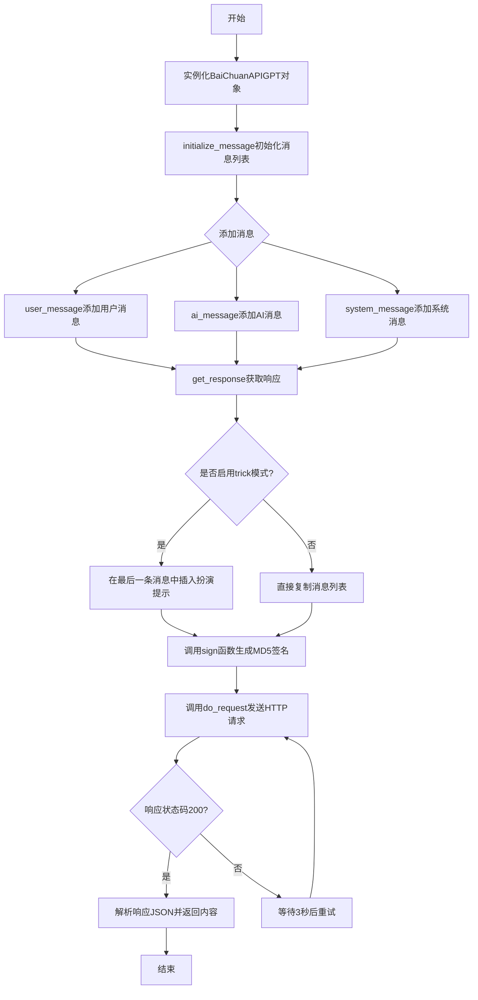
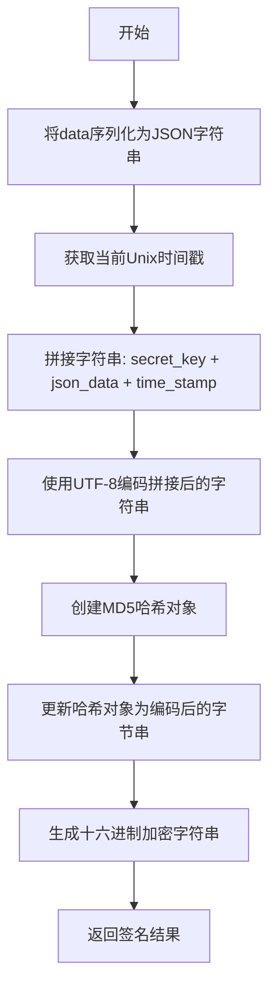
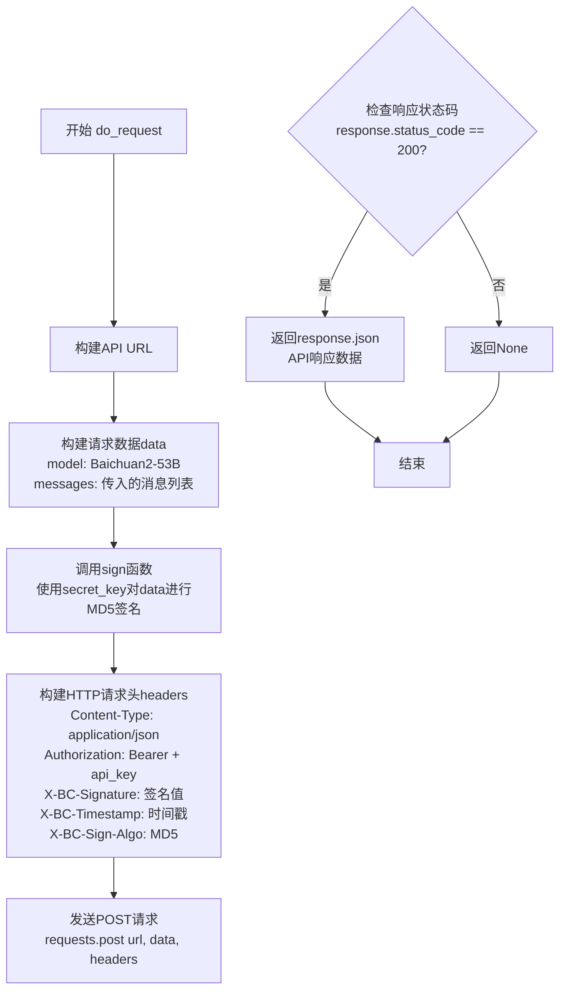
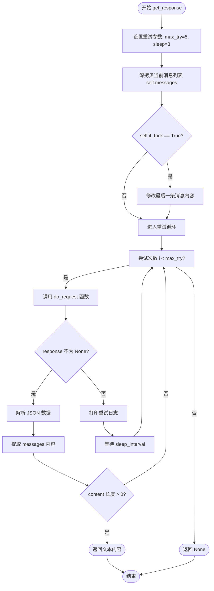

# `Chat-Haruhi-Suzumiya\ChatHaruhi2.0\ChatHaruhi\BaiChuanAPIGPT.py` 详细设计文档

这是一个用于调用百川大语言模型API的Python客户端封装类，提供了消息管理、MD5签名验证、HTTP请求处理等功能，支持角色扮演和对话上下文管理。

## 整体流程



## 类结构

```
BaseLLM (抽象基类)
└── BaiChuanAPIGPT (百川API客户端)
```

## 全局变量及字段


### `BAICHUAN_API_AK`
    
从环境变量获取的百川API访问密钥

类型：`str`
    


### `BAICHUAN_API_SK`
    
从环境变量获取的百川API签名密钥

类型：`str`
    


### `BaiChuanAPIGPT.if_trick`
    
是否启用trick模式的标志位

类型：`bool`
    


### `BaiChuanAPIGPT.api_key`
    
百川API的访问密钥

类型：`str`
    


### `BaiChuanAPIGPT.secret_key`
    
百川API的签名密钥

类型：`str`
    


### `BaiChuanAPIGPT.verbose`
    
是否输出详细日志信息

类型：`bool`
    


### `BaiChuanAPIGPT.model_name`
    
使用的模型名称

类型：`str`
    


### `BaiChuanAPIGPT.messages`
    
消息历史列表

类型：`list`
    
    

## 全局函数及方法


### `sign`

该函数用于生成百川API请求的MD5签名，通过将密钥、时间戳和请求数据拼接后进行MD5加密，生成用于API请求身份验证的签名值。

参数：

- `secret_key`：`str`，用于签名的密钥字符串
- `data`：`dict`，需要签名的请求数据字典

返回值：`str`，返回MD5加密后的十六进制签名字符串

#### 流程图



#### 带注释源码

```python
def sign(secret_key, data):
    """
    生成MD5签名
    
    参数:
        secret_key: 用于签名的密钥
        data: 需要签名的数据字典
    
    返回:
        MD5加密后的签名字符串
    """
    # 1. 将请求数据字典序列化为JSON字符串
    json_data = json.dumps(data)
    
    # 2. 获取当前Unix时间戳（秒级整数）
    time_stamp = int(time.time())
    
    # 3. 拼接签名字符串：密钥 + JSON数据 + 时间戳
    input_string = secret_key + json_data + str(time_stamp)
    
    # 4. 创建MD5哈希对象
    md5 = hashlib.md5()
    
    # 5. 将输入字符串编码为UTF-8字节并更新哈希对象
    md5.update(input_string.encode('utf-8'))
    
    # 6. 获取十六进制加密结果并返回
    encrypted = md5.hexdigest()
    return encrypted
```


### `do_request`

发送HTTP POST请求到百川API的全局函数，用于与百川大模型进行交互。该函数接收消息列表和认证信息，构建包含签名的请求头并发送POST请求，返回API响应或None。

参数：

- `messages`：`List[dict]`，用户与模型的对话消息列表，每个消息包含role和content字段
- `api_key`：`str`，用于API认证的访问令牌（Bearer Token）
- `secret_key`：`str`，用于生成请求签名的密钥

返回值：`dict` 或 `None`，成功时返回API的JSON响应数据，失败时返回None

#### 流程图



#### 带注释源码

```python
def do_request(messages, api_key, secret_key):
    """
    发送HTTP POST请求到百川API
    
    参数:
        messages: 用户与模型的对话消息列表
        api_key: API访问令牌
        secret_key: 用于生成请求签名的密钥
    
    返回:
        成功时返回API的JSON响应，失败时返回None
    """
    # 百川API的聊天接口URL
    url = "https://api.baichuan-ai.com/v1/chat"

    # 构建请求数据，包含模型名称和对话消息
    data = {
        "model": "Baichuan2-53B",  # 固定使用Baichuan2-53B模型
        "messages": messages       # 传入的对话消息列表
    }

    # 使用secret_key对请求数据进行MD5签名
    # 签名算法: secret_key + json_data + timestamp 的MD5值
    signature = sign(secret_key, data)

    # 构建HTTP请求头，包含认证信息和签名
    headers = {
        "Content-Type": "application/json",           # 请求内容类型
        "Authorization": "Bearer " + api_key,          # Bearer Token认证
        "X-BC-Request-Id": "your requestId",          # 请求ID（固定值）
        "X-BC-Timestamp": str(int(time.time())),      # 时间戳
        "X-BC-Signature": signature,                  # MD5签名
        "X-BC-Sign-Algo": "MD5",                       # 签名算法标识
    }

    # 发送POST请求到百川API
    response = requests.post(url, data=json.dumps(data), headers=headers)
    
    # 检查HTTP响应状态码
    if response.status_code == 200:
        # 请求成功，返回JSON响应数据
        return response.json()
    else:
        # 请求失败，返回None
        return None
```


### `BaiChuanAPIGPT.__init__`

该构造函数是BaiChuanAPIGPT类的初始化方法，负责设置API密钥、模型名称、消息列表等核心属性，并支持通过verbose参数控制调试信息输出。

参数：

- `model`：`str`，模型名称，默认为"baichuan-api"
- `api_key`：`str`，API密钥，默认为None，若未提供则从环境变量BAICHUAN_API_AK读取
- `secret_key`：`str`，密钥，默认为None，若未提供则从环境变量BAICHUAN_API_SK读取
- `verbose`：`bool`，是否输出调试信息，默认为False
- `if_trick`：`bool`，是否启用技巧模式，默认为True

返回值：`None`，构造函数无返回值

#### 流程图

```mermaid
flowchart TD
    A[开始 __init__] --> B{检查 if_trick 参数}
    B -->|True| C[设置 self.if_trick = True]
    B -->|False| D[设置 self.if_trick = False]
    C --> E[调用父类 BaseLLM 构造函数]
    D --> E
    E --> F{api_key 是否为 None}
    F -->|是| G[从环境变量 BAICHUAN_API_AK 获取]
    F -->|否| H[使用传入的 api_key]
    G --> I{secret_key 是否为 None}
    H --> I
    I -->|是| J[从环境变量 BAICHUAN_API_SK 获取]
    I -->|否| K[使用传入的 secret_key]
    J --> L[设置 self.api_key 和 self.secret_key]
    K --> L
    L --> M[设置 self.verbose]
    M --> N[设置 self.model_name]
    N --> O[初始化 self.messages = []]
    O --> P{verbose 是否为 True}
    P -->|是| Q[打印模型名称]
    Q --> R{检查 API 密钥是否有效}
    R -->|无效| S[提示设置环境变量]
    R -->|有效| T[结束]
    P -->|否| T
    S --> T
```

#### 带注释源码

```python
def __init__(self, model="baichuan-api", api_key=None, secret_key=None, verbose=False, if_trick = True):
    # 设置技巧模式标志，用于后续判断是否在prompt中添加特殊处理
    self.if_trick = if_trick
    
    # 调用父类BaseLLM的构造函数，完成继承初始化
    super(BaiChuanAPIGPT, self).__init__()
    
    # API密钥设置：优先使用传入的参数，否则从环境变量BAICHUAN_API_AK读取
    self.api_key = api_key or BAICHUAN_API_AK
    
    # 密钥设置：优先使用传入的参数，否则从环境变量BAICHUAN_API_SK读取
    self.secret_key = secret_key or BAICHUAN_API_SK
    
    # 调试模式标志，控制是否输出详细日志信息
    self.verbose = verbose
    
    # 模型名称，默认为"baichuan-api"
    self.model_name = model
    
    # 消息历史列表，用于存储对话上下文
    self.messages = []
    
    # 如果启用调试模式，打印模型名称并检查密钥配置
    if self.verbose:
        print('model name, ', self.model_name)
        if self.api_key is None or self.secret_key is None:
            print('Please set BAICHUAN_API_AK and BAICHUAN_API_SK')
```


### `BaiChuanAPIGPT.initialize_message`

该方法用于初始化（重置）消息列表，将内部维护的消息历史记录清空，以便开始新的对话会话。

参数：
- 无

返回值：`None`（无返回值），该方法仅执行状态修改操作

#### 流程图

```mermaid
flowchart TD
    A[开始 initialize_message] --> B{执行赋值}
    B --> C[self.messages = []]
    C --> D[结束]
    
    style A fill:#e1f5fe
    style C fill:#c8e6c9
    style D fill:#ffcdd2
```

#### 带注释源码

```python
def initialize_message(self):
    """
    初始化消息列表，将消息历史记录重置为空列表
    
    该方法用于清空当前对话的所有历史消息，
    以便开始新一轮的对话交互。
    通常在需要重置对话上下文时调用。
    """
    self.messages = []  # 将消息列表重置为空列表
```


### `BaiChuanAPIGPT.ai_message`

添加AI助手消息到消息列表中，用于构建与百川API交互的对话上下文。该方法根据当前消息列表的状态（是否为空、消息数量的奇偶性）来决定是新增一条助手消息，还是将内容追加到最新的消息中。

参数：

- `payload`：`str`，需要添加的AI助手消息内容

返回值：`None`，该方法无返回值，直接修改实例的 `messages` 属性

#### 流程图

```mermaid
flowchart TD
    A[开始 ai_message] --> B{len(self.messages) == 0?}
    B -->|是| C[调用 self.user_message<br/>添加系统初始化消息]
    B -->|否| D{len(self.messages) % 2 == 1?}
    D -->|是| E[新增助手消息<br/>messages.append<br/>{role: assistant, content: payload}]
    D -->|否| F[追加到最后一条消息<br/>messages[-1].content +=<br/>'\n' + payload]
    C --> G[结束]
    E --> G
    F --> G
```

#### 带注释源码

```
def ai_message(self, payload):
    """
    添加AI助手消息到消息列表
    
    参数:
        payload: str, AI助手的回复内容
    返回:
        None, 直接修改self.messages列表
    """
    # 消息列表为空时，初始化系统提示消息
    if len(self.messages) == 0:
        # 实际添加的是user角色消息，这可能是为了初始化对话上下文
        self.user_message("请根据我的要求进行角色扮演:")
    
    # 如果当前消息数为奇数，说明最后一条是assistant消息，需要新增一条助手消息
    elif len(self.messages) % 2 == 1:
        self.messages.append({"role":"assistant","content":payload})
    
    # 如果当前消息数为偶数，说明最后一条是user消息，将内容追加到最后的assistant消息中
    elif len(self.messages)% 2 == 0:
        # 使用换行符连接原有内容和新的payload
        self.messages[-1]["content"] += "\n"+ payload
```


### `BaiChuanAPIGPT.system_message`

该方法用于向消息历史记录中添加系统提示（system message），将用户提供的 payload 内容以 role 为 "user" 的消息格式添加到 messages 列表中，用于后续与百川API的交互。

参数：

- `self`：实例本身，百ChuanAPIGPT 类实例
- `payload`：`str`，需要添加的系统消息内容

返回值：`None`，该方法直接修改实例的 messages 属性，不返回任何值

#### 流程图

```mermaid
flowchart TD
    A[开始 system_message] --> B{检查 payload}
    B -->|payload 有效| C[创建消息字典]
    C --> D{"role": "user", "content": payload}
    D --> E[self.messages.append 添加到消息列表]
    E --> F[结束]
    
    B -->|payload 为空| F
```

#### 带注释源码

```python
def system_message(self, payload):
    """
    添加系统消息到消息历史记录中
    
    注意：虽然方法名为 system_message，但实际添加到消息列表中的
    role 字段为 "user"，这可能是一个设计上的问题或特殊需求
    
    参数:
        payload (str): 要添加的系统消息内容
        
    返回:
        None: 直接修改 self.messages 列表，无返回值
    """
    
    # 将 payload 作为用户消息添加到消息列表中
    # 消息格式为 {"role": "user", "content": payload}
    self.messages.append({"role":"user","content":payload}) 
```


### `BaiChuanAPIGPT.user_message`

该方法用于向对话消息列表中添加用户消息，根据当前消息列表的奇偶性来判断是追加新消息还是累加到已有消息中。

参数：

- `payload`：`str`，需要添加的用户消息内容

返回值：`None`，该方法无返回值（隐式返回 None）

#### 流程图

```mermaid
flowchart TD
    A[开始 user_message] --> B{检查 messages 长度}
    B -->|长度为偶数| C[向 messages 追加新消息<br/>{'role': 'user', 'content': payload}]
    B -->|长度为奇数| D[在最后一条消息后追加<br/>payload 前换行]
    C --> E[结束]
    D --> E
```

#### 带注释源码

```python
def user_message(self, payload):
    """
    添加用户消息到消息列表
    
    参数:
        payload: 用户输入的消息内容，字符串类型
    """
    # 判断当前消息列表长度是否为偶数
    if len(self.messages) % 2 == 0:
        # 偶数长度时，添加新的用户消息记录
        self.messages.append({"role":"user","content":payload})
        # self.messages[-1]["content"] += 
    # 判断当前消息列表长度是否为奇数
    elif len(self.messages)% 2 == 1:
        # 奇数长度时，在最后一条用户消息后追加新内容
        self.messages[-1]["content"] += "\n"+ payload
```


### `BaiChuanAPIGPT.get_response`

该方法负责与百川大模型API进行交互。它将当前的对话历史（消息列表）发送给API，并实现了失败重试机制。如果 `if_trick` 设置为真，还会在发送前修改最后一条用户消息，注入特定的提示词（Prompt Trick）以引导模型回复风格。最终返回模型生成的文本内容，如果请求失败或重试耗尽则返回 `None`。

参数：

-  无（该方法不接受除 `self` 以外的外部参数）

返回值：

-  `str | None`：成功时返回模型生成的字符串内容；失败或重试次数耗尽时返回 `None`

#### 流程图



#### 带注释源码

```python
def get_response(self):
    """
    获取API响应，处理重试逻辑和Prompt Trick。
    """
    # 最大重试次数
    max_try = 5
    # 重试间隔时间（秒）
    sleep_interval = 3
    
    # 深拷贝当前的消息列表，避免直接修改原始消息历史
    chat_messages = copy.deepcopy(self.messages)
    
    # 如果开启了 trick (if_trick)，则在最后一条消息中插入特定的引导语句
    # 这是一种强制模型模仿特定风格或桥段的Prompt注入技术
    if self.if_trick == True:
        # 取出最后一条消息的内容并按行分割
        lines = chat_messages[-1]["content"].split('\n')
        # 在倒数第二行插入引导语（insert(-1) 会插入到列表倒数第二位之前）
        lines.insert(-1, '请请模仿上述经典桥段进行回复\n')
        # 重新合并消息内容
        chat_messages[-1]["content"] = '\n'.join(lines)

    # 循环尝试请求API
    for i in range(max_try):
        # 调用通用的请求函数
        response = do_request(chat_messages, self.api_key, self.secret_key)
        
        # 如果请求成功（返回了数据）
        if response is not None:
            if self.verbose:
                print('Get Baichuan API response success')
            
            # 从返回的JSON中提取消息数据
            messages = response['data']['messages']
            
            # 如果消息列表不为空，取最后一条assistant的消息作为返回结果
            if len(messages) > 0:
                # strip("\"'") 用于去除模型返回内容可能包裹的首尾引号
                return messages[-1]['content'].strip("\"'")
        else:
            # 请求失败
            if self.verbose:
                print('Get Baichuan API response failed, retrying...')
            # 等待一段时间后重试
            time.sleep(sleep_interval)
            
    # 如果循环结束仍未成功，返回 None
    return None
```


### `BaiChuanAPIGPT.print_prompt`

该方法用于将当前存储在消息列表中的所有消息打印到控制台，消息以角色名（role）和内容（content）的形式呈现，便于调试和查看对话历史。

参数：
- 该方法无显式参数（隐式参数 `self` 为实例本身）

返回值：`None`，该方法无返回值，仅执行打印操作

#### 流程图

```mermaid
flowchart TD
    A[开始 print_prompt] --> B{遍历 self.messages}
    B -->|遍历每个 message| C[提取 message['role']]
    C --> D[提取 message['content']]
    D --> E[打印格式化的消息: role: content]
    E --> B
    B -->|遍历完成| F[结束]
```

#### 带注释源码

```python
def print_prompt(self):
    """
    打印当前消息列表的内容
    将消息列表中的每条消息以 'role: content' 的格式打印到控制台
    用于调试和查看对话历史
    """
    # 遍历实例变量 self.messages（存储对话消息的列表）
    for message in self.messages:
        # 打印每条消息，格式为：角色: 内容
        # message 为字典，包含 'role' 和 'content' 两个键
        # role 表示消息发送者角色（user/assistant/system）
        # content 表示消息的具体内容
        print(f"{message['role']}: {message['content']}")
```

## 关键组件


### 百川API认证模块

负责生成百川API请求所需的MD5签名，确保请求的安全性，包含时间戳和JSON数据的加密处理。

### HTTP请求执行器

封装了与百川API的HTTP通信逻辑，包括请求头的构建、POST请求的发送以及响应状态码的处理，支持失败重试机制。

### BaiChuanAPIGPT客户端类

核心的API调用类，继承自BaseLLM，提供了完整的聊天界面，支持消息历史管理、多角色消息构建、响应获取以及调试信息输出功能。

### 消息管理系统

负责管理聊天会话中的消息历史，支持用户(USER)、助手(ASSISTANT)角色的消息添加和累积，能够自动处理消息的顺序和内容拼接。

### 请求重试机制

在API请求失败时自动进行重试，默认重试5次，每次间隔3秒，确保在网络不稳定时仍能获取有效响应。

### 提示词注入模块

通过if_trick参数控制，在用户最后一条消息中插入特定的引导语句“请请模仿上述经典桥段进行回复”，以影响模型回复风格的技巧性实现。

### 密钥管理模块

从环境变量BAICHUAN_API_AK和BAICHUAN_API_SK读取API凭证，支持在初始化时传入或使用环境变量默认值。

### 消息复制与处理

在获取响应前对消息列表进行深拷贝，避免修改原始消息历史，同时支持对最后一条消息内容的动态修改。


## 问题及建议


### 已知问题

- **签名算法不安全**：使用MD5进行签名，MD5已被证明存在碰撞攻击风险，应使用更安全的HMAC-SHA256等算法
- **API密钥暴露风险**：API Key和Secret Key直接使用，若代码仓库泄露会导致密钥暴露，缺乏加密存储和轮换机制
- **请求ID硬编码**：`X-BC-Request-Id`硬编码为"your requestId"，无法追踪请求来源
- **超时不设置**：`requests.post`未设置timeout参数，可能导致请求无限期等待
- **重试策略简单**：`sleep_interval`固定为3秒，未实现指数退避策略，多次失败时用户体验差
- **错误处理不完善**：`get_response`方法失败时返回None，调用方无法区分是业务返回空还是请求失败
- **消息格式不规范**：`system_message`方法实现错误，将system消息当作user消息处理，不符合OpenAI/百川API的消息格式规范
- **super()调用不规范**：`super(BaiChuanAPIGPT, self).__init__()`是旧式写法，建议使用`super().__init__()`
- **方法命名歧义**：`ai_message`方法名与实际功能不符，实际是处理assistant角色回复
- **硬编码值过多**：URL、模型名称"Baichuan2-53B"等硬编码，缺乏配置管理
- **类型提示缺失**：所有方法均无类型提示，影响代码可读性和IDE支持
- **trick逻辑不清晰**：`if_trick`功能在最后一条用户消息中插入提示语，逻辑隐蔽且国际化支持差

### 优化建议

- 将MD5签名改为HMAC-SHA256，并在环境变量中实现密钥的加密存储和定期轮换
- 为requests请求添加timeout参数(如30秒)，并实现指数退避重试策略(1s→2s→4s→8s)
- 使用UUID生成唯一的request-id，并在异常时记录详细日志
- 区分业务错误和网络错误，自定义异常类或返回包含错误信息的字典
- 修正`system_message`实现，正确添加`{"role": "system", "content": payload}`消息
- 统一使用新式super()调用，添加完整的类型提示(typing)
- 将URL、模型名、超时时间等配置抽取到配置类或配置文件中
- 移除或重构`if_trick`逻辑，将其改为更清晰的后处理回调机制
- 添加__repr__方法提高调试体验，考虑实现上下文管理器或连接池优化

## 其它


### 设计目标与约束

本模块旨在封装百川智能（Baichuan）API的调用，提供一个符合BaseLLM接口标准的客户端类。主要目标包括：1）提供统一的消息管理机制，支持多轮对话；2）实现API请求的签名认证机制；3）支持重试机制以提高调用可靠性；4）提供verbose模式便于调试。约束条件包括：依赖BaseLLM基类、需配置有效的API Key和Secret Key、仅支持Baichuan2-53B模型。

### 错误处理与异常设计

代码中的错误处理主要体现在get_response方法的重试机制上。当API请求失败时，程序会进行最多5次重试，每次间隔3秒。do_request函数在收到非200状态码时返回None，由调用方判断是否成功。若response为空或响应格式不符合预期，get_response会返回None而非抛出异常，可能导致调用方难以区分是API超时还是返回空内容。建议增加异常类型定义，如BaichuanAPIError，并在关键位置抛出具体异常。

### 数据流与状态机

消息数据流遵循标准的ChatGPT格式。状态转换规则：1）initialization状态：messages为空，user_message触发创建首条user消息；2）交替对话状态：严格保持user-assistant交替，ai_message在奇数索引位置追加assistant消息，在偶数索引位置与最后一条user消息合并；3）system消息特殊处理：system_message方法实际添加的是user角色消息，这可能导致角色语义混淆。if_trick参数会在最后一条消息前插入prompt提示词，修改了原始消息内容。

### 外部依赖与接口契约

主要外部依赖包括：requests库用于HTTP请求、hashlib用于MD5签名、json用于数据序列化、copy用于深拷贝、BaseLLM基类。接口契约方面：1）initialize_message重置消息列表；2）ai_message/user_message/system_message接收字符串payload并转换为标准消息格式；3）get_response返回字符串类型的模型回复，失败返回None；4）print_prompt用于调试输出。需要注意的是，system_message的实现与其名称语义不符，实际添加的是user角色消息。

### 安全性考虑

代码存在以下安全隐患：1）API密钥通过环境变量BAICHUAN_API_AK/BAICHUAN_API_SK获取，建议在生产环境中使用更安全的密钥管理方案；2）签名算法使用MD5，存在被碰撞攻击的理论风险，但考虑到时效性和密钥隐私，短期内可接受；3）请求ID使用硬编码字符串"your requestId"，应生成唯一标识；4）timestamp虽然包含在签名中，但未在请求体中传递，服务端无法验证请求时效性，可能存在重放攻击风险。

### 性能优化建议

当前实现存在以下可优化点：1）每次get_response都进行copy.deepcopy操作，当消息历史较长时会有性能开销，可考虑增量更新或引用传递；2）重试间隔采用固定3秒，可改为指数退避策略；3）if_trick字符串插入操作可优化，使用字符串格式化或模板替换；4）消息验证逻辑在ai_message和user_message中重复，可提取为私有方法_validate_message_structure；5）HTTP连接未配置超时时间，可能导致请求阻塞，建议添加timeout参数。

### 配置管理

当前配置通过构造函数参数和环境变量两种方式获取。构造函数支持model、api_key、secret_key、verbose、if_trick五个参数，其中api_key和secret_key优先使用传入值，否则回退到环境变量BAICHUAN_API_AK和BAICHUAN_API_SK。默认模型为"baichuan-api"（实际使用Baichuan2-53B），if_trick默认为True开启提示词注入。建议将API端点URL、超时时间、重试次数等配置项抽取为类常量或配置文件，提高可维护性。

### 版本兼容性说明

代码使用Python 3标准库，依赖的外部包包括requests。requests.post调用未指定timeout参数，需注意在不同版本的requests库中行为可能略有差异。hashlib.md5()在Python 3中已默认支持，无需额外处理。json.dumps默认不保证属性顺序，但API签名使用dumps结果后转为字符串，对顺序无特殊要求。


    