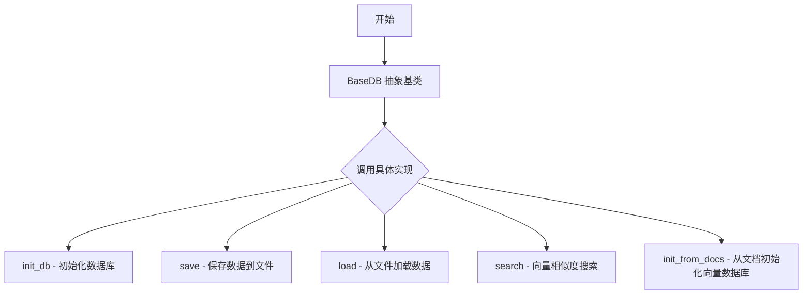
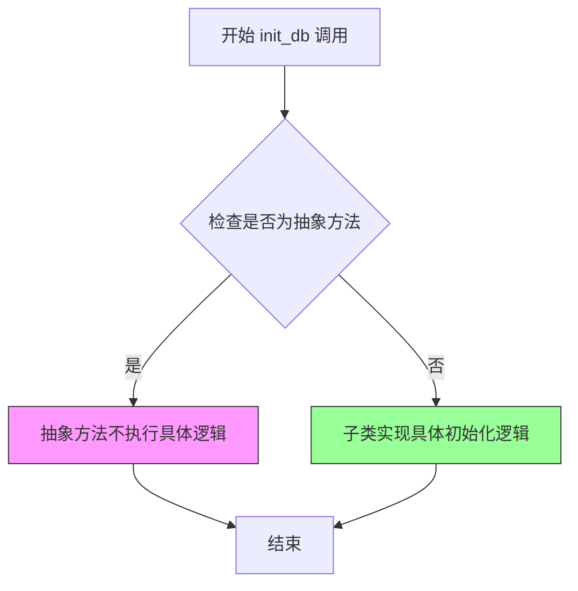
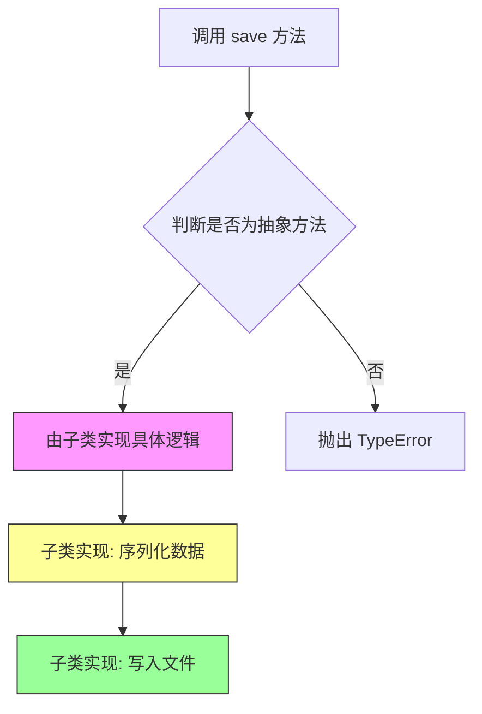
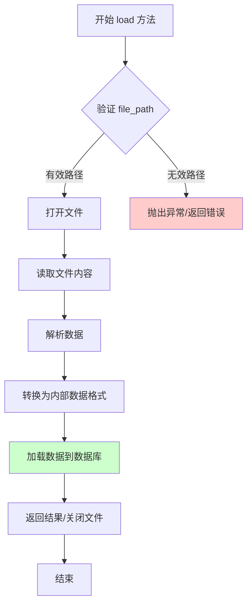
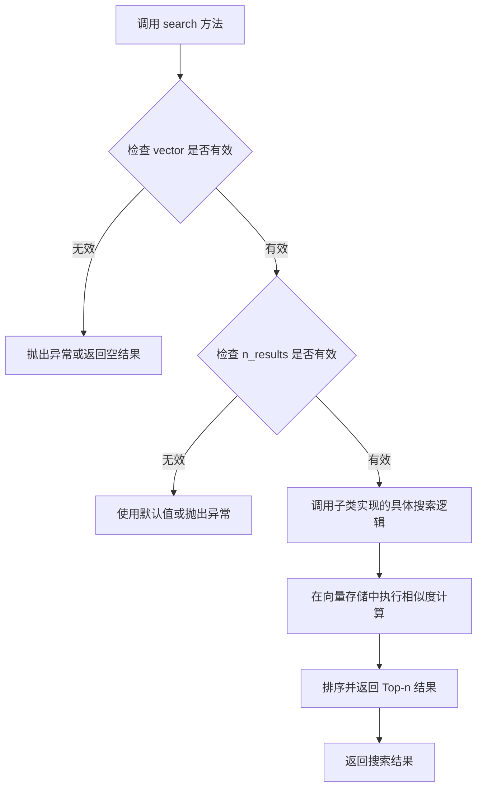
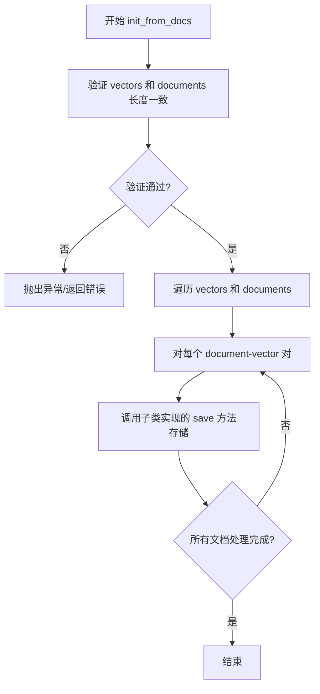

# `Chat-Haruhi-Suzumiya\ChatHaruhi2.0\ChatHaruhi\BaseDB.py` 详细设计文档

该文件定义了一个抽象基类 BaseDB，用于封装向量数据库的通用操作接口，包括数据库初始化、数据保存与加载、向量搜索以及从文档初始化等核心功能，为具体的数据库实现提供统一的抽象规范。

## 整体流程



## 类结构

```
ABC (Python内置抽象基类)
└── BaseDB (自定义抽象基类)
```

## 全局变量及字段


    

## 全局函数及方法


### `BaseDB.init_db`

该方法为 `BaseDB` 抽象类中定义的抽象方法，用于初始化数据库连接或配置，所有非抽象子类必须实现此方法以完成具体的数据库初始化逻辑。

参数：

- `self`：`BaseDB`，调用此方法的数据库实例本身，用于访问类的属性和其他方法

返回值：`None`，无返回值（抽象方法，仅定义接口规范，由子类实现具体逻辑）

#### 流程图



#### 带注释源码

```python
# BaseDB.py
# 导入抽象基类和抽象方法装饰器
from abc import ABC, abstractmethod

class BaseDB(ABC):
    """
    BaseDB 抽象基类
    定义数据库操作的接口规范，所有数据库实现类必须继承此类
    并实现其中的抽象方法
    """
    
    @abstractmethod
    def init_db(self):
        """
        抽象方法：初始化数据库
        用于建立数据库连接、创建必要的表结构或加载配置信息
        注意：此方法为抽象方法，具体实现由子类完成
        """
        pass
    
    @abstractmethod
    def save(self, file_path):
        """保存数据到指定文件路径"""
        pass

    @abstractmethod
    def load(self, file_path):
        """从指定文件路径加载数据"""
        pass

    @abstractmethod
    def search(self, vector, n_results):
        """
        向量搜索方法
        :param vector: 查询向量
        :param n_results: 返回结果数量
        """
        pass

    @abstractmethod
    def init_from_docs(self, vectors, documents):
        """
        从文档初始化数据库
        :param vectors: 向量列表
        :param documents: 文档列表
        """
        pass
```


### `BaseDB.save`

这是一个抽象方法，定义了数据库保存功能的接口规范。具体的数据序列化逻辑和文件写入操作由子类实现，父类仅声明方法签名而不提供具体实现。

参数：

- `file_path`：`str`，指定要保存数据的文件路径

返回值：`None`，该方法为抽象方法，无返回值（方法体为 `pass`）

#### 流程图



#### 带注释源码

```python
@abstractmethod
def save(self, file_path):
    """
    保存数据到指定文件路径的抽象方法
    
    参数:
        file_path (str): 要保存的目标文件路径
        
    注意:
        - 该方法为抽象方法，具体实现由子类完成
        - 子类应覆盖此方法实现具体的数据序列化和文件写入逻辑
        - 应考虑异常处理，如文件路径无效、写入权限不足等情况
    """
    pass
```


### `BaseDB.load`

这是一个抽象方法，用于从指定文件路径加载数据到数据库中。具体实现逻辑由子类决定，通常包括文件读取、解析数据、数据转换和加载到存储引擎等步骤。

参数：

- `file_path`：`str`，指定要加载的文件路径

返回值：`None`，抽象方法默认返回 `None`，具体返回值类型由子类实现决定

#### 流程图



#### 带注释源码

```python
@abstractmethod
def load(self, file_path):
    """
    从指定文件路径加载数据到数据库中。
    
    这是一个抽象方法，具体实现逻辑由子类提供。
    常见的实现包括：
    1. 验证文件路径的有效性
    2. 读取并解析文件内容
    3. 将数据转换为内部存储格式
    4. 将数据加载到数据库引擎中
    
    Args:
        file_path (str): 要加载的文件路径
        
    Returns:
        None: 抽象方法默认返回 None，具体返回值由子类实现定义
    """
    pass
```


### `BaseDB.search`

该方法是 BaseDB 抽象类中定义的搜索接口，用于在向量数据库中根据输入的向量查询与其最相似的 n 个结果，属于向量检索的核心抽象方法，由具体子类实现具体的向量相似度搜索逻辑。

参数：

- `vector`：任意类型（通常为 List[float] 或 numpy.ndarray），用于进行相似度匹配的目标向量
- `n_results`：`int`，指定返回最相似结果的数量

返回值：`任意类型`（通常为 List[Dict] 或类似结构），返回与输入向量最相似的 n 个结果，结果通常包含文档内容、相似度分数等信息

#### 流程图



#### 带注释源码

```python
@abstractmethod
def search(self, vector, n_results):
    """
    在数据库中搜索与给定向量最相似的 n 个结果。
    
    这是一个抽象方法，具体实现由子类完成。子类需要实现向量相似度计算逻辑，
    通常会使用余弦相似度、欧氏距离等度量方式。
    
    参数:
        vector: 用于搜索的查询向量，具体类型取决于子类的实现，
                通常是 List[float] 或 numpy.ndarray 格式的 embedding 向量
        n_results: int，需要返回的最相似结果的数量
    
    返回:
        搜索结果，通常是一个列表，每个元素包含文档内容和相似度分数等信息
    """
    pass
```


### `BaseDB.init_from_docs`

该方法是一个抽象方法，用于从文档集合初始化数据库，将文档及其对应的向量嵌入存储到数据库中，以便后续的相似性搜索。

参数：

- `vectors`：`List[np.ndarray]`，向量列表，每个向量代表对应文档的嵌入表示
- `documents`：`List[str]`，文档列表，需要与向量一一对应

返回值：`None`，该方法为抽象方法，具体实现由子类完成，通常用于初始化数据库状态

#### 流程图



#### 带注释源码

```python
@abstractmethod
def init_from_docs(self, vectors, documents):
    """
    从文档集合初始化数据库。
    
    该抽象方法定义了从文档及其向量嵌入初始化数据库的接口。
    子类需要实现具体的存储逻辑。
    
    参数:
        vectors: List[np.ndarray] - 文档的向量嵌入列表
        documents: List[str] - 原始文档列表
    返回:
        None - 子类实现具体返回值
    """
    pass
```


## 关键组件


### BaseDB
抽象基类，定义了向量数据库的标准接口规范，封装了数据库初始化、向量存储、加载、搜索和文档初始化等核心操作。

### init_db
抽象方法，用于初始化数据库连接或创建数据库结构。

### save
抽象方法，用于将数据库或索引保存到指定的文件路径。

### load
抽象方法，用于从指定的文件路径加载数据库或索引。

### search
抽象方法，用于执行向量相似度搜索，返回最相似的n个结果。

### init_from_docs
抽象方法，用于从文档向量和原始文档数据初始化数据库。


## 问题及建议


### 已知问题

-   **缺少文档注释**：类和方法均无 docstring，无法通过文档了解其设计意图和使用方式
-   **缺少类型注解**：所有方法参数和返回值均无类型提示，影响代码可读性和静态类型检查
-   **方法实现为空**：所有抽象方法仅使用 `pass`，未提供任何默认实现或基础功能，子类必须完全重写所有方法
-   **方法签名不完整**：`search` 方法的 `vector` 参数类型不明确（应为 list、numpy array 或其他类型），`n_results` 语义模糊
-   **接口不完整**：缺少常见的数据库操作方法，如 delete、update、count、close 等
-   **无连接管理**：没有定义数据库连接/断开的方法，子类需自行实现
-   **异常处理缺失**：未定义任何异常类或错误处理策略
-   **配置能力不足**：无构造函数或初始化参数，无法传递配置信息（如缓存大小、超时设置等）

### 优化建议

-   为类和所有方法添加详细的 docstring，说明方法功能、参数含义和返回值
-   为所有方法添加类型注解，例如 `def search(self, vector: List[float], n_results: int) -> List[Any]:`
-   考虑提供部分非抽象方法的默认实现，减少子类重复代码
-   添加 `close` 或 `__enter__`/`__exit__` 方法以支持上下文管理器
-   定义项目特定的异常类，如 `DatabaseError`、`SearchError` 等
-   在 `__init__` 方法中接收配置参数，提高灵活性
-   考虑添加连接池管理、事务支持等企业级特性
-   补充其他常见操作：delete、update、get_by_id、list_collections 等


## 其它


### 设计目标与约束

本抽象类 BaseDB 设计目标是为向量数据库操作提供统一的抽象接口，使上层应用能够无差别地切换不同的向量数据库实现（如 ChromaDB、Milvus、Qdrant 等）。设计约束包括：所有方法均为抽象方法，具体实现由子类完成；方法签名保持简洁，参数和返回值类型需与常见向量数据库 API 兼容；支持向量存储、加载、搜索和批量初始化等核心场景。

### 错误处理与异常设计

由于 BaseDB 是抽象基类，错误处理由具体实现类负责。常见的异常场景包括：文件路径不存在或无权限访问（IOError）、向量维度不匹配（ValueError）、数据库未初始化（RuntimeError）、搜索结果为空（EmptyResultError）等。建议实现类定义自定义异常类继承自 Exception，并统一错误码和错误消息格式，便于上层调用方进行异常捕获和处理。

### 数据流与状态机

BaseDB 本身不维护状态，数据流依赖于具体实现类。典型状态转换包括：初始状态（未初始化）→ init_db() 调用后进入就绪状态 → 可执行 save/load/search/init_from_docs 操作。数据流向：外部输入向量和文档 → init_from_docs() 进行批量初始化 → search() 接收查询向量 → 返回相似度最高的 n_results 条结果。save() 将内存数据持久化到指定文件路径，load() 从文件路径恢复数据到内存。

### 外部依赖与接口契约

实现 BaseDB 的子类需要依赖具体的向量数据库库（如 chromadb、pymilvus、qdrant-client 等）。接口契约要求：init_db() 必须完成数据库连接和集合初始化；save(file_path) 必须将当前数据库状态序列化到指定路径；load(file_path) 必须从指定路径反序列化并恢复数据库状态；search(vector, n_results) 接收浮点数列表作为查询向量，返回 n_results 个最相似的结果；init_from_docs(vectors, documents) 接收等长的向量列表和文档列表，进行批量插入。

### 使用场景与典型用例

BaseDB 适用于需要向量检索能力的应用场景，如语义搜索、RAG（检索增强生成）、推荐系统、AI Agent 记忆存储等。典型用例：构建企业知识库时，先通过 embedding 模型将文档转换为向量，调用 init_from_docs() 初始化数据库；用户查询时，将查询文本转为向量，调用 search() 获取最相关的文档；定期调用 save() 持久化数据，程序重启后调用 load() 恢复。

### 安全性考量

BaseDB 抽象类本身不涉及敏感数据处理，但具体实现类需考虑：文件路径验证，防止路径遍历攻击；数据库连接凭证的安全存储；访问控制的实现（如基于角色的权限管理）；敏感数据在持久化时的加密保护。建议在具体实现类中添加输入校验和权限检查逻辑。

### 并发与线程安全

BaseDB 不包含并发控制机制，具体实现类需根据数据库特性决定是否支持多线程操作。常见策略：使用线程锁（threading.Lock）保护共享资源；或采用连接池管理多线程并发访问；或在文档中明确说明非线程安全，需外部同步。若支持并发，应在方法文档中说明线程安全级别。


    