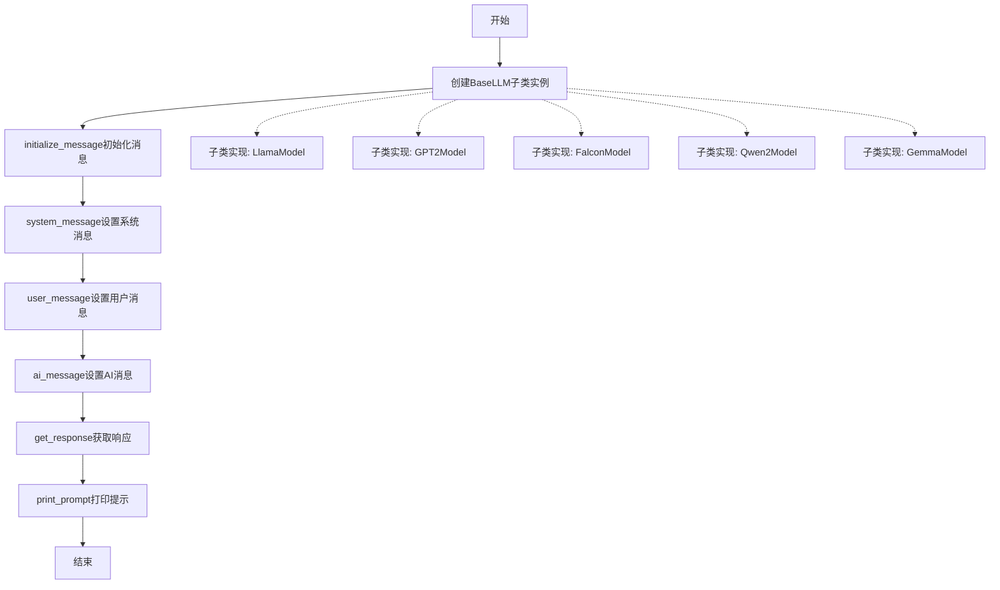
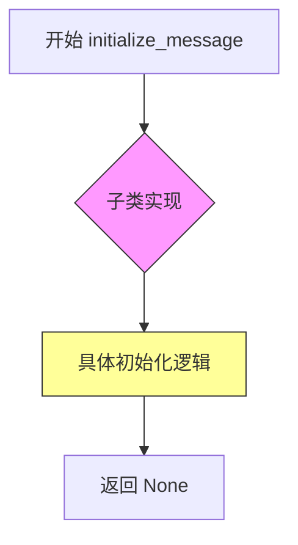
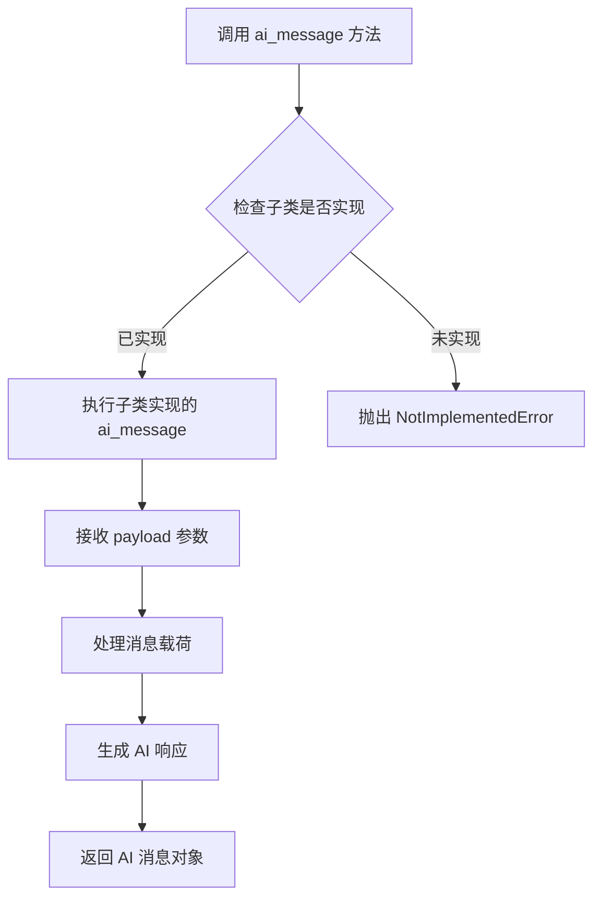
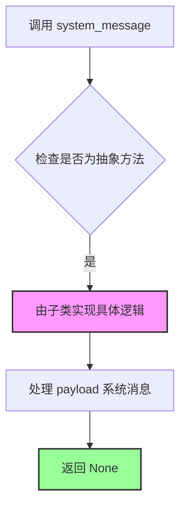
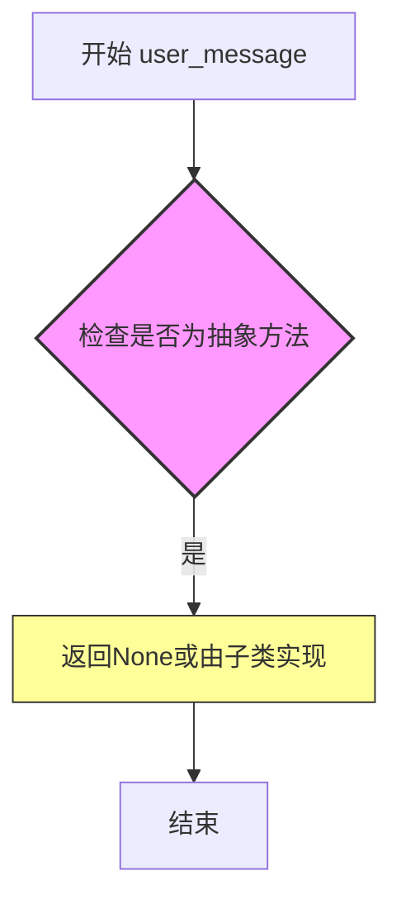
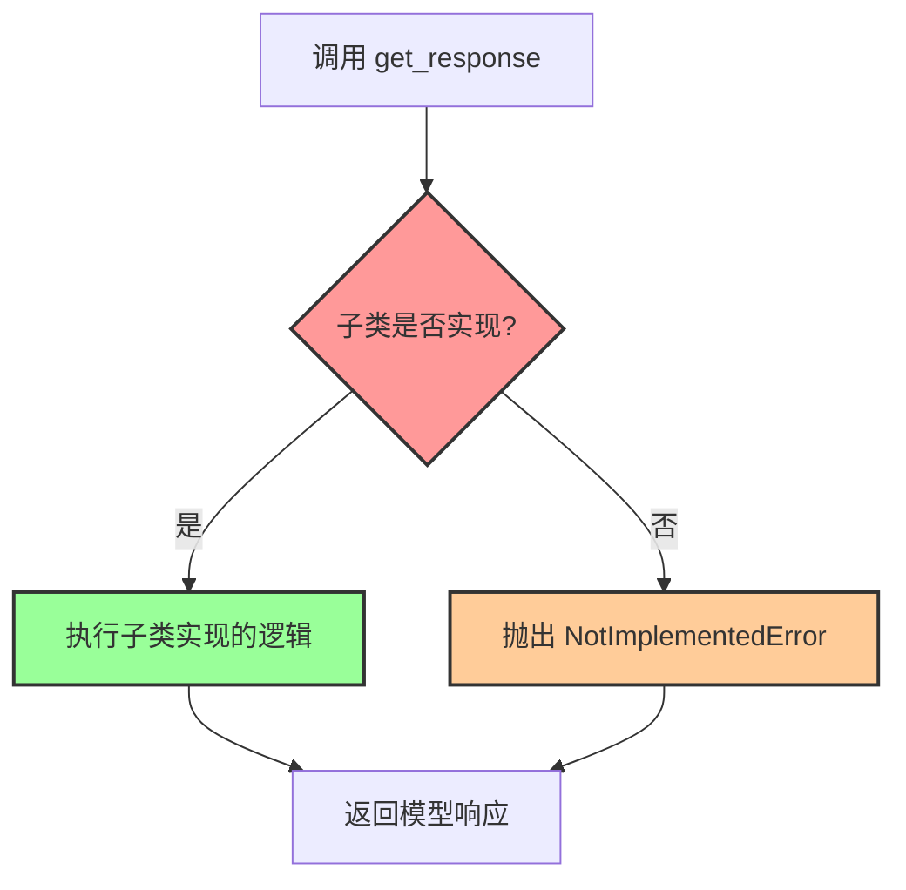
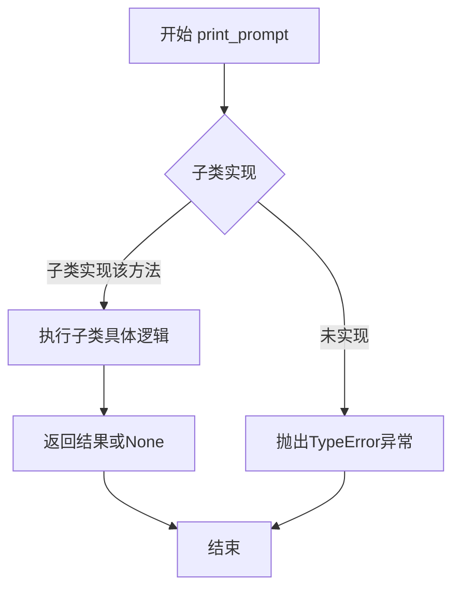

# `Chat-Haruhi-Suzumiya\ChatHaruhi2.0\ChatHaruhi\BaseLLM.py` 详细设计文档

这是一个用于构建大型语言模型(LLM)对话系统的抽象基类(BaseLLM)，定义了与LLM交互的核心接口规范，包括消息初始化、AI消息处理、系统消息处理、用户消息处理、响应获取和提示打印等抽象方法，为具体的LLM实现(如GPT、Llama等)提供了统一的接口框架。

## 整体流程



## 类结构

```
BaseLLM (抽象基类)
└── 子类实现
    ├── LlamaModel
    ├── GPT2Model
    ├── FalconModel
    ├── Qwen2Model
    ├── GemmaModel
    └── ... (其他LLM模型实现)
```

## 全局变量及字段


### `BaseLLM.__`
    
抽象基类标记，用于定义LLM交互的标准接口

类型：`ABC`
    


### `BaseLLM.__init__`
    
构造函数，初始化BaseLLM实例

类型：`method`
    


### `BaseLLM.initialize_message`
    
抽象方法，用于初始化消息对话历史

类型：`abstractmethod`
    


### `BaseLLM.ai_message`
    
抽象方法，用于创建AI角色消息

类型：`abstractmethod`
    


### `BaseLLM.system_message`
    
抽象方法，用于创建系统提示消息

类型：`abstractmethod`
    


### `BaseLLM.user_message`
    
抽象方法，用于创建用户输入消息

类型：`abstractmethod`
    


### `BaseLLM.get_response`
    
抽象方法，用于获取LLM的响应结果

类型：`abstractmethod`
    


### `BaseLLM.print_prompt`
    
抽象方法，用于打印或调试提示信息

类型：`abstractmethod`
    
    

## 全局函数及方法


### `BaseLLM.initialize_message`

这是 `BaseLLM` 抽象类中的一个抽象方法，用于初始化聊天消息系统。该方法没有参数，由子类实现具体的初始化逻辑。

参数：无（仅含 `self` 参数）

返回值：`None`，因为是抽象方法，没有实现返回语句

#### 流程图



#### 带注释源码

```python
@abstractmethod
def initialize_message(self):
    """
    抽象方法，由子类实现具体的消息初始化逻辑。
    该方法用于设置聊天系统的初始消息状态。
    
    参数:
        self: BaseLLM 类的实例
    
    返回值:
        None: 抽象方法不提供具体实现
    """
    pass
```

#### 说明

这是一个 Python 抽象方法（abstract method），使用 `ABC` (Abstract Base Class) 和 `@abstractmethod` 装饰器定义。根据设计模式，这属于**模板方法模式**的一部分，定义了子类必须实现的接口。`initialize_message` 方法的职责是初始化聊天消息的初始状态，但具体实现细节留给了子类。`pass` 语句表示这是一个空实现，仅作为接口定义。


### `BaseLLM.ai_message`

该方法是 BaseLLM 抽象基类中的抽象方法，用于生成并返回 AI 角色的消息内容。它接收一个载荷（payload）作为输入，经过内部处理后返回 AI 生成的消息对象。此方法需要由子类具体实现，以支持不同类型的 LLM 调用。

参数：

- `self`：隐式参数，BaseLLM 类的实例对象，表示当前调用该方法的 LLM 实例
- `payload`：任意类型（Any），表示发送给 AI 的消息载荷内容，可以是字符串、字典或其他格式的消息数据

返回值：任意类型（Any），返回 AI 生成的响应消息对象，具体类型取决于子类的实现

#### 流程图



#### 带注释源码

```python
@abstractmethod    
def ai_message(self, payload):
    """
    抽象方法：生成 AI 消息
    
    该方法是 BaseLLM 类的抽象方法接口，用于定义 AI 消息生成的标准化行为。
    子类必须实现此方法以提供具体的 LLM 调用逻辑。
    
    参数:
        self: BaseLLM 实例，隐式参数，表示调用此方法的类实例
        payload: 任意类型
            输入的消息载荷，通常包含用户输入的上下文信息或提示词
            具体类型取决于子类的实现要求
    
    返回:
        任意类型: 
            AI 生成的响应消息对象
            具体类型（str/dict/自定义消息类）由子类实现决定
    
    注意:
        - 此方法被标记为抽象方法，使用 @abstractmethod 装饰器
        - 子类必须重写此方法，否则无法实例化子类
        - 具体的数据处理逻辑和返回格式需要在子类中定义
    """
    pass  # 抽象方法，子类需实现具体逻辑
```

#### 技术债务与优化空间

1. **类型提示不明确**：方法缺少类型注解（type hints），建议添加如 `def ai_message(self, payload: Any) -> Any:` 以提升代码可读性和 IDE 支持
2. **文档描述不足**：参数和返回值的具体类型未定义，可能导致使用时的混淆
3. **缺乏错误处理**：作为抽象基类，未定义默认的错误处理机制，子类实现可能不一致
4. **接口契约模糊**：payload 的具体结构和内容格式未定义，需要补充接口规范文档

#### 关键组件信息

- `BaseLLM`：抽象基类，定义 LLM 聊天接口的标准抽象方法集合，包括 initialize_message、ai_message、system_message、user_message、get_response、print_prompt 等六个抽象方法
- `ABC`：Python 内置的抽象基类模块（Abstract Base Class），用于定义抽象方法和接口约束
- `abstractmethod`：装饰器，用于标记方法为抽象方法，要求子类必须实现


### `BaseLLM.system_message`

这是一个抽象方法，用于在聊天系统中添加系统消息（system message）。它定义了处理系统提示的接口，具体实现由子类完成。该方法接收一个 payload 参数，通常包含系统角色的定义、背景知识或指令信息，用于引导 AI 的行为模式。

参数：

- `self`：`BaseLLM`，类的实例本身，代表调用该方法的 BaseLLM 对象
- `payload`：`任意类型`，系统消息的内容，可以是字符串、字典或其他配置对象，包含系统角色的定义、背景知识或指令信息

返回值：`None`，因为是抽象方法，只有方法签名没有具体实现

#### 流程图



#### 带注释源码

```python
@abstractmethod
def system_message(self, payload):
    """
    抽象方法：添加系统消息
    
    该方法定义了在聊天系统中处理系统消息的接口。
    系统消息通常用于设置 AI 的角色、背景知识或行为指令。
    
    参数:
        payload: 系统消息的内容，可以是字符串、字典或其他数据类型
                包含系统角色的定义、背景信息、指令等
    
    返回值:
        None: 抽象方法不返回具体值，由子类实现具体逻辑
    
    示例:
        # 子类实现示例
        def system_message(self, payload):
            self.messages.append({
                "role": "system",
                "content": payload
            })
    """
    pass
```


### `BaseLLM.user_message`

这是一个抽象方法，用于在聊天模板中创建用户消息（user message）。该方法由子类实现，用于将用户输入的payload格式化为特定的消息结构，以便于与大型语言模型进行交互。在BaseLLM中作为抽象方法定义，具体实现由继承该类的具体LLM实现类完成。

参数：

- `self`：`BaseLLM`，隐式的实例参数，表示调用该方法的BaseLLM或其子类的实例对象
- `payload`：任意类型（Python中未指定具体类型，通常为str或dict），用户消息的内容或负载数据

返回值：`None`，由于是抽象方法（pass语句），该方法没有返回值，具体返回值由子类实现决定

#### 流程图



#### 带注释源码

```python
@abstractmethod
def user_message(self, payload):
    """
    抽象方法：创建用户消息
    
    该方法是一个抽象方法，用于在聊天框架中创建用户角色发送的消息。
    子类需要实现此方法以提供具体的功能逻辑。
    
    参数:
        self: BaseLLM类的实例
        payload: 用户消息的内容，可以是字符串、字典或其他数据类型
        
    返回值:
        无（None）- 具体返回值由子类实现决定
    """
    pass
```


### `BaseLLM.get_response`

该方法是`BaseLLM`抽象基类中定义的抽象方法，用于获取模型的响应，但没有具体实现，具体的响应获取逻辑需要由子类重写实现。

参数：
- 无（除隐式参数 `self`：`BaseLLM`，代表类的实例）

返回值：`Any`，返回一个通用的任意类型，表示模型的响应内容（具体类型由子类实现决定）

#### 流程图



#### 带注释源码

```python
@abstractmethod
def get_response(self):
    """
    获取模型的响应内容。
    
    这是一个抽象方法，必须由子类实现。
    子类需要重写此方法以实现具体的模型调用和响应获取逻辑。
    
    Args:
        self: BaseLLM类的实例
        
    Returns:
        Any: 模型生成的响应内容，具体类型由子类实现决定
        
    Note:
        此方法在抽象基类中没有具体实现，
        目的是让不同的LLM实现类（如OpenAI、Anthropic等）
        根据各自的API特性实现具体的响应获取逻辑。
    """
    pass
```

#### 额外说明

由于该方法是抽象方法（使用`@abstractmethod`装饰器标记），因此：

1. **不能直接实例化调用**：无法直接创建`BaseLLM`类的实例并调用此方法
2. **必须由子类实现**：任何继承`BaseLLM`的子类都必须重写此方法，否则该子类也是抽象类
3. **设计目的**：定义了一个统一的接口，让不同的LLM实现遵循相同的调用规范，实现解耦和可扩展性
4. **技术债务**：当前没有定义返回类型注解（应考虑添加`-> Any`或更具体的类型），且方法文档可以更详细地描述预期行为


### `BaseLLM.print_prompt`

该方法是`BaseLLM`抽象基类中定义的抽象方法，用于打印或输出当前对话的提示词（prompt）内容，具体实现逻辑由子类完成。此方法作为接口规范，强制所有子类提供自己的提示词打印逻辑。

参数：

- `self`：`BaseLLM`，隐式参数，表示当前类的实例对象本身

返回值：`None`，由于是抽象方法，默认无返回值，具体返回类型由子类实现决定

#### 流程图



#### 带注释源码

```python
@abstractmethod
def print_prompt(self):
    """
    抽象方法：打印当前提示词
    
    该方法作为接口定义，要求子类必须实现具体的提示词打印逻辑。
    提示词可能包含系统消息、角色设定、历史对话记录等内容。
    
    Args:
        self: BaseLLM类的实例对象
    
    Returns:
        None: 默认无返回值，具体返回类型由子类实现决定
    
    Note:
        这是一个抽象方法，子类必须重写(override)该方法。
        如果在子类中未实现而直接调用，会抛出TypeError异常。
    """
    pass
```


## 关键组件


### BaseLLM 抽象基类

BaseLLM 是一个抽象基类，定义了大型语言模型聊天机器人的核心接口规范，包含了消息初始化、AI消息、系统消息、用户消息、获取响应和打印提示等抽象方法，用于实现不同LLM后端的统一接口。

### initialize_message 抽象方法

用于初始化对话消息历史的抽象方法，子类需实现具体的初始化逻辑。

### ai_message 抽象方法

用于创建AI角色消息的抽象方法，接收payload参数并返回AI消息对象。

### system_message 抽象方法

用于创建系统提示消息的抽象方法，接收payload参数并返回系统消息对象。

### user_message 抽象方法

用于创建用户消息的抽象方法，接收payload参数并返回用户消息对象。

### get_response 抽象方法

用于获取LLM响应的抽象方法，子类需实现与LLM后端交互的具体逻辑。

### print_prompt 抽象方法

用于打印调试信息的抽象方法，帮助开发者查看当前的提示内容。


## 问题及建议


### 已知问题

-   **缺乏类型注解**：所有抽象方法均未定义参数类型和返回类型，导致子类实现时缺少类型约束，IDE无法提供准确的类型检查和自动补全。
-   **缺少文档字符串**：类和方法均无文档说明，无法明确每个方法的职责、参数含义、返回值格式及使用场景。
-   **空实现过多**：`__init__`方法只有`pass`，没有任何实际初始化逻辑；所有抽象方法仅有`pass`占位，缺乏默认行为或接口契约说明。
-   **接口设计不完整**：未定义`payload`参数的具体类型约束（如str、dict或其他），也未定义返回值的结构，子类实现时缺乏统一标准。
-   **缺少生命周期方法**：未提供`reset`、`clear`或`close`等常见资源管理方法，无法完整管理聊天会话状态。
-   **方法签名不一致风险**：抽象方法参数命名不统一（如`payload`），不同实现类可能对参数有不同理解。

### 优化建议

-   **添加类型注解**：为所有方法添加明确的参数类型和返回类型，例如`def ai_message(self, payload: str) -> dict:`或根据实际业务需求定义`Message`类型。
-   **补充文档字符串**：为类和每个方法添加docstring，说明功能、参数、返回值及可能的异常。
-   **定义消息类型**：创建`Message`或`Prompt`数据类/枚举，统一消息格式规范，避免子类各自定义消息结构。
-   **完善接口方法**：考虑添加`reset()`重置会话、`close()`释放资源等方法，提供完整的生命周期管理。
-   **提供基础实现**：对于通用逻辑（如消息格式化），可提供默认实现，子类按需覆盖，减少重复代码。
-   **增加错误处理**：在文档中明确各方法可能抛出的异常类型，或定义自定义异常类。


## 其它


### 设计目标与约束

设计目标：定义一个通用的抽象基类BaseLLM，用于规范不同大型语言模型(LLM)实现的接口，确保各具体LLM类提供一致的聊天机器人交互方法。约束：该类为抽象基类，不能直接实例化，必须由具体子类实现所有抽象方法；所有方法必须遵循约定的消息格式规范。

### 错误处理与异常设计

抽象方法在基类中不实现具体逻辑，异常处理由具体实现类负责；建议子类在实现时对非法payload进行验证，抛出TypeError或ValueError；当LLM调用失败时应抛出自定义异常或传递底层异常，并记录错误日志供调试使用。

### 数据流与状态机

BaseLLM作为接口层定义了消息流转的标准流程：initialize_message()初始化会话状态→通过system_message()、user_message()、ai_message()设置各类消息→get_response()获取LLM响应→print_prompt()调试输出完整提示；具体状态转换由子类实现的状态机管理。

### 外部依赖与接口契约

该抽象基类依赖Python标准库abc模块(ABC, abstractmethod)；子类实现时需依赖具体LLM服务的SDK或API(如OpenAI、Claude等)；所有消息方法(payload参数)应接受字符串类型，返回值类型由具体实现决定，但需保持一致性；接口契约要求所有子类必须实现全部6个抽象方法。

### 安全性考虑

建议子类实现时对用户输入进行过滤和验证，防止Prompt Injection攻击；API密钥等敏感信息不应硬编码，应通过环境变量或安全配置管理；网络请求应使用HTTPS协议，确保数据传输安全。

### 性能要求

由于BaseLLM是接口定义，具体性能指标由子类实现决定；建议子类实现时考虑：响应时间控制在合理范围内、支持异步调用以提高并发能力、设置合理的超时机制、考虑实现缓存机制减少重复调用。

### 配置与可扩展性

BaseLLM采用抽象基类模式，便于扩展新的LLM实现；建议子类实现时支持可配置参数(如temperature、max_tokens、model_name等)；可通过继承或组合方式扩展功能，如添加日志记录、监控指标收集等横切关注点。

### 版本兼容性

当前版本为ChatHaruhi 2.0的基础接口定义；建议保持向后兼容性，新增方法时使用默认实现而非抽象方法；版本号应在文档中明确标注，方便使用者了解接口演进历史。

### 测试策略

由于BaseLLM是抽象类，无法直接实例化测试；应编写针对子类的单元测试，验证各抽象方法的实现正确性；建议使用mock对象模拟LLM响应进行集成测试；测试覆盖率应覆盖所有公共方法和边界条件。

### 部署考虑

BaseLLM作为库代码发布，无需独立部署；具体子类实现需要部署相应的LLM服务依赖；部署时应考虑环境变量配置、API密钥管理、服务健康检查等运维因素。

    