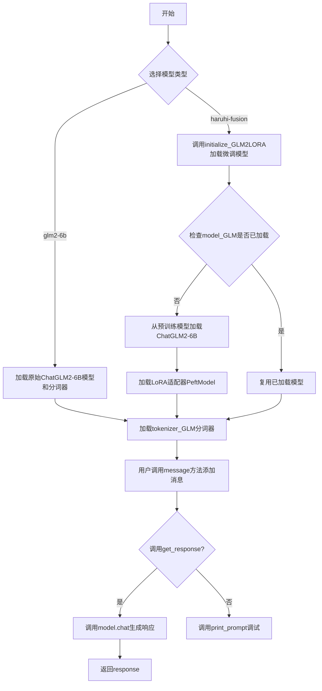
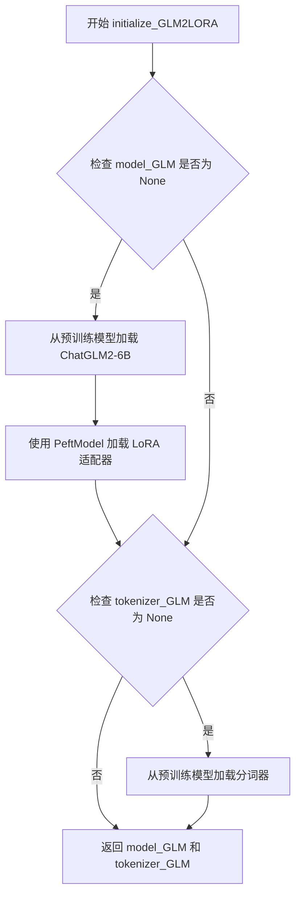
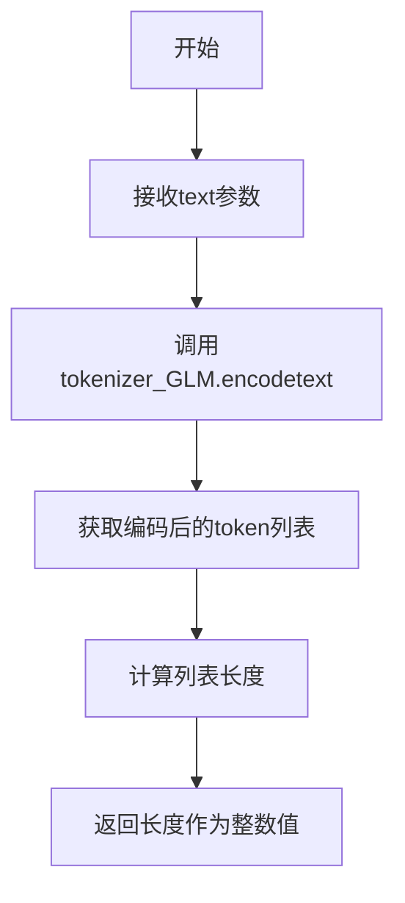
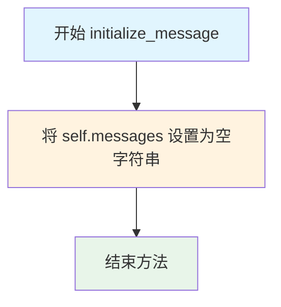
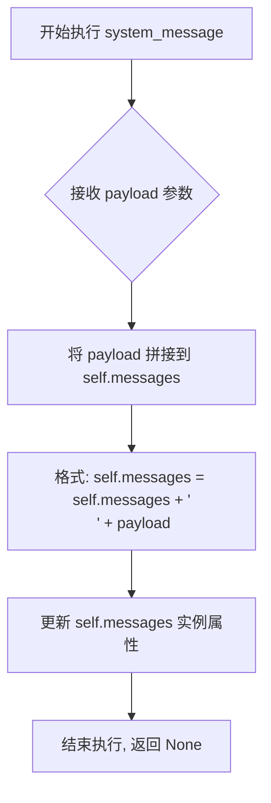
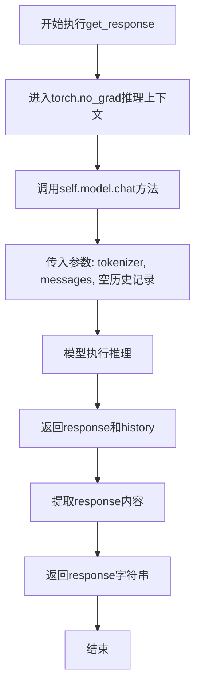
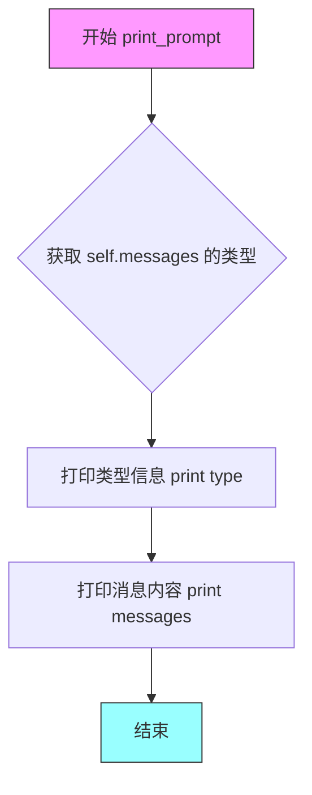

# `Chat-Haruhi-Suzumiya\ChatHaruhi2.0\ChatHaruhi\ChatGLM2GPT.py` 详细设计文档

该代码实现了一个基于ChatGLM2-6B的语言模型接口，支持基础模型和LoRA微调融合模型（haruhi-fusion），通过统一的消息管理机制提供对话功能。

## 整体流程



## 类结构

```
BaseLLM (抽象基类)
└── ChatGLM2GPT (ChatGLM2对话模型实现类)
```

## 全局变量及字段


### `tokenizer_GLM`
    
全局分词器缓存变量，用于缓存已加载的GLM2分词器实例以避免重复加载

类型：`AutoTokenizer | None`
    


### `model_GLM`
    
全局模型缓存变量，用于缓存已加载的GLM2-6B微调模型实例以避免重复加载

类型：`PeftModel | None`
    


### `ChatGLM2GPT.model`
    
预训练语言模型实例，用于执行对话生成任务

类型：`AutoModel | PeftModel`
    


### `ChatGLM2GPT.tokenizer`
    
分词器实例，用于对输入文本进行编码和解码

类型：`AutoTokenizer`
    


### `ChatGLM2GPT.messages`
    
对话消息字符串，用于存储累积的用户、AI和系统消息

类型：`str`
    
    

## 全局函数及方法


### `initialize_GLM2LORA`

该函数负责初始化并加载ChatGLM2-6B基础模型与LoRA融合适配器，使用全局变量缓存模型和分词器以避免重复加载，支持模型的热复用。

参数：

- 该函数无参数

返回值：`Tuple[AutoModel, AutoTokenizer]`，返回加载好的模型实例和分词器实例的元组

#### 流程图



#### 带注释源码

```python
def initialize_GLM2LORA():
    """
    初始化并加载ChatGLM2-6B与LoRA融合模型
    
    该函数使用全局变量缓存模型和分词器，首次调用时加载模型，
    后续调用直接返回缓存的实例，避免重复加载带来的性能开销。
    """
    # 声明使用全局变量，以便在函数内部修改全局状态
    global model_GLM, tokenizer_GLM

    # 如果模型未加载，则执行模型加载逻辑
    if model_GLM is None:
        # 1. 加载基础模型 ChatGLM2-6B
        # torch_dtype=torch.float16: 使用半精度浮点数，减少显存占用
        # device_map="auto": 自动分配模型到可用设备（CPU/GPU）
        # trust_remote_code=True: 允许执行远程代码（ChatGLM需要）
        model_GLM = AutoModel.from_pretrained(
            "THUDM/chatglm2-6b",
            torch_dtype=torch.float16,
            device_map="auto",
            trust_remote_code=True
        )
        
        # 2. 加载LoRA适配器，将基础模型与LoRA权重融合
        # PeftModel 实现了参数高效微调，保留了原始模型权重
        # "silk-road/Chat-Haruhi-Fusion_B" 是预训练的LoRA适配器路径
        model_GLM = PeftModel.from_pretrained(
            model_GLM,
            "silk-road/Chat-Haruhi-Fusion_B"
        )

    # 如果分词器未加载，则加载分词器
    if tokenizer_GLM is None:
        # 加载与模型配套的分词器
        # use_fast=True: 使用Rust实现的快速分词器
        # trust_remote_code=True: 允许执行远程代码
        tokenizer_GLM = AutoTokenizer.from_pretrained(
            "THUDM/chatglm2-6b", 
            use_fast=True,
            trust_remote_code=True
        )

    # 返回模型和分词器供调用方使用
    return model_GLM, tokenizer_GLM
```


### `GLM_tokenizer`

该函数是一个全局工具函数，用于使用全局分词器（tokenizer_GLM）对输入文本进行编码，并返回编码后的token数量长度。

参数：

- `text`：`str`，需要进行分词编码的文本内容

返回值：`int`，返回文本经过分词器编码后的token数量（即编码后列表的长度）

#### 流程图



#### 带注释源码

```python
def GLM_tokenizer(text):
    """
    使用全局分词器对文本进行编码并返回长度
    
    参数:
        text: str - 需要进行分词编码的文本
        
    返回值:
        int - 文本编码后的token数量
    """
    # 使用全局tokenizer对文本进行编码，返回token ID列表
    # 然后计算列表长度，即为token数量
    return len(tokenizer_GLM.encode(text))
```

#### 相关全局变量信息

| 变量名称 | 类型 | 描述 |
|---------|------|------|
| `tokenizer_GLM` | `AutoTokenizer` 或 `None` | 全局分词器实例，用于对文本进行tokenize操作 |
| `model_GLM` | `AutoModel` 或 `None` | 全局模型实例（该函数未直接使用） |

#### 技术债务与优化空间

1. **缺少空值检查**：函数直接使用 `tokenizer_GLM` 而未检查其是否为 `None`，若在初始化前调用会抛出 `AttributeError`
2. **缺乏错误处理**：没有对输入文本类型进行验证，非字符串输入可能导致意外行为
3. **函数独立性差**：该函数依赖全局变量 `tokenizer_GLM`，难以进行单元测试，建议改为接受tokenizer作为参数或使用依赖注入

#### 设计约束与注意事项

- 该函数假设 `tokenizer_GLM` 已在之前通过 `initialize_GLM2LORA()` 或 `ChatGLM2GPT` 类初始化
- 返回的是token数量而非token ID列表本身，这是为了简化调用方需要
- 函数设计遵循轻量级原则，仅完成单一功能（编码+计数）


### `ChatGLM2GPT.__init__`

构造函数，用于初始化 ChatGLM2GPT 类实例，根据传入的 model 参数加载对应的分词器和模型，支持两种模式：基础的 glm2-6b 模型或带有 LoRA 微调的 haruhi-fusion 融合模型。

参数：

- `model`：`str`，可选参数，默认为 "haruhi-fusion"，指定要加载的模型类型，可选值为 "glm2-6b" 或 "haruhi-fusion"

返回值：`None`，构造函数无返回值

#### 流程图

```mermaid
flowchart TD
    A[开始 __init__] --> B{model == "glm2-6b"?}
    B -->|Yes| C[加载 GLM2-6b 分词器]
    C --> D[加载 GLM2-6b 模型]
    D --> G[初始化 self.messages = ""]
    B -->|No| E{model == "haruhi-fusion"?}
    E -->|Yes| F[调用 initialize_GLM2LORA 加载模型和分词器]
    F --> G
    E -->|No| H[抛出异常: Unknown GLM model]
    H --> I[结束]
    G --> J[结束]
```

#### 带注释源码

```python
def __init__(self, model = "haruhi-fusion"):
    """
    构造函数，初始化 ChatGLM2GPT 实例
    
    参数:
        model: str, 默认为 "haruhi-fusion"，指定要加载的模型类型
               - "glm2-6b": 加载原始 ChatGLM2-6b 模型
               - "haruhi-fusion": 加载带有 LoRA 微调的融合模型
    """
    # 调用父类 BaseLLM 的构造函数进行基类初始化
    super(ChatGLM2GPT, self).__init__()
    
    # 判断传入的模型类型
    if model == "glm2-6b":
        # 加载原始的 ChatGLM2-6b 分词器
        # use_fast=True: 使用快速分词器
        # trust_remote_code=True: 允许执行远程代码（ChatGLM 需要）
        self.tokenizer = AutoTokenizer.from_pretrained(
            "THUDM/chatglm2-6b", 
            use_fast=True,
            trust_remote_code=True
        )
        
        # 加载原始的 ChatGLM2-6b 模型
        # torch_dtype=torch.float16: 使用半精度浮点数减少显存占用
        # device_map="auto": 自动分配模型到可用设备
        self.model = AutoModel.from_pretrained(
            "THUDM/chatglm2-6b",
            torch_dtype=torch.float16,
            device_map="auto",
            trust_remote_code=True
        )
    
    # 如果指定的是 haruhi-fusion 模式
    if model == "haruhi-fusion":
        # 调用全局初始化函数，加载带有 LoRA 适配器的融合模型
        # 该函数会加载基础模型并合并 LoRA 权重
        self.model, self.tokenizer = initialize_GLM2LORA()
    
    # 如果模型参数不匹配任何已知选项
    else:
        # 抛出异常，提示未知的 GLM 模型类型
        raise Exception("Unknown GLM model")
    
    # 初始化消息历史记录为空字符串
    # 用于存储对话过程中的上下文消息
    self.messages = ""
```


### `ChatGLM2GPT.initialize_message`

该方法用于初始化（重置）消息容器，将消息历史记录清空，为开始新的对话做准备。

参数： 无

返回值：`None`，无返回值，该方法直接修改实例属性 `messages`

#### 流程图



#### 带注释源码

```python
def initialize_message(self):
    """
    初始化消息容器，将消息历史重置为空字符串
    
    该方法用于清空当前对话的所有历史消息，
    使模型能够开始新一轮的对话，而不受到之前上下文的影响。
    
    通常在开始新对话或需要重置对话上下文时调用。
    """
    self.messages = ""  # 将实例的 messages 属性重置为空字符串
```

---

### 补充说明

**设计目的**：
- 提供一种重置对话历史的方式
- 允许用户开始新的对话会话，而无需创建新的类实例

**使用场景**：
- 开始新的对话时
- 对话轮次过多需要清理上下文时
- 用户明确要求"新建对话"时

**与其他方法的关系**：
- `ai_message()`: 向消息容器添加AI回复
- `user_message()`: 向消息容器添加用户消息  
- `system_message()`: 向消息容器添加系统消息
- `get_response()`: 使用累积的消息获取模型响应

**潜在改进空间**：
1. 可考虑返回 `self` 以支持链式调用
2. 可添加消息格式验证逻辑
3. 可考虑支持消息容器的最大长度限制，防止内存溢出
4. 当前直接赋值字符串，效率较低时可考虑使用列表维护消息再拼接


### `ChatGLM2GPT.ai_message`

该方法用于向对话消息历史中添加AI角色生成的消息内容，将payload参数提供的文本内容追加到messages字符串末尾，形成对话上下文。

参数：

- `payload`：`str`，需要添加的AI角色消息内容

返回值：`None`，该方法直接修改实例的messages属性，不返回任何值

#### 流程图

```mermaid
flowchart TD
    A[开始 ai_message] --> B[接收 payload 参数]
    B --> C{检查 payload 是否有效}
    C -->|是| D[拼接消息: self.messages + "\n " + payload]
    D --> E[更新 self.messages 属性]
    E --> F[结束]
    C -->|否| F
```

#### 带注释源码

```python
def ai_message(self, payload):
    """
    添加AI角色消息到对话历史中
    
    参数:
        payload: str - AI生成的回复内容
        
    返回:
        None - 直接修改实例的messages属性
    """
    # 使用换行符分隔各轮对话，将AI消息追加到现有消息历史末尾
    # 格式: 现有消息 + 换行符 + 空格 + 新payload内容
    self.messages = self.messages + "\n " + payload 
```


### `ChatGLM2GPT.system_message`

该方法用于向对话消息历史中添加系统角色（system role）的消息内容，通过将系统提示信息追加到实例的messages属性中，实现对话上下文的初始化与系统角色设定。

参数：

- `payload`：`str`，需要添加的系统角色消息内容，即系统提示词或系统指令

返回值：`None`，该方法直接修改实例属性 `self.messages`，无返回值

#### 流程图



#### 带注释源码

```python
def system_message(self, payload):
    """
    添加系统角色消息到对话历史中
    
    参数:
        payload: str, 系统角色需要说的话/系统提示词
    返回:
        None, 直接修改实例的 messages 属性
    """
    # 将系统消息追加到现有消息历史后面
    # 前面加换行符和空格作为分隔
    self.messages = self.messages + "\n " + payload 
```

#### 设计说明

| 属性 | 说明 |
|------|------|
| **方法名称** | system_message |
| **所属类** | ChatGLM2GPT |
| **方法类型** | 实例方法 |
| **功能分类** | 消息构建/对话上下文管理 |
| **设计模式** | Builder模式 - 链式调用构建对话消息 |

#### 潜在优化空间

1. **消息格式规范化**：当前使用 `"\n "` 拼接，可能导致格式不一致；建议定义统一的消息模板或使用结构化数据（如列表或字典）存储消息
2. **角色标记缺失**：未明确标记该消息为"system"角色，后续在某些模型调用时可能无法正确识别消息角色
3. **空消息处理**：未对空字符串或None进行校验，可能导致不必要的空行
4. **消息长度限制**：未对累积的消息长度进行控制，可能导致超出模型上下文窗口限制


### `ChatGLM2GPT.user_message`

添加用户角色消息到对话历史记录中，将用户输入的文本内容追加到内部消息字符串中。

参数：

- `payload`：`str`，用户发送的消息内容

返回值：`None`，该方法无返回值，仅修改实例的 `messages` 属性

#### 流程图

```mermaid
flowchart TD
    A[开始 user_message] --> B[接收 payload 参数]
    B --> C{检查 payload 是否有效}
    C -->|有效| D[拼接字符串: self.messages + "\n " + payload]
    D --> E[更新 self.messages 属性]
    E --> F[结束]
    C -->|无效| F
```

#### 带注释源码

```python
def user_message(self, payload):
    """
    添加用户角色消息到对话历史记录中
    
    参数:
        payload: 用户发送的消息内容，字符串类型
        
    说明:
        该方法将用户消息追加到 self.messages 字符串中，
        消息前会添加换行符和空格以保持格式整洁
    """
    # 将用户消息 payload 追加到现有消息历史中
    # 格式: 原有消息 + 换行符 + 空格 + 用户消息
    self.messages = self.messages + "\n " + payload 
```


### `ChatGLM2GPT.get_response`

该方法调用ChatGLM2模型进行对话生成，通过禁用梯度计算的推理模式使用模型对当前消息历史进行推理，返回模型生成的文本回复。

参数：

- 该方法无参数（除隐式self参数）

返回值：`str`，模型生成的回复文本内容

#### 流程图



#### 带注释源码

```python
def get_response(self):
    """
    获取模型生成的回复
    
    使用torch.no_grad()上下文管理器禁用梯度计算，
    这是推理时的标准做法，可以节省显存并提高推理速度
    """
    # 禁用梯度计算，节省显存并加速推理
    with torch.no_grad():
        # 调用模型的chat方法进行对话生成
        # 参数: self.tokenizer - 分词器, self.messages - 当前消息历史, history=[] - 初始空历史
        # 返回: response - 模型生成的回复, history - 更新后的历史记录
        response, history = self.model.chat(self.tokenizer, self.messages, history=[])
        # print(response)  # 可选的调试打印
    # 返回生成的回复文本
    return response
```


### `ChatGLM2GPT.print_prompt`

打印当前消息内容用于调试

参数：

- `self`：`ChatGLM2GPT`，调用该方法的对象实例

返回值：`None`，无返回值，仅执行打印操作

#### 流程图



#### 带注释源码

```
def print_prompt(self):
    """
    打印当前消息内容用于调试
    
    该方法会输出两个调试信息：
    1. self.messages 的数据类型（通常是 str 字符串类型）
    2. self.messages 的具体内容（即当前累积的所有对话消息）
    
    注意：
    - 这是一个调试方法，用于开发阶段检查消息格式
    - messages 属性存储了所有累积的对话内容
    - 格式为：系统消息 + 用户消息 + AI消息 的拼接
    """
    # 打印消息的类型，用于确认数据类型是否正确
    print(type(self.messages))
    
    # 打印消息的实际内容，便于开发者查看当前prompt的完整形式
    print(self.messages)
```

## 关键组件


### 惰性加载机制 (Lazy Loading)

通过 `initialize_GLM2LORA()` 函数实现全局模型和分词器的惰性加载，仅在首次调用时从预训练模型加载，使用全局变量 `model_GLM` 和 `tokenizer_GLM` 缓存已加载模型，避免重复加载开销。

### LoRA 微调量化策略 (LoRA Quantization Strategy)

使用 `PeftModel` 配合 `from_pretrained` 从 "silk-road/Chat-Haruhi-Fusion_B" 加载 LoRA 适配器权重，实现低秩自适应微调，降低显存占用和计算成本。

### 半精度计算支持 (Half-Precision Computation)

通过 `torch_dtype=torch.float16` 指定模型使用 FP16 半精度加载，配合 `device_map="auto"` 实现自动设备映射，优化推理速度和显存利用率。

### 对话消息管理组件 (Message Management)

`ChatGLM2GPT` 类提供 `system_message()`、`user_message()`、`ai_message()` 和 `initialize_message()` 方法，支持构建和管理对话上下文消息。

### Tokenizer 封装 (Tokenizer Wrapper)

提供 `GLM_tokenizer()` 全局函数，封装 tokenizer 的 `encode()` 方法，返回输入文本的 token 长度。

### BaseLLM 抽象基类继承

`ChatGLM2GPT` 继承自 `BaseLLM` 抽象基类，遵循统一的语言模型接口规范。

### 模型与分词器初始化 (Model & Tokenizer Initialization)

支持两种模型模式："glm2-6b"（原始 ChatGLM2-6B）和 "haruhi-fusion"（LoRA 微调融合模型），通过构造函数参数动态选择。

### 推理响应生成 (Inference Response Generation)

`get_response()` 方法使用 `torch.no_grad()` 上下文管理器禁用梯度计算，调用模型的 `chat()` 方法生成对话响应。


## 问题及建议


### 已知问题

-   **全局变量管理风险**：`model_GLM` 和 `tokenizer_GLM` 使用全局变量，缺乏线程安全保护，在多线程环境下可能导致竞态条件和不可预测的行为
-   **初始化逻辑缺陷**：`initialize_GLM2LORA()` 中模型和tokenizer的初始化没有互斥保护，可能导致重复加载或状态不一致
-   **重复代码**：`ChatGLM2GPT.__init__` 中加载模型和tokenizer的逻辑与 `initialize_GLM2LORA()` 函数高度重复，违反DRY原则
-   **状态管理混乱**：`messages` 使用字符串拼接而非现代聊天框架常用的消息列表结构，与 `history=[]` 参数设计不一致
-   **缺少异常处理**：模型加载、tokenization等关键操作均无try-except保护，失败时会导致程序崩溃
-   **未使用的函数**：`GLM_tokenizer` 函数定义后未被调用，属于死代码
-   **硬编码配置**：模型路径 "THUDM/chatglm2-6b" 和 "silk-road/Chat-Haruhi-Fusion_B" 硬编码在多处，修改时需要同步多处
-   **类型提示缺失**：所有方法和变量均无类型注解，降低了代码可维护性和IDE支持
-   **资源管理缺失**：没有提供模型卸载或资源释放的方法，长期运行可能导致内存泄漏
-   **功能设计冗余**：类维护了 `messages` 字符串状态，但 `get_response` 中传入空history，二者功能重复且逻辑矛盾

### 优化建议

-   **消除全局变量**：将模型和tokenizer封装到配置类或依赖注入容器中，避免全局状态
-   **单例模式或连接池**：使用单例模式或工厂模式管理模型实例，确保全局唯一性
-   **提取公共初始化逻辑**：将模型加载逻辑统一到 `initialize_GLM2LORA()` 或单独的 `ModelLoader` 类中
-   **重构消息管理**：使用消息列表（如 `List[Dict[str, str]]`）替代字符串拼接，遵循OpenAI风格的消息格式
-   **添加异常处理**：为所有IO操作（模型加载、网络请求）添加try-except和重试机制
-   **删除死代码**：移除未使用的 `GLM_tokenizer` 函数
-   **配置外部化**：使用配置文件或环境变量管理模型路径
-   **添加类型提示**：为所有函数参数和返回值添加类型注解
-   **实现资源管理**：添加 `__del__` 方法或上下文管理器协议以支持资源清理
-   **统一状态管理**：移除冗余的 `messages` 状态，直接使用模型原生的history机制


## 其它


### 设计目标与约束

本模块旨在提供一个统一的聊天接口，封装ChatGLM2-6B大语言模型的加载、推理和对话管理功能。支持原始模型和LoRA微调模型的灵活切换，继承BaseLLM基类以保持与其他LLM实现的接口一致性。设计约束包括：仅支持GPU环境运行（device_map="auto"），模型精度限定为float16，依赖HuggingFace生态的transformers和peft库。

### 错误处理与异常设计

代码中存在以下异常处理场景：模型类型未知时抛出Exception("Unknown GLM model")；全局变量model_GLM和tokenizer_GLM使用延迟加载模式，通过None检查避免重复加载。当前缺失的异常处理包括：模型下载失败的网络异常捕获、tokenizer编码异常处理、GPU内存不足的OOM处理、模型推理过程中的运行时异常捕获。建议增加try-except块包装模型加载和推理逻辑，并添加资源释放机制。

### 数据流与状态机

数据流如下：用户通过user_message()、system_message()、ai_message()将消息追加到self.messages字符串中 → 调用get_response()触发推理 → 模型通过self.model.chat()方法传入self.messages和空history → 模型返回response和更新后的history → 返回response字符串给调用者。状态机表现为：初始化状态（messages为空）→ 消息积累状态（messages包含历史对话）→ 响应生成状态（调用chat方法）→ 响应完成状态。

### 外部依赖与接口契约

外部依赖包括：torch（深度学习框架）、transformers（AutoTokenizer和AutoModel）、peft（PeftModel用于LoRA加载）、BaseLLM（基类需继承）。模型依赖：THUDM/chatglm2-6b（基础模型）和silk-road/Chat-Haruhi-Fusion_B（LoRA权重）。接口契约：ChatGLM2GPT类需实现BaseLLM定义的接口规范，包括initialize_message()、ai_message()、system_message()、user_message()、get_response()五个方法。

### 性能考虑与资源管理

性能优化点：使用torch.no_grad()禁用梯度计算以减少显存占用；全局变量避免重复加载模型；device_map="auto"实现自动设备分配。资源管理缺陷：缺少显式的模型卸载方法（delete或clear CUDA cache），messages字符串无限增长可能导致内存溢出，缺乏最大上下文长度控制。建议添加：显存清理方法、消息长度限制、模型缓存策略配置。

### 安全性考虑

当前代码存在以下安全风险：trust_remote_code=True允许远程执行代码（需确认模型来源可信）；模型路径和tokenizer路径硬编码；缺少输入验证和过滤机制（如prompt injection防护）；messages直接拼接可能导致注入攻击。建议增加：输入长度限制、敏感信息过滤、模型来源校验机制。

### 配置与参数说明

主要配置参数包括：model参数（"glm2-6b"或"haruhi-fusion"）、torch_dtype=torch.float16（半精度推理）、device_map="auto"（自动设备分配）、use_fast=True（使用快速tokenizer）、trust_remote_code=True（允许远程代码）。全局变量model_GLM和tokenizer_GLM作为模块级缓存。

### 使用示例与调用流程

典型使用流程：实例化ChatGLM2GPT对象（可指定模型类型）→ 调用initialize_message()重置对话→ 依次调用system_message()、user_message()构建提示词→ 调用get_response()获取AI回复→ 可选调用print_prompt()调试查看完整提示词。直接调用函数方式：先调用initialize_GLM2LORA()初始化全局模型和tokenizer，然后使用GLM_tokenizer()计算文本token数量。

### 版本兼容性与升级策略

当前依赖版本未指定，建议锁定关键依赖版本：transformers≥4.30.0、peft≥0.3.0、torch≥2.0.0。升级策略：未来可考虑支持ChatGLM3系列模型、添加流式输出支持（stream=True）、支持更多LoRA权重切换、适配vLLM推理加速后端。

### 测试策略

建议补充以下测试用例：模型加载测试（验证model和tokenizer非空）、消息构建测试（验证消息拼接格式）、响应生成测试（验证返回非空字符串）、异常测试（验证非法模型类型抛出异常）、tokenizer测试（验证GLM_tokenizer函数正确计算token数）、内存测试（验证连续对话不会导致内存泄漏）。

    