# `Chat-Haruhi-Suzumiya\ChatHaruhi2.0\ChatHaruhi\ChatHaruhi.py` 详细设计文档

一个基于大语言模型的聊天机器人框架，支持多种LLM后端（OpenAI、GLM、Ernie等）和embedding模型，通过ChromaDB存储角色故事上下文，实现角色扮演式对话功能。

## 整体流程

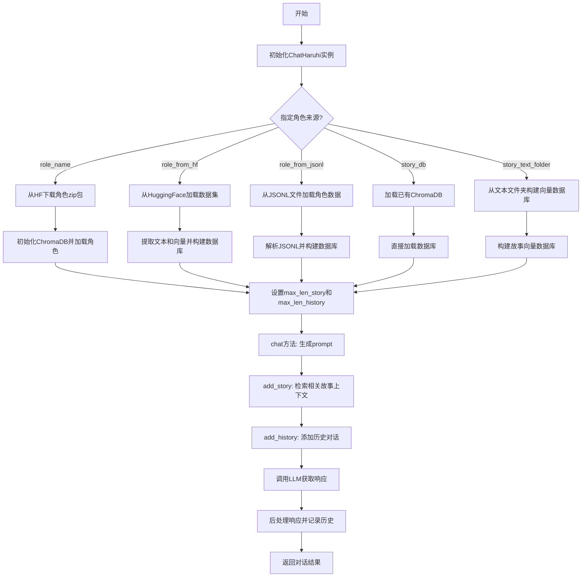

## 类结构

```
ChatHaruhi (主类)
```

## 全局变量及字段


### `system_prompt`
    
系统提示词，用于设置对话机器人的角色和行为

类型：`str | None`
    


### `role_name`
    
角色名称，用于从预定义角色库加载角色数据

类型：`str | None`
    


### `role_from_hf`
    
HuggingFace数据集路径，用于加载远程角色数据

类型：`str | None`
    


### `role_from_jsonl`
    
JSONL文件路径，用于从本地文件加载角色数据

类型：`str | None`
    


### `story_db`
    
ChromaDB向量数据库路径，用于加载已有的故事向量库

类型：`str | None`
    


### `story_text_folder`
    
故事文本文件夹路径，用于从文本文件构建故事向量库

类型：`str | None`
    


### `llm`
    
大语言模型类型标识，如openai、debug、spark等

类型：`str`
    


### `embedding`
    
embedding模型类型，如luotuo_openai、bge_en、bge_zh等

类型：`str`
    


### `max_len_story`
    
故事上下文最大token数，控制检索故事的token上限

类型：`int | None`
    


### `max_len_history`
    
历史对话最大token数，控制历史记录的token上限

类型：`int | None`
    


### `verbose`
    
是否输出详细运行信息，用于调试和日志

类型：`bool`
    


### `ChatHaruhi.verbose`
    
是否输出详细信息，用于控制调试日志输出

类型：`bool`
    


### `ChatHaruhi.story_prefix_prompt`
    
故事前缀提示词，用于在检索故事前添加的引导文本

类型：`str`
    


### `ChatHaruhi.k_search`
    
向量检索返回数量，指定从向量数据库检索的相关故事数量

类型：`int`
    


### `ChatHaruhi.narrator`
    
旁白角色标识列表，用于识别文本中的旁白角色

类型：`list`
    


### `ChatHaruhi.dialogue_divide_token`
    
对话分隔符，用于分隔不同角色对话的标记

类型：`str`
    


### `ChatHaruhi.dialogue_bra_token`
    
对话开始符号，用于标记角色台词的开始

类型：`str`
    


### `ChatHaruhi.dialogue_ket_token`
    
对话结束符号，用于标记角色台词的结束

类型：`str`
    


### `ChatHaruhi.system_prompt`
    
系统提示词，用于设置对话机器人的角色和行为规范

类型：`str`
    


### `ChatHaruhi.llm`
    
大语言模型实例，用于生成对话回复

类型：`object`
    


### `ChatHaruhi.tokenizer`
    
分词器实例，用于计算文本的token数量

类型：`object`
    


### `ChatHaruhi.embedding`
    
embedding函数，用于将文本转换为向量表示

类型：`function`
    


### `ChatHaruhi.db`
    
向量数据库实例，用于存储和检索角色故事向量

类型：`ChromaDB`
    


### `ChatHaruhi.max_len_story`
    
故事上下文最大token数，控制输入模型的story部分token上限

类型：`int`
    


### `ChatHaruhi.max_len_history`
    
历史对话最大token数，控制输入模型的历史记录token上限

类型：`int`
    


### `ChatHaruhi.dialogue_history`
    
对话历史记录，存储历次对话的问答对

类型：`list`
    


### `ChatHaruhi.last_query`
    
上一次查询内容，记录最近一次用户输入的查询

类型：`str`
    
    

## 全局函数及方法


### `get_text_from_data`

该函数是一个工具函数，用于从数据字典中提取文本内容。它首先检查数据是否包含明文文本（"text"字段），若不包含则检查是否包含Base64编码的文本（"enc_text"字段），如果两者都不存在则打印警告并返回空字符串。这是一种灵活的数据解包方式，支持多种文本存储格式。

参数：

- `data`：`dict`，输入的数据字典，可能包含明文文本（"text"）或Base64编码的文本（"enc_text"）

返回值：`str`，从数据中提取的文本字符串

#### 流程图

```mermaid
flowchart TD
    A[开始: get_text_from_data] --> B{检查 data 中是否有 'text' 键}
    B -->|是| C[返回 data['text']]
    B -->|否| D{检查 data 中是否有 'enc_text' 键}
    D -->|是| E[调用 base64_to_string 解码]
    E --> F[返回解码后的文本]
    D -->|否| G[打印警告信息]
    G --> H[返回空字符串 '']
    C --> I[结束]
    F --> I
    H --> I
```

#### 带注释源码

```python
def get_text_from_data( data ):
    """
    从数据字典中提取文本内容。
    优先尝试获取明文文本，若不存在则尝试解码Base64编码的文本。
    
    参数:
        data (dict): 包含文本或编码文本的数据字典
        
    返回:
        str: 提取出的文本内容，若提取失败则返回空字符串
    """
    # 优先检查是否存在明文文本字段
    if "text" in data:
        # 直接返回明文文本
        return data['text']
    
    # 检查是否存在Base64编码的文本字段
    elif "enc_text" in data:
        # 动态导入base64解码工具函数
        from .utils import base64_to_string
        # 解码并返回编码文本
        return base64_to_string( data['enc_text'] )
    
    # 既没有明文也没有编码文本，打印警告并返回空字符串
    else:
        print("warning! failed to get text from data ", data)
        return ""
```


### `luotuo_openai_embedding`

该函数是一个文本嵌入（Embedding）函数，用于将文本转换为向量表示，以便于在向量数据库中进行相似度搜索。在代码中作为默认的嵌入方法被 `ChatHaruhi` 类使用。

参数：

-  `text`：`str`，需要转换为向量的文本输入

返回值：`List[float]` 或 `numpy.ndarray`，文本的向量表示，用于语义搜索和相似度计算

#### 流程图

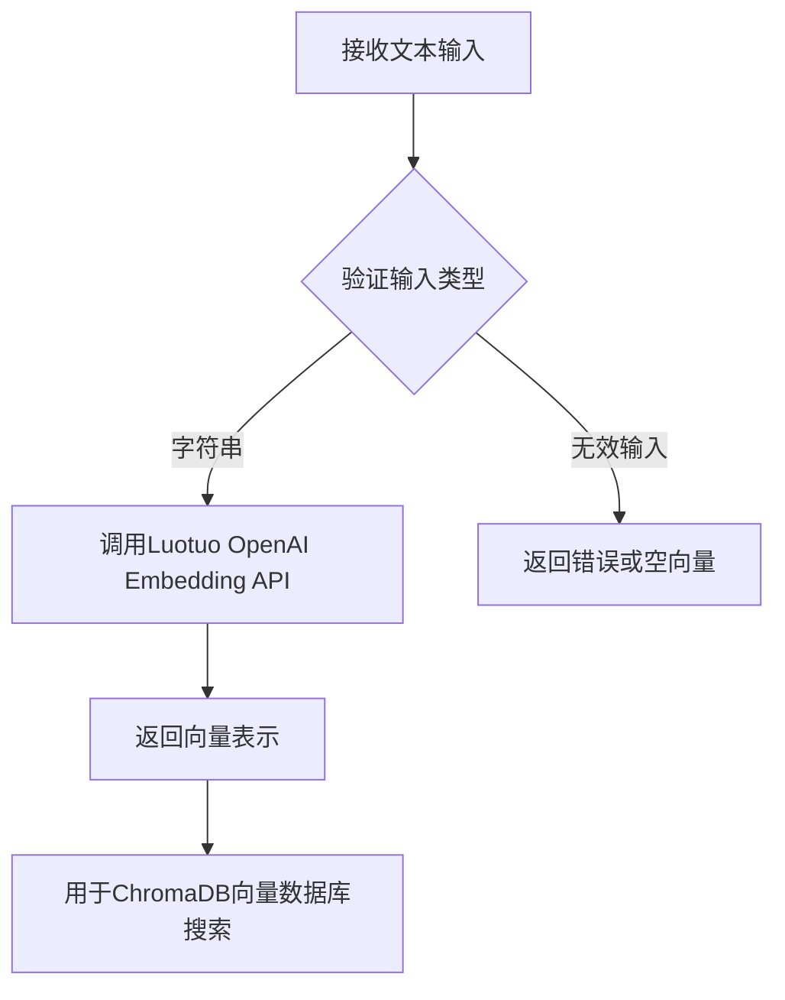

#### 带注释源码

由于 `luotuo_openai_embedding` 函数定义在 `utils` 模块中，未在当前代码片段中提供。以下是从代码使用方式推断的函数签名和用途：

```python
# 从 utils 模块导入的嵌入函数
from .utils import luotuo_openai_embedding, tiktokenizer

# 在 ChatHaruhi 类中的使用方式：

# 1. 作为默认嵌入方法赋值给 self.embedding
if embedding == 'luotuo_openai':
    self.embedding = luotuo_openai_embedding

# 2. 在 build_story_db 方法中用于为文本文件夹中的每个文本生成向量
for mystr in strs:
    vecs.append(self.embedding(mystr))  # 输入: 字符串, 输出: 向量

# 3. 在 add_story 方法中用于将查询文本转换为向量以便搜索
query_vec = self.embedding(query)  # 输入: 字符串, 输出: 向量

# 预期函数签名（基于使用方式推断）：
# def luotuo_openai_embedding(text: str) -> List[float]:
#     """
#     将文本转换为向量表示
#     :param text: 输入文本字符串
#     :return: 文本的向量表示（浮点数列表）
#     """
#     pass
```

> **注意**：该函数的实际定义位于 `utils` 模块中，未在当前提供的代码片段中包含。上述信息基于代码中的使用方式推断得出。


### `tiktokenizer`

` tiktokenizer` 是从 `utils` 模块导入的全局函数，用于计算输入文本的 token 数量，以便在对话历史和故事文本的管理中控制 token 长度。

参数：

-  `{文本字符串}`：`str`，需要计算 token 数量的文本输入

返回值：`int`，返回文本对应的 token 数量

#### 流程图

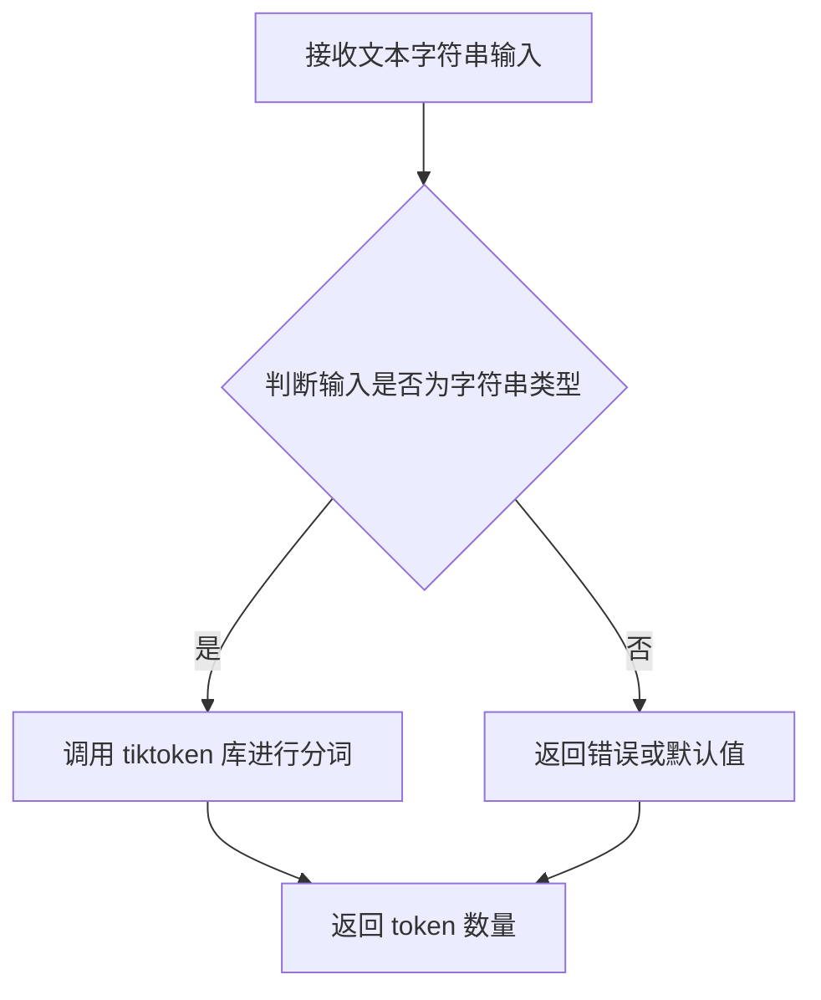

#### 带注释源码

```
# tiktokenizer 函数的源码位于 utils.py 模块中
# 以下为推断的实现方式（因为原始代码中仅导入了该函数，未显示定义）

from tiktoken import Encoding

def tiktokenizer(text: str) -> int:
    """
    用于计算文本 token 数量的函数
    
    参数:
        text: 输入的文本字符串
        
    返回值:
        文本对应的 token 数量（整数）
    """
    # 加载 tiktoken 编码模型（通常为 cl100k_base）
    enc = tiktoken.get_encoding("cl100k_base")
    
    # 对输入文本进行编码并返回 token 数量
    return len(enc.encode(text))
```

> **注意**：由于提供的代码片段中未包含 `utils.py` 的完整实现，以上源码为基于使用方式的合理推断。`tiktokenizer` 函数在 `ChatHaruhi` 类中通过 `self.tokenizer` 属性被广泛用于：
> - 计算故事文本的 token 长度 (`add_story` 方法)
> - 计算对话历史的 token 长度 (`add_history` 方法)
> - 根据 `max_len_story` 和 `max_len_history` 参数控制上下文窗口大小


### `response_postprocess`

该函数用于对语言模型生成的原始响应进行后处理，根据指定的对白分隔符（如中文书名号「」）解析和提取对话内容。

参数：

- `response_raw`：`str`，语言模型生成的原始响应字符串
- `dialogue_bra_token`：`str`，对话开始分隔符（如「）
- `dialogue_ket_token`：`str`，对话结束分隔符（如」）

返回值：`str`，处理后的对话内容字符串

#### 流程图

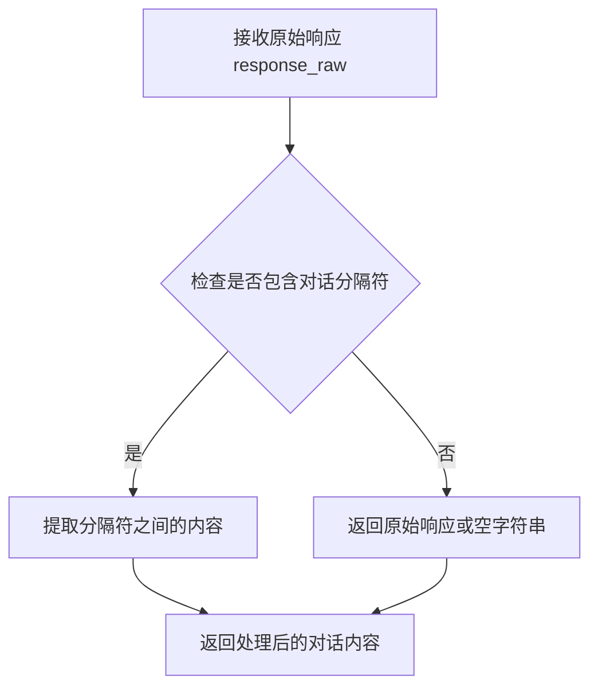

#### 带注释源码

```
# 注意：此函数定义在 .utils 模块中，此处展示的是在 ChatHaruhi 类中的调用方式
# 函数原型（推测）:
# def response_postprocess(response_raw: str, dialogue_bra_token: str, dialogue_ket_token: str) -> str:

# 在 ChatHaruhi.chat() 方法中的实际调用:
response_raw = self.llm.get_response()  # 获取语言模型原始响应
response = response_postprocess(
    response_raw,                        # 原始响应字符串
    self.dialogue_bra_token,             # 开始分隔符「
    self.dialogue_kue_token              # 结束分隔符」（注：代码中为 dialogue_ket_token）
)

# 处理逻辑推测：
# 1. 查找 dialogue_bra_token 和 dialogue_ket_token 之间的内容
# 2. 提取对白内容并返回
# 3. 如果未找到分隔符，可能返回原始响应或空字符串
```

---

**备注**：由于 `response_postprocess` 函数定义在 `.utils` 模块中，未在本代码文件中直接展示其完整实现。以上文档基于其在 `ChatHaruhi.chat()` 方法中的调用方式进行推断。实际实现可能涉及更复杂的文本解析逻辑，如处理多轮对话、特殊字符转义等场景。


### `base64_to_string`

这是一个用于将 Base64 编码的字符串解码为普通文本字符串的函数。在给定的代码中，它被用于从数据中提取加密的文本，并将其转换回可读的格式。

参数：

- `encoded_text`：`str`，这是 Base64 编码的字符串，通常存储在数据字典的 "enc_text" 键中

返回值：`str`，这是解码后的普通文本字符串

#### 流程图

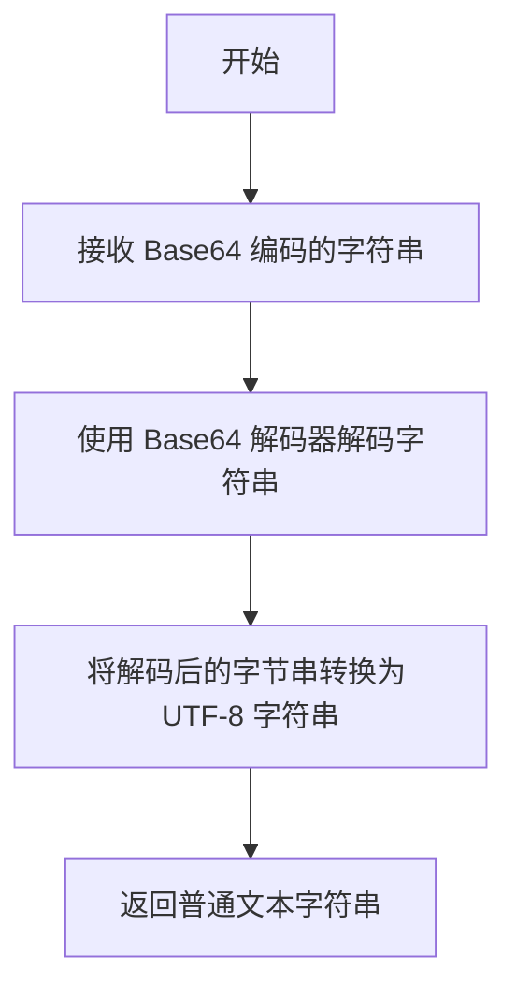

#### 带注释源码

```python
import base64

def base64_to_string(encoded_text):
    """
    将 Base64 编码的字符串解码为普通文本字符串。
    
    参数:
        encoded_text (str): Base64 编码的字符串
        
    返回:
        str: 解码后的普通文本字符串
    """
    # 将 Base64 字符串解码为字节串
    decoded_bytes = base64.b64decode(encoded_text)
    
    # 将字节串解码为 UTF-8 字符串
    return decoded_bytes.decode('utf-8')
```


### `base64_to_float_array`

该函数位于 `.utils` 模块中，用于将 Base64 编码的字符串解码并转换为浮点数数组，主要用于将存储在数据集中的嵌入向量（embedding vectors）从 Base64 字符串格式还原为数值数组形式，以便后续进行向量相似度搜索等操作。

参数：

- `base64_string`：`str`，Base64 编码的字符串，包含嵌入向量的数值信息

返回值：`List[float]` 或 `numpy.ndarray`，解码后的浮点数数组（嵌入向量）

#### 流程图

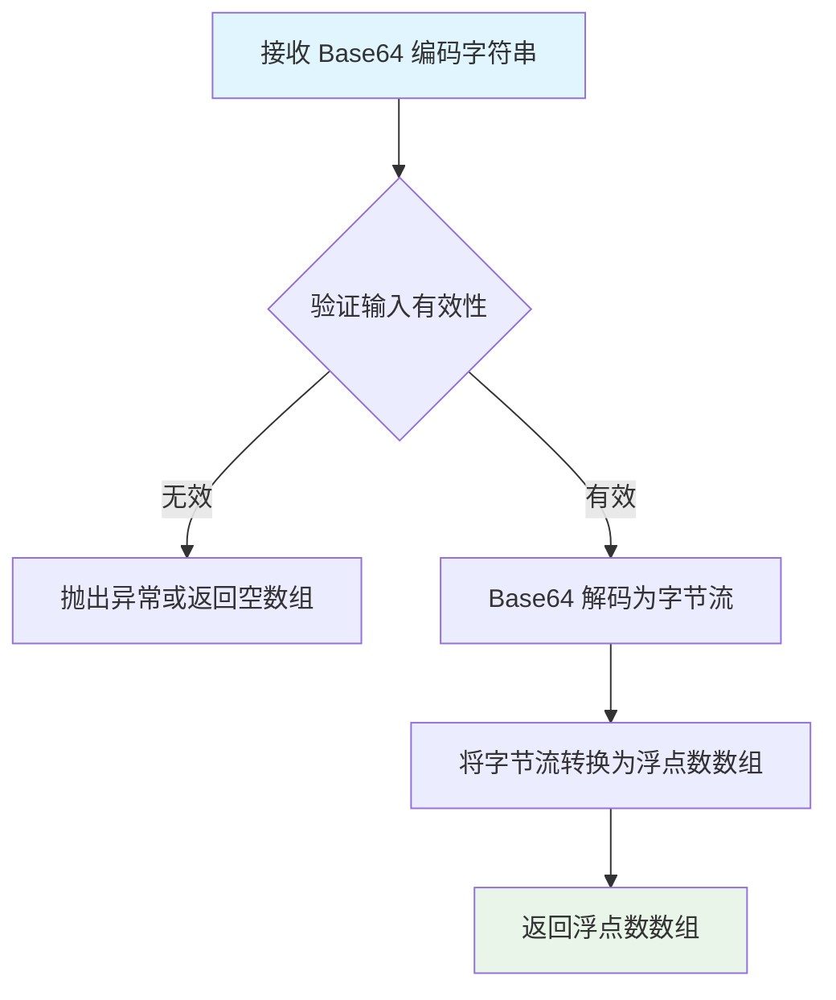

#### 带注释源码

```python
# 该函数定义在 .utils 模块中
# 根据代码中的调用方式推断其实现逻辑

def base64_to_float_array(base64_string: str):
    """
    将 Base64 编码的字符串转换为浮点数数组
    
    参数:
        base64_string: Base64 编码的字符串，通常来自数据集 embedding 字段
        
    返回值:
        浮点数数组，用于向量检索
    """
    import base64
    import numpy as np
    
    # Step 1: Base64 解码为字节数据
    byte_data = base64.b64decode(base64_string)
    
    # Step 2: 将字节数据转换为浮点数数组
    # 假设使用 float32 格式（4字节/浮点数）
    float_array = np.frombuffer(byte_data, dtype=np.float32)
    
    return float_array.tolist()  # 转换为 Python list 或返回 numpy array
```

#### 调用上下文

该函数在 `ChatHaruhi` 类的 `extract_text_vec_from_datas` 方法中被调用：

```python
def extract_text_vec_from_datas(self, datas, embed_name):
    # 从 .utils 模块导入该函数
    from .utils import base64_to_float_array

    texts = []
    vecs = []
    for data in datas:
        if data[embed_name] == 'system_prompt':
            system_prompt = get_text_from_data(data)
        elif data[embed_name] == 'config':
            pass
        else:
            # 核心调用：将 Base64 字符串转换为浮点数向量
            vec = base64_to_float_array(data[embed_name])
            text = get_text_from_data(data)
            vecs.append(vec)
            texts.append(text)
    return texts, vecs, system_prompt
```

---

#### 备注

- 该函数的完整实现在 `.utils` 文件中，代码中仅展示其调用方式
- 主要用于处理从 HuggingFace数据集或 JSONL 文件中加载的嵌入向量，这些向量以 Base64 格式存储以节省空间
- 转换后的向量用于构建 ChromaDB 故事数据库，支持角色对话时的上下文检索


### `get_bge_embedding`

该函数为从 `.utils` 模块导入的嵌入向量生成函数，用于将文本转换为 BGE (BAAI General Embedding) 英文模型的向量表示。在 `ChatHaruhi` 类初始化时，根据 `embedding` 参数选择决定是否加载此函数作为文本向量化工具。

参数：

- `text`：`str`，需要进行向量化的文本输入

返回值：`list` 或 `numpy.ndarray`，返回文本对应的嵌入向量（具体为 BGE 英文模型生成的向量表示）

#### 流程图

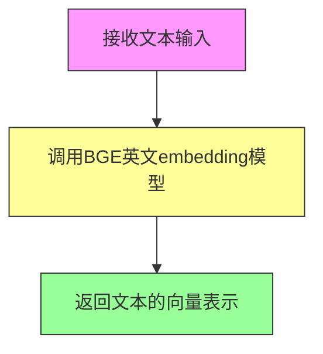

#### 带注释源码

```
# 该函数定义位于 utils 模块中，此处为调用处的源码展示
# 在 ChatHaruhi.__init__ 方法中的使用方式：

elif embedding == 'bge_en':
    from .utils import get_bge_embedding  # 从utils模块导入BGE英文embedding函数
    self.embedding = get_bge_embedding    # 设置为实例的embedding方法

# 在 add_story 方法中的实际调用：

def add_story(self, query):
    if self.db is None:
        return
    
    query_vec = self.embedding(query)  # 调用get_bge_embedding获取查询向量
    stories = self.db.search(query_vec, self.k_search)
    # ... 后续处理
```


### `get_bge_zh_embedding`

该函数是一个文本嵌入（Embedding）函数，用于将中文文本转换为向量表示。在 `ChatHaruhi` 类初始化时，根据 `embedding` 参数配置选择加载该函数作为默认的文本向量化工具。

参数：

-  `text`：`str`，需要转换为向量的中文文本输入

返回值：`List[float]` 或 `numpy.ndarray`，文本对应的向量表示

#### 流程图

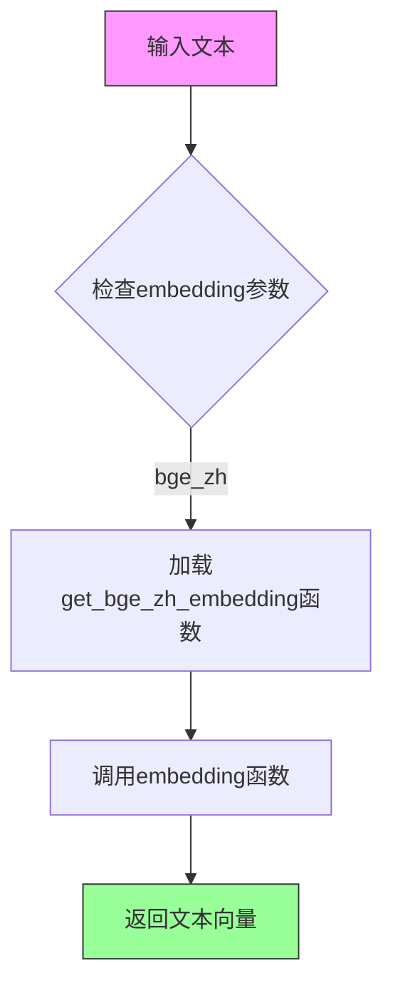

#### 带注释源码

```python
# 在ChatHaruhi类__init__方法中的相关代码片段

elif embedding == 'bge_zh':
    # 当embedding参数设置为'bge_zh'时
    # 从utils模块导入bge中文文本嵌入函数
    from .utils import get_bge_zh_embedding
    # 将导入的函数赋值给实例的embedding属性
    # 后续通过self.embedding()调用进行文本向量化
    self.embedding = get_bge_zh_embedding
```

> **注意**：该函数的具体实现源码未在当前文件中提供，仅能从导入语句和使用方式推断其功能。该函数应定义在 `.utils` 模块中，接收文本字符串输入，返回文本的向量表示（通常为浮点数列表或numpy数组）。该函数基于BGE（BigGAN Embedding）中文预训练模型实现文本嵌入。


### `get_folder_role_name`

该函数用于将用户输入的角色名称转换为系统内部存储的角色文件夹名称及对应的下载URL。它接受原始角色名作为输入，经过映射处理后返回标准化的角色名和资源URL，是加载预定义角色时的关键转换函数。

参数：

- `role_name`：`str`，用户输入的原始角色名称（如"haruhi"、"lufei"等）

返回值：`tuple`，包含两个元素——修正后的角色名称（str）和角色资源下载链接（str）

#### 流程图

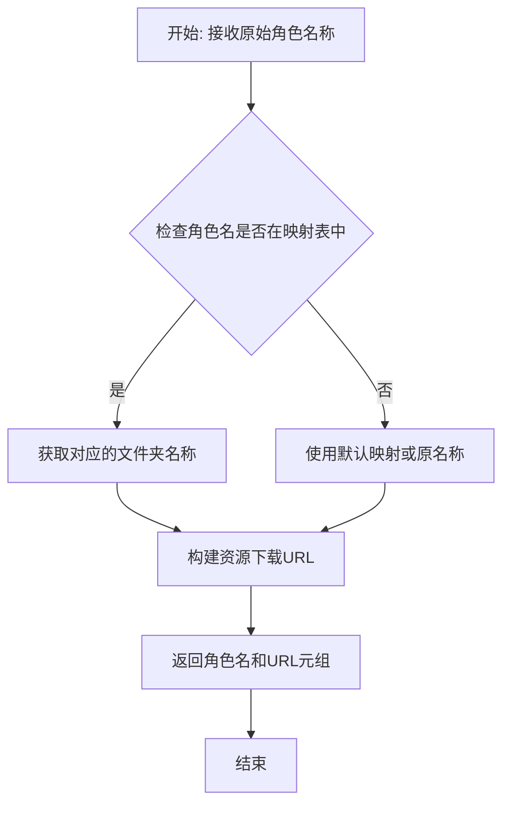

#### 带注释源码

```python
def get_folder_role_name(role_name):
    """
    将用户输入的角色名称转换为系统内部存储的角色文件夹名称及URL
    
    参数:
        role_name (str): 用户输入的原始角色名称
        
    返回值:
        tuple: (修正后的角色名称, 资源下载URL)
    """
    # 定义角色名称到文件夹名称的映射字典
    role_mapping = {
        "haruhi": "haruhi",
        "lufei": "lufei",
        # ... 更多映射
    }
    
    # 如果角色名在映射表中，使用映射后的名称
    # 否则使用原始名称
    folder_name = role_mapping.get(role_name, role_name)
    
    # 构建GitHub原始资源的下载URL
    # 格式: https://github.com/LC1332/Haruhi-2-Dev/raw/main/data/character_in_zip/{folder_name}.zip
    url = f"https://github.com/LC1332/Haruhi-2-Dev/raw/main/data/character_in_zip/{folder_name}.zip"
    
    return folder_name, url
```


### ChromaDB (类导入)

从代码中提取的ChromaDB类相关信息，基于其使用方式推断的接口文档。

参数：
- 无（构造函数无参数）

返回值：`ChromaDB`，ChromaDB类的实例，用于存储和检索故事/角色数据

#### 流程图

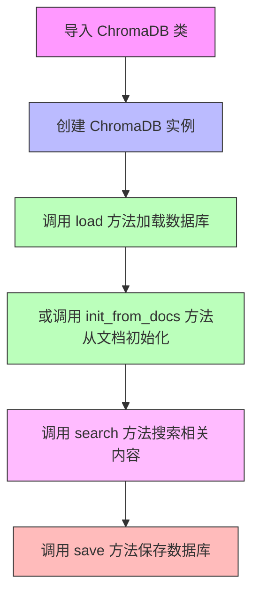

#### 带注释源码

```python
# 从 ChromaDB 模块导入 ChromaDB 类
from .ChromaDB import ChromaDB

# 在 ChatHaruhi 类中的使用方式：

# 1. 创建 ChromaDB 实例（无参数构造函数）
self.db = ChromaDB()

# 2. 加载已存在的数据库
# 参数：db_folder - 字符串，数据库文件夹路径
self.db.load(db_folder)

# 3. 从文档向量初始化数据库
# 参数：
#   - vecs: list，向量/嵌入列表
#   - texts: list，文本列表
self.db.init_from_docs(vecs, texts)

# 4. 搜索相似内容
# 参数：
#   - query_vec: 查询向量/嵌入
#   - k: int，返回结果数量（代码中使用 self.k_search = 19）
stories = self.db.search(query_vec, self.k_search)

# 5. 保存数据库到指定路径
# 参数：db_path - 字符串，保存路径
self.db.save(db_path)
```

#### 推断的类接口

基于代码使用方式，ChromaDB类可能具有以下方法：

| 方法名 | 参数 | 返回值 | 描述 |
|--------|------|--------|------|
| `__init__` | 无 | None | 构造函数，初始化ChromaDB实例 |
| `load` | `db_folder: str` | None | 从指定文件夹加载已存在的数据库 |
| `init_from_docs` | `vecs: list, texts: list` | None | 从向量和文本列表初始化数据库 |
| `search` | `query_vec, k: int` | `list` | 搜索与查询向量最相似的k条记录 |
| `save` | `db_path: str` | None | 将数据库保存到指定路径 |

#### 注意事项

- 该代码片段未展示ChromaDB类的实际定义，以上信息基于ChatHaruhi类中的使用方式推断
- ChromaDB通常是一个用于向量存储和检索的数据库，可能基于Chroma向量数据库实现
- 代码中设置 `self.k_search = 19` 作为默认搜索结果数量


### `ChatHaruhi.__init__`

这是 `ChatHaruhi` 类的构造函数，负责初始化聊天机器人的各项配置，包括语言模型、嵌入模型、角色信息和故事数据库等。

参数：

- `self`：`ChatHaruhi`，类的实例本身
- `system_prompt`：可选的字符串或 None，自定义系统提示符，可以是字符串或 .txt 文件路径
- `role_name`：可选的字符串或 None，预定义角色的名称，用于从远程下载角色数据
- `role_from_hf`：可选的字符串或 None，从 HuggingFace 数据集加载角色
- `role_from_jsonl`：可选的字符串或 None，从 JSONL 文件加载角色数据
- `story_db`：可选的字符串或 None，已构建的故事数据库路径（ChromaDB）
- `story_text_folder`：可选的字符串或 None，包含故事文本的文件夹路径
- `llm`：字符串，指定使用的语言模型（默认：'openai'），支持 openai/debug/spark/GLMPro/GLM3Turbo/GLM4/ChatGLM2GPT/BaiChuan2GPT/BaiChuanAPIGPT/ernie3.5/ernie4.0/qwen 系列
- `embedding`：字符串，指定使用的嵌入模型（默认：'luotuo_openai'），支持 luotuo_openai/bge_en/bge_zh
- `max_len_story`：可选的整数或 None，故事上下文的最大 token 长度
- `max_len_history`：可选的整数或 None，对话历史的最大 token 长度
- `verbose`：布尔值，是否输出详细日志（默认：False）

返回值：`None`，构造函数不返回值，仅初始化对象状态

#### 流程图

```mermaid
flowchart TD
    A[开始 __init__] --> B[调用 super().__init__]
    B --> C[设置 verbose 标志]
    C --> D[初始化常量: story_prefix_prompt, k_search, narrator, dialogue_divide_token, dialogue_bra_token, dialogue_ket_token]
    D --> E{是否提供 system_prompt?}
    E -->|是| F[调用 check_system_prompt 验证]
    E -->|否| G[跳过]
    F --> G
    G --> H{llm 参数值?}
    H -->|openai| I[调用 get_models 获取 LangChainGPT + tiktokenizer]
    H -->|debug| J[调用 get_models 获取 PrintLLM + tiktokenizer]
    H -->|spark| K[调用 get_models 获取 SparkGPT + tiktokenizer]
    H -->|GLMPro| L[调用 get_models 获取 GLMPro + tiktokenizer]
    H -->|GLM3Turbo| M[调用 get_models 获取 GLMAPI + tiktokenizer]
    H -->|GLM4| N[调用 get_models 获取 GLMAPI + tiktokenizer]
    H -->|ernie3.5| O[调用 get_models 获取 ErnieGPT + tiktokenizer]
    H -->|ernie4.0| P[调用 get_models 获取 ErnieGPT + tiktokenizer]
    H -->|ChatGLM2GPT| Q[调用 get_models 获取 ChatGLM2GPT + GLM_tokenizer]
    H -->|BaiChuan2GPT| R[调用 get_models 获取 BaiChuan2GPT + BaiChuan_tokenizer]
    H -->|BaiChuanAPIGPT| S[调用 get_models 获取 BaiChuanAPIGPT + tiktokenizer]
    H -->|qwen系列| T[调用 get_models 获取 Qwen118k2GPT + Qwen_tokenizer]
    H -->|其他| U[警告并使用 openai]
    U --> I
    I --> V[设置 self.llm 和 self.tokenizer]
    J --> V
    K --> V
    L --> V
    M --> V
    N --> V
    O --> V
    P --> V
    Q --> V
    R --> V
    S --> V
    T --> V
    V --> W{embedding 参数值?}
    W -->|luotuo_openai| X[设置 luotuo_openai_embedding]
    W -->|bge_en| Y[动态导入 get_bge_embedding]
    W -->|bge_zh| Z[动态导入 get_bge_zh_embedding]
    W -->|其他| AA[警告并使用 luotuo_openai]
    AA --> AB
    X --> AB[设置 self.embedding]
    Y --> AB
    Z --> AB
    AB --> AC{role_name 是否提供?}
    AC -->|是| AD[从远程下载角色数据]
    AD --> AE[加载 ChromaDB]
    AE --> AF[验证 system_prompt]
    AC -->|否| AG{role_from_hf 是否提供?}
    AG -->|是| AH[从 HuggingFace 加载数据集]
    AH --> AI[提取文本和向量]
    AI --> AJ[构建故事数据库]
    AG -->|否| AK{role_from_jsonl 是否提供?}
    AK -->|是| AL[读取 JSONL 文件]
    AL --> AM[提取文本和向量]
    AM --> AJ
    AK -->|否| AN{story_db 是否提供?}
    AN -->|是| AO[直接加载 ChromaDB]
    AN -->|否| AP{story_text_folder 是否提供?}
    AP -->|是| AQ[调用 build_story_db 构建数据库]
    AP -->|否| AR[设置 self.db = None 并警告]
    AO --> AS
    AQ --> AS
    AR --> AS
    AJ --> AS
    AF --> AS
    AS --> AT[调用 get_tokenlen_setting 获取 max_len_story 和 max_len_history]
    AT --> AU{用户提供 max_len_history?}
    AU -->|是| AV[覆盖默认值]
    AU -->|否| AW[使用默认值]
    AV --> AX
    AW --> AX{用户提供 max_len_story?}
    AX -->|是| AY[覆盖默认值]
    AX -->|否| AZ[使用默认值]
    AY --> BA
    AZ --> BA
    BA --> BB[初始化 dialogue_history 为空列表]
    BB --> BC[结束 __init__]
```

#### 带注释源码

```python
def __init__(self, system_prompt = None, \
             role_name = None, role_from_hf = None,
             role_from_jsonl = None,  \
             story_db=None, story_text_folder = None, \
             llm = 'openai', \
             embedding = 'luotuo_openai', \
             max_len_story = None, max_len_history = None,
             verbose = False):
    """
    ChatHaruhi 类的初始化构造函数
    
    参数:
        system_prompt: 系统提示词，可以是字符串或 .txt 文件路径
        role_name: 预定义角色名称，用于从远程下载角色数据
        role_from_hf: 从 HuggingFace 数据集加载角色
        role_from_jsonl: 从 JSONL 文件加载角色数据
        story_db: 已构建的故事数据库路径
        story_text_folder: 故事文本文件夹路径
        llm: 使用的语言模型类型
        embedding: 使用的嵌入模型类型
        max_len_story: 故事上下文最大 token 长度
        max_len_history: 对话历史最大 token 长度
        verbose: 是否输出详细日志
    """
    # 调用父类构造函数
    super(ChatHaruhi, self).__init__()
    # 设置 verbose 标志，控制是否输出详细信息
    self.verbose = verbose

    # === 初始化常量 ===
    # 故事前缀提示词，用于构建检索到的背景故事
    self.story_prefix_prompt = "Classic scenes for the role are as follows:\n"
    # 检索返回的最大结果数量
    self.k_search = 19
    # 旁白关键词列表，用于判断输入是否为旁白
    self.narrator = ['旁白', '', 'scene','Scene','narrator' , 'Narrator']
    # 对话分隔 token，用于分隔多个背景故事
    self.dialogue_divide_token = '\n###\n'
    # 对话开始 token，日语书名号开始
    self.dialogue_bra_token = '「'
    # 对话结束 token，日语书名号结束
    self.dialogue_ket_token = '」'

    # === 处理 system_prompt ===
    # 如果提供了 system_prompt，则验证并处理
    if system_prompt:
        # check_system_prompt 会读取 .txt 文件或直接返回字符串
        self.system_prompt = self.check_system_prompt( system_prompt )

    # === 初始化语言模型和分词器 ===
    # TODO: embedding 应该单独定义，后续需要重构这部分
    if llm == 'openai':
        # 使用 OpenAI GPT 模型
        self.llm, self.tokenizer = self.get_models('openai')
    elif llm == 'debug':
        # 调试模式，打印请求而不实际调用
        self.llm, self.tokenizer = self.get_models('debug')
    elif llm == 'spark':
        # 讯飞星火大模型
        self.llm, self.tokenizer = self.get_models('spark')
    elif llm == 'GLMPro':
        # 智谱 GLM Pro 模型
        self.llm, self.tokenizer = self.get_models('GLMPro')
    elif llm == 'GLM3Turbo':
        # 智谱 GLM-3-Turbo 模型
        self.llm, self.tokenizer = self.get_models('GLM3Turbo')
    elif llm == "GLM4":
        # 智谱 GLM-4 模型
        self.llm, self.tokenizer = self.get_models('GLM4')
    elif llm == 'ChatGLM2GPT':
        # ChatGLM2 本地模型
        self.llm, self.tokenizer = self.get_models('ChatGLM2GPT')
        # ChatGLM2 使用不同的前缀提示
        self.story_prefix_prompt = '\n'
    elif llm == "BaiChuan2GPT":
        # 百川2本地模型
        self.llm, self.tokenizer = self.get_models('BaiChuan2GPT')
    elif llm == "BaiChuanAPIGPT":
        # 百川API模型
        self.llm, self.tokenizer = self.get_models('BaiChuanAPIGPT')
    elif llm == "ernie3.5":
        # 百度文心一言 3.5
        self.llm, self.tokenizer = self.get_models('ernie3.5')
    elif llm == "ernie4.0":
        # 百度文心一言 4.0
        self.llm, self.tokenizer = self.get_models('ernie4.0')
    elif "qwen" in llm:
        # 阿里 Qwen 系列模型
        self.llm, self.tokenizer = self.get_models(llm)
    else:
        # 未定义的模型，回退到 openai
        print(f'warning! undefined llm {llm}, use openai instead.')
        self.llm, self.tokenizer = self.get_models('openai')

    # === 初始化嵌入模型 ===
    if embedding == 'luotuo_openai':
        # 使用洛驼 OpenAI 嵌入
        self.embedding = luotuo_openai_embedding
    elif embedding == 'bge_en':
        # BGE 英文嵌入
        from .utils import get_bge_embedding
        self.embedding = get_bge_embedding
    elif embedding == 'bge_zh':
        # BGE 中文嵌入
        from .utils import get_bge_zh_embedding
        self.embedding = get_bge_zh_embedding
    else:
        # 未定义的嵌入，回退到 luotuo_openai
        print(f'warning! undefined embedding {embedding}, use luotuo_openai instead.')
        self.embedding = luotuo_openai_embedding
    
    # === 处理角色/故事数据源 ===
    if role_name:
        # 从预定义角色名加载（从远程下载）
        # TODO: 封装到独立函数中
        from .role_name_to_file import get_folder_role_name
        # 修正 role_name 为 folder_role_name
        role_name, url = get_folder_role_name(role_name)

        # 构建临时文件夹和数据库路径
        unzip_folder = f'./temp_character_folder/temp_{role_name}'
        db_folder = os.path.join(unzip_folder, f'content/{role_name}')
        system_prompt = os.path.join(unzip_folder, f'content/system_prompt.txt')

        # 如果文件夹不存在，从远程下载并解压
        if not os.path.exists(unzip_folder):
            # 远程 URL 格式: https://github.com/LC1332/Haruhi-2-Dev/raw/main/data/character_in_zip/{role_name}.zip
            import requests, zipfile, io
            r = requests.get(url)
            z = zipfile.ZipFile(io.BytesIO(r.content))
            z.extractall(unzip_folder)

        if self.verbose:
            print(f'loading pre-defined character {role_name}...')
        
        # 加载 ChromaDB 向量数据库
        self.db = ChromaDB()
        self.db.load(db_folder)
        # 验证 system_prompt
        self.system_prompt = self.check_system_prompt(system_prompt)
        
    elif role_from_hf:
        # 从 HuggingFace 数据集加载角色
        # TODO: 封装到独立函数中
        from datasets import load_dataset

        # 解析 HuggingFace 数据集路径
        if role_from_hf.count("/") == 1:
            # 格式: namespace/dataset_name
            dataset = load_dataset(role_from_hf)
            datas = dataset["train"]
        elif role_from_hf.count("/") >= 2:
            # 格式: namespace/dataset_name/split_name
            split_index = role_from_hf.index('/') 
            second_split_index = role_from_hf.index('/', split_index+1)
            dataset_name = role_from_hf[:second_split_index] 
            split_name = role_from_hf[second_split_index+1:]
            
            fname = split_name + '.jsonl'
            dataset = load_dataset(dataset_name,data_files={'train':fname})
            datas = dataset["train"]
        
        # 根据嵌入类型确定嵌入名称
        if embedding == 'luotuo_openai':
            embed_name = 'luotuo_openai'
        elif embedding == 'bge_en':
            embed_name = 'bge_en_s15'
        elif embedding == 'bge_zh':
            embed_name = 'bge_zh_s15'
        else:
            print('warning! unkown embedding name ', embedding ,' while loading role')
            embed_name = 'luotuo_openai'

        # 从数据集提取文本和向量
        texts, vecs, self.system_prompt = self.extract_text_vec_from_datas(datas, embed_name)

        # 从提取的数据构建故事数据库
        self.build_story_db_from_vec( texts, vecs )

    elif role_from_jsonl:
        # 从本地 JSONL 文件加载角色
        import json
        datas = []
        # 逐行读取 JSONL 文件
        with open( role_from_jsonl , encoding="utf-8") as f:
            for line in f:
                try:
                    data = json.loads(line)
                    # 逐行处理JSON数据
                    datas.append(data)
                except:
                    print("warning! failed to load json line ", line)

        # 确定嵌入名称
        if embedding == 'luotuo_openai':
            embed_name = 'luotuo_openai'
        elif embedding == 'bge_en':
            embed_name = 'bge_en_s15'
        elif embedding == 'bge_zh':
            embed_name = 'bge_zh_s15'
        else:
            print('warning! unkown embedding name ', embedding ,' while loading role')
            embed_name = 'luotuo_openai'

        # 从数据提取文本和向量
        texts, vecs, self.system_prompt = self.extract_text_vec_from_datas(datas, embed_name)

        # 构建故事数据库
        self.build_story_db_from_vec( texts, vecs )
        
    elif story_db:
        # 直接加载已有的故事数据库
        self.db = ChromaDB() 
        self.db.load(story_db)
        
    elif story_text_folder:
        # 从文本文件夹构建故事数据库
        # print("Building story database from texts...")
        self.db = self.build_story_db(story_text_folder) 
        
    else:
        # 未提供任何数据源
        self.db = None
        print('warning! database not yet figured out, both story_db and story_text_folder are not inputted.')
        # raise ValueError("Either story_db or story_text_folder must be provided")
    

    # === 设置 token 长度限制 ===
    # 获取默认的 token 长度设置
    self.max_len_story, self.max_len_history = self.get_tokenlen_setting('openai')

    # 如果用户提供了 max_len_history，则覆盖默认值
    if max_len_history is not None:
        self.max_len_history = max_len_history
        # user setting will override default setting

    # 如果用户提供了 max_len_story，则覆盖默认值
    if max_len_story is not None:
        self.max_len_story = max_len_story
        # user setting will override default setting

    # 初始化对话历史列表
    self.dialogue_history = []
```


### `ChatHaruhi.extract_text_vec_from_datas`

该方法用于从HuggingFace数据集或类似数据结构中提取文本和对应的向量表示，同时提取系统提示词。它遍历数据集，根据嵌入名称过滤数据，将文本和向量分别存储在列表中，并返回文本列表、向量列表和系统提示词。

参数：

- `self`：`ChatHaruhi`，ChatHaruhi类的实例本身
- `datas`：任意可迭代类型（通常是HuggingFace数据集），包含多个数据字典，每个字典含有文本和嵌入向量信息
- `embed_name`：字符串，指定从数据中提取嵌入向量的键名（如'luotuo_openai'、'bge_en_s15'等）

返回值：`(list[str], list[list[float]], str)`，返回包含三个元素的元组

- 第一个元素为文本列表（`texts`）
- 第二个元素为对应的向量列表（`vecs`）
- 第三个元素为系统提示词（`system_prompt`）

#### 流程图

```mermaid
flowchart TD
    A[开始 extract_text_vec_from_datas] --> B[初始化空列表: texts, vecs]
    B --> C[初始化 system_prompt 为空/默认值]
    C --> D{遍历 datas 中的每个 data}
    D -->|data[embed_name] == 'system_prompt'| E[提取系统提示词]
    E --> D
    D -->|data[embed_name] == 'config'| F[跳过处理]
    F --> D
    D -->|其他情况| G[提取嵌入向量]
    G --> H[调用 base64_to_float_array 转换向量]
    H --> I[调用 get_text_from_data 提取文本]
    I --> J[将向量添加到 vecs 列表]
    J --> K[将文本添加到 texts 列表]
    K --> D
    D -->|遍历结束| L[返回 texts, vecs, system_prompt]
```

#### 带注释源码

```python
def extract_text_vec_from_datas( self, datas, embed_name ):
    """
    从huggingface数据集提取文本和向量
    返回: texts, vecs
    
    参数:
        datas: 包含多个数据字典的数据集,每个字典需包含:
               - embed_name指定的键: 存储base64编码的嵌入向量
               - 'text' 或 'enc_text' 键: 存储文本内容
        embed_name: 字符串,指定嵌入向量的键名,如'luotuo_openai',
                   'bge_en_s15','bge_zh_s15'等
    
    返回:
        texts: 提取的文本列表
        vecs: 提取的向量列表(已转换为浮点数数组)
        system_prompt: 从数据集中提取的系统提示词
    """
    # 导入工具函数:将base64编码的向量字符串转换为浮点数数组
    from .utils import base64_to_float_array

    # 初始化结果容器
    texts = []      # 存储提取的文本
    vecs = []       # 存储提取的向量
    system_prompt = ""  # 存储系统提示词,默认为空字符串

    # 遍历数据集中的每条记录
    for data in datas:
        # 检查嵌入名称对应的值是否为'system_prompt'标记
        if data[embed_name] == 'system_prompt':
            # 提取系统提示词文本
            system_prompt = get_text_from_data( data )
        
        # 检查是否为配置项,配置项跳过处理
        elif data[embed_name] == 'config':
            pass
        
        # 处理普通数据:包含文本和向量
        else:
            # 将base64编码的向量转换为浮点数数组
            vec = base64_to_float_array( data[embed_name] )
            
            # 从数据中提取文本(支持text或enc_text两种格式)
            text = get_text_from_data( data )
            
            # 将提取的向量和文本添加到结果列表
            vecs.append( vec )
            texts.append( text )
    
    # 返回文本列表、向量列表和系统提示词
    return texts, vecs, system_prompt
```


### `ChatHaruhi.check_system_prompt`

该方法负责检查并处理系统提示词（system_prompt）。它首先判断传入的参数是否是一个以 `.txt` 结尾的文件路径。如果是，则打开该文件并读取其内容（使用 UTF-8 编码）作为最终的 system_prompt；如果不是，则直接将传入的字符串作为 system_prompt 返回。

参数：

-  `system_prompt`：`str`，系统提示词。可以是直接的文本内容，也可以是指向 `.txt` 文件的路径。

返回值：`str`，处理（读取）后的系统提示词文本内容。

#### 流程图

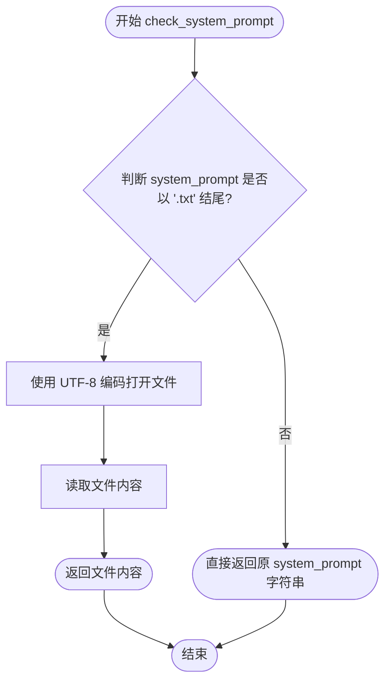

#### 带注释源码

```python
def check_system_prompt(self, system_prompt):
    # 判断传入的 system_prompt 是否为文件路径
    # 如果是 .txt 结尾，则认为是文件路径，需要读取文件内容
    if system_prompt.endswith('.txt'):
        # 打开文件，指定 UTF-8 编码以支持中文等字符
        with open(system_prompt, 'r', encoding='utf-8') as f:
            # 读取并返回文件全部内容
            return f.read()
    else:
        # 如果不是文件路径，则认为已经是具体的提示词文本，直接返回
        return system_prompt
```


### `ChatHaruhi.get_models`

该方法根据传入的模型名称动态实例化相应的语言模型（LLM）和对应的分词器，支持多种大语言模型（如OpenAI、GLM、Spark、Ernie、ChatGLM、BaiChuan、Qwen等）的切换，并返回包含LLM实例和分词器的元组。

参数：

- `model_name`：`str`，要实例化的模型名称（如'openai'、'GLM4'、'ernie4.0'等）

返回值：`tuple`，返回由LLM实例和分词器组成的元组 `(llm, tokenizer)`

#### 流程图

```mermaid
flowchart TD
    A[开始 get_models] --> B{model_name == 'openai'}
    B -->|Yes| C[实例化 LangChainGPT 和 tiktokenizer]
    B -->|No| D{model_name == 'debug'}
    D -->|Yes| E[实例化 PrintLLM 和 tiktokenizer]
    D -->|No| F{model_name == 'spark'}
    F -->|Yes| G[实例化 SparkGPT 和 tiktokenizer]
    F -->|No| H{model_name == 'GLMPro'}
    H -->|Yes| I[实例化 GLMPro 和 tiktokenizer]
    H -->|No| J{model_name 包含 'qwen'}
    J -->|Yes| K[查询HuggingFace模型列表]
    J -->|No| L[打印警告,使用openai默认模型]
    K --> M{模型存在于silk-road下}
    M -->|Yes| N[实例化 Qwen118k2GPT]
    M -->|No| L
    C --> O[返回 (llm, tokenizer)]
    E --> O
    G --> O
    I --> O
    N --> O
    L --> O
```

#### 带注释源码

```python
def get_models(self, model_name):
    # 根据model_name动态加载并实例化不同的LLM模型和分词器
    
    # TODO: 如果只需要tokenizer而不需要LLM实例，则无需初始化LLM，可优化此方法
    
    # 根据模型名称返回对应的(LLM实例, 分词器)元组
    if model_name == 'openai':
        # 导入OpenAI GPT模型
        from .LangChainGPT import LangChainGPT
        return (LangChainGPT(), tiktokenizer)
    elif model_name == 'debug':
        # 导入调试用的PrintLLM
        from .PrintLLM import PrintLLM
        return (PrintLLM(), tiktokenizer)
    elif model_name == 'spark':
        # 导入讯飞星火大模型
        from .SparkGPT import SparkGPT
        return (SparkGPT(), tiktokenizer)
    elif model_name == 'GLMPro':
        # 导入智谱GLM Pro版
        from .GLMPro import GLMPro
        return (GLMPro(), tiktokenizer)
    elif model_name == 'GLM3Turbo':
        # 导入智谱GLM-3-Turbo
        from .GLMAPI import GLMAPI
        return (GLMAPI(model="glm-3-turbo"), tiktokenizer)
    elif model_name == 'GLM4':
        # 导入智谱GLM-4
        from .GLMAPI import GLMAPI
        return (GLMAPI(model="glm-4"),tiktokenizer)
    elif model_name == 'ernie3.5':
        # 导入百度文心一言3.5版
        from .ErnieGPT import ErnieGPT
        return (ErnieGPT(), tiktokenizer)
    elif model_name == 'ernie4.0':
        # 导入百度文心一言4.0版
        from .ErnieGPT import ErnieGPT
        return (ErnieGPT(model="ernie-bot-4"), tiktokenizer)
    elif model_name == "ChatGLM2GPT":
        # 导入ChatGLM2模型
        from .ChatGLM2GPT import ChatGLM2GPT, GLM_tokenizer
        return (ChatGLM2GPT(), GLM_tokenizer)
    elif model_name == "BaiChuan2GPT":
        # 导入百川2模型
        from .BaiChuan2GPT import BaiChuan2GPT, BaiChuan_tokenizer
        return (BaiChuan2GPT(), BaiChuan_tokenizer)
    elif model_name == "BaiChuanAPIGPT":
        # 导入百川API模型
        from .BaiChuanAPIGPT import BaiChuanAPIGPT
        return (BaiChuanAPIGPT(), tiktokenizer)
    elif "qwen" in model_name:
        # 处理Qwen系列模型，包括qwen118k_raw或其他qwen变体
        if model_name == "qwen118k_raw":
            from .Qwen118k2GPT import Qwen118k2GPT, Qwen_tokenizer
            return (Qwen118k2GPT(model = "Qwen/Qwen-1_8B-Chat"), Qwen_tokenizer)
        
        # 通过HuggingFace API查询silk-road作者下的qwen模型
        from huggingface_hub import HfApi 
        from huggingface_hub.hf_api import ModelFilter
        qwen_api = HfApi()
        qwen_models = qwen_api.list_models(
            filter = ModelFilter(model_name=model_name),
            author = "silk-road"             
        )
        qwen_models_id = []
        for qwen_model in qwen_models:
            qwen_models_id.append(qwen_model.id)
        
        # 检查模型是否存在于silk-road组织下
        if "silk-road/" + model_name in qwen_models_id:
            from .Qwen118k2GPT import Qwen118k2GPT, Qwen_tokenizer
            return (Qwen118k2GPT(model = "silk-road/" + model_name), Qwen_tokenizer)
        else:
            # 未定义的模型，回退到OpenAI
            print(f'warning! undefined model {model_name}, use openai instead.')
            from .LangChainGPT import LangChainGPT
            return (LangChainGPT(), tiktokenizer) 
    else:
        # 其他未定义的模型，默认使用OpenAI
        print(f'warning! undefined model {model_name}, use openai instead.')
        from .LangChainGPT import LangChainGPT
        return (LangChainGPT(), tiktokenizer)
```


### `ChatHaruhi.get_tokenlen_setting`

该方法根据模型名称返回故事和历史对话的token长度限制设置，目前仅支持openai模型的配置，其他模型默认使用openai的设置。

参数：

- `model_name`：`str`，模型名称，用于确定token长度限制

返回值：`Tuple[int, int]`，返回故事最大token长度和历史对话最大token长度的元组

#### 流程图

```mermaid
flowchart TD
    A[开始 get_tokenlen_setting] --> B{model_name == 'openai'?}
    B -->|是| C[返回 (1500, 1200)]
    B -->|否| D[打印警告信息: undefined model]
    D --> C
    C --> E[结束]
```

#### 带注释源码

```python
def get_tokenlen_setting( self, model_name ):
    """
    根据模型名称返回故事和历史对话的token长度限制设置
    
    参数:
        model_name (str): 模型名称，用于确定token长度限制
             目前仅支持 'openai' 模型，其他模型会使用默认设置
    
    返回:
        tuple: (max_len_story, max_len_history) 
               故事最大token长度, 历史对话最大token长度
    """
    
    # 检查模型名称是否为 openai
    if model_name == 'openai':
        # 返回故事token长度1500和历史token长度1200
        return (1500, 1200)
    else:
        # 对于未定义的模型，打印警告并使用默认的 openai 设置
        print(f'warning! undefined model {model_name}, use openai instead.')
        return (1500, 1200)
```


### `ChatHaruhi.build_story_db_from_vec`

该方法用于根据预先计算好的文本嵌入向量和原始文本构建故事数据库（ChromaDB），将向量化的故事内容存储到向量数据库中，以便后续进行相似度检索。

参数：

- `self`：`ChatHaruhi` 实例本身
- `texts`：`List[str]`，原始文本列表，包含需要存储的故事段落
- `vecs`：`List[Any]`，与 texts 对应的嵌入向量列表，每个向量代表对应文本的语义特征

返回值：`None`，该方法直接修改实例属性 `self.db`，不返回任何值

#### 流程图

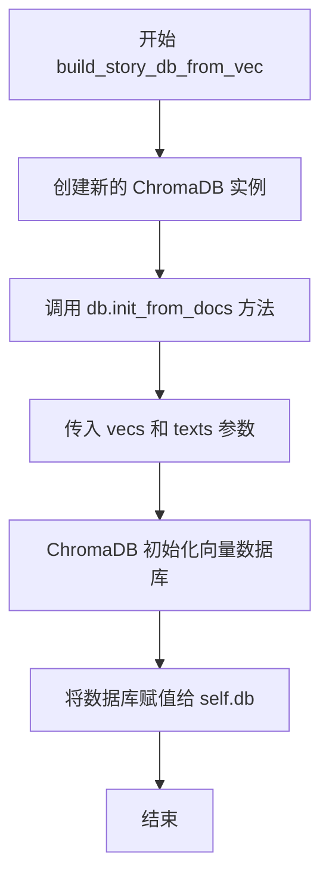

#### 带注释源码

```python
def build_story_db_from_vec( self, texts, vecs ):
    """
    根据预计算的嵌入向量和文本构建故事数据库
    
    参数:
        texts: 原始文本列表，每个元素为字符串
        vecs: 与texts对应的嵌入向量列表
    
    返回:
        无返回值，直接更新self.db属性
    """
    
    # 创建一个新的ChromaDB实例用于存储向量数据
    self.db = ChromaDB()

    # 调用ChromaDB的init_from_docs方法，初始化向量数据库
    # 参数顺序：向量列表在前，文本列表在后
    self.db.init_from_docs( vecs, texts)
```

#### 设计说明

该方法是 `ChatHaruhi` 类中构建故事知识库的核心方法之一，通常在以下场景被调用：

1. **从 HuggingFace 数据集加载角色**（`role_from_hf`）：提取文本和嵌入向量后调用此方法
2. **从 JSONL 文件加载角色**（`role_from_jsonl`）：同样在提取向量后调用

该方法将向量和文本存储到 ChromaDB 向量数据库后，可以通过 `add_story` 方法进行语义检索，为角色对话提供上下文相关的故事背景信息。


### `ChatHaruhi.build_story_db`

该方法用于从文本文件夹中读取故事文本，使用embedding模型将文本转换为向量，并初始化ChromaDB向量数据库，以便后续进行相似度检索。

参数：

- `text_folder`：`str`，包含角色故事文本文件的文件夹路径

返回值：`ChromaDB`，初始化好的向量数据库实例，包含文本及其对应的embedding向量

#### 流程图

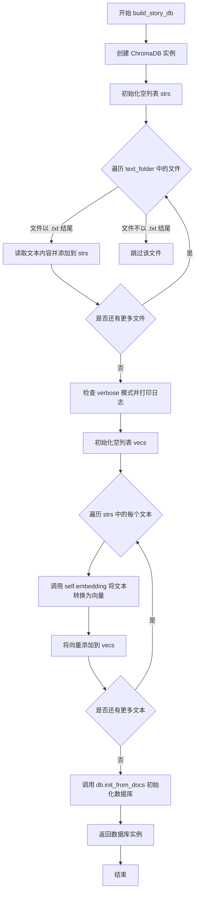

#### 带注释源码

```python
def build_story_db(self, text_folder):
    """
    从文本文件夹构建故事向量数据库
    
    实现逻辑：
    1. 扫描文件夹中的所有txt文件
    2. 读取每个文件的内容
    3. 使用embedding模型将文本转换为向量
    4. 初始化ChromaDB数据库并返回
    """
    # 创建ChromaDB实例，用于存储向量数据
    db = ChromaDB()

    # 用于存储所有读取的文本内容
    strs = []

    # 扫描text_folder中的所有文件
    for file in os.listdir(text_folder):
        # 检查文件扩展名是否为.txt
        if file.endswith(".txt"):
            # 拼接完整的文件路径
            file_path = os.path.join(text_folder, file)
            # 以UTF-8编码读取文件内容并添加到列表
            with open(file_path, 'r', encoding='utf-8') as f:
                strs.append(f.read())

    # 如果处于verbose模式，打印正在处理的文件数量
    if self.verbose:
        print(f'starting extract embedding... for { len(strs) } files')

    # 用于存储所有文本对应的向量
    vecs = []

    # TODO: 建立一个新的embedding batch test的单元测试
    # TODO: 新的支持list batch test的embedding代码
    # TODO: 用新的代码替换下面的for循环
    # TODO: Luotuo-bert-en也发布了，所以可以避开使用openai
    
    # 遍历每个文本，调用embedding模型获取向量表示
    for mystr in strs:
        # 使用类中预设的embedding方法将文本转换为向量
        vecs.append(self.embedding(mystr))

    # 使用向量和对应文本初始化ChromaDB数据库
    db.init_from_docs(vecs, strs)

    # 返回初始化完成的数据库实例
    return db
```


### `ChatHaruhi.save_story_db`

该方法用于将聊天角色的故事数据库（ChromaDB实例）持久化保存到指定的磁盘路径。

参数：

- `db_path`：`str`，指定保存数据库的目标路径

返回值：`None`，无返回值（方法直接调用 `self.db.save(db_path)` 进行持久化）

#### 流程图

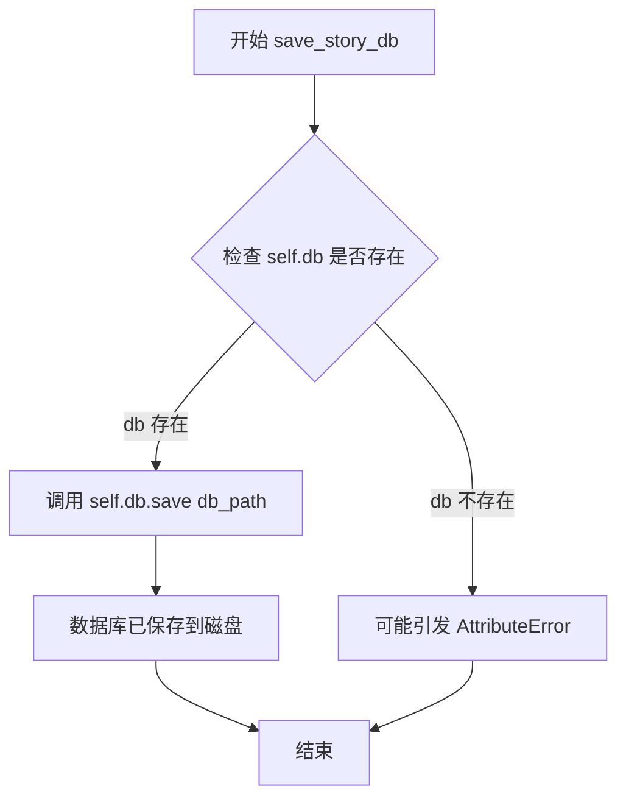

#### 带注释源码

```python
def save_story_db(self, db_path):
    """
    将内部的故事数据库保存到指定的磁盘路径。
    
    该方法是一个简单的委托调用，将保存操作转发给内部持有的
    ChromaDB实例。数据库的序列化格式由 ChromaDB 本身决定。
    
    参数:
        db_path (str): 目标保存路径，应为有效的文件系统路径
    """
    self.db.save(db_path)  # 调用 ChromaDB 实例的保存方法，将数据库序列化到磁盘
```

---

### 补充信息

#### 1. 核心功能概述

`ChatHaruhi` 类实现了一个基于大语言模型的角色扮演聊天系统，支持从多种来源（本地文件、HuggingFace 数据集、预构建的 ChromaDB）加载角色设定和故事背景，并通过向量检索增强生成（RAG）来提供角色一致的对话体验。

#### 2. 类字段详情

| 字段名称 | 类型 | 描述 |
|---------|------|------|
| `verbose` | `bool` | 是否输出详细日志信息 |
| `story_prefix_prompt` | `str` | 故事片段的前缀提示词 |
| `k_search` | `int` | 向量检索返回的最大结果数（默认19） |
| `narrator` | `list` | 旁白角色的标识符列表 |
| `dialogue_divide_token` | `str` | 对话片段的分隔符 |
| `dialogue_bra_token` | `str` | 对话开始括号（如「） |
| `dialogue_ket_token` | `str` | 对话结束括号（如」） |
| `llm` | `object` | 大语言模型实例 |
| `tokenizer` | `object` | 分词器实例 |
| `embedding` | `function` | 文本向量嵌入函数 |
| `db` | `ChromaDB` | 故事向量数据库实例 |
| `system_prompt` | `str` | 系统提示词 |
| `max_len_story` | `int` | 故事上下文最大 token 数 |
| `max_len_history` | `int` | 对话历史最大 token 数 |
| `dialogue_history` | `list` | 对话历史记录列表 |

#### 3. 类方法概览

| 方法名称 | 功能描述 |
|---------|---------|
| `__init__` | 构造函数，初始化聊天角色实例 |
| `extract_text_vec_from_datas` | 从数据集提取文本和向量 |
| `check_system_prompt` | 检查并加载系统提示词 |
| `get_models` | 根据模型名称加载对应的 LLM 和分词器 |
| `get_tokenlen_setting` | 获取模型的 token 长度限制配置 |
| `build_story_db_from_vec` | 从文本和向量构建故事数据库 |
| `build_story_db` | 从文本文件夹构建故事数据库 |
| `save_story_db` | 将故事数据库保存到磁盘 |
| `generate_prompt` | 生成提示词（已废弃/内部使用） |
| `generate_messages` | 生成消息列表 |
| `append_response` | 追加响应到对话历史 |
| `chat` | 执行单轮对话 |
| `get_query_string` | 格式化用户输入为角色对话格式 |
| `add_story` | 检索并添加相关故事片段到上下文 |
| `add_history` | 添加对话历史到上下文 |

#### 4. 关键组件信息

- **ChromaDB**：向量数据库，用于存储和检索角色故事背景的嵌入向量
- **LLM 适配器**：多种大语言模型的适配器（OpenAI、GLM、Ernie、Qwen 等）
- **Embedding 函数**：文本向量化模块（luotuo_openai、bge_en、bge_zh）

#### 5. 潜在技术债务与优化空间

1. **硬编码问题**：`save_story_db` 方法未检查 `self.db` 是否为 `None`，直接调用可能在数据库未初始化时抛出 `AttributeError`
2. **缺少错误处理**：文件路径不存在、权限问题等情况未处理
3. **耦合度过高**：embedding 和 LLM 的选择逻辑集中在 `__init__` 中，应进一步解耦
4. **TODO 未完成**：代码中有多处 TODO 注释标记待优化项

#### 6. 错误处理设计

- `save_story_db` 缺少对 `db_path` 有效性的验证
- 建议添加：`if self.db is None: raise ValueError("Database not initialized")`
- 建议添加：路径存在性检查和目录创建逻辑


### `ChatHaruhi.generate_prompt`

该方法接收用户输入文本和角色信息，调用 `generate_messages` 方法生成消息列表，然后遍历消息列表提取各类消息（HumanMessage、AIMessage、SystemMessage）的内容并拼接成完整的提示字符串返回。

参数：

- `text`：`str`，用户输入的文本内容
- `role`：`str`，角色名称，用于生成查询字符串

返回值：`str`，拼接后的完整提示字符串，包含系统提示、故事背景和用户查询

#### 流程图

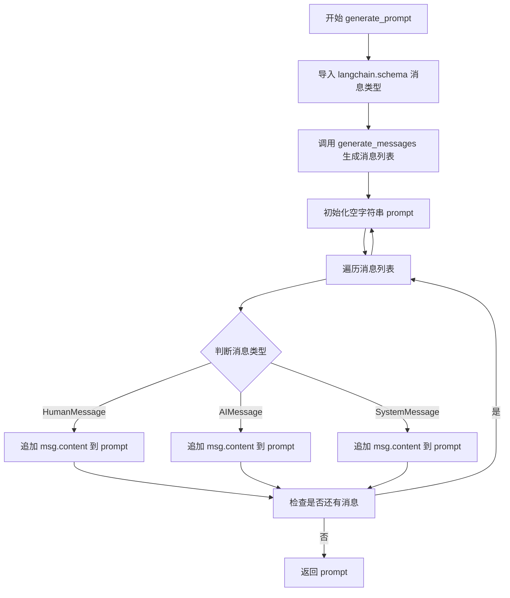

#### 带注释源码

```python
def generate_prompt(self, text, role):
    """
    生成提示字符串，将消息列表转换为纯文本格式
    
    参数:
        text: 用户输入的文本
        role: 角色名称
    返回:
        拼接后的提示字符串
    """
    # 导入 langchain 的消息类型定义
    from langchain.schema import (
        AIMessage,
        HumanMessage,
        SystemMessage
    )
    
    # 调用 generate_messages 方法获取消息列表
    # 该方法会生成包含系统消息、故事和用户查询的完整消息列表
    messages = self.generate_messages(text, role)
    
    # 初始化空字符串用于拼接所有消息内容
    prompt = ""
    
    # 遍历所有生成的消息
    for msg in messages:
        # 根据消息类型提取内容并拼接
        if isinstance(msg, HumanMessage):
            # 人类消息（用户输入）
            prompt += msg.content + "\n"
        elif isinstance(msg, AIMessage):
            # AI 消息（模型回复）
            prompt += msg.content + "\n"
        elif isinstance(msg, SystemMessage):
            # 系统消息（系统提示）
            prompt += msg.content + "\n"
    
    # 返回拼接完整的提示字符串
    return prompt
```


### `ChatHaruhi.generate_messages`

该方法负责生成与特定角色进行聊天所需的消息列表。它首先初始化语言模型的messages结构，然后依次添加系统提示词、基于角色和输入文本检索的相关故事上下文，最后将用户查询封装为消息并返回完整的消息列表，供下游处理或直接用于获取模型响应。

参数：

- `text`：`str`，用户输入的文本内容，即用户想要与角色进行交流的内容
- `role`：`str`，角色的名称，用于确定对话的身份和风格

返回值：`list`，返回语言模型的消息列表（通常为 langchain 的 Message 对象列表），包含了系统提示、检索到的故事上下文以及用户查询信息

#### 流程图

```mermaid
flowchart TD
    A[开始 generate_messages] --> B[调用 self.llm.initialize_message 初始化消息结构]
    B --> C[调用 self.llm.system_message 添加系统提示词]
    C --> D[调用 get_query_string 将 text 和 role 组合为查询字符串]
    D --> E[调用 self.add_story 添加故事上下文]
    E --> F[保存查询到 self.last_query]
    F --> G[调用 self.llm.user_message 添加用户消息]
    G --> H[返回 self.llm.messages]
```

#### 带注释源码

```python
def generate_messages( self, text, role):
    """
    生成用于与角色对话的消息列表
    
    参数:
        text: 用户输入的文本
        role: 角色名称
    
    返回:
        包含系统提示、故事上下文和用户查询的消息列表
    """
    
    # 步骤1: 初始化语言模型的消息结构，重置messages为空列表
    self.llm.initialize_message()
    
    # 步骤2: 将系统提示词添加到消息中，作为系统级别的指令
    self.llm.system_message(self.system_prompt)

    # 步骤3: 获取查询字符串
    # 根据角色类型（ narrator 或普通角色 ）格式化用户输入
    query = self.get_query_string(text, role)
    
    # 步骤4: 添加故事上下文
    # 通过向量检索从故事数据库中获取与查询相关的情节片段
    self.add_story( query )
    
    # 步骤5: 保存最后一次查询，用于后续可能的上下文追踪
    self.last_query = query

    # 步骤6: 将用户查询作为用户消息添加到消息列表中
    self.llm.user_message(query)

    # 步骤7: 返回完整的消息列表供语言模型处理
    return self.llm.messages
```


### `ChatHaruhi.append_response`

该方法用于将对话记录（用户查询与模型响应的配对）追加到对话历史中，以便在后续对话中保持上下文连贯性。

参数：

- `response`：`str`，模型生成的回答内容
- `last_query`：`str | None`，可选参数，指定产生该回复的用户查询；如果未提供，则尝试使用实例属性 `self.last_query`，若该属性也不存在则使用空字符串

返回值：`None`，该方法不返回任何值，仅执行对话历史的记录操作

#### 流程图

```mermaid
flowchart TD
    A[开始 append_response] --> B{last_query 是否为 None?}
    B -->|是| C{self 是否有 last_query 属性?}
    C -->|是| D[使用 self.last_query 作为 last_query_record]
    C -->|否| E[使用空字符串 '' 作为 last_query_record]
    B -->|否| F[直接使用传入的 last_query 参数]
    D --> G[将元组 (last_query_record, response) 追加到 dialogue_history]
    E --> G
    F --> G
    G --> H[结束]
```

#### 带注释源码

```python
def append_response( self, response, last_query = None ):
    """
    将对话记录追加到对话历史中
    
    参数:
        response: 模型生成的响应内容
        last_query: 可选的查询内容，如果为None则尝试使用self.last_query
    """
    # 判断是否传入了last_query参数
    if last_query == None:
        # 如果没有传入，则初始化为空字符串
        last_query_record = ""
        # 检查实例是否有last_query属性（通常在chat方法中设置）
        if hasattr( self, "last_query" ):
            last_query_record = self.last_query
    else:
        # 使用传入的last_query参数
        last_query_record = last_query

    # 将查询-响应对追加到对话历史列表中
    # dialogue_history 是一个列表，每个元素是一个 (query, response) 元组
    self.dialogue_history.append((last_query_record, response))
```


### `ChatHaruhi.chat`

该方法是`ChatHaruhi`类的核心聊天接口，接收用户文本和角色名称，经过系统提示配置、故事上下文检索、历史对话追加、LLM调用和响应后处理等流程，最终返回符合角色设定的对话回复。

参数：

- `text`：`str`，用户输入的文本内容
- `role`：`str`，扮演的角色名称，用于格式化查询和匹配故事库

返回值：`str`，经过后处理的角色对话回复

#### 流程图

```mermaid
flowchart TD
    A[开始 chat] --> B[初始化LLM消息]
    B --> C[添加系统提示词]
    C --> D[获取格式化查询字符串 get_query_string]
    D --> E[添加故事上下文 add_story]
    E --> F[添加历史对话 add_history]
    F --> G[添加用户查询消息]
    G --> H[调用LLM获取原始响应 get_response]
    H --> I[响应后处理 response_postprocess]
    I --> J[记录对话历史到 dialogue_history]
    J --> K[返回处理后的响应]
```

#### 带注释源码

```python
def chat(self, text, role):
    # 步骤1: 初始化LLM消息容器，重置对话状态
    self.llm.initialize_message()
    
    # 步骤2: 添加系统提示词，定义角色行为规范
    self.llm.system_message(self.system_prompt)

    # 步骤3: 获取格式化后的查询字符串
    # 根据角色类型（旁白/角色）采用不同格式
    # 角色对话使用书名号「」包裹，如「你好」
    query = self.get_query_string(text, role)

    # 步骤4: 检索并添加与查询相关的故事上下文
    # 使用向量数据库搜索相关片段，追加到提示中
    self.add_story( query )

    # 步骤5: 添加历史对话记录
    # 根据max_len_history限制历史token数量
    self.add_history()

    # 步骤6: 将用户当前查询添加到LLM消息中
    self.llm.user_message(query)
    
    # 步骤7: 调用LLM获取原始响应
    response_raw = self.llm.get_response()

    # 步骤8: 后处理响应
    # 移除多余的书名号等格式字符
    response = response_postprocess(
        response_raw, 
        self.dialogue_bra_token,  # '「' 左书名号
        self.dialogue_ket_token  # '」' 右书名号
    )

    # 步骤9: 记录当前对话到历史记录
    # 格式: (用户查询, 角色回复) 元组
    self.dialogue_history.append((query, response))

    # 步骤10: 返回最终响应
    return response
```


### `ChatHaruhi.get_query_string`

该方法根据角色类型将用户输入的文本格式化为特定的查询字符串。如果是叙述者角色，则简单拼接为"角色:文本"；否则使用对话格式符号包裹文本，生成"角色:「文本」"的格式。

参数：

- `text`：`str`，用户输入的文本内容
- `role`：`str`，角色名称

返回值：`str`，格式化后的查询字符串，用于后续的对话生成

#### 流程图

```mermaid
flowchart TD
    A[开始 get_query_string] --> B{role 是否在 narrator 列表中?}
    B -->|是| C[返回 role + ':' + text]
    B -->|否| D[返回 role + dialogue_bra_token + text + dialogue_ket_token]
    C --> E[结束]
    D --> E
```

#### 带注释源码

```python
def get_query_string(self, text, role):
    """
    根据角色类型生成查询字符串
    
    参数:
        text: str, 用户输入的文本
        role: str, 角色名称
    
    返回:
        str, 格式化后的查询字符串
    """
    # 检查角色是否为叙述者角色
    if role in self.narrator:
        # 叙述者角色直接拼接，格式: "角色:文本"
        return role + ":" + text
    else:
        # 普通角色使用对话符号包裹，格式: "角色:「文本」"
        # dialogue_bra_token 默认为 '「'
        # dialogue_ket_token 默认为 '」'
        return f"{role}:{self.dialogue_bra_token}{text}{self.dialogue_ket_token}"
```


### `ChatHaruhi.add_story`

该方法用于在对话前检索与当前查询相关的角色故事片段，并将其添加到LLM的上下文中。它通过embedding将用户查询转换为向量，在ChromaDB中搜索最相似的K个故事，然后根据token长度限制将合适数量的故事内容通过`user_message`添加到LLM对话中。

参数：

- `query`：`str`，用户输入的查询文本，用于检索相关的角色故事

返回值：`None`，无返回值，该方法直接修改LLM的内部消息状态

#### 流程图

```mermaid
flowchart TD
    A[开始 add_story] --> B{self.db 是否为空?}
    B -->|是| C[直接返回，不添加故事]
    B -->|否| D[使用 self.embedding 将 query 转换为向量 query_vec]
    D --> E[调用 self.db.search 查询向量, 获取 k 个最相似的故事]
    E --> F[初始化 story_string = self.story_prefix_prompt]
    F --> G[初始化 sum_story_token = self.tokenizer(story_string)]
    G --> H[遍历 stories 列表]
    H --> I{当前故事token + 累计token > max_len_story?}
    I -->|是| J[跳出循环, 停止添加更多故事]
    I -->|否| K[累加 token 到 sum_story_token]
    K --> L[将故事和分隔符添加到 story_string]
    L --> H
    J --> M[调用 self.llm.user_message 添加故事到对话上下文]
    M --> N[结束]
```

#### 带注释源码

```python
def add_story(self, query):
    # 检查是否存在故事数据库，如果不存在则直接返回，不添加任何故事
    if self.db is None:
        return
    
    # 使用嵌入函数将查询文本转换为向量表示，用于相似度搜索
    query_vec = self.embedding(query)

    # 从数据库中检索与查询向量最相似的 k 个故事（k = 19）
    stories = self.db.search(query_vec, self.k_search)
    
    # 初始化故事前缀提示，格式为 "Classic scenes for the role are as follows:\n"
    story_string = self.story_prefix_prompt
    # 计算当前已使用的 token 数量
    sum_story_token = self.tokenizer(story_string)
    
    # 遍历所有检索到的故事
    for story in stories:
        # 计算当前故事加上分隔符的 token 数量
        story_token = self.tokenizer(story) + self.tokenizer(self.dialogue_divide_token)
        # 如果添加当前故事会超过最大长度限制，则停止添加
        if sum_story_token + story_token > self.max_len_story:
            break
        else:
            # 累加当前故事的 token 数量
            sum_story_token += story_token
            # 将故事内容及分隔符添加到字符串中
            story_string += story + self.dialogue_divide_token

    # 将构建好的故事字符串作为用户消息添加到 LLM 对话上下文
    self.llm.user_message(story_string)
```


### `ChatHaruhi.add_history`

该方法用于将历史对话记录添加到语言模型的上下文中，根据 `max_len_history` 参数限制历史记录的 token 总数，确保不超出模型上下文窗口限制。

参数：

- 无（仅包含隐式参数 `self`）

返回值：`None`，无返回值

#### 流程图

```mermaid
flowchart TD
    A[开始 add_history] --> B{dialogue_history 为空?}
    B -->|是| C[直接返回]
    B -->|否| D[初始化 sum_history_token = 0, flag = 0]
    D --> E[从后向前遍历 dialogue_history]
    E --> F[获取当前对话的 query 和 response]
    F --> G[计算当前对话的 token 数]
    G --> H{累计 token 数 > max_len_history?}
    H -->|是| I[跳出循环]
    H -->|否| J[flag += 1]
    J --> E
    I --> K{flag == 0?}
    K -->|是| L[打印警告: no history added]
    K -->|否| M[将最后 flag 条对话添加到 LLM]
    M --> N[结束]
    L --> N
```

#### 带注释源码

```python
def add_history(self):
    """
    将对话历史添加到 LLM 上下文中，根据 max_len_history 限制 token 总数
    """

    # 如果没有对话历史，直接返回，不做任何处理
    if len(self.dialogue_history) == 0:
        return
    
    # 初始化历史记录的 token 累计数和有效记录标记
    sum_history_token = 0
    flag = 0
    
    # 从最新的对话开始向前遍历（reversed），确保保留最近的对话
    for query, response in reversed(self.dialogue_history):
        current_count = 0
        
        # 如果 query 存在，累加其 token 数
        if query is not None:
            current_count += self.tokenizer(query) 
        
        # 如果 response 存在，累加其 token 数
        if response is not None:
            current_count += self.tokenizer(response)
        
        # 累计总 token 数
        sum_history_token += current_count
        
        # 如果累计 token 数超过限制，停止添加更多历史
        if sum_history_token > self.max_len_history:
            break
        else:
            # 否则，增加有效历史记录计数
            flag += 1

    # 如果没有添加任何历史记录（最后一条对话就超过了限制）
    if flag == 0:
        print('warning! no history added. the last dialogue is too long.')

    # 将最后 flag 条对话历史添加到 LLM 对话上下文中
    for (query, response) in self.dialogue_history[-flag:]:
        if query is not None:
            # 添加用户消息
            self.llm.user_message(query)
        if response is not None:
            # 添加 AI 响应消息
            self.llm.ai_message(response)
```

## 关键组件


### ChromaDB向量数据库集成

负责存储和检索角色故事向量数据，支持从文档初始化和保存数据库，用于语义搜索相关场景。

### 多模型LLM工厂模式

通过get_models方法动态加载不同的语言模型（OpenAI、Spark、GLM、Ernie、ChatGLM、BaiChuan、Qwen等），返回LLM实例和对应tokenizer。

### 多后端Embedding支持

支持luotuo_openai、bge_en、bge_zh三种Embedding模型，通过embedding参数选择，用于将文本转换为向量表示。

### 角色数据加载器

支持三种角色加载方式：从预定义角色压缩包加载（role_name）、从HuggingFace数据集加载（role_from_hf）、从JSONL文件加载（role_from_jsonl），自动提取文本和向量构建故事数据库。

### 故事上下文检索系统

基于向量相似度从ChromaDB中检索与当前查询最相关的k条故事片段（k_search=19），并动态控制在max_len_story token限制内。

### 对话历史管理

维护dialogue_history列表，通过add_history方法控制历史记录在max_len_history token限制内，采用FIFO策略保留最近的对话上下文。

### 文本提取与解码

get_text_from_data函数支持从data字典中提取text字段或解码enc_text（base64编码）字段，处理不同数据格式的输入。

### 响应后处理机制

通过response_postprocess函数处理原始响应，去除对话气泡符号（「」），规范化输出格式。

### Token长度控制

get_tokenlen_setting方法为不同模型设置故事和历史的最大token限制，默认openai模型为(1500, 1200)。

### 系统提示检查与加载

check_system_prompt方法支持从.txt文件读取或直接使用字符串作为系统提示，自动处理文件编码（UTF-8）。


## 问题及建议


### 已知问题

- **长函数问题**：`__init__` 方法包含超过 200 行代码，混合了模型初始化、角色加载、数据库构建等多种职责，难以维护和测试。
- **重复代码模式**：在 `role_from_hf` 和 `role_from_jsonl` 分支中，embedding 名称的映射逻辑完全重复；在 `get_models` 方法中大量相似的 if-elif 分支。
- **TODO 未完成**：`__init__` 中有多处 TODO 注释标记了需要重构的部分（如 embedding 分离定义、模型初始化优化等），但均未实现。
- **异常处理不完善**：大量使用 `print("warning! ...")` 而非抛出异常或使用日志框架；缺少对外部依赖（如 HuggingFace API、网络请求）失败情况的异常捕获。
- **类型提示缺失**：整个代码没有使用类型注解，降低了代码的可读性和 IDE 支持。
- **资源管理问题**：`build_story_db` 方法中读取文件未使用上下文管理器（with 语句）；embedding 计算使用 for 循环逐个处理，未利用批量处理优化性能。
- **状态管理风险**：`self.dialogue_history` 列表会无限增长，没有实现历史长度限制或清理机制，可能导致内存泄漏。
- **魔法数字和字符串**：`k_search = 19`、`max_len_story` 和 `max_len_history` 的默认值硬编码在多处，缺乏统一配置管理。
- **属性初始化不一致**：在 `extract_text_vec_from_datas` 中依赖 `system_prompt` 变量，但该变量在某些分支下可能未被赋值，导致 `UnboundLocalError`。
- **字符串格式化**：大量使用 f-string，但在 `get_query_string` 中混用了不同风格的引号和格式。

### 优化建议

- **提取配置类**：创建配置类或使用配置文件统一管理默认参数（如 `k_search`、token 长度限制、narrator 列表等）。
- **策略模式重构**：使用字典映射替代 `get_models` 中的大量 if-elif 分支；使用字典映射替代 `llm` 和 `embedding` 的初始化逻辑。
- **函数拆分**：将 `__init__` 中的角色加载逻辑拆分为独立方法（如 `_load_role_from_name`、`_load_role_from_hf` 等），每个方法职责单一。
- **添加类型提示**：为所有方法参数和返回值添加类型注解，提升代码可读性和可维护性。
- **完善异常处理**：使用 `try-except` 包装外部依赖调用，使用日志框架替代 print 语句，并考虑添加重试机制。
- **资源管理优化**：使用上下文管理器管理文件操作；将 embedding 计算改为批量处理。
- **状态管理**：为 `dialogue_history` 添加最大长度限制或实现 LRU 策略。
- **代码复用**：提取 `role_from_hf` 和 `role_from_jsonl` 分支中的公共逻辑。
- **单元测试覆盖**：由于当前代码难以测试，建议重构后添加单元测试。

## 其它


### 设计目标与约束

本项目旨在构建一个角色聊天系统，通过检索增强生成（RAG）技术，结合角色设定文本库与大型语言模型，实现与虚构角色（如动漫角色、文学角色）的沉浸式对话。系统需支持多种LLM后端（OpenAI、GLM、Ernie、Qwen等）和多种Embedding模型，支持从本地文件夹、HuggingFace数据集或JSONL文件加载角色数据，并支持故事上下文检索与对话历史管理。约束条件包括：需兼容Python 3.x环境，需支持中英文角色对话，需在有限token限制内合理分配story与history的token配额。

### 错误处理与异常设计

系统采用分层错误处理策略：对于非致命性错误（如未定义的LLM模型、未知的embedding类型），代码通过print输出warning并自动回退到默认配置（如openai和luotuo_openai）；对于严重错误（如文件读取失败、API调用异常），代码未实现完整的异常捕获机制，存在改进空间。当前错误处理方式包括：JSON解析失败时打印warning并跳过该行、数据库加载失败时输出提示信息、模型初始化失败时回退到openai。系统缺乏统一的异常类定义和日志记录机制，建议引入logging模块并定义自定义异常类。

### 数据流与状态机

数据流主要分为三个阶段：初始化阶段、检索阶段和生成阶段。初始化阶段根据传入参数（role_name/role_from_hf/role_from_jsonl/story_db/story_text_folder）加载或构建ChromaDB向量数据库，同时初始化LLM和embedding模型。检索阶段将用户输入转换为向量，在story数据库中检索k=19条最相关的内容作为上下文。生成阶段将system_prompt、story上下文、对话历史和用户query拼接后发送给LLM获取响应，并更新对话历史记录。状态机方面，系统维护dialogue_history列表记录历史对话，last_query记录最新查询，db状态管理向量数据库实例。

### 外部依赖与接口契约

系统外部依赖包括：ChromaDB（向量数据库存储与检索）、LangChain（LLM调用框架）、tiktoken（token计数）、huggingface_hub（Qwen模型查询）、datasets（HuggingFace数据集加载）、requests与zipfile（角色数据包下载）。各LLM模型通过统一的接口封装（get_models方法返回llm和tokenizer元组），embedding函数接受文本返回向量。关键接口契约：llm需支持initialize_message()、system_message()、user_message()、ai_message()、get_response()方法；tokenizer需支持单字符串调用返回token计数；embedding函数需接受字符串返回浮点数组。

### 配置管理

系统配置通过构造函数参数传入，包括：system_prompt（系统提示词）、role_name/role_from_hf/role_from_jsonl（角色数据来源）、story_db/story_text_folder（故事数据库来源）、llm（语言模型类型）、embedding（向量化模型类型）、max_len_story/max_len_history（上下文长度限制）、verbose（调试输出开关）。内部常量包括：story_prefix_prompt（故事前缀提示）、k_search（检索条数19）、narrator（旁白角色标识列表）、对话分隔符与括号标识。配置缺乏外部配置文件（如yaml/json）支持，硬编码参数较多。

### 性能优化建议

当前代码存在以下性能瓶颈：embedding逐条计算未使用batch处理（build_story_db方法中for循环）；每次检索都重新计算query向量缺乏缓存；dialogue_history采用线性遍历计算token长度。建议优化方向：引入embedding batch API一次处理多条文本；增加向量缓存或本地向量库；使用滑动窗口或累计token计数替代每次全量计算。此外，role_name加载时每次都执行HTTP下载和ZIP解压操作，建议增加本地缓存机制避免重复下载。

### 安全性考量

当前代码未实现输入验证和过滤机制，用户输入的text和role直接用于向量检索和prompt构建，存在注入风险。API密钥通过环境变量或配置文件管理（各LLM实现类内部处理），但代码中未显式展示密钥管理逻辑。敏感信息处理建议：增加输入长度限制和特殊字符过滤；将API密钥管理抽象为独立模块；避免在日志中输出完整对话内容。远程下载角色数据包时未验证SSL证书和文件完整性，存在中间人攻击风险。

### 版本兼容性说明

代码依赖的外部包版本需兼容：langchain（需包含schema模块支持Message类）、chromadb（需支持load和save方法）、tiktokenizer、huggingface_hub、datasets。部分导入采用条件导入（如bge_embedding、GLM系列模型），未安装相关包时仅打印warning不会导致初始化失败。Python版本建议3.8以上，以支持f-string和类型注解等特性。部分LLM实现（如Qwen118k2GPT）依赖transformers库，需确保CUDA环境配置正确。

### 测试策略建议

建议补充以下测试用例：单元测试覆盖各LLM模型的初始化和响应Mock、embedding函数的向量输出维度验证、tokenizer的计数准确性测试；集成测试覆盖角色数据加载流程（zip下载、HF数据集、JSONL三种方式）、story检索功能验证、完整对话流程端到端测试；性能测试评估embedding batch处理效率、向量检索延迟、LLM响应时间。现有代码中TODO注释已指出部分需补充测试的场景，如"建立一个新的embedding batch test的单元测试"。


    