# `Chat-Haruhi-Suzumiya\ChatHaruhi2.0\ChatHaruhi\ChatHaruhi_safe.py` 详细设计文档

该代码实现了一个名为ChatHaruhi_safe的角色扮演聊天类，它集成了多种大语言模型（LLM）并通过ChromaDB向量数据库进行故事上下文检索，结合对话历史记录来模拟特定角色的对话风格。

## 整体流程

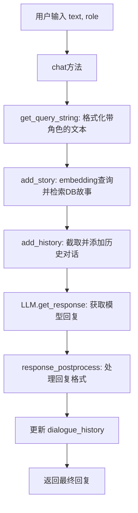

## 类结构

```
ChatHaruhi_safe
```

## 全局变量及字段


### `ChromaDB`
    
ChromaDB向量数据库类，用于存储和检索文本嵌入向量

类型：`class`
    


### `os`
    
Python标准库os模块，提供操作系统交互功能

类型：`module`
    


### `luotuo_openai_embedding`
    
洛驼OpenAI嵌入函数，用于将文本转换为向量表示

类型：`function`
    


### `tiktokenizer`
    
TikToken分词器函数，用于计算文本的token长度

类型：`function`
    


### `response_postprocess`
    
响应后处理函数，用于清理和格式化模型输出

类型：`function`
    


### `text_censor`
    
文本审核函数，用于检查文本内容是否合规

类型：`function`
    


### `ChatHaruhi_safe.verbose`
    
是否显示详细日志

类型：`bool`
    


### `ChatHaruhi_safe.story_prefix_prompt`
    
故事检索的前缀提示词

类型：`str`
    


### `ChatHaruhi_safe.k_search`
    
向量搜索返回的结果数量

类型：`int`
    


### `ChatHaruhi_safe.narrator`
    
旁白角色的标识符列表

类型：`list`
    


### `ChatHaruhi_safe.dialogue_divide_token`
    
故事上下文分段分隔符

类型：`str`
    


### `ChatHaruhi_safe.dialogue_bra_token`
    
对话内容的左括号符号

类型：`str`
    


### `ChatHaruhi_safe.dialogue_ket_token`
    
对话内容的右括号符号

类型：`str`
    


### `ChatHaruhi_safe.system_prompt`
    
系统设定或角色定义

类型：`str`
    


### `ChatHaruhi_safe.llm`
    
大语言模型实例

类型：`object`
    


### `ChatHaruhi_safe.tokenizer`
    
用于计算token长度的分词器

类型：`object`
    


### `ChatHaruhi_safe.embedding`
    
文本向量化嵌入函数

类型：`function`
    


### `ChatHaruhi_safe.db`
    
ChromaDB向量数据库实例

类型：`object`
    


### `ChatHaruhi_safe.max_len_story`
    
故事背景的最大token长度限制

类型：`int`
    


### `ChatHaruhi_safe.max_len_history`
    
对话历史的最大token长度限制

类型：`int`
    


### `ChatHaruhi_safe.dialogue_history`
    
存储(用户问题, 模型回复)元组的列表

类型：`list`
    
    

## 全局函数及方法


### `get_folder_role_name`

该函数位于 `role_name_to_file` 模块中，用于将用户输入的角色名称转换为标准化的文件夹名称，并返回对应的下载链接。从 `ChatHaruhi_safe` 类的 `__init__` 方法中可以看到其调用方式。

参数：

-  `role_name`：`str`，用户输入的角色名称

返回值：元组 `(str, str)`

- 第一个元素：标准化后的文件夹角色名称
- 第二个元素：角色资源文件的下载 URL

#### 流程图

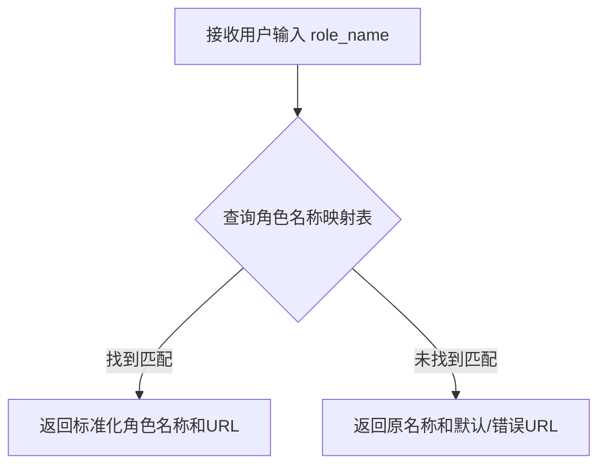

#### 带注释源码

```python
# 该函数定义在 role_name_to_file 模块中
# 从 ChatHaruhi_safe.__init__ 中的调用方式推断其实现逻辑：

def get_folder_role_name(role_name):
    """
    将用户输入的角色名称转换为标准化的文件夹名称
    并返回对应的资源下载链接
    
    参数:
        role_name: 用户输入的角色名称，如 'haruhi'、'kirito' 等
        
    返回:
        tuple: (标准化的文件夹名称, 资源下载URL)
    """
    # 实际实现需要查询角色名称到文件名的映射表
    # 并返回对应的 GitHub 或其他源的文件链接
    
    # 示例逻辑（基于代码调用推断）:
    # folder_name = role_name_mapping.get(role_name, role_name)
    # url = f"https://github.com/.../{folder_name}.zip"
    # return folder_name, url
```

> **注意**：该函数的实际源码定义未包含在提供的代码中，上述源码是基于其在 `ChatHaruhi_safe.__init__` 方法中的调用方式推断得出的。该函数属于 `role_name_to_file` 模块，是项目中的独立模块。


### `load_dataset`

这是 Hugging Face `datasets` 库中的函数调用，用于从 Hugging Face Hub 加载数据集。在本代码中，根据 `role_from_hf` 参数的不同格式（单斜杠或双斜杠），以两种方式调用此函数加载角色数据。

参数：

-  `role_from_hf`：`str`，Hugging Face Hub 上的数据集路径，格式为 `dataset_name` 或 `dataset_name/split_name`
-  `dataset_name`（第二种情况）：`str`，数据集名称
-  `fname`（第二种情况）：`str`，数据文件名，格式为 `{split_name}.jsonl`

返回值：`Dataset` 或 `DatasetDict`，返回 Hugging Face datasets 库的数据集对象

#### 流程图

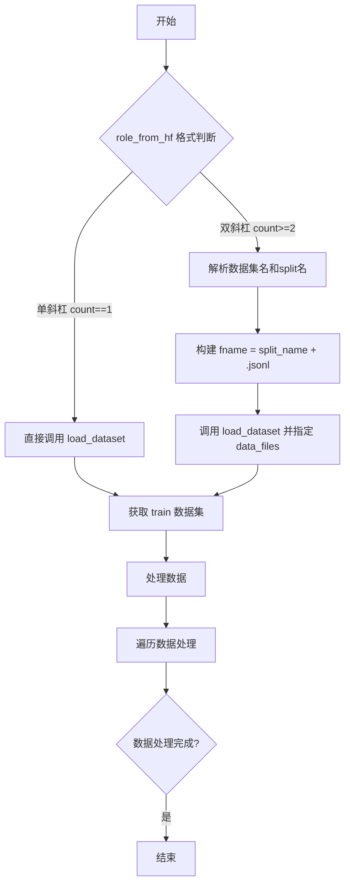

#### 带注释源码

```python
# 从 Hugging Face datasets 库导入 load_dataset 函数
from datasets import load_dataset

# 情况1：role_from_hf 格式为 "namespace/dataset_name"（单斜杠）
if role_from_hf.count("/") == 1:
    # 直接加载整个数据集
    dataset = load_dataset(role_from_hf)
    # 获取训练集
    datas = dataset["train"]

# 情况2：role_from_hf 格式为 "namespace/dataset_name/split_name"（多斜杠）
elif role_from_hf.count("/") >= 2:
    # 找到第一个和第二个斜杠的位置
    split_index = role_from_hf.index('/') 
    second_split_index = role_from_hf.index('/', split_index+1)
    
    # 提取数据集名称：namespace/dataset_name
    dataset_name = role_from_hf[:second_split_index] 
    # 提取 split 名称
    split_name = role_from_hf[second_split_index+1:]
    
    # 构建文件名
    fname = split_name + '.jsonl'
    
    # 使用 data_files 参数加载指定的 JSONL 文件
    dataset = load_dataset(dataset_name, data_files={'train':fname})
    datas = dataset["train"]
```

**注意**：在代码中 `load_dataset` 是对外部库函数 `datasets.load_dataset` 的调用，并非该项目中定义的方法。此函数的具体参数和返回值请参考 [Hugging Face datasets 库文档](https://huggingface.co/docs/datasets/package_reference/loading_methods)。


### `base64_to_float_array`

该函数将 Base64 编码的字符串转换为浮点数数组，主要用于从 HuggingFace 数据集加载预计算的嵌入向量（embedding）。

**注意**：该函数在当前代码文件中仅作为导入语句出现（`from .utils import base64_to_float_array`），并被用于 `ChatHaruhi_safe` 类的初始化过程中，将数据集中的 base64 编码嵌入转换为浮点数数组形式。以下信息基于代码中的使用方式推断。

参数：

-  `base64_string`：`str`，Base64 编码的字符串，通常来自 HuggingFace 数据集中的嵌入字段

返回值：`List[float]` 或 `numpy.ndarray`，转换后的浮点数数组，用于 ChromaDB 向量数据库的相似性搜索

#### 流程图

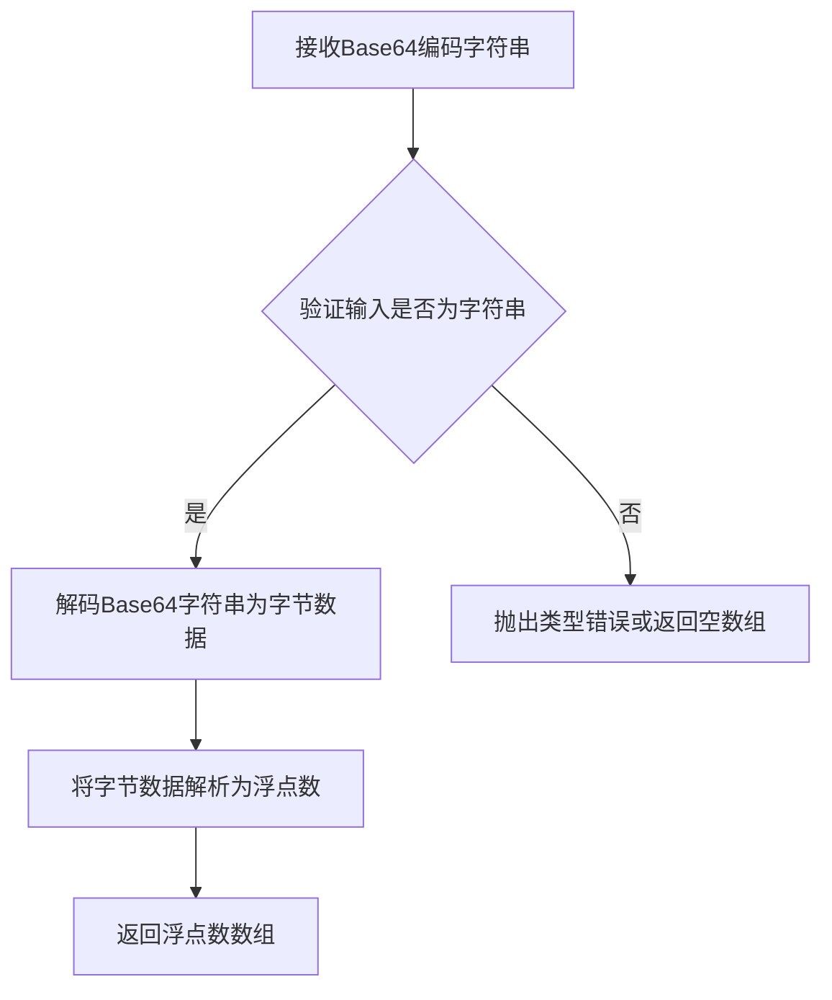

#### 带注释源码

```
# 该函数定义位于 utils 模块中，当前代码文件仅导入并使用
# 以下为基于使用方式的推断实现

def base64_to_float_array(base64_string):
    """
    将Base64编码的字符串转换为浮点数数组
    
    参数:
        base64_string: str - Base64编码的字符串，通常为嵌入向量的序列化形式
    
    返回值:
        numpy.ndarray - 浮点数数组形式的嵌入向量
    """
    import base64
    import numpy as np
    
    # 解码Base64字符串为字节
    byte_data = base64.b64decode(base64_string)
    
    # 将字节数据转换为numpy数组
    # 假设数据为float32格式的小端序
    vec = np.frombuffer(byte_data, dtype=np.float32)
    
    return vec
```

**使用示例**（来自代码中的实际调用）：

```python
# 在 ChatHaruhi_safe.__init__ 方法中加载 HuggingFace 数据集时的使用
from .utils import base64_to_float_array

# 遍历数据集中的每条记录
for data in datas:
    # 将Base64编码的嵌入向量转换为浮点数数组
    vec = base64_to_float_array(data[embed_name])
    text = data['text']
    vecs.append(vec)
    texts.append(text)

# 使用转换后的向量构建故事数据库
self.build_story_db_from_vec(texts, vecs)
```


### `get_bge_embedding`

该函数是用于生成文本嵌入向量的工具函数，通过 BGE (BAAI General Embedding) 模型将文本转换为高维向量表示，以便在 ChromaDB 中进行相似度搜索和语义检索。

参数：

-  `text`：`str`，需要转换为嵌入向量的文本输入

返回值：`list` 或 `numpy.array`，返回文本的嵌入向量表示，用于后续的向量检索任务

#### 流程图

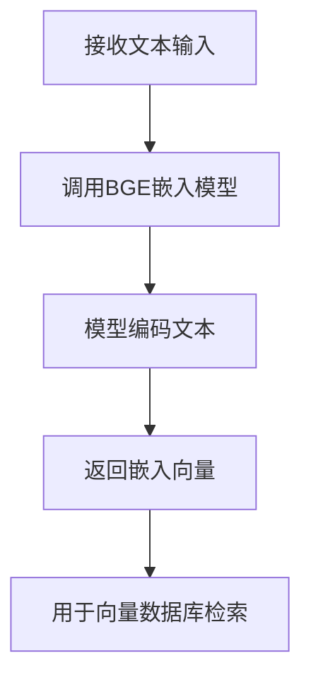

#### 带注释源码

由于 `get_bge_embedding` 函数的具体实现位于 `.utils` 模块中，当前代码片段仅展示了其使用方式。以下是从上下文中推断的函数签名和使用模式：

```python
# 在 ChatHaruhi_safe 类中的使用方式
# 位置: __init__ 方法中的 embedding 初始化部分

elif embedding == 'bge_en':
    # 从 utils 模块导入 get_bge_embedding 函数
    from .utils import get_bge_embedding
    # 将其赋值给实例的 embedding 方法
    self.embedding = get_bge_embedding

# 位置: add_story 方法中的向量生成部分

def add_story(self, query):
    # ... 省略其他代码 ...
    
    # 调用 embedding 函数生成查询向量
    query_vec = self.embedding(query)  # text -> vector
    
    # 使用生成的向量进行数据库搜索
    stories = self.db.search(query_vec, self.k_search)
```

---

### 补充说明

**使用场景**：
- 该函数在 `ChatHaruhi_safe` 类中作为文本向量化的核心组件
- 主要用于将用户查询和故事文本转换为向量形式，以便进行语义检索

**推断的实现特征**：
- 内部应调用了 BGE 模型的编码器（如 `bge-base-en` 或类似模型）
- 返回值应为固定维度的浮点数列表或 NumPy 数组
- 可能使用了 transformers 库的 `AutoModel` 和 `AutoTokenizer`

**注意**：完整的函数实现源码未在当前提供的代码片段中，如需查看详细实现，请查阅 `.utils` 模块中的 `get_bge_embedding` 函数定义。


### `ChatHaruhi_safe.__init__`

该方法是`ChatHaruhi_safe`类的构造函数，负责初始化聊天机器人的所有核心配置，包括语言模型、嵌入模型、角色配置、故事数据库以及各种对话参数，是整个系统的入口初始化逻辑。

参数：

- `system_prompt`：`str`，可选，系统提示词，可以是字符串或.txt文件路径
- `role_name`：`str`，可选，角色名称，用于从预定义角色库加载角色配置
- `role_from_hf`：`str`，可选，从HuggingFace数据集加载角色的数据集路径
- `story_db`：`str`，可选，故事数据库的路径（ChromaDB格式）
- `story_text_folder`：`str`，可选，故事文本文件夹路径，用于从中构建向量数据库
- `llm`：`str`，默认为'openai'，指定使用的语言模型类型（openai/debug/spark/GLMPro/ChatGLM2GPT/BaiChuan2GPT/BaiChuanAPIGPT/ernie3.5/ernie4.0）
- `embedding`：`str`，默认为'luotuo_openai'，指定使用的嵌入模型类型
- `max_len_story`：`int`，可选，故事上下文的最大token长度限制
- `max_len_history`：`int`，可选，对话历史的最大token长度限制
- `verbose`：`bool`，默认为False，是否输出详细的调试信息

返回值：`None`，该方法为构造函数，不返回任何值，仅通过`self`属性存储初始化状态

#### 流程图

```mermaid
flowchart TD
    A[开始 __init__] --> B[调用父类初始化<br/>super().__init__()]
    B --> C[设置verbose标志]
    C --> D[初始化常量<br/>story_prefix_prompt<br/>k_search<br/>narrator<br/>dialogue相关token]
    D --> E{检查system_prompt<br/>是否存在?}
    E -->|是| F[调用check_system_prompt<br/>验证并加载]
    E -->|否| G[跳过]
    F --> H{根据llm参数<br/>选择模型}
    H -->|openai| I[初始化LangChainGPT<br/>tiktokenizer]
    H -->|debug| J[初始化PrintLLM]
    H -->|spark| K[初始化SparkGPT]
    H -->|GLMPro| L[初始化GLMPro]
    H -->|ChatGLM2GPT| M[初始化ChatGLM2GPT<br/>GLM_tokenizer]
    H -->|BaiChuan2GPT| N[初始化BaiChuan2GPT<br/>BaiChuan_tokenizer]
    H -->|ernie3.5/ernie4.0| O[初始化ErnieGPT]
    H -->|其他| P[警告并默认使用openai]
    I --> Q{根据embedding参数<br/>选择嵌入模型}
    J --> Q
    K --> Q
    L --> Q
    M --> Q
    N --> Q
    O --> Q
    P --> Q
    Q -->|luotuo_openai| R[设置luotuo_openai_embedding]
    Q -->|bge_en| S[加载get_bge_embedding]
    Q -->|其他| T[警告并默认使用luotuo_openai]
    R --> U{检查角色加载方式}
    S --> U
    T --> U
    U -->|role_name| V[从URL下载角色压缩包<br/>加载角色到ChromaDB]
    U -->|role_from_hf| W[从HuggingFace加载数据集<br/>构建向量数据库]
    U -->|story_db| X[直接加载ChromaDB]
    U -->|story_text_folder| Y[从文本文件夹<br/>构建向量数据库]
    U -->|均无| Z[警告数据库未配置<br/>db设为None]
    V --> AA[获取默认token长度设置]
    W --> AA
    X --> AA
    Y --> AA
    Z --> AA
    AA --> BB{用户是否自定义<br/>max_len_history?}
    BB -->|是| CC[使用用户值覆盖]
    BB -->|否| DD[保持默认值]
    CC --> EE{用户是否自定义<br/>max_len_story?}
    DD --> EE
    EE -->|是| FF[使用用户值覆盖]
    EE -->|否| GG[保持默认值]
    FF --> HH[初始化dialogue_history<br/>为空列表]
    GG --> HH
    HH --> II[结束 __init__]
```

#### 带注释源码

```python
def __init__(self, system_prompt = None, \
             role_name = None, role_from_hf = None, \
             story_db=None, story_text_folder = None, \
             llm = 'openai', \
             embedding = 'luotuo_openai', \
             max_len_story = None, max_len_history = None,
             verbose = False):
    # 调用父类构造函数完成基础初始化
    super(ChatHaruhi_safe, self).__init__()
    # 设置 verbose 标志，控制调试信息输出
    self.verbose = verbose

    # ==================== 初始化常量 ====================
    # 故事前缀提示词，用于检索到的故事文本前添加说明
    self.story_prefix_prompt = "Classic scenes for the role are as follows:\n"
    # 向量检索时返回的最相似结果数量
    self.k_search = 19
    # 旁白角色名称列表，用于判断当前输入是否为旁白
    self.narrator = ['旁白', '', 'scene','Scene','narrator' , 'Narrator']
    # 对话分隔标记，用于分割多条故事/对话
    self.dialogue_divide_token = '\n###\n'
    # 对话开始和结束标记，用于包裹角色对话内容
    self.dialogue_bra_token = '「'
    self.dialogue_ket_token = '」'

    # ==================== 处理系统提示词 ====================
    # 如果提供了系统提示词，进行验证和处理
    if system_prompt:
        self.system_prompt = self.check_system_prompt( system_prompt )

    # ==================== 初始化语言模型 ====================
    # TODO: embedding 应该单独定义，后续需要重构这部分代码
    # 根据 llm 参数选择并初始化对应的语言模型和分词器
    if llm == 'openai':
        self.llm, self.tokenizer = self.get_models('openai')
    elif llm == 'debug':
        self.llm, self.tokenizer = self.get_models('debug')
    elif llm == 'spark':
        self.llm, self.tokenizer = self.get_models('spark')
    elif llm == 'GLMPro':
        self.llm, self.tokenizer = self.get_models('GLMPro')
    elif llm == 'ChatGLM2GPT':
        self.llm, self.tokenizer = self.get_models('ChatGLM2GPT')
        # ChatGLM2GPT 需要使用不同的故事前缀
        self.story_prefix_prompt = '\n'
    elif llm == "BaiChuan2GPT":
        self.llm, self.tokenizer = self.get_models('BaiChuan2GPT')
    elif llm == "BaiChuanAPIGPT":
        self.llm, self.tokenizer = self.get_models('BaiChuanAPIGPT')
    elif llm == "ernie3.5":
        self.llm, self.tokenizer = self.get_models('ernie3.5')
    elif llm == "ernie4.0":
        self.llm, self.tokenizer = self.get_models('ernie4.0')
    else:
        # 未定义的模型类型，打印警告并默认使用 openai
        print(f'warning! undefined llm {llm}, use openai instead.')
        self.llm, self.tokenizer = self.get_models('openai')

    # ==================== 初始化嵌入模型 ====================
    # 根据 embedding 参数选择对应的嵌入函数
    if embedding == 'luotuo_openai':
        self.embedding = luotuo_openai_embedding
    elif embedding == 'bge_en':
        # 动态导入 bge 嵌入模型
        from .utils import get_bge_embedding
        self.embedding = get_bge_embedding
    else:
        # 未定义的嵌入类型，打印警告并默认使用 luotuo_openai
        print(f'warning! undefined embedding {embedding}, use luotuo_openai instead.')
        self.embedding = luotuo_openai_embedding
    
    # ==================== 加载角色或故事数据库 ====================
    # 方式一：通过 role_name 从预定义角色库加载
    if role_name:
        # 导入角色名称到文件路径的转换函数
        from .role_name_to_file import get_folder_role_name
        # 修正 role_name 为文件夹角色名称
        role_name, url = get_folder_role_name(role_name)

        # 定义临时解压文件夹和数据库文件夹路径
        unzip_folder = f'./temp_character_folder/temp_{role_name}'
        db_folder = os.path.join(unzip_folder, f'content/{role_name}')
        system_prompt = os.path.join(unzip_folder, f'content/system_prompt.txt')

        # 如果角色文件夹不存在，则从URL下载并解压
        if not os.path.exists(unzip_folder):
            # 使用 requests 下载角色压缩包并解压
            import requests, zipfile, io
            r = requests.get(url)
            z = zipfile.ZipFile(io.BytesIO(r.content))
            z.extractall(unzip_folder)

        # 打印加载信息（如果 verbose 为 True）
        if self.verbose:
            print(f'loading pre-defined character {role_name}...')
        
        # 初始化 ChromaDB 并加载角色数据
        self.db = ChromaDB()
        self.db.load(db_folder)
        # 验证并加载系统提示词
        self.system_prompt = self.check_system_prompt(system_prompt)
    
    # 方式二：从 HuggingFace 数据集加载角色
    elif role_from_hf:
        from datasets import load_dataset

        # 处理数据集路径，支持单斜杠和双斜杠的格式
        if role_from_hf.count("/") == 1:
            dataset = load_dataset(role_from_hf)
            datas = dataset["train"]
        elif role_from_hf.count("/") >= 2:
            split_index = role_from_hf.index('/') 
            second_split_index = role_from_hf.index('/', split_index+1)
            dataset_name = role_from_hf[:second_split_index] 
            split_name = role_from_hf[second_split_index+1:]
            
            fname = split_name + '.jsonl'
            dataset = load_dataset(dataset_name,data_files={'train':fname})
            datas = dataset["train"]

        # 导入 base64 到浮点数组的转换函数
        from .utils import base64_to_float_array
        
        # 根据嵌入类型选择对应的字段名
        if embedding == 'luotuo_openai':
            embed_name = 'luotuo_openai'
        elif embedding == 'bge_en':
            embed_name = 'bge_en_s15'
        else:
            print('warning! unkown embedding name ', embedding ,' while loading role')
            embed_name = 'luotuo_openai'

        # 遍历数据集，分别提取文本和向量
        texts = []
        vecs = []
        for data in datas:
            if data[embed_name] == 'system_prompt':
                # 系统提示词单独存储
                self.system_prompt = data['text']
            elif data[embed_name] == 'config':
                # 配置信息忽略
                pass
            else:
                # 普通故事文本和对应的向量
                vec = base64_to_float_array( data[embed_name] )
                text = data['text']
                vecs.append( vec )
                texts.append( text )

        # 根据向量和文本构建故事数据库
        self.build_story_db_from_vec( texts, vecs )
    
    # 方式三：从已有的 story_db 路径加载
    elif story_db:
        self.db = ChromaDB() 
        self.db.load(story_db)
    
    # 方式四：从故事文本文件夹构建数据库
    elif story_text_folder:
        # 调用 build_story_db 从文本文件夹构建向量数据库
        self.db = self.build_story_db(story_text_folder) 
    
    # 未提供任何数据库配置
    else:
        self.db = None
        print('warning! database not yet figured out, both story_db and story_text_folder are not inputted.')
    
    # ==================== 设置 Token 长度限制 ====================
    # 获取默认的 token 长度设置
    self.max_len_story, self.max_len_history = self.get_tokenlen_setting('openai')

    # 如果用户提供了自定义的 max_len_history，则覆盖默认值
    if max_len_history is not None:
        self.max_len_history = max_len_history

    # 如果用户提供了自定义的 max_len_story，则覆盖默认值
    if max_len_story is not None:
        self.max_len_story = max_len_story

    # ==================== 初始化对话历史 ====================
    # 用于存储对话历史，格式为 [(user_query, ai_response), ...]
    self.dialogue_history = []
```


### `ChatHaruhi_safe.check_system_prompt`

该方法用于检查并处理系统提示（system_prompt），如果传入的是以 `.txt` 结尾的文件路径，则读取并返回文件内容；否则直接返回传入的字符串内容。

参数：

- `system_prompt`：`str`，系统提示内容，可以是直接的文本字符串，也可以是 `.txt` 文本文件的路径

返回值：`str`，返回处理后的系统提示文本内容

#### 流程图

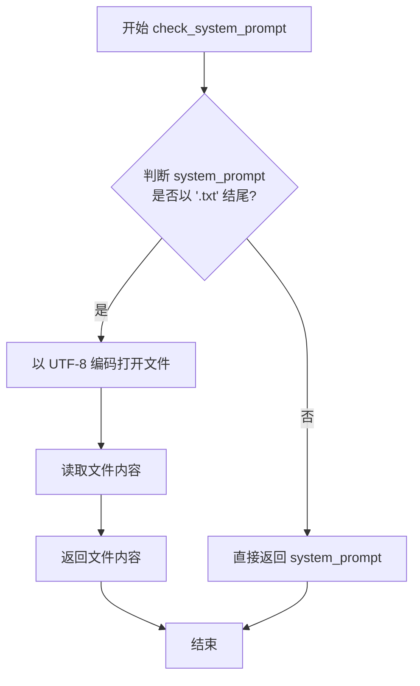

#### 带注释源码

```python
def check_system_prompt(self, system_prompt):
    # 如果 system_prompt 以 .txt 结尾，则认为是文件路径，需要读取文件内容
    # 否则，直接返回字符串本身（已经是完整的系统提示）
    if system_prompt.endswith('.txt'):
        # 以 UTF-8 编码读取文本文件
        with open(system_prompt, 'r', encoding='utf-8') as f:
            # 读取并返回文件全部内容
            return f.read()
    else:
        # 直接返回传入的字符串（已经是系统提示内容）
        return system_prompt
```


### `ChatHaruhi_safe.get_models`

该方法是一个工厂方法，根据传入的模型名称动态加载相应的语言模型(LLM)和分词器，并返回一个包含两者的元组。

参数：

- `model_name`：`str`，要加载的模型名称，支持'openai'、'debug'、'spark'、'GLMPro'、'ernie3.5'、'ernie4.0'、'ChatGLM2GPT'、'BaiChuan2GPT'、'BaiChuanAPIGPT'等

返回值：`tuple`，返回(LLM实例, 分词器)的元组

#### 流程图

```mermaid
flowchart TD
    A[开始 get_models] --> B{判断 model_name}
    B -->|openai| C[导入 LangChainGPT]
    B -->|debug| D[导入 PrintLLM]
    B -->|spark| E[导入 SparkGPT]
    B -->|GLMPro| F[导入 GLMPro]
    B -->|ernie3.5| G[导入 ErnieGPT]
    B -->|ernie4.0| H[导入 ErnieGPT 并设置 model='ernie-bot-4']
    B -->|ChatGLM2GPT| I[导入 ChatGLM2GPT 和 GLM_tokenizer]
    B -->|BaiChuan2GPT| J[导入 BaiChuan2GPT 和 BaiChuan_tokenizer]
    B -->|BaiChuanAPIGPT| K[导入 BaiChuanAPIGPT]
    B -->|其他| L[打印警告,默认使用 openai]
    L --> C
    C --> M[实例化 LLM]
    D --> M
    E --> M
    F --> M
    G --> M
    H --> M
    I --> M
    J --> M
    K --> M
    M --> N[返回 (LLM实例, tiktokenizer 或对应tokenizer)]
```

#### 带注释源码

```python
def get_models(self, model_name):
    """
    工厂方法，根据model_name加载对应的LLM模型和分词器
    
    参数:
        model_name (str): 模型名称，支持openai/debug/spark/GLMPro/ernie3.5/ernie4.0/ChatGLM2GPT/BaiChuan2GPT/BaiChuanAPIGPT
    
    返回:
        tuple: (LLM实例, 分词器实例)
    """
    
    # TODO: 如果只需要tokenizer，不需要初始化LLM，后续需要重构
    
    # 根据model_name动态导入并实例化对应的LLM和tokenizer
    if model_name == 'openai':
        from .LangChainGPT import LangChainGPT
        # 使用LangChainGPT作为OpenAI的LLM实现，tokenizer使用tiktokenizer
        return (LangChainGPT(), tiktokenizer)
    elif model_name == 'debug':
        from .PrintLLM import PrintLLM
        # debug模式使用PrintLLM，仅打印输出不实际调用API
        return (PrintLLM(), tiktokenizer)
    elif model_name == 'spark':
        from .SparkGPT import SparkGPT
        # 讯飞星火大模型
        return (SparkGPT(), tiktokenizer)
    elif model_name == 'GLMPro':
        from .GLMPro import GLMPro
        # 智谱GLM Pro模型
        return (GLMPro(), tiktokenizer)
    elif model_name == 'ernie3.5':
        from .ErnieGPT import ErnieGPT
        # 百度文心一言3.5版本
        return (ErnieGPT(), tiktokenizer)
    elif model_name == 'ernie4.0':
        from .ErnieGPT import ErnieGPT
        # 百度文心一言4.0版本，传入model参数指定版本
        return (ErnieGPT(model="ernie-bot-4"), tiktokenizer)
    elif model_name == "ChatGLM2GPT":
        from .ChatGLM2GPT import ChatGLM2GPT, GLM_tokenizer
        # ChatGLM2使用专门的GLM_tokenizer
        return (ChatGLM2GPT(), GLM_tokenizer)
    elif model_name == "BaiChuan2GPT":
        from .BaiChuan2GPT import BaiChuan2GPT, BaiChuan_tokenizer
        # 百川2模型使用专门的BaiChuan_tokenizer
        return (BaiChuan2GPT(), BaiChuan_tokenizer)
    elif model_name == "BaiChuanAPIGPT":
        from .BaiChuanAPIGPT import BaiChuanAPIGPT
        # 百川API版本使用tiktokenizer
        return (BaiChuanAPIGPT(), tiktokenizer)
    else:
        # 未定义的模型类型，打印警告并默认使用openai
        print(f'warning! undefined model {model_name}, use openai instead.')
        from .LangChainGPT import LangChainGPT
        return (LangChainGPT(), tiktokenizer)
```


### `ChatHaruhi_safe.get_tokenlen_setting`

获取指定模型的 token 长度限制设置，返回故事（story）和历史（history）的最大 token 数。

参数：

- `model_name`：`str`，指定要获取 token 长度设置的模型名称（如 'openai'）

返回值：`Tuple[int, int]`，返回包含两个整数的元组，第一个为故事最大 token 数，第二个为历史记录最大 token 数。默认返回 (1500, 1200)。

#### 流程图

```mermaid
flowchart TD
    A[开始 get_tokenlen_setting] --> B{model_name == 'openai'?}
    B -->|是| C[返回 Tuple: (1500, 1200)]
    B -->|否| D[打印警告信息: undefined model]
    D --> C
    C --> E[结束]
```

#### 带注释源码

```python
def get_tokenlen_setting(self, model_name):
    """
    获取模型的 token 长度限制设置
    
    参数:
        model_name: str, 模型名称，用于确定 token 长度限制
                   当前仅支持 'openai'，其他模型会使用默认值
    
    返回:
        tuple: (max_len_story, max_len_history)
              - max_len_story: 故事部分的最大 token 数
              - max_len_history: 对话历史的最大 token 数
    """
    # 检查模型名称，如果是 'openai' 则返回标准的 token 长度限制
    if model_name == 'openai':
        # 返回故事长度1500，历史长度1200的设置
        return (1500, 1200)
    else:
        # 对于未定义的模型，打印警告并仍返回默认的 token 长度限制
        print(f'warning! undefined model {model_name}, use openai instead.')
        return (1500, 1200)
```


### `ChatHaruhi_safe.build_story_db_from_vec`

该方法用于根据预计算的文本向量直接构建故事数据库，通过接收文本列表和对应的向量列表，初始化ChromaDB向量数据库实例。

参数：

- `self`：隐式参数，类型为`ChatHaruhi_safe`实例，表示类的当前实例
- `texts`：`List[str]`，文本列表，包含需要存储的文本内容
- `vecs`：`List[Any]`，向量列表，与文本列表对应的嵌入向量（通常为浮点数列表）

返回值：`None`，无直接返回值，结果存储在实例的`self.db`属性中

#### 流程图

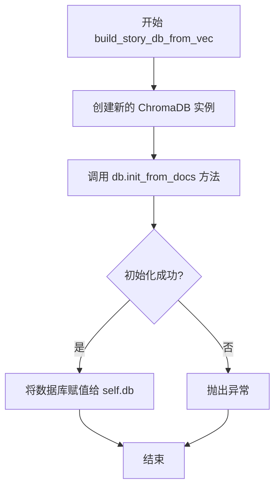

#### 带注释源码

```python
def build_story_db_from_vec(self, texts, vecs):
    """
    根据预计算的向量构建故事数据库
    
    参数:
        texts: 文本列表
        vecs: 与文本对应的向量列表
    
    返回:
        无返回值，结果存储在 self.db 属性中
    """
    
    # 创建一个新的 ChromaDB 实例
    # ChromaDB 是一个向量数据库，用于存储和检索文本向量
    self.db = ChromaDB()

    # 使用提供的向量和文本初始化数据库
    # vecs: 嵌入向量列表
    # texts: 原始文本列表
    # 该方法会将向量和文本关联起来存储在数据库中
    self.db.init_from_docs(vecs, texts)
```

#### 关键说明

该方法是`ChatHaruhi_safe`类中用于快速初始化向量数据库的便捷方法。相比于从文本文件夹构建数据库，该方法直接接收已经计算好的向量，避免了重复的嵌入计算过程。通常在从HuggingFace数据集加载角色数据时使用，因为数据集中已经包含了预计算的嵌入向量。


### `ChatHaruhi_safe.build_story_db`

该方法用于从文本文件夹中读取所有txt文件，使用类中配置的embedding模型将文本转换为向量，并初始化ChromaDB向量数据库。

参数：

- `text_folder`：`str`，需要读取的包含故事文本的文件夹路径

返回值：`ChromaDB`，返回初始化后的ChromaDB向量数据库实例

#### 流程图

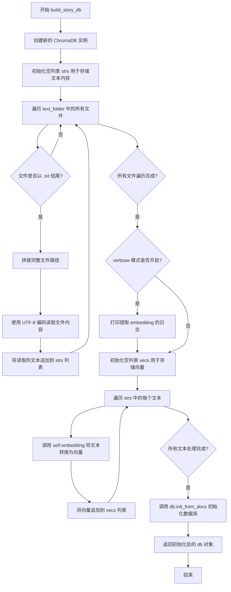

#### 带注释源码

```python
def build_story_db(self, text_folder):
    """
    从文本文件夹构建故事向量数据库
    
    实现逻辑：
    1. 读取text_folder下所有txt文件
    2. 使用embedding模型将文本转换为向量
    3. 初始化ChromaDB并返回
    """
    # 创建新的ChromaDB数据库实例
    db = ChromaDB()

    # 用于存储所有读取的文本内容
    strs = []

    # 遍历text_folder中的所有文件
    for file in os.listdir(text_folder):
        # 检查文件扩展名是否为txt
        if file.endswith(".txt"):
            # 拼接完整的文件路径
            file_path = os.path.join(text_folder, file)
            # 以UTF-8编码读取文件内容
            with open(file_path, 'r', encoding='utf-8') as f:
                # 将读取的内容追加到列表
                strs.append(f.read())

    # 如果verbose模式开启，打印日志信息
    if self.verbose:
        print(f'starting extract embedding... for { len(strs) } files')

    # 用于存储所有文本对应的向量
    vecs = []

    # 遍历每个文本，使用embedding模型转换为向量
    # TODO: 建立一个新的embedding batch test的单元测试
    # 新的支持list batch test的embedding代码
    # 用新的代码替换下面的for循环
    # Luotuo-bert-en也发布了，所以可以避开使用openai
    for mystr in strs:
        # 调用self.embedding将文本转换为向量
        vecs.append(self.embedding(mystr))

    # 使用向量和文本初始化ChromaDB数据库
    db.init_from_docs(vecs, strs)

    # 返回初始化后的数据库实例
    return db
```


### `ChatHaruhi_safe.save_story_db`

该方法用于将当前实例的故事数据库（ChromaDB）持久化保存到指定的磁盘路径。当用户完成角色对话系统的初始化和交互后，可以通过调用此方法将内存中的向量数据库保存为持久化文件，以便后续快速加载复用，而无需重新构建数据库。

参数：

- `db_path`：`str`，指定保存数据库的目标文件夹路径

返回值：`None`，该方法直接修改数据库的持久化状态，无返回值

#### 流程图

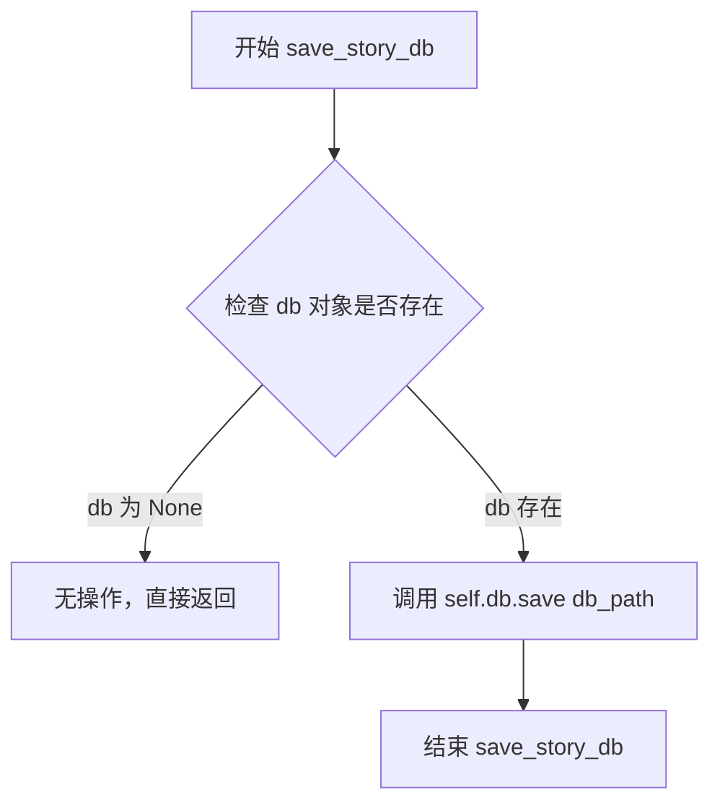

#### 带注释源码

```python
def save_story_db(self, db_path):
    """
    将故事数据库保存到指定路径
    
    参数:
        db_path (str): 数据库保存的目标路径
    返回:
        None
    """
    # 调用 ChromaDB 实例的 save 方法，将向量数据库持久化到磁盘
    # db_path 应为目录路径，ChromaDB 会在该目录下创建必要的存储文件
    self.db.save(db_path)
```


### `ChatHaruhi_safe.chat`

该方法是ChatHaruhi_safe类的核心聊天功能，接收用户文本和角色名称，通过检索增强生成（RAG）方式结合角色故事数据库和对话历史，调用大语言模型生成符合角色设定的回复，并自动维护对话历史记录。

参数：

- `text`：`str`，用户输入的文本内容
- `role`：`str`，扮演的角色名称，用于决定对话格式和上下文

返回值：`str`，模型生成的角色回复文本

#### 流程图

```mermaid
flowchart TD
    A[开始 chat 方法] --> B[初始化消息系统<br/>llm.initialize_message]
    B --> C[添加系统提示词<br/>llm.system_message]
    C --> D[获取查询字符串<br/>get_query_string]
    D --> E{role是否在narrator列表中}
    E -->|是| F[格式: role:text]
    E -->|否| G[格式: role:「text」]
    F --> H[添加故事上下文<br/>add_story]
    G --> H
    H --> I{db是否为空}
    I -->|是| J[跳过故事添加]
    I -->|否| K[计算查询向量<br/>embedding(query)]
    K --> L[向量搜索<br/>db.search]
    L --> M[构建故事字符串<br/>累加直到max_len_story]
    M --> N{文本审核通过?}
    N -->|是| O[添加故事消息<br/>llm.user_message]
    N -->|否| P[跳过故事添加]
    J --> Q[添加历史记录<br/>add_history]
    O --> Q
    P --> Q
    Q --> R{对话历史为空?}
    R -->|是| S[跳过历史添加]
    R -->|否| T[从最新历史倒序添加<br/>累加直到max_len_history]
    T --> U[添加用户消息<br/>llm.user_message]
    S --> U
    U --> V[获取模型响应<br/>llm.get_response]
    V --> W[后处理响应<br/>response_postprocess]
    W --> X[记录对话历史<br/>dialogue_history.append]
    X --> Y[返回响应]
```

#### 带注释源码

```python
def chat(self, text, role):
    # 1. 初始化消息系统，添加系统提示词
    #    系统提示词包含角色的基本设定和引导
    self.llm.initialize_message()
    self.llm.system_message(self.system_prompt)

    # 2. 根据用户输入和角色获取查询字符串
    #    旁白角色使用特殊格式，角色对话使用「」括号格式
    query = self.get_query_string(text, role)
    
    # 3. 通过向量检索添加相关的角色故事上下文
    #    从ChromaDB中搜索与当前查询最相关的故事片段
    self.add_story(query)

    # 4. 添加对话历史上下文
    #    包含之前的对话记录，保持多轮对话连贯性
    self.add_history()

    # 5. 添加当前用户查询消息
    self.llm.user_message(query)
    
    # 6. 调用大语言模型获取原始响应
    response_raw = self.llm.get_response()

    # 7. 后处理响应内容
    #    提取对话内容，去除多余标记符号
    response = response_postprocess(
        response_raw, 
        self.dialogue_bra_token,  # 对话开始符号「
        self.dialogue_ket_token   # 对话结束符号」
    )

    # 8. 记录当前对话到历史记录
    #    格式: (用户查询, 模型回复)
    self.dialogue_history.append((query, response))

    # 9. 返回处理后的回复
    return response
```

#### 相关依赖方法

| 方法名称 | 描述 |
|---------|------|
| `get_query_string` | 根据角色类型格式化用户输入文本，旁白角色和普通角色使用不同格式 |
| `add_story` | 通过向量嵌入检索角色故事数据库，将相关情节添加到上下文 |
| `add_history` | 从对话历史中倒序添加历史记录，受max_len_history限制 |
| `response_postprocess` | 工具函数，从原始响应中提取有效对话内容 |
| `llm.initialize_message` | 初始化LLM消息会话 |
| `llm.system_message` | 设置系统提示词 |
| `llm.user_message` | 添加用户消息 |
| `llm.get_response` | 获取LLM生成的响应 |

#### 技术特点

1. **RAG检索增强**：通过ChromaDB向量数据库检索相关故事片段
2. **动态上下文管理**：根据token限制动态调整故事和历史的长度
3. **角色格式化**：区分旁白和角色对话的不同格式
4. **文本审核**：故事内容添加前进行文本审核过滤
5. **多轮对话维护**：自动保存和加载对话历史

#### 潜在优化空间

1. **异步处理**：LLM调用和向量检索可考虑异步执行提升性能
2. **缓存机制**：热门查询的向量结果可缓存减少重复计算
3. **流式响应**：可支持流式输出提升用户体验
4. **错误重试**：LLM调用失败时缺乏重试机制
5. **历史压缩**：长期对话可考虑摘要压缩而非简单截断


### `ChatHaruhi_safe.get_query_string`

该方法根据角色类型（旁白或普通角色）格式化用户输入的查询字符串。对于旁白角色，直接返回 "角色:文本" 的格式；对于普通角色，则使用特殊的对话括号「」包裹文本，以区分角色名称和对话内容。

参数：

- `text`：`str`，用户输入的文本内容
- `role`：`str`，角色名称

返回值：`str`，格式化后的查询字符串，格式为 "角色:文本" 或 "角色:「文本」"

#### 流程图

```mermaid
flowchart TD
    A[开始 get_query_string] --> B{role in self.narrator?}
    B -->|是| C[返回 role + ":" + text]
    B -->|否| D[返回 f"{role}:{self.dialogue_bra_token}{text}{self.dialogue_ket_token}"]
    C --> E[结束]
    D --> E[结束]
```

#### 带注释源码

```python
def get_query_string(self, text, role):
    """
    根据角色类型格式化查询字符串
    
    参数:
        text: 用户输入的文本
        role: 角色名称
    
    返回:
        格式化后的查询字符串
    """
    # 判断角色是否为旁白角色
    if role in self.narrator:
        # 旁白角色直接使用冒号分隔格式
        # 例如: "旁白:今天天气真好"
        return role + ":" + text
    else:
        # 普通角色使用书名号「」包裹对话内容
        # 例如: "林黛玉:「宝玉，你来了」"
        return f"{role}:{self.dialogue_bra_token}{text}{self.dialogue_ket_token}"
```


### `ChatHaruhi_safe.add_story`

该方法通过将用户查询转换为向量，在故事数据库中检索最相关的场景描述，并根据预设的令牌数量限制，将这些场景信息添加到 LLM 上下文中，以增强角色扮演对话的上下文基础。

参数：

- `query`：`str`，用户输入的查询文本，用于在故事数据库中进行相似度搜索

返回值：`None`，该方法无返回值，直接将故事内容添加到 LLM 消息队列中

#### 流程图

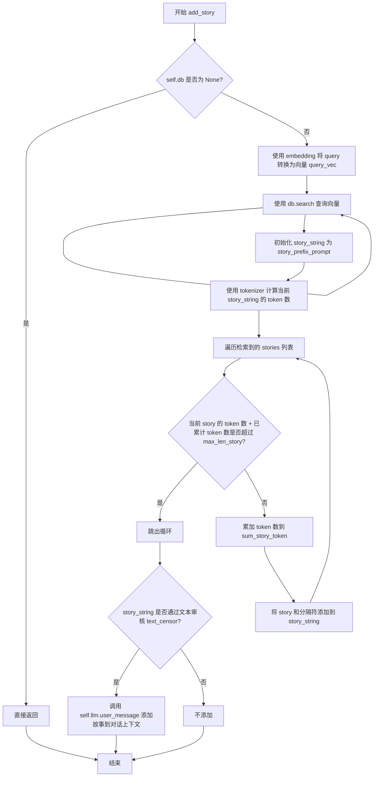

#### 带注释源码

```python
def add_story(self, query):
    """
    添加相关的故事场景到 LLM 上下文中
    
    参数:
        query: str，用户输入的查询文本
    返回:
        None
    """
    
    # 检查数据库是否已初始化
    if self.db is None:
        return
    
    # 将用户查询转换为向量表示
    # embedding 函数将文本转换为向量，用于语义搜索
    query_vec = self.embedding(query)

    # 在故事数据库中搜索最相关的 k 个场景
    # k_search 默认为 19，在 __init__ 中设置
    stories = self.db.search(query_vec, self.k_search)
    
    # 初始化故事字符串，添加前缀提示
    story_string = self.story_prefix_prompt  # "Classic scenes for the role are as follows:\n"
    
    # 计算当前故事字符串的 token 数量
    sum_story_token = self.tokenizer(story_string)
    
    # 遍历所有检索到的故事场景
    for story in stories:
        # 计算当前故事的 token 数加上分隔符的 token 数
        story_token = self.tokenizer(story) + self.tokenizer(self.dialogue_divide_token)
        
        # 检查添加当前故事后是否会超过最大 token 限制
        if sum_story_token + story_token > self.max_len_story:
            # 超过限制，跳出循环
            break
        else:
            # 未超过限制，累加 token 数
            sum_story_token += story_token
            # 将故事和分隔符添加到字符串中
            story_string += story + self.dialogue_divide_token
    
    # 对生成的故事字符串进行文本审核
    # 如果通过审核，则添加到 LLM 上下文中
    if text_censor(story_string):
        # 将故事内容作为用户消息添加到 LLM
        self.llm.user_message(story_string)
```


### `ChatHaruhi_safe.add_history`

该方法负责将对话历史添加到语言模型的上下文中，通过逆向遍历对话历史并计算token数量，确保添加的历史记录不超过设定的最大token长度限制，从而在保持上下文相关性的同时避免超出模型的长度限制。

参数：无（仅包含`self`参数）

返回值：`None`，无返回值

#### 流程图

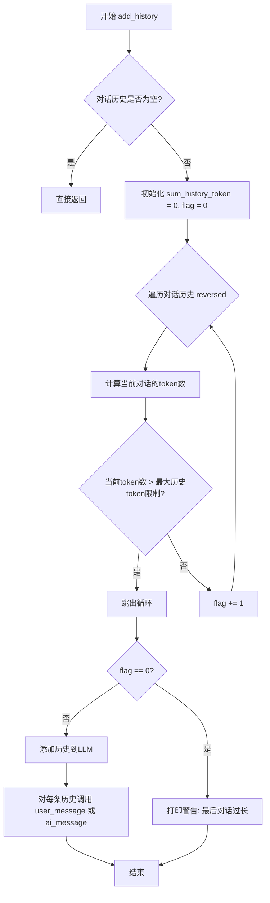

#### 带注释源码

```python
def add_history(self):
    """
    将对话历史添加到语言模型的上下文中
    
    核心逻辑:
    1. 从最近的对话开始逆向遍历，累积计算token数量
    2. 当累积token数超过max_len_history时停止
    3. 将符合长度限制的历史记录添加到LLM上下文
    """
    
    # 如果对话历史为空，直接返回，不做任何处理
    if len(self.dialogue_history) == 0:
        return
    
    # 初始化变量
    sum_history_token = 0   # 累积的历史token总数
    flag = 0                # 记录需要添加的历史对话数量
    
    # 逆向遍历对话历史（从最近到最旧）
    for query, response in reversed(self.dialogue_history):
        current_count = 0   # 当前对话的token数
        
        # 如果query存在，计算其token数
        if query is not None:
            current_count += self.tokenizer(query) 
        
        # 如果response存在，计算其token数
        if response is not None:
            current_count += self.tokenizer(response)
        
        # 累加当前对话的token数
        sum_history_token += current_count
        
        # 判断是否超过最大历史token限制
        if sum_history_token > self.max_len_history:
            # 超过限制，跳出循环
            break
        else:
            # 未超过限制，flag加1
            flag += 1

    # 如果flag为0，说明最后一条对话本身就超过了最大历史token限制
    if flag == 0:
        print('warning! no history added. the last dialogue is too long.')

    # 将符合限制的历史记录添加到LLM上下文
    # 取最后flag数量的对话历史
    for (query, response) in self.dialogue_history[-flag:]:
        # 添加用户消息
        if query is not None:
            self.llm.user_message(query)
        # 添加AI回复消息
        if response is not None:
            self.llm.ai_message(response)
```

## 关键组件


### ChromaDB向量数据库

用于存储和检索角色故事相关内容的向量数据库，通过相似度搜索找到与当前对话最相关的故事片段

### luotuo_openai_embedding / get_bge_embedding

文本嵌入模型，将文本转换为向量表示，用于语义检索。默认使用luotuo_openai，也支持bge_en英文嵌入

### LangChainGPT / SparkGPT / GLMPro / ErnieGPT / ChatGLM2GPT / BaiChuan2GPT

多种大语言模型适配器，通过工厂方法get_models统一实例化，支持OpenAI、讯飞星火、百度ERNIE、ChatGLM2等多种LLM后端

### tiktokenizer / GLM_tokenizer / BaiChuan_tokenizer

分词器工具，用于计算文本token长度以控制故事和历史记录的上下文长度

### 故事前缀提示 (story_prefix_prompt)

用于构建检索到的故事片段的前缀引导文本，默认值为"Classic scenes for the role are as follows:\n"

### 对话历史管理 (dialogue_history)

维护对话历史记录，通过add_history方法动态添加，并基于max_len_history控制历史记录的token长度

### 文本审核 (text_censor)

内容安全检查模块，在添加故事到LLM前进行文本审核，过滤不安全内容

### 响应后处理 (response_postprocess)

对LLM原始响应进行后处理，提取对话内容，支持特定的对话格式标记（dialogue_bra_token为「，dialogue_ket_token为」）

### 角色数据加载 (role_name / role_from_hf)

支持两种角色数据加载方式：从本地文件夹解压加载，或从HuggingFace数据集远程加载，并自动构建向量数据库

### 检索增强生成 (RAG) 流程

通过get_query_string构建查询，add_story方法使用ChromaDB进行向量相似度检索，将相关故事片段作为上下文注入LLM提示词

### 系统提示词处理 (check_system_prompt)

检查系统提示词是否为.txt文件，若是则读取文件内容，否则直接返回字符串内容

### 对话标记系统 (narrator / dialogue_divide_token)

定义旁白角色列表和对话分隔符，用于识别旁白角色和格式化故事/历史文本


## 问题及建议


### 已知问题

1. **长方法问题**: `__init__` 方法过于冗长（超过150行），承担了过多职责，包括LLM初始化、embedding配置、数据库加载等，应拆分
2. **重复的if-elif分支**: `get_models` 和 `get_tokenlen_setting` 方法都包含大量重复的if-elif判断，可使用字典映射模式重构
3. **硬编码配置**: `k_search=19`、`narrator`列表、`dialogue_divide_token`等配置直接硬编码在类中，应抽取为配置参数
4. **TODO未完成**: 代码中存在多个TODO注释标记待完成项，如embedding应分离定义、embedding批量测试等
5. **缺失异常处理**: 
   - 网络请求下载角色zip文件时无异常捕获（requests.get可能失败）
   - 文件读取（system_prompt.txt、story_text_folder中的txt文件）无异常处理
   - ChromaDB操作无异常处理
6. **类型注解缺失**: 所有方法参数和返回值都缺少类型注解，影响代码可维护性和IDE支持
7. **性能问题**: `build_story_db`方法逐个处理文本embedding，应改为批量处理
8. **动态导入滥用**: 大量使用`from xxx import xxx`动态导入，隐藏在方法内部，难以追踪依赖和进行静态分析
9. **日志记录缺失**: 仅使用print输出信息，无统一的日志系统，不利于生产环境调试
10. **变量初始化不一致**: `self.db`在多种情况下初始化路径不同（有时为None），可能导致后续使用时出现NPE

### 优化建议

1. **使用字典映射替代if-elif**: 将LLM和embedding的初始化逻辑改为字典映射，如 `{"openai": (LangChainGPT, tiktokenizer), "debug": (PrintLLM, tiktokenizer)}`
2. **拆分__init__方法**: 将初始化的不同职责抽取为独立私有方法，如 `_init_llm()`, `_init_embedding()`, `_init_database()`
3. **添加类型注解**: 为所有方法参数和返回值添加类型注解，提高代码可读性
4. **统一配置管理**: 创建配置类或使用配置文件管理所有硬编码常量
5. **添加异常处理**: 为文件操作、网络请求、数据库操作添加try-except异常处理和重试逻辑
6. **实现批量embedding**: 在`build_story_db`中实现批量向量化和批量tokenize
7. **引入日志模块**: 替换print为logging模块，支持不同日志级别
8. **添加配置验证**: 在`__init__`开始时验证必要参数的有效性
9. **抽取下载逻辑**: 将角色下载和解压逻辑抽取为独立方法，并添加进度显示和错误处理
10. **添加单元测试**: 为核心方法添加单元测试，特别是chat、add_story、add_history等关键逻辑


## 其它


### 设计目标与约束

本模块旨在构建一个支持多种大语言模型和embedding的角色扮演聊天系统，核心目标包括：1）支持从本地文件夹或HuggingFace加载角色定义；2）基于ChromaDB实现故事背景的向量检索；3）支持多种LLM后端（OpenAI、Spark、GLM、Ernie、BaiChuan等）；4）实现对话历史和故事上下文的token长度管理。约束条件包括：依赖Python环境、需要网络访问下载角色数据、embedding和LLM调用存在延迟。

### 错误处理与异常设计

代码中多处使用print输出warning而非抛出异常，属于轻量级错误处理策略。主要问题点：1）`get_models`方法对未知模型名仅打印警告并回退到openai；2）`__init__`中当story_db和story_text_folder都未提供时仅打印警告，db设为None；3）网络请求下载角色zip包时缺乏异常捕获；4）文件读取缺乏编码异常处理。当前设计允许系统在不完整配置下部分运行，但可能导致隐蔽bug。建议改进方向：建立统一的异常类体系，对可恢复错误使用警告+降级策略，对致命错误（如LLM初始化失败）应抛出明确异常。

### 数据流与状态机

核心数据流：用户输入(text, role) → get_query_string格式化 → add_story检索向量数据库 → add_history加载历史对话 → llm生成响应 → response_postprocess后处理 → 记录dialogue_history。状态管理：dialogue_history列表存储历史对话对(query, response)；db状态管理ChromaDB向量库；llm的message状态由LangChainGPT等类内部维护。关键状态转换点：首次调用chat时history为空；story检索可能返回空结果；对话历史超过max_len_history时自动截断。

### 外部依赖与接口契约

核心依赖：1）ChromaDB - 向量数据库；2）LangChainGPT/SparkGPT/GLMPro等 - LLM适配器；3）luotuo_openai_embedding/bge_en - embedding生成；4）tiktokenizer - token计数；5）requests/zipfile - 角色数据包下载；6）datasets - HuggingFace数据集加载。接口契约：llm对象需实现initialize_message()、system_message()、user_message()、ai_message()、get_response()方法；embedding函数需接受文本返回向量；tokenizer需支持__call__返回token数量。外部数据格式：角色zip包需包含content/{role_name}文件夹和system_prompt.txt；HuggingFace数据集需包含text和embedding字段。

### 性能考虑与资源管理

性能瓶颈：1）embedding逐条处理（build_story_db中for循环），建议批量处理；2）每次chat都进行向量检索，未缓存；3）对话历史全部加载可能超限。资源管理：1）token长度限制（max_len_story默认1500，max_len_history默认1200）；2）k_search默认19，检索数量可调；3）故事文本使用dialogue_divide_token分隔符管理。优化建议：实现embedding批量推理、添加查询结果缓存、考虑使用流式响应减少首字节延迟。

### 安全考虑

1）text_censor函数用于内容审查（add_story中调用）；2）system_prompt支持从文件读取，需注意path traversal风险；3）网络请求下载角色数据无签名验证；4）对话历史存储在内存中，无敏感信息加密。风险点：用户输入未做安全过滤直接用于检索和LLM调用，可能存在prompt注入风险；HuggingFace数据集加载缺乏完整性校验。

### 配置与可扩展性

当前配置通过__init__参数传入，支持：llm类型、embedding类型、token长度限制、角色来源（role_name/role_from_hf/story_db/story_text_folder）、verbose开关。扩展点：1）新增LLM只需在get_models添加分支；2）新增embedding在__init__和build_story_db添加支持；3）角色加载逻辑可重构为独立策略类。配置管理问题：配置分散在类属性和常量中，缺乏统一配置对象；部分硬编码值（如narrator列表、k_search）建议外置。

### 测试策略建议

单元测试覆盖点：1）get_query_string对narrator角色的格式化；2）add_story的token长度截断逻辑；3）add_history的历史长度管理；4）各LLM适配器的接口一致性；5）embedding函数的向量维度一致性。集成测试：1）完整chat流程端到端测试；2）角色加载（本地zip和HuggingFace）；3）多轮对话状态保持。mock策略：使用PrintLLM（debug模式）进行无网络测试；embedding使用mock向量。

### 版本兼容性

代码使用Python 3.x语法，无类型注解。依赖版本：ChromaDB（向量存储）、datasets（HuggingFace）、requests（网络）。Python版本要求至少3.7（使用f-string、os.path.join等）。第三方LLM API版本可能变化（如OpenAI API从gpt-3.5到gpt-4），需关注兼容性。

### 部署注意事项

1）环境变量管理：OpenAI API Key等敏感信息需通过环境变量配置；2）模型文件存储：角色zip包下载到./temp_character_folder，需配置持久化存储；3）ChromaDB数据持久化：save_story_db方法需指定有效路径；4）网络要求：生产环境需开放HuggingFace、OpenAI等API访问；5）日志与监控：当前仅支持verbose模式打印，建议接入标准logging；6）容器化部署：需注意temp文件夹权限和模型缓存目录。


    