# `Chat-Haruhi-Suzumiya\ChatHaruhi2.0\ChatHaruhi\ChromaDB.py` 详细设计文档

这是一个ChromaDB向量数据库的封装类，继承自BaseDB基类，提供了向量数据库的初始化、保存、加载、搜索以及从文档初始化等功能，支持持久化存储和临时文件管理。

## 整体流程

```mermaid
graph TD
    A[开始] --> B{client是否已初始化?}
    B -- 是 --> C[打印提示并返回]
    B -- 否 --> D[生成随机文件夹名]
    D --> E[创建PersistentClient]
    E --> F[获取或创建collection]
    G[save方法] --> H{file_path != self.path?}
    H -- 是 --> I[复制文件到新路径]
    H -- 否 --> J[切换client到新路径]
    I --> K{previous_path以tempdb开头?}
    K -- 是 --> L[删除临时文件夹]
    M[load方法] --> N[设置path和client]
    N --> O[获取collection]
    P[search方法] --> Q[调用collection.query]
    Q --> R[返回documents结果]
    S[init_from_docs方法] --> T{client为None?]
    T -- 是 --> U[调用init_db]
    T -- 否 --> V[生成IDs并添加数据]
```

## 类结构

```
BaseDB (抽象基类)
└── ChromaDB (继承自BaseDB)
```

## 全局变量及字段


### `ChromaDB.client`
    
ChromaDB客户端实例，用于管理与ChromaDB数据库的连接

类型：`chromadb.PersistentClient`
    


### `ChromaDB.collection`
    
数据集合对象，用于存储和检索向量数据

类型：`chromadb.collection.Collection`
    


### `ChromaDB.path`
    
数据库存储路径，指向ChromaDB持久化数据的目录位置

类型：`str`
    
    

## 全局函数及方法


### `random.sample`

用于生成随机文件夹名称的随机采样函数，从字母和数字集合中随机选取8个不重复的字符。

参数：

- `population`：`string`（字符串），由 `string.ascii_letters`（所有字母）和 `string.digits`（所有数字）拼接而成的字符池
- `k`：`int`（整数），要采样的字符数量，这里固定为8

返回值：`list`（列表），返回从 population 中随机抽取的 k 个不重复字符组成的列表

#### 流程图

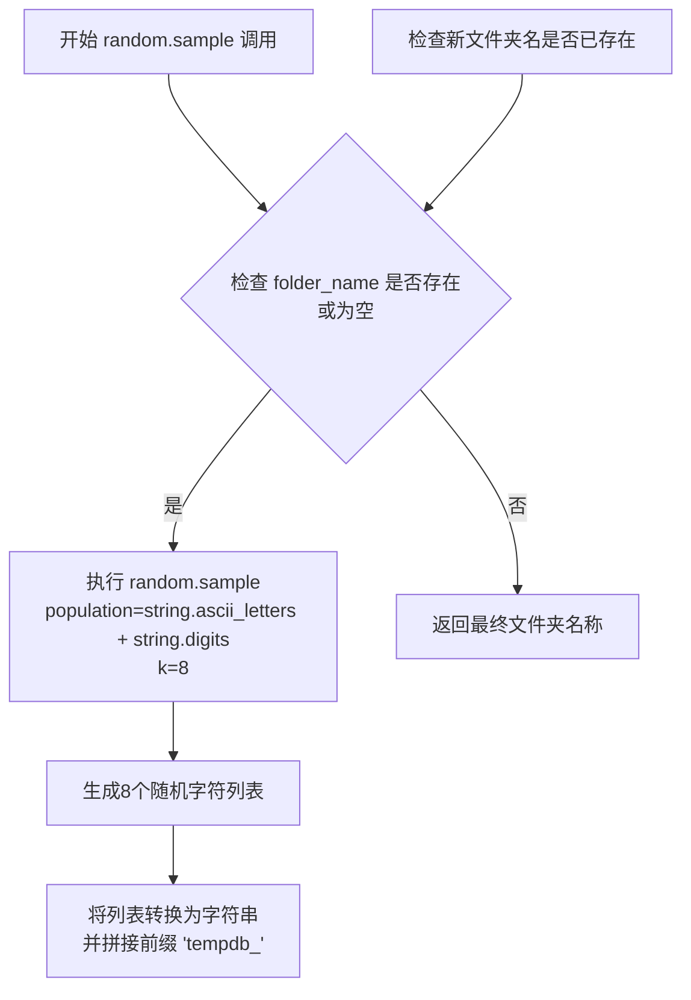

#### 带注释源码

```python
# 用于生成随机文件夹名称
# random.sample 从指定序列中随机抽取指定数量的不重复元素
# 参数1: population - 要从中采样的总体（字符集）
# 参数2: k - 要采样的元素数量
folder_name = "tempdb_" + ''.join(random.sample(string.ascii_letters + string.digits, 8))

# 详细分解:
# 1. string.ascii_letters -> "abcdefghijklmnopqrstuvwxyzABCDEFGHIJKLMNOPQRSTUVWXYZ"
# 2. string.digits -> "0123456789"
# 3. string.ascii_letters + string.digits -> 合并后的62个字符的字符串
# 4. random.sample(..., 8) -> 从62个字符中随机选取8个不重复的字符，返回列表
# 5. ''.join(...) -> 将字符列表拼接成字符串
# 示例结果: "tempdb_Ab3kL9mN"
```

#### 上下文使用说明

在 `ChromaDB.init_db` 方法中，`random.sample` 用于生成唯一的临时数据库文件夹名称。该方法通过 `while` 循环检查生成的文件夹名是否已存在，如果存在则重新生成，直到找到不重复的名称。这种方式确保了临时文件夹不会与现有文件夹冲突。

**潜在优化点**：

- 可以使用 `uuid.uuid4()` 替代 `random.sample` 来生成更可靠的唯一标识符
- 当前实现依赖文件系统检查来避免冲突，在高并发场景下可能存在竞态条件
- 随机字符串长度为8，理论上有 62^8 ≈ 218 万亿种组合，冲突概率极低但非零


### `os.path.exists`

`os.path.exists` 是 Python 标准库 `os.path` 模块中的一个全局函数，用于检查指定路径（文件或目录）是否存在。

参数：

- `path`：`str`，要检查的文件或目录路径

返回值：`bool`，如果指定路径存在则返回 `True`，否则返回 `False`

#### 流程图

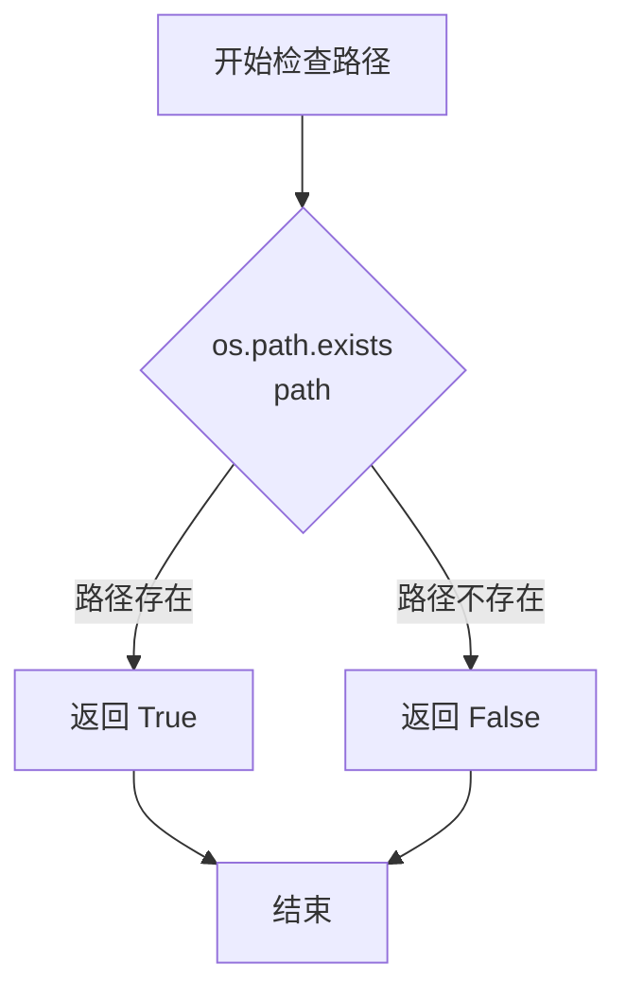

#### 带注释源码

```python
import os

# 在 ChromaDB 类的 init_db 方法中使用 os.path.exists
def init_db(self):
    # 检查 client 是否已经初始化
    if self.client is not None:
        print('ChromaDB has already been initialized')
        return

    folder_name = ''

    # 循环生成一个不存在的随机文件夹名称
    # os.path.exists 用于检查路径是否已存在
    while os.path.exists(folder_name) or folder_name == '':
        # 尝试创建一个 temp_<随机字符串> 的文件夹，确保该文件夹不存在
        folder_name =  "tempdb_" + ''.join(random.sample(string.ascii_letters + string.digits, 8))

    # 设置实例属性 path 为新生成的文件夹路径
    self.path = folder_name
    # 使用 ChromaDB 的 PersistentClient 持久化客户端，指定路径
    self.client = chromadb.PersistentClient(path = folder_name)

    # 获取或创建名为 "search" 的 collection
    self.collection = self.client.get_or_create_collection("search")
```


### `os.system`

执行系统命令，用于复制和删除文件系统路径。

参数：

-  `command`：`str`，要执行的系统命令字符串

返回值：`int`，命令的退出状态码（0 表示成功，非0表示失败）

#### 流程图

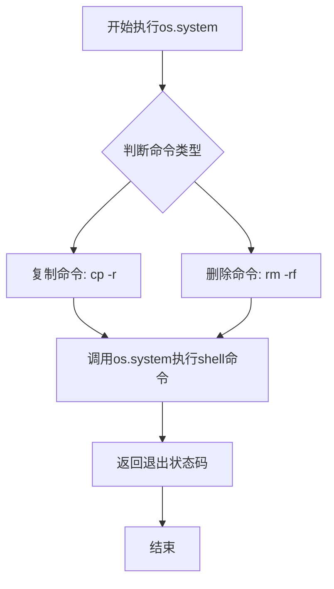

#### 带注释源码

```python
# 在save方法中，复制数据库文件夹到目标路径
os.system("cp -r " + self.path + " " + file_path)
# 解释：使用shell的cp命令递归复制self.path目录到file_path目录
# 参数：self.path - 源路径, file_path - 目标路径
# 返回：命令退出状态码

# 在save方法中，删除临时数据库文件夹
os.system("rm -rf " + previous_path)
# 解释：使用shell的rm命令强制递归删除previous_path目录
# 参数：previous_path - 要删除的临时文件夹路径
# 返回：命令退出状态码
```

---

### `ChromaDB.save`

将数据库从当前路径复制到新的指定路径，并清理临时数据库文件。

参数：

-  `file_path`：`str`，目标文件路径，要复制到的位置

返回值：`None`，无返回值

#### 流程图

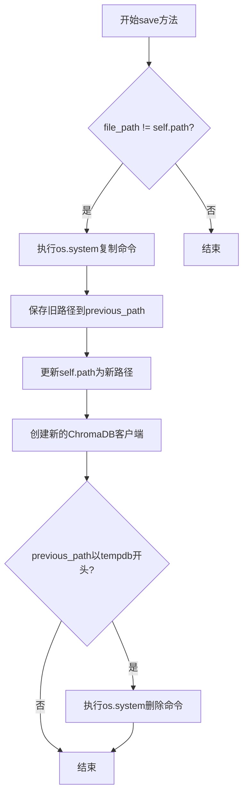

#### 带注释源码

```python
def save(self, file_path):
    # 如果目标路径与当前路径不同，则执行复制操作
    if file_path != self.path:
        # 使用os.system调用shell的cp命令递归复制目录
        # 将self.path目录复制到file_path目录，涵盖所有子文件和子目录
        os.system("cp -r " + self.path + " " + file_path)
        
        # 保存当前路径作为previous_path，用于后续可能的清理操作
        previous_path = self.path
        
        # 更新实例的path属性为新的目标路径
        self.path = file_path
        
        # 使用新的文件路径创建新的ChromaDB PersistentClient实例
        self.client = chromadb.PersistentClient(path = file_path)
        
        # 如果之前的路径是临时文件夹（以tempdb开头），则删除它
        # tempdb文件夹是init_db方法自动生成的随机临时目录
        if previous_path.startswith("tempdb"):
            # 使用os.system调用shell的rm -rf命令强制递归删除目录
            os.system("rm -rf " + previous_path)
```

---

### `ChromaDB.load`

从指定路径加载已存在的ChromaDB数据库。

参数：

-  `file_path`：`str`，数据库文件路径，要加载的已保存数据库路径

返回值：`None`，无返回值

#### 流程图

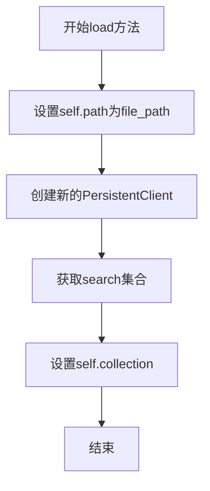

#### 带注释源码

```python
def load(self, file_path):
    # 设置实例的path属性为指定的文件路径
    self.path = file_path
    
    # 使用指定的路径创建新的ChromaDB PersistentClient实例
    # 该客户端会从指定路径加载已存在的数据库
    self.client = chromadb.PersistentClient(path = file_path)
    
    # 从客户端获取名为"search"的集合
    # 如果集合不存在会抛出异常
    self.collection = self.client.get_collection("search")
```


### ChromaDB.init_db

初始化ChromaDB数据库，创建一个基于文件系统的持久化客户端，并获取或创建名为"search"的集合。

参数：
- 无

返回值：无（None），该方法仅执行初始化操作，不返回任何值

#### 流程图

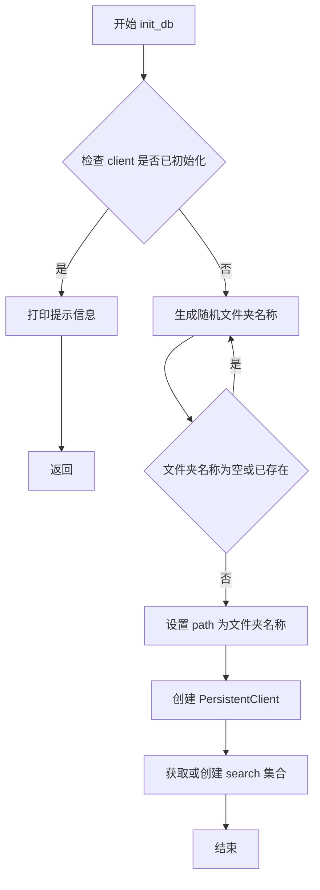

#### 带注释源码

```python
def init_db(self):
    """
    初始化ChromaDB数据库
    如果已经初始化过，则直接返回，避免重复初始化
    """
    # 检查是否已经初始化过，如果已初始化则打印提示并返回
    if self.client is not None:
        print('ChromaDB has already been initialized')
        return

    # 初始化文件夹名称为空字符串
    folder_name = ''

    # 循环生成一个不存在的临时文件夹名称
    # 格式为 tempdb_ + 8位随机字母数字组合
    while os.path.exists(folder_name) or folder_name == '':
        # 尝试创建一个名为 temp_<随机字符串> 的文件夹，且该文件夹不存在
        folder_name =  "tempdb_" + ''.join(random.sample(string.ascii_letters + string.digits, 8))

    # 保存生成的文件夹路径
    self.path = folder_name
    # 创建持久化客户端，指定数据存储路径
    # 这是创建持久化客户端的关键步骤，将数据保存在指定文件夹中
    self.client = chromadb.PersistentClient(path = folder_name)

    # 获取或创建名为 "search" 的集合，用于后续的向量搜索操作
    self.collection = self.client.get_or_create_collection("search")
```

---

### ChromaDB.save

保存ChromaDB数据库到指定路径，包含数据迁移和旧临时文件清理逻辑。

参数：
- `file_path`：`str`，目标保存路径

返回值：无（None），该方法执行数据库保存和路径切换操作

#### 流程图

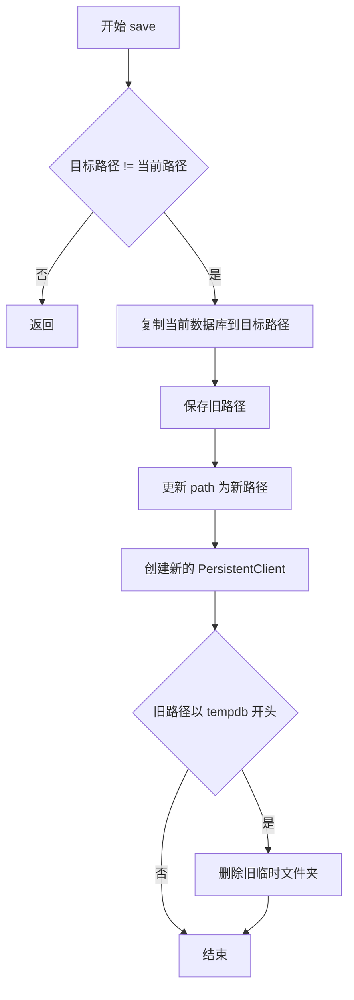

#### 带注释源码

```python
def save(self, file_path):
    """
    保存数据库到指定路径
    如果目标路径与当前路径不同，则执行复制和切换操作
    """
    # 只有当目标路径与当前路径不同时才执行保存操作
    if file_path != self.path:
        # 将 self.path 中的所有文件复制到 file_path，覆盖已有文件
        os.system("cp -r " + self.path + " " + file_path)
        # 保存旧路径，用于后续可能的清理操作
        previous_path = self.path
        # 更新当前路径为新的目标路径
        self.path = file_path
        # 重新创建 PersistentClient，指向新的持久化路径
        # 此处创建新的持久化客户端，使数据保存到新路径
        self.client = chromadb.PersistentClient(path = file_path)
        # 如果旧路径以 tempdb 开头，说明是临时文件夹，需要清理
        if previous_path.startswith("tempdb"):
            os.system("rm -rf " + previous_path)
```

---

### ChromaDB.load

从指定路径加载ChromaDB数据库，恢复持久化的向量数据库连接。

参数：
- `file_path`：`str`，要加载的数据库路径

返回值：无（None），该方法执行数据库加载和集合初始化操作

#### 流程图

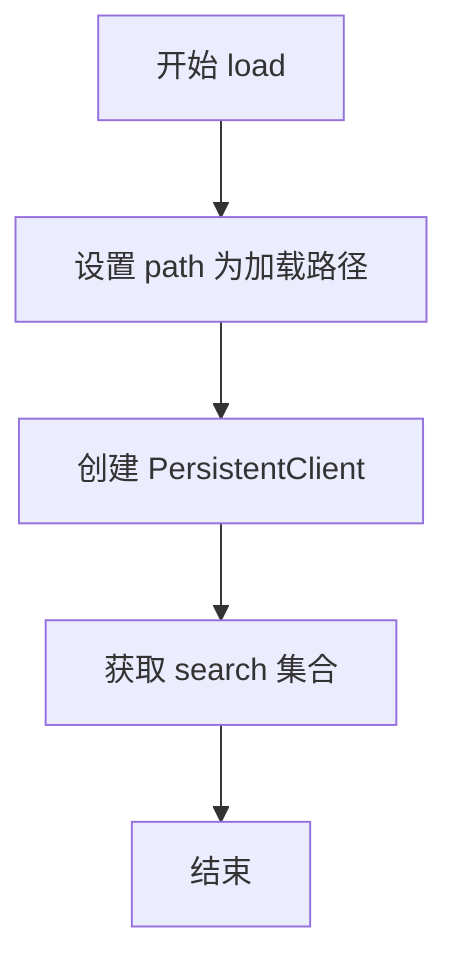

#### 带注释源码

```python
def load(self, file_path):
    """
    从指定路径加载已保存的数据库
    重新建立与持久化数据的连接
    """
    # 设置当前路径为要加载的数据库路径
    self.path = file_path
    # 创建持久化客户端，连接到指定的数据库路径
    # 从指定路径加载已持久化的数据
    self.client = chromadb.PersistentClient(path = file_path)
    # 获取已存在的 search 集合
    # 注意：这里使用 get_collection 而不是 get_or_create_collection
    # 因为加载时集合应该已经存在
    self.collection = self.client.get_collection("search")
```

---

## 补充说明

### chromadb.PersistentClient 使用总结

在上述代码中，`chromadb.PersistentClient` 的创建涉及以下三个场景：

| 场景 | 方法 | 目的 |
|------|------|------|
| 初始化临时数据库 | `init_db()` | 创建临时存储路径，初始化新的持久化客户端 |
| 保存到新路径 | `save()` | 切换持久化路径到新的目标位置 |
| 从文件加载 | `load()` | 连接到已存在的持久化数据 |

### PersistentClient 参数

- `path`：字符串类型，指定数据持久化存储的文件夹路径

### 设计目标与约束

- **持久化机制**：通过文件系统实现数据持久化，存储在指定文件夹中
- **临时文件管理**：初始化时创建临时文件夹，保存后自动清理
- **单集合限制**：代码中固定使用名为"search"的集合

### 潜在技术债务

1. **硬编码集合名称**：集合名"search"被硬编码，无法灵活配置
2. **os.system 调用**：使用 `os.system` 执行 shell 命令存在安全风险，应使用 Python 原生方法
3. **错误处理缺失**：缺少对 chromadb 异常的捕获和处理
4. **类型注解缺失**：方法参数和返回值缺少类型注解


### `chromadb.PersistentClient.get_or_create_collection`

获取或创建一个名称为 "search" 的集合，如果集合已存在则返回该集合，如果不存在则创建一个新集合。这是 ChromaDB 持久化客户端的核心方法，用于管理向量数据库中的集合。

#### 参数

- `name`：`str`，集合的名称，用于标识和访问集合
- `metadata`：`Optional[dict]`，可选的元数据字典，用于存储集合的额外属性信息

#### 返回值：`Collection`，返回集合对象

#### 流程图

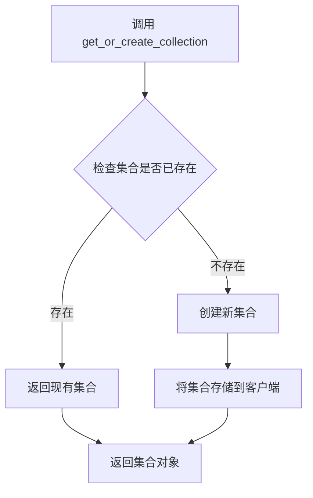

#### 带注释源码

```
# 注意：这是 chromadb 库的内置方法，源码不在本项目代码中
# 以下是基于代码调用推断的实现逻辑：

def get_or_create_collection(self, name: str, metadata: Optional[dict] = None):
    """
    获取或创建集合
    
    参数:
        name: 集合名称
        metadata: 可选的元数据
    
    返回:
        Collection 对象
    """
    # 1. 检查内存中是否已缓存该集合
    # 2. 如果已缓存，直接返回
    # 3. 如果未缓存，检查持久化存储中是否存在
    # 4. 如果存在，从持久化存储加载
    # 5. 如果不存在，创建新集合并保存
    # 6. 将集合缓存并返回
```

#### 在项目中的调用示例

```python
# 在 ChromaDB 类的 init_db 方法中调用
self.collection = self.client.get_or_create_collection("search")
```


### `chromadb.PersistentClient.get_collection`

获取指定名称的 Collection 对象。如果 Collection 不存在，则抛出异常。

参数：
-  `name`：`str`，Collection 的名称，代码中传入 `"search"`

返回值：`Collection`，返回与名称对应的 Collection 对象，用于后续的数据操作。

#### 流程图

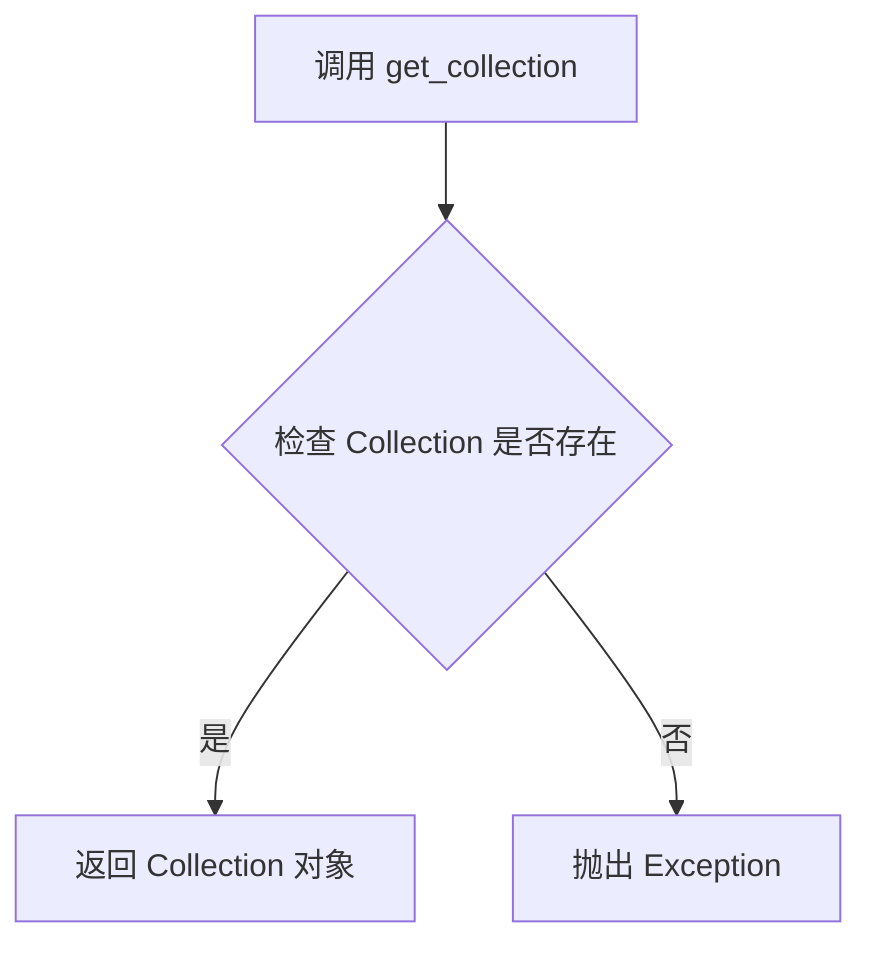

#### 带注释源码

在 `ChromaDB` 类的 `load` 方法中调用：

```python
def load(self, file_path):
    """
    从指定路径加载已保存的 ChromaDB 数据库。
    """
    # 设置数据库路径
    self.path = file_path
    # 创建 PersistentClient 实例，指定路径
    self.client = chromadb.PersistentClient(path = file_path)
    # 获取名为 "search" 的 Collection
    # 如果 Collection 不存在，此方法会抛出异常
    self.collection = self.client.get_collection("search")
```


### `ChromaDB.search`

该方法用于在向量数据库中查询与给定向量最相似的文档结果，通过调用 ChromaDB 客户端的 `collection.query` 方法执行相似性搜索，并返回最相似的文档列表。

参数：

- `vector`：`list`，查询用的嵌入向量（embedding vector）
- `n_results`：`int`，需要返回的最相似结果数量

返回值：`list`，返回与查询向量最相似的文档列表（字符串列表）

#### 流程图

```mermaid
flowchart TD
    A[开始 search 方法] --> B[调用 collection.query 方法]
    B --> C[传入 query_embeddings=[vector]]
    B --> D[传入 n_results 参数]
    C --> E[执行向量相似性查询]
    E --> F[返回查询结果 results]
    F --> G{检查结果}
    G --> H[提取 results['documents'][0]]
    H --> I[返回文档列表]
    J[结束]
    I --> J
```

#### 带注释源码

```python
def search(self, vector, n_results):
    # 调用 ChromaDB collection 的 query 方法进行向量相似性搜索
    # 参数:
    #   - query_embeddings: 查询向量列表，这里传入 [vector]
    #   - n_results: 返回最相似的 n 个结果
    # 返回值包含: documents, embeddings, distances, metadatas, ids 等字段
    results = self.collection.query(
        query_embeddings=[vector], 
        n_results=n_results
    )
    
    # 从结果中提取文档列表并返回
    # results['documents'] 是一个二维列表，第一维是查询数量（这里只有1个）
    # 取 [0] 获取第一个查询的文档列表
    return results['documents'][0]
```


### `collection.add`

该方法用于将向量和文档添加到 ChromaDB 的 collection 中，是存储数据到向量数据库的核心操作。

参数：

-  `embeddings`：`list`，向量列表，每个向量对应一个文档
-  `documents`：`list`，文档列表，每个文档是一个字符串
-  `ids`：`list`，唯一标识符列表，用于标识每个文档

返回值：`None`，ChromaDB 的 add 方法无返回值，直接将数据写入存储

#### 流程图

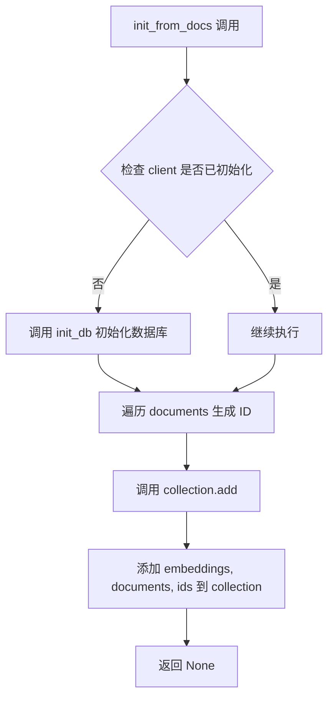

#### 带注释源码

```python
def init_from_docs(self, vectors, documents):
    """
    初始化数据库并添加向量和文档到 collection
    
    参数:
        vectors: 向量列表，每个向量对应一个文档
        documents: 文档列表，每个文档是一个字符串
    """
    # 检查客户端是否已初始化，如果未初始化则调用 init_db
    if self.client is None:
        self.init_db()
    
    # 初始化 ID 列表
    ids = []
    # 遍历文档列表，为每个文档生成唯一 ID
    for i, doc in enumerate(documents):
        # 取文档前4个字符作为 ID 的一部分
        first_four_chat = doc[:min(4, len(doc))]
        # 组合索引和文档前4个字符生成唯一 ID
        ids.append( str(i) + "_" + doc)
    
    # 调用 ChromaDB collection 的 add 方法将数据添加到数据库
    # embeddings: 向量数据
    # documents: 文本数据  
    # ids: 唯一标识符
    self.collection.add(embeddings=vectors, documents=documents, ids = ids)
```


### `ChromaDB.__init__`

构造函数，初始化 ChromaDB 类的实例，将 client、collection 和 path 三个成员变量设置为 None，准备后续的数据库连接和操作。

参数：
- 该方法无参数（构造函数）

返回值：`None`，构造函数不返回任何值，仅初始化实例属性

#### 流程图

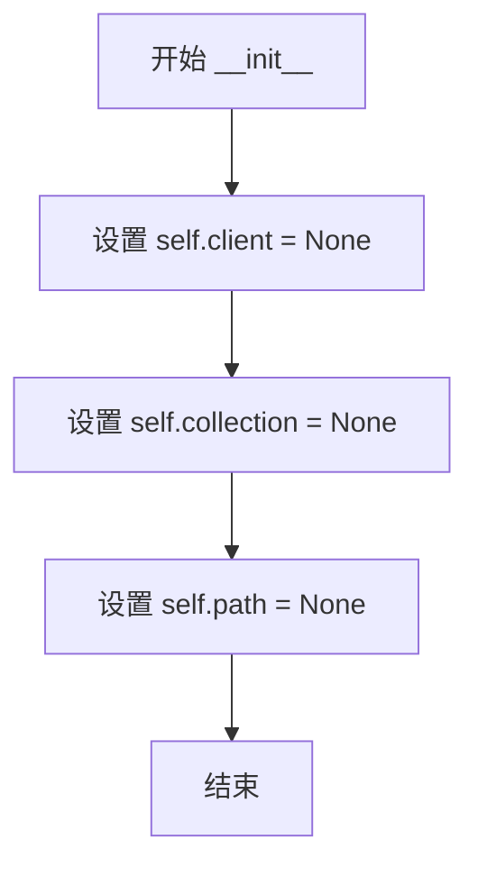

#### 带注释源码

```python
def __init__(self):
    """
    构造函数，初始化 ChromaDB 实例的成员变量
    
    初始化三个核心属性：
    - client: ChromaDB 客户端对象，初始化时为 None
    - collection: 数据集合对象，初始化时为 None
    - path: 数据库存储路径，初始化时为 None
    
    这些属性将在后续调用 init_db、load 或 save 方法时被赋值
    """
    self.client = None      # ChromaDB PersistentClient 客户端实例
    self.collection = None  # ChromaDB Collection 数据集合实例
    self.path = None        # 数据库文件存储路径
```


### `ChromaDB.init_db`

该方法用于初始化ChromaDB数据库，创建一个唯一的临时文件夹作为持久化存储路径，并获取或创建一个名为"search"的collection。

参数：
- 无

返回值：`None`，无返回值

#### 流程图

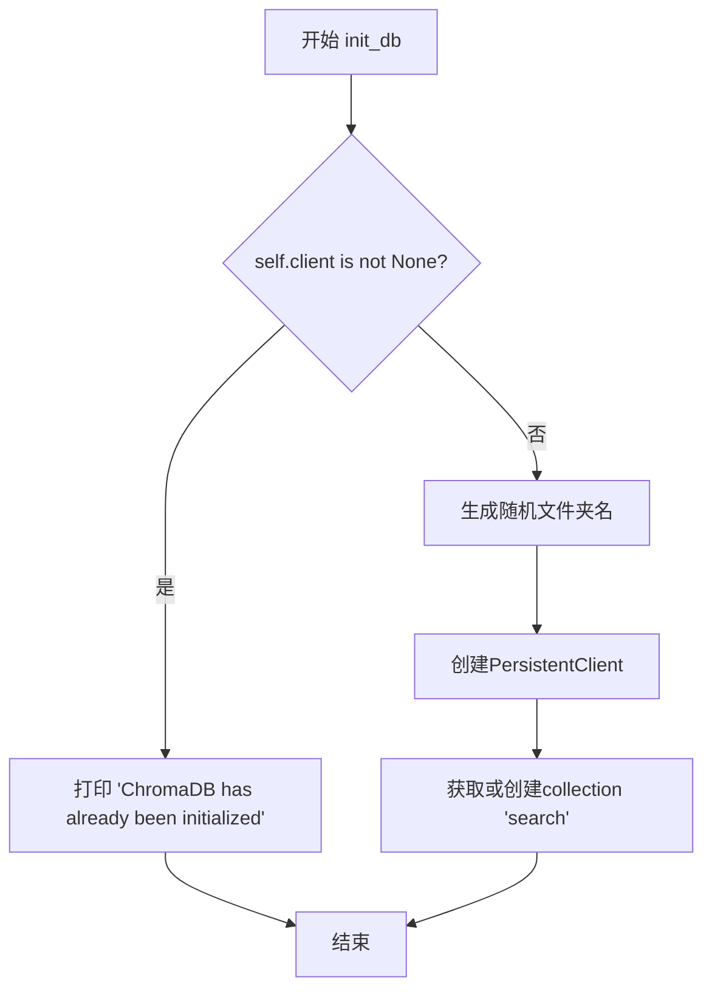

#### 带注释源码

```python
def init_db(self):
    """
    初始化ChromaDB数据库
    如果已经初始化则直接返回，否则创建新的临时文件夹和collection
    """
    
    # 检查是否已经初始化过，如果已初始化则直接返回，避免重复创建
    if self.client is not None:
        print('ChromaDB has already been initialized')
        return

    folder_name = ''

    # 生成一个不存在的临时文件夹名称
    # 循环直到找到不存在的文件夹名
    while os.path.exists(folder_name) or folder_name == '':
        # 生成随机8位字符的文件夹名，格式为 tempdb_ + 随机字母数字
        folder_name =  "tempdb_" + ''.join(random.sample(string.ascii_letters + string.digits, 8))

    # 保存生成的路径到实例变量
    self.path = folder_name
    # 创建PersistentClient，指定持久化路径
    self.client = chromadb.PersistentClient(path = folder_name)

    # 获取或创建名为"search"的collection用于后续向量存储和检索
    self.collection = self.client.get_or_create_collection("search")
```


### `ChromaDB.save`

保存数据库到指定路径，将当前数据库内容复制到目标路径，并更新客户端配置。

参数：

- `file_path`：`str`，目标保存路径，指定要将数据库保存到的目标目录路径

返回值：`None`，无返回值（该方法直接修改对象状态）

#### 流程图

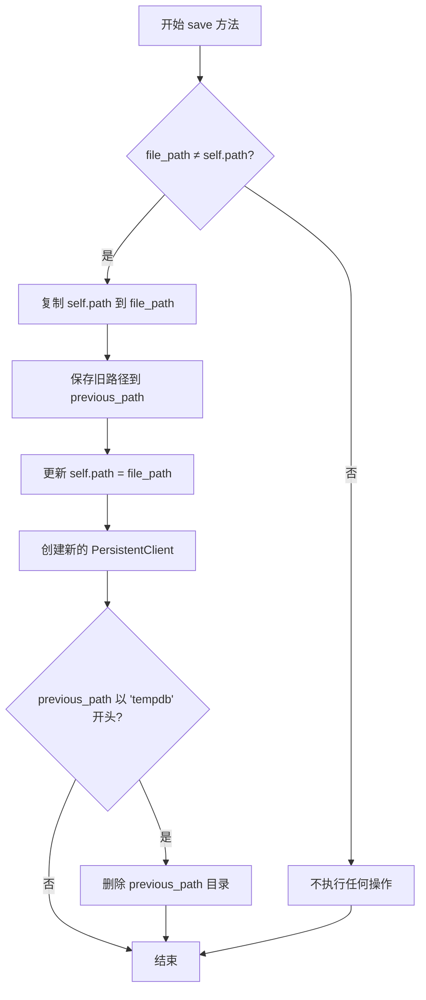

#### 带注释源码

```python
def save(self, file_path):
    """
    将数据库保存到指定路径
    
    参数:
        file_path: 目标保存路径
        
    注意:
        - 如果目标路径与当前路径相同，则不执行任何操作
        - 如果之前路径是临时目录（以tempdb开头），会删除旧目录
    """
    # 检查目标路径是否与当前路径不同
    if file_path != self.path:
        # 使用系统命令复制整个数据库目录到目标路径（覆盖模式）
        os.system("cp -r " + self.path + " " + file_path)
        
        # 保存旧路径，以便后续可能的清理操作
        previous_path = self.path
        
        # 更新实例的路径属性
        self.path = file_path
        
        # 创建新的 PersistentClient 指向新路径
        self.client = chromadb.PersistentClient(path = file_path)
        
        # 如果旧路径是临时目录（以tempdb开头），则删除旧目录以释放空间
        if previous_path.startswith("tempdb"):
            os.system("rm -rf " + previous_path)
```


### `ChromaDB.load`

该方法用于从指定路径加载已保存的ChromaDB数据库实例，通过重新初始化PersistentClient并获取现有的collection来完成加载过程。

**参数：**

- `file_path`：`str`，要加载的数据库文件路径

**返回值：** `None`，该方法没有返回值，仅更新实例状态（client、collection、path）

#### 流程图

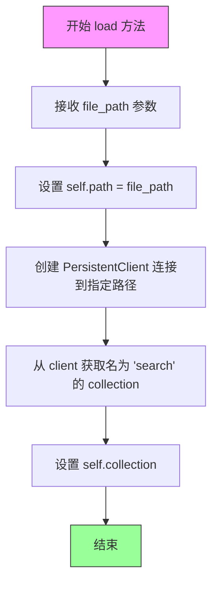

#### 带注释源码

```python
def load(self, file_path):
    """
    从指定路径加载已保存的ChromaDB数据库
    
    参数:
        file_path: 数据库文件路径
    """
    # 1. 将传入的文件路径保存到实例变量 path
    self.path = file_path
    
    # 2. 使用指定路径创建 PersistentClient 实例
    #    PersistentClient 会连接到指定路径的持久化存储
    self.client = chromadb.PersistentClient(path = file_path)
    
    # 3. 从 client 中获取名为 "search" 的 collection
    #    如果 collection 不存在，此处会抛出异常
    self.collection = self.client.get_collection("search")
```


### ChromaDB.search

向量相似度搜索方法，接收查询向量和期望返回的结果数量，在已加载的ChromaDB集合中执行相似度搜索，返回最相似的文档列表。

参数：
- `vector`：`list`，查询向量，用于在向量空间中寻找相似的向量
- `n_results`：`int`，期望返回的最相似结果数量

返回值：`list`，返回最相似的文档列表（字符串数组）

#### 流程图

```mermaid
flowchart TD
    A[开始搜索] --> B{检查collection是否已初始化}
    B -->|collection为None| C[抛出异常或返回空]
    B -->|collection已初始化| D[调用collection.query方法]
    D --> E[传入query_embeddings参数为vector]
    D --> F[传入n_results参数为n_results]
    E --> G[执行向量相似度搜索]
    G --> H[获取结果中的documents字段]
    H --> I[返回documents[0]即文档列表]
```

#### 带注释源码

```python
def search(self, vector, n_results):
    """
    在ChromaDB集合中执行向量相似度搜索
    
    参数:
        vector: 查询向量列表，用于在向量空间中寻找相似向量
        n_results: 指定返回最相似的n个结果
    
    返回:
        返回最相似的文档列表（字符串数组）
    """
    
    # 调用ChromaDB客户端的query方法进行向量搜索
    # query_embeddings: 输入的查询向量
    # n_results: 返回结果的数量限制
    results = self.collection.query(
        query_embeddings=[vector], 
        n_results=n_results
    )
    
    # 从结果字典中提取documents字段
    # results结构: {'documents': [[doc1, doc2, ...]], 'distances': [...], 'metadatas': [...]}
    # 返回第一个查询结果的文档列表
    return results['documents'][0]
```


### `ChromaDB.init_from_docs`

该方法用于从文档列表和对应的向量嵌入初始化ChromaDB集合，将文档及其向量添加到数据库中，如果客户端未初始化则先进行初始化。

参数：

- `vectors`：`List`，文档对应的向量嵌入列表
- `documents`：`List`，文档字符串列表

返回值：`None`，无返回值（该方法直接操作ChromaDB集合）

#### 流程图

```mermaid
flowchart TD
    A[开始 init_from_docs] --> B{self.client is None?}
    B -->|是| C[调用 self.init_db 初始化数据库]
    B -->|否| D[跳过初始化]
    C --> E[创建空列表 ids]
    D --> E
    E --> F[遍历 documents 枚举文档]
    F --> G[获取文档内容的前四个字符 first_four_chat]
    G --> H[生成ID: str(i) + "_" + doc]
    H --> I[将ID添加到ids列表]
    I --> J{还有更多文档?}
    J -->|是| F
    J -->|否| K[调用 self.collection.add 添加向量和文档]
    K --> L[结束]
    
    style C fill:#f9f,stroke:#333
    style K fill:#9f9,stroke:#333
```

#### 带注释源码

```python
def init_from_docs(self, vectors, documents):
    """
    从文档和向量初始化数据库集合
    
    参数:
        vectors: 文档对应的向量嵌入列表
        documents: 文档字符串列表
    返回:
        None
    """
    
    # 检查客户端是否已初始化，若未初始化则先初始化数据库
    if self.client is None:
        self.init_db()
    
    # 初始化空列表用于存储生成的ID
    ids = []
    
    # 遍历文档列表，为每个文档生成唯一ID
    for i, doc in enumerate(documents):
        # 截取文档前四个字符（此处变量名有拼写错误，应为first_four_chars）
        first_four_chat = doc[:min(4, len(doc))]
        
        # 生成ID格式：索引_文档内容
        ids.append( str(i) + "_" + doc)
    
    # 将向量、文档和生成的ID添加到ChromaDB集合中
    self.collection.add(embeddings=vectors, documents=documents, ids = ids)
```

## 关键组件


### 临时文件夹生成机制

使用 random 和 string 模块生成随机的 8 位字母数字组合作为临时数据库文件夹名称，确保文件夹名称唯一性，避免与已存在的文件夹冲突。

### ChromaDB 客户端初始化

通过 chromadb.PersistentClient 创建持久化客户端，指定 path 参数实现数据持久化，并使用 get_or_create_collection 获取或创建名为 "search" 的集合。

### 数据持久化存储 (save 方法)

将临时数据库路径的文件复制到目标路径，切换客户端指向新路径，并自动清理以 "tempdb" 开头的临时文件夹，避免磁盘空间浪费。

### 数据加载 (load 方法)

通过指定文件路径重新初始化 ChromaDB 客户端和集合，支持从已保存的数据库文件中恢复数据。

### 向量相似度搜索

调用 ChromaDB 的 query 接口，传入向量嵌入和返回结果数量 n_results，返回最相似的文档列表。

### 文档向量化存储 (init_from_docs 方法)

将向量和文档批量添加到数据库中，自动生成唯一 ID（索引 + 文档前 4 个字符），支持从文档集合初始化向量数据库。


## 问题及建议


### 已知问题

- **命令注入安全漏洞**：`save`方法中使用`os.system("cp -r " + self.path + " " + file_path)`和`os.system("rm -rf " + previous_path)`，未对`file_path`和`previous_path`进行输入验证，存在命令注入风险
- **缺少路径存在性检查**：`load`方法直接使用传入的`file_path`初始化客户端，未检查路径是否存在或有效
- **错误处理缺失**：所有方法均未捕获和处理可能的异常，如`chromadb`相关异常、文件系统异常等
- **ID生成逻辑缺陷**：`init_from_docs`方法中`ids.append(str(i) + "_" + doc)`，当文档很长时生成的ID也会很长，可能超过ChromaDB的ID长度限制
- **资源泄漏风险**：`save`方法中使用`os.system`命令而非Python的`shutil`模块，跨平台兼容性差且难以保证原子性
- **空结果未处理**：`search`方法返回`results['documents'][0]`时未检查结果是否为空，可能导致索引越界异常
- **重复代码**：多处重复创建`chromadb.PersistentClient`实例，可提取为私有方法
- **硬编码配置**：collection名称"search"硬编码在代码中，缺乏灵活性
- **类型提示缺失**：所有方法参数和返回值均无类型注解，影响代码可维护性和IDE支持

### 优化建议

- 替换`os.system`调用为`shutil`模块或`pathlib`提供的跨平台文件操作方法
- 在所有公共方法中添加try-except异常处理，必要时向上抛出自定义异常
- 在`load`方法开头添加路径有效性检查，不存在时抛出明确异常或自动初始化
- 使用哈希函数（如MD5、SHA256）对文档内容生成短ID，控制ID长度
- 提取`self.client`的创建逻辑为私有方法`_create_client(path)`，减少代码重复
- 将collection名称提取为类常量或构造函数参数
- 为所有方法添加类型提示和文档字符串
- 实现上下文管理器支持（`__enter__`和`__exit__`方法）以确保资源正确释放

## 其它


### 设计目标与约束

**设计目标**：提供基于ChromaDB的向量数据库抽象层，实现文档的向量化存储、加载、保存和相似性搜索功能，支持持久化和临时存储两种模式。

**约束条件**：
- 依赖chromadb库作为底层向量数据库
- 继承BaseDB基类，必须实现init_db、save、load、search、init_from_docs等方法
- 仅支持字符串类型的文档存储
- 文件操作依赖操作系统命令（cp、rm）

### 错误处理与异常设计

**异常类型及处理**：
- **未初始化异常**：当调用search、load等方法时，如果client为None，抛出RuntimeError或调用init_db()
- **路径不存在异常**：load方法中如果file_path不存在，可能导致chromadb.PersistentClient初始化失败，需捕获并抛出FileNotFoundError
- **权限异常**：文件操作（cp、rm）可能因权限不足失败，需捕获os.system返回码并处理
- **集合不存在异常**：load方法中get_collection("search")可能抛出异常，需捕获KeyError

**错误处理策略**：
- init_db中检查client是否为None，避免重复初始化
- save方法在切换路径前先创建新client，失败时回滚
- 使用os.system返回值判断命令执行是否成功（0表示成功）

### 数据流与状态机

**状态机状态**：
1. **UNINITIALIZED**：client为None，未初始化状态
2. **INITIALIZED**：client和collection已创建，可执行search/add操作
3. **LOADED**：从指定路径加载，可执行search操作

**状态转换**：
- UNINITIALIZED → INITIALIZED：通过init_db()或init_from_docs()自动初始化
- INITIALIZED → LOADED：通过load()方法从文件加载
- 任意状态 → INITIALIZED：通过save()方法保存后创建新client

**数据流**：
- 输入：vectors（向量列表）、documents（文档列表）、file_path（路径）
- 处理：向量和文档通过collection.add()存储，通过collection.query()搜索
- 输出：search返回documents列表，load/save无返回值

### 外部依赖与接口契约

**外部依赖**：
- **chromadb**：Python向量数据库客户端库，提供PersistentClient和Collection操作
- **BaseDB**：基类，定义数据库抽象接口
- **os**：文件系统操作
- **random**：随机字符串生成
- **string**：字符集常量

**接口契约**：
- init_db()：无参数，返回None，初始化后client和collection非None
- save(file_path)：参数为字符串路径，返回None，保存后self.path更新为新路径
- load(file_path)：参数为字符串路径，返回None，加载后collection可用
- search(vector, n_results)：参数为向量和整数n_results，返回文档列表（strings）
- init_from_docs(vectors, documents)：参数为向量列表和文档列表，返回None，自动初始化数据库

### 安全性考虑

**潜在安全问题**：
- **路径遍历风险**：file_path参数未做校验，可能存在路径遍历攻击（../等）
- **命令注入风险**：os.system直接拼接字符串执行cp、rm命令，未对folder_name和file_path进行安全校验
- **敏感数据泄露**：临时文件夹tempdb_*可能被恶意利用

**改进建议**：
- 使用shlex.quote()或pathlib.Path()对路径进行安全校验
- 考虑使用subprocess替代os.system，并使用shell=False参数
- 在save操作后及时清理临时文件

### 性能考虑

**性能瓶颈**：
- init_db()中while循环创建临时文件夹，可能多次尝试
- save()使用os.system("cp -r")进行文件复制，大文件时效率低
- search()每次查询都需要访问chromadb，可能产生IO瓶颈

**优化建议**：
- 预先创建固定命名的临时文件夹，避免循环检查
- 使用shutil.copytree()替代os.system cp命令
- 考虑添加缓存层或批量查询接口

### 版本兼容性

**依赖版本要求**：
- chromadb：需明确最低版本，建议在requirements.txt中指定
- Python版本：建议Python 3.8+，因使用os.path.exists()等较新特性

**兼容性注意事项**：
- string.ascii_letters在Python 3中已包含所有ASCII字母
- os.system在不同操作系统（Linux/macOS/Windows）行为可能不同

### 单元测试策略

**测试用例建议**：
- test_init_db_success：验证初始化后client和collection非None
- test_init_db_duplicate：验证重复初始化不抛异常
- test_save_and_load：验证保存后能正确加载数据
- test_search：验证搜索返回结果数量正确
- test_init_from_docs：验证文档正确添加
- test_error_handling：验证异常情况下正确处理

**Mock策略**：
- 使用unittest.mock.patch模拟chromadb.PersistentClient
- 使用tempfile模块创建临时测试目录

    