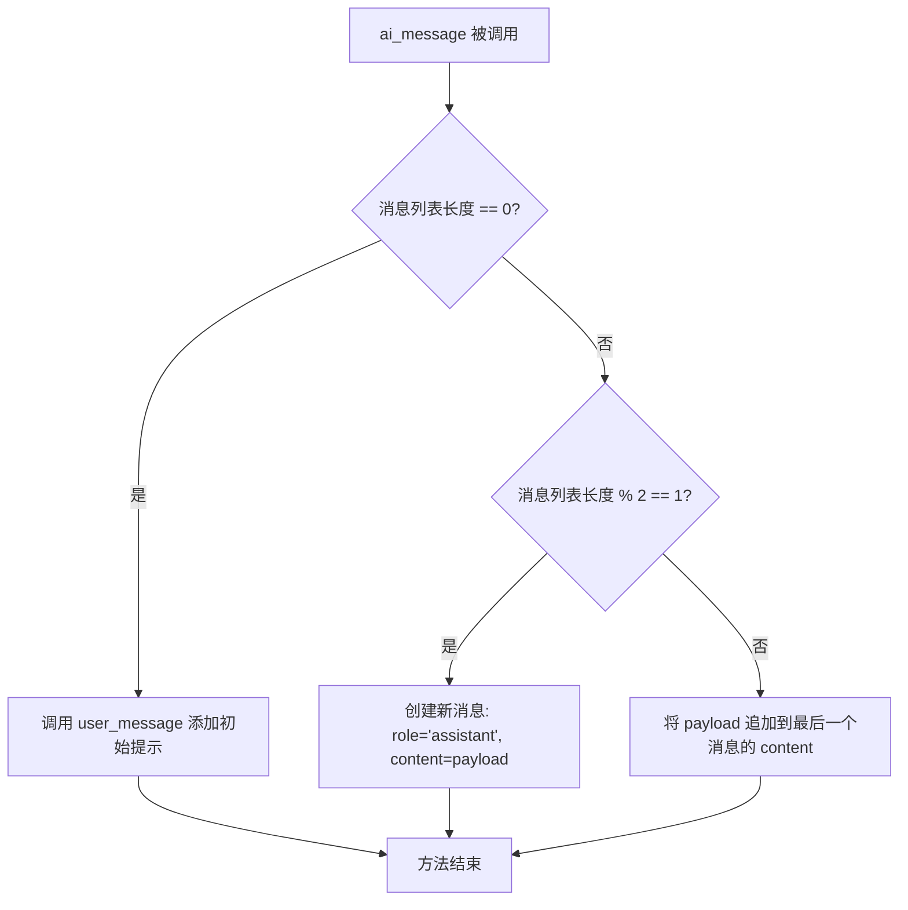
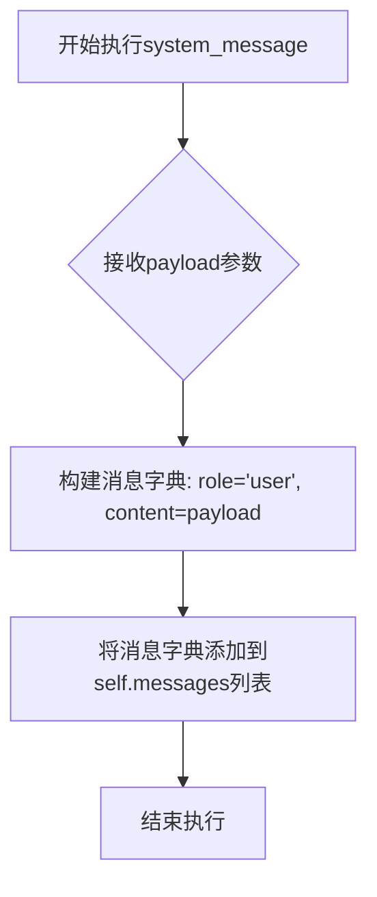
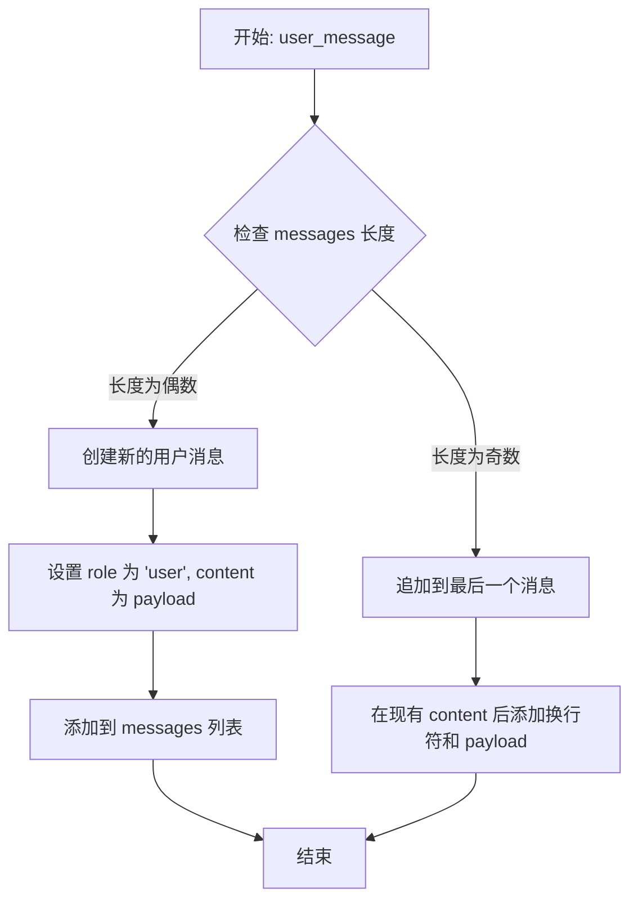
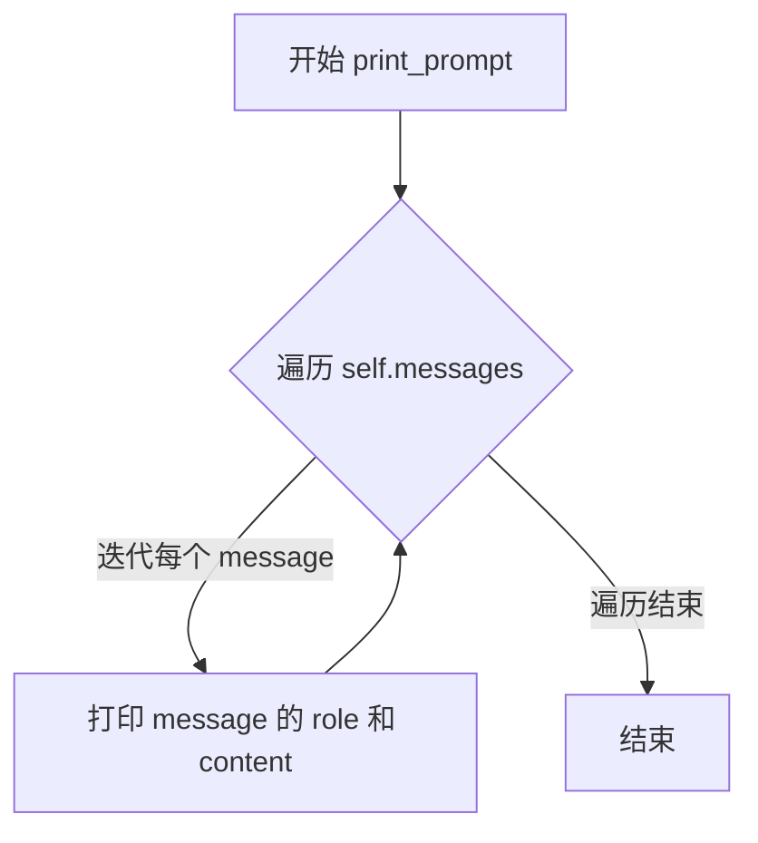

# `Chat-Haruhi-Suzumiya\ChatHaruhi2.0\ChatHaruhi\ErnieGPT.py` 详细设计文档

ErnieGPT 是一个基于百度 Ernie Bot API 的大语言模型封装类，继承自 BaseLLM 抽象基类，提供聊天补全功能，支持消息历史管理、角色扮演和上下文控制。

## 整体流程

```mermaid
graph TD
    A[开始] --> B[初始化 ErnieGPT 实例]
    B --> C{模型名称是否合法?}
    C -- 否 --> D[抛出 Exception]
    C -- 是 --> E[初始化空消息列表]
    E --> F[等待用户调用]
    F --> G[user_message / system_message / ai_message]
    G --> H[更新 messages 列表]
    H --> I[调用 get_response]
    I --> J[深拷贝消息列表]
    J --> K{ernie_trick 是否为 True?}
    K -- 是 --> L[插入提示词 '请请模仿上述经典桥段进行回复']
    K -- 否 --> M[直接使用原消息]
    L --> N[调用 erniebot.ChatCompletion.create]
    M --> N
    N --> O[返回 response['result']]
```

## 类结构

```
BaseLLM (抽象基类)
└── ErnieGPT (Ernie Bot 聊天模型实现)
```

## 全局变量及字段


### `erniebot`
    
百度文心一言的Python SDK模块，用于调用 Ernie Bot API

类型：`module`
    


### `os`
    
Python标准库模块，用于访问操作系统环境变量

类型：`module`
    


### `copy`
    
Python标准库模块，用于深拷贝对象

类型：`module`
    


### `ErnieGPT.model`
    
使用的 Ernie 模型名称

类型：`str`
    


### `ErnieGPT.messages`
    
聊天消息历史列表

类型：`list`
    


### `ErnieGPT.ernie_trick`
    
是否启用提示词技巧

类型：`bool`
    
    

## 全局函数及方法


### `ErnieGPT.__init__`

ErnieGPT类的初始化方法，负责设置模型类型、验证模型合法性、初始化消息列表和配置ernie_trick开关。

参数：

- `model`：`str`，可选，默认为"ernie-bot"，指定要使用的Ernie模型类型
- `ernie_trick`：`bool`，可选，默认为True，是否启用ernie trick优化选项

返回值：`None`，无返回值（构造函数）

#### 流程图

```mermaid
flowchart TD
    A[开始 __init__] --> B[调用父类BaseLLM的__init__]
    B --> C[设置self.model = model]
    D{检查model是否在允许列表中} -->|是| E[继续执行]
    D -->|否| F[抛出Exception: Unknown Ernie model]
    E --> G[初始化self.messages = []]
    G --> H[设置self.ernie_trick = ernie_trick]
    H --> I[结束]
```

#### 带注释源码

```python
def __init__(self,model="ernie-bot", ernie_trick = True ):
    # 调用父类BaseLLM的构造函数进行初始化
    super(ErnieGPT,self).__init__()
    
    # 将传入的model参数保存到实例属性
    self.model = model
    
    # 验证model是否在支持的模型列表中
    if model not in ["ernie-bot", "ernie-bot-turbo", "ernie-vilg-v2", "ernie-text-embedding", "ernie-bot-8k", "ernie-bot-4"]:
        # 如果模型不支持，抛出异常
        raise Exception("Unknown Ernie model")
    
    # 初始化消息列表，用于存储对话历史
    self.messages = []

    # 保存ernie_trick配置参数，用于控制是否使用ernie trick优化
    self.ernie_trick = ernie_trick
```


### `ErnieGPT.initialize_message`

该方法用于重置对话消息历史，将内部的消息列表清空，为开始新一轮对话做准备。

参数：
- 无（除隐式参数 `self`）

返回值：`None`，无返回值

#### 流程图

```mermaid
graph TD
    A[开始 initialize_message] --> B[执行 self.messages = []]
    B --> C[结束]
    
    style A fill:#e1f5fe,stroke:#01579b
    style B fill:#fff3e0,stroke:#e65100
    style C fill:#e8f5e9,stroke:#2e7d32
```

#### 带注释源码

```python
def initialize_message(self):
    """
    重置对话消息历史
    
    该方法清空当前实例中的消息列表（self.messages），
    使其恢复为初始的空列表状态。通常在开始新的对话会话时调用，
    以确保不受之前对话历史的干扰。
    
    参数:
        无（除隐式参数 self）
    
    返回值:
        None
    """
    self.messages = []  # 将消息列表重置为空列表
```

---

#### 关联信息补充

**所属类：**

- **类名**：`ErnieGPT`
- **父类**：`BaseLLM`
- **类功能**：百度文心一言（Ernie Bot）的 Python SDK 封装类，提供对话、角色扮演等能力

**类字段信息：**

| 字段名称 | 类型 | 描述 |
|---------|------|------|
| `model` | `str` | 使用的 Ernie 模型名称（如 "ernie-bot", "ernie-bot-turbo" 等） |
| `messages` | `list` | 存储对话消息的历史列表，每条消息为包含 role 和 content 的字典 |
| `ernie_trick` | `bool` | 是否启用特殊话术技巧（会在回复前插入诱导文本） |

**类方法概述：**

| 方法名 | 功能描述 |
|-------|---------|
| `initialize_message` | 重置消息历史为空列表 |
| `ai_message` | 添加 AI/助手角色消息 |
| `system_message` | 添加系统角色消息 |
| `user_message` | 添加用户角色消息 |
| `get_response` | 发送消息并获取 AI 回复 |
| `print_prompt` | 打印当前对话历史 |


### `ErnieGPT.ai_message`

该方法用于将AI助手的回复消息添加到对话历史中，根据当前消息列表的奇偶状态决定是追加到现有助手消息还是创建新的助手消息条目。

参数：

- `payload`：`str`，需要添加的AI助手回复内容

返回值：`None`，无返回值（直接修改实例的 `messages` 列表）

#### 流程图



#### 带注释源码

```python
def ai_message(self, payload):
    """
    添加AI助手的回复消息到对话历史中
    
    参数:
        payload (str): AI助手的回复内容
    返回:
        None: 无返回值，直接修改 self.messages 列表
    """
    # 情况1：如果消息列表为空，先添加一条用户初始消息
    if len(self.messages) == 0:
        self.user_message("请根据我的要求进行角色扮演:")
    
    # 情况2：如果消息列表长度为奇数，说明最后一条是用户消息
    # 需要创建新的助手消息条目
    elif len(self.messages) % 2 == 1:
        self.messages.append({"role":"assistant","content":payload})
    
    # 情况3：如果消息列表长度为偶数，说明最后一条已是助手消息
    # 将新回复追加到现有助手消息内容后面（支持多轮对话的连续回复）
    elif len(self.messages)% 2 == 0:
        self.messages[-1]["content"] += "\n"+ payload
```


### `ErnieGPT.system_message`

该方法用于向对话消息列表中添加系统消息，将传入的payload内容封装为用户角色消息并追加到messages列表中，是构建对话上下文的关键方法之一。

参数：

- `payload`：str，要添加的消息内容

返回值：`None`，无返回值（方法直接修改实例的messages属性）

#### 流程图



#### 带注释源码

```python
def system_message(self, payload):
    """
    向消息历史中添加系统消息（实际存储为user角色）
    
    参数:
        payload: str类型，要添加的消息内容
    返回:
        None
    """
    # 将payload封装为消息字典，role设为'user'并添加到消息列表
    # 注意：此处role应为'system'但实际代码中设为'user'，可能存在逻辑错误
    self.messages.append({"role":"user","content":payload}) 
```


### `ErnieGPT.user_message`

该方法用于向消息历史记录中添加用户消息。当消息列表为空或上一条消息不是用户消息时，创建一个新的用户消息条目；否则，将新内容追加到当前用户消息的末尾。

参数：

- `payload`：`str`，用户输入的消息内容

返回值：`None`，该方法不返回任何值，仅修改实例的 `messages` 属性

#### 流程图



#### 带注释源码

```python
def user_message(self, payload):
    """
    添加用户消息到消息历史记录中
    
    参数:
        payload: 用户输入的消息内容，字符串类型
    """
    # 判断当前消息列表长度是否为偶数
    if len(self.messages) % 2 == 0:
        # 如果是偶数（列表为空或上一条是assistant消息），创建新的用户消息
        self.messages.append({"role":"user","content":payload})
        # self.messages[-1]["content"] += 
    # 判断当前消息列表长度是否为奇数
    elif len(self.messages)% 2 == 1:
        # 如果是奇数（上一条是user消息），将新内容追加到最后的用户消息
        self.messages[-1]["content"] += "\n"+ payload
```


### `ErnieGPT.get_response`

该方法用于获取 Ernie GPT 模型的响应。它会深拷贝当前消息列表，根据 `ernie_trick` 配置在消息中注入特定提示词，然后调用 erniebot API 获取模型回复，并返回结果文本。

参数：

- 无（仅包含隐式参数 `self`）

返回值：`str`，返回 Ernie Bot API 响应中的结果文本内容

#### 流程图

```mermaid
flowchart TD
    A[开始 get_response] --> B[深拷贝消息列表: chat_messages = copy.deepcopy]
    B --> C{ernie_trick 是否启用?}
    C -->|是| D[在最后一条消息倒数第二行插入提示词: '请请模仿上述经典桥段进行回复']
    C -->|否| E[跳过提示词插入]
    D --> F[拼接消息内容: '\n'.join]
    E --> F
    F --> G[调用 erniebot.ChatCompletion.create]
    G --> H[获取响应结果: response['result']]
    H --> I[返回结果字符串]
```

#### 带注释源码

```python
def get_response(self):
    """
    获取 Ernie GPT 模型的响应
    该方法会深拷贝当前消息列表，根据 ernie_trick 配置
    在消息中插入特定提示词，然后调用 erniebot API 获取回复
    """
    # 深拷贝当前消息列表，避免修改原始消息
    chat_messages = copy.deepcopy(self.messages)

    # 获取最后一条消息的内容并按行分割
    lines = chat_messages[-1]["content"].split('\n')

    # 如果启用了 ernie_trick，在倒数第二行插入提示词
    # 目的是让模型模仿经典桥段进行回复
    if self.ernie_trick:
        lines.insert(-1, '请请模仿上述经典桥段进行回复\n')
    
    # 重新拼接消息内容
    chat_messages[-1]["content"] = '\n'.join(lines)

    # 调用 erniebot 的 ChatCompletion API 获取模型响应
    # 参数: model - 模型名称, messages - 消息列表
    response = erniebot.ChatCompletion.create(model=self.model, messages=chat_messages)
    
    # 返回响应结果中的文本内容
    return response["result"]
```


### `ErnieGPT.print_prompt`

该方法用于将当前对话消息列表中的所有消息打印到控制台，按角色（role）和内容（content）的格式输出，方便调试和查看对话历史。

参数：無

返回值：`None`，该方法没有返回值，仅执行打印操作

#### 流程图



#### 带注释源码

```python
def print_prompt(self):
    """
    打印当前对话消息列表中的所有消息
    用于调试和查看对话历史
    """
    # 遍历消息列表中的每一条消息
    for message in self.messages:
        # 打印格式为 "角色: 内容"
        # message 是一个字典，包含 'role' 和 'content' 两个键
        # role 可以是 'user'、'assistant' 或 'system'
        print(f"{message['role']}: {message['content']}")
```

## 关键组件


### ErnieGPT类

ErnieGPT类是一个继承自BaseLLM的ERNIE模型封装类，提供了对话功能的接口，支持多种ERNIE模型，通过erniebot库与ERNIE API进行交互，实现角色扮演和对话生成。

### 消息管理机制

消息管理机制负责维护对话历史，通过messages列表存储不同角色（user/assistant）的消息内容，支持消息的追加和修改，维护对话上下文的状态。

### ernie_trick机制

ernie_trick机制是一种提示工程技巧，在获取响应前自动在消息中插入"请请模仿上述经典桥段进行回复\n"，用于引导模型按照特定风格进行回复。

### 模型验证

模型验证组件检查传入的model参数是否在支持的模型列表中（ernie-bot、ernie-bot-turbo等），如果模型不支持则抛出异常。

### 响应获取

响应获取组件负责构建最终的聊天消息，调用erniebot.ChatCompletion.create方法与ERNIE API交互，并返回处理后的响应结果。

### print_prompt调试功能

print_prompt方法用于调试目的，打印当前消息历史中的所有消息内容及其角色，方便开发者查看和调试对话流程。

## 问题及建议


### 已知问题

- **环境变量缺乏验证**：直接使用 `os.environ["APIType"]` 和 `os.environ["ErnieAccess"]` 而未进行 KeyError 异常处理，可能导致程序启动时崩溃
- **模型列表硬编码**：支持的模型列表硬编码在 `__init__` 方法中，扩展困难，应提取为类常量或配置文件
- **ernie_trick 功能语义不明**：`'请请模仿上述经典桥段进行回复\n'` 这段代码含义模糊，可能是调试遗留代码，缺乏注释说明业务意图
- **异常处理不完善**：仅对模型名称进行校验，API 调用（`erniebot.ChatCompletion.create`）缺乏 try-except 包装，连接超时、认证失败等异常未捕获
- **消息处理逻辑冗余**：`ai_message` 和 `user_message` 方法中对消息列表长度的奇偶性判断逻辑复杂且容易出错
- **缺乏类型注解**：所有方法和字段均未使用 Python 类型提示，降低了代码可维护性和 IDE 支持
- **缺少日志记录**：无任何 logging 机制，难以追踪 API 调用和调试生产环境问题

### 优化建议

- 使用 `os.environ.get()` 并提供默认值或显式提示配置缺失
- 将模型列表定义为类常量 `SUPPORTED_MODELS`，便于扩展和维护
- 移除或重构 `ernie_trick` 逻辑，若为正式功能应添加清晰注释和配置项
- 对 API 调用添加异常捕获，处理网络错误、认证失败、限流等场景
- 简化消息构建逻辑，可考虑使用消息队列或上下文管理器模式
- 为关键方法添加类型注解，提升代码可读性和静态检查能力
- 引入标准 logging 模块，区分 DEBUG/INFO/WARNING/ERROR 级别日志

## 其它


### 设计目标与约束

设计目标：封装百度ERNIE Bot API，提供统一的LLM调用接口，支持多种ERNIE模型（ernie-bot、ernie-bot-turbo、ernie-vilg-v2等），实现聊天上下文管理，支持角色扮演场景。

设计约束：依赖erniebot第三方库，需从环境变量获取API配置，仅支持百度ERNIE系列模型。

### 错误处理与异常设计

在`__init__`方法中对不支持的模型抛出`Exception`异常，错误信息为"Unknown Ernie model"；在`get_response`方法中，erniebot.ChatCompletion.create调用可能抛出网络异常或API错误，当前未做捕获处理，建议添加try-except块处理API调用异常。

### 数据流与状态机

数据流：用户通过user_message/ai_message/system_message方法添加消息 -> 消息存储在self.messages列表中 -> get_response方法复制消息列表并可能注入ernie_trick提示 -> 调用erniebot API获取响应 -> 返回响应文本。

状态机：消息列表遵循交替规则（user -> assistant -> user -> assistant...），初始为空，通过initialize_message重置。

### 外部依赖与接口契约

外部依赖：erniebot库（百度ERNIE Bot Python SDK），os模块（读取环境变量），copy模块（深拷贝消息），BaseLLM基类。

接口契约：继承BaseLLM类，需实现父类要求的接口方法；get_response方法返回API响应中的result字段字符串。

### 性能考虑与优化空间

性能考虑：copy.deepcopy用于避免修改原始消息列表，chat_messages[-1]直接操作最后一条消息。

优化空间：1）消息列表无长度限制，可能导致内存占用增加，建议添加最大历史消息数限制；2）ernie_trick每次都在倒数第二行插入提示，可考虑做成可配置选项；3）未实现流式响应（streaming），大文本响应会有延迟；4）消息去重或压缩机制缺失。

### 关键配置参数

model参数：默认值为"ernie-bot"，支持6种ERNIE模型切换。

ernie_trick参数：默认为True，注入"请请模仿上述经典桥段进行回复\n"提示，用于角色扮演场景。

### 安全性分析

敏感信息：API凭证（ErnieAccess、APIType）从环境变量读取，未硬编码，安全性较好。

输入校验：model参数有校验，非支持模型会抛异常；但payload内容无校验，可能存在注入风险。


    