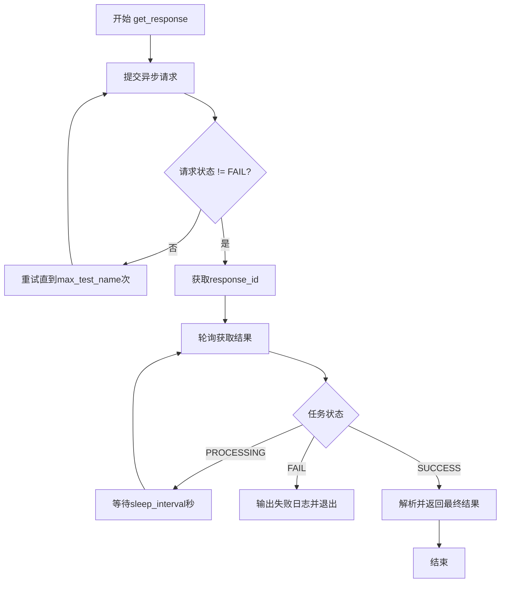
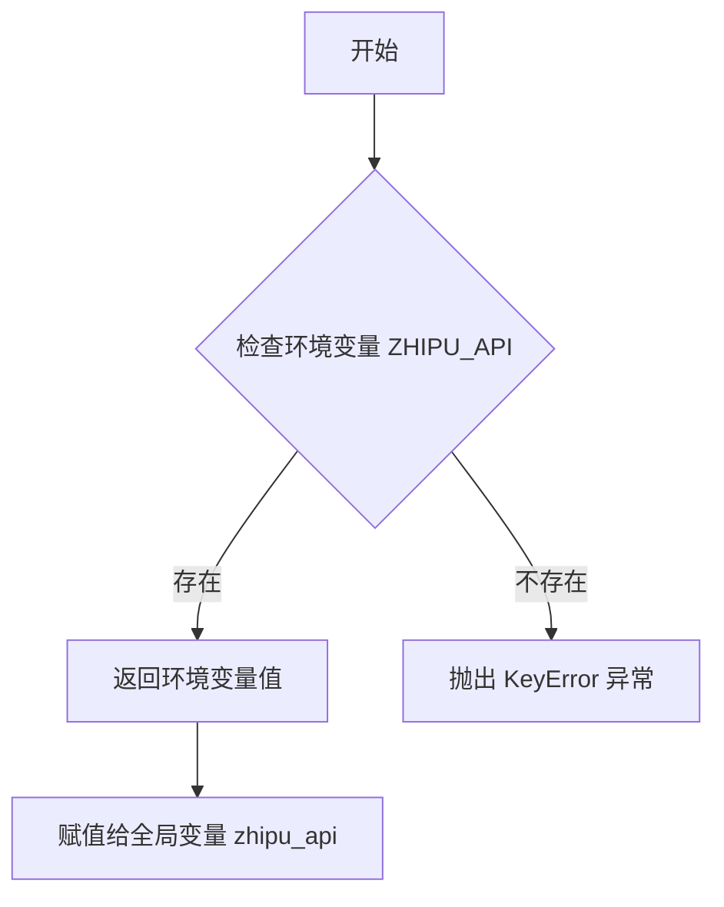
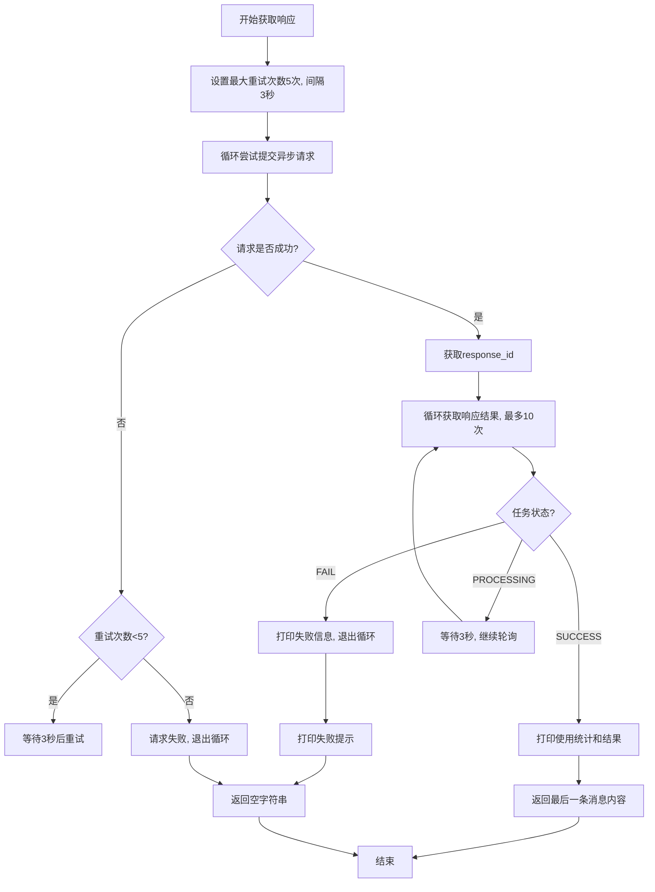
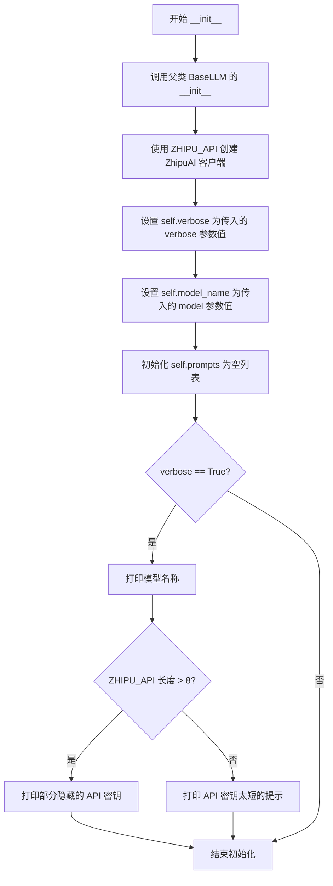
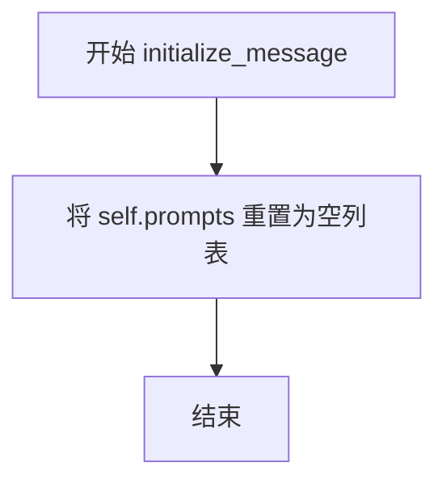
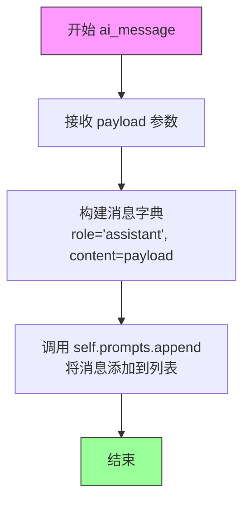
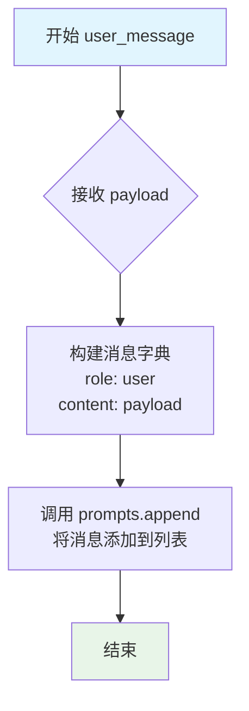

# `Chat-Haruhi-Suzumiya\ChatHaruhi2.0\ChatHaruhi\GLMAPI.py` 详细设计文档

这是一个集成智谱AI（ZhipuAI）大语言模型API的客户端类，继承自BaseLLM基类，提供异步请求提交、响应轮询、消息管理和多轮对话功能，支持verbose模式输出调试信息。

## 整体流程



## 类结构

```
BaseLLM (抽象基类)
└── GLMAPI (智谱AI大语言模型客户端实现)
```

## 全局变量及字段


### `zhipu_api`
    
智谱AI API密钥，从环境变量ZHIPU_API读取

类型：`str`
    


### `FAIL`
    
任务失败状态常量

类型：`str`
    


### `SUCCESS`
    
任务成功状态常量

类型：`str`
    


### `PROCESSING`
    
任务处理中状态常量

类型：`str`
    


### `GLMAPI.client`
    
智谱AI客户端实例

类型：`ZhipuAI`
    


### `GLMAPI.verbose`
    
是否输出详细调试信息

类型：`bool`
    


### `GLMAPI.model_name`
    
使用的模型名称

类型：`str`
    


### `GLMAPI.prompts`
    
消息历史列表

类型：`list`
    
    

## 全局函数及方法


### `zhipu_api` 全局变量初始化

这是一个模块级别的全局变量，用于从环境变量中读取 ZHIPU API 密钥。

参数： 无（直接读取环境变量）

返回值： `str`，返回环境变量 `ZHIPU_API` 的值，如果未设置则抛出 `KeyError` 异常

#### 流程图



#### 带注释源码

```python
# 尝试从操作系统环境变量中读取名为 'ZHIPU_API' 的变量
# 如果该环境变量未设置，Python 将抛出 KeyError 异常
# 返回值类型为 str，表示 API 密钥字符串
zhipu_api = os.environ['ZHIPU_API']
```

---

### 补充说明

| 项目 | 描述 |
|------|------|
| **变量名称** | `zhipu_api` |
| **变量类型** | `str` |
| **读取位置** | 模块顶层（第3行） |
| **错误处理** | 如果环境变量 `ZHIPU_API` 未设置，程序启动时将抛出 `KeyError` 异常 |
| **使用场景** | 作为 `GLMAPI` 类初始化时创建 `ZhipuAI` 客户端的 API 密钥 |
| **潜在问题** | 1. 缺少环境变量未设置的错误处理<br>2. API 密钥直接暴露在代码环境中<br>3. 没有默认值或备用方案 |


### GLMAPI

这是智谱AI（ZhipuAI）官方SDK的GLM模型客户端类，继承自BaseLLM，用于与智谱AI的GLM大语言模型进行异步交互。该类支持提交异步请求、轮询获取响应、管理对话上下文（系统消息、用户消息、AI消息）等功能。

#### 全局变量和全局函数

- `zhipu_api`：从环境变量`ZHIPU_API`获取的智谱AI API密钥，字符串类型
- `FAIL`：任务失败状态常量，字符串类型，值为"FAIL"
- `SUCCESS`：任务成功状态常量，字符串类型，值为"SUCCESS"
- `PROCESSING`：任务处理中状态常量，字符串类型，值为"PROCESSING"

#### 类字段

- `client`：ZhipuAI类型，智谱AI客户端实例，用于调用API
- `verbose`：bool类型，控制是否打印详细信息
- `model_name`：str类型，要使用的GLM模型名称
- `prompts`：list类型，存储对话消息的列表

#### 类方法

---

### GLMAPI.__init__

类的构造函数，初始化智谱AI客户端实例。

参数：

- `model`：str类型，可选参数，默认为"glm-3-turbo"，指定要使用的GLM模型名称
- `verbose`：bool类型，可选参数，默认为False，控制是否打印详细日志信息

返回值：`None`，无返回值

#### 带注释源码

```python
def __init__(self, model="glm-3-turbo", verbose=False):
    # 调用父类BaseLLM的构造函数进行初始化
    super(GLMAPI, self).__init__()

    # 创建智谱AI客户端实例，使用环境变量中的API密钥
    self.client = ZhipuAI(api_key=zhipu_api)

    # 设置是否打印详细日志的标志
    self.verbose = verbose

    # 设置模型名称，默认为glm-3-turbo
    self.model_name = model

    # 初始化消息列表，用于存储对话上下文
    self.prompts = []

    # 如果verbose为True，打印初始化信息
    if self.verbose == True:
        print('model name, ', self.model_name)
        # 出于安全考虑，只打印API密钥的前4位和后4位
        if len(zhipu_api) > 8:
            print('found apikey ', zhipu_api[:4], '****', zhipu_api[-4:])
        else:
            print('found apikey but too short, ')
```

---

### GLMAPI.initialize_message

清空消息列表，重置对话上下文。

参数：无

返回值：`None`，无返回值

#### 带注释源码

```python
def initialize_message(self):
    # 将prompts列表重置为空列表，清除之前的对话历史
    self.prompts = []
```

---

### GLMAPI.system_message

添加系统消息到对话上下文中。

参数：

- `payload`：str类型，系统消息内容

返回值：`None`，无返回值

#### 带注释源码

```python
def system_message(self, payload):
    # 将系统消息以role为"assistant"添加到prompts列表
    # 注意：此处代码存在逻辑错误，通常system消息的role应为"system"
    self.prompts.append({"role": "assistant", "content": payload})
```

---

### GLMAPI.user_message

添加用户消息到对话上下文中。

参数：

- `payload`：str类型，用户消息内容

返回值：`None`，无返回值

#### 带注释源码

```python
def user_message(self, payload):
    # 将用户消息以role为"user"添加到prompts列表
    self.prompts.append({"role": "user", "content": payload})
```

---

### GLMAPI.ai_message

添加AI消息到对话上下文中。

参数：

- `payload`：str类型，AI生成的消息内容

返回值：`None`，无返回值

#### 带注释源码

```python
def ai_message(self, payload):
    # 将AI消息以role为"assistant"添加到prompts列表
    # 注意：此方法与system_message方法实现完全相同，可能存在设计问题
    self.prompts.append({"role": "assistant", "content": payload})
```

---

### GLMAPI.get_response

提交异步请求并获取模型响应，是核心业务方法。

参数：无

返回值：`str`，返回模型生成的内容，如果失败则返回空字符串

#### 流程图



#### 带注释源码

```python
def get_response(self):
    # 最大重试次数为5次
    max_test_name = 5
    # 每次重试间隔为3秒
    sleep_interval = 3

    # 初始化response_id为None
    response_id = None

    # 尝试提交异步请求，最多重试5次
    for test_time in range(max_test_name):
        # 调用智谱AI的异步创建接口提交请求
        response = self.client.chat.asyncCompletions.create(
            model=self.model_name,  # 填写需要调用的模型名称
            messages=self.prompts,  # 传递对话消息列表
        )
        
        # 检查任务状态是否不是失败状态
        if response.task_status != FAIL:
            # 获取任务ID用于后续获取结果
            response_id = response.id

            # 如果verbose为True，打印提交成功信息
            if self.verbose:
                print("model name : ", response.model)
                print('submit request, id = ', response_id)
            # 成功提交，跳出循环
            break
        else:
            # 提交失败，打印重试提示
            print('submit GLM request failed, retrying...')
            # 等待指定间隔后重试
            time.sleep(sleep_interval)

    # 如果成功获取到response_id，开始轮询获取结果
    if response_id:
        # 最多轮询2*max_test_name次（即10次）
        for test_time in range(2 * max_test_name):
            # 根据response_id获取异步任务结果
            result = self.client.chat.asyncCompletions.retrieve_completion_result(id=response_id)

            # 如果任务状态为失败
            if result.task_status == FAIL:
                if self.verbose:
                    print('response id : ', response_id, "task is fail")
                # 跳出轮询循环
                break

            # 如果任务仍在处理中
            if result.task_status == PROCESSING:
                if self.verbose:
                    print('response id : ', response_id, "task is processing")
                # 等待后继续轮询
                time.sleep(sleep_interval)
                continue

            # 任务成功完成
            if self.verbose:
                # 打印token使用统计
                print(
                    f"prompt tokens:{result.usage.prompt_tokens} completion tokens:{result.usage.completion_tokens}")
                # 打印选项内容
                print(f"choices:{result.choices}")
                # 打印完整结果
                print(f"result:{result}")

            # 返回最后一条消息的内容
            return result.choices[-1].message.content

    # 如果提交请求失败，打印错误提示
    print('submit GLM request failed, please check your api key and model name')
    # 返回空字符串表示失败
    return ''
```

---

### GLMAPI.print_prompt

打印当前对话上下文中的所有消息，用于调试。

参数：无

返回值：`None`，无返回值

#### 带注释源码

```python
def print_prompt(self):
    # 遍历prompts列表中的每条消息
    for message in self.prompts:
        # 打印消息的角色和内容，格式为"role: content"
        print(f"{message['role']}: {message['content']}")
```


### `GLMAPI.__init__`

初始化 GLMAPI 类的实例，配置 ZhipuAI 客户端连接、设置模型名称、初始化提示列表，并根据 verbose 标志决定是否输出初始化详细信息。

参数：

- `model`：`str`，指定要使用的 GLM 模型名称，默认为 "glm-3-turbo"
- `verbose`：`bool`，控制是否输出详细日志信息，默认为 False

返回值：`None`，无返回值描述

#### 流程图



#### 带注释源码

```python
def __init__(self, model="glm-3-turbo", verbose=False):
    """
    初始化 GLMAPI 实例
    
    参数:
        model: str, 使用的GLM模型名称，默认为 "glm-3-turbo"
        verbose: bool, 是否打印详细日志，默认为 False
    
    返回:
        None
    """
    # 调用父类 BaseLLM 的初始化方法
    super(GLMAPI, self).__init__()

    # 使用环境变量中的 ZHIPU_API 创建 ZhipuAI 客户端实例
    self.client = ZhipuAI(api_key=zhipu_api)

    # 设置详细输出标志
    self.verbose = verbose

    # 设置模型名称
    self.model_name = model

    # 初始化提示列表，用于存储对话消息
    self.prompts = []

    # 如果 verbose 为 True，打印初始化信息
    if self.verbose == True:
        # 打印当前使用的模型名称
        print('model name, ', self.model_name)
        # 检查 API 密钥长度，如果足够长则部分隐藏显示
        if len(zhipu_api) > 8:
            print('found apikey ', zhipu_api[:4], '****', zhipu_api[-4:])
        else:
            print('found apikey but too short, ')
```


### `GLMAPI.initialize_message`

该函数用于初始化或重置对话提示列表（prompts），将内部的 prompts 属性重置为空列表，以便开始新的对话会话。

参数：
- （无参数）

返回值：`None`，无返回值，仅执行状态重置操作

#### 流程图



#### 带注释源码

```python
def initialize_message(self):
    """
    初始化/重置对话提示列表。
    将 self.prompts 重置为空列表 []，用于开始新的对话会话。
    该方法通常在开始新的对话轮次时调用，以清除之前的对话历史。
    """
    self.prompts = []  # 将 prompts 列表重置为空列表
```


### `GLMAPI.ai_message`

该方法用于将助手（AI）的消息添加到对话历史记录中，通过将消息角色设置为"assistant"并将消息内容追加到prompts列表中，以支持多轮对话上下文的管理。

参数：

- `payload`：`str`，需要发送给模型的助手消息内容

返回值：`None`，该方法直接修改实例的prompts属性，不返回任何值

#### 流程图



#### 带注释源码

```python
def ai_message(self, payload):
    """
    将助手（AI）消息添加到对话历史中
    
    该方法用于记录AI的回复内容，以便在后续请求中保持对话上下文。
    消息会被添加到self.prompts列表中，role字段标记为"assistant"。
    
    参数:
        payload (str): 助手生成的消息内容
        
    返回:
        None: 直接修改实例状态，不返回值
    """
    self.prompts.append({"role": "assistant", "content": payload})
```

---

## 补充信息

### 1. 核心功能描述

GLMAPI类封装了智谱AI（ZhipuAI）的GPT模型调用能力，支持同步和异步两种交互方式，提供多轮对话管理、异步请求提交和结果轮询获取等功能。

### 2. 文件运行流程

```
初始化GLMAPI实例
    ↓
添加系统消息 (system_message)
    ↓
添加用户消息 (user_message)
    ↓
添加助手消息 (ai_message) ← 当前方法
    ↓
调用 get_response()
    ↓
  ├─ 提交异步请求 (asyncCompletions.create)
  ├─ 轮询获取结果 (asyncCompletions.retrieve_completion_result)
  └─ 返回最终回复内容
```

### 3. 类详细信息

| 字段/方法 | 类型 | 描述 |
|-----------|------|------|
| `client` | ZhipuAI | 智谱AI客户端实例 |
| `verbose` | bool | 是否输出详细日志 |
| `model_name` | str | 使用的模型名称 |
| `prompts` | list | 对话历史消息列表 |
| `__init__` | method | 初始化方法 |
| `initialize_message` | method | 清空对话历史 |
| `ai_message` | method | 添加助手消息 |
| `system_message` | method | 添加系统消息 |
| `user_message` | method | 添加用户消息 |
| `get_response` | method | 获取模型响应 |
| `print_prompt` | method | 打印对话历史 |

### 4. 全局变量

| 名称 | 类型 | 描述 |
|------|------|------|
| `zhipu_api` | str | 从环境变量读取的智谱API密钥 |
| `FAIL` | str | 任务失败状态标识 |
| `SUCCESS` | str | 任务成功状态标识 |
| `PROCESSING` | str | 任务处理中状态标识 |

### 5. 潜在技术债务与优化空间

- **API密钥管理**：从环境变量直接读取，若未设置会导致KeyError异常
- **异常处理不足**：get_response方法中缺少try-except捕获ZhipuAI异常
- **轮询效率低**：使用固定sleep间隔，可考虑指数退避或WebSocket
- **返回值冗余**：失败时返回空字符串而非抛出异常或返回None
- **类型注解缺失**：所有方法都缺少类型提示（Type Hints）
- **verbose泄露风险**：打印API密钥前后4位可能存在安全隐患

### 6. 其它设计要点

- **设计目标**：封装智谱AI的异步调用流程，简化多轮对话实现
- **约束**：依赖ZhipuAI SDK和ZHIPU_API环境变量
- **错误处理**：通过状态码判断任务结果，失败时重试
- **外部依赖**：zhipuai包（需pip install）


### `GLMAPI.system_message`

该方法用于向对话上下文添加系统消息，将消息内容作为用户角色添加到 prompts 列表中，用于配置 AI 助手的系统级指令或上下文信息。

参数：

- `payload`：string，需要添加的系统消息内容

返回值：`None`，无返回值（该方法直接修改内部 prompts 列表）

#### 流程图

```mermaid
flowchart TD
    A[开始 system_message] --> B{检查 payload}
    B -->|payload 有效| C[创建消息字典]
    C --> D[设置 role 为 "user"]
    E[将 payload 设置为 content]
    D --> E
    E --> F[追加到 self.prompts 列表]
    F --> G[结束]
    B -->|payload 无效| G
```

#### 带注释源码

```python
def system_message(self, payload):
    """
    添加系统消息到对话上下文
    
    参数:
        payload: 系统消息内容，会被作为用户角色添加
    """
    # 将消息添加到 prompts 列表中
    # 注意：虽然名为 system_message，但实际角色设置为 "user"
    # 这是 GLM API 的特定要求，系统消息需要以用户角色发送
    self.prompts.append({"role": "user", "content": payload})
```


### `GLMAPI.user_message`

该方法用于将用户消息添加到对话上下文队列中，通过设置角色为"user"将用户输入的载荷内容存储到 prompts 列表内，以便后续发送给 GLM 大语言模型进行推理。

参数：

- `payload`：str，要发送的用户消息内容

返回值：`None`，该方法直接修改实例的 prompts 列表，不返回任何值

#### 流程图



#### 带注释源码

```python
def user_message(self, payload):
    """
    添加用户消息到对话提示列表中
    
    参数:
        payload: str类型，要作为用户消息发送的内容
    """
    # 将用户消息以字典形式添加到self.prompts列表
    # 字典包含role字段设置为"user"，以及content字段存储实际消息内容
    self.prompts.append({"role": "user", "content": payload})
```


### `GLMAPI.get_response`

该方法实现与智谱AI的异步聊天交互，提交异步请求后持续轮询获取响应结果，直至任务完成或达到最大重试次数后返回最终内容，若失败则返回空字符串。

参数：

- `self`：GLMAPI 实例本身

返回值：`str`，返回模型生成的回复内容，失败时返回空字符串

#### 流程图

```mermaid
flowchart TD
    A[开始 get_response] --> B[初始化 max_test_name=5, sleep_interval=3]
    B --> C[初始化 response_id=None]
    C --> D{尝试次数 < max_test_name?}
    D -->|是| E[调用 client.chat.asyncCompletions.create]
    E --> F{返回状态 != FAIL?}
    F -->|是| G[获取 response_id]
    F -->|否| H[打印失败信息, 等待 sleep_interval 秒]
    H --> D
    G --> I{response_id 存在?}
    I -->|否| J[打印失败提示, 返回空字符串]
    I -->|是| K[循环尝试获取结果, 最多 2*max_test_name 次]
    K --> L[调用 client.chat.asyncCompletions.retrieve_completion_result]
    L --> M{状态 == FAIL?}
    M -->|是| N[打印失败信息, 跳出循环]
    M -->|否| O{状态 == PROCESSING?}
    O -->|是| P[打印处理中信息, 等待 sleep_interval 秒]
    P --> K
    O -->|否| Q[打印完整结果, 返回 choices[-1].message.content]
    Q --> R[结束]
    N --> R
    J --> R
```

#### 带注释源码

```
def get_response(self):
    """
    提交异步聊天请求并轮询获取结果
    """
    # 最大提交重试次数
    max_test_name = 5
    # 每次重试间隔（秒）
    sleep_interval = 3

    # 存储异步任务的响应ID
    response_id = None

    # 循环尝试提交异步请求，直到成功或达到最大重试次数
    for test_time in range(max_test_name):
        # 调用智谱AI异步接口创建任务
        response = self.client.chat.asyncCompletions.create(
            model=self.model_name,  # 使用的模型名称
            messages=self.prompts,   # 对话上下文消息列表
        )
        
        # 检查任务是否提交成功（非FAIL状态表示成功）
        if response.task_status != FAIL:
            # 获取异步任务ID用于后续查询结果
            response_id = response.id

            if self.verbose:
                print("model name : ", response.model)
                print('submit request, id = ', response_id)
            break  # 提交成功，跳出循环
        else:
            # 提交失败，打印日志并等待后重试
            print('submit GLM request failed, retrying...')
            time.sleep(sleep_interval)

    # 如果成功获取到异步任务ID，则轮询获取结果
    if response_id:
        # 最多轮询 2*max_test_name 次（提交重试次数的两倍）
        for test_time in range(2 * max_test_name):
            # 根据任务ID查询异步任务结果
            result = self.client.chat.asyncCompletions.retrieve_completion_result(id=response_id)

            # 任务执行失败
            if result.task_status == FAIL:
                if self.verbose:
                    print('response id : ', response_id, "task is fail")
                break

            # 任务处理中，继续轮询
            if result.task_status == PROCESSING:
                if self.verbose:
                    print('response id : ', response_id, "task is processing")
                time.sleep(sleep_interval)
                continue

            # 任务成功完成，打印详细使用信息
            if self.verbose:
                print(
                    f"prompt tokens:{result.usage.prompt_tokens} completion tokens:{result.usage.completion_tokens}")
                print(f"choices:{result.choices}")
                print(f"result:{result}")

            # 返回最后一个选项的消息内容
            return result.choices[-1].message.content

    # 所有重试均失败，打印错误提示并返回空字符串
    print('submit GLM request failed, please check your api key and model name')
    return ''
```


### `GLMAPI.print_prompt`

该方法用于将当前存储在 `self.prompts` 列表中的所有消息记录打印到控制台，便于调试和查看对话历史。

参数：

- 无（仅包含隐式参数 `self`）

返回值：`None`，无返回值

#### 流程图

```mermaid
flowchart TD
    A[开始 print_prompt] --> B{遍历 self.prompts}
    B -->|有更多消息| C[获取当前消息 message]
    C --> D[打印 message['role']: message['content']]
    D --> B
    B -->|遍历完成| E[结束]
```

#### 带注释源码

```python
def print_prompt(self):
    """
    打印当前累积的所有提示消息
    用于调试和查看对话历史
    """
    # 遍历存储在self.prompts中的所有消息
    for message in self.prompts:
        # 格式化打印每条消息的角色和内容
        # message结构: {"role": "assistant/user/system", "content": "..."}
        print(f"{message['role']}: {message['content']}")
```

## 关键组件


### 环境变量配置与API密钥管理
通过`os.environ['ZHIPU_API']`从环境变量读取智谱AI的API密钥，实现敏感信息的外部化配置，避免硬编码带来的安全隐患。

### GLMAPI类（核心组件）
GLMAPI类是整个模块的核心，继承自BaseLLM抽象基类，负责与智谱AI的GLM大模型进行异步交互。该类封装了完整的请求-响应流程，包括消息构建、异步提交、结果轮询等关键逻辑。

### 客户端初始化组件
在`__init__`方法中创建ZhipuAI客户端实例`self.client`，该客户端负责与智谱AI服务的底层通信。客户端使用环境变量中的API密钥进行认证，并支持可配置的模型选择（默认为glm-3-turbo）和调试模式。

### 消息管理组件
包含四个消息处理方法：`initialize_message`用于重置对话历史；`ai_message`用于添加助手角色消息；`system_message`用于添加系统角色消息；`user_message`用于添加用户角色消息。这些方法共同构成了对话上下文的构建机制。

### 异步请求提交组件
位于`get_response`方法中，通过`client.chat.asyncCompletions.create`提交异步请求。实现了失败重试机制（最多5次），每次失败后等待3秒再重试，确保请求的可靠性。

### 响应轮询组件
位于`get_response`方法中，通过`client.chat.asyncCompletions.retrieve_completion_result`轮询异步任务结果。最多轮询10次（2*max_test_name），能够正确处理FAIL、PROCESSING和SUCCESS三种任务状态，并在任务完成时提取最终的对话内容。

### 状态常量定义组件
定义了三个关键状态常量：FAIL表示任务失败、PROCESSING表示任务处理中、SUCCESS（虽然代码中未显式使用但已定义）表示任务成功。这些常量用于异步任务的状态判断。

### Verbose调试组件
通过`self.verbose`属性控制详细输出模式，当启用时会打印模型名称、API密钥掩码（只显示前4位和后4位）、请求ID、任务状态、token使用量、选项列表和完整响应结果，便于开发和调试。


## 问题及建议


### 已知问题

- **环境变量加载时机不当**：`zhipu_api = os.environ['ZHIPU_API']` 在模块导入时执行，若环境变量未设置会导致程序启动失败，缺乏友好的错误提示
- **消息角色定义错误**：`system_message` 方法将系统消息的角色设置为 "user"，与 `user_message` 方法角色相同，这会导致GLM API无法正确区分系统指令和用户输入
- **异常处理缺失**：代码中没有任何 try-except 块，API调用失败时程序可能直接崩溃，缺乏健壮性
- **API Key 安全风险**：虽然对 API Key 进行了部分掩码打印，但在代码中直接使用完整的环境变量值，若日志输出或错误堆栈被记录，存在敏感信息泄露风险
- **魔法数字和硬编码**：重试次数 `max_test_name = 5`、轮询次数 `2 * max_test_name`、休眠间隔 `sleep_interval = 3` 等都是硬编码数值，缺乏可配置性
- **参数命名不规范**：`max_test_name` 实际表示重试次数，命名与语义不符，容易造成误解
- **返回值不一致**：`get_response` 在失败时返回空字符串 `''`，调用方无法区分是真正的空响应还是请求失败
- **类型注解缺失**：所有方法都缺少参数和返回值的类型注解，降低了代码可读性和 IDE 辅助能力
- **状态管理副作用**：`prompts` 列表直接挂载为实例属性并在多处修改，缺乏线程安全性，多线程环境下可能出现竞态条件

### 优化建议

- 将环境变量读取移至类初始化方法中，并添加异常处理和默认值机制
- 修正 `system_message` 方法的角色为 "system"，确保与 API 规范一致
- 在关键 API 调用处添加 try-except 捕获网络异常、API 错误等，并定义自定义异常类
- 考虑使用 `secrets` 模块或日志脱敏机制处理敏感信息打印
- 将重试次数、超时时间等配置提取为类属性或初始化参数，提供默认值
- 重命名 `max_test_name` 为 `max_retries` 或 `max_retry_count`
- 失败时抛出自定义异常或返回 None，并在文档中明确说明错误处理机制
- 为所有方法添加类型注解，使用 Python typing 模块
- 考虑使用线程锁或提供线程安全版本的方法实现

## 其它


### 设计目标与约束

**设计目标**：提供统一的接口封装智谱AI的GLM模型调用能力，支持同步和异步两种交互模式，简化大语言模型的集成工作。

**约束条件**：
- 依赖Python标准库os和第三方库zhipuai
- 需通过环境变量ZHIPU_API提供API密钥
- 模型名称默认为glm-3-turbo，支持自定义配置
- 仅支持异步调用模式，通过轮询获取结果

### 错误处理与异常设计

**异常处理机制**：
- API密钥缺失时直接抛出KeyError异常
- 网络请求失败时触发重试机制，最多重试5次
- 任务执行失败（task_status="FAIL"）时打印错误信息并返回空字符串
- 模型响应超时或任务持续处理中时持续轮询

**错误码定义**：
- FAIL = "FAIL"：表示请求失败或任务执行失败
- SUCCESS = "SUCCESS"：表示任务成功完成
- PROCESSING = "PROCESSING"：表示任务处理中

**异常捕获策略**：
- 未显式捕获ZhipuAI库抛出的异常
- 网络超时和API错误未做专门处理
- 返回空字符串作为失败时的默认响应

### 数据流与状态机

**数据流转过程**：
1. 用户通过user_message()、system_message()、ai_message()添加消息到self.prompts列表
2. 调用get_response()触发API调用流程
3. 提交异步请求，获取response_id
4. 轮询检查任务状态（PROCESSING/FAIL/SUCCESS）
5. 任务成功后提取choices[-1].message.content返回

**状态机描述**：
- 初始态：prompts为空列表
- 消息构建态：用户添加各类消息角色
- 请求提交态：调用asyncCompletions.create提交请求
- 轮询等待态：循环检查task_status
- 完成态：返回结果或空字符串

### 外部依赖与接口契约

**外部依赖**：
- zhipuai：智谱AI官方Python SDK
- os：用于读取环境变量
- time：用于实现轮询间隔
- BaseLLM：抽象基类，定义LLM接口规范

**接口契约**：
- get_response()：无参数，返回字符串类型的模型响应
- 消息方法（user_message/system_message/ai_message）：接收payload字符串参数
- initialize_message()：无参数，重置prompts列表

### 配置管理

**配置项**：
- 环境变量ZHIPU_API：必需，智谱AI API密钥
- model参数：默认值为"glm-3-turbo"
- verbose参数：默认值为False，控制调试信息输出

**硬编码配置**：
- max_test_name = 5：最大重试次数
- sleep_interval = 3：轮询间隔秒数

### 并发与异步处理

**异步处理模式**：
- 采用"提交-轮询"两阶段异步模式
- 先提交异步任务获取task_id
- 再通过轮询检查任务状态获取结果

**同步/异步权衡**：
- 未使用真正的异步IO（asyncio）
- 使用同步轮询机制，可能导致调用线程阻塞
- 轮询间隔固定，无法根据任务复杂度动态调整

### 安全性考虑

**敏感信息处理**：
- API密钥通过环境变量传入，避免硬编码
- verbose模式打印API密钥时仅显示首尾各4位
- 未对prompts内容进行脱敏处理

**安全建议**：
- 建议增加API密钥验证机制
- 建议增加请求频率限制
- 建议对返回结果进行内容安全审核

### 性能考量

**性能特征**：
- 同步阻塞模式，响应时间取决于API处理速度
- 轮询机制可能产生不必要的API调用
- prompts列表无大小限制，可能导致内存占用增加

**优化建议**：
- 可考虑使用WebSocket或Server-Sent Events获取实时进度
- 可增加超时时间和最大轮询次数的配置
- 可对长对话进行摘要或截断处理

### 资源管理

**资源占用**：
- ZhipuAI客户端单例创建
- prompts列表随对话进行线性增长
- 未实现资源释放接口

**资源清理**：
- 依赖Python垃圾回收机制
- initialize_message()可手动清空prompts

### 测试策略

**测试覆盖建议**：
- 单元测试：验证消息构建逻辑
- 集成测试：验证API调用和响应解析
- Mock测试：模拟API响应进行功能验证

**测试用例建议**：
- 测试不同角色消息的添加
- 测试空prompts情况下的响应
- 测试API失败时的重试逻辑

### 部署与运维

**部署要求**：
- Python 3.7+
- 需要安装zhipuai库
- 需要配置ZHIPU_API环境变量

**运维监控**：
- verbose模式可作为临时调试手段
- 建议增加结构化日志输出
- 建议增加调用成功率和响应时间指标

### 版本兼容性

**依赖版本**：
- zhipuai库版本未指定
- Python版本兼容性需验证

**API稳定性**：
- 依赖智谱AI REST API，可能随服务商更新而变化
- asyncCompletions接口需确认可用性

### 错误码与错误消息约定

**统一错误码**：
- FAIL、SUCCESS、PROCESSING三个状态常量

**错误消息输出**：
- 提交失败："submit GLM request failed, retrying..."
- 最终失败："submit GLM request failed, please check your api key and model name"

**日志级别**：
- 使用print输出信息，未使用标准日志模块
- verbose控制详细输出，默认为静默模式

### 重试策略与超时控制

**重试策略**：
- 提交阶段：最多重试5次（max_test_name），间隔3秒
- 获取结果阶段：最多轮询10次（2 * max_test_name），间隔3秒

**超时控制**：
- 无显式超时设置
- 理论最大等待时间：5次×3秒 + 10次×3秒 = 45秒

**改进建议**：
- 增加指数退避重试策略
- 增加最大超时时间配置
- 增加重试次数的动态调整

### 请求限流与配额管理

**当前限制**：
- 无内置限流机制
- 完全依赖智谱AI API的配额限制

**配额管理**：
- API密钥关联账户的调用配额
- 无本地配额计数和告警机制

**改进建议**：
- 增加本地调用计数器
- 增加配额不足的预警机制
- 实现令牌桶限流算法


    