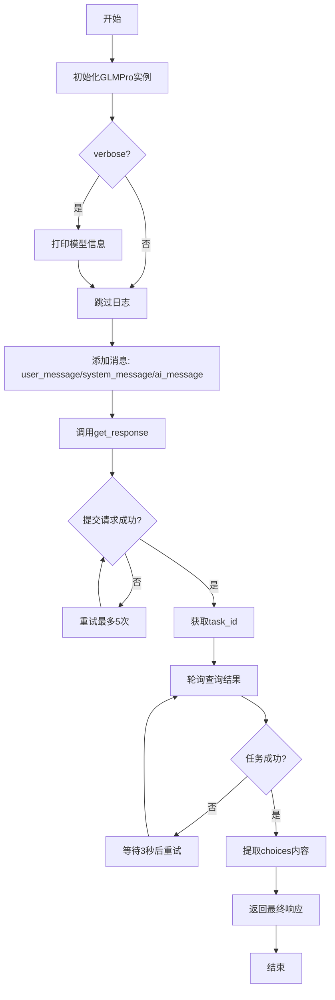
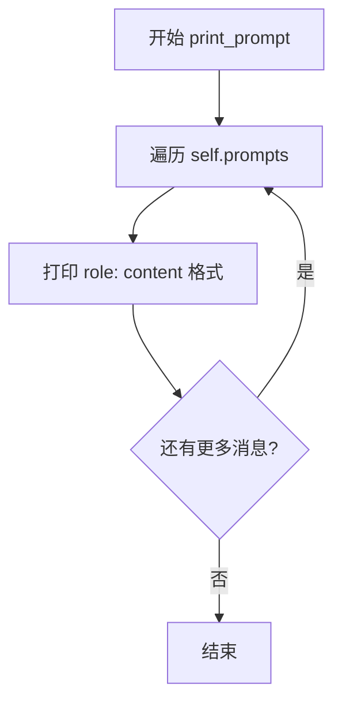
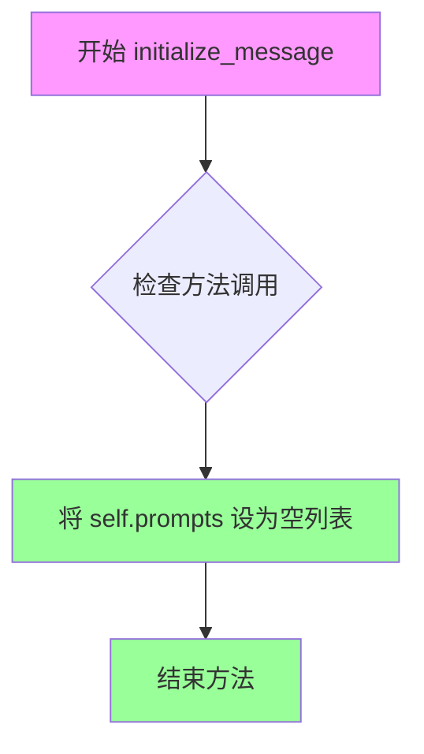
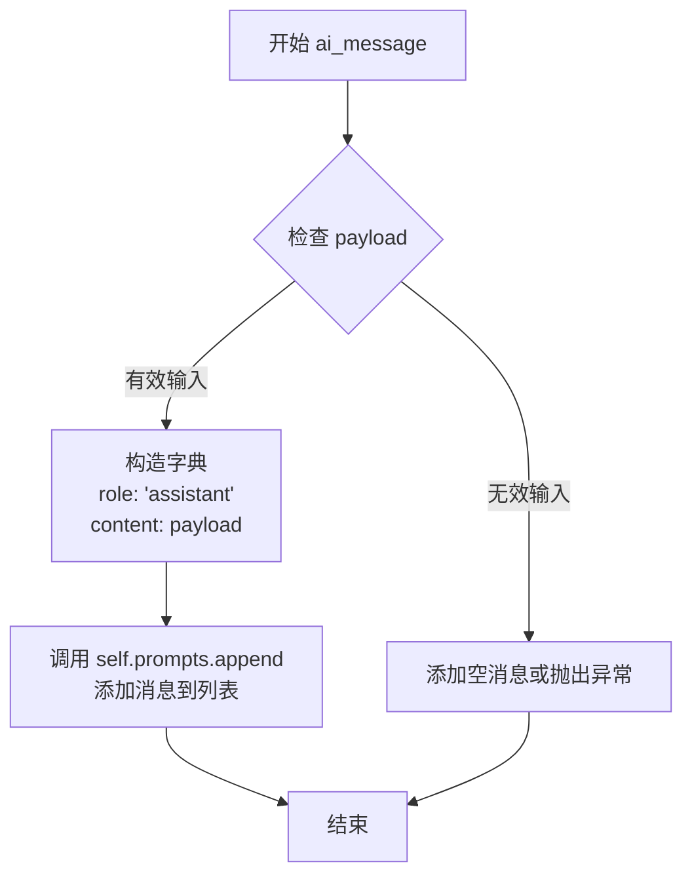
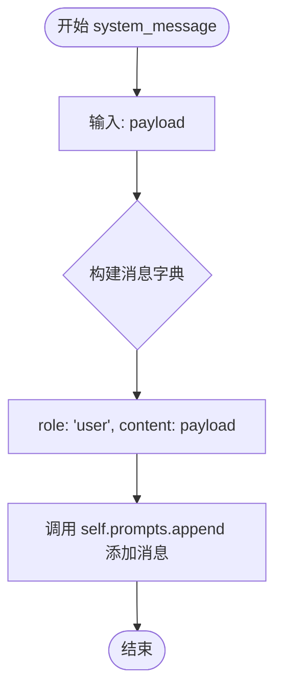
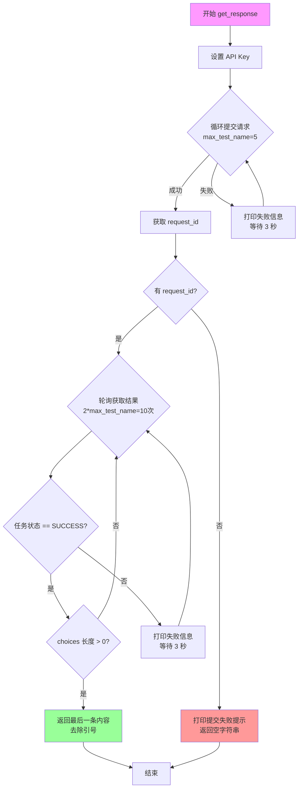
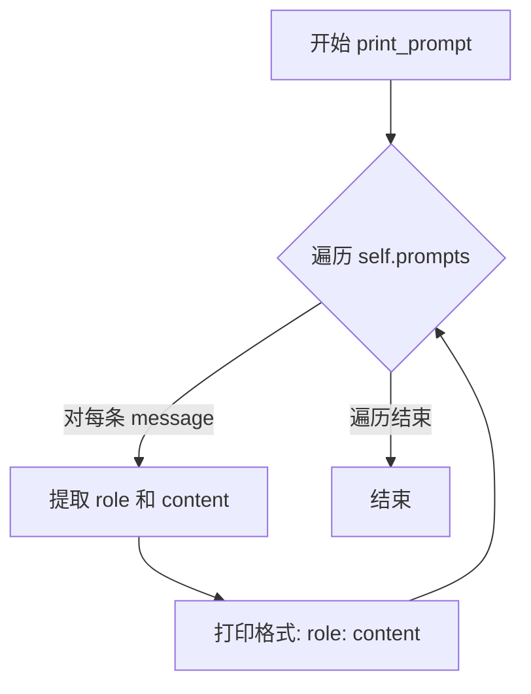

# `Chat-Haruhi-Suzumiya\ChatHaruhi2.0\ChatHaruhi\GLMPro.py` 详细设计文档

这是一个智谱AI（ZhipuAI）GLM Pro大语言模型的Python封装类，继承自BaseLLM基类，提供了完整的对话接口功能，包括消息管理、异步请求提交和结果轮询获取，支持通过环境变量配置API密钥，并具备重试机制和详细日志输出能力。

## 整体流程



## 类结构

```
BaseLLM (抽象基类)
└── GLMPro (智谱AI GLM Pro模型封装类)
```

## 全局变量及字段


### `zhipu_api`
    
从环境变量读取的智谱AI API密钥

类型：`str`
    


### `GLMPro.verbose`
    
控制是否打印详细日志

类型：`bool`
    


### `GLMPro.model_name`
    
模型名称，默认为chatglm_pro

类型：`str`
    


### `GLMPro.prompts`
    
存储对话消息的列表

类型：`list`
    
    

## 全局函数及方法


### GLMPro

GLMPro 是一个基于 ZhipuAI 大语言模型 API 的调用封装类，继承自 BaseLLM 抽象基类，通过异步调用方式提交 prompts 并轮询获取模型响应，支持对话上下文管理。

#### 参数

- `model`：`str`，可选，默认值为 `"chatglm_pro"`，指定要调用的 ZhipuAI 模型名称
- `verbose`：`bool`，可选，默认值为 `False`，是否输出详细的调试信息

#### 返回值

无返回值

#### 流程图

```mermaid
graph TD
    A[开始 __init__] --> B[调用父类 BaseLLM 构造函数]
    B --> C[设置 zhipuai.api_key]
    C --> D[设置 self.verbose]
    D --> E[设置 self.model_name]
    E --> F[初始化 self.prompts = []]
    F --> G{verbose == True?}
    G -->|是| H[打印模型名称]
    H --> I{len(zhipu_api) > 8?}
    I -->|是| J[打印 API Key 首尾各4位]
    I -->|否| K[打印 API Key 长度不足]
    G -->|否| L[结束]
    J --> L
    K --> L
```

#### 带注释源码

```python
def __init__(self, model="chatglm_pro", verbose=False):
    """初始化 GLMPro 实例
    
    参数:
        model: str, 调用的模型名称, 默认为 "chatglm_pro"
        verbose: bool, 是否输出详细信息, 默认为 False
    """
    # 调用父类 BaseLLM 的构造函数进行基类初始化
    super(GLMPro, self).__init__()
    
    # 设置 ZhipuAI API 密钥（从环境变量获取）
    zhipuai.api_key = zhipu_api
    
    # 保存 verbose 标志，用于控制调试信息输出
    self.verbose = verbose
    
    # 保存模型名称
    self.model_name = model
    
    # 初始化空的消息列表，用于存储对话上下文
    self.prompts = []
    
    # 如果 verbose 为 True，输出初始化信息
    if self.verbose == True:
        print('model name, ', self.model_name)
        # 检查 API Key 长度，安全地打印首尾各4位
        if len(zhipu_api) > 8:
            print('found apikey ', zhipu_api[:4], '****', zhipu_api[-4:])
        else:
            print('found apikey but too short, ')
```

---

### GLMPro.initialize_message

清空对话上下文消息列表，重置 prompts 为空列表。

#### 参数

无

#### 返回值

无返回值

#### 流程图

```mermaid
graph TD
    A[开始 initialize_message] --> B[self.prompts = []]
    B --> C[结束]
```

#### 带注释源码

```python
def initialize_message(self):
    """清空消息列表，重置对话上下文
    
    将 self.prompts 重置为空列表，用于开始新的对话会话
    """
    self.prompts = []
```

---

### GLMPro.ai_message

向对话上下文添加一条助手（AI）角色的消息。

#### 参数

- `payload`：`str`，助手角色的消息内容

#### 返回值

无返回值

#### 流程图

```mermaid
graph TD
    A[开始 ai_message] --> B[创建字典 {'role': 'assistant', 'content': payload}]
    B --> C[self.prompts.append 添加消息]
    C --> D[结束]
```

#### 带注释源码

```python
def ai_message(self, payload):
    """添加助手角色消息到对话上下文
    
    参数:
        payload: str, 助手回复的内容
    """
    # 将助手消息追加到 prompts 列表
    self.prompts.append({"role": "assistant", "content": payload})
```

---

### GLMPro.system_message

向对话上下文添加一条系统角色的消息。

#### 参数

- `payload`：`str`，系统角色的消息内容

#### 返回值

无返回值

#### 流程图

```mermaid
graph TD
    A[开始 system_message] --> B[创建字典 {'role': 'user', 'content': payload}]
    B --> C[self.prompts.append 添加消息]
    C --> D[结束]
```

#### 带注释源码

```python
def system_message(self, payload):
    """添加系统角色消息到对话上下文
    
    参数:
        payload: str, 系统提示词内容
    """
    # 注意：这里 role 设为 "user"，可能是一个设计问题
    # 通常 system message 应该 role 为 "system"
    self.prompts.append({"role": "user", "content": payload})
```

---

### GLMPro.user_message

向对话上下文添加一条用户角色的消息。

#### 参数

- `payload`：`str`，用户角色的消息内容

#### 返回值

无返回值

#### 流程图

```mermaid
graph TD
    A[开始 user_message] --> B[创建字典 {'role': 'user', 'content': payload}]
    B --> C[self.prompts.append 添加消息]
    C --> D[结束]
```

#### 带注释源码

```python
def user_message(self, payload):
    """添加用户角色消息到对话上下文
    
    参数:
        payload: str, 用户输入的内容
    """
    # 将用户消息追加到 prompts 列表
    self.prompts.append({"role": "user", "content": payload})
```

---

### GLMPro.get_response

核心方法，异步调用 ZhipuAI 模型 API 并轮询获取响应。提交异步请求后，会持续轮询检查任务状态，直到获取到成功响应或达到最大重试次数。

#### 参数

无

#### 返回值

- `str`，模型生成的响应内容，如果失败返回空字符串

#### 流程图

```mermaid
graph TD
    A[开始 get_response] --> B[重置 zhipuai.api_key]
    B --> C[设置 max_test_name=5, sleep_interval=3]
    C --> D[初始化 request_id = None]
    D --> E[循环 test_time in range max_test_name]
    E --> F[调用 async_invoke 提交异步请求]
    F --> G{response['success'] == True?}
    G -->|是| H[获取 task_id, request_id = task_id]
    H --> I{verbose == True?}
    I -->|是| J[打印 request_id]
    I -->|否| K[跳出提交循环]
    G -->|否| L[打印失败信息]
    L --> M[等待 sleep_interval 秒]
    M --> E
    K --> N{request_id 存在?}
    N -->|否| O[打印提交失败信息, return '']
    N -->|是| P[循环 test_time in range 2*max_test_name]
    P --> Q[调用 query_async_invoke_result]
    Q --> R{code==200 and task_status=='SUCCESS'?}
    R -->|是| S{verbose == True?}
    S -->|是| T[打印成功信息]
    S -->|否| U[检查 choices 长度]
    R -->|否| V{verbose == True?}
    V -->|是| W[打印失败信息]
    V --> X[等待 sleep_interval 秒]
    W --> X
    X --> P
    U --> X{len(choices) > 0?}
    U -->|是| Y[return choices[-1]['content'].strip]
    U -->|否| X
    Y --> Z[结束]
    T --> U
    O --> Z
```

#### 带注释源码

```python
def get_response(self):
    """获取模型响应
    
    异步提交请求并轮询获取结果:
    1. 最多尝试5次提交异步请求
    2. 成功后最多轮询10次查询结果
    3. 返回模型生成的内容，失败返回空字符串
    
    返回:
        str: 模型生成的响应内容，失败返回空字符串
    """
    # 重新设置 API 密钥（可能需要确保使用最新值）
    zhipuai.api_key = zhipu_api
    
    # 最大提交尝试次数
    max_test_name = 5
    # 重试间隔时间（秒）
    sleep_interval = 3
    
    # 初始化请求ID为 None
    request_id = None
    
    # 尝试提交异步请求，最多尝试 max_test_name 次
    for test_time in range(max_test_name):
        # 调用 ZhipuAI 异步推理接口
        response = zhipuai.model_api.async_invoke(
            model=self.model_name,  # 模型名称
            prompt=self.prompts,    # 对话上下文
            temperature=0)          # 温度参数设为0，更确定性的输出
        
        # 检查提交是否成功
        if response['success'] == True:
            # 获取任务ID
            request_id = response['data']['task_id']
            
            # 如果 verbose 模式，打印请求ID
            if self.verbose == True:
                print('submit request, id = ', request_id)
            # 成功提交，跳出循环
            break
        else:
            # 提交失败，打印信息并等待后重试
            print('submit GLM request failed, retrying...')
            time.sleep(sleep_interval)
    
    # 如果成功获取 request_id，开始轮询获取结果
    if request_id:
        # 最多轮询 2 * max_test_name 次
        for test_time in range(2 * max_test_name):
            # 查询异步任务结果
            result = zhipuai.model_api.query_async_invoke_result(request_id)
            
            # 检查任务是否成功完成
            if result['code'] == 200 and result['data']['task_status'] == 'SUCCESS':
                # 成功获取响应
                if self.verbose == True:
                    print('get GLM response success')
                
                # 获取模型生成的选择列表
                choices = result['data']['choices']
                
                # 如果有生成内容，返回最后一条（最新）
                if len(choices) > 0:
                    # 去除内容首尾的引号
                    return choices[-1]['content'].strip("\"'")
            
            # 如果任务未完成或失败
            if self.verbose == True:
                print('get GLM response failed, retrying...')
            
            # 等待后继续轮询
            time.sleep(sleep_interval)
    else:
        # 提交请求失败，打印错误信息并返回空字符串
        print('submit GLM request failed, please check your api key and model name')
        return ''
```

---

### GLMPro.print_prompt

打印当前对话上下文中的所有消息，用于调试和查看对话历史。

#### 参数

无

#### 返回值

无返回值

#### 流程图



#### 带注释源码

```python
def print_prompt(self):
    """打印当前的对话上下文
    
    遍历 self.prompts 列表，以 'role: content' 格式打印每条消息
    用于调试，查看当前积累的对话历史
    """
    # 遍历所有消息
    for message in self.prompts:
        # 格式化打印，输出角色: 内容
        print(f"{message['role']}: {message['content']}")
```


### `GLMPro.__init__`

该方法是GLMPro类的构造函数，用于初始化GLMPro实例。它调用父类构造函数、设置ZhipuAI API密钥、配置模型参数，并可选地输出初始化信息。

参数：

- `model`：`str`，模型名称，默认为"chatglm_pro"
- `verbose`：`bool`，是否打印详细日志信息，默认为False

返回值：`None`，该方法不返回值

#### 流程图

```mermaid
flowchart TD
    A[开始 __init__] --> B[调用父类 BaseLLM.__init__]
    B --> C[设置 zhipuai.api_key = zhipu_api]
    C --> D[保存 verbose 到 self.verbose]
    D --> E[保存 model 到 self.model_name]
    E --> F[初始化 self.prompts = []]
    F --> G{verbose == True?}
    G -->|Yes| H[打印 model name]
    H --> I{len(zhipu_api) > 8?}
    I -->|Yes| J[打印 API key 前4位和后4位]
    I -->|No| K[打印 'found apikey but too short']
    J --> L[结束]
    K --> L
    G -->|No| L
    
    style A fill:#e1f5fe
    style L fill:#e8f5e8
```

#### 带注释源码

```python
def __init__(self, model="chatglm_pro", verbose = False ):
    """
    初始化 GLMPro 实例
    
    参数:
        model: str, 模型名称，默认为 "chatglm_pro"
        verbose: bool, 是否打印详细日志，默认为 False
    
    返回:
        None
    """
    # 调用父类 BaseLLM 的初始化方法
    super(GLMPro,self).__init__()

    # 设置 ZhipuAI 的 API 密钥（从环境变量获取）
    zhipuai.api_key = zhipu_api

    # 保存 verbose 参数到实例变量
    self.verbose = verbose

    # 保存模型名称到实例变量
    self.model_name = model

    # 初始化 prompts 列表，用于存储对话历史
    self.prompts = []

    # 如果 verbose 为 True，打印初始化信息
    if self.verbose == True:
        # 打印模型名称
        print('model name, ', self.model_name )
        # 检查 API 密钥长度是否足够（安全考虑，只显示前后各4位）
        if len( zhipu_api ) > 8:
            print( 'found apikey ', zhipu_api[:4], '****', zhipu_api[-4:] )
        else:
            print( 'found apikey but too short, ' )
```


### `GLMPro.initialize_message`

清空消息列表，将内部存储的对话历史重置为空，以准备开始新的对话会话。

参数：
- 无

返回值：`None`，无返回值，仅执行状态修改操作。

#### 流程图



#### 带注释源码

```python
def initialize_message(self):
    """
    清空消息列表，重置对话历史
    
    该方法将 self.prompts 列表重置为空列表 [],
    用于开始新的对话会话或清除之前的对话上下文。
    在调用大型语言模型生成响应之前,
    通常需要调用此方法以确保不携带之前的对话历史。
    
    参数:
        无
    
    返回值:
        None
    """
    self.prompts = []  # 将提示列表重置为空列表，清除所有历史消息
```


### `GLMPro.ai_message`

向对话提示列表中添加一条助手角色的消息，用于构建与GLM大模型的对话上下文。

参数：

- `payload`：`str`，要添加的助手消息内容

返回值：`None`，该方法没有返回值，仅修改实例的 `prompts` 列表

#### 流程图



#### 带注释源码

```python
def ai_message(self, payload):
    """
    添加助手角色消息到对话历史中
    
    参数:
        payload: str，助手角色的回复内容
    """
    # 使用字典存储消息，包含role和content两个字段
    # role固定为"assistant"表示这是AI助手的回复
    # content存储实际的对话内容
    self.prompts.append({"role":"assistant","content":payload})
```


### `GLMPro.system_message`

该方法用于向对话历史（`self.prompts`）中添加一条系统消息。然而，当前实现中角色被硬编码为 `"user"`，这与通常的 `system` 角色定义不符，且与 `user_message` 方法功能重复，看起来像是代码编写时的逻辑错误或技术债务。

参数：
-  `payload`：字符串 (str)，需要添加的系统消息内容。

返回值：`None`，该方法无返回值，直接修改实例的 `self.prompts` 列表属性。

#### 流程图



#### 带注释源码

```python
def system_message(self, payload):
    """
    添加系统角色消息到对话历史中。
    注意：当前实现将角色设为 'user'，通常应为 'system'。
    """
    # 构造消息字典并添加到 prompts 列表
    # 缺陷：role 应该是 'system' 而不是 'user'
    self.prompts.append({"role": "user", "content": payload})
```


### `GLMPro.user_message(payload)`

该方法用于向对话上下文添加用户角色的消息。它接收一个消息内容作为参数，并将其附加到实例的 `prompts` 列表中，标记为 "user" 角色。

参数：

- `payload`：`任意类型`（通常为 `str`），用户要发送的消息内容

返回值：`None`，该方法不返回任何值，直接修改实例的 `prompts` 列表

#### 流程图

```mermaid
flowchart TD
    A[开始 user_message] --> B[接收 payload 参数]
    B --> C{检查 payload 是否有效}
    C -->|是| D[创建消息字典<br/>{"role": "user", "content": payload}]
    D --> E[将消息字典追加到 self.prompts 列表]
    E --> F[结束]
    C -->|否| F
```

#### 带注释源码

```python
def user_message(self, payload):
    """
    添加用户角色消息到对话上下文中
    
    参数:
        payload: 用户要发送的消息内容，通常为字符串类型
    
    返回值:
        None (无返回值)
    
    说明:
        该方法将一条带有 "user" 角色的消息添加到 self.prompts 列表中
        prompts 列表用于存储完整的对话历史，包含系统、用户和助手的消息
    """
    
    # 将用户消息添加到 prompts 列表
    # 消息格式为字典，包含 role 和 content 两个字段
    # role 固定为 "user"，content 为传入的 payload 参数
    self.prompts.append({"role":"user","content":payload})
```


### `GLMPro.get_response`

该方法用于提交异步请求到智谱AI的GLM模型，并轮询获取模型生成的响应内容。它首先尝试多次提交请求直到成功获取任务ID，然后循环查询任务状态直至成功或超时，最后返回模型生成的内容。

参数： 无

返回值：`str`，模型生成的响应内容，如果提交请求失败则返回空字符串。

#### 流程图



#### 带注释源码

```python
def get_response(self):
    """
    提交请求到智谱AI GLM模型并获取响应
    """
    # 重新设置 API Key，确保使用最新的环境变量值
    zhipuai.api_key = zhipu_api
    
    # 最大尝试提交次数
    max_test_name = 5
    # 每次尝试之间的睡眠间隔（秒）
    sleep_interval = 3

    # 用于存储任务ID
    request_id = None

    # ========== 第一阶段：提交异步请求 ==========
    # 尝试提交异步请求，最多尝试 max_test_name 次
    for test_time in range(max_test_name):
        # 调用智谱AI的异步推理接口
        response = zhipuai.model_api.async_invoke(
            model=self.model_name,       # 模型名称
            prompt=self.prompts,         # 对话上下文（消息列表）
            temperature=0                # 温度参数设为0，减少随机性
        )
        
        # 检查提交是否成功
        if response['success'] == True:
            # 从响应中提取任务ID
            request_id = response['data']['task_id']
            
            # 如果 verbose 模式开启，打印请求ID
            if self.verbose == True:
                print('submit request, id = ', request_id)
            # 成功获取任务ID，退出循环
            break
        else:
            # 提交失败，打印日志并等待后重试
            print('submit GLM request failed, retrying...')
            time.sleep(sleep_interval)

    # ========== 第二阶段：轮询获取结果 ==========
    # 如果成功获取了 request_id，则轮询查询结果
    if request_id:
        # 最多轮询 2 * max_test_name 次（约10次）
        for test_time in range(2 * max_test_name):
            # 查询异步任务的执行结果
            result = zhipuai.model_api.query_async_invoke_result(request_id)
            
            # 检查是否成功返回且任务完成
            if result['code'] == 200 and result['data']['task_status'] == 'SUCCESS':
                
                # 如果 verbose 模式开启，打印成功信息
                if self.verbose == True:
                    print('get GLM response success')
                
                # 获取模型生成的choices列表
                choices = result['data']['choices']
                
                # 如果有生成内容，返回最后一条（最新）内容
                if len(choices) > 0:
                    # 去除内容首尾的引号（双引号或单引号）
                    return choices[-1]['content'].strip("\"'")
            
            # 如果任务还未完成或失败
            if self.verbose == True:
                print('get GLM response failed, retrying...')
            
            # 睡眠1秒后继续轮询
            time.sleep(sleep_interval)
    else:
        # 提交请求失败（未能获取 request_id）
        print('submit GLM request failed, please check your api key and model name')
        # 返回空字符串表示无有效响应
        return ''
```


### `GLMPro.print_prompt()`

该方法用于遍历并打印 `GLMPro` 类中存储的所有消息内容，包括系统消息、用户消息和 AI 助手消息，方便开发者在调试或日志记录时查看完整的对话上下文。

参数：
- 该方法无显式参数（除隐含的 `self` 参数）

返回值：`None`，无返回值，仅执行打印操作

#### 流程图



#### 带注释源码

```python
def print_prompt(self):
    """
    打印存储在 self.prompts 中的所有消息内容
    用于调试或查看当前对话历史
    """
    # 遍历 prompts 列表中的每一条消息
    for message in self.prompts:
        # 打印每条消息的角色（role）和内容（content）
        # 格式: "role: content"
        print(f"{message['role']}: {message['content']}")
```

## 关键组件


### GLMPro 类

GLMPro 是一个继承自 BaseLLM 的语言模型客户端类，用于与智谱AI的 GLM 大语言模型进行异步交互，支持对话历史管理、异步请求提交和结果轮询获取。

### 消息管理组件

消息管理组件负责构建和维护对话提示列表，包括系统消息、用户消息和AI助手机息的添加与重置功能。

### 异步请求与轮询组件

异步请求与轮询组件负责将对话提示提交给智谱AI模型API，并持续轮询直到获取到成功的响应结果，包含重试机制和错误处理。

### Verbose 输出组件

Verbose 输出组件提供详细的执行日志，记录模型名称、API密钥（部分隐藏）、请求提交状态和响应获取状态，便于调试和问题追踪。

### 环境配置组件

环境配置组件从环境变量中读取智谱AI的API密钥，并将其设置为全局配置供SDK使用。


## 问题及建议


### 已知问题

-   **环境变量在模块级别读取**：在导入时即读取`zhipu_api`环境变量，若环境变量未设置会导致程序无法启动，缺乏错误处理
-   **API密钥重复赋值**：`zhipuai.api_key = zhipu_api`在`__init__`和`get_response`方法中重复设置，未提取为公共方法
-   **system_message方法role设置错误**：将role设置为"user"而非"system"，与系统消息语义不符
-   **硬编码的重试参数**：max_test_name=5和sleep_interval=3为硬编码值，缺乏灵活配置
-   **缺少异常处理**：整个`get_response`方法未使用try-except捕获可能的网络异常、API调用异常等
-   **变量命名不规范**：max_test_name、sleep_interval等命名不符合Python命名惯例（应使用snake_case）
-   **返回值处理不严谨**：当choices为空时返回None而非明确错误，且主流程无明确返回路径
-   **缺少类型注解**：所有方法均无类型提示，影响代码可维护性和IDE支持
-   **布尔比较方式不当**：使用`self.verbose == True`而非`if self.verbose:`
-   **print输出未统一**：混用print输出调试信息，无统一日志机制

### 优化建议

-   将环境变量读取移至方法内部或添加默认值/异常处理，使用`os.environ.get('ZHIPU_API')`并提供友好错误提示
-   提取API密钥设置到私有方法`_ensure_api_key()`，避免重复代码
-   修正`system_message`方法的role为"system"
-   将重试次数和间隔时间改为构造参数或配置属性，支持外部注入
-   在网络请求和API调用处添加try-except包装，处理ZhipuAI可能的异常
-   规范变量命名为`max_retry_count`、`sleep_interval`等
-   完善返回值处理，choices为空时抛出明确异常或返回空字符串，并在方法末尾添加明确的return语句
-   为所有方法添加类型注解（参数类型和返回值类型）
-   改用`if self.verbose:`进行布尔判断
-   考虑引入Python标准日志模块logging替代print输出，实现统一的日志管理

## 其它


### 设计目标与约束

本代码旨在封装智谱AI的GLM Pro大语言模型调用接口，提供统一的对话交互能力。设计约束包括：仅支持异步调用模式（先提交请求再轮询获取结果），不支持流式输出，要求调用方提供有效的ZHIPU_API环境变量。

### 错误处理与异常设计

代码采用重试机制处理临时性故障：提交请求阶段最多重试5次（max_test_name=5），获取结果阶段最多重试10次（2 * max_test_name），每次重试间隔3秒。对于API返回失败或超时，仅打印错误信息后继续重试，最终失败时返回空字符串而非抛出异常。代码未对response字典的键值进行空值检查，存在KeyError风险。

### 数据流与状态机

对话数据通过self.prompts列表存储，遵循OpenAI消息格式（role/content对）。状态流转为：initialize_message()清空历史 → user_message()/system_message()/ai_message()追加消息 → get_response()提交请求并轮询获取结果。消息顺序即为对话上下文。

### 外部依赖与接口契约

依赖zhipuai库（model_api.async_invoke和query_async_invoke_result两个异步接口）和BaseLLM基类。外部调用方需保证ZHIPU_API环境变量已设置，model参数默认为"chatglm_pro"。返回值为字符串，失败时返回空字符串。

### 配置信息

关键配置项包括：model_name（模型名称，默认chatglm_pro）、temperature（温度参数，固定为0）、max_test_name（最大重试次数，5）、sleep_interval（重试间隔，3秒）。API密钥从环境变量zhipu_api读取。

### 安全性考虑

代码在verbose模式下仅打印API密钥的前4位和后4位，中间用****掩码，保护敏感信息。但环境变量zhipu_api在导入时即被读取，若未设置会导致KeyError。

### 性能考量

采用同步轮询方式获取异步任务结果，最坏情况下需等待约30秒（5次提交重试×3秒 + 10次查询重试×3秒）。未实现超时自动放弃机制，可能导致调用线程长时间阻塞。

### 日志与监控

提供verbose参数控制详细输出，包括模型名称、API密钥掩码、请求ID、提交/获取结果的成功失败状态。普通模式下仅输出重试提示信息。

### 使用示例

```python
llm = GLMPro(verbose=True)
llm.system_message("你是一个有帮助的助手")
llm.user_message("今天天气怎么样？")
response = llm.get_response()
print(response)
llm.initialize_message()  # 清空对话历史
```

    