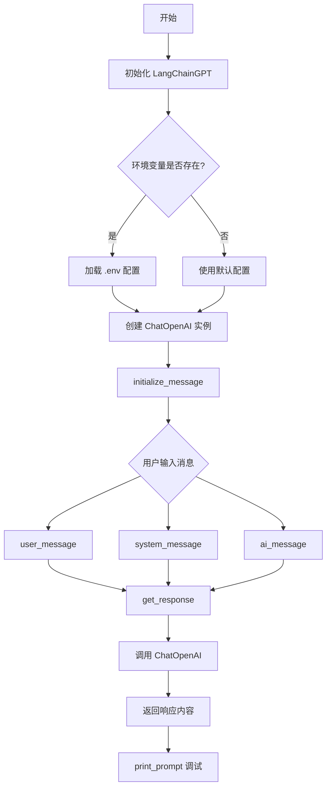
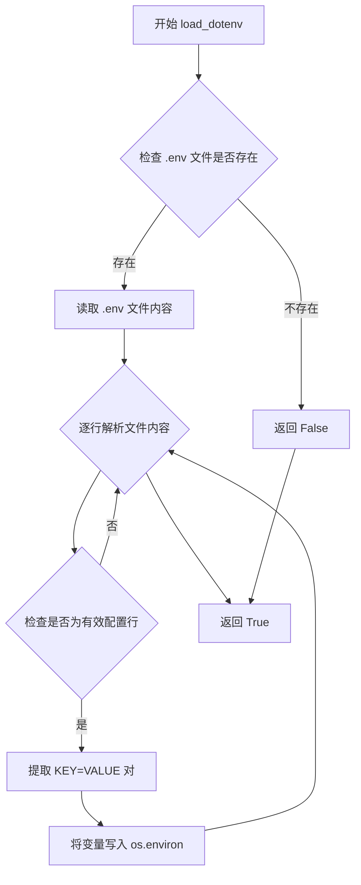
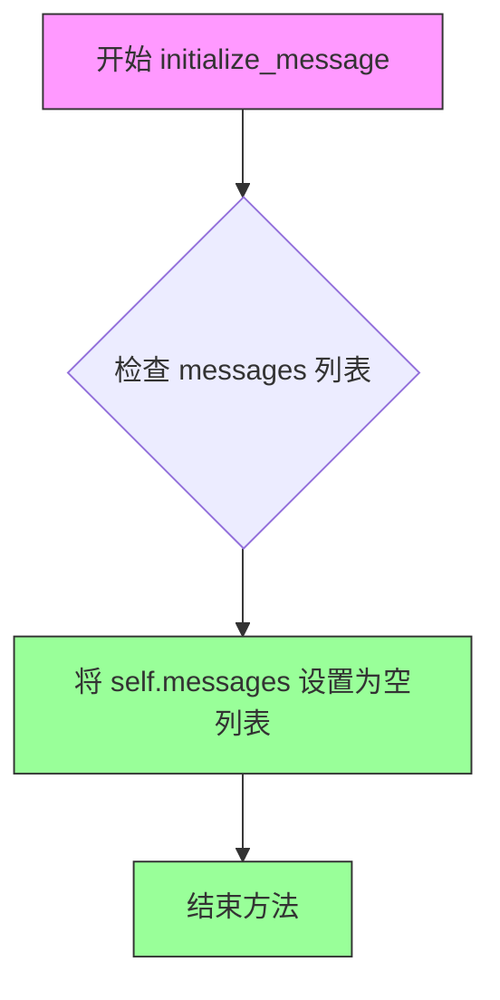
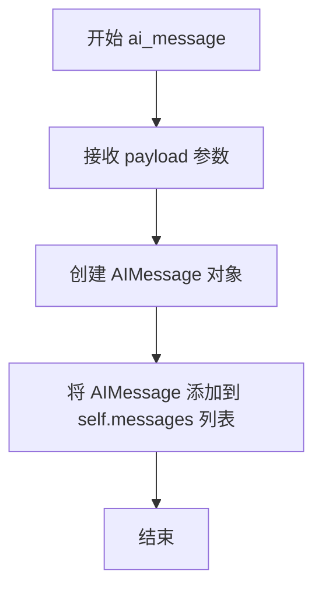
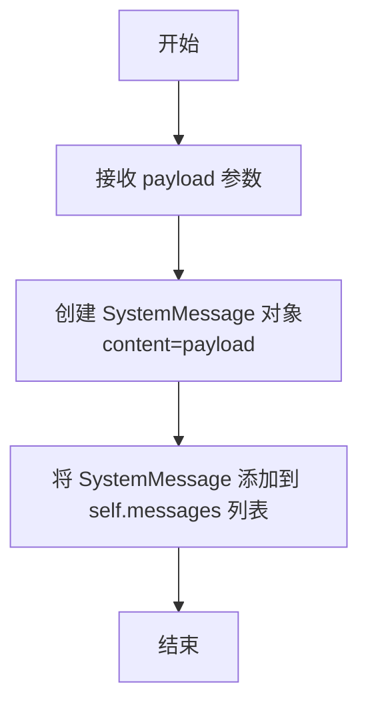
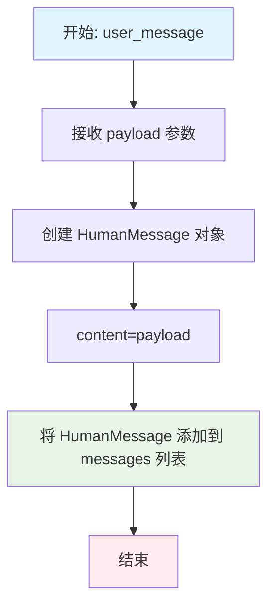
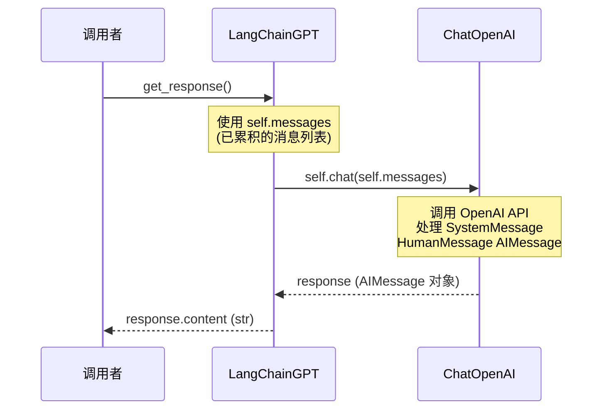
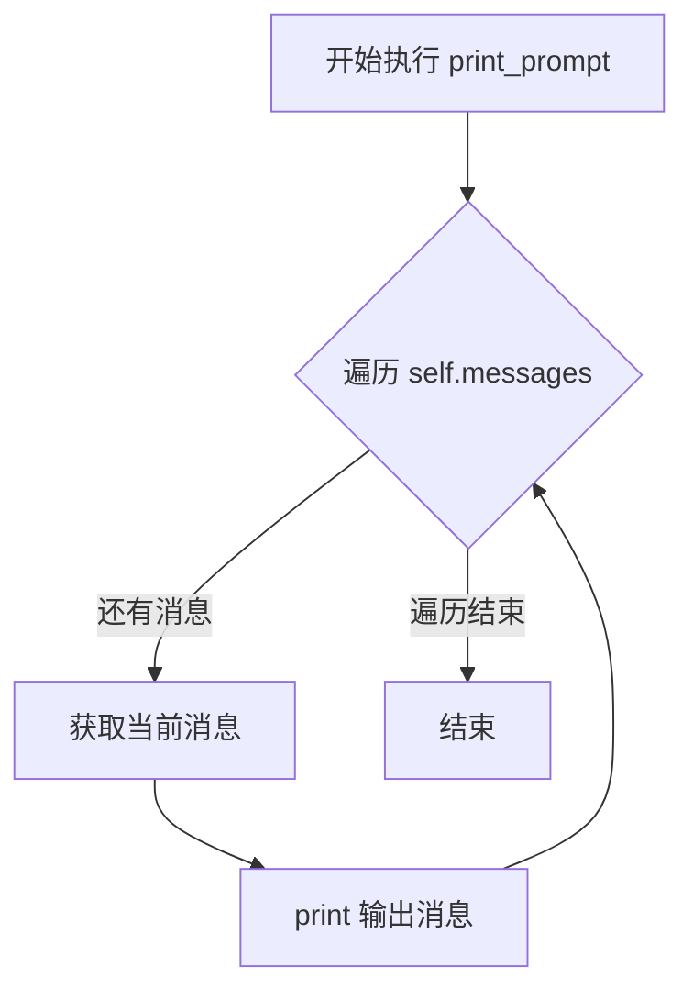

# `Chat-Haruhi-Suzumiya\ChatHaruhi2.0\ChatHaruhi\LangChainGPT.py` 详细设计文档

LangChainGPT是一个基于LangChain库封装的OpenAI GPT模型调用类，继承自BaseLLM抽象基类，提供消息管理、提示词构建和响应生成等功能，用于实现ChatHaruhi聊天机器人系统的核心对话能力。

## 整体流程



## 类结构

```
BaseLLM (抽象基类)
└── LangChainGPT (GPT模型调用实现类)
```

## 全局变量及字段


### `LangChainGPT.model`
    
OpenAI模型名称

类型：`str`
    


### `LangChainGPT.chat`
    
LangChain的OpenAI聊天客户端实例

类型：`ChatOpenAI`
    


### `LangChainGPT.messages`
    
消息历史列表

类型：`list`
    
    

## 全局函数及方法


### `load_dotenv`

加载 `.env` 文件中的环境变量到 `os.environ` 中，使得这些变量可以在应用程序运行时被访问。

参数：

- 无参数（使用默认行为）

返回值：`bool`，返回是否成功加载 `.env` 文件。返回 `True` 表示找到并加载了文件，返回 `False` 表示未找到文件。

#### 流程图



#### 带注释源码

```python
# 从 dotenv 库导入 load_dotenv 函数
from dotenv import load_dotenv

# 在 LangChainGPT 类中的使用示例
class LangChainGPT(BaseLLM):
    def __init__(self, model="gpt-3.5-turbo"):
        super(LangChainGPT, self).__init__()
        self.model = model
        # 检查环境变量 OPENAI_API_BASE 是否存在
        if "OPENAI_API_BASE" in os.environ:
            # 加载 .env 文件中的环境变量
            # 这会读取项目根目录下的 .env 文件
            # 并将其中定义的变量加载到 os.environ 中
            load_dotenv()
            # 加载后可以读取 .env 中定义的变量
            api_base = os.environ["OPENAI_API_BASE"]
            api_key = os.environ["OPENAI_API_KEY"]
            self.chat = ChatOpenAI(model=self.model, openai_api_base=api_base)
        else:
            self.chat = ChatOpenAI(model=self.model)
        self.messages = []
```

#### 关键组件信息

| 组件名称 | 一句话描述 |
|---------|-----------|
| `.env` 文件 | 存储敏感配置信息（如 API 密钥、数据库凭证）的环境变量文件 |
| `os.environ` | Python 中存储系统环境变量的字典对象 |

#### 潜在技术债务或优化空间

1. **缺少错误处理**：当 `.env` 文件不存在或格式错误时，`load_dotenv` 会静默失败，可能导致后续代码因缺少环境变量而报错。
2. **硬编码的 API 端点检查**：仅在 `OPENAI_API_BASE` 存在时才加载 `.env`，这可能导致其他必要的环境变量未被加载。
3. **未指定 .env 文件路径**：使用默认路径加载 `.env`，如果项目结构复杂可能找不到正确的配置文件。

#### 其他项目

**设计目标与约束**：
- 目标：将本地开发配置（API 密钥等）与代码分离，提高安全性
- 约束：`.env` 文件不应提交到版本控制系统

**错误处理与异常设计**：
- `load_dotenv` 在文件不存在时返回 `False` 而不抛出异常
- 建议在使用环境变量前添加默认值或错误提示

**数据流与状态机**：
```
.env 文件 → load_dotenv() → os.environ → 代码访问
```

**外部依赖与接口契约**：
- 依赖：`python-dotenv` 库
- 契约：`.env` 文件格式为 `KEY=VALUE`，支持 `#` 注释


### `LangChainGPT.__init__`

该方法是 `LangChainGPT` 类的构造函数，用于初始化聊天模型实例。它接收模型名称参数，配置 OpenAI API 连接（支持自定义 API Base 地址），并初始化消息历史列表。

参数：

- `model`：`str`，模型名称，默认为 `"gpt-3.5-turbo"`

返回值：`None`，无返回值（构造函数）

#### 流程图

```mermaid
flowchart TD
    A[开始 __init__] --> B[调用父类 BaseLLM 的 __init__]
    B --> C[保存 model 参数到 self.model]
    D{检查环境变量 OPENAI_API_BASE} -->|存在| E[load_dotenv 加载 .env]
    E --> F[获取 api_base 和 api_key]
    F --> G[创建 ChatOpenAI with api_base]
    D -->|不存在| H[创建 ChatOpenAI without api_base]
    G --> I[初始化 self.messages = []]
    H --> I
    I --> J[结束]
```

#### 带注释源码

```python
def __init__(self, model="gpt-3.5-turbo"):
    # 调用父类 BaseLLM 的构造函数进行初始化
    super(LangChainGPT, self).__init__()
    # 保存传入的模型名称到实例属性
    self.model = model
    # 检查是否配置了自定义的 OpenAI API Base 地址
    if "OPENAI_API_BASE" in os.environ:
        # 加载 .env 文件中的环境变量
        load_dotenv()
        # 从环境变量获取自定义 API 地址
        api_base = os.environ["OPENAI_API_BASE"]
        # 从环境变量获取 API Key（代码中获取了但未使用）
        api_key = os.environ["OPENAI_API_KEY"]
        # 使用自定义 API Base 创建 ChatOpenAI 实例
        self.chat = ChatOpenAI(model=self.model, openai_api_base=api_base)
    else:
        # 使用默认配置创建 ChatOpenAI 实例
        self.chat = ChatOpenAI(model=self.model)
    # 初始化空的消息列表，用于存储对话历史
    self.messages = []
```


### `LangChainGPT.initialize_message`

该方法用于清空聊天消息历史，将消息列表重置为空，以便开始新的对话会话。

参数：无

返回值：`None`，无返回值，仅执行清空消息列表的操作。

#### 流程图



#### 带注释源码

```python
def initialize_message(self):
    """
    清空消息历史，将消息列表重置为空。
    用于开始新的对话会话或重置对话上下文。
    """
    self.messages = []  # 将实例的 messages 属性重置为空列表
```


### `LangChainGPT.ai_message`

该方法用于向消息历史记录中添加一条 AI 角色（Assistant）的消息，将传入的内容包装为 `AIMessage` 对象并追加到 `messages` 列表中，用于后续与大语言模型的交互。

参数：

- `payload`：`str`，需要添加的 AI 角色消息内容

返回值：`None`，该方法无返回值，仅修改实例的 `messages` 列表状态

#### 流程图



#### 带注释源码

```python
def ai_message(self, payload):
    """添加 AI 角色消息到消息历史记录中
    
    Args:
        payload: str 类型，要添加的 AI 消息内容
        
    Returns:
        None
        
    Note:
        此方法不会返回任何值，仅修改实例的 messages 属性
        消息会按照添加顺序保存在列表中，后续通过 get_response() 发送给 LLM
    """
    # 使用 langchain 的 AIMessage 类包装 payload 内容，并添加到消息列表中
    self.messages.append(AIMessage(content=payload))
```


### `LangChainGPT.system_message`

添加系统角色消息到消息列表中，用于定义 AI 助手的系统行为和角色设定。

参数：

- `payload`：`str`，需要添加的系统消息内容

返回值：`None`，该方法无返回值，仅将系统消息添加到内部消息列表中

#### 流程图



#### 带注释源码

```python
def system_message(self, payload):
    """
    添加系统角色消息到消息列表中
    
    系统消息用于定义 AI 助手的角色、行为规则和上下文背景。
    通常在对话开始时设置一次，用于指导后续对话的整体方向。
    
    参数:
        payload: str类型，要添加的系统消息内容，例如：
                '你是一个友好的AI助手，专门帮助用户解答编程问题'
    
    返回值:
        None，该方法没有返回值
    
    示例:
        gpt = LangChainGPT()
        gpt.system_message('你是一位专业的Python编程导师')
        response = gpt.get_response()
    """
    # 使用 langchain 的 SystemMessage 创建系统消息对象
    # SystemMessage 是 LangChain 框架定义的消息类型之一
    # 用于在对话中传递系统级别的指令或背景信息
    self.messages.append(SystemMessage(content=payload))
```


### `LangChainGPT.user_message`

添加用户角色消息。该方法接收用户输入的消息内容，将其封装为 `HumanMessage` 对象并追加到内部消息列表中，用于后续与语言模型交互时构建完整的对话上下文。

参数：

- `payload`：`str`，用户消息的内容，即用户输入的文本

返回值：`None`，无返回值，该方法仅执行消息的添加操作

#### 流程图



#### 带注释源码

```python
def user_message(self, payload):
    """
    添加用户角色消息到消息列表中
    
    参数:
        payload: 用户输入的消息内容，字符串类型
    """
    # 使用 langchain 的 HumanMessage 类封装用户消息
    # HumanMessage 表示对话中用户的角色
    self.messages.append(HumanMessage(content=payload))
```


### `LangChainGPT.get_response`

该方法调用 LangChain 的 ChatOpenAI 模型，将累积的消息列表发送给语言模型，并返回模型生成的内容响应。

参数：无（仅包含 `self` 参数）

返回值：`str`，返回语言模型生成的内容字符串

#### 流程图



#### 带注释源码

```python
def get_response(self):
    """
    调用 ChatOpenAI 模型获取响应
    
    该方法执行以下操作：
    1. 获取当前累积的消息列表 (self.messages)
    2. 将消息传递给 ChatOpenAI 实例进行推理
    3. 从返回的 AIMessage 对象中提取 content 属性
    
    Returns:
        str: 模型生成的内容字符串
    """
    # 调用 self.chat (ChatOpenAI 实例) 处理消息列表
    # self.messages 包含 SystemMessage, HumanMessage, AIMessage 的列表
    response = self.chat(self.messages)
    
    # 从 response (AIMessage 对象) 中提取 content 属性并返回
    # content 类型为 str
    return response.content
```


### `LangChainGPT.print_prompt()`

调试打印当前消息列表，遍历并输出存储在 `self.messages` 中的所有消息内容，用于开发调试阶段查看完整的提示词上下文。

参数：

- `self`：`LangChainGPT` 类实例，隐式参数，表示当前对象本身

返回值：`None`，无返回值，该方法仅执行副作用操作（打印消息到控制台）

#### 流程图



#### 带注释源码

```python
def print_prompt(self):
    # 遍历存储在 self.messages 列表中的所有消息对象
    for message in self.messages:
        # 使用 print 函数将每条消息输出到控制台
        # message 对象可能是 AIMessage、HumanMessage 或 SystemMessage
        # LangChain 会自动调用其 __str__ 方法进行格式化输出
        print(message)
```

## 关键组件


### LangChainGPT 类

LangChainGPT 是继承自 BaseLLM 的语言模型封装类，通过 LangChain 库调用 OpenAI GPT 模型实现聊天功能，支持自定义 API 地址和密钥配置。

### 模型配置与初始化

在 `__init__` 方法中完成模型参数配置和环境变量加载，支持通过 OPENAI_API_BASE 和 OPENAI_API_KEY 环境变量自定义 API 端点，默认使用 gpt-3.5-turbo 模型。

### 消息管理机制

通过 `initialize_message` 方法重置消息列表，`ai_message`、`system_message`、`user_message` 方法分别添加不同角色的消息到列表中，支持 System、Human、AI 三种消息类型的对话管理。

### 响应获取

`get_response` 方法将消息列表传递给 ChatOpenAI 实例并获取模型响应，返回响应内容文本。

### 提示打印调试

`print_prompt` 方法用于调试目的，遍历并打印当前消息列表中的所有消息内容。

### 外部依赖

代码依赖 langchain 库的 ChatOpenAI、消息模板和消息模式定义，以及 python-dotenv 库加载环境变量。

### 潜在优化空间

1. 缺少错误处理机制，未对 API 调用失败、网络异常等情况进行处理
2. messages 列表会无限增长，缺乏消息数量限制或历史消息管理策略
3. 重复调用 load_dotenv()，每次初始化都会加载环境变量，可优化为模块级加载
4. 缺少异步支持，无法充分利用异步 IO 能力
5. 未实现流式响应支持


## 问题及建议


### 已知问题

- **API Key 配置缺陷**：代码读取了 `os.environ["OPENAI_API_KEY"]` 但未将其传递给 `ChatOpenAI` 构造函数，导致 API 调用会因缺少认证信息而失败
- **环境变量加载时机不当**：`load_dotenv()` 仅在 `OPENAI_API_BASE` 存在时才被调用，但如果 `OPENAI_API_KEY` 也需要从 .env 文件加载，则该变量可能无法获取到
- **缺少异常处理**：`get_response()` 方法未捕获网络异常或 API 错误，可能导致程序直接崩溃
- **父类初始化方式可能不兼容**：`super(LangChainGPT, self).__init__()` 这种显式传递类名的写法在 Python 3 中可简化为 `super().__init__()`，但需确保 `BaseLLM` 类存在
- **类型注解缺失**：所有方法和变量都缺少类型提示，降低了代码的可读性和 IDE 支持
- **资源管理不完善**：未实现上下文管理器（`__enter__`/`__exit__`）或析构方法，无法确保连接资源被正确释放

### 优化建议

- 修复 API Key 传递：将 `openai_api_key=api_key` 添加到 `ChatOpenAI` 的初始化参数中
- 调整环境变量加载逻辑：在文件开头或类初始化前统一调用 `load_dotenv()`，确保所有环境变量都能正确加载
- 添加异常处理：为 `get_response()` 方法添加 try-except 块，捕获 `APIError`、`RequestException` 等异常并返回有意义的错误信息
- 添加类型注解：为类字段、方法参数和返回值添加类型提示（如 `List[BaseMessage]`、`str` 等）
- 考虑实现上下文管理器：使类可以用于 `with` 语句，确保资源清理
- 添加重试机制：使用 `tenacity` 库为 API 调用添加自动重试逻辑，提升容错能力

## 其它


### 设计目标与约束

本类旨在为ChatHaruhi系统提供一个统一的LLM调用接口，封装LangChain的ChatOpenAI能力，支持多种OpenAI兼容模型。设计约束包括：依赖LangChain库生态环境、仅支持OpenAI API协议、消息历史需要手动管理、API密钥通过环境变量加载。

### 错误处理与异常设计

本类未实现显式的异常处理机制，错误将直接向上抛出。主要异常场景包括：API连接失败、认证失败、模型不支持、消息格式错误、网络超时。建议在调用层添加try-except捕获LangChain相关异常（如ValidationError、HTTPError等），并提供用户友好的错误提示。缺少重试机制和降级策略。

### 数据流与状态机

数据流为：用户通过user_message添加人类消息 → 通过system_message添加系统消息 → 通过ai_message添加AI历史消息 → 调用get_response发送消息列表到LLM → 返回响应内容。状态机转换：initialize_message重置messages为空列表 → 依次添加各类消息 → 获取响应 → 可选择重置。messages列表状态会累积保存对话上下文。

### 外部依赖与接口契约

主要依赖包括：langchain.chat_models.ChatOpenAI（OpenAI聊天接口）、langchain.prompts.chat（消息模板）、langchain.schema（AIMessage/HumanMessage/SystemMessage）、dotenv（环境变量加载）。接口契约：所有message方法接收字符串payload、get_response返回字符串content、initialize_message无返回值。BaseLLM基类需实现统一接口。

### 性能考虑

当前实现无缓存机制，每次调用get_response都会请求API。messages列表无最大长度限制，长期会话可能导致内存占用增长和API请求延迟增加。建议添加：消息历史长度限制、请求超时配置、流式响应支持（当前仅支持同步阻塞）、并发调用保护。

### 安全性考虑

API密钥通过环境变量加载，但代码中未对密钥进行显式验证。messages内容未经过滤，可能存在提示注入风险。建议：添加API密钥有效性检查、输入内容安全过滤、敏感信息脱敏、日志中避免输出完整消息内容。

### 配置管理

当前配置通过构造函数参数model和环境变量（OPENAI_API_KEY、OPENAI_API_BASE）进行管理。缺少配置项：temperature、max_tokens、timeout、max_retries。建议将配置抽象为独立配置类或使用配置对象，支持运行时动态调整。

### 资源管理

messages列表需要显式调用initialize_message手动重置，无自动清理机制。ChatOpenAI客户端实例在对象生命周期内保持，存在连接资源。建议：实现上下文管理器支持、添加析构函数或显式close方法、支持连接池配置。

### 线程安全性

本类非线程安全，messages列表的append操作在多线程环境下存在竞态条件。如需多线程使用，每个线程应创建独立的LangChainGPT实例，或在调用层添加线程锁保护。

### 可扩展性

当前仅支持OpenAI兼容API，扩展方向包括：支持其他LLM提供商（Anthropic、Google等）、支持本地模型、支持流式响应、支持函数调用（Function Calling）、支持多模态输入。设计模式上可考虑抽象出LLMProvider接口实现策略模式。

### 日志与监控

代码中无任何日志记录，无法追踪API调用状态和调试问题。建议添加：请求前日志（模型、消息数）、响应后日志（耗时、token用量）、异常日志（错误类型、错误信息）、性能指标收集。

### 版本兼容性

依赖LangChain库，LangChain API变更可能导致代码失效。当前使用langchain 0.1.x版本特性，需确认与LangChain 0.2.x+版本的兼容性。ChatOpenAI初始化参数可能随OpenAI API版本变化而调整。

### 测试策略建议

建议添加单元测试：各方法基本功能测试、消息添加顺序测试、响应解析测试。集成测试：真实API调用测试（需mock或测试环境密钥）、异常场景测试。性能测试：并发调用测试、大消息量测试。

### 使用示例与文档

代码缺少使用示例文档，建议补充典型场景：单轮对话、多轮对话（含上下文管理）、系统提示词设置、角色扮演场景配置。


    