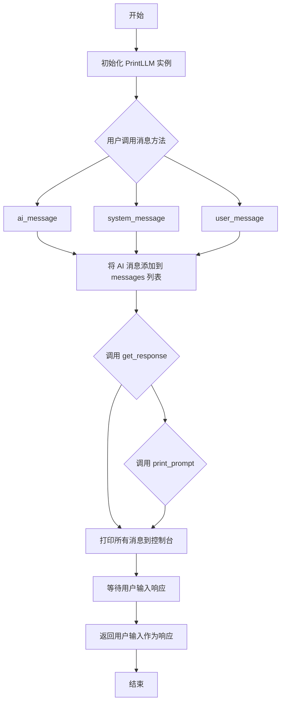
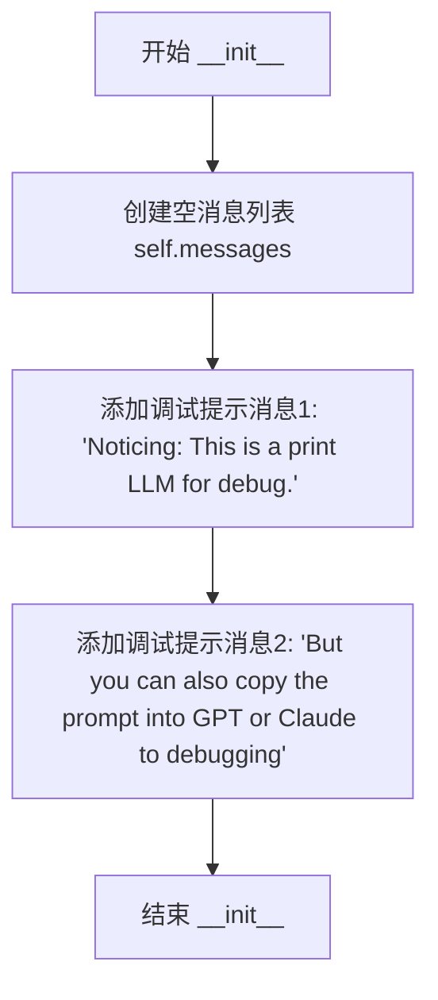
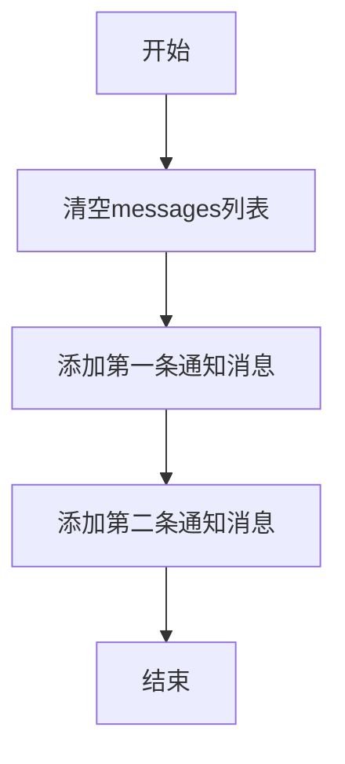
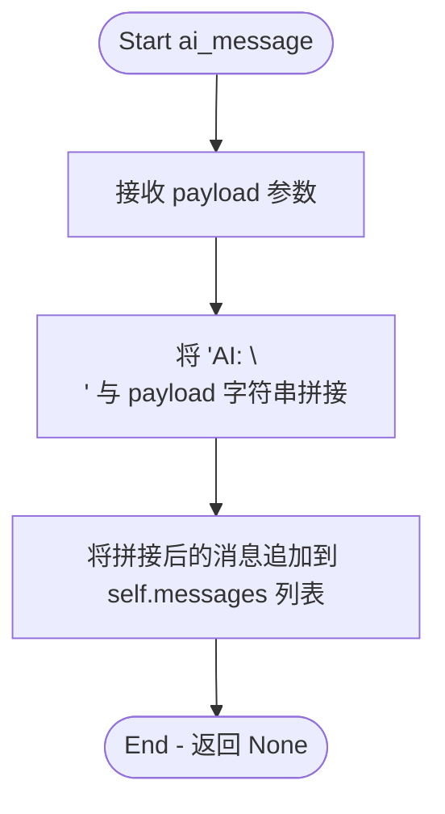
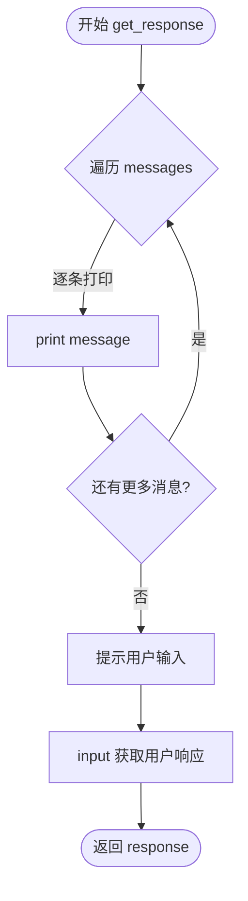
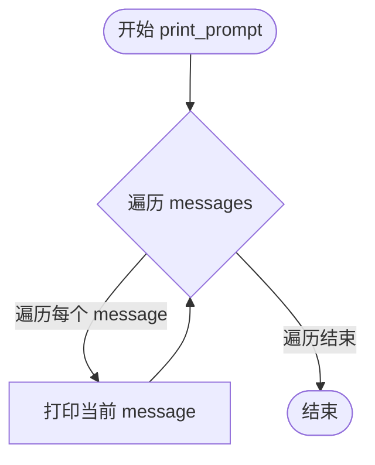

# `Chat-Haruhi-Suzumiya\ChatHaruhi2.0\ChatHaruhi\PrintLLM.py` 详细设计文档

PrintLLM 是一个用于调试的 LLM 封装类，它继承自 BaseLLM，将聊天消息打印到控制台供用户复制到 GPT 或 Claude 进行调试，同时支持交互式输入模拟 AI 响应。

## 整体流程



## 类结构

```
BaseLLM (抽象基类)
└── PrintLLM (调试用 LLM 实现类)
```

## 全局变量及字段


### `PrintLLM.messages`
    
存储聊天消息的列表

类型：`list`
    
    

## 全局函数及方法


### `PrintLLM.__init__`

这是 `PrintLLM` 类的构造函数，用于初始化一个用于调试的模拟 LLM 实例。该方法创建一个空的消息列表，并预先添加两条提示信息，告知用户这是一个用于调试的打印式 LLM，可以将完整的提示词复制到 GPT 或 Claude 中进行调试。

参数：

- `self`：`PrintLLM`，隐式参数，表示类的实例本身，无需显式传递

返回值：`None`，因为 `__init__` 方法不返回值，用于初始化对象状态

#### 流程图



#### 带注释源码

```python
def __init__(self):
    """
    初始化 PrintLLM 类的实例。
    创建一个消息列表并添加调试提示信息。
    """
    # 创建一个空的消息列表，用于存储对话过程中的所有消息
    self.messages = []
    # 添加第一条调试提示信息，通知用户这是一个用于调试的打印式LLM
    self.messages.append("Noticing: This is a print LLM for debug.")
    # 添加第二条调试提示信息，建议用户可以将提示词复制到GPT或Claude进行调试
    self.messages.append("But you can also copy the prompt into GPT or Claude to debugging")
```


### `PrintLLM.initialize_message`

重置消息列表并添加初始化通知信息的方法，用于将调试工具的提示信息添加到消息历史中。

参数：

- `self`：无参数（隐式参数），类的实例本身

返回值：`None`，无返回值描述

#### 流程图



#### 带注释源码

```python
def initialize_message(self):
    # 清空消息列表，重置对话历史
    self.messages = []
    
    # 添加第一条通知信息，说明这是用于调试的打印LLM
    self.messages.append("Noticing: This is a print LLM for debug.")
    
    # 添加第二条通知信息，提示可以将提示词复制到GPT或Claude进行调试
    self.messages.append("But you can also copy the prompt into GPT or Claude to debugging")
```


### `PrintLLM.ai_message`

该方法用于将AI生成的回复消息追加到内部消息列表中，以便后续打印和调试使用。方法接收一个字符串负载（payload），在其前加上"AI: "前缀后添加到消息历史中。

参数：

- `payload`：`str`，需要记录的AI回复内容

返回值：`None`，无返回值，仅执行消息追加操作

#### 流程图



#### 带注释源码

```python
def ai_message(self, payload):
    """
    将AI消息添加到消息历史记录中
    
    参数:
        payload (str): AI生成的回复内容
        
    返回:
        None: 该方法不返回值，仅修改实例状态
    """
    # 在payload前添加"AI: "前缀和换行符，然后追加到消息列表
    self.messages.append("AI: \n" + payload)
```


### `PrintLLM.system_message`

该方法用于将系统角色的消息内容追加到内部消息列表中，并在消息前添加"System: \n"前缀，以便于在调试时区分消息类型。

参数：

- `payload`：`str`，系统消息的内容，即需要记录的系统提示文本

返回值：`None`，无返回值，仅执行消息的追加操作

#### 流程图

```mermaid
flowchart TD
    A[开始执行 system_message] --> B[接收 payload 参数]
    B --> C{检查 payload 是否有效}
    C -->|有效| D[构造系统消息: "System: \n" + payload]
    D --> E[将消息追加到 self.messages 列表]
    E --> F[结束执行]
    C -->|无效| F
```

#### 带注释源码

```python
def system_message(self, payload):
    """
    添加系统消息到消息历史记录中
    
    参数:
        payload (str): 系统角色的消息内容
        
    返回值:
        None: 无返回值，仅修改内部状态
    """
    # 将系统消息追加到 messages 列表
    # 消息格式为 "System: \n" + 实际内容
    # 用于在调试时区分不同角色的消息
    self.messages.append("System: \n" + payload)
```


### `PrintLLM.user_message`

该方法用于将用户消息添加到内部消息列表中，以便后续打印和调试。

参数：

- `payload`：`str`，用户输入的消息内容

返回值：`None`，无返回值（将消息添加到内部列表）

#### 流程图

```mermaid
flowchart TD
    A[开始 user_message] --> B[接收 payload 参数]
    B --> C[拼接字符串 "User: \n" + payload]
    C --> D[将拼接后的字符串添加到 self.messages 列表]
    D --> E[结束]
```

#### 带注释源码

```python
def user_message(self, payload):
    """
    处理用户消息并添加到消息历史中
    
    参数:
        payload: 用户输入的消息内容，字符串类型
    
    返回:
        无返回值(None)，仅修改内部消息列表
    """
    # 在用户消息前添加 "User: " 前缀和换行符，区分消息来源
    # 将处理后的完整消息追加到 messages 列表中保存
    self.messages.append("User: \n" + payload)
```


### `PrintLLM.get_response`

该方法用于调试目的，打印当前积累的所有消息（系统消息、用户消息和AI消息）到控制台，然后请求用户手动输入响应内容，模拟LLM的回复过程。

参数：无

返回值：`str`，返回用户手动输入的响应内容。

#### 流程图



#### 带注释源码

```python
def get_response(self):
    """
    获取用户响应的调试方法
    
    该方法执行以下操作：
    1. 打印当前积累的所有消息（系统、用户、AI消息）
    2. 提示用户手动输入响应内容
    3. 返回用户输入的内容
    
    Returns:
        str: 用户手动输入的响应内容
    """
    
    # 遍历并打印所有已积累的消息
    for message in self.messages:
        print(message)
    
    # 获取用户输入的响应内容
    response = input("Please input your response: ")
    
    # 返回用户输入的响应
    return response
```


### `PrintLLM.print_prompt`

该方法用于将存储在 `PrintLLM` 实例中的所有消息（系统消息、用户消息、AI消息）逐行打印到控制台，以便开发者在调试时查看完整的提示内容。

参数：无（仅包含 `self` 隐式参数）

返回值：`None`，无返回值，仅执行打印操作

#### 流程图



#### 带注释源码

```python
def print_prompt(self):
    """
    打印当前存储的所有消息到控制台
    用于调试目的，允许开发者查看完整的提示内容
    """
    # 遍历 messages 列表中的每一条消息
    for message in self.messages:
        # 将每条消息打印到标准输出
        print(message)
```


## 关键组件


### 核心功能概述

PrintLLM是一个用于调试的语言模型模拟类，通过在控制台打印完整提示信息并支持手动输入响应，帮助开发者将提示复制到GPT或Claude中进行调试。

### 文件运行流程

1. 实例化PrintLLM对象
2. 调用ai_message、system_message、user_message方法构建对话消息
3. 调用print_prompt查看当前所有消息，或调用get_response打印消息并获取用户输入
4. 调用initialize_message重置消息列表

### 类详细信息

#### PrintLLM类

**类字段：**

- messages: list - 存储对话消息的列表，包含系统提示、用户消息和AI消息

**类方法：**

- __init__(self)
  - 参数: 无
  - 返回值: None
  - 描述: 初始化消息列表，添加调试提示信息
  - 流程图: 初始化 → 创建空列表 → 添加调试提示 → 结束
  - 源码:
    ```python
    def __init__(self ):
        self.messages = []
        self.messages.append("Noticing: This is a print LLM for debug.")
        self.messages.append("But you can also copy the prompt into GPT or Claude to debugging")
    ```

- initialize_message(self)
  - 参数: 无
  - 返回值: None
  - 描述: 重置消息列表为初始状态
  - 流程图: 重置 → 清空列表 → 添加调试提示 → 结束
  - 源码:
    ```python
    def initialize_message(self):
        self.messages = []
        self.messages.append("Noticing: This is a print LLM for debug.")
        self.messages.append("But you can also copy the prompt into GPT or Claude to debugging")
    ```

- ai_message(self, payload: str)
  - 参数: payload - str类型，要添加的AI消息内容
  - 返回值: None
  - 描述: 将AI消息添加到消息列表
  - 流程图: 接收payload → 格式化消息 → 添加到列表 → 结束
  - 源码:
    ```python
    def ai_message(self, payload):
        self.messages.append("AI: \n" + payload)
    ```

- system_message(self, payload: str)
  - 参数: payload - str类型，要添加的系统消息内容
  - 返回值: None
  - 描述: 将系统消息添加到消息列表
  - 流程图: 接收payload → 格式化消息 → 添加到列表 → 结束
  - 源码:
    ```python
    def system_message(self, payload):
        self.messages.append("System: \n" + payload)
    ```

- user_message(self, payload: str)
  - 参数: payload - str类型，要添加的用户消息内容
  - 返回值: None
  - 描述: 将用户消息添加到消息列表
  - 流程图: 接收payload → 格式化消息 → 添加到列表 → 结束
  - 源码:
    ```python
    def user_message(self, payload):
        self.messages.append("User: \n" + payload)
    ```

- get_response(self)
  - 参数: 无
  - 返回值: str - 用户手动输入的响应内容
  - 描述: 打印所有消息到控制台，并等待用户输入响应
  - 流程图: 遍历消息 → 打印每条消息 → 等待输入 → 返回输入内容
  - 源码:
    ```python
    def get_response(self):
        for message in self.messages:
            print(message)
        response = input("Please input your response: ")
        return response
    ```

- print_prompt(self)
  - 参数: 无
  - 返回值: None
  - 描述: 仅打印所有消息到控制台，不获取用户输入
  - 流程图: 遍历消息 → 打印每条消息 → 结束
  - 源码:
    ```python
    def print_prompt(self):
        for message in self.messages:
            print(message)
    ```

### 关键组件信息

#### 消息管理组件

负责管理和存储对话过程中的各类消息（系统消息、用户消息、AI消息），提供消息的添加、重置和遍历功能。

#### 控制台输入/输出组件

负责将消息打印到控制台显示，并从标准输入获取用户手动输入的响应内容。

#### 调试提示打印组件

专门用于打印完整提示信息，便于开发者复制到其他LLM进行调试验证。

### 潜在技术债务与优化空间

1. 缺少消息格式化和模板支持：当前消息格式固定，无法自定义消息前缀格式
2. 无消息历史持久化：消息仅存储在内存中，无法保存和加载调试会话
3. 缺乏错误处理：input方法可能抛出EOFError等异常，未做捕获处理
4. 未实现父类BaseLLM的全部接口：可能存在未实现的抽象方法
5. 消息类型区分不明显：所有消息统一存储在单一列表中，缺乏类型标识和数据结构化

### 其他项目

#### 设计目标与约束

- 设计目标：提供一个轻量级的调试工具，用于查看和复制完整提示内容到其他LLM进行测试
- 约束：仅用于开发调试环境，不适用于生产环境

#### 错误处理与异常设计

- input()方法在遇到EOF时可能抛出EOFError异常
- 未实现异常捕获机制，异常会直接向上传播

#### 数据流与状态机

- 消息状态流：初始化状态 → 消息添加状态 → 打印/获取响应状态 → 重置状态
- 消息累积：消息列表持续累积，直到调用initialize_message重置

#### 外部依赖与接口契约

- 依赖：继承自BaseLLM类，需实现父类定义的所有抽象方法
- 接口契约：ai_message、system_message、user_message接收字符串参数，get_response返回字符串


## 问题及建议


### 已知问题

- **未调用父类构造函数**：继承自 `BaseLLM` 但未调用 `super().__init__()`，可能导致基类的初始化逻辑被跳过
- **缺少类型注解**：所有方法参数和返回值都缺乏类型标注，降低了代码可读性和 IDE 支持
- **代码重复**：`__init__` 和 `initialize_message` 方法中存在重复的消息初始化逻辑
- **异常处理缺失**：`input()` 调用未处理可能的异常（如 EOFError、KeyboardInterrupt）
- **消息格式不一致**：AI/System/User 消息前缀混用 `\n`，缺乏统一的格式化规范
- **无消息管理机制**：消息列表无大小限制，可能导致内存溢出风险
- **缺乏文档注释**：类和方法缺少 docstring，降低了代码可维护性

### 优化建议

- 添加 `super().__init__()` 调用或根据实际需求重构继承结构
- 为所有方法添加类型注解（如 `payload: str` 和 `-> str`）
- 抽取重复的消息初始化逻辑到私有方法中
- 使用 `try-except` 包装 `input()` 调用并提供友好的错误处理
- 定义消息前缀常量或枚举，统一消息格式化方式
- 考虑添加 `max_messages` 参数或自动清理机制防止内存泄漏
- 为类和方法补充 Google 风格的 docstring

## 其它


### 设计目标与约束

设计目标：为ChatHaruhi系统提供一个调试工具，能够完整打印出完整的提示内容供开发者复制到其他LLM（如GPT或Claude）中进行调试和验证，同时支持交互式输入响应。

设计约束：继承自BaseLLM抽象类，需要实现所有抽象方法；仅用于调试目的，不应用于生产环境；依赖Python标准库的input函数进行交互。

### 错误处理与异常设计

当用户输入响应时可能出现EOFError（输入流结束）或KeyboardInterrupt（用户中断）等异常，当前实现未对这些情况进行处理。建议在get_response方法中添加异常捕获逻辑，处理输入中断的情况并给出友好的错误提示或返回默认值。

### 数据流与状态机

数据流：系统消息、用户消息和AI消息通过对应的方法追加到messages列表中，形成对话历史。get_response方法遍历所有消息打印后，等待用户输入响应。

状态机：PrintLLM维护一个简单的状态，即messages列表的内容。状态转换通过以下方法触发：initialize_message重置状态，ai_message/system_message/user_message添加新消息到状态，get_response读取用户输入改变状态。

### 外部依赖与接口契约

外部依赖：继承自BaseLLM抽象类，需要实现其定义的抽象方法。依赖Python标准库的input函数和print函数。

接口契约：必须实现BaseLLM类定义的所有抽象方法，包括initialize_message、ai_message、system_message、user_message和get_response。PrintLLM类完全满足这些契约要求。

### 性能考虑

当前实现性能开销极低，主要操作是列表append和遍历打印。messages列表可能随对话进行而增长，但作为调试工具其规模通常有限。若需要优化，可考虑限制messages列表的最大长度或实现消息轮转机制。

### 安全性考虑

该类用于调试目的，安全性风险较低。但需注意：用户输入通过input函数获取，未进行输入验证或清理；在生产环境中部署时应移除或禁用该类；打印的敏感信息（如API密钥如果出现在提示中）可能被泄露。

### 配置管理

当前无外部配置需求。messages列表的内容完全由方法调用决定。未来可考虑添加配置选项，如是否自动打印消息、是否保存对话历史到文件等。

### 测试策略

建议添加单元测试验证：初始化后messages包含预期内容；各消息方法正确追加内容；get_response返回用户输入值；print_prompt正确打印所有消息；继承自BaseLLM满足多态要求。

### 部署注意事项

该类仅用于开发调试环境，不应部署到生产环境。建议通过环境变量或配置开关控制是否启用PrintLLM，确保生产环境使用真实的LLM后端。

### 监控和日志

当前实现使用print输出，无结构化日志。建议添加日志级别控制，支持DEBUG/INFO/WARNING级别；可记录方法调用次数、消息数量等指标用于调试分析。

### 版本兼容性

该代码使用Python 3标准库，无特殊版本依赖。但需注意：input函数在Python 2中等同于raw_input，可能需要兼容性处理；建议明确要求Python 3.6+以确保最佳兼容性。

### 资源管理

messages列表作为主要资源需要管理。当前实现中messages会在initialize_message时被清空，但get_response后未清空，可能导致列表持续增长。建议在适当时机自动清理或提供显式清理方法。


    