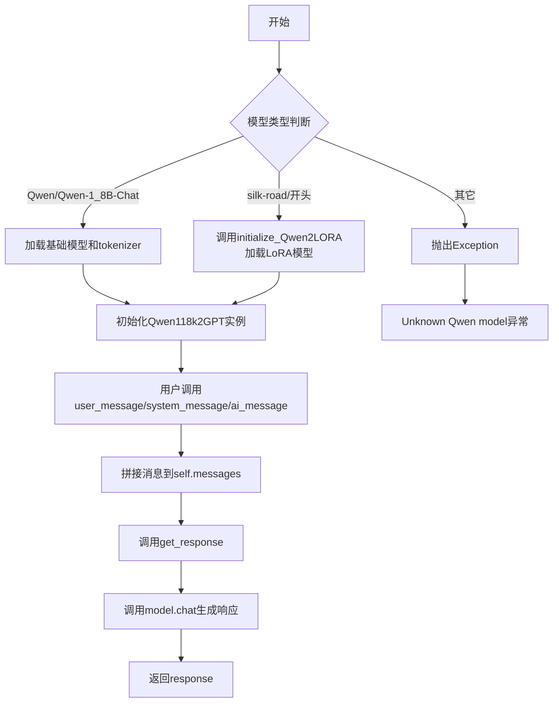
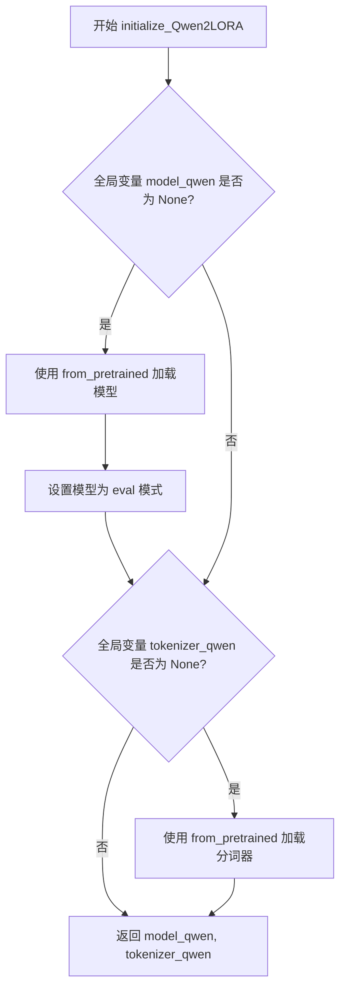
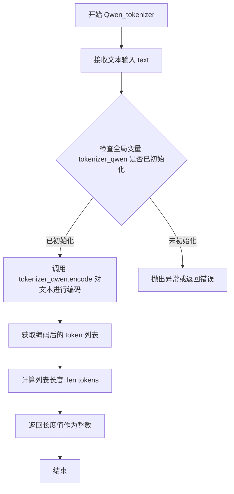
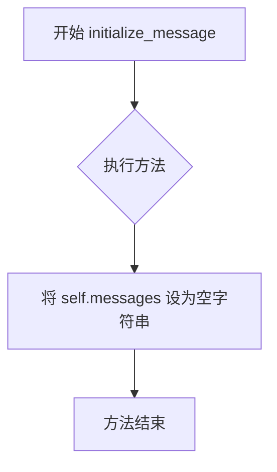
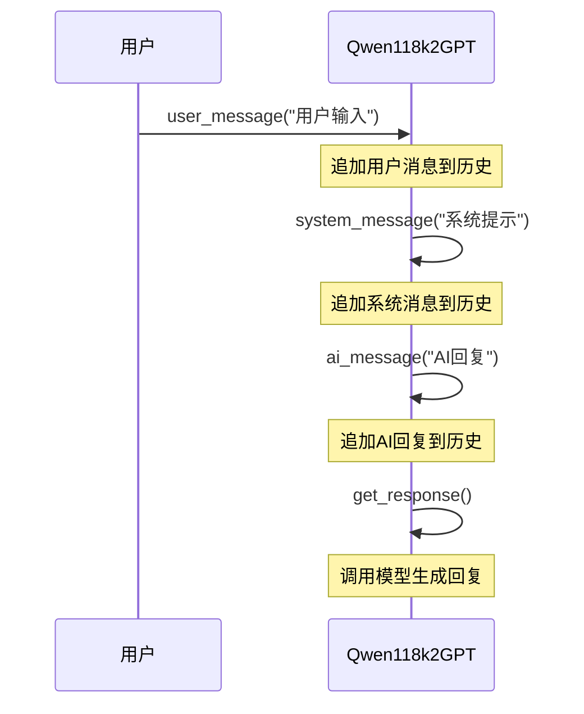
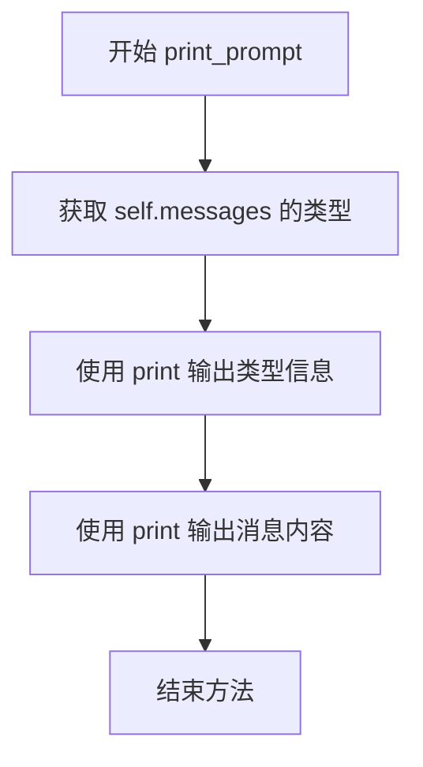

# `Chat-Haruhi-Suzumiya\ChatHaruhi2.0\ChatHaruhi\Qwen118k2GPT.py` 详细设计文档

该代码实现了一个基于Qwen大模型的聊天接口（Qwen118k2GPT），支持加载Qwen-1_8B-Chat基础模型或通过LoRA适配器微调的模型，提供对话消息管理、token计数和响应生成功能。

## 整体流程



## 类结构

```
BaseLLM (抽象基类)
└── Qwen118k2GPT (Qwen聊天模型实现类)
```

## 全局变量及字段


### `tokenizer_qwen`
    
全局分词器实例，用于对文本进行分词处理

类型：`AutoTokenizer`
    


### `model_qwen`
    
全局模型实例，用于执行因果语言模型推理

类型：`AutoModelForCausalLM`
    


### `Qwen118k2GPT.self.model`
    
模型实例，用于处理对话生成任务

类型：`AutoModelForCausalLM`
    


### `Qwen118k2GPT.self.tokenizer`
    
分词器实例，用于文本编码和解码

类型：`AutoTokenizer`
    


### `Qwen118k2GPT.self.messages`
    
对话消息字符串，存储当前会话的上下文消息

类型：`str`
    
    

## 全局函数及方法


### `initialize_Qwen2LORA`

初始化Qwen LoRA模型，加载预训练的因果语言模型（Causal LM）和对应的分词器，并将其设置为全局变量供后续使用。

参数：

- `model`：`str`，模型路径或模型标识符，用于指定要加载的预训练Qwen模型

返回值：`tuple[AutoModelForCausalLM, AutoTokenizer]`，返回加载后的模型和分词器组成的元组

#### 流程图



#### 带注释源码

```python
def initialize_Qwen2LORA(model):
    """
    初始化Qwen LoRA模型，加载预训练模型和分词器
    
    参数:
        model: 模型路径或HuggingFace模型标识符
    
    返回:
        tuple: (model_qwen, tokenizer_qwen) 模型和分词器元组
    """
    # 声明使用全局变量，使函数内部可以修改模块级变量
    global model_qwen, tokenizer_qwen

    # 懒加载模式：仅当模型未加载时才加载模型
    if model_qwen is None:
        # 从预训练模型加载因果语言模型
        model_qwen = AutoModelForCausalLM.from_pretrained(
            model,                      # 模型路径或模型ID
            device_map="auto",          # 自动分配设备（CPU/GPU）
            trust_remote_code=True      # 允许执行远程代码
        )
        # 设置为评估模式，禁用dropout等训练专用层
        model_qwen = model_qwen.eval()
        
        # TODO: 预留的LoRA适配器加载代码（已注释）
        # 如需启用LoRA微调，可取消注释以下代码
        # model_qwen = PeftModel.from_pretrained(
        #     model_qwen,
        #     "silk-road/Chat-Haruhi-Fusion_B"
        # )

    # 懒加载模式：仅当分词器未加载时才加载分词器
    if tokenizer_qwen is None:
        # 从预训练模型加载对应的分词器
        tokenizer_qwen = AutoTokenizer.from_pretrained(
            model,                      # 模型路径或模型ID
            # use_fast=True,            # 快速分词器选项（已注释）
            trust_remote_code=True      # 允许执行远程代码
        )

    # 返回模型和分词器供调用者使用
    return model_qwen, tokenizer_qwen
```


### `Qwen_tokenizer`

该函数是一个全局工具函数，用于对输入的文本进行tokenize（分词）并返回分词后的长度。它依赖全局变量`tokenizer_qwen`（Qwen系列模型的 tokenizer）来执行编码操作。

参数：

- `text`：`str`，需要进行tokenize的文本输入

返回值：`int`，返回文本经过tokenizer编码后的token数量（即长度）

#### 流程图



#### 带注释源码

```python
def Qwen_tokenizer(text):
    """
    对给定文本进行tokenize并返回token数量
    
    参数:
        text (str): 需要进行分词的文本字符串
        
    返回值:
        int: 文本经过tokenizer编码后的token数量
    """
    # 使用全局tokenizer对输入文本进行编码，返回token ID列表
    # 然后通过len()获取列表长度，即为token数量
    return len(tokenizer_qwen.encode(text))
```

#### 补充说明

| 项目 | 描述 |
|------|------|
| **函数类型** | 全局函数 |
| **依赖全局变量** | `tokenizer_qwen` (AutoTokenizer实例) |
| **潜在问题** | 如果在调用前未初始化`tokenizer_qwen`，会导致`NameError`或`AttributeError` |
| **优化建议** | 建议添加参数检查或异常处理，确保tokenizer已初始化后再调用 |
| **使用场景** | 用于计算输入文本的token长度，常用于LLM的上下文窗口长度检查、计费、截断等场景 |


### `Qwen118k2GPT.__init__`

该方法是 `Qwen118k2GPT` 类的构造函数，用于初始化 Qwen 大语言模型的 tokenizer 和 model 实例。根据传入的 model 参数不同，选择不同的加载策略：直接加载 Qwen 官方模型或通过 LoRA 适配器加载微调模型，并初始化消息列表。

参数：

- `model`：`str`，模型名称或路径，用于指定要加载的 Qwen 模型类型。当值为 "Qwen/Qwen-1_8B-Chat" 时加载官方聊天模型，当包含 "silk-road/" 时通过 LoRA 适配器加载微调模型，其他值则抛出异常。

返回值：`None`，无返回值，仅作为构造函数初始化对象状态。

#### 流程图

```mermaid
flowchart TD
    A[开始 __init__] --> B[调用 super().__init__ 初始化基类]
    B --> C{判断 model == 'Qwen/Qwen-1_8B-Chat'}
    C -->|是| D[直接加载 Qwen 官方 tokenizer 和 model]
    D --> H[设置 self.model 和 self.tokenizer]
    C -->|否| E{判断 'silk-road/' in model}
    E -->|是| F[调用 initialize_Qwen2LORA 函数加载 LoRA 模型]
    F --> H
    E -->|否| G[抛出 Exception 未知模型]
    G --> I[异常终止]
    H --> J[初始化 self.messages = '']
    J --> K[结束]
```

#### 带注释源码

```python
def __init__(self, model):
    """
    Qwen118k2GPT 类的构造函数
    
    参数:
        model (str): 模型名称或路径
            - "Qwen/Qwen-1_8B-Chat": 加载官方 Qwen-1.8B 聊天模型
            - 包含 "silk-road/": 通过 LoRA 适配器加载微调模型
            - 其他值: 抛出异常
    """
    # 调用父类 BaseLLM 的构造函数进行基类初始化
    super(Qwen118k2GPT, self).__init__()
    
    # 声明使用全局变量 model_qwen 和 tokenizer_qwen
    global model_qwen, tokenizer_qwen
    
    # 判断是否为官方 Qwen 聊天模型
    if model == "Qwen/Qwen-1_8B-Chat":
        # 使用 AutoTokenizer 加载官方 tokenizer
        tokenizer_qwen = AutoTokenizer.from_pretrained(
            "Qwen/Qwen-1_8B-Chat", 
            trust_remote_code=True  # 允许执行远程代码
        )
        # 使用 AutoModelForCausalLM 加载因果语言模型
        model_qwen = AutoModelForCausalLM.from_pretrained(
            "Qwen/Qwen-1_8B-Chat", 
            device_map="auto",  # 自动分配设备
            trust_remote_code=True
        ).eval()  # 设置为评估模式，禁用 dropout
        
        # 将加载的模型和 tokenizer 赋值给实例属性
        self.model = model_qwen
        self.tokenizer = tokenizer_qwen
    
    # 判断是否为 LoRA 微调模型（模型路径包含 "silk-road/"）
    elif "silk-road/" in model:
        # 调用外部初始化函数加载 LoRA 适配的模型
        self.model, self.tokenizer = initialize_Qwen2LORA(model)
    
    # 模型类型不匹配，抛出异常
    else:
        raise Exception("Unknown Qwen model")
    
    # 初始化消息列表为空字符串
    self.messages = ""
```


### `Qwen118k2GPT.initialize_message`

该方法用于初始化对话消息历史，将内部的消息存储重置为空字符串，为开始新一轮对话做准备。

参数：

- `self`：`Qwen118k2GPT`（实例对象），代表类的当前实例，用于访问类的属性和方法

返回值：`None`，无返回值，仅执行初始化操作

#### 流程图



#### 带注释源码

```
def initialize_message(self):
    """
    初始化对话消息历史
    将 messages 属性重置为空字符串，以便开始新的对话会话
    """
    self.messages = ""  # 将消息历史重置为空字符串
```


### `Qwen118k2GPT.ai_message`

该方法用于将 AI 生成的消息内容追加到对话历史记录中，通过在消息前添加 "AI:" 前缀来标识消息来源。

参数：

-  `payload`：`str`，用户传入的 AI 消息内容，将被追加到对话历史中

返回值：`None`，该方法直接修改实例的 `messages` 属性，不返回任何值

#### 流程图

```mermaid
flowchart TD
    A[开始 ai_message] --> B[接收 payload 参数]
    B --> C[构建新消息字符串: "AI: " + 原messages + "\n " + payload]
    C --> D[将新消息赋值给 self.messages]
    E[结束]
```

#### 带注释源码

```python
def ai_message(self, payload):
    """
    添加 AI 消息到对话历史记录中
    
    参数:
        payload: str - AI 生成的消息内容
    """
    # 拼接消息：前缀 "AI: " + 已有消息历史 + 换行符 + 新消息内容
    self.messages = "AI: " +  self.messages + "\n " + payload 
    # 该方法直接修改 self.messages 属性，不返回任何值
```


### `Qwen118k2GPT.system_message`

该方法用于向对话消息历史中添加系统提示（SYSTEM PROMPT），通过将新的系统提示内容与现有的消息历史进行拼接，形成完整的对话上下文。

参数：

-  `self`：`Qwen118k2GPT`，类的实例本身，用于访问和修改实例属性
-  `payload`：`str`，需要添加的系统提示内容

返回值：`None`，该方法直接修改实例的 `messages` 属性，不返回任何值

#### 流程图

```mermaid
flowchart TD
    A[开始] --> B[接收payload参数]
    B --> C{检查messages是否已初始化}
    C -->|是| D[拼接字符串: "SYSTEM PROMPT: " + self.messages + "\n " + payload]
    C -->|否| E[拼接字符串: "SYSTEM PROMPT: " + "" + "\n " + payload]
    D --> F[更新self.messages属性]
    E --> F
    F --> G[结束/返回]
```

#### 带注释源码

```python
def system_message(self, payload):
    """
    添加系统提示消息到对话历史中
    
    参数:
        payload: 系统提示的内容，将被添加到消息历史的最前面
    """
    # 拼接字符串格式: "SYSTEM PROMPT: " + 已有消息 + 换行符 + 新的payload
    # 注意: 这种拼接方式会导致新消息出现在前面（类似栈的结构）
    self.messages = "SYSTEM PROMPT: " + self.messages + "\n " + payload 
```


### `Qwen118k2GPT.user_message`

该方法用于将用户消息追加到对话历史记录中，通过在消息前添加"User:"前缀来标识用户角色，并使用换行符分隔多条消息，实现多轮对话上下文的累积。

参数：

- `payload`：`str`，用户输入的消息内容

返回值：`None`，无返回值（方法直接修改实例属性 `self.messages`）

#### 流程图

```mermaid
flowchart TD
    A[开始 user_message] --> B{检查 payload}
    B -->|payload 为空| C[空操作]
    B -->|payload 有值| D[拼接字符串: "User: " + self.messages + "\n " + payload]
    D --> E[更新 self.messages]
    E --> F[结束]
    
    style A fill:#e1f5fe
    style F fill:#e1f5fe
    style D fill:#fff3e0
```

#### 带注释源码

```python
def user_message(self, payload):
    """
    将用户消息添加到对话历史中
    
    参数:
        payload: str 用户输入的消息内容
        
    返回:
        None
        
    说明:
        该方法会将用户消息追加到 self.messages 字符串中，
        消息格式为: "User: " + 现有消息 + "\n " + 用户payload
        使用换行符和空格来分隔不同角色的消息
    """
    # 将用户消息前缀添加到 payload 前面，
    # 保持现有消息历史，并在末尾追加新消息
    self.messages = "User: " + self.messages + "\n " + payload 
```

#### 补充说明

| 项目 | 说明 |
|------|------|
| **所属类** | Qwen118k2GPT |
| **方法类型** | 实例方法 |
| **修改状态** | 修改实例属性 `self.messages` |
| **调用场景** | 在多轮对话中，当用户发送消息时调用此方法记录用户输入 |
| **潜在问题** | 1. `self.messages` 初始值为空字符串 `""`，首次调用会生成 `"User:  \n payload"`<br>2. 消息拼接使用字符串 `+` 操作，频繁调用可能导致性能问题<br>3. 没有对 `payload` 进行空值校验 |

#### 相关的类方法调用链




### `Qwen118k2GPT.get_response`

该方法是 `Qwen118k2GPT` 类的核心方法，用于调用 Qwen 大语言模型并获取生成响应。它在 `torch.no_grad()` 上下文中执行模型推理，将累积的消息列表传递给模型聊天接口，并返回模型生成的文本响应。

参数：

- `self`：`Qwen118k2GPT`，代表当前类的实例对象，包含了模型、tokenizer 以及消息历史

返回值：`str`，模型根据输入消息生成的文本响应

#### 流程图

```mermaid
flowchart TD
    A[开始 get_response] --> B[进入 torch.no_grad 上下文]
    B --> C[调用 self.model.chat 方法]
    C --> D[传入参数: self.tokenizer, self.messages, history=[]]
    D --> E[模型执行推理]
    E --> F[返回 tuple: response, history]
    F --> G[提取 response 字符串]
    G --> H[返回 response]
    H --> I[结束]
    
    subgraph 内部状态
        J[当前消息: self.messages]
        K[模型: self.model]
        L[分词器: self.tokenizer]
    end
    
    C -.-> J
    C -.-> K
    C -.-> L
```

#### 带注释源码

```python
def get_response(self):
    """
    获取模型生成的响应
    
    该方法执行以下步骤：
    1. 使用 torch.no_grad() 上下文管理器禁用梯度计算，节省显存
    2. 调用模型的 chat 方法进行对话生成
    3. 返回模型生成的文本响应
    
    Returns:
        str: 模型生成的文本响应内容
    """
    # 使用 torch.no_grad() 上下文，禁用梯度计算以减少内存占用和提高推理速度
    with torch.no_grad():
        # 调用模型的 chat 方法进行对话生成
        # 参数:
        #   - self.tokenizer: 用于编码输入文本的分词器
        #   - self.messages: 累积的对话消息字符串
        #   - history: 空列表，表示不使用历史对话上下文
        # 返回:
        #   - response: 模型生成的文本响应
        #   - history: 更新后的对话历史
        response, history = self.model.chat(self.tokenizer, self.messages, history=[])
        # print(response)  # 调试用的打印语句，当前已注释
    
    # 返回模型生成的响应文本
    return response
```


### `Qwen118k2GPT.print_prompt`

该方法用于调试目的，打印当前积累的消息内容的类型和实际文本内容，帮助开发者检查消息格式化是否正确。

参数：此方法无参数。

返回值：`None`，无返回值，仅执行打印操作。

#### 流程图



#### 带注释源码

```
def print_prompt(self):
    """
    打印当前消息的类型和内容，用于调试和检查消息格式化结果。
    该方法不会修改对象状态，仅作为诊断工具使用。
    """
    # 打印 self.messages 的数据类型，通常是 str 类型
    print(type(self.messages))
    
    # 打印当前积累的完整消息内容，包括所有 AI、System、User 消息
    print(self.messages)
```

## 关键组件


### 全局变量延迟初始化机制

通过全局变量model_qwen和tokenizer_qwen实现单例模式的惰性加载，确保模型和分词器只在首次调用时才加载到内存，避免启动时的资源占用。

### Qwen模型加载与推理

支持两种模型加载方式：直接加载Qwen-1_8B-Chat基础模型，或通过initialize_Qwen2LORA函数加载经过LoRA微调的Qwen模型。模型通过device_map="auto"实现自动设备映射，通过eval()模式切换到推理状态禁用梯度计算。

### 消息构建系统

提供ai_message、system_message、user_message三个方法用于构建聊天上下文，将不同角色的消息以特定格式追加到self.messages字符串中，支持多轮对话上下文的维护。

### 继承BaseLLM的接口设计

Qwen118k2GPT类继承自BaseLLM抽象基类，遵循统一的LLM接口规范，实现initialize_message、ai_message、system_message、user_message、get_response等方法，保证与其他LLM实现的互换性。

### 分词器编码长度计算

全局函数Qwen_tokenizer封装了分词器的encode方法，提供文本到token数量的转换功能，用于后续的上下文长度控制和资源预估。

### 设备自动映射策略

通过transformers库的AutoModelForCausalLM和device_map="auto"参数实现模型在多设备间的自动分配，优化推理时的内存使用和计算效率。

### 模型推理上下文管理

get_response方法使用torch.no_grad()上下文管理器禁用梯度计算和反向传播，显著降低推理时的显存占用，同时调用model.chat方法进行对话生成。


## 问题及建议


### 已知问题

- **全局状态管理混乱**：使用全局变量 `model_qwen` 和 `tokenizer_qwen` 管理模型状态，多实例场景下会产生状态污染和不一致性问题
- **代码重复**：在 `__init__` 方法中加载 "Qwen/Qwen-1_8B-Chat" 模型的逻辑与 `initialize_Qwen2LORA` 函数逻辑高度重复
- **未使用的导入**：导入了 `PeftModel`、`AutoModel`、`GenerationConfig` 等但未使用，造成代码冗余
- **硬编码模型名称**：将 "Qwen/Qwen-1_8B-Chat" 硬编码在多处，扩展性差
- **低效的消息管理**：使用字符串拼接管理对话历史（`self.messages`），时间复杂度 O(n²) 且难以维护
- **不完整的 history 参数**：`get_response` 方法中固定传入空 history，未利用模型的对话历史功能
- **缺乏错误处理**：模型加载和推理过程无异常捕获机制，容错性差
- **未使用函数**：`Qwen_tokenizer` 函数定义后未被调用，属于死代码

### 优化建议

- 移除全局变量，改用实例属性或依赖注入管理模型状态
- 提取公共的模型加载逻辑为独立方法或函数，消除重复代码
- 清理未使用的导入语句
- 将模型名称提取为配置参数或构造函数参数
- 使用列表结构存储消息，改为结构化的消息格式（如字典列表）管理对话上下文
- 正确传递 history 参数以支持多轮对话
- 添加 try-except 块处理模型加载和推理异常，提供友好的错误提示
- 删除未使用的 `Qwen_tokenizer` 函数或明确其用途
- 考虑使用 `torch_dtype` 参数优化模型加载的内存占用

## 其它


### 设计目标与约束

本模块旨在提供一个统一的接口来加载和使用Qwen系列语言模型，支持标准聊天模型和基于LoRA微调的模型。设计约束包括：仅支持Qwen/Qwen-1_8B-Chat和silk-road/前缀的微调模型；模型必须使用device_map="auto"进行自动设备映射；模型加载后必须设置为eval模式以确保推理行为正确；不支持多模型并发加载，全局变量方式限制了多实例场景。

### 错误处理与异常设计

代码中存在多处异常处理缺陷：initialize_Qwen2LORA函数中model和tokenizer的加载失败时无异常捕获；Qwen_tokenizer函数未检查tokenizer_qwen是否为None就直接调用；Qwen118k2GPT.__init__中除两个已知model字符串外无默认异常处理。改进建议：为模型和tokenizer加载添加try-except捕获IOException和RuntimeError；Qwen_tokenizer应添加if tokenizer_qwen is None判断；get_response方法应捕获模型推理可能抛出的异常。

### 数据流与状态机

消息流转遵循以下状态机：初始状态messages为空字符串；通过user_message、ai_message、system_message向messages追加内容，格式固定为"角色: 消息内容\n "；get_response调用model.chat方法生成响应，返回的response字符串可再次通过ai_message追加到messages中。数据流从用户输入到最终响应经历了：用户消息构建→消息拼接→模型推理→响应提取→返回响应。

### 外部依赖与接口契约

核心依赖包括：torch>=1.0；transformers>=4.30；peft用于LoRA加载（虽然代码中PeftModel被注释）；BaseLLM基类需实现initialize_message、ai_message、system_message、user_message、get_response、print_prompt六个接口。外部契约：model.chat()方法需返回(response, history)元组；tokenizer.encode()方法需返回token ID列表；initialize_Qwen2LORA返回(model, tokenizer)元组。

### 性能考虑与资源管理

全局变量model_qwen和tokenizer_qwen导致模型常驻内存，多实例场景下会造成资源浪费。get_response中使用torch.no_grad()禁用了梯度计算，符合推理场景。model.eval()确保BN和Dropout层在推理模式下运行。建议改进：使用单例模式或连接池管理模型生命周期；支持模型卸载机制；添加显存管理和批处理支持。

### 安全性考虑

代码中trust_remote_code=True允许加载远程代码，存在潜在安全风险。model路径直接来自外部输入未做校验。建议：添加model路径的白名单验证；移除不必要的trust_remote_code=True或明确文档说明风险；模型下载时验证SHA256哈希值。

### 配置与参数说明

model参数：字符串类型，支持"Qwen/Qwen-1_8B-Chat"和"silk-road/"前缀的HuggingFace模型ID；device_map参数：设置为"auto"实现自动CPU/GPU分配；trust_remote_code=True：允许执行模型目录中的自定义代码；eval()：将模型切换到推理模式。

### 使用示例与典型场景

典型聊天场景：创建Qwen118k2GPT实例→通过user_message添加用户输入→调用get_response获取AI回复→通过ai_message将回复加入上下文。批量推理场景：初始化一次模型→循环调用get_response。LoRA微调场景：使用"silk-road/Chat-Haruhi-Fusion_B"等微调模型ID加载适配器权重。

### 版本兼容性说明

代码依赖transformers库的AutoModelForCausalLM和AutoTokenizer，需transformers>=4.30版本；model.chat()接口为Qwen特有，需确认Qwen版本兼容性；PeftModel虽然被注释但import存在，升级peft版本时需注意API变更。


    