# `Chat-Haruhi-Suzumiya\ChatHaruhi2.0\ChatHaruhi\SparkApi.py` 详细设计文档

该代码实现了一个WebSocket客户端，用于与讯飞星火认知大模型进行实时交互。它通过生成带有鉴权信息的URL，建立WebSocket连接，发送用户问题并接收流式返回的AI回答。

## 整体流程

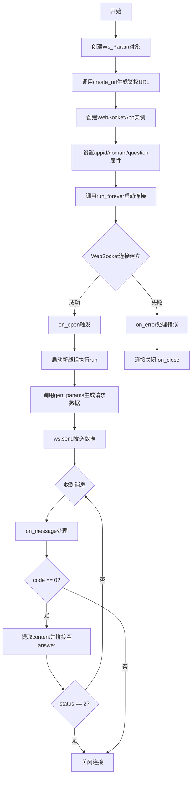

## 类结构

```
Ws_Param (鉴权参数类)
└── 方法: create_url
```

## 全局变量及字段


### `answer`
    
用于累积存储AI返回的回答内容

类型：`str`
    


### `Ws_Param.APPID`
    
讯飞应用ID

类型：`str`
    


### `Ws_Param.APIKey`
    
讯飞API密钥

类型：`str`
    


### `Ws_Param.APISecret`
    
讯飞API密钥秘钥

类型：`str`
    


### `Ws_Param.host`
    
解析后的主机名

类型：`str`
    


### `Ws_Param.path`
    
解析后的路径

类型：`str`
    


### `Ws_Param.Spark_url`
    
星火服务完整URL

类型：`str`
    
    

## 全局函数及方法


### `on_error`

该函数是 WebSocket 的错误回调处理函数，当 WebSocket 连接发生错误时自动被调用，用于捕获并打印错误信息。

参数：

- `ws`：`websocket.WebSocketApp`，WebSocket 客户端实例，用于发送和接收消息
- `error`：任意类型，WebSocket 连接过程中产生的错误对象或错误描述信息

返回值：`None`，该函数不返回任何值，仅执行日志输出操作

#### 流程图

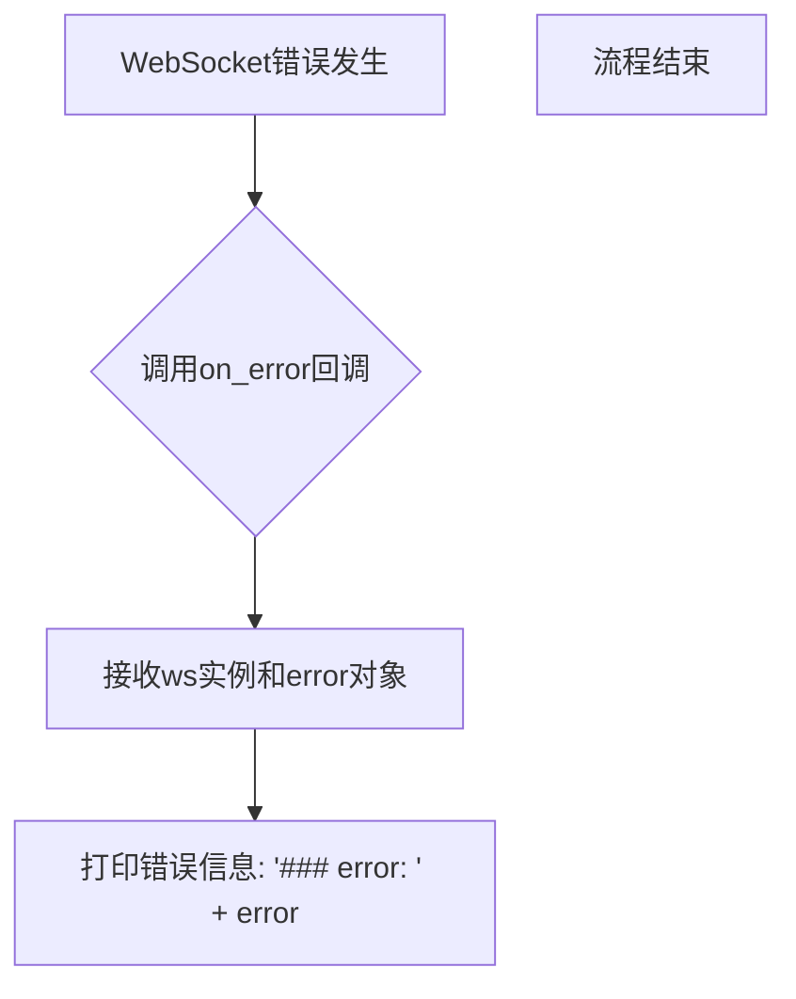

#### 带注释源码

```python
# 收到websocket错误的处理
def on_error(ws, error):
    """
    WebSocket错误回调函数
    当WebSocket连接发生错误时，websocket-client库会自动调用此函数
    
    参数:
        ws: WebSocketApp实例，包含WebSocket连接的相关信息
        error: 错误对象，包含具体的错误信息
    
    返回值:
        无返回值，仅打印错误信息到控制台
    """
    print("### error:", error)
```


### `on_close`

WebSocket 关闭回调函数，当 WebSocket 连接关闭时自动触发，目前实现为简单的空格输出。

参数：

- `ws`：`WebSocketApp`，WebSocket 客户端实例，用于访问 WebSocket 连接对象
- `one`：`int`，WebSocket 关闭时的状态码，表示关闭原因
- `two`：`str`，WebSocket 关闭时的附加信息，描述关闭的具体原因

返回值：`None`，无返回值

#### 流程图

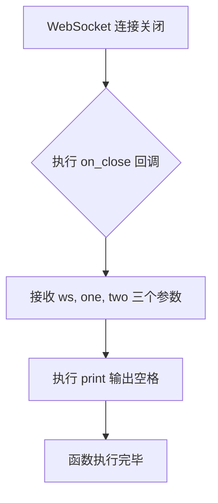

#### 带注释源码

```python
# 收到websocket关闭的处理
def on_close(ws, one, two):
    """
    WebSocket 关闭回调函数
    当 WebSocket 连接被关闭时调用
    
    参数:
        ws: WebSocketApp 实例，WebSocket 客户端对象
        one: 关闭状态码（如 1000 表示正常关闭）
        two: 关闭原因描述字符串
    """
    print(" ")  # 输出空格，保持输出流格式一致性
```


### `on_open`

当WebSocket连接成功建立时，此回调函数被触发，它启动一个新线程来执行`run`函数，以便异步发送用户的问题到星火机器人并接收响应。

参数：

- `ws`：`websocket.WebSocketApp`，WebSocket应用实例，包含appid、domain和question等自定义属性

返回值：`None`，无返回值

#### 流程图

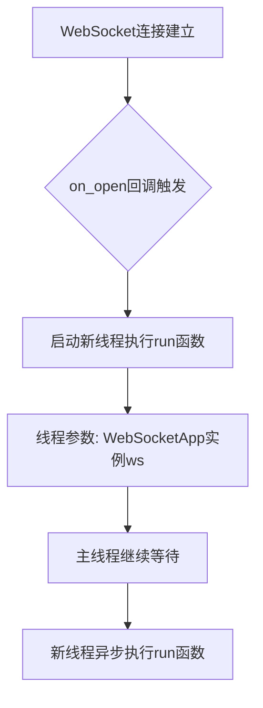

#### 带注释源码

```python
# 收到websocket连接建立的处理
def on_open(ws):
    """
    WebSocket连接建立时的回调函数
    在新线程中启动run函数来处理后续的通信
    
    参数:
        ws: WebSocketApp实例，包含了appid、domain和question等属性
    """
    # 启动一个新的线程来执行run函数，传入ws作为参数
    # 使用_thread模块（Python 2的命名），在Python 3中为thread
    # 这样可以非阻塞地发送数据到服务器
    thread.start_new_thread(run, (ws,))
```


### `run`

该函数是发送消息的线程函数，负责在websocket连接建立后，通过调用参数生成函数构建请求参数，将参数序列化为JSON格式后通过websocket连接发送给星火机器人服务器，实现与机器人的消息交互。

参数：

- `ws`：`websocket.WebSocketApp`，WebSocket应用对象，包含appid、domain和question属性，用于获取发送所需的参数
- `*args`：tuple，可变长度参数列表，用于接收额外的参数（当前未使用）

返回值：`None`，无返回值，仅通过websocket发送数据

#### 流程图

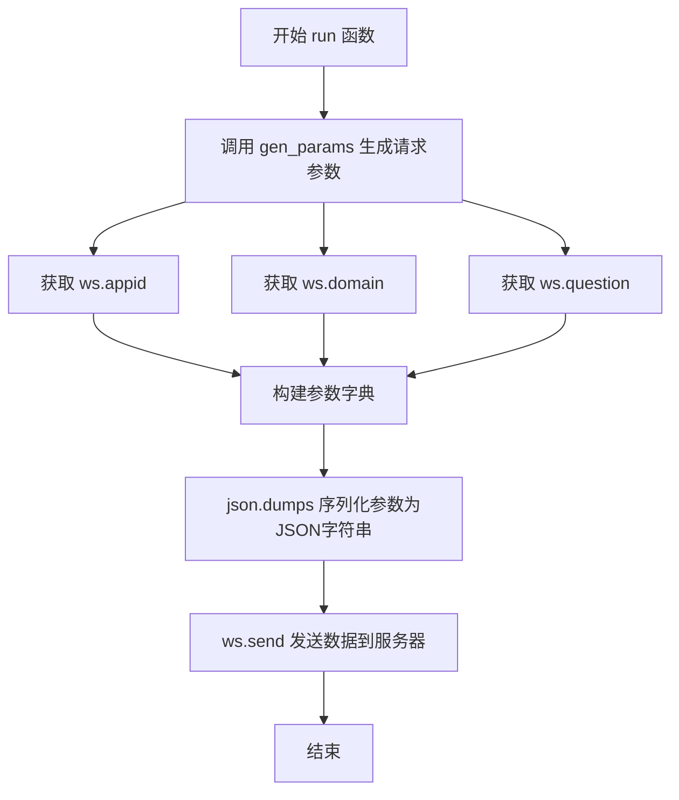

#### 带注释源码

```python
def run(ws, *args):
    """
    发送消息的线程函数
    
    该函数在websocket连接建立后被调用，用于构建并发送聊天请求参数。
    它从websocket应用对象中获取appid、domain和question参数，
    然后将这些参数打包成JSON格式并发送到星火机器人服务器。
    
    Args:
        ws: websocket.WebSocketApp实例，包含appid、domain和question属性
        *args: 可变参数，用于接收额外的参数（当前未被使用）
    
    Returns:
        None: 无返回值，仅通过websocket发送数据
    """
    # 调用gen_params函数生成请求参数，参数来自websocket对象的属性
    # appid: 应用ID，用于标识调用者身份
    # domain: 聊天域/场景，如'generalv2'或'general'
    # question: 用户的问题/消息内容
    data = json.dumps(gen_params(appid=ws.appid, domain=ws.domain, question=ws.question))
    
    # 将JSON字符串通过websocket连接发送到星火服务器
    # 发送的数据包含完整的请求头、参数和消息内容
    ws.send(data)
```


### `on_message`

接收并处理从星火机器人WebSocket返回的消息，解析JSON响应数据，提取对话内容并判断是否完成回复。

参数：

- `ws`：`websocket.WebSocketApp`，WebSocket客户端实例，包含appid、domain和question等属性
- `message`：`str`，从WebSocket服务器接收的JSON格式字符串，包含对话响应数据

返回值：`None`，无返回值，仅处理消息并更新全局状态

#### 流程图

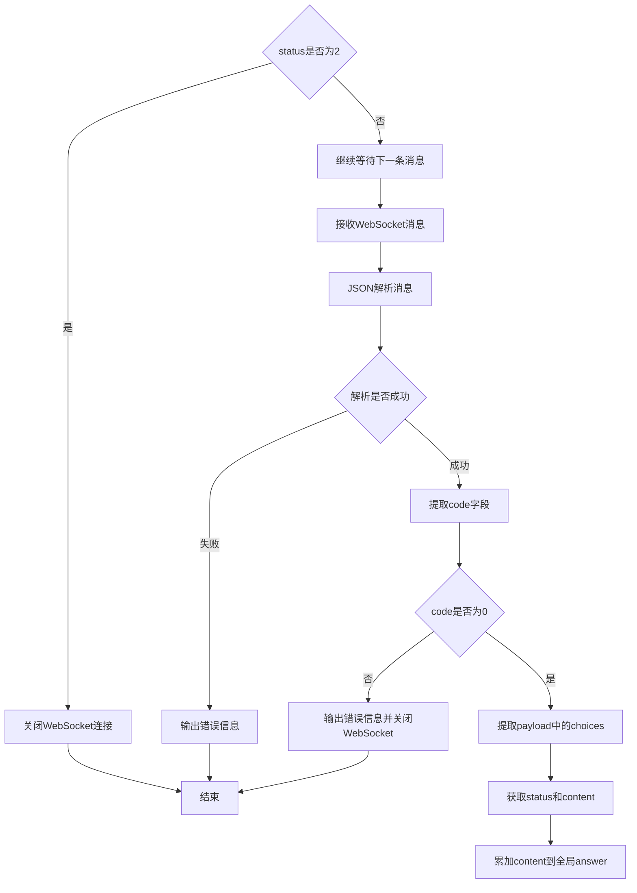

#### 带注释源码

```python
# 收到websocket消息的处理
def on_message(ws, message):
    # 解析接收到的JSON消息为Python字典
    # 参数ws: websocket.WebSocketApp实例
    # 参数message: str类型的JSON字符串，包含星火返回的响应数据
    data = json.loads(message)
    
    # 从响应头中提取状态码
    # code为0表示请求成功，非0表示有错误
    code = data['header']['code']
    
    # 判断是否存在错误
    if code != 0:
        # 打印错误信息，包括错误码和完整响应数据
        print(f'请求错误: {code}, {data}')
        # 关闭WebSocket连接
        ws.close()
    else:
        # 提取响应中的choices内容
        # choices包含status状态和text文本数组
        choices = data["payload"]["choices"]
        
        # 获取对话状态
        # status为2表示对话已完成，为0或其他值表示继续输出
        status = choices["status"]
        
        # 获取对话内容
        # text是一个数组，可能包含多个文本块
        content = choices["text"][0]["content"]
        
        # 使用全局变量answer累加拼接完整的对话内容
        # 这样可以处理分片返回的长回答
        global answer
        answer += content
        
        # 判断对话是否已结束
        # status为2表示服务器已发送完所有响应
        if status == 2:
            # 关闭WebSocket连接，结束会话
            ws.close()
```


### `gen_params`

该函数用于根据应用ID、领域标识和用户问题生成星火大模型的请求参数结构体，包含header、parameter和payload三部分。

参数：

- `appid`：`str`，应用ID，用于标识调用者的身份
- `domain`：`str`，领域/模型类型，指定使用的星火模型
- `question`：`str`，用户提问内容

返回值：`dict`，返回包含header、parameter、payload的请求参数字典，用于WebSocket通信

#### 流程图

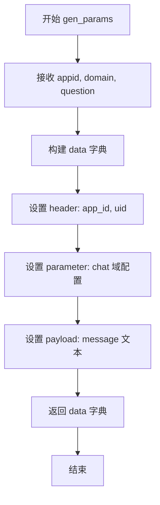

#### 带注释源码

```python
def gen_params(appid, domain, question):
    """
    通过appid和用户的提问来生成请求参数
    
    Args:
        appid: 应用ID，用于标识调用者身份
        domain: 领域/模型类型，如'generalv3.5'
        question: 用户的提问内容
    
    Returns:
        dict: 包含header、parameter、payload的请求参数字典
    """
    # 构建请求参数结构体
    data = {
        # Header部分：包含应用ID和用户ID
        "header": {
            "app_id": appid,      # 应用ID，从参数传入
            "uid": "1234"         # 用户ID，固定为1234
        },
        # Parameter部分：聊天参数配置
        "parameter": {
            "chat": {
                "domain": domain,              # 模型领域，从参数传入
                "random_threshold": 0.5,       # 随机阈值，控制生成多样性
                "max_tokens": 2048,           # 最大token数
                "auditing": "default"          # 审核配置
            }
        },
        # Payload部分：实际的消息内容
        "payload": {
            "message": {
                "text": question               # 用户问题，从参数传入
            }
        }
    }
    # 返回构建好的参数字典
    return data
```


### `main`

该函数是星火机器人WebSocket交互的主入口，通过构建鉴权URL并建立WebSocket连接，发送用户问题并接收星火模型的流式响应，最终完成与星火认知大模型的实时对话交互。

参数：

- `appid`：`str`，星火应用ID，用于标识调用者的应用身份
- `api_key`：`str`，星火API密钥，用于身份验证
- `api_secret`：`str`，星火API密钥私钥，用于生成鉴权签名
- `Spark_url`：`str`，星火WebSocket服务地址
- `domain`：`str`，对话领域/模型版本标识
- `question`：`str`，用户提问内容

返回值：`None`，该函数通过WebSocket回调机制处理响应，主函数本身无返回值

#### 流程图

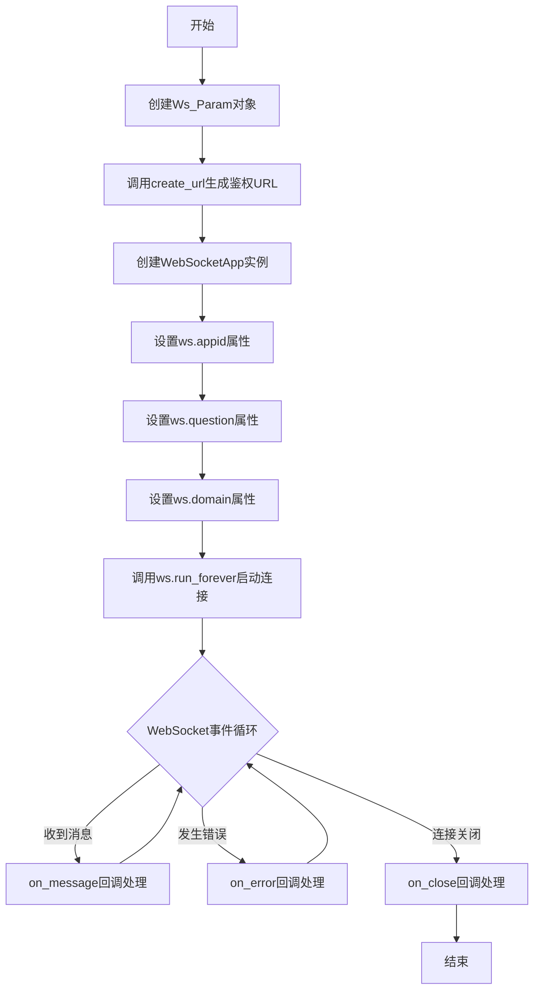

#### 带注释源码

```python
def main(appid, api_key, api_secret, Spark_url, domain, question):
    """
    星火机器人WebSocket交互主入口函数
    
    参数:
        appid: 星火应用ID
        api_key: API密钥
        api_secret: API私钥
        Spark_url: WebSocket服务地址
        domain: 对话领域
        question: 用户问题
    
    返回:
        None: 通过WebSocket回调处理响应
    """
    # 1. 创建鉴权参数对象，用于生成带有鉴权信息的URL
    wsParam = Ws_Param(appid, api_key, api_secret, Spark_url)
    
    # 2. 禁用WebSocket追踪日志输出
    websocket.enableTrace(False)
    
    # 3. 生成带鉴权参数的WebSocket连接URL
    wsUrl = wsParam.create_url()
    
    # 4. 创建WebSocket应用实例，绑定回调函数
    # on_message: 收到消息处理
    # on_error: 错误处理
    # on_close: 关闭处理
    # on_open: 连接建立处理
    ws = websocket.WebSocketApp(
        wsUrl, 
        on_message=on_message, 
        on_error=on_error, 
        on_close=on_close, 
        on_open=on_open
    )
    
    # 5. 将应用ID绑定到WebSocket对象，供回调函数使用
    ws.appid = appid
    
    # 6. 将用户问题绑定到WebSocket对象
    ws.question = question
    
    # 7. 将领域标识绑定到WebSocket对象
    ws.domain = domain
    
    # 8. 启动WebSocket连接，进入事件循环
    # sslopt参数设置SSL验证为可选，适配不同部署环境
    ws.run_forever(sslopt={"cert_reqs": ssl.CERT_NONE})
```


### `Ws_Param.__init__`

该方法是 `Ws_Param` 类的构造函数，用于初始化 WebSocket 连接所需的参数，包括讯飞应用的 APPID、APIKey、APISecret 以及 Spark 服务地址，并解析 URL 获取主机地址和路径信息。

参数：

- `self`：`Ws_Param`，类实例本身
- `APPID`：`str`，讯飞应用的唯一标识 ID
- `APIKey`：`str`，讯飞应用的 API 密钥，用于身份验证
- `APISecret`：`str`，讯飞应用的 API 密钥私钥，用于生成签名
- `Spark_url`：`str`，星火机器人的 WebSocket 连接地址

返回值：`None`，无返回值（`__init__` 方法不返回任何值）

#### 流程图

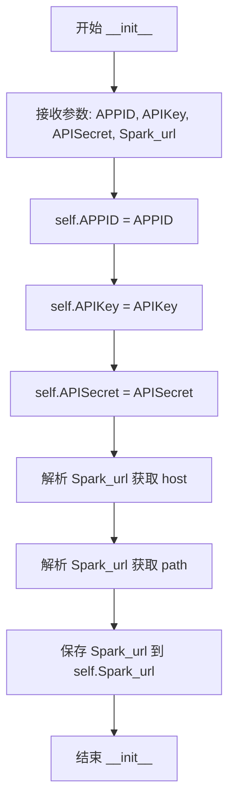

#### 带注释源码

```python
def __init__(self, APPID, APIKey, APISecret, Spark_url):
    # 将传入的 APPID（应用ID）保存为实例属性
    self.APPID = APPID
    
    # 将传入的 APIKey（API密钥）保存为实例属性
    self.APIKey = APIKey
    
    # 将传入的 APISecret（API私钥）保存为实例属性
    self.APISecret = APISecret
    
    # 解析 Spark_url，提取主机名（netloc），例如: spark.xfyun.cn
    self.host = urlparse(Spark_url).netloc
    
    # 解析 Spark_url，提取请求路径（path），例如: /v2.1/chat
    self.path = urlparse(Spark_url).path
    
    # 原始的 WebSocket 连接地址
    self.Spark_url = Spark_url
```


### `Ws_Param.create_url`

该方法用于生成讯飞星火机器人的WebSocket鉴权URL，通过对API密钥进行HMAC-SHA256签名和Base64编码，生成符合讯飞WebSocket接口要求的认证参数，并将参数附加到原始URL上形成完整的可访问地址。

参数：

- `self`：隐含的实例参数，包含以下属性：
  - `APPID`：str，应用ID
  - `APIKey`：str，API密钥
  - `APISecret`：str，API密钥私钥
  - `host`：str，从Spark_url解析出的主机名
  - `path`：str，从Spark_url解析出的路径
  - `Spark_url`：str，原始的星火WebSocket服务URL

返回值：`str`，返回带有完整鉴权参数的WebSocket URL

#### 流程图

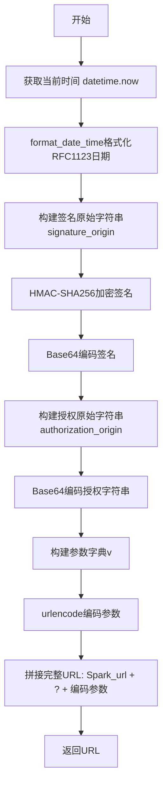

#### 带注释源码

```python
# 生成url
def create_url(self):
    # 步骤1: 生成RFC1123格式的时间戳
    # 获取当前时间
    now = datetime.now()
    # 将时间转换为RFC1123格式的字符串（如: Tue, 05 Dec 2023 10:30:00 GMT）
    date = format_date_time(mktime(now.timetuple()))

    # 步骤2: 拼接签名字符串
    # 按照讯飞要求构建待签名的原始字符串，包含host、date和请求行信息
    signature_origin = "host: " + self.host + "\n"
    signature_origin += "date: " + date + "\n"
    signature_origin += "GET " + self.path + " HTTP/1.1"

    # 步骤3: 使用HMAC-SHA256进行加密
    # 使用APISecret作为密钥，对signature_origin进行HMAC-SHA256加密
    # encode('utf-8')将字符串转换为UTF-8字节
    signature_sha = hmac.new(self.APISecret.encode('utf-8'), signature_origin.encode('utf-8'),
                             digestmod=hashlib.sha256).digest()

    # 步骤4: Base64编码签名
    # 将二进制签名结果转换为Base64字符串
    signature_sha_base64 = base64.b64encode(signature_sha).decode(encoding='utf-8')

    # 步骤5: 构建授权头部原始字符串
    # 包含APIKey、算法标识、头部列表和签名值
    authorization_origin = f'api_key="{self.APIKey}", algorithm="hmac-sha256", headers="host date request-line", signature="{signature_sha_base64}"'

    # 步骤6: Base64编码授权头部
    # 将授权信息整体进行Base64编码，作为最终请求参数
    authorization = base64.b64encode(authorization_origin.encode('utf-8')).decode(encoding='utf-8')

    # 步骤7: 将请求的鉴权参数组合为字典
    # 构建包含authorization、date、host的参数字典
    v = {
        "authorization": authorization,  # Base64编码后的授权信息
        "date": date,                    # RFC1123格式的时间戳
        "host": self.host                # 主机地址
    }

    # 步骤8: 拼接鉴权参数，生成完整URL
    # 将参数字典URL编码后附加到Spark_url后面
    url = self.Spark_url + '?' + urlencode(v)
    
    # 此处打印出建立连接时候的url,参考本demo的时候可取消上方打印的注释，
    # 比对相同参数时生成的url与自己代码生成的url是否一致
    return url
```

## 关键组件


### 一段话描述

该代码是一个基于WebSocket的讯飞星火大模型客户端实现，通过HMAC-SHA256鉴权机制建立与星火机器人的持久连接，支持流式接收AI生成的回答内容，并提供了完整的连接管理、消息处理和错误处理机制。

### 文件的整体运行流程

1. **初始化阶段**：创建`Ws_Param`对象，传入APPID、APIKey、APISecret和Spark_url
2. **URL生成**：调用`create_url()`方法生成带鉴权参数的WebSocket连接URL
3. **连接建立**：创建`WebSocketApp`实例并设置回调函数，调用`run_forever()`建立WebSocket连接
4. **鉴权过程**：服务器验证客户端发送的Authorization和Host、Date头部
5. **消息交互**：通过`on_open`触发发送问题，`on_message`接收并处理回答
6. **连接关闭**：当status为2（回答完成）时主动关闭连接

### 类的详细信息

#### Ws_Param类

**类字段：**

| 名称 | 类型 | 描述 |
|------|------|------|
| APPID | str | 讯飞应用ID |
| APIKey | str | 讯飞API密钥 |
| APISecret | str | 讯飞API密钥私钥 |
| host | str | 从Spark_url解析的主机名 |
| path | str | 从Spark_url解析的路径 |
| Spark_url | str | 讯飞WebSocket服务完整URL |

**类方法：**

##### create_url

- **名称**：create_url
- **参数**：无
- **参数类型**：无
- **参数描述**：无
- **返回值类型**：str
- **返回值描述**：返回带鉴权参数的完整WebSocket连接URL
- **mermaid流程图**：
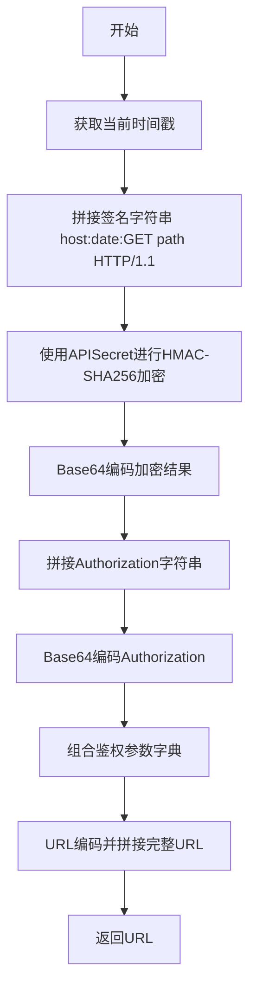
- **带注释源码**：
```python
def create_url(self):
    # 生成RFC1123格式的时间戳
    now = datetime.now()
    date = format_date_time(mktime(now.timetuple()))

    # 拼接签名字符串（包含host、date和请求行）
    signature_origin = "host: " + self.host + "\n"
    signature_origin += "date: " + date + "\n"
    signature_origin += "GET " + self.path + " HTTP/1.1"

    # 使用APISecret作为密钥，对签名字符串进行HMAC-SHA256加密
    signature_sha = hmac.new(self.APISecret.encode('utf-8'), signature_origin.encode('utf-8'),
                             digestmod=hashlib.sha256).digest()

    # Base64编码加密后的签名
    signature_sha_base64 = base64.b64encode(signature_sha).decode(encoding='utf-8')

    # 拼接Authorization字符串（包含APIKey、算法和签名）
    authorization_origin = f'api_key="{self.APIKey}", algorithm="hmac-sha256", headers="host date request-line", signature="{signature_sha_base64}"'

    # Base64编码Authorization字符串
    authorization = base64.b64encode(authorization_origin.encode('utf-8')).decode(encoding='utf-8')

    # 组合鉴权参数字典
    v = {
        "authorization": authorization,
        "date": date,
        "host": self.host
    }
    # 拼接完整URL并返回
    url = self.Spark_url + '?' + urlencode(v)
    return url
```

### 全局函数详细信息

#### on_error

- **名称**：on_error
- **参数名称**：ws, error
- **参数类型**：WebSocketApp, Exception
- **参数描述**：ws是WebSocketApp实例，error是错误信息
- **返回值类型**：None
- **返回值描述**：无返回值，仅打印错误信息

#### on_close

- **名称**：on_close
- **参数名称**：ws, one, two
- **参数类型**：WebSocketApp, int, int
- **参数描述**：ws是WebSocketApp实例，one和two是关闭状态码（参数命名不清晰）
- **返回值类型**：None
- **返回值描述**：无返回值，仅打印空格

#### on_open

- **名称**：on_open
- **参数名称**：ws
- **参数类型**：WebSocketApp
- **参数描述**：WebSocket连接建立时的回调，触发新线程发送消息
- **返回值类型**：None
- **返回值描述**：无返回值，启动新线程调用run函数

#### run

- **名称**：run
- **参数名称**：ws, *args
- **参数类型**：WebSocketApp, tuple
- **参数描述**：在独立线程中运行，生成参数并发送问题到WebSocket
- **返回值类型**：None
- **返回值描述**：无返回值，发送JSON格式的问题数据
- **mermaid流程图**：
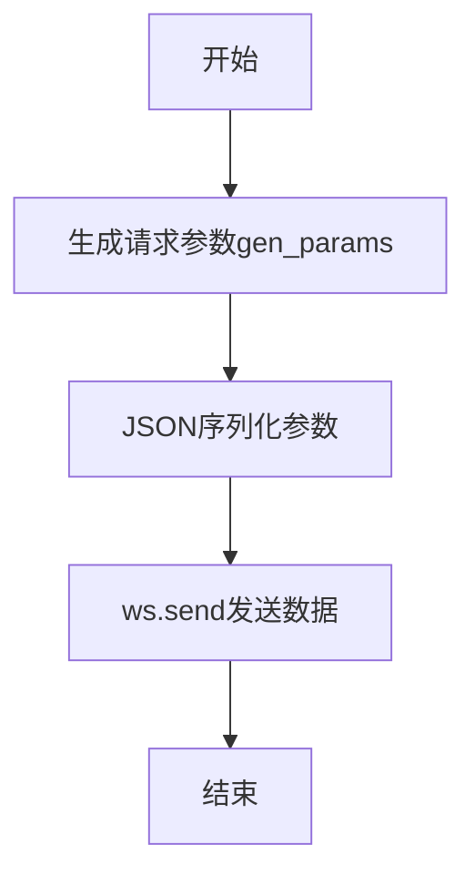
- **带注释源码**：
```python
def run(ws, *args):
    # 将参数转换为JSON格式并发送
    data = json.dumps(gen_params(appid=ws.appid, domain= ws.domain,question=ws.question))
    ws.send(data)
```

#### on_message

- **名称**：on_message
- **参数名称**：ws, message
- **参数类型**：WebSocketApp, str
- **参数描述**：接收并处理服务器返回的消息，解析JSON，检查错误码，累积回答内容
- **返回值类型**：None
- **返回值描述**：无返回值，更新全局answer变量并在回答完成时关闭连接
- **mermaid流程图**：
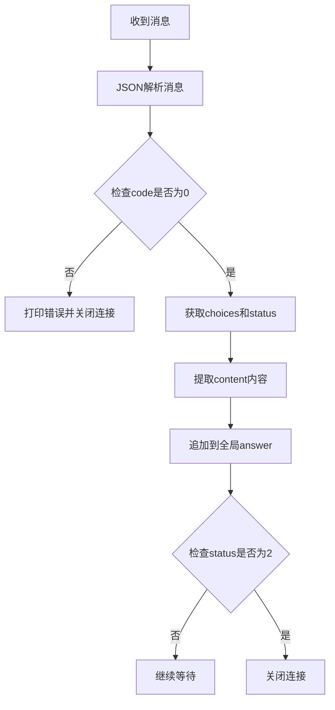
- **带注释源码**：
```python
def on_message(ws, message):
    # 解析JSON消息
    data = json.loads(message)
    # 检查响应状态码
    code = data['header']['code']
    if code != 0:
        # 错误处理，打印错误信息并关闭连接
        print(f'请求错误: {code}, {data}')
        ws.close()
    else:
        # 提取回答内容
        choices = data["payload"]["choices"]
        status = choices["status"]
        content = choices["text"][0]["content"]
        # 累加回答内容到全局变量
        global answer
        answer += content
        # 回答完成（status=2）时关闭连接
        if status == 2:
            ws.close()
```

#### gen_params

- **名称**：gen_params
- **参数名称**：appid, domain, question
- **参数类型**：str, str, str/list
- **参数描述**：生成讯飞星火API所需的请求参数结构
- **返回值类型**：dict
- **返回值描述**：返回包含header、parameter和payload的完整请求参数字典
- **带注释源码**：
```python
def gen_params(appid, domain,question):
    """
    通过appid和用户的提问来生成请求参数
    """
    data = {
        "header": {
            "app_id": appid,
            "uid": "1234"
        },
        "parameter": {
            "chat": {
                "domain": domain,
                "random_threshold": 0.5,
                "max_tokens": 2048,
                "auditing": "default"
            }
        },
        "payload": {
            "message": {
                "text": question
            }
        }
    }
    return data
```

#### main

- **名称**：main
- **参数名称**：appid, api_key, api_secret, Spark_url, domain, question
- **参数类型**：str, str, str, str, str, str/list
- **参数描述**：主入口函数，创建WebSocket连接并运行
- **返回值类型**：None
- **返回值描述**：无返回值，执行完整的WebSocket交互流程

### 全局变量

| 名称 | 类型 | 描述 |
|------|------|------|
| answer | str | 全局变量，用于累积AI返回的回答内容 |

### 关键组件信息

#### WebSocket鉴权组件

负责生成符合讯飞星火API要求的鉴权URL，包含时间戳生成、HMAC-SHA256签名、Base64编码等逻辑

#### 消息处理组件

负责接收、解析服务器响应，提取回答内容，处理错误和连接状态

#### 连接生命周期管理组件

负责WebSocket连接的建立、消息发送、连接关闭等完整生命周期管理

### 潜在的技术债务或优化空间

1. **全局状态问题**：使用全局变量`answer`存储回答内容，不利于多并发场景，应改为实例属性或回调函数传递
2. **错误处理不完善**：仅打印错误信息，缺少重试机制、日志记录和告警通知
3. **参数校验缺失**：对输入参数（appid、api_key等）缺少有效性验证
4. **资源未显式释放**：WebSocket连接关闭时未显式清理资源
5. **线程安全风险**：全局变量answer在多线程环境下存在竞态条件
6. **硬编码配置**：部分参数（如uid、random_threshold、max_tokens）硬编码在gen_params中
7. **日志缺失**：缺少结构化日志，难以追踪问题和监控运行状态

### 其它项目

#### 设计目标与约束

- 目标：实现与讯飞星火大模型的WebSocket实时交互
- 约束：遵循讯飞WebSocket API的鉴权协议和数据格式要求

#### 错误处理与异常设计

- 网络错误通过on_error回调处理
- API返回错误码时打印错误信息并关闭连接
- 缺少超时处理和重试机制

#### 数据流与状态机

```
连接建立 → 发送问题 → 
    ├─ 接收消息（status=1）→ 继续接收 
    └─ 接收消息（status=2）→ 回答完成 → 连接关闭
```

#### 外部依赖与接口契约

- 依赖`websocket-client`库
- 依赖讯飞星火WebSocket API（Spark_url）
- 需要提供有效的APPID、APIKey、APISecret


## 问题及建议


### 已知问题

-   **全局变量answer** - 使用全局变量`answer`存储响应内容，这种方式在多线程或多次调用场景下会导致状态混乱和线程安全问题
-   **过时的线程API** - 使用`thread.start_new_thread`（Python2风格的thread模块），应使用`threading.Thread`替代
-   **SSL验证禁用** - `sslopt={"cert_reqs": ssl.CERT_NONE}`禁用了SSL证书验证，存在中间人攻击安全风险
-   **异常处理缺失** - `on_error`和`on_close`回调函数几乎为空，错误发生时无法有效感知和恢复
-   **资源未正确释放** - WebSocket连接断开后缺乏显式的资源清理逻辑，没有使用try-finally确保连接关闭
-   **缺少输入参数验证** - `main`函数和`Ws_Param`类未对传入的appid、api_key等关键参数进行有效性校验
-   **硬编码值** - `gen_params`函数中`uid`硬编码为"1234"，`random_threshold`固定为0.5，缺乏灵活性
-   **回调参数未使用** - `on_close`函数的参数`one, two`命名模糊且未使用，应明确其含义或删除
-   **缺少类型注解** - 整个代码没有任何类型提示，不利于IDE辅助和代码维护
-   **日志系统缺失** - 仅使用`print`输出，无法满足生产环境日志级别控制和结构化日志需求

### 优化建议

-   将`answer`改为通过回调函数参数传递或作为类成员变量管理，避免全局状态
-   替换为`threading.Thread`并合理设计线程生命周期管理
-   生产环境应配置正确的SSL证书验证，仅在明确可控的测试环境禁用
-   完善`on_error`和`on_close`回调，增加重连机制和错误日志记录
-   使用`try-finally`或上下文管理器确保WebSocket连接正确关闭
-   添加参数校验逻辑，拒绝无效或格式错误的输入
-   将硬编码值提取为配置参数或函数默认参数
-   明确`on_close`参数含义或使用标准参数命名`close_status_code, close_reason`
-   为关键函数和类添加类型注解，提升代码可读性和可维护性
-   引入标准日志模块（`logging`），按DEBUG/INFO/WARNING/ERROR分级记录日志

## 其它


### 设计目标与约束

本代码旨在通过WebSocket协议与讯飞星火大模型进行实时交互，实现流式对话功能。设计目标是提供一个轻量级、易于集成的Python客户端，能够处理认证鉴权、连接管理、消息收发等完整流程。约束条件包括：仅支持Python 3.x环境，依赖websocket-client库，需要有效的讯飞开发者账号凭证（APPID、APIKey、APISecret），且必须使用WebSocket安全连接（WSS）。

### 错误处理与异常设计

代码采用回调函数模式处理错误场景。on_error回调捕获WebSocket连接错误并打印错误信息；on_message中检查响应状态码，非0码时输出错误详情并主动关闭连接。主要错误类型包括：网络连接超时、认证参数生成失败（签名错误）、服务器返回业务错误码（code != 0）、WebSocket连接断开等。当前实现缺少重试机制、断线自动重连逻辑和详细的异常分类，建议增加指数退避重试、连接状态监控和分级异常处理。

### 数据流与状态机

数据流遵循以下路径：main函数初始化Ws_Param参数 → create_url生成鉴权URL → WebSocketApp建立连接 → on_open触发run函数发送请求 → on_message接收并解析响应 → 累加content到全局answer变量 → status==2时关闭连接。状态机包含：连接建立（CONNECTING）→ 认证通过 → 消息传输中（MESSAGE_STREAMING）→ 连接关闭（CLOSED）。当前状态通过status字段（0:进行中/1:持续中/2:完成）判断，无独立状态机实现。

### 外部依赖与接口契约

核心依赖包括：websocket-client（WebSocket客户端）、Python标准库（ssl、hashlib、base64、hmac、json、datetime、urllib）。外部接口为讯飞星火WebSocket API，需提供Spark_url、domain参数（如generalv3）。接口契约规定：请求必须携带符合RFC1123格式的日期、Base64编码的HMAC-SHA256签名、Base64编码的授权信息；响应采用JSON格式，包含header、payload.choices.status和payload.choices.text字段。

### 安全性考虑

当前实现存在以下安全风险：APISecret和APIKey以明文参数传入main函数；sslopt设置cert_reqs=ssl.CERT_NONE禁用了证书验证，存在中间人攻击风险；全局变量answer非线程安全。建议改进：使用环境变量或密钥管理系统存储凭证；启用SSL证书验证；使用threading.Lock保护全局状态；添加请求签名时间戳防重放攻击。

### 性能考虑与优化空间

性能瓶颈包括：单线程顺序处理消息、无消息缓冲队列、全局字符串拼接效率低（answer += content）。优化方向：引入asyncio异步框架提升并发能力；使用StringIO或列表缓冲替代字符串拼接；添加消息确认机制防止丢包；实现连接池支持多并发会话。当前单次对话结束后立即关闭连接，无连接复用机制。

### 配置管理

配置通过函数参数传递（appid、api_key、api_secret、Spark_url、domain），缺乏统一配置管理。建议引入配置类或配置文件，支持从环境变量读取敏感信息，domain参数应提供默认值（如generalv3），max_tokens、random_threshold等业务参数应可配置化。

### 日志设计

当前仅使用print输出调试信息，无结构化日志。建议引入logging模块分级记录：INFO级别记录连接建立、消息收发概要；DEBUG级别记录完整请求响应体；ERROR级别记录异常详情；添加时间戳、线程ID、连接会话ID等上下文信息。

### 版本兼容性

代码依赖websocket-client库，该库版本迭代可能带来API变更。建议锁定依赖版本（如websocket-client>=1.0.0），注明兼容的Python版本范围（建议Python 3.7+），提供requirements.txt或pyproject.toml管理依赖。

### 资源管理与生命周期

WebSocket连接未显式设置超时参数，可能导致连接长时间挂起；thread.start_new_thread创建线程但未提供线程退出机制；SSL上下文未复用。建议添加连接超时（ws.run_forever参数）、请求超时、优雅关闭（ws.close带状态码）、线程池管理、SSL上下文缓存等资源管理机制。

### 测试策略

当前代码缺乏单元测试和集成测试。建议补充：单元测试覆盖gen_params参数生成、Ws_Param.create_url鉴权逻辑；集成测试模拟WebSocket服务器响应；异常场景测试（网络中断、认证失败、服务端报错）；压力测试验证长连接稳定性。


    