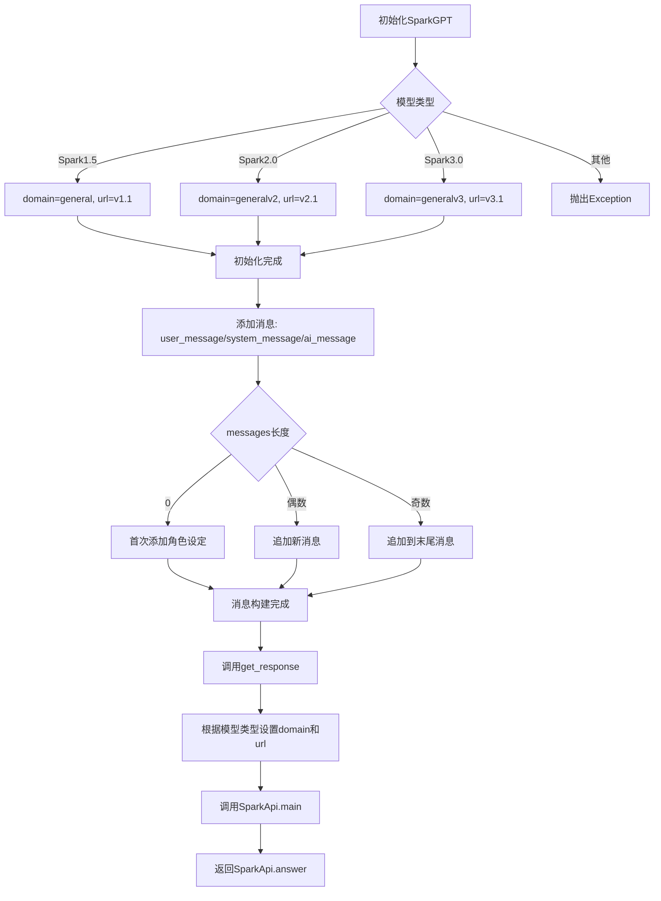
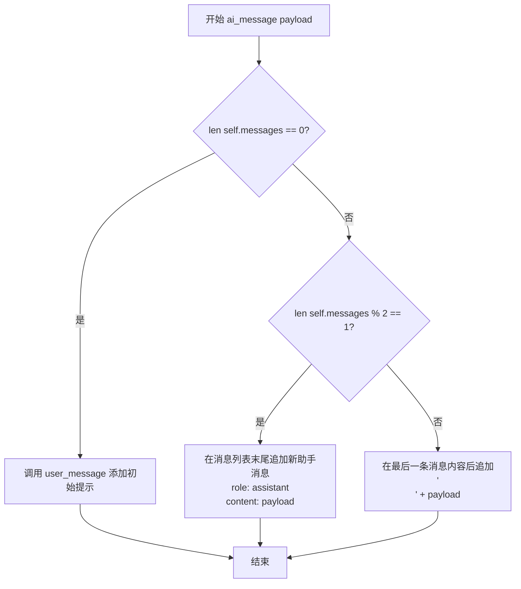
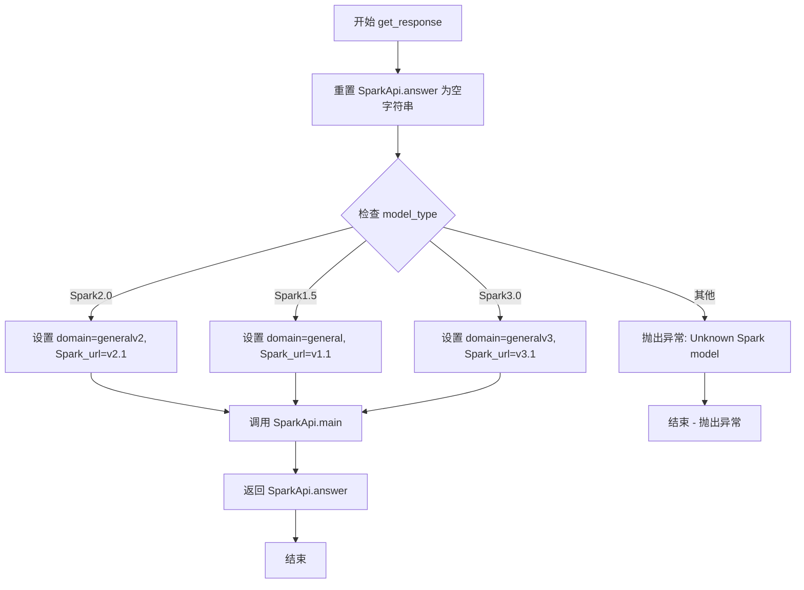
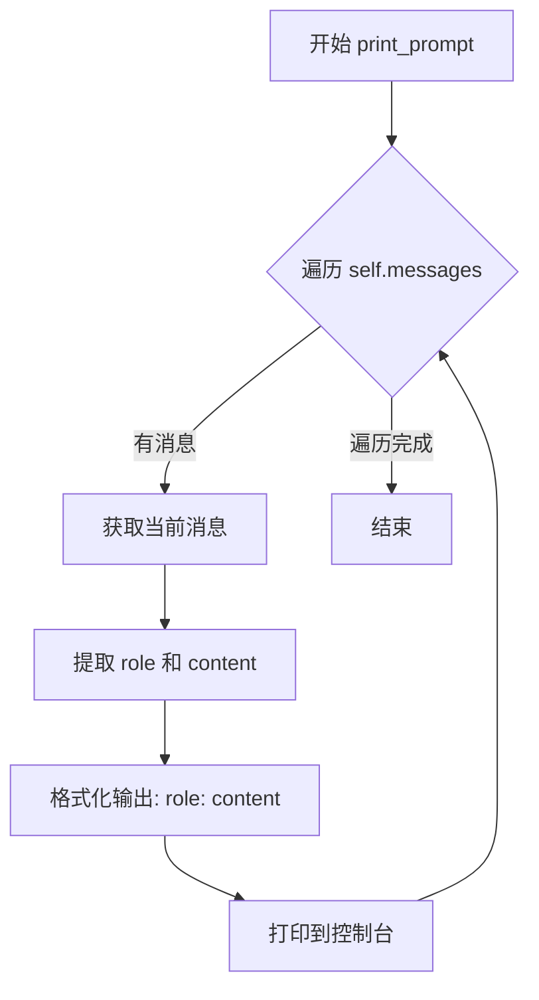

# `Chat-Haruhi-Suzumiya\ChatHaruhi2.0\ChatHaruhi\SparkGPT.py` 详细设计文档

这是讯飞星火大模型的Python SDK封装类，继承自BaseLLM抽象基类，提供了与星火认知智能API交互的接口，支持Spark1.5/Spark2.0/Spark3.0三个版本，通过WebSocket协议进行实时对话，具备消息管理、上下文维护和响应获取等功能。

## 整体流程



## 类结构

```
BaseLLM (抽象基类)
└── SparkGPT (讯飞星火模型实现类)
```

## 全局变量及字段


### `appid`
    
讯飞应用ID，从环境变量获取

类型：`str`
    


### `api_secret`
    
API密钥，从环境变量获取

类型：`str`
    


### `api_key`
    
API密钥，从环境变量获取

类型：`str`
    


### `SparkGPT.model_type`
    
模型类型标识

类型：`str`
    


### `SparkGPT.messages`
    
对话消息列表

类型：`list`
    


### `SparkGPT.domain`
    
API域名

类型：`str`
    


### `SparkGPT.Spark_url`
    
WebSocket连接URL

类型：`str`
    
    

## 全局函数及方法


### SparkGPT.__init__

这是 `SparkGPT` 类的构造函数，用于初始化模型类型并根据不同的模型版本配置对应的 domain 和 URL。

参数：

- `model`：`str`，模型类型，默认为 "Spark3.0"，支持 "Spark1.5"、"Spark2.0"、"Spark3.0" 三种模型

返回值：`None`，无返回值（构造函数）

#### 流程图

```mermaid
flowchart TD
    A[开始 __init__] --> B[调用父类构造函数 super]
    B --> C[设置 self.model_type = model]
    C --> D[初始化 self.messages = []]
    D --> E{判断 model 类型}
    E -->|Spark2.0| F[设置 domain = 'generalv2']
    F --> G[设置 Spark_url = 'ws://spark-api.xf-yun.com/v2.1/chat']
    E -->|Spark1.5| H[设置 domain = 'general']
    H --> I[设置 Spark_url = 'ws://spark-api.xf-yun.com/v1.1/chat']
    E -->|Spark3.0| J[设置 domain = 'generalv3']
    J --> K[设置 Spark_url = 'ws://spark-api.xf-yun.com/v3.1/chat']
    E -->|未知模型| L[抛出 Exception]
    G --> M[结束]
    I --> M
    K --> M
    L --> M
```

#### 带注释源码

```python
def __init__(self, model="Spark3.0"):
    """
    构造函数，初始化 SparkGPT 模型实例
    
    参数:
        model: str, 模型类型，默认为 "Spark3.0"
               支持: "Spark1.5", "Spark2.0", "Spark3.0"
    """
    # 调用父类 BaseLLM 的构造函数进行初始化
    super(SparkGPT,self).__init__()
    
    # 保存传入的模型类型
    self.model_type = model
    
    # 初始化消息列表，用于存储对话历史
    self.messages = []
    
    # 根据不同的模型版本配置对应的 domain 和 URL
    if self.model_type == "Spark2.0":
        self.domain = "generalv2"    # v2.0版本的domain标识
        self.Spark_url = "ws://spark-api.xf-yun.com/v2.1/chat"  # v2.0环境的WebSocket地址
    elif self.model_type == "Spark1.5":
        self.domain = "general"   # v1.5版本的domain标识
        self.Spark_url = "ws://spark-api.xf-yun.com/v1.1/chat"  # v1.5环境的WebSocket地址
    elif self.model_type == "Spark3.0":
        self.domain = "generalv3"   # v3.0版本的domain标识
        self.Spark_url = "ws://spark-api.xf-yun.com/v3.1/chat"  # v3.0环境的WebSocket地址
    else:
        # 如果传入未知模型，抛出异常
        raise Exception("Unknown Spark model")
```


### `SparkGPT.initialize_message`

该方法用于清空SparkGPT实例中的消息列表，将对话历史重置为初始状态，以便开始新的对话会话。

参数：

- `self`：`self`，SparkGPT类的实例本身，由Python自动传递，无需显式调用时指定

返回值：`None`，该方法无返回值，仅执行清空消息列表的操作

#### 流程图

```mermaid
flowchart TD
    A[开始 initialize_message] --> B{执行 self.messages = []}
    B --> C[清空消息列表]
    C --> D[结束]
```

#### 带注释源码

```python
def initialize_message(self):
    """
    清空消息列表，重置对话历史
    """
    self.messages = []  # 将消息列表重置为空列表
```


### `SparkGPT.ai_message`

该方法用于向对话历史中添加AI助手（assistant）生成的消息，支持在已有消息基础上追加内容。方法内部根据当前消息列表的长度判断是新增消息还是追加到最新一条助手消息中。

参数：

- `self`：`SparkGPT` 类实例本身（隐式参数），代表当前大模型调用对象
- `payload`：`str`，需要添加的AI助手消息内容，可以是完整的回复或需要追加的分段内容

返回值：`None`，该方法直接修改实例的 `self.messages` 列表，不返回任何值

#### 流程图



#### 带注释源码

```python
def ai_message(self, payload):
    """
    添加AI助手消息，支持内容追加
    
    逻辑说明：
    - 如果消息列表为空，先添加一个用户系统提示
    - 如果消息列表长度为奇数（最后一条是用户消息），则添加新的助手消息
    - 如果消息列表长度为偶数（最后一条是助手消息），则追加内容到最新助手消息
    """
    # 判断消息列表是否为空
    if len(self.messages) == 0:
        # 消息列表为空时，先添加一个系统用户提示作为开场
        self.user_message("请根据我的要求进行角色扮演:")
    # 判断当前消息列表长度是否为奇数（最后一条是用户消息）
    elif len(self.messages) % 2 == 1:
        # 新增一条助手消息
        self.messages.append({"role":"assistant","content":payload})
    # 判断当前消息列表长度是否为偶数（最后一条是助手消息）
    elif len(self.messages)% 2 == 0:
        # 追加内容到最新的助手消息，使用换行符分隔
        self.messages[-1]["content"] += "\n"+ payload
```


### `SparkGPT.system_message`

该方法用于向聊天消息列表中添加一条系统消息，将传入的 payload 作为用户角色（role="user"）的消息内容添加到实例的 `self.messages` 列表中，以实现对话上下文的初始化。

参数：

- `self`：`SparkGPT`，类实例本身
- `payload`：`str`，需要添加的系统消息内容

返回值：`None`，该方法无返回值，仅修改实例的 `self.messages` 列表

#### 流程图

```mermaid
graph TD
    A[开始 system_message] --> B{接收 payload 参数}
    B --> C[构建消息字典 {"role": "user", "content": payload}]
    C --> D[将消息字典追加到 self.messages 列表]
    D --> E[结束]
```

#### 带注释源码

```python
def system_message(self, payload):
    """
    添加系统消息到消息列表
    注意：当前实现将 role 设置为 'user'，这与常见的大语言模型 API 规范不一致
    （通常 system_message 应该使用 role='system'）
    
    参数:
        payload: str, 要添加的系统消息内容
    返回:
        None
    """
    # 将消息以 user 角色添加到消息列表中
    # 注意：这里使用了 'user' 角色，而非 'system' 角色
    self.messages.append({"role":"user","content":payload}) 
```


### `SparkGPT.user_message(self, payload)`

添加用户消息到消息列表，支持内容追加。当消息列表长度为偶数时添加新消息，为奇数时将内容追加到最后一个用户消息。

参数：

-  `payload`：`str`，用户要添加的消息内容

返回值：`None`，无返回值（修改内部 `self.messages` 列表状态）

#### 流程图

```mermaid
flowchart TD
    A([开始 user_message]) --> B{len(self.messages) % 2 == 0?}
    B -->|是| C[创建新消息字典<br/>{"role":"user","content":payload}]
    C --> D[将新消息添加到列表末尾<br/>self.messages.append]
    B -->|否| E[获取最后一个消息<br/>self.messages[-1]]
    E --> F[追加内容<br/>self.messages[-1]["content"] += "\n" + payload]
    D --> G([结束])
    F --> G
```

#### 带注释源码

```python
def user_message(self, payload):
    """
    添加用户消息到消息列表，支持内容追加
    
    逻辑说明：
    - 当消息列表长度为偶数时（0,2,4...），说明当前没有待追加的用户消息，
      需要创建新的用户消息并添加到列表末尾
    - 当消息列表长度为奇数时（1,3,5...），说明当前最后一个消息是用户消息，
      需要将新内容追加到该消息中，而不是创建新消息
    """
    if len(self.messages) % 2 == 0:
        # 消息列表长度为偶数，创建新的用户消息
        self.messages.append({"role":"user","content":payload})
        # self.messages[-1]["content"] +=  # 这行被注释掉的代码可能是未完成的追加逻辑
    elif len(self.messages)% 2 == 1:
        # 消息列表长度为奇数，将内容追加到最后一个用户消息
        self.messages[-1]["content"] += "\n"+ payload
```


### `SparkGPT.get_response`

该方法用于调用星火API获取对话响应。它首先重置SparkApi的answer为空字符串，然后根据当前模型类型设置对应的domain和WebSocket URL，最后调用`SparkApi.main()`方法发送消息并获取API响应。

参数：

- `self`：`SparkGPT` 类实例，当前SparkGPT对象的引用

返回值：`str`，返回星火API的响应内容（即 `SparkApi.answer`）

#### 流程图



#### 带注释源码

```python
def get_response(self):
    # 重置SparkApi的answer为空字符串，准备接收新的响应
    SparkApi.answer =""
    
    # 根据model_type设置对应的domain和Spark_url
    # 这些信息本应在__init__中设置，此处重复设置表明可能存在代码冗余
    if self.model_type == "Spark2.0":
        self.domain = "generalv2"    # v2.0版本
        self.Spark_url = "ws://spark-api.xf-yun.com/v2.1/chat"  # v2.0环境的地址
    elif self.model_type == "Spark1.5":
        self.domain = "general"   # v1.5版本
        self.Spark_url = "ws://spark-api.xf-yun.com/v1.1/chat"  # v1.5环境的地址
    elif self.model_type == "Spark3.0":
        self.domain = "generalv3"   # v3.0版本
        self.Spark_url = "ws://spark-api.xf-yun.com/v3.1/chat"  # v3.0环境的地址
    else:
        raise Exception("Unknown Spark model")
    
    # 调用星火API的主函数，传入应用凭证和消息历史
    # 参数: appid, api_key, api_secret, Spark_url, domain, messages
    SparkApi.main(appid,api_key,api_secret,self.Spark_url,self.domain,self.messages)
    
    # 返回API的响应内容
    return SparkApi.answer
```


### `SparkGPT.print_prompt`

该方法用于打印当前对话上下文中的所有消息，将每条消息的角色和内容格式化输出到控制台，便于调试和查看对话历史记录。

参数：

- `self`：`SparkGPT`，类的实例本身，包含 `messages` 属性存储对话历史

返回值：`None`，无返回值，仅执行打印操作

#### 流程图



#### 带注释源码

```python
def print_prompt(self):
    """
    打印当前对话上下文中的所有消息
    
    遍历 self.messages 列表中的每条消息，将消息的角色(role)
    和内容(content)格式化后打印到控制台，用于调试和查看对话历史。
    
    参数:
        self: SparkGPT 类的实例
    
    返回值:
        None: 无返回值，仅执行打印操作
    """
    # 遍历消息列表中的每条消息
    for message in self.messages:
        # 格式化打印：角色: 内容
        # message 结构: {"role": "user/assistant/system", "content": "具体内容"}
        print(f"{message['role']}: {message['content']}")
```


## 关键组件


### 模型版本选择与URL映射

根据传入的model参数（Spark1.5/Spark2.0/Spark3.0）动态设置对应的domain和WebSocket API地址，支持多版本切换

### 消息历史管理

通过messages列表维护对话上下文，支持user、assistant、system三种角色消息的添加和累积，提供ai_message、system_message、user_message方法实现对话流管理

### API凭证配置

从操作系统环境变量（APPID、APISecret、APIKey）读取讯飞星火API的认证信息，实现敏感信息的外部化配置

### 对话历史初始化

initialize_message方法重置messages列表为空，实现对话上下文清空功能

### 响应获取与API调用

get_response方法整合SparkApi.main进行实际的大模型API调用，返回模型生成的文本回答，同时在调用前再次确认模型版本配置

### Prompt调试输出

print_prompt方法遍历messages列表并格式化打印每条消息的role和content，用于调试和查看完整对话上下文


## 问题及建议


### 已知问题

-   **代码重复（DRY 原则违反）**：`__init__` 方法和 `get_response` 方法中重复了相同的模型版本判断和 URL 赋值逻辑，导致维护成本增加
-   **环境变量缺少错误处理**：`appid`、`api_secret`、`api_key` 从环境变量直接读取，未做存在性检查，若环境变量不存在会导致程序崩溃且错误信息不友好
-   **全局状态共享问题**：`SparkApi.answer` 作为全局变量被直接赋值和读取，在并发调用场景下会产生竞态条件，导致响应混淆
-   **硬编码配置**：API 端点 URL 和域名以硬编码形式嵌入代码中，不利于配置管理和多环境部署
-   **消息角色管理逻辑混乱**：`ai_message` 方法在消息为空时调用 `user_message` 而非添加 assistant 消息，逻辑不符合常规 chat 协议；`system_message` 方法将系统消息错误地添加为 user 角色
-   **参数校验缺失**：模型类型、消息内容等关键参数缺少输入验证，可能导致 API 调用失败
-   **异常处理不足**：`get_response` 方法调用 `SparkApi.main` 时未捕获可能的网络或 API 异常
-   **命名规范不一致**：类方法使用下划线命名（如 `initialize_message`）而非常见的 snake_case 风格，类字段命名也不统一

### 优化建议

-   将模型版本与 URL 的映射关系提取为类常量或配置字典，消除 `__init__` 和 `get_response` 中的重复代码
-   在模块初始化时添加环境变量存在性检查，提供明确的错误提示或使用默认值/配置加载机制
-   将 `SparkApi.answer` 的读取方式改为函数返回值或回调机制，避免全局状态依赖
-   将 API 端点配置外部化，可通过构造函数参数、配置文件或环境变量注入
-   修正消息角色管理逻辑：`system_message` 应添加 role 为 "system" 的消息，`ai_message` 应始终添加 assistant 角色消息
-   在类方法中添加参数校验，如验证 model_type 是否在支持列表中、消息内容是否为空等
-   在 `get_response` 中添加 try-except 异常处理，捕获网络错误、API 错误等并提供友好反馈
-   统一代码风格，遵循 PEP8 命名规范，增强可读性

## 其它


### 设计目标与约束

本模块旨在封装讯飞星火大模型（Spark）的API调用，为用户提供统一的对话接口。支持多版本模型（Spark1.5/Spark2.0/Spark3.0）的动态切换，遵循LLM对话的典型模式（system/user/assistant消息轮换）。核心约束包括：必须从环境变量读取认证信息（APPID/APISecret/APIKey），仅支持WebSocket通信协议，消息历史需自行维护。

### 错误处理与异常设计

- **认证失败**：环境变量未设置时抛出KeyError
- **模型不支持**：传入非标准model参数时抛出Exception("Unknown Spark model")
- **API调用异常**：SparkApi.main内部异常未捕获，可能导致调用方崩溃
- **消息格式异常**：未对payload进行空值校验或类型检查

### 数据流与状态机

```
初始化 → 添加消息(system/user/ai_message) → 轮询调用get_response 
       → SparkApi发起WebSocket请求 → 接收流式响应 → 返回完整回答
消息状态：偶数索引为user消息，奇数索引为assistant回复
```

### 外部依赖与接口契约

- **SparkApi模块**：依赖其main()函数和answer全局变量进行API调用
- **BaseLLM基类**：需提供初始化方法，代码中调用super().__init__()
- **环境变量**：APPID、APIKey、APISecret必须预先配置
- **WebSocket连接**：目标域名和路径随模型版本动态变化

### 安全性考虑

认证信息通过环境变量注入，避免硬编码。暂无Token刷新机制、无请求频率限制、无敏感信息脱敏。messages内容未经校验直接发送，存在Prompt注入风险。

### 性能考虑

- get_response()为同步阻塞调用，未使用async/await
- 未实现连接池或请求缓存
- 消息历史存储在内存中，无持久化机制
- 未限制messages列表长度，可能导致内存持续增长

### 配置管理

模型选择、API地址、domain均通过代码硬编码。Spark_url和domain在__init__和get_response中存在重复赋值。建议抽取为配置类或配置文件。

### 版本兼容性

Spark1.5/Spark2.0/Spark3.0对应不同的API端点和domain，但代码未区分版本间的功能差异。部分逻辑未考虑向下兼容（如v1.5不支持某些消息角色）。

### 使用示例

```python
spark = SparkGPT("Spark3.0")
spark.system_message("你是一个专业助手")
spark.user_message("请介绍Python语言")
response = spark.get_response()
print(response)
```

### 测试策略建议

- 单元测试：覆盖各model类型的URL映射、消息状态转换逻辑
- 集成测试：Mock SparkApi或使用测试环境API Key验证实际调用
- 异常测试：环境变量缺失、非法model参数、空payload等边界情况

### 部署要求

- Python 3.7+
- 依赖包：SparkApi（需另行安装）
- 环境变量必须在运行时可用
- 服务器需开放WebSocket出站访问（spark-api.xf-yun.com）

    