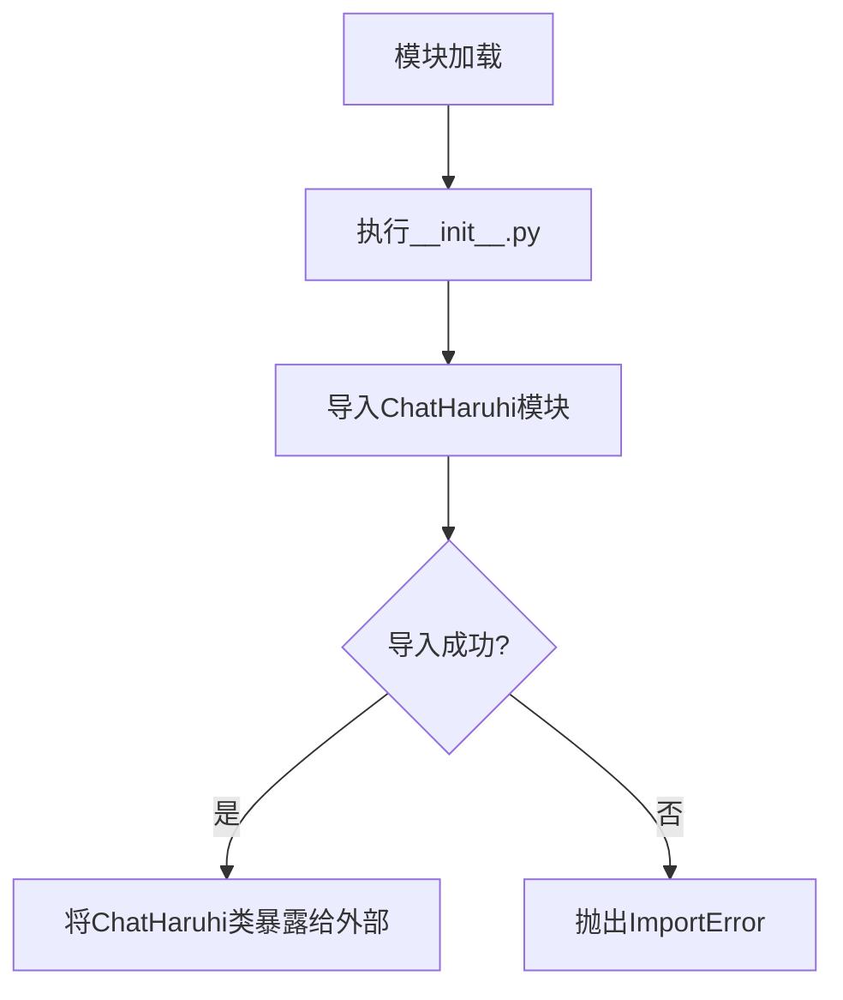

# `Chat-Haruhi-Suzumiya\ChatHaruhi2.0\ChatHaruhi\__init__.py` 详细设计文档

这是ChatHaruhi聊天机器人框架的包初始化文件，通过相对导入的方式从ChatHaruhi模块中引入ChatHaruhi类，作为整个框架的入口点和核心接口。

## 整体流程



## 类结构

```
ChatHaruhi (根包)
└── ChatHaruhi (核心类)
```

## 全局变量及字段


    

## 全局函数及方法


## 关键组件


### ChatHaruhi 模块导入

这是ChatHaruhi项目的入口模块，通过相对导入的方式从同目录下的ChatHaruhi模块中导入ChatHaruhi类，提供统一的接口访问。

### ChatHaruhi 类

这是核心对话类，基于大型语言模型(LLM)实现动漫角色复活功能，能够模拟动漫角色进行对话。


## 问题及建议


### 已知问题

-   **文档冗余**：文件头部包含大量重复的作者信息和项目描述，这些信息在代码注释中重复出现多次，造成信息冗余
-   **缺少模块导出控制**：没有定义`__all__`来明确模块的公共接口，导入行为不明确
-   **错误处理缺失**：直接导入`ChatHaruhi`类，没有任何错误处理机制，如果依赖模块缺失或导入失败，用户只能看到Python原生的ImportError
-   **版本信息硬编码**：版本号(2.0)和项目信息硬编码在注释中，无法通过程序化方式获取版本信息
-   **类型注解缺失**：没有任何类型提示或类型注解，不利于静态分析和IDE支持
-   **缺少依赖声明**：没有明确声明对`ChatHaruhi`模块的具体依赖关系和版本要求
-   **日志记录缺失**：作为库的入口点，没有日志记录机制，无法追踪模块加载状态

### 优化建议

-   **精简文档头**：将重复的作者信息和项目描述移至单独的README或文档文件，仅保留必要的版权和引用信息
-   **添加异常处理**：使用try-except包装导入语句，提供更友好的错误提示
-   **定义__all__**：显式声明公共API，如`__all__ = ['ChatHaruhi']`
-   **提取版本信息**：使用`__version__`变量存储版本号，便于程序化访问
-   **添加类型注解**：为导入语句添加类型提示，考虑使用`from __future__ import annotations`
-   **添加日志模块**：初始化日志记录器，便于用户调试和追踪
-   **考虑lazy import**：如果ChatHaruhi是重型依赖，可考虑延迟导入以加快模块加载速度


## 其它


### 设计目标与约束

本项目旨在通过大型语言模型（LLM）技术实现动漫角色的实时对话复活，支持多角色交互场景。核心约束包括：1）模型需保持角色性格一致性；2）响应延迟需控制在合理范围内；3）需兼容多种LLM后端；4）资源消耗需在可接受范围内。

### 错误处理与异常设计

错误处理机制应包括：LLM API调用超时处理（建议重试机制+降级策略）、角色配置缺失时的默认回退行为、输入验证（防止恶意prompt注入）、网络异常捕获与日志记录、版本兼容性问题处理。异常类设计建议包含ChatHaruhiException基类及其子类：ConfigError、LLMError、CharacterNotFoundError等。

### 数据流与状态机

数据流：用户输入 → 角色识别 → prompt模板组装 → LLM调用 → 响应生成 → 后处理（角色一致性校验） → 输出。状态机应包含：Idle（空闲）、Loading（加载角色配置）、Ready（就绪）、Processing（处理请求）、Error（错误状态）五种状态及状态转换逻辑。

### 外部依赖与接口契约

核心依赖包括：LLM API（如OpenAI GPT、Claude等）、角色配置文件（JSON/YAML格式）、prompt模板系统。接口契约应定义：ChatHaruhi类的主要方法（chat、load_character、switch_character等）、配置结构规范、角色数据模型schema。

### 配置管理

配置系统应包含：LLM API密钥管理（建议使用环境变量或密钥管理服务）、角色配置路径设置、模型参数配置（temperature、max_tokens等）、系统prompt模板自定义、多语言支持配置。

### 性能优化策略

优化方向包括：角色配置缓存机制、LLM响应缓存（避免重复查询）、并发请求管理、批量处理支持、模型推理加速（量化、蒸馏）、连接池管理。

### 安全性设计

安全考量应包括：API密钥保护、输入输出过滤、敏感信息脱敏、角色prompt防注入、速率限制（防止滥用）、日志脱敏处理。

### 测试策略

测试覆盖应包括：单元测试（各模块功能测试）、集成测试（端到端对话流程）、角色一致性测试（长期对话中的性格保持）、性能测试（延迟、吞吐量）、异常场景测试。

### 部署架构

部署建议：支持Docker容器化部署、Kubernetes集群部署、Serverless部署选项。需要考虑的配置：环境变量注入、配置文件挂载、健康检查接口、日志收集、监控指标暴露。

### 版本兼容性

版本策略应包含：API版本管理、配置格式版本控制、向后兼容性策略、升级迁移指南、废弃接口通知机制。


    