# `Chat-Haruhi-Suzumiya\ChatHaruhi2.0\ChatHaruhi\utils.py` 详细设计文档

该代码是一个文本嵌入(Embedding)服务模块，支持多种嵌入模型（Luotuo-Bert、BGE、OpenAI），提供文本向量化、文本审核、Base64编解码等功能，可用于中文和英文文本的语义嵌入处理。

## 整体流程

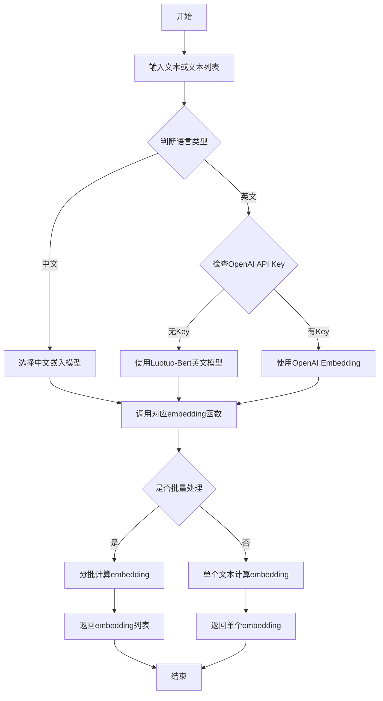

## 类结构

```
全局变量
├── 设备变量: device
├── 模型缓存: _luotuo_model, _luotuo_model_en, _bge_model
├── Tokenizer缓存: _luotuo_en_tokenizer, _bge_tokenizer, _tokenizer_pool
├── 编码器: _enc_model
└── 模型池: _model_pool

全局函数
├── 认证与审核: get_access_token, text_censor
├── 数据打包: package_role
├── Base64编解码: string_to_base64, base64_to_string, float_array_to_base64, base64_to_float_array
├── 通用嵌入: get_general_embeddings, get_general_embedding, get_general_embeddings_safe
├── BGE嵌入: get_bge_zh_embedding, get_bge_embeddings, get_bge_embedding, get_bge_embeddings_safe
├── Luotuo嵌入: luotuo_embedding, luotuo_en_embedding, get_luotuo_model, get_embedding_for_chinese
├── OpenAI嵌入: get_embedding_openai, get_embedding_for_english
├── 混合嵌入: luotuo_openai_embedding
├── 工具函数: tiktokenizer, response_postprocess, is_chinese_or_english, get_cosine_similarity
└── 模型下载: download_models
```

## 全局变量及字段


### `device`
    
torch设备对象，用于确定使用CPU还是GPU进行计算

类型：`torch.device`
    


### `_luotuo_model`
    
中文Luotuo-Bert模型缓存，用于存储已加载的中文嵌入模型

类型：`AutoModel`
    


### `_luotuo_model_en`
    
英文Luotuo-Bert模型缓存，用于存储已加载的英文嵌入模型

类型：`AutoModel`
    


### `_luotuo_en_tokenizer`
    
英文Luotuo-Bert分词器缓存，用于对英文文本进行分词处理

类型：`AutoTokenizer`
    


### `_enc_model`
    
tiktoken编码器实例，用于对文本进行token计数

类型：`tiktoken.Encoding`
    


### `_model_pool`
    
通用模型缓存池，以模型名称为键存储已加载的transformers模型

类型：`dict`
    


### `_tokenizer_pool`
    
通用分词器缓存池，以模型名称为键存储已加载的transformers分词器

类型：`dict`
    


### `_bge_model`
    
BGE英文模型缓存，用于存储已加载的BGE英文嵌入模型

类型：`AutoModel`
    


### `_bge_tokenizer`
    
BGE英文分词器缓存，用于对英文文本进行分词处理

类型：`AutoTokenizer`
    


### `general_batch_size`
    
通用嵌入批处理大小，默认值为16，用于控制通用模型批量处理文本的数量

类型：`int`
    


### `bge_batch_size`
    
BGE嵌入批处理大小，默认值为32，用于控制BGE模型批量处理文本的数量

类型：`int`
    


    

## 全局函数及方法


### `get_access_token`

该函数通过获取环境变量中的百度API密钥（AK/SK），向百度OAuth2.0服务端点发送POST请求，获取用于访问百度AI服务的访问令牌（access_token），是整个百度文本审核流程的鉴权入口。

参数： 无

返回值：`str`，返回百度API的访问令牌（access_token），如果请求失败则返回字符串形式的 "None"

#### 流程图

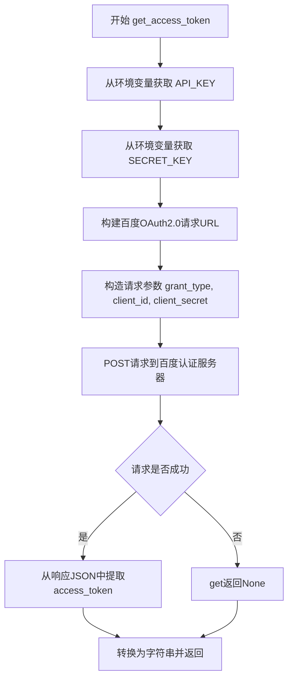

#### 带注释源码

```python
def get_access_token():
    # 从环境变量中读取百度API的访问密钥（Access Key）
    API_KEY = os.getenv("StoryAudit_API_AK")
    
    # 从环境变量中读取百度API的私钥（Secret Key）
    SECRET_KEY = os.getenv("StoryAudit_API_SK")

    """
    使用 AK，SK 生成鉴权签名（Access Token）
    :return: access_token，或是None(如果错误)
    """
    
    # 百度OAuth2.0 token申请接口的URL地址
    url = "https://aip.baidubce.com/oauth/2.0/token"
    
    # 构造请求参数：
    # grant_type: 授权类型，此处为client_credentials（客户端凭证模式）
    # client_id: 对应API_KEY（访问密钥）
    # client_secret: 对应SECRET_KEY（私钥）
    params = {"grant_type": "client_credentials", "client_id": API_KEY, "client_secret": SECRET_KEY}
    
    # 发送POST请求到百度OAuth服务器，获取响应JSON
    # 响应中包含access_token字段，有效期通常为30天
    response = requests.post(url, params=params).json()
    
    # 从响应JSON中提取access_token并转换为字符串返回
    # 如果键不存在，get()返回None，str(None)会得到"None"字符串
    return str(response.get("access_token"))
```


### `text_censor`

该函数是文本内容审核功能的核心实现，通过调用百度文本审核API（text_censor v2版本）对用户输入的文本进行合规性检测。函数接收待审核的文本内容，携带通过AK/SK认证获取的访问令牌向百度内容审核服务端点发送POST请求，解析返回的JSON结果并判断文本是否符合平台内容规范，最终返回布尔值结果以指示文本是否通过审核。

参数：

- `text`：`str`，需要被审核的文本内容

返回值：`bool`，返回 `True` 表示文本内容通过审核（合规），返回 `False` 表示文本内容未通过审核（不合规）

#### 流程图

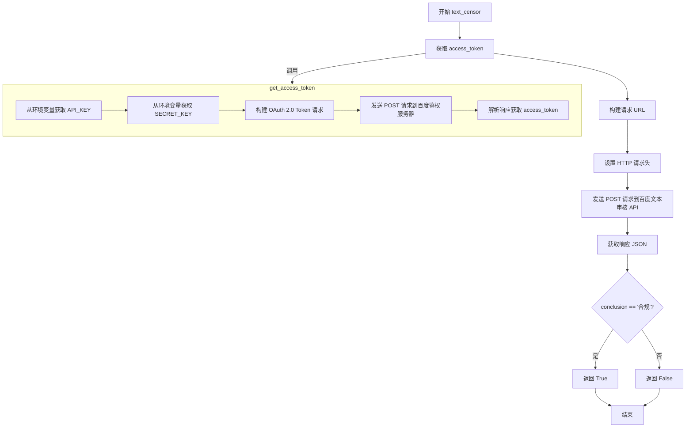

#### 带注释源码

```python
def text_censor(text):
    """
    文本内容审核函数
    调用百度AI内容审核平台对文本进行合规性检测
    
    Args:
        text: str 待审核的文本内容
        
    Returns:
        bool: 文本是否合规，True表示合规，False表示不合规
    """
    # 百度文本审核API的请求地址（用户自定义文本审核）
    request_url = "https://aip.baidubce.com/rest/2.0/solution/v1/text_censor/v2/user_defined"

    # 构建请求参数，text字段包含待审核的文本
    params = {"text": text}
    
    # 调用get_access_token函数获取百度API的访问令牌
    # 该函数通过AK/SK认证获取OAuth 2.0的access_token
    access_token = get_access_token()
    
    # 将access_token拼接到请求URL中
    request_url = request_url + "?access_token=" + access_token
    
    # 设置HTTP请求头，指定内容类型为application/x-www-form-urlencoded
    headers = {'content-type': 'application/x-www-form-urlencoded'}
    
    # 发送POST请求到百度文本审核API
    # data参数用于传递form表单数据
    response = requests.post(request_url, data=params, headers=headers)
    
    # 解析响应JSON，提取conclusion字段
    # conclusion字段的可能值包括："合规"、"不合规"、"疑似"、"审核失败"等
    # 如果结论为"合规"，返回True，否则返回False
    return response.json()["conclusion"] == "合规"
```


### `package_role`

该函数负责将系统提示、配置文件和文本目录中的所有文本文件打包成包含文本内容和对应嵌入向量的数据结构，支持批量处理文本并将其转换为Base64编码的向量格式。

#### 参数

- `system_prompt`：`str`，系统提示文本，用于初始化角色配置
- `texts_path`：`str`，文本文件所在目录路径，函数将遍历该目录下所有`.txt`文件
- `embedding`：`callable`，文本嵌入函数，接受字符串输入并返回向量表示

#### 返回值

- `list`，返回包含字典的列表，每个字典包含原始文本内容（`text`字段）和对应的嵌入向量Base64编码（`embed_name`字段），列表前两个元素分别为系统提示和配置占位符

#### 流程图

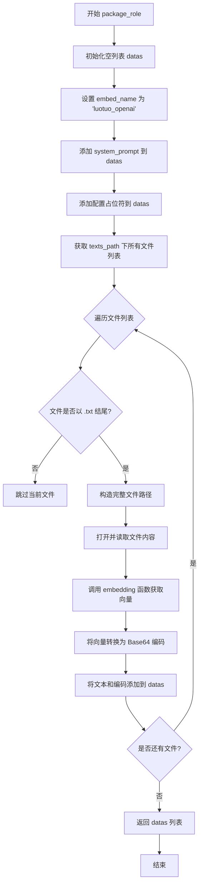

#### 带注释源码

```python
def package_role( system_prompt, texts_path , embedding ):
    """
    打包角色配置文件和文本嵌入
    
    参数:
        system_prompt: str - 系统提示文本
        texts_path: str - 文本文件目录路径
        embedding: callable - 文本嵌入函数
    
    返回:
        list - 包含文本和嵌入向量的字典列表
    """
    datas = []

    # 暂时只有一种embedding 'luotuo_openai'
    embed_name = 'luotuo_openai'

    # 添加系统提示到数据列表，使用 'system_prompt' 作为标识
    datas.append({ 'text':system_prompt , embed_name:'system_prompt'})
    # 添加配置占位符
    datas.append({ 'text':'Reserve Config Setting Here' , embed_name:'config'})
    

    # 获取文本目录下的所有文件
    files = os.listdir(texts_path)

    # 使用 tqdm 显示进度条
    for i in tqdm.tqdm(range(len(files))):
        file = files[i]
        # 检查文件名是否以 txt 结尾
        if file.endswith(".txt"):
            # 拼接完整文件路径
            file_path = os.path.join(texts_path, file)
            # 打开文件并读取内容，使用 UTF-8 编码
            with open(file_path, 'r', encoding='utf-8') as f:
                current_str = f.read()
                # 调用传入的 embedding 函数获取文本向量
                current_vec = embedding(current_str)
                # 将浮点数组转换为 Base64 编码
                encode_vec = float_array_to_base64(current_vec)
                # 将文本内容和编码向量添加到数据列表
                datas.append({ 'text':current_str , embed_name:encode_vec})
    
    return datas
```


### `string_to_base64`

将输入的字符串通过 UTF-8 编码转换为字节数组，再利用 Base64 编码规则将其转换为 Base64 格式的字符串，实现文本到 Base64 的安全传输编码。

参数：

- `text`：`str`，需要进行 Base64 编码的原始字符串

返回值：`str`，返回 Base64 编码后的字符串

#### 流程图

```mermaid
flowchart TD
    A[开始 string_to_base64] --> B[初始化空字节数组 byte_array = b'']
    B --> C{遍历 text 中的每个字符}
    C -->|对每个字符| D[char.encode&#40;'utf-8'&#41; 获取UTF-8字节]
    D --> E[byte_array += num_bytes 追加到字节数组]
    E --> C
    C -->|遍历完成| F[base64.b64encode&#40;byte_array&#41; Base64编码]
    F --> G[base64_data.decode&#40;'utf-8'&#41; 解码为字符串]
    G --> H[返回 Base64 字符串]
    H --> I[结束]
```

#### 带注释源码

```python
def string_to_base64(text):
    """
    将字符串编码为 Base64 格式
    
    该函数首先将输入字符串的每个字符转换为 UTF-8 编码的字节，
    然后将所有字节拼接成完整的字节数组，最后使用 Base64 算法
    将字节数组转换为可打印的 ASCII 字符串。
    
    Args:
        text: 需要进行 Base64 编码的字符串
        
    Returns:
        str: Base64 编码后的字符串，可用于安全传输或存储二进制数据
    """
    # 初始化空字节数组，用于存放字符串的 UTF-8 编码字节
    byte_array = b''
    
    # 遍历输入字符串的每个字符
    for char in text:
        # 将当前字符编码为 UTF-8 字节序列
        # 例如：中文字符 '中' 会编码为 3 个字节 b'\xe4\xb8\xad'
        num_bytes = char.encode('utf-8')
        
        # 将编码后的字节追加到字节数组中
        byte_array += num_bytes
    
    # 使用 base64.b64encode 对整个字节数组进行 Base64 编码
    # 返回的是 base64.b64encode 类型，需要 decode 为 utf-8 字符串
    base64_data = base64.b64encode(byte_array)
    
    # 将 Base64 编码后的字节对象解码为 UTF-8 字符串并返回
    return base64_data.decode('utf-8')
```


### `base64_to_string`

将Base64编码的字符串解码为UTF-8格式的普通文本字符串。

参数：

- `base64_data`：`str`，待解码的Base64编码字符串

返回值：`str`，解码后的UTF-8文本字符串

#### 流程图

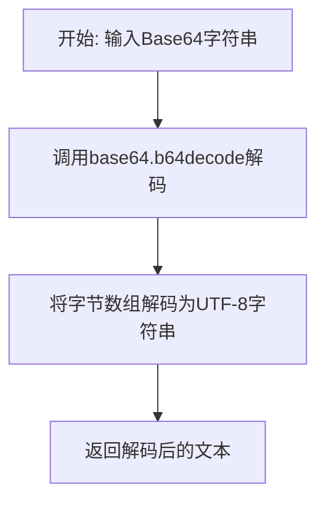

#### 带注释源码

```python
def base64_to_string(base64_data):
    """
    将Base64编码的字符串解码为UTF-8文本
    
    参数:
        base64_data: str - Base64编码的字符串
    
    返回:
        str - 解码后的UTF-8文本字符串
    """
    # 使用base64模块的b64decode函数将Base64字符串解码为字节数组
    byte_array = base64.b64decode(base64_data)
    
    # 将字节数组解码为UTF-8编码的字符串
    text = byte_array.decode('utf-8')
    
    # 返回解码后的文本
    return text
```

#### 配套函数（补充上下文）

该函数通常与 `string_to_base64` 函数配对使用，形成完整的编码-解码流程：

```python
def string_to_base64(text):
    """将UTF-8字符串编码为Base64字符串"""
    byte_array = b''
    for char in text:
        num_bytes = char.encode('utf-8')
        byte_array += num_bytes
    base64_data = base64.b64encode(byte_array)
    return base64_data.decode('utf-8')
```

#### 注意事项

1. **错误处理**：当前实现未处理无效Base64输入的情况，可能抛出 `base64.binascii.Error` 异常
2. **编码限制**：仅支持UTF-8编码的文本，若需支持其他编码需修改解码方式
3. **数据完整性**：该函数假设输入是有效的Base64数据，建议添加异常捕获以增强健壮性


### `float_array_to_base64`

该函数接收一个浮点数列表（float_arr），将每个浮点数使用 struct 模块打包为 4 字节的二进制数据，然后将这些二进制数据拼接成字节数组，最后使用 Base64 编码并将结果解码为 UTF-8 字符串返回。

参数：

- `float_arr`：`list`，输入的浮点数列表，待转换为 Base64 编码的浮点数组

返回值：`str`，返回 Base64 编码后的字符串表示

#### 流程图

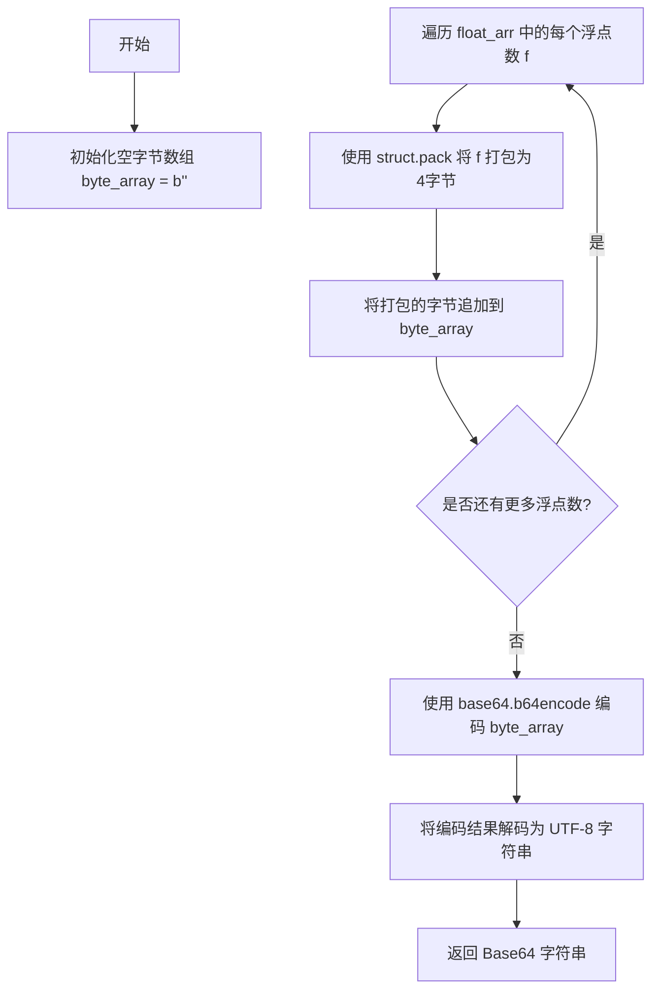

#### 带注释源码

```python
def float_array_to_base64(float_arr):
    """
    将浮点数组转换为Base64编码的字符串
    
    参数:
        float_arr: list, 浮点数列表
    
    返回值:
        str, Base64编码后的字符串
    """
    
    # 初始化一个空的字节数组，用于存储所有浮点数的二进制表示
    byte_array = b''
    
    # 遍历输入的浮点数列表
    for f in float_arr:
        # 将每个浮点数打包为4字节（32位浮点数）
        # '!f' 表示使用网络字节序（大端序）打包为float类型
        num_bytes = struct.pack('!f', f)  
        # 将打包后的字节追加到字节数组中
        byte_array += num_bytes
    
    # 将完整的字节数组进行Base64编码
    base64_data = base64.b64encode(byte_array)
    
    # 将Base64编码的字节对象解码为UTF-8字符串并返回
    return base64_data.decode('utf-8')
```


### `base64_to_float_array`

该函数实现将Base64编码的字符串数据解码并转换为浮点数数组的功能，主要用于处理经过Base64编码的嵌入式向量或embedding数据，通过每4个字节解析为一个32位浮点数的规则，将二进制数据转换为Python列表。

参数：

-  `base64_data`：`str`，待解码的Base64编码字符串，通常由`float_array_to_base64`函数生成

返回值：`list[float]`，返回转换后的32位浮点数数组

#### 流程图

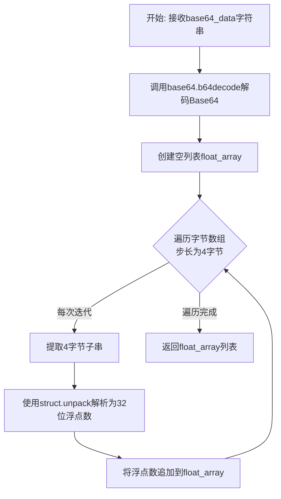

#### 带注释源码

```python
def base64_to_float_array(base64_data):
    """
    将Base64编码的字符串转换为浮点数数组
    
    参数:
        base64_data: str, 经过Base64编码的字符串数据
        
    返回:
        list: 32位浮点数组成的列表
    """
    
    # 第一步：使用base64模块的b64decode函数将Base64字符串解码为原始字节数组
    # Base64是一种基于64个可打印字符来表示二进制数据的编码方式
    byte_array = base64.b64decode(base64_data)
    
    # 初始化一个空列表用于存储解析出的浮点数
    float_array = []
    
    # 第二步：遍历字节数组，每4个字节解析为一个32位浮点数
    # 使用步长为4的循环，32位浮点数占用4个字节
    for i in range(0, len(byte_array), 4):
        # 使用struct.unpack解析单个浮点数
        # '!f'表示使用网络字节序（大端序）解析32位浮点数
        # byte_array[i:i+4]提取连续的4个字节
        # [0]表示取解析结果的第一个元素（unpack返回元组）
        num = struct.unpack('!f', byte_array[i:i+4])[0] 
        
        # 将解析出的浮点数添加到列表中
        float_array.append(num)

    # 返回转换完成的浮点数数组
    return float_array
```


### `get_general_embeddings`

该函数用于获取通用模型的文本嵌入向量，支持通过指定模型名称加载不同的预训练 Transformer 模型（如 BAAI/bge-small-zh-v1.5），并对输入的句子列表进行分词、编码、模型推理、CLS 池化和 L2 归一化处理，最终返回嵌入向量列表。

参数：

- `sentences`：`list`，待编码的句子列表
- `model_name`：`str`，预训练模型的名称，默认为 `"BAAI/bge-small-zh-v1.5"`

返回值：`list`，返回归一化后的嵌入向量列表，每个元素为一个嵌入向量（浮点数列表）

#### 流程图

```mermaid
flowchart TD
    A[开始 get_general_embeddings] --> B{检查 model_name 是否在模型池中}
    B -->|是| C[使用已加载的模型和分词器]
    B -->|否| D[从 transformers 加载 AutoTokenizer 和 AutoModel]
    D --> E[将模型和分词器存入全局池]
    C --> F[设置模型为评估模式 .eval]
    F --> G[使用分词器对 sentences 进行编码]
    G --> H[返回 PyTorch 张量, padding=True, truncation=True, max_length=512]
    H --> I[使用 torch.no_grad() 禁用梯度计算]
    I --> J[调用模型获取输出 model_output]
    J --> K[提取 CLS token 嵌入: model_output[0][:, 0]]
    K --> L[L2 归一化: torch.nn.functional.normalize]
    L --> M[转移到 CPU 并转换为 Python list]
    M --> N[返回嵌入向量列表]
```

#### 带注释源码

```python
def get_general_embeddings(sentences, model_name="BAAI/bge-small-zh-v1.5"):
    """
    获取通用模型嵌入（支持指定模型）
    
    参数:
        sentences (list): 待编码的句子列表
        model_name (str): 预训练模型名称，默认为 BAAI/bge-small-zh-v1.5
    
    返回:
        list: 归一化后的嵌入向量列表
    """
    
    # 声明全局模型池和分词器池，用于缓存已加载的模型
    global _model_pool
    global _tokenizer_pool

    # ======== 1. 模型加载逻辑 ========
    # 检查指定模型是否已经加载到内存中
    if model_name not in _model_pool:
        # 动态导入 transformers 模块
        from transformers import AutoTokenizer, AutoModel
        
        # 从预训练模型加载分词器
        _tokenizer_pool[model_name] = AutoTokenizer.from_pretrained(model_name)
        # 从预训练模型加载模型
        _model_pool[model_name] = AutoModel.from_pretrained(model_name)

    # ======== 2. 模型预处理 ========
    # 设置模型为评估模式，禁用 dropout 等训练特定行为
    _model_pool[model_name].eval()

    # ======== 3. 文本编码 ========
    # 使用分词器对句子列表进行编码
    # padding=True: 填充到批次中最长句子
    # truncation=True: 超过 max_length 的部分截断
    # return_tensors='pt': 返回 PyTorch 张量
    # max_length=512: 最大序列长度限制
    encoded_input = _tokenizer_pool[model_name](
        sentences, 
        padding=True, 
        truncation=True, 
        return_tensors='pt', 
        max_length=512
    )

    # ======== 4. 模型推理 ========
    # 禁用梯度计算以节省内存和计算资源，适用于推理场景
    with torch.no_grad():
        # 将编码后的输入传入模型获取输出
        model_output = _model_pool[model_name](**encoded_input)
        
        # ======== 5. 池化操作 ========
        # 采用 CLS pooling 策略：取第一个 token (CLS) 的隐状态作为句子表示
        # model_output[0] shape: [batch_size, seq_len, hidden_size]
        # model_output[0][:, 0] shape: [batch_size, hidden_size]
        sentence_embeddings = model_output[0][:, 0]

    # ======== 6. 归一化处理 ========
    # 对句子嵌入进行 L2 归一化（p=2 表示二范数，dim=1 按行归一化）
    # 使每个嵌入向量的长度为 1，便于计算余弦相似度
    sentence_embeddings = torch.nn.functional.normalize(
        sentence_embeddings, 
        p=2, 
        dim=1
    )

    # ======== 7. 格式转换 ========
    # 将 PyTorch 张量转移到 CPU，转换为 Python 列表返回
    return sentence_embeddings.cpu().tolist()
```


### `get_general_embedding`

获取单个或多个文本的通用嵌入向量，根据输入类型自动选择处理方式：单个字符串直接调用模型推理，字符串列表则通过分批安全处理后返回嵌入结果。

参数：

- `text_or_texts`：`str` 或 `list`，待嵌入的文本，单个字符串或字符串列表
- `model_name`：`str`，模型名称，默认为 `"BAAI/bge-small-zh-v1.5"`

返回值：`list`，嵌入向量列表

#### 流程图

```mermaid
flowchart TD
    A[开始 get_general_embedding] --> B{text_or_texts 是否为字符串?}
    B -->|是| C[调用 get_general_embeddings([text_or_texts], model_name)]
    C --> D[取返回结果的第一项]
    D --> E[返回单个嵌入向量]
    B -->|否| F[调用 get_general_embeddings_safe(text_or_texts, model_name)]
    F --> G[分批处理文本列表]
    G --> H[返回嵌入向量列表]
    E --> I[结束]
    H --> I
```

#### 带注释源码

```python
def get_general_embedding(text_or_texts, model_name="BAAI/bge-small-zh-v1.5"):
    """
    获取单个或多个文本的通用嵌入向量
    
    参数:
        text_or_texts: str 或 list, 输入文本, 单个字符串或字符串列表
        model_name: str, 模型名称, 默认为 "BAAI/bge-small-zh-v1.5"
    
    返回:
        list: 嵌入向量列表
    """
    # 判断输入是否为字符串类型
    if isinstance(text_or_texts, str):
        # 字符串类型: 包装为单元素列表调用 get_general_embeddings
        # 取返回结果的第一项(因为输入是单个文本)
        return get_general_embeddings([text_or_texts], model_name)[0]
    else:
        # 列表类型: 调用 get_general_embeddings_safe 进行分批处理
        return get_general_embeddings_safe(text_or_texts, model_name)
```


### `get_general_embeddings_safe`

安全批量获取通用嵌入向量，带有进度条显示的函数。该函数接收句子列表和模型名称，将句子列表按批次分割后调用底层嵌入模型进行向量化处理，并通过 tqdm 进度条实时显示处理进度，最终返回所有句子的嵌入向量列表。

参数：

- `sentences`：`list`，待嵌入的句子列表，每个元素为字符串类型
- `model_name`：`str`，嵌入模型的名称，默认为 "BAAI/bge-small-zh-v1.5"（BAAI/bge-small-zh-v1.5 模型）

返回值：`list`，返回嵌套的浮点数列表（即二维列表），内层列表为每个句子对应的嵌入向量

#### 流程图

```mermaid
flowchart TD
    A[开始 get_general_embeddings_safe] --> B[计算总批次数<br/>num_batches = ceil(len/sentences / general_batch_size)]
    B --> C[初始化空列表 embeddings]
    C --> D{遍历进度条 range num_batches}
    D -->|当前批次 i| E[计算起始索引 start_index = i * general_batch_size]
    E --> F[计算结束索引 end_index = minlen, start_index + general_batch_size]
    F --> G[提取当前批次句子 batch = sentences[start_index:end_index]]
    G --> H[调用 get_general_embeddingsbatch, model_name]
    H --> I[获取当前批次嵌入向量 embs]
    I --> J[embeddings.extendembs]
    J --> D
    D --> K{所有批次处理完成?}
    K -->|是| L[返回 embeddings 列表]
    L --> M[结束]
```

#### 带注释源码

```python
def get_general_embeddings_safe(sentences, model_name = "BAAI/bge-small-zh-v1.5"):
    """
    安全批量获取通用嵌入向量（带进度条）
    
    参数:
        sentences: list, 待嵌入的句子列表
        model_name: str, 嵌入模型名称，默认为 BAAI/bge-small-zh-v1.5
    
    返回:
        list: 嵌套的浮点数列表，每个内层列表代表一个句子的嵌入向量
    """
    
    # 初始化用于存储所有嵌入向量的空列表
    embeddings = []
    
    # 计算需要的总批次数，使用向上取整确保所有句子都被处理
    # general_batch_size 在代码中定义为 16
    num_batches = math.ceil(len(sentences) / general_batch_size)
    
    # 使用 tqdm 进度条遍历每个批次
    for i in tqdm.tqdm( range(num_batches) ):
        # 计算当前批次的起始索引
        start_index = i * general_batch_size
        # 计算当前批次的结束索引，确保不超出列表长度
        end_index = min(len(sentences), start_index + general_batch_size)
        # 提取当前批次的句子列表
        batch = sentences[start_index:end_index]
        # 调用底层函数获取当前批次的嵌入向量
        embs = get_general_embeddings(batch, model_name)
        # 将当前批次的嵌入向量添加到结果列表中
        
        
        embeddings.extend(embs)
        
    # 返回所有句子的嵌入向量
    return embeddings
```


### `get_bge_zh_embedding`

获取中文BGE嵌入的入口函数，通过调用通用嵌入接口，使用BAAI/bge-small-zh-v1.5模型生成中文文本的向量表示。

参数：

- `text_or_texts`：`str | list`，要获取嵌入的单个文本或文本列表

返回值：`list`，返回嵌入向量列表。如果输入是单个字符串，返回单个嵌入向量；如果输入是列表，返回嵌入向量列表。

#### 流程图

```mermaid
flowchart TD
    A[开始: get_bge_zh_embedding] --> B{text_or_texts是否为字符串?}
    B -- 是 --> C[调用get_general_embedding<br/>参数: [text_or_texts], model_name]
    B -- 否 --> D[调用get_general_embeddings_safe<br/>参数: text_or_texts, model_name]
    C --> E[调用get_general_embeddings<br/>单文本批处理]
    D --> F{计算batch数量}
    F --> G[遍历每个batch]
    G --> H[调用get_general_embeddings<br/>批量处理]
    H --> I[收集所有嵌入向量]
    E --> J[返回嵌入向量]
    I --> J
    J --> K[结束: 返回list]
    
    style A fill:#f9f,color:#333
    style J fill:#9f9,color:#333
```

#### 带注释源码

```python
def get_bge_zh_embedding(text_or_texts):
    """
    获取中文BGE嵌入的主入口函数
    
    该函数是中文嵌入的简单封装，内部调用通用的get_general_embedding函数，
    固定使用BAAI/bge-small-zh-v1.5模型进行中文文本嵌入计算。
    
    参数:
        text_or_texts: str或list
            - 当为str时: 单个文本字符串，返回单个嵌入向量
            - 当为list时: 文本列表，返回嵌入向量列表
    
    返回:
        list
            - 输入为str时: 返回单个嵌入向量列表(浮点数列表)
            - 输入为list时: 返回嵌入向量列表(每个元素是浮点数列表)
    """
    # 调用通用嵌入函数，指定使用BAAI/bge-small-zh-v1.5中文embedding模型
    return get_general_embedding(text_or_texts, "BAAI/bge-small-zh-v1.5")
```

#### 相关依赖函数

该函数内部调用的 `get_general_embedding` 实现如下：

```python
def get_general_embedding(text_or_texts, model_name="BAAI/bge-small-zh-v1.5"):
    """
    通用嵌入获取函数，处理单文本和批量文本
    
    参数:
        text_or_texts: str或list - 输入文本
        model_name: str - 模型名称，默认为BAAI/bge-small-zh-v1.5
    
    返回:
        list - 嵌入向量
    """
    # 如果是字符串，包装为单元素列表处理
    if isinstance(text_or_texts, str):
        # 调用批量处理函数并取第一个结果
        return get_general_embeddings([text_or_texts], model_name)[0]
    else:
        # 如果是列表，调用安全的批量处理函数
        return get_general_embeddings_safe(text_or_texts, model_name)
```


### `get_bge_embeddings`

获取BGE英文模型（bge-small-en-v1.5）的句子嵌入向量，通过加载预训练模型、对输入句子进行Tokenize、模型推理、CLS pooling和L2归一化处理，最终返回归一化后的句子嵌入列表。

参数：

- `sentences`：`list`，待编码的句子列表，每个元素为字符串

返回值：`list`，返回嵌套的浮点数列表，每个子列表表示对应输入句子的嵌入向量（维度为模型隐藏层大小，经过L2归一化）

#### 流程图

```mermaid
flowchart TD
    A[开始: get_bge_embeddings] --> B{检查全局模型是否已加载}
    B -->|否| C[从 transformers 加载 AutoTokenizer 和 AutoModel]
    B -->|是| D[跳过模型加载]
    C --> E[设置模型为评估模式 eval]
    D --> E
    E --> F[使用 tokenizer 对句子进行编码]
    F --> G[配置参数: padding=True, truncation=True, return_tensors='pt', max_length=512]
    G --> H[使用 torch.no_grad() 禁用梯度计算]
    H --> I[调用模型获取输出]
    I --> J[执行 CLS Pooling: 取第一个 token 的输出]
    J --> K[L2 归一化 embeddings]
    K --> L[转换 tensor 为 Python list]
    L --> M[返回 embeddings 列表]
```

#### 带注释源码

```python
def get_bge_embeddings( sentences ):
    # unsafe ensure batch size by yourself
    # 注意：调用方需自行保证 batch size 在合理范围内，函数本身不做分批处理

    # 声明使用全局变量（模型和分词器缓存）
    global _bge_model
    global _bge_tokenizer

    # 延迟加载：仅在首次调用时加载模型和分词器
    if _bge_model is None:
        # 动态导入 transformers 模块
        from transformers import AutoTokenizer, AutoModel
        # 加载 BGE 英文小模型 (bge-small-en-v1.5) 的分词器和模型
        _bge_tokenizer = AutoTokenizer.from_pretrained('BAAI/bge-small-en-v1.5')
        _bge_model = AutoModel.from_pretrained('BAAI/bge-small-en-v1.5')

    # 切换模型为评估模式，禁用 dropout 等训练时的随机操作
    _bge_model.eval()

    # 使用分词器对输入句子列表进行编码
    # padding=True: 补齐至批次最长句子
    # truncation=True: 超过 max_length 的句子进行截断
    # return_tensors='pt': 返回 PyTorch Tensor
    # max_length=512: 最大 token 长度限制
    encoded_input = _bge_tokenizer(sentences, padding=True, truncation=True, return_tensors='pt', max_length = 512)

    # 计算 token 嵌入向量
    # 使用 torch.no_grad() 上下文管理器，禁用梯度计算以节省显存和计算资源
    with torch.no_grad():
        # 将编码后的输入传入模型，获取模型输出
        model_output = _bge_model(**encoded_input)
        # 执行 CLS Pooling：取每个句子第一个 token (CLS) 的隐藏状态作为句子表示
        sentence_embeddings = model_output[0][:, 0]

    # 对句子嵌入向量进行 L2 归一化（p=2 表示二范数，dim=1 按行归一化）
    sentence_embeddings = torch.nn.functional.normalize(sentence_embeddings, p=2, dim=1)
    
    # 将 PyTorch Tensor 转换为 Python 列表并返回
    return sentence_embeddings.cpu().tolist()
```


### `get_bge_embedding`

获取单个BGE嵌入向量的核心函数，支持处理单条文本或文本列表，自动路由到对应的嵌入生成方法。

参数：

- `text_or_texts`：`str | list`，待嵌入的文本（单条字符串或字符串列表）

返回值：`list`，嵌入向量列表（单条文本返回单个向量，列表返回向量列表）

#### 流程图

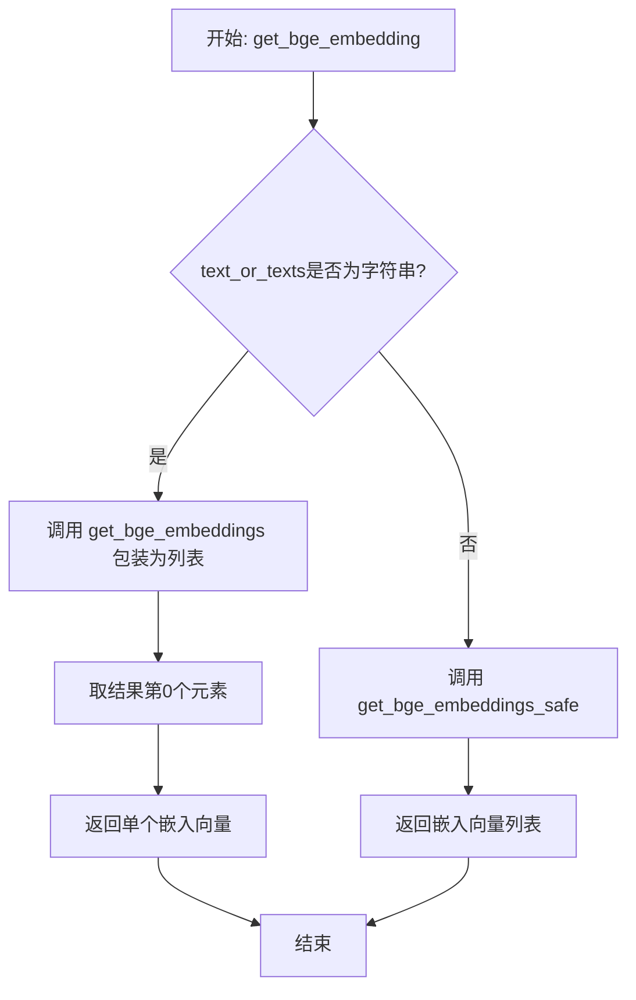

#### 带注释源码

```python
def get_bge_embedding( text_or_texts ):
    """
    获取单个BGE嵌入向量
    
    该函数是BGE英文嵌入模型的入口函数，根据输入类型自动选择：
    - 单条文本(str): 调用get_bge_embeddings获取单条嵌入
    - 文本列表(list): 调用get_bge_embeddings_safe批量获取嵌入
    
    参数:
        text_or_texts: str或list, 待嵌入的文本或文本列表
        
    返回:
        list: 嵌入向量列表
    """
    # 判断输入是否为字符串类型
    if isinstance(text_or_texts, str):
        # 单条文本处理: 包装为列表后调用批量函数,取第一个结果
        return get_bge_embeddings([text_or_texts])[0]
    else:
        # 列表输入: 调用安全的批量嵌入函数
        return get_bge_embeddings_safe(text_or_texts)
```


### `get_bge_embeddings_safe`

安全批量获取BGE嵌入，通过分批处理的方式避免内存溢出，并使用tqdm显示处理进度。

参数：

-  `sentences`：`list`，待嵌入的文本列表

返回值：`list`，嵌入向量列表，每个元素为一个文本的嵌入向量

#### 流程图

```mermaid
flowchart TD
    A[开始: get_bge_embeddings_safe] --> B[初始化空列表 embeddings]
    B --> C[计算批次数量: num_batches = ceil(len(sentences) / bge_batch_size)]
    C --> D{遍历 i from 0 to num_batches-1}
    D -->|每次迭代| E[计算起始索引: start_index = i * bge_batch_size]
    E --> F[计算结束索引: end_index = min(len(sentences), start_index + bge_batch_size)]
    F --> G[切片获取当前批次: batch = sentences[start_index:end_index]]
    G --> H[调用 get_bge_embeddings 获取批次嵌入: embs = get_bge_embeddings(batch)]
    H --> I[将批次嵌入添加到结果列表: embeddings.extend(embs)]
    I --> D
    D -->|遍历完成| J[返回 embeddings 列表]
    J --> K[结束]
```

#### 带注释源码

```
def get_bge_embeddings_safe(sentences):
    """
    安全批量获取BGE嵌入，通过分批处理避免内存溢出
    
    参数:
        sentences: list - 待嵌入的文本列表
    
    返回:
        list - 嵌入向量列表
    """
    
    # 初始化结果列表，用于存储所有文本的嵌入向量
    embeddings = []
    
    # 计算总批次数，使用向上取整确保处理所有文本
    # bge_batch_size 在代码中定义为 32
    num_batches = math.ceil(len(sentences) / bge_batch_size)
    
    # 遍历每个批次，使用tqdm显示进度
    for i in tqdm.tqdm( range(num_batches) ):
        # 计算当前批次的起始索引
        start_index = i * bge_batch_size
        
        # 计算当前批次的结束索引，确保不超出列表范围
        end_index = min(len(sentences), start_index + bge_batch_size)
        
        # 切片获取当前批次的文本
        batch = sentences[start_index:end_index]
        
        # 调用底层函数获取当前批次的嵌入向量
        embs = get_bge_embeddings(batch)
        
        # 将当前批次的嵌入向量扩展到结果列表中
        embeddings.extend(embs)
        
    # 返回所有文本的嵌入向量列表
    return embeddings
```


### `tiktokenizer`

使用 tiktoken 库的 cl100k_base 编码模型对输入文本进行分词（tokenize），并返回文本对应的 token 数量。

参数：

- `text`：`str`，待计算 token 数量的文本字符串

返回值：`int`，文本经过 tokenize 后的 token 数量

#### 流程图

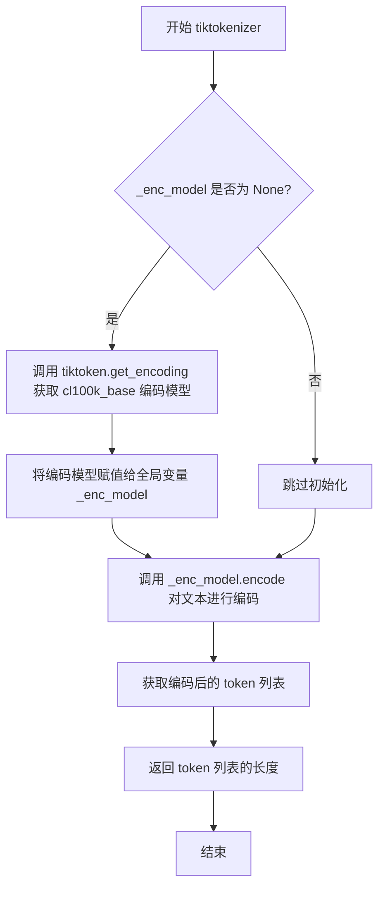

#### 带注释源码

```python
def tiktokenizer( text ):
    """
    使用 tiktoken 计算文本的 token 数量
    
    参数:
        text: str, 待计算 token 数量的文本
        
    返回值:
        int, 文本对应的 token 数量
    """
    global _enc_model  # 全局变量，用于缓存编码模型实例

    # 如果编码模型尚未初始化，则进行初始化
    if _enc_model is None:
        # 使用 tiktoken 获取 cl100k_base 编码模型
        # cl100k_base 是 GPT-4/GPT-3.5 Turbo 使用的编码
        _enc_model = tiktoken.get_encoding("cl100k_base")

    # 对输入文本进行编码，并返回编码后的 token 列表长度
    return len(_enc_model.encode(text))
```


### `response_postprocess`

该函数用于后处理对话响应格式，将多行对话文本重新格式化为统一的"说话者:「对话内容」"格式，支持识别并合并相同说话者的连续对话内容。

参数：

- `text`：`str`，输入的待处理对话文本
- `dialogue_bra_token`：`str`（默认 `'「'`），对话内容起始标记token
- `dialogue_ket_token`：`str`（默认 `'」'`），对话内容结束标记token

返回值：`str`，处理后的格式化对话字符串

#### 流程图

```mermaid
flowchart TD
    A[开始: response_postprocess] --> B[将text按换行符分割为lines]
    B --> C[初始化 new_lines = '' 和 first_name = None]
    C --> D{遍历lines中的每一行line}
    D -->|当前行| E[去除line首尾空格]
    E --> F[使用正则匹配: ^.*?[:：]bra_token.*?ket_token$]
    F --> G{匹配是否成功}
    
    G -->|是| H[提取说话者名称curr_name和对话内容match.group(2)]
    G -->|否| I{first_name是否为None}
    
    H --> J{first_name是否为None}
    J -->|是| K[设置first_name = curr_name<br/>new_lines += 对话内容]
    J -->|否| L{curr_name == first_name}
    
    L -->|是| M[new_lines += 对话内容]
    L -->|否| N[返回 first_name + ':' + bra_token + new_lines + ket_token]
    
    I -->|是| O[返回原始text]
    I -->|否| P[返回 first_name + ':' + bra_token + new_lines + ket_token]
    
    M --> D
    K --> D
    N --> Q[结束]
    O --> Q
    P --> Q
    
    D -->|遍历完成| R[返回 first_name + ':' + bra_token + new_lines + ket_token]
    R --> Q
```

#### 带注释源码

```python
def response_postprocess(text, dialogue_bra_token='「', dialogue_ket_token='」'):
    """
    后处理对话响应格式，将多行对话文本重新格式化为统一的"说话者:「对话内容」"格式
    
    参数:
        text: str - 输入的待处理对话文本
        dialogue_bra_token: str - 对话内容起始标记token，默认'「'
        dialogue_ket_token: str - 对话内容结束标记token，默认'」'
    
    返回:
        str - 处理后的格式化对话字符串
    """
    
    # 1. 按换行符分割文本为行列表
    lines = text.split('\n')
    
    # 2. 初始化累积变量
    new_lines = ""      # 用于存储合并后的对话内容
    first_name = None   # 记录第一个说话者名称
    
    # 3. 遍历每一行进行处理
    for line in lines:
        # 去除当前行首尾空格
        line = line.strip(" ")
        
        # 4. 使用正则表达式匹配对话格式: "说话者:「对话内容」"
        # 正则解释: ^(.*?)[:：] - 捕获说话者名称（非贪婪匹配，支持中英文冒号）
        # dialogue_bra_token - 起始标记
        # (.*?) - 捕获对话内容（非贪婪）
        # dialogue_ket_token - 结束标记
        # $ - 行尾
        match = re.match(r'^(.*?)[:：]' + dialogue_bra_token + r"(.*?)" + dialogue_ket_token + r"$", line)
        
        # 5. 根据匹配结果分支处理
        if match:
            # 匹配成功：提取说话者名称和对话内容
            curr_name = match.group(1)  # 当前行的说话者名称
            
            if first_name is None:
                # 首次遇到说话者：记录第一个说话者名称，并开始累积对话内容
                first_name = curr_name
                new_lines += (match.group(2))  # 累积对话内容
            else:
                # 已有第一个说话者
                if curr_name != first_name:
                    # 遇到不同说话者：返回当前累积的结果（遇到新说话者中断）
                    return first_name + ":" + dialogue_bra_token + new_lines + dialogue_ket_token
                else:
                    # 相同说话者：继续累积对话内容
                    new_lines += (match.group(2))
        else:
            # 匹配失败：当前行不符合对话格式
            if first_name == None:
                # 还未遇到任何有效对话：返回原始文本
                return text
            else:
                # 已开始累积对话但遇到格式破坏：返回已累积的结果
                return first_name + ":" + dialogue_bra_token + new_lines + dialogue_ket_token
    
    # 6. 遍历完成：返回最终处理结果
    return first_name + ":" + dialogue_bra_token + new_lines + dialogue_ket_token
```


### `download_models`

该函数用于下载并加载Luotuo-Bert中文预训练模型，将其从HuggingFace模型仓库下载后加载到指定的计算设备（GPU或CPU）上，并返回模型实例供后续的文本嵌入计算使用。

参数：
无

返回值：`AutoModel`，从transformers库导入的AutoModel对象，表示已下载并加载到设备的Luotuo-Bert中文模型

#### 流程图

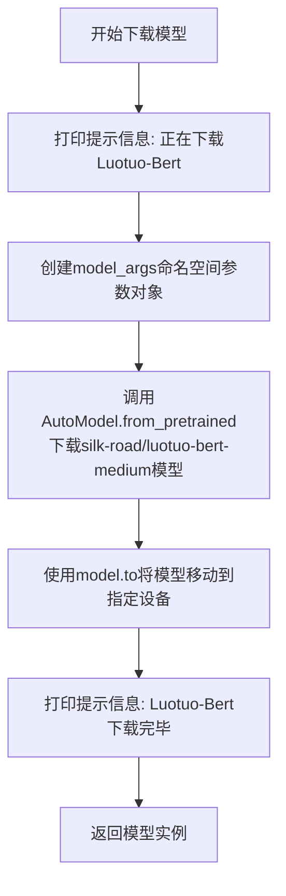

#### 带注释源码

```python
def download_models():
    """
    下载并返回Luotuo-Bert中文模型
    
    该函数从HuggingFace模型仓库下载silk-road/luotuo-bert-medium模型，
    并将其加载到指定的计算设备上。
    
    Returns:
        AutoModel: 已加载到设备的Luotuo-Bert模型对象
    """
    print("正在下载Luotuo-Bert")
    
    # Import our models. The package will take care of downloading the models automatically
    # 定义模型配置参数
    model_args = Namespace(
        do_mlm=None,              # 是否进行掩码语言建模任务
        pooler_type="cls",        # 池化类型，使用[CLS]token的表示
        temp=0.05,                # 温度参数，用于对比学习
        mlp_only_train=False,    # 是否仅在训练时使用MLP
        init_embeddings_model=None  # 初始嵌入模型
    )
    
    # 从预训练模型加载AutoModel，silk-road/luotuo-bert-medium是中文Bert模型
    # trust_remote_code=True允许执行远程代码（模型配置文件中的代码）
    # model_args传递给模型的额外配置参数
    model = AutoModel.from_pretrained(
        "silk-road/luotuo-bert-medium", 
        trust_remote_code=True, 
        model_args=model_args
    ).to(device)  # 将模型移动到GPU或CPU设备
    
    print("Luotuo-Bert下载完毕")
    return model
```


### `get_luotuo_model`

获取或初始化Luotuo中文模型（带缓存）。该函数采用单例模式，通过全局变量 `_luotuo_model` 缓存已加载的模型，避免重复下载和初始化开销。当模型首次调用时，自动下载并加载 "silk-road/luotuo-bert-medium" 预训练模型到指定设备（GPU或CPU）。

参数： 无

返回值：`AutoModel`，返回初始化并加载到设备的 Luotuo-Bert 中文预训练模型对象。

#### 流程图

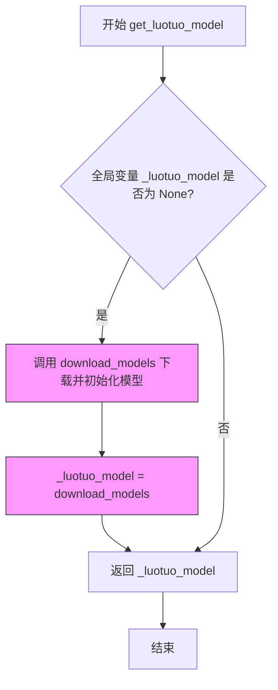

#### 带注释源码

```python
def get_luotuo_model():
    """
    获取或初始化Luotuo中文模型（带缓存）
    
    采用单例模式缓存已加载的模型，避免重复下载和初始化。
    首次调用时自动下载 silk-road/luotuo-bert-medium 模型。
    
    Returns:
        AutoModel: 初始化并加载到设备的Luotuo-Bert中文模型
    """
    global _luotuo_model  # 引用全局模型缓存变量
    
    # 检查模型是否已加载，若未加载则下载并初始化
    if _luotuo_model is None:
        # 调用下载函数获取模型实例
        _luotuo_model = download_models()
    
    # 返回缓存的模型对象
    return _luotuo_model
```

#### 相关全局变量

| 变量名称 | 类型 | 描述 |
|---------|------|------|
| `_luotuo_model` | `AutoModel \| None` | 全局模型缓存变量，存储已加载的Luotuo-Bert模型实例 |
| `device` | `torch.device` | 计算设备，根据CUDA可用性自动选择GPU或CPU |

#### 依赖的内部函数

| 函数名称 | 描述 |
|---------|------|
| `download_models()` | 负责从HuggingFace下载 "silk-road/luotuo-bert-medium" 预训练模型，并加载到指定设备 |


### `luotuo_embedding`

该函数使用Luotuo-Bert模型对输入文本进行嵌入计算，通过分词器将文本转换为token IDs，然后利用预训练模型提取句子级别的嵌入向量（pooler_output），支持批量处理并自动适配GPU/CPU设备。

参数：

- `model`：`AutoModel`，Luotuo-Bert预训练模型实例，用于生成文本嵌入
- `texts`：`list`，待处理文本列表，支持批量输入

返回值：`Tensor`，文本的嵌入向量，形状为 `[batch_size, hidden_size]`

#### 流程图

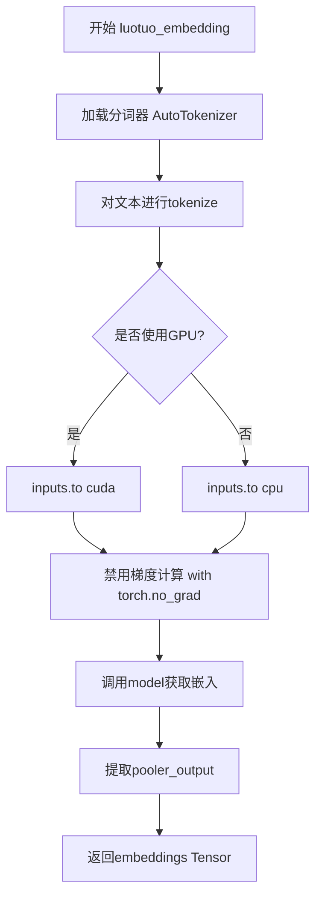

#### 带注释源码

```python
def luotuo_embedding(model, texts):
    # 从预训练模型路径加载Luotuo-Bert分词器
    # 模型路径: silk-road/luotuo-bert-medium
    tokenizer = AutoTokenizer.from_pretrained("silk-road/luotuo-bert-medium")
    
    # 使用分词器对输入文本进行编码
    # padding=True: 填充到相同长度
    # truncation=False: 不进行截断
    # return_tensors="pt": 返回PyTorch张量
    inputs = tokenizer(texts, padding=True, truncation=False, return_tensors="pt")
    
    # 将输入张量移动到计算设备（GPU或CPU）
    # device为全局变量，根据CUDA可用性自动判断
    inputs = inputs.to(device)
    
    # 禁用梯度计算以提升推理速度并减少内存消耗
    with torch.no_grad():
        # 调用模型进行前向传播
        # output_hidden_states=True: 返回所有隐藏状态
        # return_dict=True: 以字典形式返回结果
        # sent_emb=True: 使用句子嵌入模式（pooler）
        embeddings = model(**inputs, output_hidden_states=True, return_dict=True, sent_emb=True).pooler_output
    
    # 返回pooler层的输出作为句子嵌入
    # 形状: [batch_size, hidden_size]
    return embeddings
```


### `luotuo_en_embedding`

使用Luotuo英文模型（silk-road/luotuo-bert-en）生成文本嵌入向量的函数，通过全局缓存的模型和分词器对输入文本列表进行批量编码并提取pooler输出。

参数：

- `texts`：`list`，待嵌入的英文文本列表

返回值：`Tensor`，形状为 `[batch_size, hidden_size]` 的二维张量，表示文本的嵌入向量

#### 流程图

```mermaid
flowchart TD
    A[开始 luotuo_en_embedding] --> B{全局模型 _luotuo_model_en 是否已加载?}
    B -->|否| C[加载 tokenizer: silk-road/luotuo-bert-en]
    C --> D[加载模型: silk-road/luotuo-bert-en]
    D --> E[将模型移至计算设备 GPU/CPU]
    B -->|是| F{全局分词器 _luotuo_en_tokenizer 是否为 None?}
    F -->|是| G[重新加载 tokenizer]
    F -->|否| H[使用现有 tokenizer]
    E --> H
    H --> I[tokenizer 对文本列表进行编码]
    I --> J[将编码结果移至计算设备]
    J --> K[with torch.no_grad 禁用梯度计算]
    K --> L[模型前向传播获取 pooler_output]
    L --> M[返回 embeddings 张量]
```

#### 带注释源码

```python
def luotuo_en_embedding( texts ):
    """
    使用 Luotuo 英文 BERT 模型生成文本嵌入
    
    参数:
        texts: list - 英文文本列表
        
    返回:
        Tensor - 文本嵌入向量 (batch_size, hidden_size)
    """
    
    # 声明使用全局变量（模型和分词器缓存）
    global _luotuo_model_en
    global _luotuo_en_tokenizer

    # === 第一次调用时的模型初始化 ===
    if _luotuo_model_en is None:
        # 从预训练模型加载英文分词器
        _luotuo_en_tokenizer = AutoTokenizer.from_pretrained("silk-road/luotuo-bert-en")
        
        # 加载英文 BERT 模型并移至计算设备（GPU/CPU）
        _luotuo_model_en = AutoModel.from_pretrained("silk-road/luotuo-bert-en").to(device)

    # === 冗余检查：若分词器仍未初始化（实际不会触发）===
    if _luotuo_en_tokenizer is None:
        _luotuo_en_tokenizer = AutoTokenizer.from_pretrained("silk-road/luotuo-bert-en")

    # === 文本编码 ===
    # padding=True: 填充至最长句子
    # truncation=False: 不截断超长文本
    # return_tensors="pt": 返回 PyTorch 张量
    inputs = _luotuo_en_tokenizer(texts, padding=True, truncation=False, return_tensors="pt")
    
    # 将输入数据移至计算设备（GPU 若可用）
    inputs = inputs.to(device)

    # === 模型推理（禁用梯度以节省显存）===
    with torch.no_grad():
        # output_hidden_states=True: 返回所有隐藏状态
        # return_dict=True: 以字典形式返回结果
        # sent_emb=True: 计算句子级别嵌入（pooler_output）
        embeddings = _luotuo_model_en(**inputs, output_hidden_states=True, return_dict=True, sent_emb=True).pooler_output
        
    return embeddings
```


### `get_embedding_for_chinese`

该函数用于获取中文文本的嵌入向量，通过调用 Luotuo-Bert 模型生成文本嵌入表示。支持单个字符串或字符串列表输入，并自动处理超过模型最大长度限制的文本。当输入文本数量较多时（≥64条），会进行分批处理以避免内存溢出。

参数：

- `model`：`AutoModel`，预训练的 Luotuo-Bert 中文模型实例，用于生成文本嵌入
- `texts`：`str` 或 `list`，待编码的中文文本，支持单个字符串或字符串列表

返回值：`Tensor`，形状为 `(batch_size, hidden_size)` 的嵌入向量张量

#### 流程图

```mermaid
flowchart TD
    A[开始: get_embedding_for_chinese] --> B[将模型移动到 device]
    B --> C{判断 texts 类型}
    C -->|字符串| D[将 texts 包装为列表]
    C -->|列表| E[保持列表不变]
    D --> F[遍历文本列表]
    E --> F
    F --> G{文本长度 > 510?}
    G -->|是| H[截断为前 510 字符]
    G -->|否| I[保持原文本]
    H --> J[处理下一文本]
    I --> J
    J --> K{文本数量 >= 64?}
    K -->|是| L[分批处理<br/>每批 64 条]
    K -->|否| M[直接处理全部文本]
    L --> N[调用 luotuo_embedding<br/>获取每批嵌入]
    M --> O[调用 luotuo_embedding<br/>获取全部嵌入]
    N --> P[torch.cat 合并各批嵌入]
    O --> Q[返回嵌入向量 Tensor]
    P --> Q
```

#### 带注释源码

```python
def get_embedding_for_chinese(model, texts):
    """
    获取中文文本的嵌入向量
    
    参数:
        model: 预训练的 Luotuo-Bert 模型
        texts: 单个字符串或字符串列表
    
    返回:
        嵌入向量张量
    """
    # 将模型移动到计算设备（CPU或GPU）
    model = model.to(device)
    
    # str or strList: 统一转换为列表处理
    texts = texts if isinstance(texts, list) else [texts]
    
    # 截断: 对每个文本进行长度检查，超过510字符则截断
    # Luotuo-Bert 模型最大支持512个token，此处预留2个token给特殊标记
    for i in range(len(texts)):
        if len(texts[i]) > 510:
            texts[i] = texts[i][:510]
    
    # 批处理策略: 当文本数量较多时进行分批处理以避免显存溢出
    if len(texts) >= 64:
        embeddings = []
        chunk_size = 64  # 每批处理64条文本
        # 遍历文本列表，每次处理64条
        for i in range(0, len(texts), chunk_size):
            embeddings.append(luotuo_embedding(model, texts[i: i + chunk_size]))
        # 将各批次的嵌入向量沿第0维拼接
        return torch.cat(embeddings, dim=0)
    else:
        # 文本数量较少时直接一次性处理
        return luotuo_embedding(model, texts)
```


### `is_chinese_or_english`

判断输入文本属于中文还是英文（目前已弃用硬编码返回"chinese"）

参数：

- `text`：`str`，需要判断语言的文本内容

返回值：`str`，返回判断结果，当前实现固定返回 "chinese"（原逻辑可返回 "chinese" 或 "english"）

#### 流程图

```mermaid
flowchart TD
    A[开始 is_chinese_or_english] --> B[接收参数 text]
    B --> C[将 text 转换为字符列表]
    C --> D[初始化 is_chinese=0, is_english=0]
    D --> E{遍历字符}
    E -->|当前字符| F{'\\u4e00' <= char <= '\\u9fa5' 是中文?}
    F -->|是| G[is_chinese += 4]
    F -->|否| H{'\\u0041' <= char <= '\\u005a' 或 '\\u0061' <= char <= '\\u007a' 是英文?}
    H -->|是| I[is_english += 1]
    H -->|否| J[不计数]
    G --> K{遍历结束?}
    I --> K
    J --> K
    K -->|否| E
    K -->|是| L{is_chinese >= is_english?}
    L -->|是| M[返回 'chinese']
    L -->|否| N[返回 'english']
    M --> O[结束]
    N --> O
    
    style A fill:#f9f,stroke:#333
    style M fill:#9f9,stroke:#333
    style N fill:#9f9,stroke:#333
    style O fill:#f9f,stroke:#333
```

#### 带注释源码

```python
def is_chinese_or_english(text):
    """
    判断文本是中文还是英文（已弃用硬编码返回chinese）
    
    参数:
        text: str, 待判断的文本内容
    
    返回值:
        str, 判断结果 'chinese' 或 'english'
    """
    # 注意：当前实现已硬编码返回 'chinese'，原逻辑已被跳过
    # 保留原始代码逻辑供参考
    return "chinese"  # 硬编码返回，原始判断逻辑不再执行

    # ====== 以下为原判断逻辑（已被跳过）======
    
    # 将输入文本转换为字符列表，便于逐字符判断
    text = list(text)
    # 初始化中英文计数，中文字符权重为4（因中文信息量通常更大）
    is_chinese, is_english = 0, 0

    # 遍历文本中的每个字符
    for char in text:
        # 判断字符的Unicode值是否在中文字符的Unicode范围内
        # 中文字符范围：\\u4e00 - \\u9fa5（基本汉字区）
        if '\u4e00' <= char <= '\u9fa5':
            is_chinese += 4  # 中文权重为4
        # 判断字符是否为英文字符（包括大小写字母）
        # 大写字母范围：\\u0041 - \\u005a
        # 小写字母范围：\\u0061 - \\u007a
        elif ('\u0041' <= char <= '\u005a') or ('\u0061' <= char <= '\u007a'):
            is_english += 1  # 英文权重为1
    
    # 比较中英文权重总和，返回权重较大的语言类型
    if is_chinese >= is_english:
        return "chinese"
    else:
        return "english"
```


### `get_embedding_openai`

该函数用于调用 OpenAI Embedding API，将输入文本转换为向量嵌入形式，支持自定义模型，默认使用 OpenAI 的 `text-embedding-ada-002` 模型。

参数：

- `text`：`str`，需要获取嵌入向量的输入文本
- `model`：`str`，可选参数，指定使用的嵌入模型，默认为 `"text-embedding-ada-002"`

返回值：`list`，返回文本的嵌入向量（浮点数列表）

#### 流程图

```mermaid
flowchart TD
    A[开始 get_embedding_openai] --> B[输入参数: text, model]
    B --> C[文本预处理: 替换换行符为空格]
    C --> D{检查 client 是否已初始化}
    D -->|是| E[调用 client.embeddings.create]
    D -->|否| F[抛出异常或返回错误]
    E --> G[提取 embedding 数据]
    G --> H[返回 embedding 列表]
    F --> I[结束 - 异常处理]
    H --> I
```

#### 带注释源码

```python
def get_embedding_openai(text, model="text-embedding-ada-002"):
    """
    使用 OpenAI API 获取文本的嵌入向量
    
    参数:
        text (str): 输入文本字符串
        model (str): 嵌入模型名称，默认为 "text-embedding-ada-002"
    
    返回:
        list: 嵌入向量列表（浮点数）
    """
    
    # 预处理文本：将换行符替换为空格，OpenAI API 要求文本中不能包含换行符
    text = text.replace("\n", " ")
    
    # 调用 OpenAI 客户端的 embeddings.create 方法生成嵌入向量
    # 参数 input: 需要嵌入的文本列表
    # 参数 model: 使用的嵌入模型
    # 返回结果包含 data 字段，其中第一个元素包含 embedding
    return client.embeddings.create(input = [text], model=model).data[0].embedding
```

---

### 补充信息

#### 潜在技术债务

1. **未初始化的全局变量 `client`**：代码中 `client` 变量的定义被注释掉（`# client = OpenAI(api_key=<YOUR OPENAI API KEY>)`），导致该函数在运行时如果 `client` 未被正确初始化会抛出 `NameError`。这是一个严重的设计缺陷。

2. **缺少 API Key 验证**：函数未对 OpenAI API Key 的有效性进行检查，可能导致运行时错误。

3. **缺少异常处理**：函数未对 API 调用可能出现的网络错误、超时、限流等情况进行处理。

#### 设计目标与约束

- **设计目标**：提供统一的文本嵌入接口，支持 OpenAI 的嵌入模型
- **约束条件**：
  - 依赖全局变量 `client`（由 OpenAI SDK 提供）
  - 需要有效的 OpenAI API Key
  - 文本长度受 OpenAI 模型限制（`text-embedding-ada-002` 最大输入约为 8191 tokens）

#### 错误处理与异常设计

- **当前实现**：无错误处理机制
- **建议改进**：
  - 初始化 `client` 时检查 API Key 是否存在
  - 添加 try-except 捕获 `openai.APIConnectionError`、`openai.RateLimitError` 等异常
  - 对空文本输入进行校验

#### 外部依赖与接口契约

- **依赖项**：
  - `openai` Python 包
  - 全局变量 `client`（`OpenAI` 客户端实例）
- **接口契约**：
  - 输入：非空字符串文本
  - 输出：浮点数列表（嵌入向量）
  - 调用方需确保 `client` 已正确初始化并配置有效的 API Key


### `get_embedding_for_english`

该函数用于获取英文文本的OpenAI嵌入向量，通过调用OpenAI的嵌入API将文本转换为高维向量表示，以便后续进行语义相似度计算或其他NLP任务。

参数：

-  `text`：`str`，需要获取嵌入向量的英文文本
-  `model`：`str`，OpenAI嵌入模型名称，默认为"text-embedding-ada-002"

返回值：`list`，返回文本的嵌入向量（浮点数列表）

#### 流程图

```mermaid
flowchart TD
    A[开始] --> B[替换文本中的换行符为空格]
    B --> C[调用client.embeddings.create方法]
    C --> D[提取嵌入向量数据]
    E[返回嵌入向量列表] --> F[结束]
    D --> E
    
    style A fill:#f9f,color:#333
    style E fill:#9f9,color:#333
    style F fill:#f99,color:#333
```

#### 带注释源码

```python
def get_embedding_for_english(text, model="text-embedding-ada-002"):
    """
    获取英文文本的OpenAI嵌入向量
    
    参数:
        text: str - 输入的英文文本字符串
        model: str - OpenAI嵌入模型名称，默认使用text-embedding-ada-002
    
    返回:
        list - 嵌入向量浮点数列表
    """
    # 1. 文本预处理：移除换行符，因为OpenAI API要求文本是单行格式
    text = text.replace("\n", " ")
    
    # 2. 调用OpenAI嵌入API创建嵌入向量
    # 注意：此处依赖外部client对象，需要在调用前初始化
    # client = OpenAI(api_key=YOUR_API_KEY)
    return client.embeddings.create(input = [text], model=model).data[0].embedding
```

---

### 关键组件信息

| 组件名称 | 一句话描述 |
|---------|-----------|
| `client` | OpenAI客户端对象，用于调用API（当前被注释，需手动启用） |
| `text-embedding-ada-002` | OpenAI默认嵌入模型，生成1536维向量 |

---

### 潜在的技术债务或优化空间

1. **硬编码依赖**：`client`变量未在函数内定义，依赖全局作用域，需添加初始化检查或传入client参数
2. **API密钥管理**：当前使用注释的占位符，缺乏安全的密钥管理机制（如环境变量或密钥服务）
3. **错误处理缺失**：未处理API调用失败、网络异常、API配额限制等情况
4. **模型参数不可配置**：仅支持默认模型，无法动态切换其他嵌入模型（如text-embedding-3-small）
5. **批量处理能力**：当前仅支持单文本输入，可考虑增加批量处理重载版本

---

### 其它项目

**设计目标与约束：**
- 目标：快速获取英文文本的语义向量表示
- 约束：依赖OpenAI API，需有效的API密钥

**错误处理与异常设计：**
- 当前无try-except包装，API调用失败将直接抛出异常
- 建议增加重试机制和超时控制

**外部依赖与接口契约：**
- 依赖`openai`库的`OpenAI`客户端对象
- 输入需为有效字符串，输出为1536维浮点列表（基于ada-002模型）

**调用关系：**
- 被`luotuo_openai_embedding`函数调用，用于处理英文文本的嵌入场景


### `luotuo_openai_embedding`

这是一个混合嵌入函数，能够根据输入文本的语言（中文或英文）自动选择后端模型进行向量化。对于中文文本，它调用本地的 `luotuo-bert` 模型；对于英文文本，则尝试调用 OpenAI 的 Embedding API（前提是环境变量中存在 API Key）。该函数同时支持单条文本和批量文本列表的处理。

参数：
-  `texts`：`str` 或 `list`，待嵌入的文本或文本列表。
-  `is_chinese`：`bool`，（可选）用于显式指定输入语言，但在当前实现中该参数**未被使用**，函数内部强制通过 `is_chinese_or_english` 进行自动检测。

返回值：`list`，返回嵌入向量的列表（如果输入是单条字符串，也会返回包含该向量的一维列表）。

#### 流程图

```mermaid
flowchart TD
    A([Start luotuo_openai_embedding]) --> B{Is texts a list?}
    
    B -- Yes --> C[Randomly select one index]
    B -- No --> D[Set text = texts]
    
    C --> E{Is OpenAI Key missing?}
    D --> E
    
    E -- Yes --> F[Call is_chinese_or_english]
    E -- No --> F
    
    F -- Chinese/Key Missing --> G[Use Local Model: get_luotuo_model]
    F -- English & Key Exists --> H[Use OpenAI API: get_embedding_for_english]
    
    G --> I[Process with get_embedding_for_chinese]
    H --> J[Process with get_embedding_for_english loop]
    
    I --> K[Convert tensors to lists]
    J --> K
    
    K --> L([Return list of embeddings])
```

#### 带注释源码

```python
def luotuo_openai_embedding(texts, is_chinese= None ):
    """
        混合嵌入函数：根据语言自动选择模型
        当输入是中文时，使用 luotuo_embedding (本地模型)
        当输入是英文时，使用 openai_embedding (需API Key)
        texts 可以是字符串或字符串列表
    """
    # 尝试从环境变量获取 OpenAI API Key
    openai_key = os.environ.get("OPENAI_API_KEY")

    # 判断输入是单个字符串还是列表
    if isinstance(texts, list):
        # 优化：如果是列表，随机选一个样本来判断语言（⚠️ 逻辑可能不严谨，应假设同批次语言一致）
        index = random.randint(0, len(texts) - 1)
        
        # 如果没有 OpenAI Key 或者检测为中文，调用本地模型
        if openai_key is None or is_chinese_or_english(texts[index]) == "chinese":
            # 获取模型并推理，返回 tensor 列表，转换为 Python list
            return [embed.cpu().tolist() for embed in get_embedding_for_chinese(get_luotuo_model(), texts)]
        else:
            # 英文处理：循环调用 OpenAI 接口（⚠️ 未使用批量接口，效率低）
            return [get_embedding_for_english(text) for text in texts]
    else:
        # 单条文本处理
        if openai_key is None or is_chinese_or_english(texts) == "chinese":
            # 同样是调用本地模型，取结果中的第一个向量
            return get_embedding_for_chinese(get_luotuo_model(), texts)[0].cpu().tolist()
        else:
            return get_embedding_for_english(texts)
```

#### 关键组件信息

-   `get_luotuo_model()`: 全局函数，负责下载并初始化本地的 `luotuo-bert` 模型。
-   `get_embedding_for_chinese(model, texts)`: 调用本地模型进行分批次向量化。
-   `get_embedding_for_english(text)`: 调用 OpenAI API 获取向量。
-   `is_chinese_or_english(text)`: 辅助函数，通过字符 Unicode 范围简单判断语言。

#### 潜在的技术债务或优化空间

1.  **未使用的参数**：`is_chinese` 参数声明了但未在逻辑中使用，违反了 API 设计的最小惊讶原则。
2.  **不严谨的语言判断**：对于列表输入，仅随机采样一条文本判断语言，如果列表中混排了中英文，会导致错误的模型调用。应该要求列表语言统一或提供显式的语言标记。
3.  **API 性能瓶颈**：在处理英文列表时，使用了 `for text in texts` 逐个调用 `client.embeddings.create`，这是网络 IO 密集型操作。OpenAI API 支持批量输入（传入字符串列表），应重构为单次批量请求。
4.  **缺乏异常处理**：未对网络错误、API 配额限制、模型下载失败等情况进行 `try-except` 捕获。

#### 其它项目

-   **设计约束**：依赖环境变量 `OPENAI_API_KEY` 决定英文路径；依赖网络连接；依赖 `torch` 和 `transformers` 库。
-   **错误处理**：目前为纯生吞（fail-silent）风格，若 API Key 无效或网络不通可能直接报错或返回空。


### `get_cosine_similarity`

该函数用于计算两个向量的余弦相似度，通过将输入的 Python 列表转换为 PyTorch 张量，并利用 GPU（若可用）加速计算过程，最终返回标量形式的相似度值。

参数：

- `v1`：`list`，第一个向量，用于计算余弦相似度
- `v2`：`list`，第二个向量，用于计算余弦相似度

返回值：`float`，两个向量之间的余弦相似度值，范围通常在 [-1, 1] 之间

#### 流程图

```mermaid
flowchart TD
    A[开始计算余弦相似度] --> B[输入向量 v1 和 v2]
    B --> C{检查设备}
    C -->|CUDA 可用| D[将向量移至 GPU]
    C -->|CUDA 不可用| E[将向量保留在 CPU]
    D --> F[转换为 PyTorch 张量]
    E --> F
    F --> G[调用 torch.cosine_similarity]
    G --> H[指定 dim=0 计算]
    H --> I[使用 .item() 转换为 Python 标量]
    I --> J[返回 float 类型的相似度值]
```

#### 带注释源码

```python
def get_cosine_similarity(v1, v2):
    """
    计算两个向量的余弦相似度
    
    参数:
        v1 (list): 第一个向量，通常为嵌入向量
        v2 (list): 第二个向量，通常为嵌入向量
    
    返回:
        float: 两个向量之间的余弦相似度，范围 [-1, 1]
    """
    # 将输入的列表 v1 转换为 PyTorch 张量，并移动到计算设备（GPU/CPU）
    v1 = torch.tensor(v1).to(device)
    
    # 将输入的列表 v2 转换为 PyTorch 张量，并移动到计算设备
    v2 = torch.tensor(v2).to(device)
    
    # 使用 PyTorch 的余弦相似度函数计算，dim=0 表示在第一个维度上计算
    # .item() 方法将张量值转换为 Python 原生标量类型
    return torch.cosine_similarity(v1, v2, dim=0).item()
```

## 关键组件


### 文本审核模块

使用百度文本审核API对文本进行合规性检查，支持中文文本的内容安全检测。

### 角色打包模块

将系统提示词、配置文件和文本文件打包为统一的数据结构，并生成对应的嵌入向量。

### 向量编解码工具

提供嵌入向量与Base64字符串之间的相互转换功能，支持浮点数组和字符串两种数据类型的编码与解码。

### BGE嵌入模型池

维护多种BGE（Bidirectional Encoder Representations from Graphs）嵌入模型的加载和缓存，支持中文（BAAI/bge-small-zh-v1.5）和英文（BAAI/bge-small-en-v1.5）两种语言模型。

### Luotuo嵌入模型

基于Luotuo-Bert中英文预训练模型实现的文本嵌入功能，支持中文（silk-road/luotuo-bert-medium）和英文（silk-road/luotuo-bert-en）文本的向量化表示。

### OpenAI嵌入接口

调用OpenAI的text-embedding-ada-002模型生成文本嵌入向量，支持单文本和批量文本处理。

### 通用嵌入框架

通过统一的模型池（_model_pool）和分词器池（_tokenizer_pool）管理多种嵌入模型，提供通用嵌入生成和安全批处理嵌入生成功能。

### 相似度计算模块

基于PyTorch的余弦相似度计算工具，用于比较两个嵌入向量之间的语义相似程度。

### 文本后处理模块

使用正则表达式对对话文本进行格式化处理，提取对话内容和说话者信息。

### 访问令牌获取模块

通过百度OAuth 2.0接口获取API访问令牌，用于调用百度内容审核服务。

### 设备管理模块

自动检测并选择可用的计算设备（GPU或CPU），确保模型在合适的硬件上运行。


## 问题及建议


### 已知问题

- **字符串转Base64函数存在缺陷**：`string_to_base64`函数遍历text时直接对单个字符调用encode，但由于`for char in text`遍历的是字符而非字节，导致编码逻辑错误且效率低下
- **全局状态管理混乱**：大量使用全局变量（`_luotuo_model`、`_bge_model`、`_model_pool`等）且未进行线程安全保护，容易产生状态污染和难以追踪的bug
- **代码重复**：BGE英文模型（`get_bge_embeddings`）和通用模型（`get_general_embeddings`）函数实现高度相似，TODO注释已指出需重构但未执行
- **缺乏错误处理**：网络请求（`requests.post`）没有设置超时、没有异常捕获、对API返回的JSON直接取值（如`response.json()["conclusion"]`）会导致KeyError异常
- **未使用的代码残留**：`debug_count`变量及注释掉的调试代码、已禁用的`is_chinese_or_english`函数实现（返回固定值"chinese"）、`is_chinese_or_english`函数内被注释掉的在线OpenAI API逻辑
- **硬编码与魔法数字**：批处理大小（`general_batch_size=16`、`bge_batch_size=32`）、模型名称（`"BAAI/bge-small-zh-v1.5"`）等硬编码在多处
- **类型注解缺失**：整个代码库没有使用类型提示（Type Hints），降低了可维护性和IDE支持
- **导入管理混乱**：导入语句分散在不同位置，部分导入（如`Namespace`）使用后未实际调用构造器

### 优化建议

- 重构`string_to_base64`函数为`text.encode('utf-8')`后直接base64编码，避免逐字符处理
- 引入配置类或配置文件集中管理模型名称、批处理大小等常量，使用 dataclass 或 Pydantic 定义配置结构
- 将全局模型变量封装为单例类或依赖注入模式，统一管理模型生命周期
- 为所有网络请求添加超时参数（`timeout=30`）和重试机制，使用`response.json().get()`提供默认值避免KeyError
- 使用`functools.lru_cache`或专门缓存库实现模型和tokenizer的缓存，减少重复加载
- 添加完整的类型注解，使用`mypy`进行静态类型检查
- 清理所有调试代码和注释掉的死代码，保持代码仓库整洁
- 考虑使用`tenacity`库实现重试逻辑，统一异常处理方式
- 将百度Access Token的获取和缓存逻辑封装，避免每次请求都重新获取

## 其它


### 设计目标与约束

本代码的设计目标是为故事审核系统提供文本嵌入生成和内容审核能力。核心约束包括：1）支持中英文双语处理，根据文本语言自动选择合适的嵌入模型；2）支持多种嵌入模型（luotuo-bert、bge-zh、bge-en、openai ada-002）；3）通过百度内容审核API实现文本合规性检查；4）所有嵌入向量统一转换为base64格式便于传输和存储；5）优先使用GPU加速计算，设备不可用时回退到CPU。

### 错误处理与异常设计

代码中错误处理主要体现在：1）get_access_token()函数通过requests.post获取百度access_token，返回None（实际代码返回字符串"None"）表示鉴权失败；2）text_censor()函数直接访问response.json()["conclusion"]，若API返回异常会抛出KeyError，建议增加try-except包裹和默认返回值；3）模型加载函数（get_luotuo_model、get_bge_embeddings等）使用全局变量缓存，模型为None时触发下载；4）文件读取操作未做异常捕获，文件不存在或编码错误会导致程序中断；5）环境变量读取使用os.getenv()，未配置时返回None可能导致后续调用失败。

### 数据流与状态机

主要数据流转路径：1）文本输入→语言检测（is_chinese_or_english）→选择嵌入模型→生成向量→base64编码→返回；2）待审核文本→百度文本审核API→返回审核结论→判断是否合规；3）本地文件读取→批量嵌入处理→tqdm进度条显示→返回数据列表。状态机方面：模型加载状态包括未加载→加载中→已加载；嵌入请求支持单条字符串或列表批量处理两种模式；base64编解码存在字符串和浮点数组两种数据类型转换路径。

### 外部依赖与接口契约

核心外部依赖包括：1）transformers库（AutoModel、AutoTokenizer）用于加载bge系列模型和luotuo模型；2）torch库提供GPU计算能力和张量操作；3）requests库用于百度API的HTTP调用；4）tiktoken库用于文本token计数；5）tqdm库提供进度条显示；6）openai库（已注释）用于openai嵌入接口；7）numpy库（虽导入未直接使用）。接口契约方面：所有嵌入函数接收文本（str或list），返回浮点数列表；get_access_token()返回access_token字符串供API调用；text_censor()返回布尔值表示合规性；base64编解码函数需严格遵循4字节浮点数的pack/unpack规范。

### 配置管理

当前代码采用硬编码和全局变量混合配置模式：1）模型名称配置：默认使用"BAAI/bge-small-zh-v1.5"，bge英文模型使用"BAAI/bge-small-en-v1.5"；2）批处理大小配置：general_batch_size=16，bge_batch_size=32；3）最大序列长度：统一设置为512；4）设备选择：自动检测CUDA可用性；5）API端点：百度OAuth和内容审核URL硬编码；6）环境变量：StoryAudit_API_AK/SK、OPENAI_API_KEY通过os.getenv读取。建议将模型路径、批处理大小、API地址等提取为配置文件或命令行参数。

### 性能考虑与优化空间

现有性能特征：1）模型采用全局单例缓存，避免重复加载；2）批量嵌入使用分批处理（batch_size控制）降低显存压力；3）使用torch.no_grad()禁用梯度计算减少内存占用；4）tqdm进度条便于监控长时间任务。优化建议：1）get_bge_embeddings_safe和get_general_embeddings_safe存在重复实现，可统一重构；2）luotuo模型和bge模型的嵌入函数接口不一致，建议统一封装；3）is_chinese_or_english函数直接返回"chinese"（硬编码），实际语言检测逻辑未生效；4）缺少模型量化、推理优化等高级加速手段；5）多模型并行加载和推理的潜力未被挖掘。

### 安全性考虑

代码涉及的安全性因素：1）API密钥存储在环境变量中，符合基本安全实践，但代码中未做密钥有效性检查；2）网络请求未设置超时参数，可能导致请求阻塞；3）文件路径操作使用os.listdir和os.path.join，需防范路径遍历攻击；4）百度API调用使用urlencoded格式，数据传输建议HTTPS（代码中已使用https）；5）模型加载使用trust_remote_code=True，存在潜在代码执行风险，建议验证模型来源可靠性；6）嵌入向量转换为base64后传输，需注意数据完整性。

### 部署和运维相关

部署考量：1）依赖库包括torch、transformers、requests、tqdm、tiktoken等，需确保版本兼容性；2）GPU部署需要CUDA环境，代码已做设备自动检测；3）模型文件较大（luotuo-bert-medium约300MB，bge系列约100MB），首次运行需下载；4）百度API调用有QPS限制，生产环境需实现请求速率控制；5）日志输出主要依赖print和tqdm，建议集成标准logging模块；6）容器化部署需注意模型文件挂载和GPU驱动配置。

### 测试策略建议

当前代码缺少单元测试和集成测试。建议补充：1）单元测试：base64编解码的准确性验证（特别是浮点数组的精度损失测试）；2）模型推理测试：验证各嵌入函数的输出维度、类型和数值范围；3）API集成测试：百度内容审核接口的模拟测试；4）性能测试：批量处理的吞吐量和延迟测量；5）异常测试：网络超时、模型加载失败、文件不存在等边界情况；6）回归测试：确保修改后的嵌入结果与历史结果一致性（可用余弦相似度阈值判断）。

### 并发和线程安全

代码中的并发风险：1）全局变量_model_pool、_tokenizer_pool在多线程环境下存在竞态条件，初始化操作非原子性；2）get_luotuo_model()和get_bge_embeddings()使用全局缓存，多线程调用可能导致模型重复加载；3）requests库的网络请求非线程安全，需注意连接池管理；4）torch模型本身非线程安全，同一模型对象不建议并发推理。建议：使用线程锁保护全局变量访问，或使用单例模式管理模型生命周期，或考虑使用进程池替代线程池处理批量任务。

### 监控和告警设计

当前代码缺少监控能力。建议增加：1）API调用成功率统计和响应时间监控；2）模型推理耗时和吞吐量指标；3）GPU显存使用率监控（torch.cuda.memory_allocated）；4）百度API配额使用情况跟踪；5）异常事件日志记录（模型加载失败、API返回非合规结论等）；6）关键函数的入口和出口日志，便于问题追踪。


    