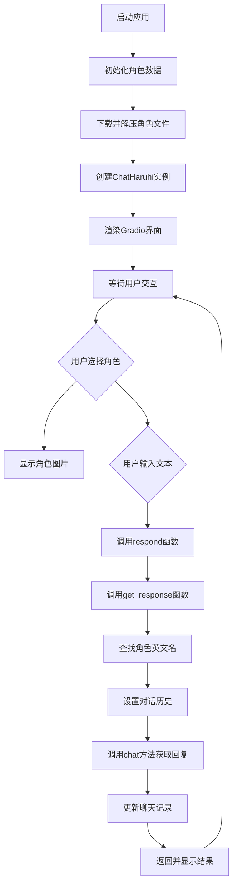
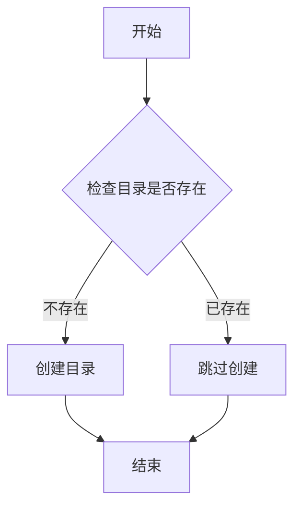
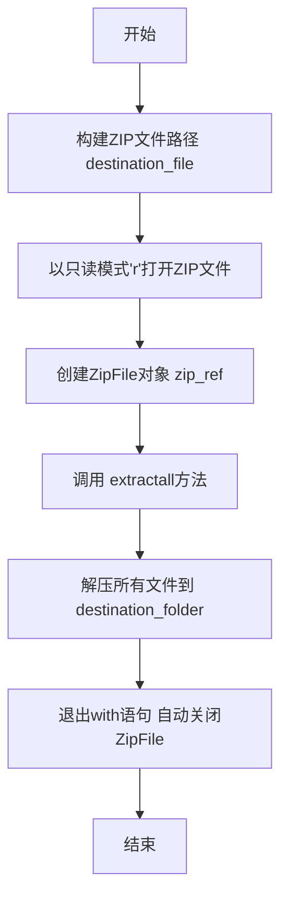
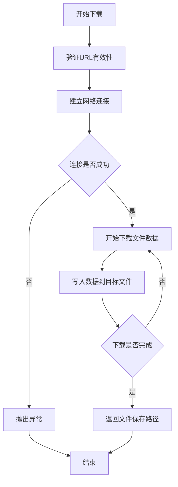
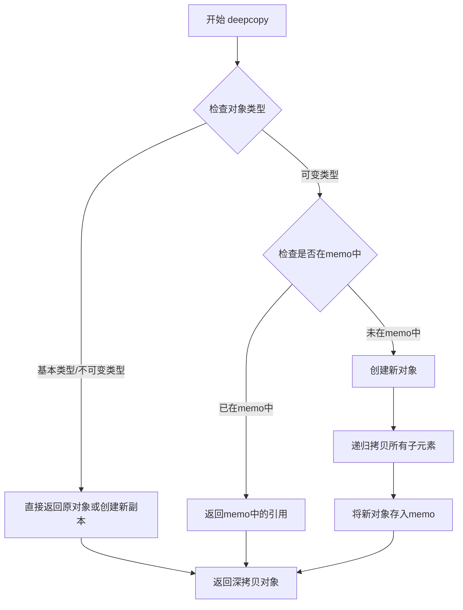
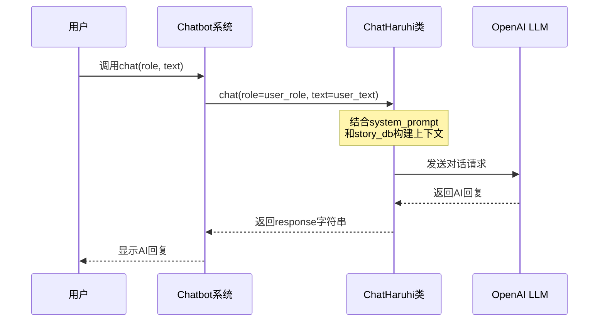
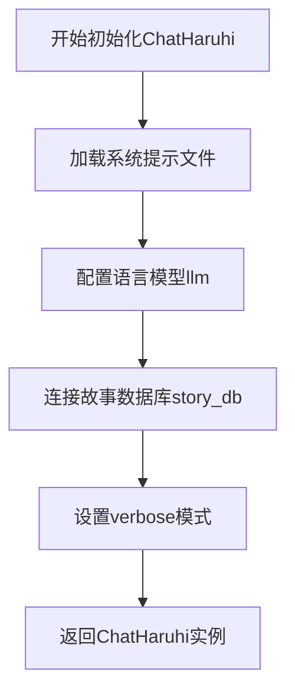

# `Chat-Haruhi-Suzumiya\ChatHaruhi2.0\gradioDemo\app.py` 详细设计文档

这是一个基于Gradio的Web聊天应用，用于实现角色扮演聊天机器人（ChatHaruhi）。用户可以选择不同的动漫/小说角色（如凉宫春日、张飞、哈利波特等），通过文本与AI角色进行对话，系统会根据角色设定和对话历史生成符合角色性格的回复。

## 整体流程



## 类结构

```
应用主流程 (Main Application)
├── 全局初始化模块
│   ├── NAME_DICT (角色名称映射)
│   └── ai_roles_obj (角色实例缓存)
├── 异步处理模块
│   ├── get_response (获取AI响应)
│   └── respond (响应处理入口)
├── 工具函数模块
clear (清除聊天记录)
get_image (获取角色图片)
└── Gradio UI模块
    ├── 页面布局
    └── 事件绑定
```

## 全局变量及字段


### `NAME_DICT`
    
角色中文名到英文名的映射字典

类型：`dict`
    


### `ai_roles_obj`
    
存储所有ChatHaruhi角色实例的字典

类型：`dict`
    


### `file_url`
    
角色数据zip文件的下载URL

类型：`str`
    


### `destination_file`
    
zip文件下载后保存的本地路径

类型：`str`
    


### `destination_folder`
    
zip文件解压后存放的文件夹路径

类型：`str`
    


### `db_folder`
    
角色故事数据库文件夹路径

类型：`str`
    


### `system_prompt`
    
角色系统提示词文件路径

类型：`str`
    


### `role_en`
    
当前处理的角色英文名

类型：`str`
    


### `ChatHaruhi.dialogue_history`
    
对话历史记录

类型：`list`
    


### `ChatHaruhi.system_prompt`
    
系统提示词

类型：`str`
    


### `ChatHaruhi.story_db`
    
故事数据库路径

类型：`str`
    


### `ChatHaruhi.llm`
    
使用的语言模型类型

类型：`str`
    


### `ChatHaruhi.verbose`
    
详细模式开关

类型：`bool`
    
    

## 全局函数及方法


### `get_response`

该函数是一个异步函数，负责根据用户输入和选定的AI角色进行对话交互。它首先将聊天历史复制到对应的AI角色对象中，然后调用角色的聊天方法生成响应，最后将用户消息和AI响应追加到聊天记录中并返回。

参数：

- `user_role`：`str`，用户扮演的角色名称
- `user_text`：`str`，用户输入的文本内容
- `ai_role`：`str`，AI角色名称（中文）
- `chatbot`：`list`，当前的聊天记录列表

返回值：`list`，更新后的聊天记录

#### 流程图

```mermaid
flowchart TD
    A[开始 get_response] --> B{检查 ai_role 是否在 NAME_DICT 中}
    B -->|是| C[获取 role_en = NAME_DICT[ai_role]]
    B -->|否| D[抛出 KeyError]
    C --> E[复制 chatbot 到 ai_roles_obj[role_en].dialogue_history]
    E --> F[调用 ai_roles_obj[role_en].chat role=user_role, text=user_text]
    F --> G[获取 AI 响应 response]
    G --> H[构建用户消息 user_msg = user_role + ':「' + user_text + '」']
    H --> I[将元组 (user_msg, response) 添加到 chatbot]
    I --> J[返回更新后的 chatbot]
```

#### 带注释源码

```python
async def get_response(user_role, user_text, ai_role, chatbot):
    """
    异步函数：处理用户与AI角色的对话
    
    参数:
        user_role: str, 用户扮演的角色名称
        user_text: str, 用户输入的文本
        ai_role: str, AI角色名称（中文）
        chatbot: list, 聊天记录列表
    
    返回:
        list, 更新后的聊天记录
    """
    # 根据中文角色名获取英文标识
    role_en = NAME_DICT[ai_role]
    
    # 将当前聊天历史深拷贝到AI角色的对话历史中
    ai_roles_obj[role_en].dialogue_history = copy.deepcopy(chatbot)
    
    # 调用ChatHaruhi的chat方法获取AI响应
    response = ai_roles_obj[role_en].chat(role=user_role, text=user_text)
    
    # 构造用户消息格式：角色名：「消息内容」
    user_msg = user_role + ':「' + user_text + '」'
    
    # 将用户消息和AI响应追加到聊天记录
    chatbot.append((user_msg, response))
    
    # 返回更新后的聊天记录
    return chatbot
```


### `respond`

这是一个异步函数，作为Gradio聊天界面的回调函数，接收用户输入的用户角色、文本内容、目标AI角色以及当前聊天历史，调用`get_response`函数获取AI回复，并将更新后的聊天历史返回给界面，同时返回None用于清空用户输入框。

参数：

- `user_role`：`str`，用户扮演的角色名称，用于在对话中标识用户身份
- `user_text`：`str`，用户输入的文本内容，即想要与AI角色对话的内容
- `ai_role`：`str`，AI角色的中文名称，用于从NAME_DICT中查找对应的英文标识符
- `chatbot`：`list`，当前的聊天历史记录，包含用户和AI之间的对话历史

返回值：`tuple`，返回更新后的聊天历史和None的元组`(chatbot, None)`，其中chatbot是包含用户消息和AI回复的更新后的列表，None用于清空用户输入框

#### 流程图

```mermaid
flowchart TD
    A[开始 respond 函数] --> B[调用 await get_response]
    B --> C[传入参数 user_role, user_text, ai_role, chatbot]
    C --> D[get_response 处理并返回更新后的 chatbot]
    D --> E[返回 tuple: (chatbot, None)]
    E --> F[结束]
    
    subgraph get_response 内部流程
        G[根据 ai_role 查找英文名称 role_en]
        H[复制 chatbot 到对话历史]
        I[调用 ai_roles_obj 的 chat 方法获取回复]
        J[构造用户消息并添加到 chatbot]
        K[返回更新后的 chatbot]
    end
    
    B -.-> G
    G --> H
    H --> I
    I --> J
    J --> K
    K --> D
```

#### 带注释源码

```python
async def respond(user_role, user_text, ai_role, chatbot):
    """
    Gradio聊天界面的回调函数，处理用户提交的消息
    
    参数:
        user_role: str, 用户扮演的角色名称
        user_text: str, 用户输入的文本
        ai_role: str, 目标AI角色的中文名称
        chatbot: list, 当前聊天历史
    
    返回:
        tuple: (更新后的chatbot, None)
            - chatbot: 包含用户和AI对话的更新后的列表
            - None: 用于清空用户输入框
    """
    # 调用get_response函数获取AI回复，并返回(chatbot, None)元组
    # await关键字用于等待异步函数get_response执行完成
    return await get_response(user_role, user_text, ai_role, chatbot), None
```


### `clear`

clear函数是一个用于重置聊天界面的清理函数，当用户点击Clear按钮时，该函数会清空用户角色输入框、用户文本输入框以及聊天记录列表，恢复到初始状态。

参数：

- `user_role`：str，表示用户扮演的角色（文本输入框）
- `user_text`：str，表示用户输入的文本（文本输入框）
- `chatbot`：list，聊天记录列表，用于存储对话历史

返回值：tuple，包含三个元素——(None, None, [])，分别对应清空后的user_role、user_text和chatbot

#### 流程图

```mermaid
flowchart TD
    A[开始 clear 函数] --> B{接收参数}
    B --> C[user_role: str - 用户角色]
    B --> D[user_text: str - 用户文本]
    B --> E[chatbot: list - 聊天记录]
    C --> F[返回元组 None, None, []]
    D --> F
    E --> F
    F --> G[结束函数]
    
    style A fill:#f9f,color:#333
    style F fill:#9f9,color:#333
    style G fill:#ff9,color:#333
```

#### 带注释源码

```python
def clear(user_role, user_text, chatbot):
    """
    清空聊天界面所有输入和历史记录
    
    当用户点击Clear按钮时调用此函数，重置所有输入控件和聊天记录
    为Gradio界面提供重置功能
    
    参数:
        user_role (str): 用户扮演的角色，对应文本输入框
        user_text (str): 用户输入的文本内容，对应文本输入框
        chatbot (list): 聊天记录列表，存储对话历史
    
    返回值:
        tuple: (None, None, [])
            - 第一个None: 清空user_role输入框
            - 第二个None: 清空user_text输入框
            - 空列表[]: 清空chatbot聊天记录
    """
    return None, None, []
```


### `get_image`

该函数是 Gradio 界面中与角色选择单选框绑定的回调函数，当用户切换 AI 角色时触发，用于加载并显示对应角色的图片，同时重置用户输入和聊天记录。

参数：

- `ai_role`：`str`，要获取图像的角色中文名称（如"凉宫春日"）

返回值：`tuple`，包含4个元素的元组
- 第1个元素：`PIL.Image.Image`，角色对应的图片对象
- 第2个元素：`None`，用于清空 user_role 文本框
- 第3个元素：`None`，用于清空 user_text 文本框
- 第4个元素：`list`，空列表，用于清空 chatbot 聊天记录

#### 流程图

```mermaid
flowchart TD
    A[开始: get_image] --> B{获取角色英文名}
    B --> C[role_en = NAME_DICT[ai_role]]
    C --> D[打开角色图片]
    D --> E[Image.open images/{role_en}.jpg]
    E --> F[返回元组]
    F --> G[更新 role_image 图片组件]
    F --> H[清空 user_role 文本框]
    F --> I[清空 user_text 文本框]
    F --> J[清空 chatbot 聊天记录]
    G --> K[结束]
    H --> K
    I --> K
    J --> K
```

#### 带注释源码

```python
def get_image(ai_role):
    """
    当用户切换AI角色时调用的回调函数
    加载对应角色的图片并重置界面状态
    
    参数:
        ai_role: str, 角色的中文名称,例如'凉宫春日'
    
    返回:
        tuple: (图片对象, None, None, 空列表)
               分别对应 [role_image, user_role, user_text, chatbot] 四个Gradio组件
    """
    # 将中文角色名转换为英文名(用于文件路径)
    role_en = NAME_DICT[ai_role]
    
    # 打开并返回角色对应的图片,同时重置其他三个组件
    return Image.open(f'images/{role_en}.jpg'), None, None, []
```


### `os.makedirs`

用于创建目录的函数，在代码中多次调用以确保所需的目录结构存在。

参数：

-  `path`：`str`，要创建的目录路径

返回值：`None`，该函数没有返回值（返回None）

#### 流程图



#### 带注释源码

```python
# 第一次调用：创建用于存放zip文件的目录
try:
    os.makedirs("characters_zip")  # 创建characters_zip目录，如果已存在则忽略
except:
    pass  # 如果目录已存在，忽略异常

# 第二次调用：创建用于存放解压角色的目录
try:
    os.makedirs("characters")  # 创建characters目录，如果已存在则忽略
except:
    pass  # 如果目录已存在，忽略异常

# 第三次调用（在循环中）：为每个AI角色创建单独的目录
for ai_role_en in NAME_DICT.values():
    try:
        os.makedirs(f"characters/{ai_role_en}")  # 创建characters/角色名目录
    except:
        pass  # 如果目录已存在，忽略异常
```

#### 使用场景说明

在代码中，`os.makedirs`被用于三个目的：

1. **创建zip文件存储目录**：用于存放从GitHub下载的角色zip文件
2. **创建角色文件夹根目录**：用于存放解压后的角色数据
3. **为每个角色创建独立目录**：循环为NAME_DICT中的每个角色创建单独的文件夹

所有调用都使用try-except包裹，这是为了处理目录已存在的情况（`os.makedirs`在目录已存在时会抛出`FileExistsError`异常）。


### `zipfile.ZipFile`

在代码中，`zipfile.ZipFile`被用于解压下载的角色ZIP文件包，将压缩包中的内容提取到指定的角色目录中。这是角色数据加载流程中的关键步骤，用于将远程服务器上的角色配置文件解压到本地文件系统。

参数：

- `destination_file`：`str`，ZIP文件的完整路径（包含文件名），指向之前通过wget下载的角色的zip文件
- `mode`：`str`，打开模式，代码中使用`'r'`表示以只读模式打开ZIP文件

返回值：`ZipFile`对象，一个可迭代的文件对象，用于访问ZIP存档内的文件和进行解压操作。在代码中通过上下文管理器(`with`语句)使用，并在代码块结束后自动关闭。

#### 流程图



#### 带注释源码

```python
# 构建ZIP文件的完整路径，例如：characters_zip/tangshiye.zip
destination_file = f"characters_zip/{ai_role_en}.zip"

# 构建目标文件夹路径，例如：characters/tangshiye
destination_folder = f"characters/{ai_role_en}"

# 使用zipfile.ZipFile以只读模式打开ZIP文件
# 参数1: destination_file - ZIP文件的路径
# 参数2: 'r' - 只读模式
# with语句确保文件操作完成后自动关闭文件句柄
with zipfile.ZipFile(destination_file, 'r') as zip_ref:
    # 调用extractall方法将ZIP包中的所有文件解压到目标文件夹
    zip_ref.extractall(destination_folder)
```

#### 附加信息

**技术债务/优化空间：**
1. 缺少ZIP文件完整性校验，解压前未验证ZIP文件是否损坏
2. 没有处理解压过程中的异常情况，如磁盘空间不足
3. 下载和解压操作是串行执行的，可以考虑异步处理提高效率

**设计目标：**
实现角色数据的本地化存储和管理，通过预先下载并解压角色配置文件，使ChatHaruhi系统能够离线访问角色对话数据和系统提示词。

**错误处理：**
- 外层使用try-except处理目录创建失败的情况
- ZIP文件解压本身没有额外的异常捕获，可能在文件损坏时导致程序崩溃


### `wget.download`

wget.download 是一个用于从指定URL下载文件到本地存储的函数，通过Python的wget库实现网络资源的本地化保存。在本项目中，该函数用于从GitHub仓库下载角色相关的ZIP压缩包文件。

参数：

- `url`：`str`，要下载的文件的URL地址，本项目中为GitHub仓库中角色ZIP文件的链接
- `out`：`str`，保存下载文件的本地目标路径，本项目中为 "characters_zip/{ai_role_en}.zip"

返回值：`str`，返回下载文件的保存路径（即out参数的值）

#### 流程图



#### 带注释源码

```python
# 定义角色名称到英文缩写的映射字典
NAME_DICT = {'汤师爷': 'tangshiye', '慕容复': 'murongfu', '李云龙': 'liyunlong', ...}

# 遍历所有角色英文缩写
for ai_role_en in NAME_DICT.values():
    # 构建要下载的ZIP文件URL
    file_url = f"https://github.com/LC1332/Haruhi-2-Dev/raw/main/data/character_in_zip/{ai_role_en}.zip"
    
    try:
        # 创建角色文件夹
        os.makedirs(f"characters/{ai_role_en}")
    except:
        pass
    
    # 检查ZIP文件是否已存在
    if f"{ai_role_en}.zip" not in os.listdir(f"characters_zip"):
        # 设置下载目标文件路径
        destination_file = f"characters_zip/{ai_role_en}.zip"
        
        # 调用wget.download下载文件
        # 参数1: file_url - 要下载的文件URL
        # 参数2: destination_file - 保存路径
        # 返回值: 下载文件的保存路径
        wget.download(file_url, destination_file)
        
        # 设置解压目标文件夹
        destination_folder = f"characters/{ai_role_en}"
        
        # 解压ZIP文件到指定目录
        with zipfile.ZipFile(destination_file, 'r') as zip_ref:
            zip_ref.extractall(destination_folder)
    
    # 构建角色数据库文件夹路径
    db_folder = f"./characters/{ai_role_en}/content/{ai_role_en}"
    system_prompt = f"./characters/{ai_role_en}/content/system_prompt.txt"
    
    # 创建ChatHaruhi对象并存储
    ai_roles_obj[ai_role_en] = ChatHaruhi(system_prompt=system_prompt,
                                          llm="openai",
                                          story_db=db_folder,
                                          verbose=True)
```


### `copy.deepcopy`

`copy.deepcopy` 是 Python 标准库中的函数，用于创建对象的深拷贝（deep copy）。深拷贝会递归地复制所有嵌套对象，创建一个完全独立的新对象，使得原对象和副本之间完全不共享任何内部引用。在本代码中，该函数用于复制聊天记录（chatbot），确保对话历史在被传递给角色扮演系统时不会因为引用传递而意外修改原始数据。

参数：

-  `x`：`Any`，要拷贝的对象，可以是任意类型的对象（list, dict, object 等）
-  `memo`：`dict`（可选），用于存储已拷贝对象的字典，用于处理循环引用

返回值：`Any`，返回传入对象的深拷贝结果，新创建的对象与原对象完全独立。

#### 流程图



#### 带注释源码

```python
import copy  # 导入copy模块以使用deepcopy功能

# 在 get_response 函数中使用 deepcopy
async def get_response(user_role, user_text, ai_role, chatbot):
    """
    获取AI角色的响应
    
    参数:
        user_role: str - 用户扮演的角色名称
        user_text: str - 用户输入的文本
        ai_role: str - AI角色的中文名称
        chatbot: list - 聊天记录列表，包含历史对话
    
    返回:
        list - 更新后的聊天记录
    """
    # 根据中文角色名获取英文标识符
    role_en = NAME_DICT[ai_role]
    
    # 【关键使用copy.deepcopy】
    # 创建chatbot列表的深拷贝
    # 原因：dialogue_history可能被AI角色对象内部修改
    # 使用深拷贝确保原始chatbot列表不被意外修改
    # 避免因引用传递导致的对话历史错乱
    ai_roles_obj[role_en].dialogue_history = copy.deepcopy(chatbot)
    
    # 调用AI角色的chat方法获取响应
    response = ai_roles_obj[role_en].chat(role=user_role, text=user_text)
    
    # 构建用户消息格式：角色名：「对话内容」
    user_msg = user_role + ':「' + user_text + '」'
    
    # 将用户消息和AI响应添加到聊天记录
    chatbot.append((user_msg, response))
    
    return chatbot
```

#### 在项目中的使用场景分析

| 场景 | 说明 |
|------|------|
| **使用目的** | 保护原始对话历史不被修改 |
| **被拷贝对象** | `chatbot` - Gradio的聊天机器人组件的对话历史列表 |
| **目标对象** | `ai_roles_obj[role_en].dialogue_history` - ChatHaruhi角色的对话历史属性 |
| **潜在风险** | 如果ChatHaruhi内部修改了dialogue_history，没有深拷贝会导致原始chatbot被意外修改 |

#### 技术债务与优化空间

1. **性能考量**：深拷贝对于大型聊天历史可能较慢，可考虑使用浅拷贝或只拷贝必要的对话片段
2. **内存使用**：深拷贝会创建完整副本，对于长时间对话可能导致内存占用增加
3. **可选优化**：如对话历史不需要完全独立，可考虑传递引用并在调用后恢复状态


### `ChatHaruhi.chat`

这是 ChatHaruhi 库的外部类方法，用于与特定AI角色进行聊天交互，根据用户输入的角色和文本返回AI角色的回复。

参数：

- `role`：`str`，用户扮演的角色名称
- `text`：`str`，用户输入的文本内容

返回值：`str`，AI角色的回复文本

#### 流程图



#### 带注释源码

```python
# 从外部库导入ChatHaruhi类
from chatharuhi import ChatHaruhi

# 在get_response函数中调用chat方法
async def get_response(user_role, user_text, ai_role, chatbot):
    # 根据AI角色名称获取英文缩写
    role_en = NAME_DICT[ai_role]
    
    # 将聊天历史复制到AI角色对象的对话历史中
    ai_roles_obj[role_en].dialogue_history = copy.deepcopy(chatbot)
    
    # 调用ChatHaruhi类的chat方法进行对话
    # 参数：
    #   - role: 用户扮演的角色（str类型）
    #   - text: 用户输入的文本（str类型）
    # 返回值：AI角色的回复（str类型）
    response = ai_roles_obj[role_en].chat(role=user_role, text=user_text)
    
    # 构建用户消息格式：角色名：「文本内容」
    user_msg = user_role + ':「' + user_text + '」'
    
    # 将对话添加到聊天记录中
    chatbot.append((user_msg, response))
    
    # 返回更新后的聊天记录
    return chatbot
```

#### 说明

由于 `ChatHaruhi` 类是外部库 (`chatharuhi`) 定义的类，上述源码片段展示了该方法在项目中的实际调用方式。该方法的核心功能是：

1. 接收用户扮演的角色 (`role`) 和用户输入的文本 (`text`)
2. 结合系统提示词 (`system_prompt`) 和故事数据库 (`story_db`) 构建对话上下文
3. 调用底层的大语言模型（如OpenAI）获取AI角色的回复
4. 返回字符串格式的回复内容

该方法的具体实现位于外部库中，本项目通过导入并调用该方法来实现与各种动漫/影视角色的对话功能。


### `ChatHaruhi.__init__`

描述：`ChatHaruhi` 是来自外部库 `chatharuhi` 的类，用于创建角色扮演对话系统。该构造函数初始化角色对话系统所需的系统提示、语言模型、故事数据库等核心组件。

参数：

- `system_prompt`：`str`，系统提示文件路径，定义角色的基本人设和行为模式
- `llm`：`str`，使用的语言模型类型，代码中传入 `"openai"` 表示使用 OpenAI API
- `story_db`：`str`，故事数据库文件夹路径，存储角色的对话历史和情境数据
- `verbose`：`bool`，是否开启详细输出模式，用于调试和信息展示

返回值：`ChatHaruhi`，返回初始化后的角色对话对象实例

#### 流程图



#### 带注释源码

```python
# 从外部库导入ChatHaruhi类
from chatharuhi import ChatHaruhi

# 循环遍历所有角色名称
for ai_role_en in NAME_DICT.values():
    # ... 前面的下载和解压逻辑 ...
    
    # 定义系统提示文件路径和故事数据库文件夹路径
    db_folder = f"./characters/{ai_role_en}/content/{ai_role_en}"
    system_prompt = f"./characters/{ai_role_en}/content/system_prompt.txt"
    
    # 创建ChatHaruhi实例
    # 参数说明：
    # - system_prompt: 角色的人设描述文件
    # - llm: 指定使用openai作为语言模型
    # - story_db: 存储角色对话历史的数据库路径
    # - verbose: 开启详细输出模式，便于调试
    ai_roles_obj[ai_role_en] = ChatHaruhi(
        system_prompt=system_prompt,
        llm="openai",
        story_db=db_folder,
        verbose=True
    )
```


## 关键组件


### 核心功能概述

该代码实现了一个基于Gradio的Web应用"Chat凉宫春日"，通过ChatHaruhi库实现角色扮演对话系统，支持从GitHub自动下载并加载多个动漫/小说角色的配置数据，用户可以选择不同角色进行对话交互。

### 整体运行流程

1. **初始化阶段**：代码启动时，首先创建`characters_zip`和`characters`目录
2. **角色数据加载**：遍历NAME_DICT中的所有角色，从GitHub下载对应的ZIP文件并解压到本地目录
3. **角色对象创建**：为每个角色创建ChatHaruhi实例，存储在ai_roles_obj字典中
4. **Web界面启动**：构建Gradio Blocks界面，包含聊天机器人、角色图片、输入框和按钮
5. **交互响应**：用户输入文本后，通过异步函数获取响应并更新界面

### 关键组件信息

#### NAME_DICT

全局变量，包含角色中英文名称映射字典，将中文角色名映射为英文标识符，用于文件路径和角色对象键名。

#### ai_roles_obj

全局字典变量，存储所有已加载的ChatHaruhi角色实例对象，键为角色英文名，值为ChatHaruhi实例。

#### get_response()

异步函数，负责获取AI响应。参数包括user_role（用户扮演角色）、user_text（用户输入文本）、ai_role（AI角色名）、chatbot（聊天历史）。返回更新后的chatbot列表。

#### respond()

异步函数，作为Gradio提交按钮的回调函数。调用get_response并返回响应结果和清空输入框。

#### clear()

同步函数，清除聊天记录。返回None, None, []用于重置用户角色、用户文本和聊天记录。

#### get_image()

同步函数，根据AI角色获取对应图片。返回角色图片路径和清空相关输入字段。

#### demo

Gradio Blocks对象，整个Web应用的主界面容器，包含Markdown说明、聊天组件、输入框、单选按钮和各类交互按钮。

### 潜在技术债务与优化空间

1. **阻塞式下载**：角色数据在应用启动时同步下载，没有进度提示，可能导致启动缓慢
2. **异常处理不足**：网络请求和文件操作缺乏完善的错误处理机制
3. **全局状态管理**：使用全局字典ai_roles_obj存储角色对象，缺乏封装和资源清理机制
4. **硬编码路径**：大量使用硬编码路径字符串，可提取为配置常量
5. **缺少并发控制**：同时下载多个角色文件可能造成网络拥塞
6. **内存管理**：chatbot对话历史无限增长，缺乏历史长度限制
7. **API密钥管理**：openai API调用缺乏密钥配置说明和环境变量支持

### 其它项目

#### 设计目标与约束

- 目标：实现多角色扮演聊天的Web演示界面
- 约束：依赖ChatHaruhi库和OpenAI API
- 用户角色需与剧情相关且不与主角同名

#### 错误处理与异常设计

- 目录创建使用try-except捕获已存在异常
- 网络下载缺乏超时设置和重试机制
- 角色图片加载失败时无降级处理

#### 数据流与状态机

- 用户输入 → respond() → get_response() → ChatHaruhi.chat() → 更新chatbot → 返回UI
- 角色切换触发get_image()更新显示图片
- 清除按钮重置所有输入和聊天状态

#### 外部依赖与接口契约

- 依赖chatharuhi库提供角色对话能力
- 依赖gradio构建Web界面
- 依赖wget下载角色数据文件
- 依赖PIL处理角色图片
- 角色数据来源于GitHub仓库的ZIP文件
- ChatHaruhi实例需要system_prompt.txt和story_db目录


## 问题及建议


### 已知问题

-   **启动时加载所有角色**：模块加载时即初始化所有 `ai_roles_obj`，导致启动速度慢且占用大量内存
-   **网络请求无错误处理**：`wget.download` 和 ChatHaruhi 初始化无 try-except 保护，网络故障会导致程序崩溃
-   **状态管理混乱**：`dialogue_history` 存储在全局对象中，多用户并发访问会相互覆盖
-   **异步函数实现不当**：`async def get_response` 内部调用的 `chat()` 方法可能并非真正异步，伪异步无实际收益
-   **深拷贝性能问题**：`copy.deepcopy(chatbot)` 每次请求都复制完整历史，大对话量时性能低下
-   **Gradio 回调参数不匹配**：`clean` 按钮绑定 `clear` 函数，但 `clear` 定义参数为 `(user_role, user_text, chatbot)`，返回 `[user_role, user_text, chatbot]`，而 `ClearButton` 期望的输出参数形式不同
-   **函数返回值数量错误**：`get_image` 函数返回 4 个值，但 change 事件只期望接收 3 个输出 `[role_image, user_text, chatbot]`，`None` 多余
-   **目录创建冗余**：`os.makedirs` 配合 `try/except` 效率低下，应使用 `exist_ok=True` 参数
-   **缺少输入验证**：用户输入 `user_role`、`user_text`、`ai_role` 均无校验，可能导致异常
-   **文件路径硬编码**：图片路径、角色文件夹路径均硬编码，缺乏灵活性
-   **未使用环境变量**：API 密钥、URL 等敏感配置硬编码在代码中
-   **导入顺序不规范**：标准库、第三方库、自定义模块混在一起，无分组
-   **日志缺失**：无任何日志记录，难以调试和监控

### 优化建议

-   **延迟加载角色**：改为按需加载，首次选择角色时才初始化对应的 `ChatHaruhi` 实例
-   **添加请求超时与重试机制**：为网络请求设置超时时间，添加重试逻辑和错误提示
-   **消除全局状态**：将对话历史存储在 Gradio 的 `State` 组件中，每个用户独立管理
-   **修复异步实现**：确认 `ChatHaruhi.chat()` 是否支持异步，如不支持则去掉 async/await
-   **优化历史管理**：使用增量更新或引用传递代替深拷贝，或限制历史长度
-   **修复 Gradio 绑定**：调整 `get_image` 返回值数量，使用 `State` 组件管理用户会话状态
-   **简化目录创建**：使用 `os.makedirs(path, exist_ok=True)` 替代 try-except 模式
-   **添加输入验证**：对用户输入进行长度限制、类型检查和异常捕获
-   **配置外部化**：使用 `.env` 文件或配置文件管理路径和 API 配置
-   **规范导入顺序**：按标准库、第三方库、本地模块分组
-   **引入日志模块**：使用 `logging` 模块记录关键操作和错误信息
-   **添加类型注解**：为函数参数和返回值添加类型提示，提高代码可读性
-   **考虑缓存策略**：对静态资源如角色图片添加缓存，减少重复 IO
-   **分离关注点**：将下载、解压、初始化逻辑提取为独立函数或类


## 其它


### 设计目标与约束

本代码的核心设计目标是构建一个基于大语言模型的角色扮演聊天机器人系统，通过Gradio提供可视化界面，允许用户选择特定角色并进行自然语言对话。系统利用ChatHaruhi库实现角色个性化对话，通过预定义的角色名册（NAME_DICT）管理中英文角色映射，并从远程GitHub仓库自动下载和加载角色配置文件（system_prompt.txt和故事数据库）。主要约束包括：需要稳定的网络连接以下载角色资源、依赖OpenAI API进行对话生成、受限于预定义角色列表的扩展性。

### 错误处理与异常设计

代码中的错误处理主要通过try-except块实现，具体包括：目录创建失败时使用pass静默处理、网络下载异常时继续执行下一角色、文件不存在时跳过处理。get_response函数中包含角色不存在于NAME_DICT时的KeyError风险、ChatHaruhi.chat()方法调用可能抛出openai相关异常、对话历史复制时的潜在性能问题。当前错误处理粒度较粗，缺乏细粒度的异常分类（如网络超时、API配额耗尽、文件损坏等），建议增加日志记录和用户友好的错误提示机制。

### 数据流与状态机

系统数据流如下：用户通过Gradio界面输入user_role和user_text → 选择ai_role → 触发respond函数 → 根据ai_role从NAME_DICT获取英文名role_en → 从ai_roles_obj缓存中获取对应ChatHaruhi实例 → 复制chatbot历史到dialogue_history → 调用chat方法获取response → 将对话追加到chatbot并返回。状态机方面：初始状态为角色选择，切换角色时触发get_image更新显示图片；对话状态维护chatbot列表；清空状态通过clean按钮触发clear函数重置所有输入。

### 外部依赖与接口契约

核心外部依赖包括：gradio（Web界面框架）、PIL/Pillow（图像处理）、chatharuhi（角色对话库）、wget（文件下载）、openai（LLM调用）、zipfile和os（文件系统操作）。关键接口契约：ai_roles_obj字典存储预加载的ChatHaruhi实例，键为英文角色名；get_image函数返回(jpg图片, None, None, 空列表)的四元组；respond函数返回(chatbot列表, None)；clear函数返回三个None用于重置UI组件。所有角色资源通过GitHub RAW URL动态下载，URL格式固定为https://github.com/LC1332/Haruhi-2-Dev/raw/main/data/character_in_zip/{role_en}.zip。

### 性能考虑与优化空间

当前实现存在以下性能瓶颈：程序启动时同步下载所有角色压缩包并解压，导致初始化时间过长，建议改为按需懒加载；每次对话都执行copy.deepcopy(chatbot)复制完整历史，大规模对话时内存开销大，建议采用增量更新或引用传递；ai_roles_obj在模块级别全局初始化，无法动态添加新角色；wget.download无断点续传和重试机制，网络不稳定时容易失败；所有角色共用同一个OpenAI LLM实例，无并发控制和流量限制。

### 安全考量

代码涉及的安全问题包括：使用wget.download直接下载远程文件，存在DNS劫持和中间人攻击风险，建议改用requests库并验证SSL证书；GitHub URL硬编码，缺乏完整性校验（可添加SHA256校验）；无用户认证和访问控制，任何人都可使用API；对话历史存储在内存中，重启后丢失，无持久化方案；角色配置文件（system_prompt.txt和story_db）来源可控性有限，可能包含恶意指令。

### 部署与运维建议

部署时需考虑：OpenAI API密钥通过环境变量openai.api_key设置，避免硬编码；Gradio的share=True参数会生成公开链接，生产环境应关闭或配置认证；建议使用gunicorn或uvicorn替代demo.launch()的debug模式；角色资源可预先打包到Docker镜像中，避免运行时下载；监控OpenAI API调用量和费用；日志级别应可配置，建议集成python logging模块。

### 扩展性设计

当前架构的扩展性限制：角色列表硬编码在NAME_DICT中，新增角色需修改代码；仅支持OpenAI LLM，其他模型（如Claude、文心一言）需修改ai_roles_obj初始化逻辑；UI组件固定，无法自定义布局；对话历史无持久化机制。改进建议：支持配置文件或数据库存储角色列表；抽象LLM接口支持多后端；将ChatHaruhi实例改为动态加载；引入缓存层（如Redis）存储对话历史。


    