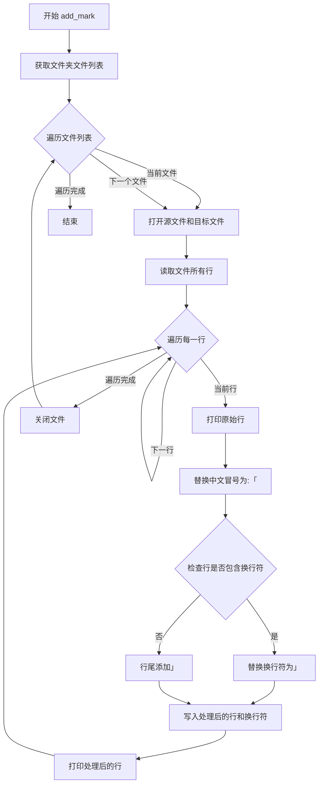
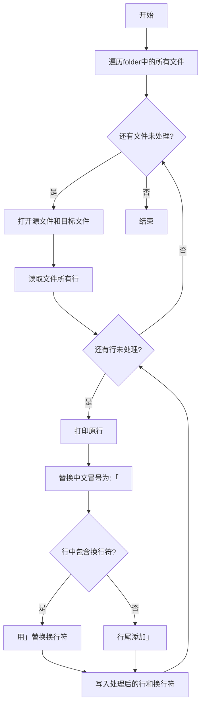

# `Chat-Haruhi-Suzumiya\characters\liyunlong\add_mark.py` 详细设计文档

该代码是一个简单的文本处理脚本，遍历指定源文件夹中的所有文本文件，读取每一行内容并进行特定的文本替换操作（将中文冒号替换为特殊符号，并添加引号封装），然后将处理后的内容写入到目标文件夹 'texts/' 中。

## 整体流程

```mermaid
graph TD
    A[开始] --> B[调用 add_mark('texts_source')]
    B --> C{遍历 texts_source 文件夹}
    C --> D{遍历每个文件}
    D --> E[打开源文件和目标文件]
    E --> F[读取文件所有行]
    F --> G{遍历每一行}
    G --> H[替换 '：' 为 ':「']
    H --> I{检查是否有换行符}
    I -- 否 --> J[添加 '」']
    I -- 是 --> K[替换 '\n' 为 '」']
    J --> L[写入处理后的行]
    K --> L
    L --> M{是否还有更多行?}
    M -- 是 --> G
    M -- 否 --> N{是否还有更多文件?}
    N -- 是 --> D
    N -- 否 --> O[结束]
```

## 类结构

```
无类定义
└── 模块级函数 add_mark
```

## 全局变量及字段


### `folder`
    
函数参数，要处理的文件夹路径

类型：`字符串`
    


### `file`
    
循环变量，当前遍历的文件名

类型：`字符串`
    


### `f1`
    
只读文件对象，用于读取源文件内容

类型：`文件对象`
    


### `f2`
    
写入文件对象，用于写入处理后的内容

类型：`文件对象`
    


### `line`
    
当前读取的行内容

类型：`字符串`
    


    

## 全局函数及方法


### `add_mark`

该函数用于遍历指定文件夹中的所有文本文件，将每行文本中的中文冒号`：`替换为`:「`，并在行尾添加中文引号`」`，处理后的内容写入到`texts/`目录下的对应文件中。

参数：

- `folder`：`str`，源文件夹路径，表示需要处理的文件所在的目录

返回值：`None`，该函数无返回值，仅执行文件读写操作

#### 流程图



#### 带注释源码

```
def add_mark(folder):
    """
    遍历指定文件夹中的所有文件，对每行文本进行格式处理
    
    处理规则：
    1. 将中文冒号（：）替换为:「
    2. 在行尾添加中文引号（」）替换或追加
    
    参数：
        folder: str, 源文件夹路径
    返回值：
        None
    """
    # 遍历源文件夹中的所有文件
    for file in os.listdir(folder):
        # 打开源文件（读取模式）和目标文件（写入模式）
        # 源文件：从folder参数指定的目录读取
        # 目标文件：写入到texts/目录下，文件名与源文件相同
        with open(os.path.join(folder, file), 'r', encoding='utf-8') as f1, \
             open('texts/'+file, 'w+', encoding='utf-8') as f2:
            
            # 读取源文件的所有行
            for line in f1.readlines():
                # 打印原始行（调试用）
                print(line)
                
                # 步骤1：将中文冒号替换为:「
                line = line.replace('：', ':「')
                
                # 步骤2：处理行尾的引号
                # 判断该行是否包含换行符
                if '\n' not in line:
                    # 无换行符则在行尾直接添加」
                    line = line + ('」')
                else:
                    # 有换行符则替换换行符为」
                    line = line.replace('\n', '」')
                
                # 打印处理后的行（调试用）
                print(line)
                
                # 写入处理后的行到目标文件
                f2.write(line)
                # 手动添加换行符，确保每行独立
                f2.write('\n')
```

## 关键组件


### 核心功能概述

该代码是一个简单的文本处理脚本，用于读取指定文件夹中的文本文件，将中文冒号"："替换为带中文左引号的格式":「"，并在每行末尾添加中文右引号"」"，最终将处理后的内容写入目标文件夹。

### 文件整体运行流程

1. 导入os模块以进行文件系统操作
2. 定义add_mark函数，接收源文件夹路径作为参数
3. 调用add_mark函数，传入'texts_source'作为源文件夹
4. 函数内部遍历源文件夹中的所有文件
5. 对每个文件逐行读取、处理、写入目标文件夹

### 全局变量和全局函数详细信息

#### 全局变量

| 名称 | 类型 | 描述 |
|------|------|------|
| os | module | Python标准库模块，提供操作系统交互功能 |

#### 全局函数

**add_mark(folder)**

- **参数名称**: folder
- **参数类型**: str
- **参数描述**: 源文件夹路径，包含待处理的文本文件
- **返回值类型**: None
- **返回值描述**: 无返回值，直接处理文件并写入目标目录

**Mermaid流程图:**



**带注释源码:**

```python
import os  # 导入操作系统模块，用于文件路径操作和目录遍历


def add_mark(folder):
    """
    处理指定文件夹中的文本文件，替换中文冒号并添加中文引号
    
    参数:
        folder: 源文件夹路径
    
    返回:
        None
    """
    # 遍历源文件夹中的所有文件
    for file in os.listdir(folder):
        # 打开源文件进行读取，打开目标文件进行写入
        with open(os.path.join(folder, file), 'r', encoding='utf-8') as f1, \
             open('texts/'+file, 'w+', encoding='utf-8') as f2:
            
            # 逐行读取源文件内容
            for line in f1.readlines():
                print(line)  # 打印原始行内容
                
                # 将中文冒号替换为带左引号的格式
                line = line.replace('：', ':「')
                
                # 根据行是否有换行符添加右引号
                if '\n' not in line:
                    line = line + ('」')  # 无换行符时追加
                else:
                    line = line.replace('\n', '」')  # 有换行符时替换
                
                print(line)  # 打印处理后的行
                f2.write(line)  # 写入处理后的内容
                f2.write('\n')  # 额外添加换行符

# 调用函数处理texts_source文件夹中的文件
add_mark('texts_source')
```

### 关键组件信息

| 组件名称 | 描述 |
|----------|------|
| os.listdir | 用于遍历指定文件夹中的所有文件和子文件夹 |
| os.path.join | 用于构建跨平台的文件路径 |
| 文件打开操作 | 使用with语句确保文件正确关闭 |
| 字符串替换 | 使用str.replace方法进行文本替换 |
| 编码指定 | 明确指定UTF-8编码以支持中文 |

### 潜在的技术债务或优化空间

1. **硬编码路径**: 源文件夹'texts_source'和目标文件夹'texts/'被硬编码，缺乏灵活性
2. **缺乏错误处理**: 未处理文件读取/写入可能的异常情况，如文件权限问题、编码错误
3. **目标目录不存在**: 未检查'texts/'目录是否存在，若不存在会导致写入失败
4. **重复换行符**: 代码在写入处理后的行后额外添加了'\n'，但处理逻辑中可能已包含换行符替换，可能导致空行
5. **一次性读取全部内容**: 使用readlines()会将整个文件加载到内存，大文件处理效率低
6. **无返回值或日志**: 处理结果无明确的成功/失败反馈
7. **文件名冲突**: 未处理源文件与目标文件重名时的覆盖行为说明

### 其它项目

**设计目标与约束:**
- 目标：将中文文本格式转换为带引号格式
- 约束：仅处理文本文件，假设输入为UTF-8编码的中文文本

**错误处理与异常设计:**
- 缺乏异常捕获机制
- 未处理文件不存在、权限不足、磁盘空间不足等异常情况

**数据流与状态机:**
- 数据流：源文件夹 → 内存处理 → 目标文件夹
- 简单线性处理流程，无复杂状态管理

**外部依赖与接口契约:**
- 依赖Python标准库os模块
- 接口：add_mark函数接收字符串类型文件夹路径参数
- 假设输入：folder参数指向存在的目录，包含文本文件


## 问题及建议


### 已知问题

-   硬编码路径：`folder` 参数直接使用，且输出路径 `'texts/'` 硬编码，无法灵活配置输入输出目录
-   缺乏错误处理：文件读写操作无任何异常捕获，文件不存在、编码错误或写入失败时程序会直接崩溃
-   输出目录未创建：`'texts/'` 目录若不存在，程序运行会抛出 `FileNotFoundError`
-   文件名冲突风险：当输入文件夹包含非文本文件（如隐藏文件或二进制文件）时，会尝试以文本模式打开，导致解码错误
-   换行符处理逻辑混乱：`readlines()` 已包含 `\n`，后续又手动添加 `\n`，导致行间出现空行
-   编码假设固定：强制使用 `utf-8` 编码，无法处理其他编码的文件
-   无返回值与日志：函数无返回值，错误时无日志记录，难以调试和追踪
-   函数参数缺少验证：未检查 `folder` 是否为有效路径、是否为空等

### 优化建议

-   使用 `pathlib.Path` 替代 `os.path` 拼接，提高跨平台兼容性并简化路径操作
-   在函数开头验证目录存在性，不存在时创建或抛出友好提示
-   添加 `try-except` 捕获 `UnicodeDecodeError`、`PermissionError` 等常见异常
-   使用 `os.scandir()` 配合 `is_file()` 过滤，仅处理文本文件或显式检查文件扩展名
-   改进换行处理：直接迭代文件对象而非 `readlines()`，或使用 `line.rstrip('\n')` 去除后自行添加
-   将路径参数化，支持配置文件或命令行参数传入
-   考虑添加日志记录或返回值（成功/失败文件列表），便于调用方感知执行结果
-   编码检测或支持多编码尝试，提高脚本的鲁棒性

## 其它


### 设计目标与约束

本代码旨在批量处理文本文件，将中文标点格式转换为特定的标记格式。具体目标包括：1）遍历源文件夹中的所有文本文件；2）将中文冒号"："替换为"：「"格式；3）为每行添加结束标记"」"；4）将处理后的文件输出到texts/目录。约束条件包括：输入文件必须为UTF-8编码的文本文件，输出目录texts/需要预先存在或具有写权限。

### 错误处理与异常设计

代码缺乏完善的错误处理机制，存在以下问题：1）未检查源文件夹是否存在；2）未检查输出目录texts/是否存在；3）文件读写异常未捕获；4）未处理非文本文件导致的编码错误。建议添加：文件夹不存在时创建或抛出明确异常；文件操作使用try-except捕获IOError；添加编码错误处理；对于非文本文件跳过或警告。

### 数据流与状态机

数据流如下：源文件夹(texts_source/) → 遍历文件列表 → 读取文件内容 → 按行处理(标点替换) → 写入目标文件夹(texts/)。状态机较简单：初始化状态 → 遍历文件状态 → 处理单文件状态 → 写入完成状态 → 全部完成状态。无复杂状态转换逻辑，属于线性处理流程。

### 外部依赖与接口契约

外部依赖：1）os模块 - Python标准库，用于文件和目录操作；2）操作系统文件系统 - 需要文件读取写入权限。接口契约：add_mark(folder)函数接受一个文件夹路径字符串参数，无返回值(返回None)，要求输入为存在且可读的目录，输出为处理后的文件写入texts/目录。

### 性能考虑

当前实现性能问题：1）逐行读取和写入效率较低；2）使用readlines()一次性加载整个文件到内存，大文件可能导致内存问题；3）每次处理都打开关闭文件。建议优化：使用with语句正确嵌套避免文件句柄泄漏；大文件使用逐行读取；考虑使用批量处理或并发处理。

### 安全性考虑

代码存在安全隐患：1）路径拼接未做安全检查，可能存在路径遍历攻击风险；2）未验证输入参数类型；3）输出路径硬编码为'texts/'目录。建议改进：添加输入参数验证；使用os.path.join确保路径安全；考虑参数化输出目录；添加文件类型过滤。

### 配置信息

硬编码配置项：1）源文件夹：'texts_source'；2）目标文件夹：'texts/'；3）文件编码：'utf-8'；4）替换规则：'：' → '：「'，行尾 → '」'。建议将配置项抽取为常量或配置文件，提高代码可维护性和灵活性。

### 测试策略

建议测试场景：1）正常流程测试 - 验证文件转换正确性；2）空文件夹测试；3）单文件测试；4）多文件测试；5）大文件测试；6）特殊字符测试；7）编码错误测试；8）权限不足测试。可使用pytest框架编写单元测试和集成测试。

### 日志记录

代码目前无日志记录功能。建议添加：1）记录处理文件数量；2）记录处理开始和结束时间；3）记录错误和异常信息；4）使用Python logging模块实现分级日志(DEBUG/INFO/WARNING/ERROR)。便于问题排查和运行监控。

    