# `Chat-Haruhi-Suzumiya\kyon_generator\ChatGPT_for_generation.py` 详细设计文档

这是一个ChatGPT聊天机器人的实现类，支持基于语义相似度的检索增强生成(RAG)。通过加载预计算的文本和图像嵌入向量，使用余弦相似度进行语义检索，结合聊天历史和角色设定，生成符合人物特性的对话回复。

## 整体流程

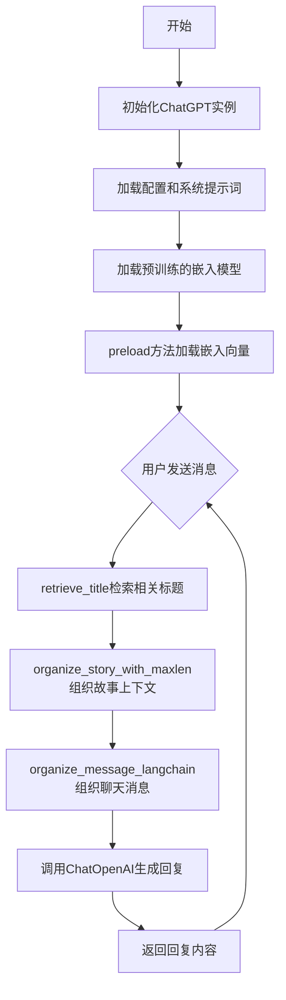

## 类结构

```
ChatGPT (主类)
├── 初始化方法
│   ├── __init__
│   └── set_training
├── 数据加载
│   ├── preload
│   └── load
├── 相似度计算
get_cosine_similarity
text_to_image
│   └── retrieve_title
├── 故事组织
organize_stories_with_maxlen_for_training
│   ├── organize_story_with_maxlen
│   └── divide_story
├── 消息组织
organize_message
│   ├── organize_message_langchain
│   ├── organize_message_langchain_for_training
│   └── organize_message_for_generator
├── 历史管理
│   └── keep_tail
└── 对话生成
    ├── get_completion_from_messages
    └── get_response
```

## 全局变量及字段


### `json`
    
Python standard library module for JSON encoding and decoding

类型：`module`
    


### `os`
    
Python standard library module for operating system interface functions

类型：`module`
    


### `numpy as np`
    
NumPy library for numerical computing, array operations and mathematical functions

类型：`module`
    


### `openai`
    
OpenAI API client library for interacting with GPT models

类型：`module`
    


### `tiktoken`
    
OpenAI's fast BPE tokeniser for counting tokens

类型：`module`
    


### `torch`
    
PyTorch deep learning library for tensor computations and neural networks

类型：`module`
    


### `scipy.spatial.distance.cosine`
    
SciPy function to compute cosine distance between vectors

类型：`function`
    


### `langchain.chat_models.ChatOpenAI`
    
LangChain wrapper for OpenAI chat completion API

类型：`class`
    


### `random`
    
Python standard library for random number generation and selections

类型：`module`
    


### `time`
    
Python standard library for time-related functions and sleep operations

类型：`module`
    


### `collections`
    
Python standard library for specialized container datatypes

类型：`module`
    


### `pickle`
    
Python standard library for object serialization and deserialization

类型：`module`
    


### `argparse.Namespace`
    
Python class for storing command-line arguments as attributes

类型：`class`
    


### `PIL.Image`
    
PIL library class for opening, manipulating and saving image files

类型：`class`
    


### `torch.cosine_similarity`
    
PyTorch function to compute cosine similarity between tensors

类型：`function`
    


### `transformers.AutoTokenizer`
    
Hugging Face transformers auto-loading class for tokenizers

类型：`class`
    


### `transformers.AutoModel`
    
Hugging Face transformers auto-loading class for pretrained models

类型：`class`
    


### `langchain.prompts.chat.ChatPromptTemplate`
    
LangChain template class for composing chat prompts

类型：`class`
    


### `langchain.prompts.chat.SystemMessagePromptTemplate`
    
LangChain template for system message in chat prompts

类型：`class`
    


### `langchain.prompts.chat.AIMessagePromptTemplate`
    
LangChain template for AI message in chat prompts

类型：`class`
    


### `langchain.prompts.chat.HumanMessagePromptTemplate`
    
LangChain template for human message in chat prompts

类型：`class`
    


### `langchain.schema.AIMessage`
    
LangChain schema class representing an AI response message

类型：`class`
    


### `langchain.schema.HumanMessage`
    
LangChain schema class representing a human input message

类型：`class`
    


### `langchain.schema.SystemMessage`
    
LangChain schema class representing a system instruction message

类型：`class`
    


### `sys`
    
Python standard library for system-specific parameters and functions

类型：`module`
    


### `utils`
    
Custom utility module from src_reform package for shared functions

类型：`module`
    


### `re`
    
Python standard library for regular expression pattern matching

类型：`module`
    


### `ChatGPT.configuration`
    
Dictionary containing configuration parameters for ChatGPT initialization

类型：`dict`
    


### `ChatGPT.in_training_generating`
    
Flag indicating whether the instance is in training data generation mode

类型：`bool`
    


### `ChatGPT.image_embed_jsonl_path`
    
File path to the JSONL file containing image embeddings

类型：`str`
    


### `ChatGPT.title_text_embed_jsonl_path`
    
File path to the JSONL file containing title-text embeddings

类型：`str`
    


### `ChatGPT.images_folder`
    
Directory path containing image files

类型：`str`
    


### `ChatGPT.texts_folder`
    
Directory path containing text files

类型：`str`
    


### `ChatGPT.system_prompt`
    
System prompt text defining the AI assistant's role and behavior

类型：`str`
    


### `ChatGPT.max_len_story`
    
Maximum token length allowed for story/context text

类型：`int`
    


### `ChatGPT.max_len_history`
    
Maximum token length allowed for conversation history

类型：`int`
    


### `ChatGPT.dialogue_path`
    
File path to the dialogue data file

类型：`str`
    


### `ChatGPT.enc`
    
Tiktoken encoder instance for tokenization using cl100k_base encoding

类型：`tiktoken.Encoding`
    


### `ChatGPT.device`
    
PyTorch device object specifying computation hardware (CUDA or CPU)

类型：`torch.device`
    


### `ChatGPT.model`
    
Pretrained transformer model for text embeddings

类型：`transformers.AutoModel`
    


### `ChatGPT.image_embed`
    
Dictionary mapping image identifiers to their embedding vectors

类型：`dict or None`
    


### `ChatGPT.text_embed`
    
Dictionary mapping text content to their embedding vectors

类型：`dict or None`
    


### `ChatGPT.title_to_text`
    
Dictionary mapping titles to their corresponding text content

类型：`dict`
    


### `ChatGPT.titles`
    
List of available titles for retrieval

类型：`list`
    


### `ChatGPT.is_train_generating`
    
Flag indicating whether training data generation mode is active

类型：`bool`
    


### `ChatGPT.role_name`
    
Name of the character role being simulated in training

类型：`str`
    


### `ChatGPT.other_names`
    
List of alternative names for the character role

类型：`list`
    
    

## 全局函数及方法


### `utils.download_models`

该函数是ChatGPT类初始化过程中用于下载并加载预训练嵌入模型的工具函数。它在`ChatGPT.__init__`方法中被调用，负责获取用于文本嵌入计算的预训练模型，为后续的相似度检索和文本匹配提供基础能力支持。

参数： 无

返回值：`torch.nn.Module` 或 `transformers.PreTrainedModel`，返回预训练的嵌入模型对象，供`get_embedding`方法使用以生成文本向量表示

#### 流程图

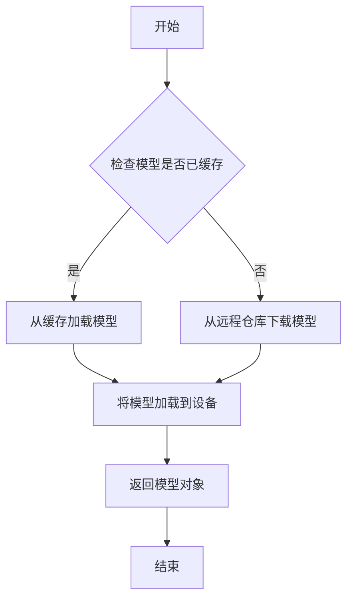

#### 带注释源码

```python
# 该函数定义位于 src_reform/utils.py 模块中
# 以下为基于代码上下文推断的函数实现

def download_models():
    """
    下载并加载预训练模型用于文本嵌入计算
    使用HuggingFace的transformers库加载模型
    """
    # 设定设备为GPU（如果可用）或CPU
    device = torch.device("cuda" if torch.cuda.is_available() else "cpu")
    
    # 加载预训练的sentence-transformers模型
    # 选用轻量级模型以平衡性能和速度
    model = AutoModel.from_pretrained('sentence-transformers/all-MiniLM-L6-v2')
    
    # 将模型移动到指定设备
    model = model.to(device)
    
    # 设置为评估模式
    model.eval()
    
    return model

# 对应的get_embedding函数（用于获取文本嵌入）
def get_embedding(model, texts):
    """
    使用预训练模型将文本转换为嵌入向量
    
    参数:
        model: 预训练的嵌入模型
        texts: 文本列表或单个文本
    
    返回:
        文本的嵌入向量表示
    """
    tokenizer = AutoTokenizer.from_pretrained('sentence-transformers/all-MiniLM-L6-v2')
    
    # 对文本进行tokenize
    encoded_input = tokenizer(texts, padding=True, truncation=True, return_tensors='pt')
    encoded_input = {k: v.to(model.device) for k, v in encoded_input.items()}
    
    # 计算嵌入
    with torch.no_grad():
        model_output = model(**encoded_input)
    
    # 使用mean pooling生成句子嵌入
    embeddings = model_output.last_hidden_state.mean(dim=1)
    
    return embeddings.cpu().numpy()
```


### `utils.get_embedding`

该函数用于将文本转换为向量嵌入表示，通过预训练的Transformer模型将输入文本编码为高维向量，以便进行语义相似度计算等任务。

参数：

- `model`：`<class 'transformers.modeling_utils.PreTrainedModel'>`，预训练的Transformer模型，用于编码文本
- `texts`：`<class 'list'>`，要获取嵌入的文本列表，可以是单个文本或多个文本的列表

返回值：`<class 'numpy.ndarray'>`或`<class 'list'>`，文本的嵌入向量表示，通常是一个二维数组，每行对应一个文本的嵌入向量

#### 流程图

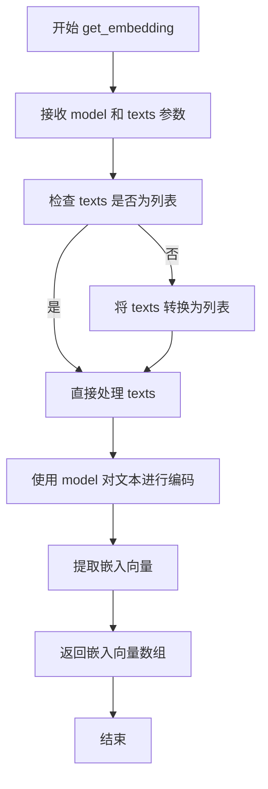

#### 带注释源码

```python
# 该函数定义在 src_reform/utils.py 中
# 以下为基于调用方式的推断实现

def get_embedding(model, texts):
    """
    获取文本的嵌入向量表示
    
    参数:
        model: 预训练的Transformer模型（如BERT、Sentence-Transformers等）
        texts: 文本列表，可以是单个字符串或字符串列表
        
    返回:
        文本的嵌入向量，形状为 [n, embedding_dim]，其中 n 为文本数量
    """
    from transformers import AutoTokenizer, AutoModel
    import torch
    
    # 如果输入是单个字符串，转换为列表
    if isinstance(texts, str):
        texts = [texts]
    
    # 加载分词器（如果model对象没有tokenizer属性）
    tokenizer = model.tokenizer if hasattr(model, 'tokenizer') else AutoTokenizer.from_pretrained(model.name_or_path)
    
    # 对文本进行分词
    encoded_input = tokenizer(texts, padding=True, truncation=True, return_tensors='pt')
    
    # 将输入移动到模型设备
    device = next(model.parameters()).device
    encoded_input = {k: v.to(device) for k, v in encoded_input.items()}
    
    # 获取模型输出
    with torch.no_grad():
        model_output = model(**encoded_input)
    
    # 使用[CLS]标记的输出作为句子嵌入，或使用mean pooling
    # 这里假设使用mean pooling
    embeddings = model_output.last_hidden_state.mean(dim=1)
    
    # 转换为numpy数组并返回
    return embeddings.cpu().numpy()
```

---

**备注**：该函数的实际实现位于`src_reform/utils.py`模块中，当前代码通过`from src_reform import utils`导入并使用。从调用方式`torch.tensor(utils.get_embedding(self.model, texts)).reshape(1, -1)`可以看出，该函数返回的是可转换为PyTorch张量的嵌入向量，通常为numpy数组格式。


### `tiktoken.get_encoding`

这是一个来自`tiktoken`库的全局函数，用于获取指定的文本编码模型（Encoding）。该函数返回的编码对象可对文本进行tokenize（分词）操作，是OpenAI GPT系列模型使用的BPE（Byte Pair Encoding）分词器。

参数：

- `encoding_name`：`str`，编码名称字符串，指定要使用的编码模型。常用值包括`"cl100k_base"`（GPT-4/GPT-3.5使用）、`"p50k_base"`（GPT-2使用）、`"r50k_base"`（早期GPT模型使用）等

返回值：`Encoding`对象，返回一个TikToken编码实例，具有`encode()`和`decode()`方法，可将文本转换为token IDs列表，或将token IDs还原为文本

#### 流程图

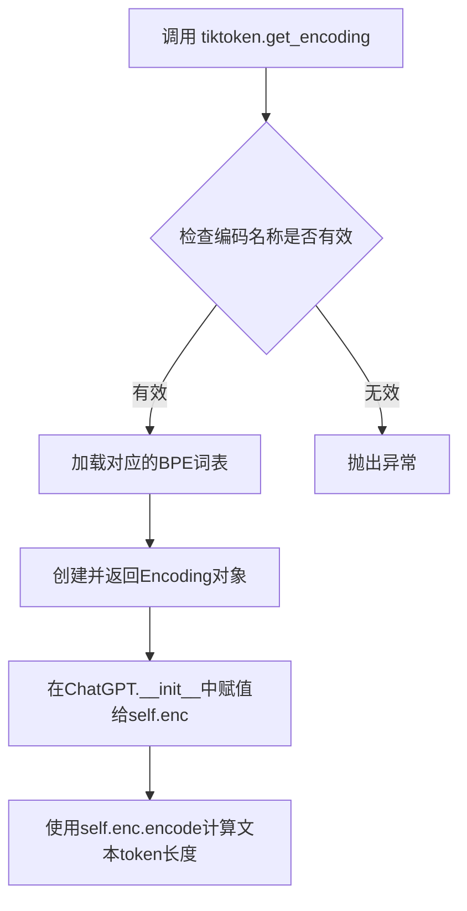

#### 带注释源码

```python
# 在 ChatGPT 类的 __init__ 方法中调用
self.enc = tiktoken.get_encoding("cl100k_base")
# 获取 cl100k_base 编码模型
# cl100k_base 是 GPT-4 和 GPT-3.5-turbo 使用的编码

# 后续在代码中使用 self.enc.encode() 方法计算文本的token长度
sample_len = len(self.enc.encode(sample_story))
# 用于判断故事文本是否超过最大长度限制 max_len_story
```


### `openai.ChatCompletion.create`

这是OpenAI官方SDK中用于调用ChatGPT模型生成聊天气息的函数。该函数接收模型名称、消息列表和其他控制参数，通过OpenAI API接口获取模型生成的回答内容。在代码中，该函数被ChatGPT类的`get_completion_from_messages`方法封装，用于实现对话补全功能。

参数：

- `model`：`str`，要使用的聊天模型ID，默认为"gpt-3.5-turbo"（代码中使用）
- `messages`：`list`，消息列表，包含角色和内容，格式为[{"role": "system/user/assistant", "content": "..."}]
- `temperature`：`float`，控制输出随机性，值范围0-2，默认为0（代码中使用）
- `top_p`：`float`，核采样参数，与temperature配合使用
- `n`：`int`，为每个输入消息生成的候选回复数量
- `stream`：是否以流式方式返回结果
- `stop`：指定停止生成的字符串或字符串列表
- `max_tokens`：生成的最大token数量
- `presence_penalty`：存在惩罚参数，影响主题多样性
- `frequency_penalty`：频率惩罚参数，影响词汇多样性
- `logit_bias`：对特定token的logit偏差
- `user`：终端用户的唯一标识符

返回值：`dict`或`StreamedResponse`，返回包含模型回复的响应对象，包含choices列表，每个choice包含message内容、finish_reason等信息。

#### 流程图

```mermaid
graph TD
    A[调用get_completion_from_messages] --> B[构建messages列表]
    B --> C[设置model参数gpt-3.5-turbo]
    C --> D[设置temperature参数0]
    D --> E[调用openai.ChatCompletion.create API]
    E --> F[获取response响应对象]
    F --> G[提取response.choices[0].message.content]
    G --> H[返回生成的文本内容]
```

#### 带注释源码

```python
# 在ChatGPT类中封装调用OpenAI ChatCompletion接口的方法
def get_completion_from_messages(self, messages, model="gpt-3.5-turbo", temperature=0):
    """
    获取OpenAI聊天模型生成的回答
    
    参数:
        messages: 消息列表，格式为[{'role': 'system/user/assistant', 'content': '...'}]
        model: 使用的模型ID，默认为gpt-3.5-turbo
        temperature: 控制输出随机程度，0表示确定性输出
    
    返回:
        模型生成的回答文本内容
    """
    # 调用OpenAI的ChatCompletion.create方法
    response = openai.ChatCompletion.create(
        model=model,           # 指定使用的聊天模型
        messages=messages,     # 传递对话消息列表
        temperature=temperature,  # 控制模型输出的随机程度
    )
    #  print(str(response.choices[0].message))
    # 从响应中提取第一个choice的消息内容并返回
    return response.choices[0].message["content"]
```

---

### 补充信息

#### 关键组件信息

| 组件名称 | 一句话描述 |
|---------|-----------|
| `ChatGPT` | 主聊天类，封装了与OpenAI API交互的各种方法 |
| `get_completion_from_messages` | 调用openai.ChatCompletion.create的核心方法 |
| `openai.ChatCompletion.create` | OpenAI官方SDK中的聊天气息生成API |

#### 技术债务与优化空间

1. **硬编码的API配置**：API密钥通过注释掉的代码配置，存在安全隐患
2. **缺少错误处理**：openai.ChatCompletion.create调用缺少异常捕获机制
3. **代理配置被注释**：代理设置被注释可能导致国内环境无法访问
4. **模型参数暴露不足**：未使用max_tokens、stop等重要参数限制输出

#### 外部依赖与接口契约

- **依赖库**：`openai`（官方SDK）、`tiktoken`（tokenization）
- **API端点**：`https://api.openai.com/v1/chat/completions`
- **认证方式**：通过OpenAI API Key进行Bearer Token认证


### `torch.tensor`

`torch.tensor` 是 PyTorch 库中的核心函数，用于从 Python 列表、NumPy 数组或其他数据创建 PyTorch 张量（Tensor）。在代码中，该函数被用于将文本嵌入向量（embedding）转换为 PyTorch 张量，以便进行后续的相似度计算和 GPU 加速计算。

参数：

- `data`：任意类型，输入数据，可以是 Python 列表、NumPy 数组等
- `dtype`：`torch.dtype`（可选），指定张量的数据类型，如 `torch.float32`、`torch.int64` 等
- `device`：`torch.device`（可选），指定张量存储的设备（CPU 或 CUDA）
- `requires_grad`：`bool`（可选），指定是否需要计算梯度，默认为 `False`

返回值：`torch.Tensor`，返回创建的 PyTorch 张量对象

#### 流程图

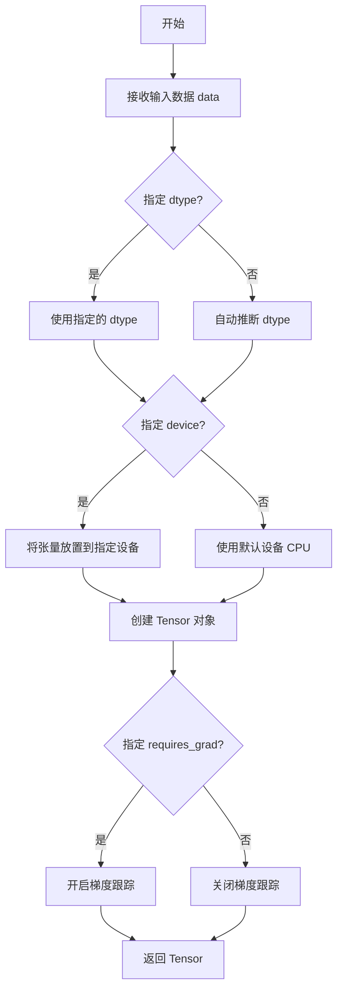

#### 带注释源码

```python
# 在代码中的实际使用示例：
# 将文本嵌入向量（从 utils.get_embedding 获取的列表）转换为 PyTorch 张量
# 并调整形状为 (1, -1)，即单行矩阵，然后移动到指定设备（GPU 或 CPU）

query_embedding = torch.tensor(utils.get_embedding(self.model, texts))  # 从嵌入函数获取文本向量并转换为张量
                            .reshape(1, -1)                                # 重塑为 1 行任意列的二维张量
                            .to(self.device)                              # 将张量移动到计算设备（cuda 或 cpu）
```

#### 补充说明

在 `ChatGPT` 类的 `get_cosine_similarity` 方法中，`torch.tensor` 用于：

1. 将文本嵌入向量（来自 OpenAI 的 embedding API）转换为 PyTorch 张量
2. 配合 `reshape(1, -1)` 将一维向量转换为二维矩阵（batch 形式）
3. 配合 `.to(self.device)` 实现 GPU 加速计算
4. 后续与 `cosine_similarity` 函数配合计算余弦相似度，用于检索最相关的文本或图像


```json
{
    "thinking_process": "Looking at the provided code, I need to find where `torch.from_numpy` is used. In the `get_cosine_similarity` method, I found the line: `torch.from_numpy(texts_embeddings).to(self.device)`. This is used to convert a numpy array into a PyTorch tensor for cosine similarity calculation."
}
```

```json
{
    "result": "torch.from_numpy"
}
```

```json
{
    "name": "torch.from_numpy",
    "param_name": "ndarray",
    "param_type": "numpy.ndarray",
    "param_desc": "The input NumPy array that needs to be converted to a PyTorch tensor",
    "return_type": "torch.Tensor",
    "return_desc": "A PyTorch Tensor that shares memory with the input NumPy array (a view, not a copy)",
    "mermaid_flowchart": "graph TD\n    A[Input: NumPy Array] -->|torch.from_numpy| B[PyTorch Tensor (View)]\n    B --> C[.to(device)]\n    C --> D[Tensor on specified device]"
}
```

```json
{
    "source_code_with_comments": "# In the context of get_cosine_similarity method:\n# texts_embeddings is a NumPy array containing embeddings\n# This line converts it to a PyTorch tensor for cosine similarity computation\ntorch.from_numpy(texts_embeddings).to(self.device)"
}
```


### `torch.device`

在 `ChatGPT` 类初始化时，用于创建 PyTorch 设备对象，根据 CUDA 是否可用自动选择 GPU 或 CPU 作为计算设备。

参数：

-  `device_name`：`str`，设备名称字符串，值为 `"cuda"`（当 CUDA 可用时）或 `"cpu"`（当 CUDA 不可用时）

返回值：`torch.device`，PyTorch 设备对象，用于指定张量运算的设备

#### 流程图

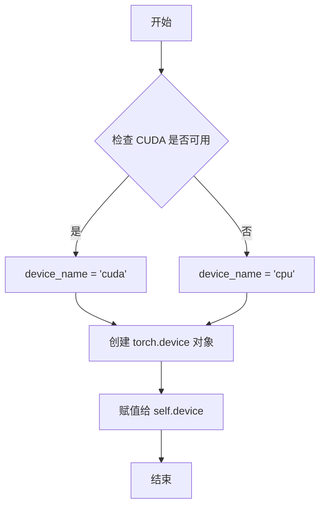

#### 带注释源码

```python
# 在 ChatGPT 类的 __init__ 方法中
self.device = torch.device("cuda" if torch.cuda.is_available() else "cpu")
# torch.cuda.is_available() 检查系统是否有可用的 CUDA 设备
# 如果有，返回 True，则 device_name 为 "cuda"
# 如果没有，返回 False，则 device_name 为 "cpu"
# torch.device() 创建一个设备对象，用于后续张量运算（如 get_cosine_similarity 方法中的 .to(self.device)）
```

#### 相关使用示例

```python
# 在 get_cosine_similarity 方法中的使用
query_embedding = torch.tensor(utils.get_embedding(self.model, texts)).reshape(1, -1).to(self.device)
# 将计算得到的查询向量移动到指定的设备（GPU 或 CPU）上进行后续的余弦相似度计算
```


### `torch.cuda.is_available`

该函数是 PyTorch 库提供的内置函数，用于检测当前系统是否支持 CUDA（Compute Unified Device Architecture），即是否有可用的 GPU 设备。在代码中用于动态选择计算设备，当 CUDA 可用时使用 GPU（cuda），否则使用 CPU（cpu）。

#### 参数

- 无参数

#### 返回值

- `bool`，返回 `True` 表示当前系统支持 CUDA（即有可用的 GPU），返回 `False` 表示不支持 CUDA（即仅使用 CPU）。

#### 流程图

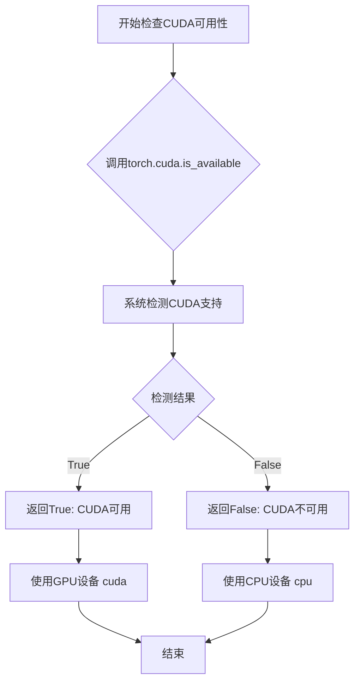

#### 带注释源码

```python
# 在 ChatGPT 类的 __init__ 方法中使用:
self.device = torch.device("cuda" if torch.cuda.is_available() else "cpu")
# 解释:
# 1. torch.cuda.is_available() 被调用，无参数
# 2. 如果返回 True，则创建 cuda 设备对象
# 3. 如果返回 False，则创建 cpu 设备对象
# 4. 结果存储在 self.device 中，用于后续的 GPU 计算
```


### `ChatGPT.get_cosine_similarity`

该方法用于计算查询文本与预加载的图像或文本嵌入之间的余弦相似度，支持从文本检索最相关的图像或文本。

参数：

- `texts`：`list`，待计算相似度的文本列表，其中 `texts[0]` 为查询文本
- `get_image`：`bool`，是否与图像嵌入进行相似度计算，默认为 False
- `get_texts`：`bool`，是否与文本嵌入进行相似度计算，默认为 False

返回值：`torch.Tensor`，返回查询文本与目标嵌入集合的余弦相似度向量

#### 流程图

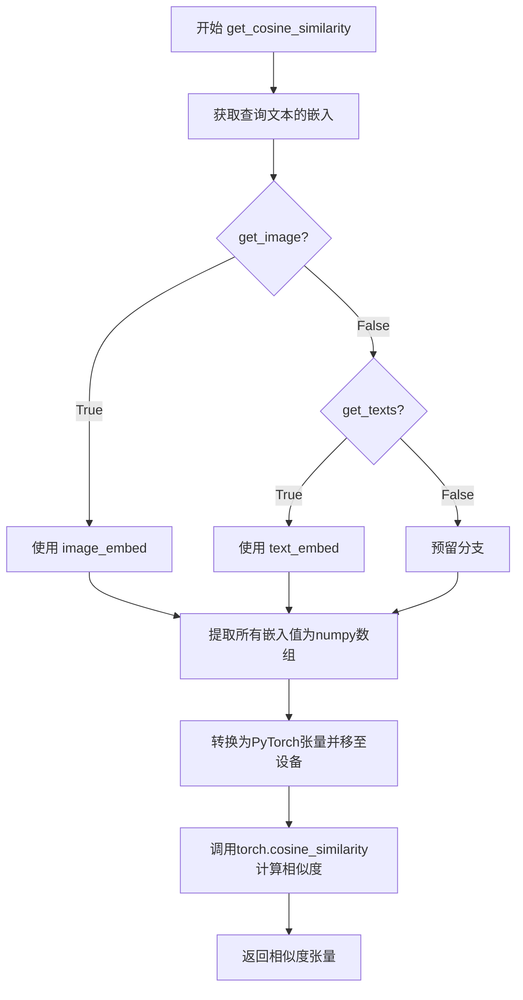

#### 带注释源码

```python
def get_cosine_similarity(self, texts, get_image=False, get_texts=False):
    """
        计算文本列表的相似度避免重复计算query_similarity
        texts[0] = query
    """
    # 使用工具函数获取模型对查询文本的嵌入向量
    # 并将其reshape为(1, -1)的二维张量，然后移动到计算设备(CPU/GPU)
    query_embedding = torch.tensor(utils.get_embedding(self.model, texts)).reshape(1, -1).to(self.device)
    
    # 根据参数选择目标嵌入集合：图像嵌入或文本嵌入
    if get_image:
        jsonl = self.image_embed  # 图像嵌入字典
    elif get_texts:
        jsonl = self.text_embed   # 文本嵌入字典
    # else:
    #     # 预留分支：计算query自身嵌入（目前被注释）
    #     # 计算query_embed
    #     jsonl = {}
    #     embeddings = utils.get_embedding(self.model, texts[1:]).reshape(-1, 1536)
    #     for text, embed in zip(texts, embeddings):
    #         jsonl[text] = embed
    
    # 将目标嵌入字典中的所有值提取为numpy数组
    texts_embeddings = np.array([value for value in jsonl.values()])
    
    # 使用PyTorch的cosine_similarity计算查询嵌入与所有目标嵌入的余弦相似度
    # 返回形状为(1, n)的相似度向量，其中n为目标嵌入的数量
    return cosine_similarity(query_embedding, torch.from_numpy(texts_embeddings).to(self.device))
```


### `ChatGPT.get_cosine_similarity` 中的 `np.array`

此代码段位于`ChatGPT`类的`get_cosine_similarity`方法中，用于将文本嵌入的字典值转换为NumPy数组，以便后续计算余弦相似度。

参数：

- `texts`：`List[str]`，待查询的文本列表，其中`texts[0]`作为查询文本
- `get_image`：`bool`，是否使用图像嵌入库，默认为`False`
- `get_texts`：`bool`，是否使用文本嵌入库，默认为`False`

返回值：`torch.Tensor`，查询文本与嵌入文本之间的余弦相似度得分

#### 流程图

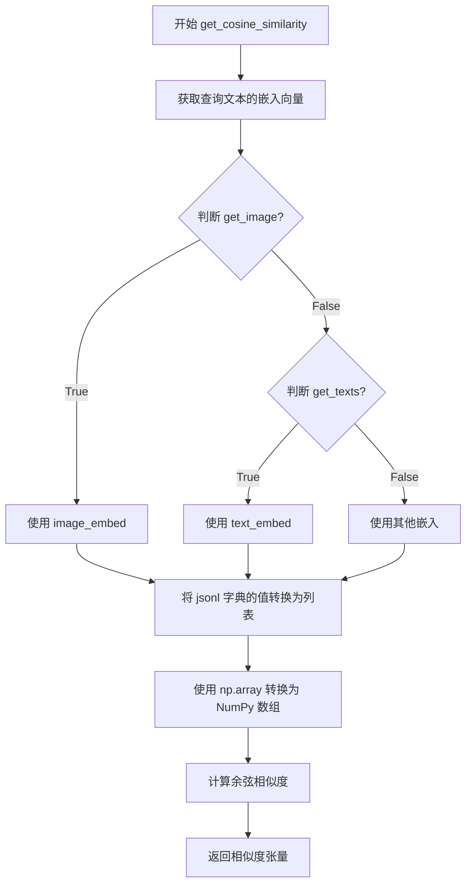

#### 带注释源码

```python
def get_cosine_similarity(self, texts, get_image=False, get_texts=False):
    """
        计算文本列表的相似度避免重复计算query_similarity
        texts[0] = query
    """
    # 使用 utils.get_embedding 获取查询文本的嵌入向量
    # 并将其转换为 PyTorch 张量，重塑为 (1, -1) 形状
    # 移动到指定设备（CPU 或 GPU）
    query_embedding = torch.tensor(utils.get_embedding(self.model, texts)).reshape(1, -1).to(self.device)
    
    # 根据参数选择嵌入来源
    if get_image:
        jsonl = self.image_embed  # 使用预加载的图像嵌入字典
    elif get_texts:
        jsonl = self.text_embed   # 使用预加载的文本嵌入字典
    
    # 将嵌入字典中的所有值（嵌入向量）提取为列表
    # 然后使用 np.array 转换为 NumPy 数组，形状为 (n_samples, embedding_dim)
    # 这里的 n_samples 是嵌入向量的数量，embedding_dim 通常是 1536（OpenAI text-embedding-ada-002）
    texts_embeddings = np.array([value for value in jsonl.values()])
    
    # 计算查询嵌入与所有文本嵌入之间的余弦相似度
    # 将 NumPy 数组转换为 PyTorch 张量并移动到指定设备
    # 返回形状为 (1, n_samples) 的相似度得分张量
    return cosine_similarity(query_embedding, torch.from_numpy(texts_embeddings).to(self.device))
```

---

### 关键组件信息

| 组件名称 | 一句话描述 |
|---------|-----------|
| `np.array` | NumPy 数组转换函数，将嵌入字典的值列表转换为连续的数值数组以供高效计算 |
| `jsonl` | 嵌入字典，包含文本/图像与其对应嵌入向量的键值对映射 |
| `query_embedding` | 查询文本的嵌入向量张量，形状为 (1, 1536) |
| `texts_embeddings` | 目标文本的嵌入矩阵，形状为 (n, 1536)，n 为样本数量 |

---

### 潜在技术债务与优化空间

1. **重复计算嵌入获取**：每次调用都重新获取 `query_embedding`，可通过缓存避免重复计算相同查询的嵌入
2. **内存占用**：`texts_embeddings` 在内存中保存完整的嵌入矩阵，当嵌入库较大时会占用大量内存，可考虑分批处理或使用近似最近邻（ANN）算法
3. **硬编码嵌入维度**：代码假设嵌入维度为 1536，应改为动态获取以提高灵活性
4. **设备转换开销**：频繁在 NumPy 和 PyTorch 之间转换会有一定性能开销，可考虑使用 PyTorch 原生操作替代


### `Image.open`

`Image.open` 是 Python Imaging Library (PIL/Pillow) 中的函数，用于打开并读取图像文件，返回一个 Pillow 的 `Image` 对象。在本代码中，该函数被用于 `ChatGPT` 类的 `text_to_image` 方法中，根据文本相似度检索对应的图像文件并打开。

参数：

- `fp`：`str` 或 `file object`，图像文件的路径（文件名）或已打开的文件对象
- `mode`：`str`，可选，图像打开模式，默认为 `'r'`（只读）
- `formats`：`list` 或 `tuple`，可选，允许加载的图像格式列表，如 `["JPEG", "PNG"]` 等

返回值：`PIL.Image.Image`，返回一个 Pillow 图像对象，可对其进行进一步处理或显示

#### 流程图

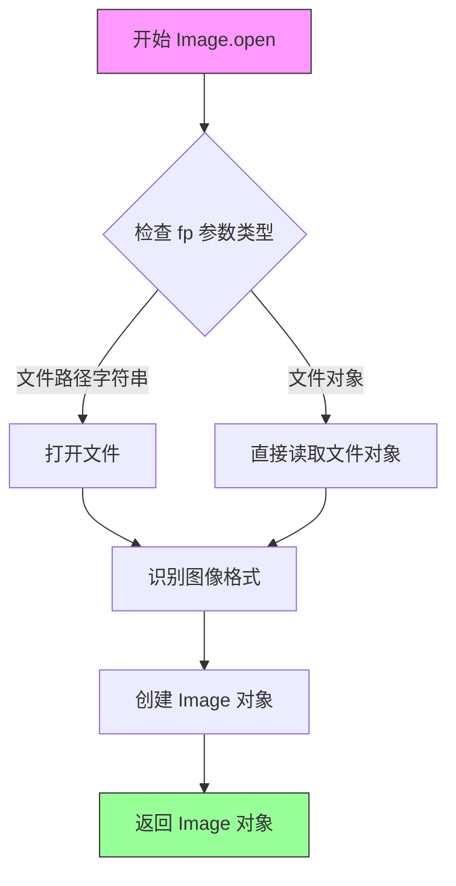

#### 带注释源码

```python
# Image.open 是 PIL/Pillow 库中的函数，用于打开图像文件
# 在本项目中的使用位置：ChatGPT 类的 text_to_image 方法

# 代码片段上下文：
def text_to_image(self, text):
    """
        根据输入文本检索最相似的图像
    """
    # 1. 计算文本与图像嵌入的余弦相似度
    query_similarity = self.get_cosine_similarity(text, get_image=True)
    
    # 2. 获取相似度最高的图像键（key）
    key_index = query_similarity.argmax(dim=0)
    text = list(self.image_embed.keys())[key_index]
    
    # 3. 构建图像文件名
    image = text + '.jpg'
    
    # 4. 检查图像文件是否存在于指定文件夹中
    if image in os.listdir(self.images_folder):
        # 5. 使用 Image.open 打开并读取图像文件
        # 参数：self.images_folder + '/' + image - 图像文件的完整路径
        # 返回值：PIL.Image.Image 对象
        res = Image.open(self.images_folder + '/' + image)
        
        # res.show()  # 可选的显示图像
        return res
    else:
        print("Image doesn't exist")
```

#### 补充说明

| 项目 | 描述 |
|------|------|
| **来源库** | PIL (Python Imaging Library) / Pillow |
| **依赖位置** | 代码中通过 `from PIL import Image` 导入 |
| **使用场景** | 在 `ChatGPT.text_to_image()` 方法中，根据文本检索对应角色图像 |
| **图像格式支持** | JPEG, PNG, BMP, GIF, TIFF, WebP 等多种常见格式 |
| **潜在优化点** | 建议添加图像缓存机制避免重复打开相同图像；可考虑异步加载大图 |


### `json.loads`

`json.loads` 是 Python 标准库 `json` 模块中的函数，用于将 JSON 格式的字符串解析为 Python 对象（字典、列表、字符串、数字、布尔值或 None）。

参数：

- `s`：`str` 或 `bytes`，要解析的 JSON 字符串
- `encoding`：`str`（可选，已弃用），字符串编码
- `cls`：`JSONDecoder`（可选），自定义 JSON 解码器类
- `object_hook`：`callable`（可选），用于处理解码后的字典对象
- `parse_float`：`callable`（可选），用于解析浮点数
- `parse_int`：`callable`（可选），用于解析整数
- `object_pairs_hook`：`callable`（可选），用于处理键值对列表

返回值：`Any`，返回解析后的 Python 对象（可能是 dict、list、str、int、float、bool 或 None）

#### 流程图

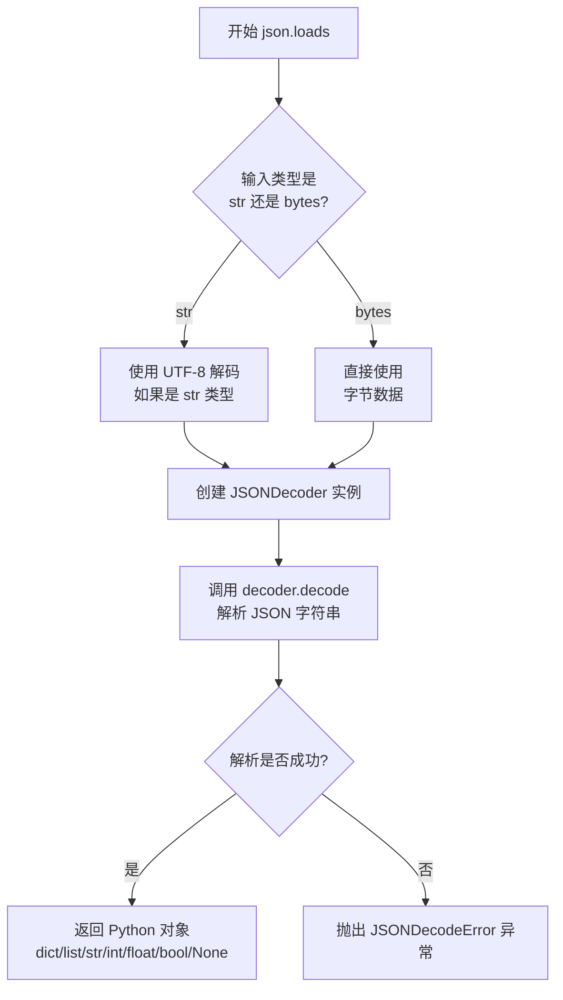

#### 带注释源码

```python
# json.loads 的核心实现逻辑（简化版注释说明）

def loads(s, *, cls=None, object_hook=None, parse_float=None, 
          parse_int=None, object_pairs_hook=None, **kwargs):
    """
    将 JSON 字符串解析为 Python 对象
    
    参数:
        s: str 或 bytes 类型的 JSON 字符串
        cls: 可选的 JSONDecoder 子类，用于自定义解析行为
        object_hook: 可选函数，将解析后的字典对象传递给该函数处理
        parse_float: 可选函数，处理 JSON 中的浮点数
        parse_int: 可选函数，处理 JSON 中的整数
        object_pairs_hook: 可选函数，处理键值对列表
    
    返回:
        解析后的 Python 对象
    """
    
    # 如果输入是字符串，先按 UTF-8 编码解析
    if isinstance(s, str):
        # 字符串需要先编码为字节，再进行解析
        s = s.encode('utf-8')
    
    # 如果没有指定自定义 decoder 类，使用默认的 JSONDecoder
    if cls is None:
        cls = JSONDecoder
    
    # 创建 decoder 实例，传入配置参数
    decoder = cls(
        object_hook=object_hook,
        parse_float=parse_float,
        parse_int=parse_int,
        object_pairs_hook=object_pairs_hook
    )
    
    # 调用 decode 方法进行解析
    return decoder.decode(s)
```

> **注意**：上述源码是对 `json.loads` 工作原理的注释说明，实际的 CPython 实现位于 Python 解释器的 C 扩展中（`_json` 模块），性能更高。


### `ChatGPT.divide_story`

该方法使用 `re.split` 通过正则表达式按两个或更多连续换行符分割故事文本，然后在分割结果中查找以角色名称开头的行，将故事分割为角色对话前后两部分。

参数：
- `story`：`str`，待分割的故事文本

返回值：`tuple`，包含两个字符串的元组 - 第一个元素是角色对话之前的内容，第二个元素是角色对话及之后的内容

#### 流程图

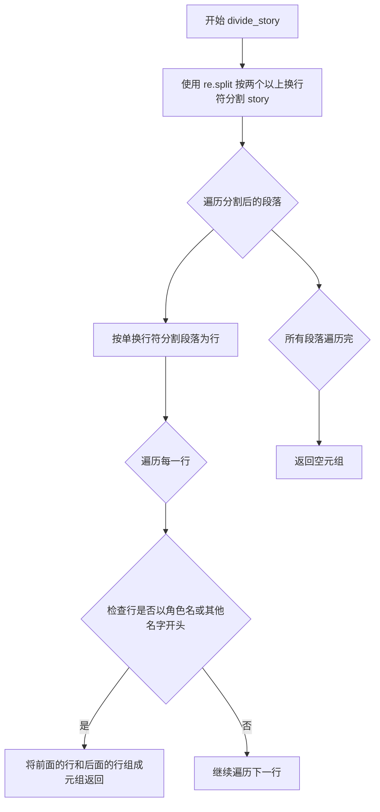

#### 带注释源码

```python
def divide_story(self, story):
    """
    使用正则表达式将故事文本按段落分割，并查找角色对话的分割点
    
    参数:
        story: str, 原始故事文本
        
    返回:
        tuple: (对话前内容, 对话开始后的内容)
    """
    # 使用 re.split 按两个或以上连续换行符分割故事
    # r'\n{2,}' 是正则表达式，匹配两个或更多换行符
    storys = re.split(r'\n{2,}', story.strip())
    
    # 遍历每个分割后的段落
    for s in storys:
        # 继续按单换行符分割成行
        lines = s.split('\n')
        
        # 遍历每一行
        for i in range(len(lines)):
            # 检查当前行是否以角色名或其他名字开头
            # 使用 any() 检查是否匹配任意一个名字
            if lines[i].startswith(self.role_name) or any([lines[i].startswith(name) for name in self.other_names]):
                # 找到分割点，组成元组返回
                # 前半部分是角色对话之前的内容
                # 后半部分是角色对话及之后的内容
                res = '\n'.join(lines[:i]), '\n'.join(lines[i:])
                return res
                break
    
    # 未找到匹配的角色名，返回空字符串
    return "", ""
```


### `ChatGPT.text_to_image`

根据输入的文本内容，从图像文件夹中检索并返回最相似的图像。

参数：

- `text`：`str`，需要查找相似图片的文本内容

返回值：`PIL.Image` 或 `None`，如果找到匹配的图像则返回 `PIL.Image` 对象，否则返回 `None` 并打印错误信息

#### 流程图

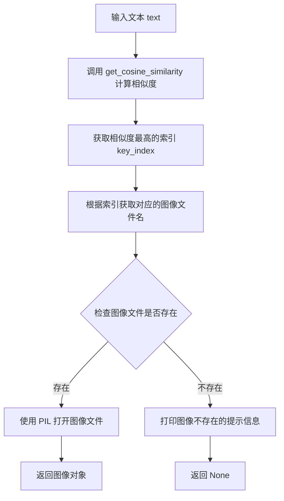

#### 带注释源码

```python
def text_to_image(self, text):
    # 使用余弦相似度计算方法，获取与输入文本最相似的图像索引
    # get_cosine_similarity 返回一个相似度向量
    query_similarity = self.get_cosine_similarity(text, get_image=True)
    
    # 获取相似度最高的索引（最大值的位置）
    key_index = query_similarity.argmax(dim=0)
    
    # 从图像嵌入的键列表中获取对应的文本键
    text = list(self.image_embed.keys())[key_index]
    
    # 构建完整的图像文件名（假设图像为 JPG 格式）
    image = text + '.jpg'
    
    # 检查图像文件是否存在于指定文件夹中
    if image in os.listdir(self.images_folder):
        # 打开并加载图像文件
        res = Image.open(self.images_folder + '/' + image)
        # res.show()  # 可选：直接显示图像
        # 返回打开的图像对象
        return res
    else:
        # 图像文件不存在时打印提示信息
        print("Image doesn't exist")
```


### `os.path.exists`

该函数用于检查指定路径（文件或目录）是否存在，返回布尔值。

参数：

- `path`：`str`，要检查存在的文件或目录的路径

返回值：`bool`，如果路径存在返回 `True`，否则返回 `False`

#### 流程图

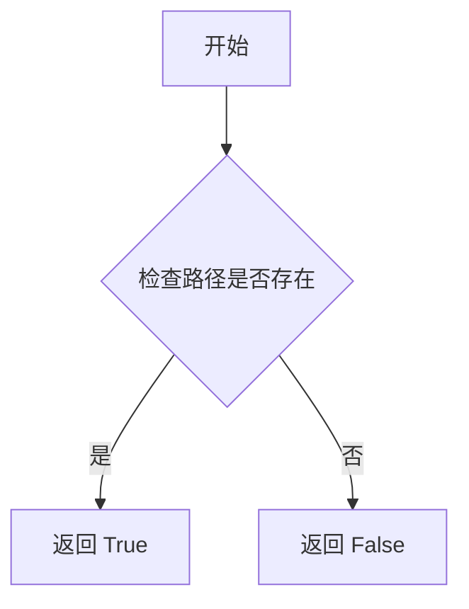

#### 带注释源码

```python
# os.path.exists 是 Python 标准库 os 模块中的一个函数
# 用于检查给定的文件或目录路径是否存在
#
# 参数:
#   path: str - 要检查的文件或目录路径
#
# 返回值:
#   bool - 如果路径存在返回 True, 否则返回 False
#
# 示例用法:
#   import os
#   if os.path.exists('/path/to/file'):
#       print("文件存在")
#   else:
#       print("文件不存在")

# 在本项目中的实际使用场景:
if os.path.exists(self.image_embed_jsonl_path):
    # 路径存在时的处理逻辑
    with open(self.image_embed_jsonl_path, 'r', encoding='utf-8') as f:
        for line in f:
            data = json.loads(line)
            image_embed.update(data)
    return image_embed
else:
    # 路径不存在时的处理逻辑
    return None
```

#### 在本项目中的调用上下文

在 `ChatGPT` 类的 `load` 方法中，`os.path.exists` 用于检查图像嵌入文件是否存在：

```python
elif load_image_embed:
    image_embed = {}
    # 检查 image_embed_jsonl_path 指向的文件是否存在
    if os.path.exists(self.image_embed_jsonl_path):
        # 文件存在时，读取并加载嵌入数据
        with open(self.image_embed_jsonl_path, 'r', encoding='utf-8') as f:
            for line in f:
                data = json.loads(line)
                image_embed.update(data)
        return image_embed
    else:
        # 文件不存在时，返回 None
        return None
```


### `os.path.join`

`os.path.join` 是 Python 标准库 `os.path` 模块中的一个函数，用于将多个路径组件智能地拼接成一个完整的路径。它会正确处理不同操作系统下的路径分隔符（例如在 Windows 上使用 `\`、在 Linux/macOS 上使用 `/`）。

参数：

-  `*paths`：`str`，可变数量的路径组件（字符串），表示要拼接的各个路径部分

返回值：`str`，返回拼接后的完整路径字符串

#### 流程图

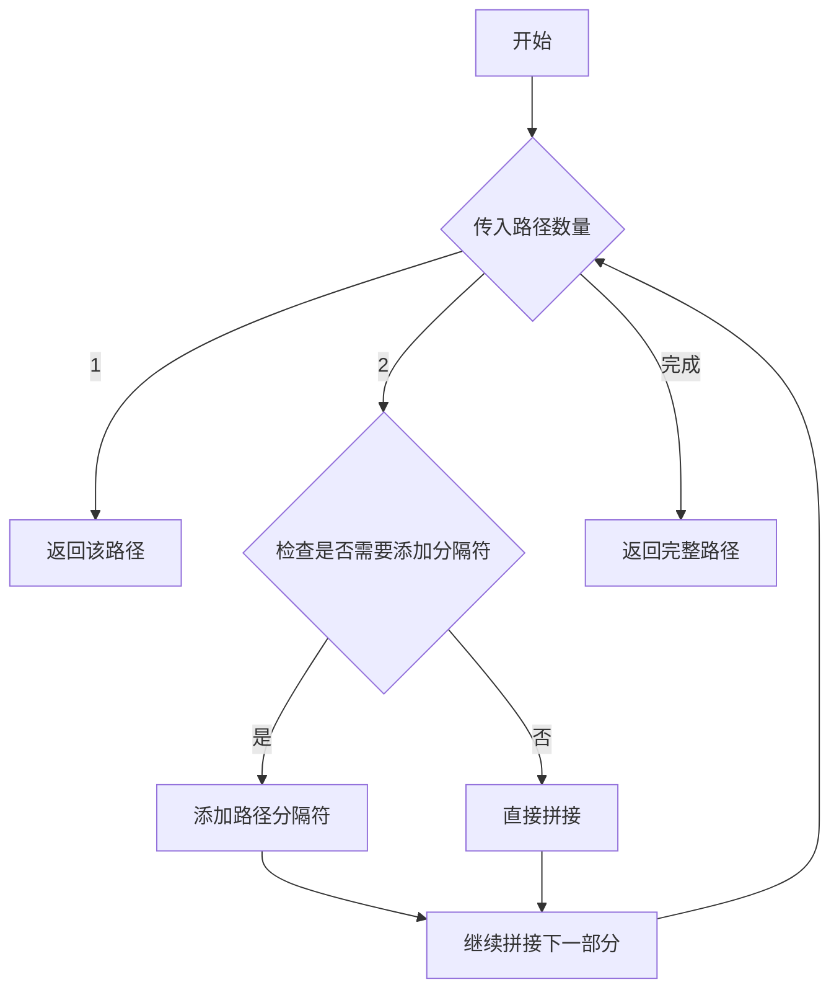

#### 带注释源码

```python
# os.path.join 是 Python 标准库函数，位于 os.path 模块中
# 使用示例（在注释的代码中可以看到）：

# current_directory = os.getcwd()  # 获取当前工作目录
# folder_name = "Suzumiya"         # 要创建的文件夹名称
# new_directory = os.path.join(current_directory, folder_name)
# 结果示例：'C:/Users/Username/Suzumiya' (Windows) 或 '/Users/Username/Suzumiya' (Linux/Mac)

# 在本项目的实际代码中，text_to_image 方法使用了字符串拼接代替：
# res = Image.open(self.images_folder + '/' + image)
# 建议改为：res = Image.open(os.path.join(self.images_folder, image))

# 函数签名：
# os.path.join(*paths) -> str

# 参数：
#   *paths: 可变数量的路径字符串组件

# 返回值：
#   拼接后的完整路径字符串

# 主要功能：
# 1. 自动处理路径分隔符（Windows 用 \, Unix 用 /）
# 2. 避免出现双斜杠或反斜杠
# 3. 如果某个绝对路径被传入，其后的所有路径将被忽略
```


### `os.getcwd`

获取当前Python进程的工作目录路径。

参数：

- 该函数无参数

返回值：`str`，返回当前工作目录的绝对路径字符串。

#### 流程图

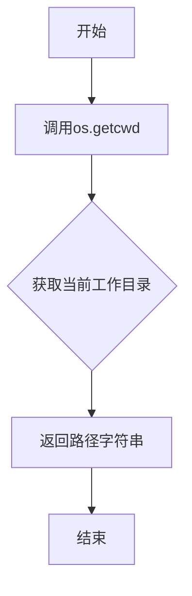

#### 带注释源码

```python
# os.getcwd() 是Python标准库os模块的函数
# 用于获取当前工作目录的绝对路径
# 在本项目中，此函数被注释未使用

# 原始使用方式（已注释）:
# current_directory = os.getcwd()  # 获取当前工作目录路径
# folder_name = "Suzumiya"
# new_directory = os.path.join(current_directory, folder_name)  # 拼接目录路径
```

**注意**：在提供的代码中，`os.getcwd()` 仅出现在注释掉的代码中，未被实际调用。该函数是Python标准库的一部分，不是本项目定义的函数。


### `os.makedirs`

该函数是Python标准库os模块中的文件系统操作函数，用于递归创建多层目录。在该代码中主要用于确保指定的项目文件夹（"Suzumiya"）存在，如果目录不存在则创建它。

参数：

- `name`：str， 要创建的目录路径
- `mode`：int， 目录的权限模式（可选，默认为0o777）
- `exist_ok`：bool， 如果目录已存在是否抛出异常（可选，默认为False）

返回值：None，该函数不返回任何值

#### 流程图

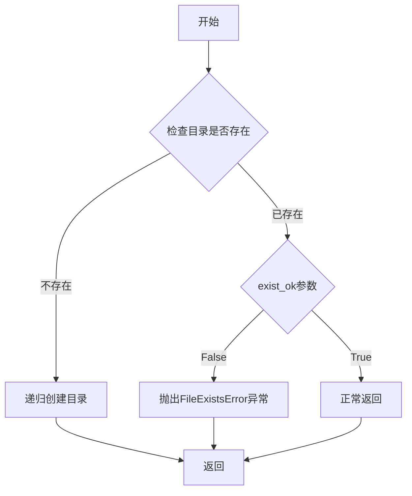

#### 带注释源码

```python
# os.makedirs 函数使用示例（来自代码中的注释部分）
# if not os.path.exists(new_directory):
#     os.makedirs(new_directory)
#     print(f"文件夹 '{folder_name}' 创建成功！")
# else:
#     print(f"文件夹 '{folder_name}' 已经存在。")

# 参数说明：
# name: os.path.join(current_directory, folder_name) - 要创建的目录完整路径
# mode: 默认0o777 - 目录权限
# exist_ok: 未显式指定 - 默认False，目录已存在则抛出异常

# 在实际代码中未启用，仅作为项目初始化时的目录创建逻辑保留
```


### `ChatGPT.__init__`

该方法是 `ChatGPT` 类的构造函数，负责初始化实例的所有配置参数、预加载嵌入模型和配置文件、设置设备环境以及初始化用于存储图像嵌入、文本嵌入、标题映射等数据结构。

参数：

- `configuration`：`dict`，包含所有配置信息的字典，如模型路径、嵌入文件路径、提示词路径、最大故事长度等
- `in_training_generating`：`bool`，（可选）标记是否处于训练数据生成模式，默认为 False

返回值：`None`，构造函数不返回值，仅初始化实例状态

#### 流程图

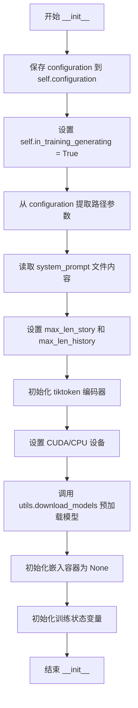

#### 带注释源码

```python
def __init__(self, configuration, in_training_generating=False):
    """
    初始化 ChatGPT 实例，加载配置、模型和预计算嵌入
    
    参数:
        configuration: 包含所有配置项的字典
        in_training_generating: 是否处于训练数据生成模式
    """
    # 保存完整配置字典
    self.configuration = configuration
    
    # 注意：此处直接赋值为 True，忽略了输入参数 in_training_generating
    # 可能存在设计缺陷，应改为: self.in_training_generating = in_training_generating
    self.in_training_generating = True
    
    # 从配置中提取各类路径配置
    self.image_embed_jsonl_path = configuration['image_embed_jsonl_path']  # 图像嵌入文件路径
    self.title_text_embed_jsonl_path = configuration['title_text_embed_jsonl_path']  # 标题文本嵌入文件路径
    self.images_folder = configuration['images_folder']  # 图像文件夹路径
    self.texts_folder = configuration['texts_folder']  # 文本文件夹路径
    self.system_prompt = configuration['system_prompt']  # 系统提示词路径
    
    # 读取并加载系统提示词内容
    with open(self.system_prompt, "r", encoding="utf-8") as f:
        self.system_prompt = f.read()
    
    # 配置故事和历史记录的最大token长度
    self.max_len_story = int(configuration['max_len_story'])  # 故事最大长度
    self.max_len_history = int(configuration['max_len_history'])  # 历史记录最大长度
    
    # 对话记录路径
    self.dialogue_path = configuration['dialogue_path']
    
    # 初始化 tiktoken 编码器，用于分词和计算token长度
    self.enc = tiktoken.get_encoding("cl100k_base")
    
    # 根据 CUDA 可用性设置计算设备
    self.device = torch.device("cuda" if torch.cuda.is_available() else "cpu")
    
    # 预加载嵌入模型（通过 utils 模块下载/加载）
    self.model = utils.download_models()
    
    # 初始化各类嵌入容器（延迟加载）
    self.image_embed = None  # 图像嵌入字典
    self.text_embed = None  # 文本嵌入字典
    self.title_to_text = None  # 标题到文本的映射
    self.titles = None  # 标题列表
    
    # 训练数据生成相关状态变量
    self.is_train_generating = False  # 是否处于训练生成模式
    self.role_name = ""  # 主要角色名称
    self.other_names = []  # 其他角色名称列表
```


### `ChatGPT.set_training`

该方法用于设置训练模式，启用训练数据生成功能。通过设置 `is_train_generating` 标志为 `True`，并记录角色名称和其他名称，为后续的训练数据生成做准备。

参数：

- `role_name`：`str`，主角色名称，用于标识对话中的主要角色
- `other_names`：`list`，其他角色名称列表，包含该角色可能的其他称呼

返回值：`None`，无返回值，此方法仅修改对象内部状态

#### 流程图

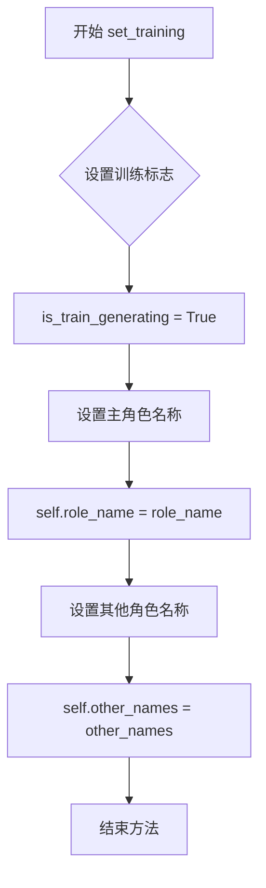

#### 带注释源码

```python
def set_training(self, role_name, other_names):
    """
    设置训练模式，准备进行训练数据生成
    
    该方法将is_train_generating标志设为True，并记录角色信息
    用于在get_response方法中区分训练数据生成模式和普通对话模式
    """
    # 启用训练数据生成模式
    self.is_train_generating = True
    # 设置主角色名称
    self.role_name = role_name
    # 设置其他角色名称列表
    self.other_names = other_names
```


### `ChatGPT.preload`

该方法用于在系统初始化时预加载图像嵌入向量和文本嵌入向量及相关数据，将外部JSONL文件中的向量数据读取到内存中，以供后续的相似度计算和检索使用。

参数：
- 该方法无显式参数（仅使用self）

返回值：
- `无返回值（None）`，该方法仅更新实例属性

#### 流程图

```mermaid
flowchart TD
    A[开始 preload] --> B[调用load方法]
    B --> C{load_image_embed=True?}
    C -->|是| D[打开image_embed_jsonl_path文件]
    D --> E{文件是否存在?}
    E -->|是| F[逐行读取JSON数据]
    F --> G[更新image_embed字典]
    G --> H[返回image_embed]
    E -->|否| I[返回None]
    
    C -->|否| J{load_title_text_embed=True?}
    J -->|是| K[打开title_text_embed_jsonl_path文件]
    K --> L[逐行读取JSON数据]
    L --> M[解析title_text格式]
    M --> N[构建title_to_text和text_embed映射]
    N --> O[返回text_embed, title_to_text, titles列表]
    J -->|否| P[打印错误信息]
    
    H --> Q[更新self.image_embed]
    I --> Q
    O --> R[更新self.text_embed, self.title_to_text, self.titles]
    Q --> S[结束]
    R --> S
```

#### 带注释源码

```python
def preload(self):
    """
    预加载图像和文本嵌入向量及相关数据到内存
    该方法在系统初始化时调用，将JSONL文件中的向量数据读取到实例属性中
    以避免后续每次使用时重复读取文件，提高检索效率
    """
    # 加载图像嵌入向量
    # 调用load方法，传入load_image_embed=True参数
    # 从image_embed_jsonl_path文件读取图像的向量表示
    # 结果存储在self.image_embed字典中，键为图像相关文本，值为嵌入向量
    self.image_embed = self.load(load_image_embed=True)
    
    # 加载文本嵌入向量、标题到文本映射和标题列表
    # 调用load方法，传入load_title_text_embed=True参数
    # 从title_text_embed_jsonl_path文件读取文本的向量表示和元数据
    # text_embed: 文本到向量的映射字典
    # title_to_text: 标题到文本内容的映射字典
    # titles: 所有标题的列表
    self.text_embed, self.title_to_text, self.titles = self.load(load_title_text_embed=True)
```

---

### 相关联的 `ChatGPT.load` 方法详情

由于`preload`方法依赖`load`方法实现核心逻辑，以下补充`load`方法的信息：

#### 参数

- `load_title_text_embed`：`bool`，是否加载文本嵌入和相关数据（标题到文本映射、标题列表）
- `load_image_embed`：`bool`，是否加载图像嵌入向量

#### 返回值

根据传入参数不同而变化：
- 当`load_title_text_embed=True`：返回`(text_embed, title_to_text, titles)`元组
- 当`load_image_embed=True`：返回`image_embed`字典或`None`
- 当两者均为`False`：打印错误信息并返回`None`

#### 源码

```python
def load(self, load_title_text_embed=False,
         load_image_embed=False):
    """
    从JSONL文件加载嵌入向量数据
    
    数据格式说明：
    - title_text_embed_jsonl: 每行格式为 {title_text: embed_vector}
      其中title_text由"｜｜｜"分隔，格式为"title｜｜｜text"
    - image_embed_jsonl: 每行格式为 {image_key: embed_vector}
    """
    # 处理文本嵌入和标题数据加载
    if load_title_text_embed:
        text_embed = {}          # 存储文本到向量的映射
        title_text_embed = {}    # 临时存储原始title_text到向量的映射
        title_to_text = {}       # 存储标题到文本内容的映射
        
        # 读取JSONL文件
        with open(self.title_text_embed_jsonl_path, 'r', encoding='utf-8') as f:
            for line in f:
                data = json.loads(line)
                title_text_embed.update(data)
        
        # 解析title_text格式，拆分出标题和文本
        # 格式: "title｜｜｜text_content"
        for title_text, embed in title_text_embed.items():
            res = title_text.split("｜｜｜")
            title_to_text[res[0]] = res[1]    # 标题 -> 文本内容
            text_embed[res[1]] = embed        # 文本内容 -> 向量
        
        return text_embed, title_to_text, list(title_to_text.keys())

    # 处理图像嵌入加载
    elif load_image_embed:
        image_embed = {}
        
        # 检查文件是否存在
        if os.path.exists(self.image_embed_jsonl_path):
            # 读取图像嵌入向量
            with open(self.image_embed_jsonl_path, 'r', encoding='utf-8') as f:
                for line in f:
                    data = json.loads(line)
                    image_embed.update(data)
            return image_embed
        else:
            # 文件不存在时返回None
            return None
    
    # 参数均未指定时的错误处理
    else:
        print("Please specify the loading file！")
```

---

### 技术债务与优化空间

1. **异常处理缺失**：`load`方法在文件读取失败时未捕获`FileNotFoundError`或`JSONDecodeError`等异常，可能导致程序崩溃
2. **重复代码**：两个加载分支有相似的文件读取逻辑，可提取为独立方法
3. **硬编码分隔符**：使用"｜｜｜"作为分隔符，缺乏配置灵活性
4. **内存占用**：一次性加载所有嵌入向量到内存，对于大规模数据集可能导致内存压力
5. **文件不存在处理**：图像嵌入文件不存在时返回`None`，但调用方`preload`未处理此情况，可能导致后续使用时出现`AttributeError`


### `ChatGPT.load`

该方法是一个数据加载方法，用于根据参数加载预计算的文本嵌入或图像嵌入向量，支持从 JSONL 文件中读取并解析为字典格式返回。

参数：

- `load_title_text_embed`：`bool`，是否加载标题-文本嵌入数据
- `load_image_embed`：`bool`，是否加载图像嵌入数据

返回值：会根据参数返回不同类型：
- 当 `load_title_text_embed=True` 时返回 `Tuple[dict, dict, list]`（文本嵌入字典、标题到文本映射、标题列表）
- 当 `load_image_embed=True` 时返回 `dict` 或 `None`（图像嵌入字典，文件不存在时返回 None）
- 否则返回 `None`

#### 流程图

```mermaid
flowchart TD
    A[load 方法调用] --> B{load_title_text_embed?}
    B -->|True| C[打开 title_text_embed_jsonl_path 文件]
    C --> D[逐行读取 JSON 数据]
    D --> E[更新 title_text_embed 字典]
    E --> F[遍历 title_text_embed]
    F --> G[按 "｜｜｜" 分隔标题文本]
    G --> H[构建 title_to_text 和 text_embed 映射]
    H --> I[返回 text_embed, title_to_text, titles 列表]
    
    B -->|False| J{load_image_embed?}
    J -->|True| K{image_embed_jsonl_path 文件存在?}
    K -->|True| L[打开图像嵌入文件]
    L --> M[逐行读取 JSON 数据]
    M --> N[更新 image_embed 字典]
    N --> O[返回 image_embed]
    
    K -->|False| P[返回 None]
    
    J -->|False| Q[打印提示信息]
    Q --> R[返回 None]
```

#### 带注释源码

```python
def load(self, load_title_text_embed=False,
         load_image_embed=False):
    """
    加载预计算的嵌入向量数据
    根据参数从 JSONL 文件中读取并解析嵌入向量
    """
    # 分支1: 加载标题-文本嵌入
    if load_title_text_embed:
        text_embed = {}          # 存储文本到嵌入向量的映射
        title_text_embed = {}    # 临时存储标题+文本的嵌入
        title_to_text = {}       # 标题到文本的映射
        
        # 打开标题文本嵌入文件
        with open(self.title_text_embed_jsonl_path, 'r', encoding='utf-8') as f:
            for line in f:
                data = json.loads(line)
                title_text_embed.update(data)
        
        # 解析标题和文本，分离存储
        for title_text, embed in title_text_embed.items():
            # 按 "｜｜｜" 分隔符拆分标题和文本
            res = title_text.split("｜｜｜")
            title_to_text[res[0]] = res[1]      # 标题 -> 文本
            text_embed[res[1]] = embed          # 文本 -> 嵌入向量
        
        # 返回文本嵌入、标题映射、标题列表
        return text_embed, title_to_text, list(title_to_text.keys())

    # 分支2: 加载图像嵌入
    elif load_image_embed:
        image_embed = {}
        
        # 检查图像嵌入文件是否存在
        if os.path.exists(self.image_embed_jsonl_path):
            # 打开图像嵌入文件并读取
            with open(self.image_embed_jsonl_path, 'r', encoding='utf-8') as f:
                for line in f:
                    data = json.loads(line)
                    image_embed.update(data)
            return image_embed
        else:
            # 文件不存在返回 None
            return None
    
    # 分支3: 未指定加载类型
    else:
        print("Please specify the loading file！")
        return None
```


### `ChatGPT.text_to_image`

该方法根据输入的文本内容，通过计算文本与预加载图片描述的余弦相似度，找到最相似的图片描述，然后打开并返回对应的图片文件。

参数：

- `text`：`str`，需要查找相似图片的文本描述

返回值：`PIL.Image.Image` 或 `None`，返回最相似图片的 Image 对象，若图片不存在则返回 None（通过 print 提示）

#### 流程图

```mermaid
flowchart TD
    A[输入: text] --> B[调用 get_cosine_similarity 获取余弦相似度]
    B --> C[使用 argmax 获取最大相似度的索引]
    C --> D[根据索引获取对应的图片描述 key]
    D --> E[构造图片文件名: key + '.jpg']
    E --> F{检查图片文件是否存在于 images_folder}
    F -->|存在| G[使用 PIL.Image.open 打开图片]
    G --> H[返回 Image 对象]
    F -->|不存在| I[打印 'Image doesn't exist']
    I --> J[隐式返回 None]
```

#### 带注释源码

```python
def text_to_image(self, text):
    """
    根据输入文本找到最相似的图片并返回
    
    参数:
        text: str - 输入的文本描述
        
    返回:
        PIL.Image.Image 或 None - 返回打开的图片对象，若不存在则返回None
    """
    # 获取文本与所有图片嵌入的余弦相似度
    # get_image=True 表示使用 image_embed 进行相似度计算
    query_similarity = self.get_cosine_similarity(text, get_image=True)
    
    # 使用 argmax 获取最大相似度对应的索引
    key_index = query_similarity.argmax(dim=0)
    
    # 根据索引获取对应的图片描述文本作为key
    text = list(self.image_embed.keys())[key_index]
    
    # 构造图片文件名（假设图片为jpg格式）
    image = text + '.jpg'
    
    # 检查图片是否存在于图片文件夹中
    if image in os.listdir(self.images_folder):
        # 使用PIL打开图片文件
        res = Image.open(self.images_folder + '/' + image)
        # res.show()  # 可选：直接显示图片
        return res
    else:
        # 图片不存在时打印提示信息
        print("Image doesn't exist")
```


### `ChatGPT.get_completion_from_messages`

该方法是一个封装 OpenAI ChatGPT 接口的函数，接收消息列表和模型参数，调用 OpenAI API 获取模型生成的回答并返回内容。

参数：

- `messages`：`List[Dict]`，消息列表，包含对话的历史记录，每条消息包含 role 和 content 字段
- `model`：`str`，可选参数，默认为 "gpt-3.5-turbo"，指定使用的 OpenAI 模型
- `temperature`：`float`，可选参数，默认为 0，控制模型输出的随机程度，值越高输出越随机

返回值：`str`，模型生成的回答内容

#### 流程图

```mermaid
flowchart TD
    A[开始 get_completion_from_messages] --> B[接收 messages, model, temperature 参数]
    B --> C[调用 openai.ChatCompletion.create API]
    C --> D{API 调用是否成功}
    D -->|成功| E[从响应中提取 choices[0].message.content]
    D -->|失败| F[抛出异常]
    E --> G[返回模型生成的内容]
    F --> H[结束]
    G --> H
```

#### 带注释源码

```python
def get_completion_from_messages(self, messages, model="gpt-3.5-turbo", temperature=0):
    """
    一个封装 OpenAI 接口的函数，参数为 messages 列表和模型参数，返回对应结果
    
    Args:
        messages: 消息列表，包含对话历史，格式为 [{'role': 'system/user/assistant', 'content': '内容'}, ...]
        model: 使用的模型名称，默认为 "gpt-3.5-turbo"
        temperature: 控制模型输出的随机程度，默认为 0（确定性输出）
    
    Returns:
        str: 模型生成的回答内容
    """
    # 调用 OpenAI 的 ChatCompletion 接口创建对话
    response = openai.ChatCompletion.create(
        model=model,           # 指定使用的模型
        messages=messages,     # 传递消息列表
        temperature=temperature,  # 控制模型输出的随机程度
    )
    #  print(str(response.choices[0].message))
    # 从响应中提取第一个候选项的消息内容并返回
    return response.choices[0].message["content"]
```


### `ChatGPT.get_cosine_similarity`

该方法用于计算查询文本与预加载的图像或文本嵌入之间的余弦相似度，支持从文本查询匹配最相关的图像或文档。

参数：

- `texts`：`List[str]`，文本列表，其中 `texts[0]` 被视为查询文本
- `get_image`：`bool`，是否使用图像嵌入库进行相似度计算
- `get_texts`：`bool`，是否使用文本嵌入库进行相似度计算

返回值：`torch.Tensor`，返回查询文本嵌入与目标嵌入库（图像或文本）之间的余弦相似度向量

#### 流程图

```mermaid
flowchart TD
    A[开始 get_cosine_similarity] --> B[获取查询文本的嵌入向量]
    B --> C{判断 get_image}
    C -->|True| D[使用 image_embed]
    C -->|False| E{判断 get_texts}
    E -->|True| F[使用 text_embed]
    E -->|False| G[保留注释代码块-未启用]
    D --> H[提取嵌入库中的所有向量]
    F --> H
    G --> H
    H --> I[计算余弦相似度]
    I --> J[返回相似度向量]
```

#### 带注释源码

```python
def get_cosine_similarity(self, texts, get_image=False, get_texts=False):
    """
        计算文本列表的相似度避免重复计算query_similarity
        texts[0] = query
    """
    # 第一步：获取查询文本的嵌入向量
    # 使用utils.get_embedding获取模型生成的嵌入，然后转换为torch张量并reshape为(1, -1)
    # 最后移动到计算设备（GPU或CPU）
    query_embedding = torch.tensor(utils.get_embedding(self.model, texts)).reshape(1, -1).to(self.device)
    
    # 第二步：根据参数选择嵌入库
    if get_image:
        # 如果get_image为True，使用预加载的图像嵌入库
        jsonl = self.image_embed
    elif get_texts:
        # 如果get_texts为True，使用预加载的文本嵌入库
        jsonl = self.text_embed
    # else:
    #     # 计算query_embed
    #     # 注释掉的代码：如果两个flag都为False，则手动计算texts[1:]的嵌入
    #     jsonl = {}
    #     embeddings = utils.get_embedding(self.model, texts[1:]).reshape(-1, 1536)
    #     for text, embed in zip(texts, embeddings):
    #         jsonl[text] = embed
    
    # 第三步：从嵌入库中提取所有向量并转换为numpy数组
    texts_embeddings = np.array([value for value in jsonl.values()])
    
    # 第四步：计算余弦相似度
    # 使用torch的cosine_similarity计算查询嵌入与所有目标嵌入的余弦相似度
    # 返回一个一维张量，包含查询与每个嵌入向量的相似度得分
    return cosine_similarity(query_embedding, torch.from_numpy(texts_embeddings).to(self.device))
```


### `ChatGPT.retrieve_title`

该方法通过计算查询文本与预加载标题文本的余弦相似度，返回最相似的Top-K个标题列表，用于从故事库中检索相关内容。

参数：

- `query_text`：`str`，用于检索的查询文本
- `k`：`int`，需要返回的相似标题数量

返回值：`list`，包含最相似的K个标题的列表

#### 流程图

```mermaid
flowchart TD
    A[开始 retrieve_title] --> B[将query_text包装为列表texts]
    B --> C[获取self.titles作为embed_to_title]
    C --> D[调用get_cosine_similarity计算余弦相似度]
    D --> E[对余弦相似度降序排序]
    E --> F[初始化top_k_title和top_k_index空列表]
    F --> G{遍历排序后的相似度}
    G --> H{当前标题是否已在top_k_title中}
    H -->|是| I[跳过,继续下一轮]
    H -->|否| J[添加到top_k_title和top_k_index]
    J --> K{top_k_title长度等于k}
    K -->|否| L[继续遍历]
    L --> G
    K -->|是| M[返回top_k_title]
    G -->|遍历完成| N{top_k_title长度等于k}
    N -->|否| M
    N -->|是| M
```

#### 带注释源码

```python
def retrieve_title(self, query_text, k):
    """
    从预加载的标题库中检索与查询文本最相似的Top-K个标题
    
    参数:
        query_text: str, 用户查询的文本
        k: int, 需要返回的相似标题数量
    
    返回:
        list: 相似度最高的K个标题列表
    """
    
    # 1. 将查询文本包装为列表,符合get_cosine_similarity的输入格式
    texts = [query_text]
    
    # 2. 获取标题列表,用于后续构建返回结果
    # self.titles 在preload()方法中从title_text_embed_jsonl_path加载
    embed_to_title = self.titles
    
    # 3. 计算查询文本与所有标题文本的余弦相似度
    # 调用get_cosine_similarity方法,该方法:
    # - 使用utils.get_embedding获取查询文本的embedding
    # - 与self.text_embed中的所有标题embedding计算相似度
    # - 返回cosine_similarity结果
    cosine_similarities = self.get_cosine_similarity(texts, get_texts=True).cpu().numpy().tolist()
    
    # 4. 对余弦相似度进行降序排序,便于获取最高的K个
    sorted_cosine_similarities = sorted(cosine_similarities, reverse=True)
    
    # 5. 初始化存储变量
    top_k_index = []      # 存储top_k对应的索引
    top_k_title = []      # 存储top_k标题
    
    # 6. 遍历排序后的相似度,获取Top-K不重复的标题
    for i in range(len(sorted_cosine_similarities)):
        # 注意: 这里使用index查找第一次出现的位置,可能存在重复相似度值的问题
        current_title = embed_to_title[cosine_similarities.index(sorted_cosine_similarities[i])]
        
        # 检查标题是否已存在,避免返回重复的标题
        if current_title not in top_k_title:
            top_k_title.append(current_title)
            top_k_index.append(cosine_similarities.index(sorted_cosine_similarities[i]))
        
        # 达到K个标题时退出循环
        if len(top_k_title) == k:
            break
    
    # 7. 返回Top-K相似标题列表
    return top_k_title
```


### `ChatGPT.organize_stories_with_maxlen_for_training`

该方法用于将选中的样本主题列表（`selected_sample`）组织成故事列表，在累加长度不超过 `max_len_story` 的约束下，依次从 `title_to_text` 字典中查找对应的故事文本并添加到结果列表中，最终返回所有符合长度限制的故事文本列表。主要在训练数据生成场景中使用。

参数：

- `selected_sample`：`List[str]`，需要处理的主题/标题列表，每个元素是一个主题名称，方法会根据该主题从 `title_to_text` 字典中查找对应的故事文本

返回值：`List[str]`，返回符合最大长度限制的故事文本列表

#### 流程图

```mermaid
flowchart TD
    A[开始 organize_stories_with_maxlen_for_training] --> B[初始化空列表 stories 和计数器 count = 0]
    B --> C{遍历 selected_sample 中的每个 sample_topic}
    C -->|遍历| D[从 title_to_text 字典获取 sample_story]
    D --> E[使用 enc.encode 计算 sample_story 的长度 sample_len]
    E --> F{判断 sample_len + count 是否超过 max_len_story}
    F -->|是| G[break 跳出循环]
    F -->|否| H[将 sample_story 添加到 stories 列表]
    H --> I[更新计数器 count += sample_len]
    I --> C
    G --> J[返回 stories 列表]
    J --> K[结束]
```

#### 带注释源码

```python
def organize_stories_with_maxlen_for_training(self, selected_sample):
    """
    将选中的样本主题列表组织成故事列表，确保总长度不超过 max_len_story
    用于训练数据生成场景
    
    参数:
        selected_sample: 主题列表，每个主题对应 title_to_text 字典中的一个键
    
    返回:
        stories: 符合长度限制的故事文本列表
    """
    # 初始化结果列表，用于存储符合长度要求的故事
    stories = []

    # 初始化计数器，记录当前已累积的故事长度（以token计）
    count = 0

    # 遍历输入的每个样本主题
    for sample_topic in selected_sample:
        # 从 title_to_text 字典中查找主题对应的故事文本
        sample_story = self.title_to_text[sample_topic]

        # 使用 tiktoken 编码器计算当前故事的长度（token数量）
        sample_len = len(self.enc.encode(sample_story))
        # print(sample_topic, ' ' , sample_len)
        
        # 检查累积长度是否超过最大允许的故事长度
        if sample_len + count > self.max_len_story:
            # 如果超过，则停止添加更多故事
            break

        # 将当前故事添加到结果列表
        stories.append(sample_story)

        # 更新累积长度计数器
        count += sample_len

    # 返回符合长度要求的故事列表
    return stories
```


### `ChatGPT.organize_story_with_maxlen`

该函数根据最大长度限制，从给定的样本主题列表中选择合适的故事文本进行拼接，返回拼接后的故事字符串和最终选中的样本列表。

参数：

- `selected_sample`：`List[str]`，待处理的主题列表，每个元素为故事标题，用于从 `title_to_text` 字典中查找对应的故事文本

返回值：`Tuple[str, List[str]]`，返回一个元组，包含拼接后的故事字符串和最终选中的样本主题列表

#### 流程图

```mermaid
flowchart TD
    A[开始] --> B[初始化 story = '\n', count = 0, final_selected = []]
    B --> C{遍历 selected_sample 中的每个 sample_topic}
    C -->|获取主题| D[从 title_to_text 字典查找对应故事 sample_story]
    D --> E[计算故事长度 sample_len = len(enc.encode(sample_story))]
    E --> F{判断 sample_len + count 是否超过 max_len_story}
    F -->|是| G[跳出循环]
    F -->|否| H[将故事追加到 story 字符串末尾]
    H --> I[更新计数 count += sample_len]
    I --> J[将 sample_topic 加入 final_selected 列表]
    J --> C
    G --> K[返回 story 和 final_selected]
    K --> L[结束]
```

#### 带注释源码

```python
def organize_story_with_maxlen(self, selected_sample):
    """
    根据最大长度限制组织故事文本
    
    参数:
        selected_sample: 故事标题列表，每个标题对应一段故事文本
        
    返回:
        tuple: (拼接后的故事字符串, 最终选中的样本列表)
    """
    # 初始化结果字符串，以换行符开头
    story = "\n"
    
    # 初始化累计长度计数器
    count = 0
    
    # 用于存储最终选中的样本主题
    final_selected = []
    
    # 遍历每个待选样本主题
    for sample_topic in selected_sample:
        # 根据主题从字典中查找对应的故事文本
        sample_story = self.title_to_text[sample_topic]
        
        # 使用tiktoken编码计算故事文本的token长度
        sample_len = len(self.enc.encode(sample_story))
        
        # 如果累计长度超过最大限制，则停止添加更多故事
        if sample_len + count > self.max_len_story:
            break
        
        # 将当前故事文本追加到结果字符串
        story += sample_story
        story += '\n'
        
        # 更新累计长度
        count += sample_len
        
        # 将当前主题添加到最终选中列表
        final_selected.append(sample_topic)
    
    # 返回拼接后的故事和最终选中的样本
    return story, final_selected
```


### `ChatGPT.organize_message`

该函数用于将故事背景、历史对话记录和新的用户查询整合为符合OpenAI API格式的消息列表，支持系统提示、用户消息和AI回复的组合构建。

参数：

- `self`：`ChatGPT`类实例，当前对象实例
- `story`：`str`，故事背景文本，作为系统提示后的第一条用户消息内容
- `history_chat`：`list`，历史对话中的用户提问列表
- `history_response`：`list`，历史对话中的AI回复列表
- `new_query`：`str`，用户当前最新的输入查询

返回值：`list`，返回构建完成的消息列表，每条消息为包含role和content字段的字典

#### 流程图

```mermaid
flowchart TD
    A[开始 organize_message] --> B[创建初始消息列表<br/>包含system消息和story]
    B --> C{检查history_chat和history_response长度是否一致}
    C -->|不一致| D[打印警告信息并清空历史记录]
    C -->|一致| E[继续处理]
    D --> E
    E --> F[遍历历史对话]
    F -->|i=0到n-1| G[依次添加用户消息和回复消息]
    F --> H{遍历完成?}
    H -->|否| F
    H -->|是| I[添加new_query作为最后一条用户消息]
    I --> J[返回完整消息列表]
```

#### 带注释源码

```python
def organize_message(self, story, history_chat, history_response, new_query):
    """
    将故事背景、历史对话和最新查询整合为消息列表
    
    参数:
        story: 故事背景文本内容
        history_chat: 历史对话中的用户消息列表
        history_response: 历史对话中的AI回复列表
        new_query: 用户最新的输入查询
    
    返回:
        符合OpenAI API格式的消息列表
    """
    # 初始化消息列表，首先添加系统提示和故事背景
    messages = [{'role': 'system', 'content': self.system_prompt},
                {'role': 'user', 'content': story}]

    # 获取历史对话的数量
    n = len(history_chat)
    
    # 检查历史对话长度是否匹配
    if n != len(history_response):
        print('warning, unmatched history_char length, clean and start new chat')
        # 长度不匹配时清空历史记录，重新开始
        history_chat = []
        history_response = []
        n = 0

    # 遍历历史对话记录
    for i in range(n):
        # 依次添加用户问题和AI回复
        messages.append({'role': 'user', 'content': history_chat[i]})
        messages.append({'role': 'user', 'content': history_response[i]})

    # 添加用户最新的查询作为最后一条消息
    messages.append({'role': 'user', 'content': new_query})

    return messages
```


### `ChatGPT.keep_tail`

该方法用于裁剪对话历史，确保保留在 `max_len_history` 限制内的最近对话轮次。从后往前遍历对话历史，累加每轮的 token 数量，当累计超过最大长度时停止，返回剩余的对话历史。

参数：

- `history_chat`：`list`，用户历史聊天内容列表
- `history_response`：`list`，模型历史回复内容列表

返回值：`tuple`，返回两个列表——裁剪后的历史聊天列表和历史回复列表

#### 流程图

```mermaid
flowchart TD
    A[开始 keep_tail] --> B{history_chat 是否为空}
    B -->|是| C[返回空列表 [], []]
    B -->|否| D{history_chat 和 history_response 长度是否匹配}
    D -->|不匹配| E[打印警告并返回空列表]
    D -->|匹配| F[初始化 token_len 列表]
    F --> G[遍历每对对话]
    G --> H[计算每对 chat 和 response 的 token 长度]
    H --> I[累加到 token_len 列表]
    I --> J[初始化 keep_k = 1, count = 最后一轮的 token_len]
    J --> K[从倒数第二轮开始往前遍历]
    K --> L{count 是否超过 max_len_history}
    L -->|否| M[count 加上当前轮 token_len, keep_k 加 1]
    L -->|是| N[跳出循环]
    M --> K
    K --> O[返回最后 keep_k 轮的历史]
    N --> O
```

#### 带注释源码

```python
def keep_tail(self, history_chat, history_response):
    """
    裁剪对话历史，保留最近且总token数不超过max_len_history的对话轮次
    """
    n = len(history_chat)  # 获取历史对话的轮次数量
    if n == 0:
        # 如果没有历史记录，直接返回空列表
        return [], []

    if n != len(history_response):
        # 如果聊天历史和回复历史长度不匹配，打印警告并返回空列表
        print('warning, unmatched history_char length, clean and start new chat')
        return [], []

    # 用于存储每一轮对话（chat + response）的token长度
    token_len = []
    for i in range(n):
        # 编码当前轮次的聊天内容并获取token数量
        chat_len = len(self.enc.encode(history_chat[i]))
        # 编码当前轮次的回复内容并获取token数量
        res_len = len(self.enc.encode(history_response[i]))
        # 将本轮token数添加到列表
        token_len.append(chat_len + res_len)

    # 初始化保留轮次为1（至少保留最后一轮）
    keep_k = 1
    # 当前已使用的token数（最后一轮）
    count = token_len[n - 1]

    # 从倒数第二轮开始往前遍历
    for i in range(1, n):
        # 累加当前轮的token数
        count += token_len[n - 1 - i]
        # 如果超过最大历史长度限制，停止添加
        if count > self.max_len_history:
            break
        # 否则增加保留的轮次
        keep_k += 1

    # 返回保留的最后keep_k轮对话历史
    return history_chat[-keep_k:], history_response[-keep_k:]
```


### `ChatGPT.divide_story`

该方法用于将输入的故事文本按角色分割为AI回复和人类消息两部分。它通过识别以特定角色名称开头的行来划分对话边界，将该行之前的内容作为AI回复，之后的内容作为人类输入。

参数：

- `story`：`str`，待分割的故事文本内容

返回值：`tuple[str, str]`，返回包含两个字符串的元组——第一个元素为AI回复内容，第二个元素为人类消息内容；若未找到分割点则返回空字符串元组 `("", "")`

#### 流程图

```mermaid
flowchart TD
    A[开始 divide_story] --> B[去除首尾空白<br>按两个及以上换行符分割故事]
    B --> C{遍历每个故事片段}
    C --> D[按单换行符分割片段为行列表]
    D --> E{遍历每行]
    E --> F{检查当前行是否以 role_name<br>或 other_names 中任一名称开头}
    F -->|是| G[将当前行之前的行拼接为AI回复<br>将当前行及之后的行拼接为人类消息]
    G --> H[返回 tuple[AI回复, 人类消息]]
    F -->|否| E
    E --> I{是否遍历完所有行}
    I -->|否| E
    I -->|是| C
    C --> J{是否遍历完所有片段]
    J -->|否| C
    J -->|是| K[返回空元组 '', '']
    H --> L[结束]
    K --> L
```

#### 带注释源码

```python
def divide_story(self, story):
    """
    将故事文本按角色分割为AI回复和人类消息两部分
    
    参数:
        story: 待分割的故事文本
        
    返回:
        tuple: (AI回复, 人类消息)，未找到分割点则返回 ("", "")
    """
    # 使用正则表达式按两个及以上换行符分割，去除首尾空白
    storys = re.split(r'\n{2,}', story.strip())
    
    # 遍历每个分割后的故事片段
    for s in storys:
        # 将片段按单换行符分割成行列表
        lines = s.split('\n')
        
        # 遍历每一行
        for i in range(len(lines)):
            # 检查当前行是否以角色名或其他名字开头
            # self.role_name 是当前角色名称
            # self.other_names 是其他角色名称列表
            if lines[i].startswith(self.role_name) or any([lines[i].startswith(name) for name in self.other_names]):
                # 分割点：将该行之前的内容作为AI回复，该行及之后作为人类消息
                res = '\n'.join(lines[:i]), '\n'.join(lines[i:])
                # 返回分割结果元组
                return res
                # 此处break不会执行，因为return已结束方法
                break
    
    # 遍历完所有片段未找到分割点，返回空元组
    return "", ""
```


### `ChatGPT.organize_message_langchain_for_training`

该方法用于构建用于模型训练的消息列表，接收故事列表、历史对话记录和新查询，通过系统消息初始化并依次添加分割后的故事消息、历史对话消息和新查询消息，最终返回符合LangChain格式的消息列表。

参数：

- `storys`：`list`，需要处理的故事列表，每个元素是一个故事字符串
- `history_chat`：`list`，历史聊天记录列表，存储用户的历史输入
- `history_response`：`list`，历史回复记录列表，存储助手的历史输出
- `new_query`：`str`，新的用户查询或输入

返回值：`list`，返回LangChain格式的消息列表，包含SystemMessage、AIMessage和HumanMessage

#### 流程图

```mermaid
flowchart TD
    A[开始] --> B[创建SystemMessage并添加到messages]
    B --> C{遍历storys中的每个story}
    C -->|是| D[调用divide_story分割story]
    D --> E[获取ai_message和human_message]
    E --> F[添加AIMessage和HumanMessage到messages]
    F --> C
    C -->|否| G{检查history_chat和history_response长度}
    G -->|不匹配| H[打印警告并清空历史记录]
    H --> I[设置n=0]
    G -->|匹配| J[设置n为history_chat长度]
    J --> K{遍历i从0到n-1}
    K -->|是| L[添加HumanMessage和AIMessage到messages]
    L --> K
    K -->|否| M[添加new_query作为HumanMessage到messages]
    M --> N[返回messages列表]
```

#### 带注释源码

```python
def organize_message_langchain_for_training(self, storys, history_chat, history_response, new_query):
    """
    构建用于训练的消息列表
    
    参数:
        storys: 故事列表，每个故事需要被分割成AI消息和人类消息
        history_chat: 历史聊天记录
        history_response: 历史回复记录
        new_query: 新的用户查询
    
    返回:
        LangChain格式的消息列表
    """
    # 初始化消息列表，首先添加系统消息
    messages = [
        SystemMessage(content=self.system_prompt)
    ]

    # 遍历每个故事，将故事分割成AI消息和人类消息
    for story in storys:
        # 调用divide_story方法分割故事
        # divide_story方法会根据角色名和别名来分割故事
        # 返回(ai_message, human_message)元组
        ai_message, human_message = self.divide_story(story)
        # 添加AI角色消息到消息列表
        messages.append(AIMessage(content=ai_message))
        # 添加人类角色消息到消息列表
        messages.append(HumanMessage(content=human_message))

    # 获取历史聊天记录的长度
    n = len(history_chat)
    
    # 检查历史聊天和历史回复的长度是否一致
    if n != len(history_response):
        # 如果长度不匹配，打印警告信息
        print('warning, unmatched history_char length, clean and start new chat')
        # 清空所有历史记录
        history_chat = []
        history_response = []
        # 设置n为0
        n = 0

    # 遍历历史记录，将历史对话添加到消息列表中
    for i in range(n):
        # 添加历史中的人类消息（用户输入）
        messages.append(HumanMessage(content=history_chat[i]))
        # 添加历史中的AI消息（助手回复）
        messages.append(AIMessage(content=history_response[i]))

    # 将新的用户查询作为最后一条人类消息添加到消息列表
    # messages.append( {'role':'user', 'content':new_query })
    messages.append(HumanMessage(content=new_query))
    
    # 打印消息列表用于调试
    # print(messages)
    
    # 返回构建好的消息列表
    return messages
```


### `ChatGPT.organize_message_for_generator`

该方法用于为训练数据生成器组织聊天消息，将故事分割后与历史对话和最新查询组合成LangChain格式的消息列表，供模型生成训练响应。

参数：

- `story`：`str`，原始故事文本，包含角色对话内容
- `history_chat`：`list`，历史对话中的用户消息列表
- `history_response`：`list`，历史对话中的AI响应消息列表
- `new_query`：`str`，最新的用户查询或输入

返回值：`list`，返回LangChain消息对象列表，包含SystemMessage、AIMessage和HumanMessage

#### 流程图

```mermaid
flowchart TD
    A[开始] --> B[调用divide_story分割story]
    B --> C[创建messages列表, 包含SystemMessage]
    C --> D{遍历raw_messages}
    D -->|每条记录| E[提取raw_message[0]作为AI消息]
    E --> F[提取raw_message[1]作为人类消息]
    F --> G[添加AIMessage和HumanMessage到列表]
    D -->|遍历完成| H{检查history长度匹配}
    H -->|不匹配| I[打印警告并清空历史]
    H -->|匹配| J{遍历history_chat和history_response}
    J -->|每对| K[添加HumanMessage和AIMessage]
    J -->|完成| L[添加new_query作为HumanMessage]
    L --> M[返回messages列表]
```

#### 带注释源码

```python
def organize_message_for_generator(self, story, history_chat, history_response, new_query):
    """
    为训练数据生成器组织消息
    将故事分割后与历史对话和最新查询组合成LangChain消息格式
    
    参数:
        story: str - 原始故事文本
        history_chat: list - 历史用户消息列表
        history_response: list - 历史AI响应列表
        new_query: str - 最新用户查询
    
    返回:
        list - LangChain消息对象列表
    """
    
    # 第一步：调用divide_story方法将story分割成对话片段
    # divide_story返回的格式为[(ai_msg, human_msg), ...]的列表
    raw_messages = self.divide_story(story)

    # 第二步：初始化消息列表，首先添加系统提示
    messages = [
        SystemMessage(content=self.system_prompt),
    ]
    
    # 第三步：遍历分割后的故事对话，添加到消息列表
    # raw_messages中每个元素是元组(ai_message, human_message)
    for raw_message in raw_messages:
        # 添加AI角色消息
        messages.append(AIMessage(content=raw_message[0]))
        # 添加人类角色消息
        messages.append(HumanMessage(content=raw_message[1]))

    # 第四步：获取历史对话长度并校验
    n = len(history_chat)
    if n != len(history_response):
        # 历史对话长度不匹配，打印警告并清空
        print('warning, unmatched history_char length, clean and start new chat')
        # 清空所有历史对话
        history_chat = []
        history_response = []
        n = 0

    # 第五步：将历史对话添加到消息列表
    for i in range(n):
        # 添加历史用户消息
        messages.append(HumanMessage(content=history_chat[i]))
        # 添加历史AI响应
        messages.append(AIMessage(content=history_response[i]))

    # 第六步：添加新的用户查询到消息列表末尾
    # messages.append( {'role':'user', 'content':new_query })
    messages.append(HumanMessage(content=new_query))
    
    # 打印调试信息（已注释）
    # print(messages)
    
    # 返回完整的消息列表，供LangChain聊天模型使用
    return messages
```


### `ChatGPT.organize_message_langchain`

该方法用于将系统提示、背景故事、历史对话记录和最新用户查询组装为LangChain兼容的消息列表格式，以便传递给ChatOpenAI模型进行对话生成。它确保历史对话的长度和内容匹配，并按照SystemMessage→HumanMessage→AIMessage的顺序组织消息。

参数：

- `self`：`ChatGPT`，ChatGPT类的实例，隐式参数
- `story`：`str`，背景故事或情境描述文本，用于为模型提供上下文信息
- `history_chat`：`list`，历史用户消息列表，记录之前的用户输入
- `history_response`：`list`，历史AI响应列表，记录之前的模型输出
- `new_query`：`str`，当前用户的新问题或输入

返回值：`list`，返回包含SystemMessage、HumanMessage和AIMessage的消息列表，供LangChain的ChatOpenAI使用

#### 流程图

```mermaid
flowchart TD
    A[开始 organize_message_langchain] --> B[创建消息列表]
    B --> C[添加 SystemMessage]
    C --> D[添加 HumanMessage - story]
    E{检查历史记录长度是否匹配}
    E -->|不匹配| F[打印警告并清空历史]
    E -->|匹配| G[遍历历史对话]
    F --> I
    G --> H[添加 HumanMessage - 历史聊天]
    H --> I[添加 AIMessage - 历史响应]
    I --> J[添加 HumanMessage - new_query]
    J --> K[返回消息列表]
```

#### 带注释源码

```python
def organize_message_langchain(self, story, history_chat, history_response, new_query):
    """
    将系统提示、背景故事、历史对话和最新查询组装为LangChain消息格式
    
    参数:
        story: str, 背景故事文本
        history_chat: list, 历史用户消息列表
        history_response: list, 历史AI响应列表
        new_query: str, 当前用户的新查询
    
    返回:
        list: LangChain消息对象列表
    """
    # 初始化消息列表，首先添加系统消息和用户输入的故事背景
    messages = [
        SystemMessage(content=self.system_prompt),
        HumanMessage(content=story)
    ]

    # 获取历史对话的数量
    n = len(history_chat)
    
    # 检查历史聊天和响应长度是否一致
    if n != len(history_response):
        # 长度不匹配时打印警告并清空历史记录，防止数据错乱
        print('warning, unmatched history_char length, clean and start new chat')
        history_chat = []
        history_response = []
        n = 0

    # 遍历历史对话，依次添加用户消息和AI响应
    for i in range(n):
        messages.append(HumanMessage(content=history_chat[i]))
        messages.append(AIMessage(content=history_response[i]))

    # 添加当前用户的新查询作为最后一条消息
    messages.append(HumanMessage(content=new_query))
    
    # 返回组装好的完整消息列表
    return messages
```


### `ChatGPT.get_response`

该方法是ChatGPT类的核心对话接口，接收用户消息和聊天历史，通过检索相关故事文本构建prompt，利用langchain的ChatOpenAI模型生成符合角色设定的对话响应。

参数：

- `user_message`：`str`，用户发送的最新消息
- `chat_history_tuple`：`list[tuple]`，聊天历史记录，每个元素为(用户消息, 助手回复)的元组列表

返回值：`str`，模型生成的对话响应内容

#### 流程图

```mermaid
flowchart TD
    A[开始 get_response] --> B[初始化空列表 history_chat, history_response]
    B --> C{chat_history_tuple是否为空?}
    C -->|否| D[遍历chat_history_tuple提取历史]
    C -->|是| E[跳过历史提取]
    D --> F[调用keep_tail裁剪历史长度]
    F --> G{是否在训练生成模式?}
    G -->|否| H[retrieve_title检索13个相关故事标题]
    G -->|是| I[retrieve_title检索13个相关故事标题]
    H --> J[organize_story_with_maxlen组装故事文本]
    I --> K[organize_stories_with_maxlen_for_training训练模式组装]
    J --> L[organize_message_langchain构建LangChain消息]
    K --> M[organize_message_langchain_for_training构建训练用消息]
    L --> N[ChatOpenAI生成响应]
    M --> N
    N --> O[返回response.content]
```

#### 带注释源码

```python
def get_response(self, user_message, chat_history_tuple):
    """
    处理用户消息并生成响应的核心方法
    
    参数:
        user_message: 用户发送的最新消息
        chat_history_tuple: 聊天历史，元组列表 [(用户消息, 助手回复), ...]
    
    返回:
        模型生成的响应文本
    """
    
    # 初始化历史记录列表
    history_chat = []
    history_response = []

    # 如果有历史记录，提取聊天历史
    if len(chat_history_tuple) > 0:
        for cha, res in chat_history_tuple:
            history_chat.append(cha)
            history_response.append(res)

    # 使用keep_tail方法保留尾部历史，控制历史长度不超过max_len_history
    history_chat, history_response = self.keep_tail(history_chat, history_response)

    # 准备当前查询
    new_query = user_message

    # 根据是否训练生成模式选择不同的处理流程
    if (self.is_train_generating == False) or (self.role_name == ""):
        # -------- 普通对话模式 --------
        
        # 1. 检索与查询最相关的13个故事标题
        selected_sample = self.retrieve_title(new_query, 13)
        
        # 2. 根据最大长度限制组装故事文本
        story, selected_sample = self.organize_story_with_maxlen(selected_sample)
        
        # 3. 使用LangChain构建消息格式（包含系统提示、故事、历史对话）
        messages = self.organize_message_langchain(story, history_chat, history_response, new_query)
    else:
        # -------- 训练数据生成模式 --------
        
        # 1. 同样检索13个相关故事标题
        selected_sample = self.retrieve_title(new_query, 13)
        
        # 2. 为训练生成组装多个故事（可能包含更多样本）
        stories = self.organize_stories_with_maxlen_for_training(selected_sample)
        
        # 3. 使用LangChain构建训练用消息格式
        messages = self.organize_message_langchain_for_training(stories, history_chat, history_response, new_query)

    # 创建ChatOpenAI实例（temperature=0表示确定性输出）
    chat = ChatOpenAI(temperature=0)
    
    # 调用模型获取响应
    return_msg = chat(messages)

    # 提取响应内容并返回
    response = return_msg.content

    return response
```

## 关键组件


### ChatGPT类

主聊天类，负责整体对话流程管理，包含配置加载、嵌入管理、消息组织、相似度检索和响应生成等核心功能。

### 嵌入加载与惰性加载模块

包含`load()`和`preload()`方法，支持按需加载`title_text_embed_jsonl_path`和`image_embed_jsonl_path`文件，实现图像嵌入和文本嵌入的惰性加载，避免启动时占用过多内存。

### 相似度检索模块

`get_cosine_similarity()`和`retrieve_title()`方法实现基于余弦相似度的文本/图像检索，使用torch和numpy进行向量计算，从嵌入库中检索最相关的标题。

### 故事上下文管理模块

`organize_story_with_maxlen()`和`organize_stories_with_maxlen_for_training()`方法根据`max_len_story`限制组织故事内容，支持训练模式和推理模式的故事裁剪。

### 消息组织模块

包含`organize_message()`、`organize_message_langchain()`、`organize_message_for_generator()`和`organize_message_langchain_for_training()`等多个消息格式化方法，将故事、历史记录和新查询组合为符合OpenAI API或LangChain格式的消息列表。

### 历史记录管理模块

`keep_tail()`方法实现对话历史的尾随保留策略，根据`max_len_history`限制保留最近的对话轮次，防止上下文过长。

### 对话角色识别模块

`divide_story()`方法使用正则表达式`\n{2,}`分割故事文本，识别角色名称（`role_name`和`other_names`）来分离AI消息和人类消息。

### 响应生成模块

`get_response()`方法为主入口，整合检索、故事组织、消息组织和API调用，根据`is_train_generating`标志选择训练模式或推理模式，调用ChatOpenAI生成响应。

### 配置管理模块

`__init__()`和`set_training()`方法管理配置参数，包括系统提示词、最大故事长度、最大历史长度、角色名称等，支持训练数据生成模式。

### 外部依赖接口

与OpenAI API、Tiktoken编码器、Transformers模型、LangChain库、PIL图像处理等多个外部系统交互。


## 问题及建议


### 已知问题

- **代码重复严重**：`organize_message`、`organize_message_langchain`、`organize_message_langchain_for_training`、`organize_message_for_generator` 四个方法存在大量重复的聊天历史处理逻辑，违反 DRY 原则
- **命名不一致**：`__init__` 中接收 `in_training_generating` 参数但未使用，类内部使用 `is_train_generating` 代替
- **硬编码问题**：模型名称 `"gpt-3.5-turbo"`、`temperature=0`、`k=13` 等参数多处硬编码，缺乏配置灵活性
- **异常处理缺失**：`load` 方法中文件不存在时返回 `None`，调用方未做空值检查；`text_to_image` 方法在图像不存在时仅打印消息未返回有效值
- **类型注解完全缺失**：无任何函数参数和返回值的类型提示，影响可维护性和 IDE 支持
- **文档字符串缺失**：所有方法均无 docstring，无法快速理解方法意图
- **变量命名错误**：`storys` 应为 `stories`，影响代码可读性
- **未使用代码**：大量被注释的导入和代码（如 gradio、proxy 设置等）未清理
- **数据加载效率低**：`retrieve_title` 方法中使用列表 index 查找，在大量数据时性能较差
- **职责过重**：类同时负责数据加载、相似度计算、消息组织、API 调用等多种职责，违反单一职责原则

### 优化建议

- 抽取聊天历史处理逻辑为独立方法或工具函数，消除重复代码
- 统一使用 `is_train_generating` 变量或完全移除未使用的 `in_training_generating` 参数
- 将硬编码参数提取为类属性或配置文件，示例：`self.model_name = configuration.get('model_name', 'gpt-3.5-turbo')`
- 为文件加载添加 try-except 异常处理，并为 `text_to_image` 返回 Optional 类型或抛出明确异常
- 添加 Python 类型注解（typing 模块），特别是方法签名
- 为关键方法添加 docstring，说明参数和返回值含义
- 修正 `storys` 为 `stories` 并统一变量命名风格
- 清理注释掉的无效代码，保持代码仓库整洁
- 考虑使用 numpy 数组索引或字典替代列表 index 查找，提升检索效率
- 考虑拆分 ChatGPT 类职责，例如分离数据加载、相似度计算、消息组织为独立模块

## 其它


### 设计目标与约束

本代码的核心目标是通过检索增强生成(RAG)方式，结合预定义的角色设定和故事背景，实现一个可定制化的聊天机器人系统。系统需要支持训练数据生成模式和非训练模式两种运行方式，能够根据用户输入从预先构建的知识库中检索相关内容，组装对话上下文并调用大语言模型生成回复。

主要设计约束包括：
- 使用OpenAI GPT-3.5 Turbo作为对话模型
- 依赖tiktoken进行token计数和长度控制
- 基于余弦相似度进行语义检索
- 受限于max_len_story和max_len_history参数控制上下文长度
- 需要预先通过utils模块生成文本和图像的embedding向量

### 错误处理与异常设计

代码中错误处理机制较为薄弱，主要依靠print语句输出警告信息。具体分析如下：

**主要风险点：**
- **文件加载失败**：load方法中读取jsonl文件时未做异常捕获，文件不存在或格式错误会导致程序中断
- **API调用失败**：get_completion_from_messages调用OpenAI接口时无重试机制和网络异常处理
- **embedding计算失败**：get_cosine_similarity方法依赖utils.get_embedding，若模型加载失败或输入为空会抛出异常
- **历史记录不匹配**：keep_tail和organize_message方法中仅打印warning，未做强制校验和恢复
- **图像不存在**：text_to_image方法中仅打印"Image doesn't exist"，调用方无法区分是正常情况还是错误

**改进建议：**
- 为所有文件IO操作添加try-except异常捕获
- 为外部API调用添加指数退避重试机制
- 定义自定义异常类，如EmbeddingError、RetrievalError、APICallError
- 添加日志记录而非仅print输出
- text_to_image应返回None或抛出特定异常而非仅打印

### 数据流与状态机

**主要数据流：**

1. **初始化阶段**
   - 读取system_prompt配置文件
   - 加载image_embed和title_text_embed两个jsonl文件
   - 通过utils.download_models()预加载embedding模型

2. **检索阶段**
   - 用户输入 → get_cosine_similarity计算embedding → 与库中embedding比较 → retrieve_title返回top-k相关标题

3. **上下文组装阶段**
   - 训练模式：organize_stories_with_maxlen_for_training → organize_message_langchain_for_training
   - 对话模式：organize_story_with_maxlen → organize_message_langchain
   - 历史处理：keep_tail控制历史长度不超过max_len_history

4. **响应生成阶段**
   - 组装好的messages → ChatOpenAI调用 → 返回response.content

**状态转换：**
- 初始状态：is_train_generating=False
- set_training调用后：is_train_generating=True，进入训练数据生成模式
- 对话循环中维护chat_history_tuple，不断更新history_chat和history_response

### 外部依赖与接口契约

**核心依赖库：**
- openai: GPT模型API调用
- tiktoken: token编码与计数
- torch: 张量计算与设备管理
- numpy: 数值计算
- scipy: 余弦相似度计算
- langchain: 对话模板和ChatOpenAI封装
- transformers: AutoTokenizer和AutoModel加载
- PIL: 图像处理

**关键接口契约：**

| 接口名 | 输入 | 输出 | 异常情况 |
|--------|------|------|----------|
| retrieve_title | query_text, k | List[str] top-k标题 | embedding模型未加载 |
| organize_story_with_maxlen | selected_sample | (story, final_selected) | token计算异常 |
| organize_message_langchain | story, history_chat, history_response, new_query | List[Message] | 历史记录不匹配 |
| get_response | user_message, chat_history_tuple | str response | API调用失败 |
| text_to_image | text | PIL.Image | 图像文件不存在 |

**utils模块依赖：**
- utils.download_models(): 返回embedding模型
- utils.get_embedding(model, texts): 返回文本embedding向量列表

### 性能考量与资源管理

**性能瓶颈：**
- 每次调用get_cosine_similarity都会重新计算query_embedding，未做缓存
- image_embed和text_embed在preload时一次性加载到内存，大规模场景下内存占用高
- retrieve_title中使用list.index()查找索引，时间复杂度O(n)
- 多次调用enc.encode()进行token计数，可批量优化

**资源管理建议：**
- 考虑使用LRU缓存存储常用query的embedding结果
- 对于大规模embedding，可考虑使用Faiss等向量数据库替代dict内存存储
- 将token编码结果缓存避免重复计算
- 使用生成器模式替代一次性加载大文件

### 安全考虑

**潜在安全风险：**
- system_prompt从文件读取后未经sanitization直接使用，可能存在prompt注入风险
- openai API key通过configuration传入，配置管理未在代码中体现安全存储
- 读取jsonl文件时未校验内容合法性，可能存在反序列化漏洞
- 对用户输入new_query未做长度和内容限制

**改进建议：**
- 对system_prompt进行安全校验和清理
- 建议使用环境变量或密钥管理服务存储API密钥
- 添加输入验证和过滤机制
- 考虑添加请求频率限制防止滥用

### 测试策略建议

**单元测试重点：**
- load方法：测试文件不存在、格式错误等边界情况
- get_cosine_similarity：测试空输入、单个输入、批量输入
- organize_message系列方法：测试各种历史记录组合
- keep_tail方法：测试空列表、单元素、长度边界

**集成测试重点：**
- 完整对话流程：输入→检索→组装→API调用→返回
- 训练模式和数据生成流程
- 多轮对话历史管理

### 部署与运维注意事项

**环境要求：**
- Python 3.8+
- CUDA可用时使用GPU加速embedding计算
- 需要预先准备好image_embed.jsonl和title_text_embed.jsonl数据文件
- system_prompt.txt配置文件必须存在

**配置管理：**
- configuration字典需包含：image_embed_jsonl_path、title_text_embed_jsonl_path、images_folder、texts_folder、system_prompt、max_len_story、max_len_history、dialogue_path

**运维监控：**
- 建议添加API调用延迟和成功率监控
- 日志中warning信息应纳入监控告警
- 定期检查embedding文件的完整性和更新

### 版本兼容性

**依赖版本约束（建议）：**
- openai >= 0.27.0
- tiktoken >= 0.3.0
- torch >= 2.0.0
- langchain >= 0.0.200
- transformers >= 4.25.0
- scipy >= 1.9.0
- numpy >= 1.21.0

**Python版本兼容性：**
- 代码使用了f-string（Python 3.6+）
- 类型注解使用较为基础，兼容性良好


    