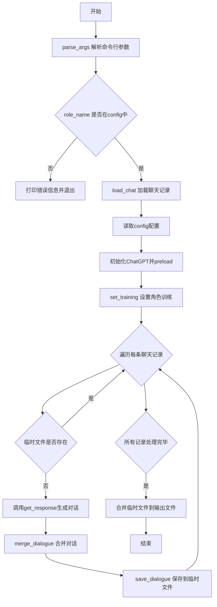
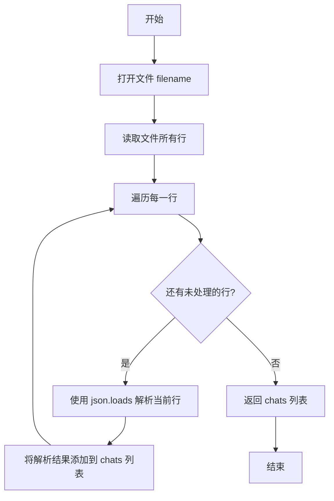
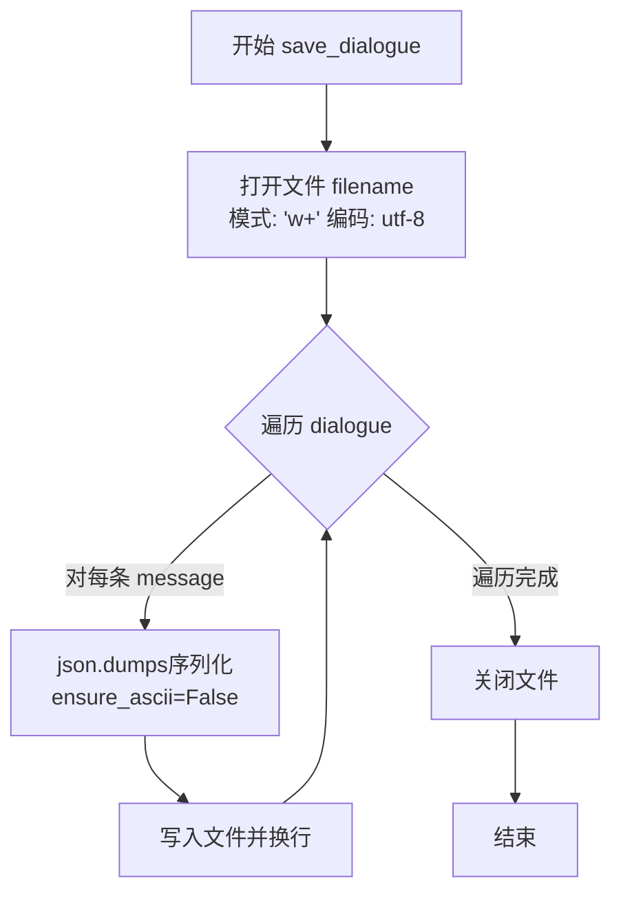
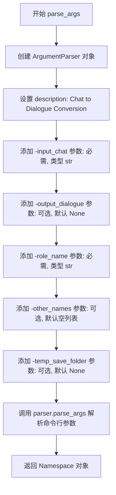
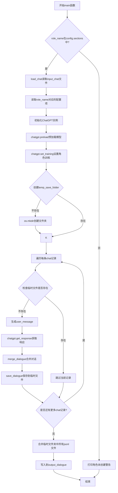
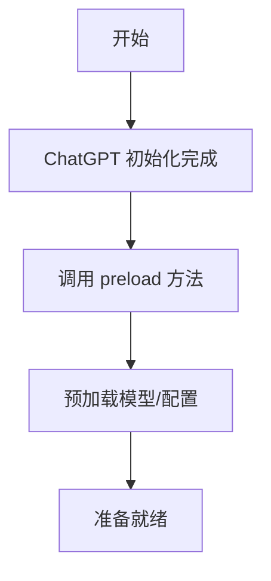
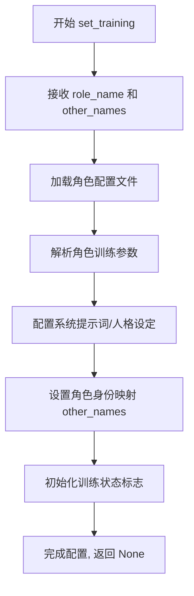
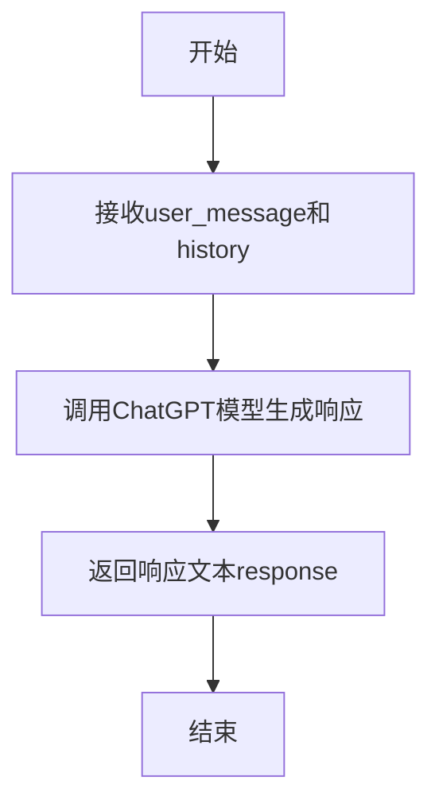

# `Chat-Haruhi-Suzumiya\kyon_generator\chat2dialogue.py` 详细设计文档

该程序用于将单句聊天记录转换为连续的多轮对话。通过调用ChatGPT API，根据用户输入的聊天内容生成符合角色设定的对话，并将结果保存为jsonl格式文件。支持配置不同的角色名称和其他名字选项。

## 整体流程



## 类结构

```
模块级别的全局函数
├── load_chat
├── save_dialogue
├── parse_args
├── merge_dialogue
└── main
```

## 全局变量及字段


### `input_chat`
    
输入的聊天记录文件路径（jsonl格式）

类型：`str`
    


### `output_dialogue`
    
输出的对话文件路径（jsonl格式），默认为input_chat_to_dialogue.jsonl

类型：`str`
    


### `role_name`
    
主角的名字，用于匹配配置文件和设置角色

类型：`str`
    


### `other_names_lis`
    
主角的其他名字列表，用于角色训练时识别

类型：`list[str]`
    


### `temp_save_folder`
    
临时保存文件夹路径，用于存储中间生成的对话文件

类型：`str`
    


### `config`
    
配置文件解析器对象，用于读取config.ini配置

类型：`configparser.ConfigParser`
    


### `configuration`
    
存储特定角色的配置项键值对

类型：`dict`
    


### `chat_data`
    
从输入文件加载的聊天记录列表

类型：`list[dict]`
    


### `chatgpt`
    
ChatGPT模型实例，用于生成对话响应

类型：`ChatGPT`
    


### `dialogue`
    
生成的对话列表，包含角色和文本信息

类型：`list[dict]`
    


### `role`
    
当前聊天记录中的角色名称

类型：`str`
    


### `text`
    
当前聊天记录中的消息文本内容

类型：`str`
    


### `file_name`
    
临时文件的名称，由索引和文本前几个字符组成

类型：`str`
    


    

## 全局函数及方法


### `load_chat`

该函数用于从指定的 JSONL 文件中加载聊天记录，将文件中每一行的 JSON 字符串解析为 Python 字典对象，并返回一个包含所有聊天记录的列表。

参数：

- `filename`：`str`，要读取的聊天记录文件路径（JSONL 格式）

返回值：`list`，返回解析后的聊天记录列表，列表中每个元素是一个字典对象（对应文件中的一行 JSON）

#### 流程图



#### 带注释源码

```python
def load_chat(filename):
    """
    从 JSONL 文件加载聊天记录
    
    参数:
        filename: 要读取的聊天文件路径
        
    返回:
        包含所有聊天记录的列表
    """
    # 使用 with 语句打开文件，确保文件正确关闭
    # 读取模式 'r' 表示只读
    with open(filename, 'r') as f:
        # 读取文件所有行，每行是一个 JSON 对象
        # 使用列表推导式将每行 JSON 字符串解析为 Python 字典
        chats = [json.loads(line) for line in f]
    # 返回解析后的聊天记录列表
    return chats
```


### `save_dialogue`

该函数负责将对话列表持久化到指定的JSONL文件中，通过遍历对话列表并将每条消息序列化为JSON格式写入文件，同时确保中文字符正确处理。

参数：

- `filename`：`str`，输出文件的路径和名称
- `dialogue`：`list`，要保存的对话列表，每个元素通常为字典类型

返回值：`None`，该函数直接写入文件，不返回任何值

#### 流程图



#### 带注释源码

```python
def save_dialogue(filename, dialogue):
    """
    将对话列表保存到指定文件中
    
    参数:
        filename: str, 输出文件路径
        dialogue: list, 对话列表
    
    返回:
        None
    """
    # 使用 'w+' 模式打开文件，encoding='utf-8' 确保中文正确写入
    with open(filename, 'w+', encoding='utf-8') as f:
        # 遍历对话列表中的每条消息
        for message in dialogue:
            # 使用 json.dumps 将字典序列化为 JSON 字符串
            # ensure_ascii=False 确保中文字符不被转义
            f.write(json.dumps(message, ensure_ascii=False) + '\n')
    # with 语句自动关闭文件
```

#### 相关设计信息

**文件整体运行流程：**
本文件(`chat2dialogue.py`)实现将单句聊天记录转换为连续对话的功能。主要流程为：1)解析命令行参数；2)加载聊天数据；3)读取配置文件初始化ChatGPT；4)遍历每条聊天记录，调用ChatGPT生成回复；5)将回复合并为对话格式；6)**通过save_dialogue函数将对话保存到临时文件**；7)最后合并所有临时文件到输出文件。

**关键组件：**
- `ChatGPT`：用于生成对话响应的核心类
- `load_chat`：加载输入聊天记录
- `save_dialogue`：保存对话到文件（本函数）
- `merge_dialogue`：合并用户消息和GPT响应为统一对话格式

**潜在技术债务与优化空间：**
1. `save_dialogue`函数使用`'w+'`模式，每次调用会覆盖原文件，如果需要追加功能应使用`'a'`模式
2. 未对`filename`参数做有效性校验（如空字符串、路径权限等）
3. 未处理写入失败（如磁盘空间不足）的异常情况
4. `dialogue`参数类型应为`List[Dict]`，可考虑添加类型注解提升可读性


### `parse_args`

该函数是命令行参数解析器，用于解析程序运行时所需的各种输入参数，包括输入聊天文件路径、输出对话文件路径、角色名称、角色别名以及临时保存文件夹路径。

参数：此函数没有显式参数（使用 `sys.argv` 隐式获取命令行参数）

返回值：`argparse.Namespace`，返回包含所有解析后命令行参数的对象

#### 流程图



#### 带注释源码

```python
def parse_args():
    """
    解析命令行参数，返回包含所有输入参数的命名空间对象
    
    参数:
        无 (隐式使用 sys.argv 获取命令行输入)
    
    返回值:
        argparse.Namespace: 包含以下属性
            - input_chat: str, 输入的聊天记录文件路径 (jsonl格式)
            - output_dialogue: str, 输出的对话文件路径 (jsonl格式), 默认为None
            - role_name: str, 角色名称
            - other_names: list, 角色的其他名称列表
            - temp_save_folder: str, 临时文件保存路径
    """
    # 创建 ArgumentParser 对象，设置程序描述信息
    # 用于描述程序的用途，提示用户程序的 功能
    parser = argparse.ArgumentParser(
        description='Chat to Dialogue Conversion, output_dialogue 和 input_chat 在同一路径')
    
    # 添加 -input_chat 参数：必需参数，指定输入的聊天记录文件路径
    # 类型为字符串，jsonl 格式
    parser.add_argument('-input_chat', type=str, required=True, help='input chat file (jsonl)')
    
    # 添加 -output_dialogue 参数：可选参数，指定输出的对话文件路径
    # 默认为 None，稍后在 main 函数中会设置为默认路径
    parser.add_argument('-output_dialogue', type=str, default=None, help='output dialogue file (jsonl)')
    
    # 添加 -role_name 参数：必需参数，指定要使用的角色名称
    # 用于在 config.ini 中查找对应的角色配置
    parser.add_argument('-role_name', type=str, required=True, help='role name')
    
    # 添加 -other_names 参数：可选参数，支持多个值
    # 使用 nargs="+" 允许传入多个其他名称，默认为空列表
    # 这些名称用于角色训练时的别名设置
    parser.add_argument('-other_names', nargs="+", default="", type=str, help='other names')

    # 添加 -temp_save_folder 参数：可选参数，指定临时保存文件夹路径
    # 用于在处理大量聊天记录时，保存中间结果
    # arugments that figure out temporary saving folder
    parser.add_argument('-temp_save_folder', default=None, type=str, help='temproray saving file path')

    # 解析命令行参数并返回
    # parse_args() 会自动读取 sys.argv 中的命令行参数
    return parser.parse_args()
```


### `merge_dialogue`

该函数用于将一段连续的多角色对话文本解析并合并为结构化的对话列表，能够识别对话中的角色名称（包括处理别名如"凉宫春日"→"春日"），并将同一角色的连续发言进行合并，最终返回包含对话历史和来源信息的字典。

参数：

- `user_message`：`str`，用户输入的原始消息，作为对话列表的首条记录
- `dialogue_text`：`str`，需要解析的对话文本，包含多行角色对话内容

返回值：`dict`，包含两个键值对：`"dialogue"` 为结构化的对话列表（每项为 `{"role": 角色名, "text": 对话内容}`），`"source"` 为固定值 `"synthesized"` 表示该对话为合成生成

#### 流程图

```mermaid
flowchart TD
    A[开始 merge_dialogue] --> B[将 dialogue_text 按换行符分割为列表]
    B --> C[初始化 dialogue = [user_message]]
    C --> D[初始化 current_role = 空字符串, current_text = 空字符串]
    D --> E{遍历 dialogue_list 中的每行 line}
    E -->|line 为空| E
    E -->|line 不为空| F[判断 line 中包含 : 还是 ：]
    F --> G{找到分隔符 ch}
    G -->|找到| H[用 ch 分割 line]
    H --> I[提取 role = parts[0] 去除空格并替换 凉宫春日 → 春日]
    I --> J[提取 text = parts[1] 去除空格]
    G -->|未找到| K[role = 空字符串, text = line]
    J --> L{role == current_role?}
    K --> L
    L -->|是| M[合并对话: 去掉 current_text 最后一个字符<br/>加上 text 的从第二个字符开始的内容]
    L -->|否| N{current_role 不为空?}
    N -->|是| O[将 current_role 和 current_text 作为对话条目加入 dialogue]
    N -->|否| P[更新 current_role = role, current_text = text]
    O --> P
    M --> E
    P --> E
    E -->|遍历结束| Q[将最后的 current_role 和 current_text 加入 dialogue]
    Q --> R[返回 {dialogue: dialogue, source: synthesized}]
```

#### 带注释源码

```python
def merge_dialogue(user_message, dialogue_text):
    """
    将一段连续的多角色对话文本解析并合并为结构化对话列表
    
    参数:
        user_message: 用户输入的原始消息，作为对话首条记录
        dialogue_text: 需要解析的对话文本，包含多行角色:内容的格式
    
    返回:
        包含对话列表和来源的字典
    """
    # 1. 将对话文本按换行符分割成行列表
    dialogue_list = dialogue_text.split('\n')
    
    # 2. 初始化对话列表，将用户消息作为首条记录
    dialogue = [user_message]
    
    # 3. 初始化当前角色和当前文本的缓存变量
    current_role = ""
    current_text = ""
    
    # 4. 遍历对话文本的每一行
    for line in dialogue_list:
        # 跳过空行
        if line:
            # 5. 检测行中使用的分隔符（中文冒号 或 英文冒号）
            ch = ":" if ":" in line else "："
            
            # 6. 如果存在分隔符，则分割角色和文本
            if ch in line:
                parts = line.split(ch)
                # 提取角色名，去除空格，并处理别名（凉宫春日 → 春日）
                role = parts[0].strip().replace("凉宫春日", "春日")
                # 提取对话内容，去除空格
                text = parts[1].strip()
            else:
                # 7. 如果没有分隔符，认为是同一角色的继续发言
                role = ""
                text = line
            
            # 8. 判断当前角色是否与缓存的角色相同
            if role == current_role:
                # 相同角色：合并对话（去掉前一个文本的最后一个字符【可能是标点】，
                # 然后拼接当前文本从第二个字符开始的内容【跳过可能的冒号或空格】）
                current_text = current_text[:-1]
                current_text += text[1:]
            else:
                # 9. 不同角色：先将缓存的对话添加到列表
                if current_role != "":
                    dialogue.append({"role": current_role, "text": current_text})
                # 更新当前角色和文本缓存
                current_role = role
                current_text = text
    
    # 10. 循环结束后，将最后一条对话添加到列表
    dialogue.append({"role": current_role, "text": current_text})
    
    # 11. 返回结构化对话结果，包含对话列表和来源标记
    return {"dialogue": dialogue, "source": "synthesized"}
```


### `main`

该函数是程序的核心入口，负责将单轮聊天记录转换为多轮对话格式。它读取聊天数据，初始化ChatGPT模型，遍历每条聊天记录生成对应的对话，并将结果保存到临时文件，最后合并所有临时文件为最终的对话输出文件。

参数：

- `input_chat`：`str`，输入的聊天记录文件路径（jsonl格式）
- `output_dialogue`：`str`，输出的对话文件路径，若为None则默认为input_chat对应的文件名加上"_to_dialogue.jsonl"后缀
- `role_name`：`str`，主角的名字，用于加载配置和设置角色训练
- `other_names`：`list`，主角的其他名字列表（如别名）
- `temp_save_folder`：`str`，临时保存文件夹路径，用于存储每条记录生成的对话文件

返回值：`None`，该函数不返回任何值，结果直接写入到输出文件和临时文件夹中

#### 流程图



#### 带注释源码

```python
def main(input_chat, output_dialogue, role_name, other_names, temp_save_folder):
    """
    主函数：将单轮聊天记录转换为多轮对话格式
    
    参数:
        input_chat: 输入的聊天记录文件路径
        output_dialogue: 输出的对话文件路径
        role_name: 角色名称
        other_names: 角色的其他名字列表
        temp_save_folder: 临时保存文件夹路径
    """
    # 1. 读取配置文件
    config = configparser.ConfigParser()
    config.read("../src_reform/config.ini", encoding='utf-8')
    
    # 2. 检查角色是否在配置中存在
    if role_name not in config.sections():
        print(f"{role_name} 角色未创建，请创建角色后再使用，或是与config.ini 中角色一致")
    else:
        # 3. 加载聊天数据
        chat_data = load_chat(input_chat)

        # 4. 读取该角色的配置项
        configuration = {}

        print(config.items)
        items = config.items(role_name)
        for key, value in items:
            configuration[key] = value

        # 5. 初始化ChatGPT实例并预加载模型
        chatgpt = ChatGPT(configuration)
        chatgpt.preload()
        
        # 6. 设置角色训练
        chatgpt.set_training(role_name, other_names)
        dialogue = []
        
        # 7. 生成对话
        print("Generating dialogue...")

        # 8. 创建临时保存文件夹（如果不存在）
        if not os.path.exists(temp_save_folder):
            os.mkdir(temp_save_folder)
            print(f"创建临时文件夹{temp_save_folder}")

        # 9. 遍历每条聊天记录进行处理
        for i, chat in enumerate(tqdm(chat_data)):
            role = chat['role']
            text = chat['text']

            # 生成文件名，使用前4个字符作为文件名的一部分
            file_name = f"{i}_{text[:min(4,len(text))]}.jsonl"
            # 替换非法字符
            file_name = file_name.replace("/", "_")

            # 如果临时文件已存在，则跳过处理
            if os.path.exists(os.path.join(temp_save_folder, file_name)):
                continue

            # 10. 构造用户消息并获取ChatGPT响应
            user_message = f'{role}:「{text}」'

            response = chatgpt.get_response(user_message, [])
            
            # 11. 合并对话并保存到临时文件
            temp_dialogue = [merge_dialogue(user_message, response)] 
            save_dialogue(os.path.join(temp_save_folder, file_name), temp_dialogue)

        # 12. 合并所有临时文件到最终输出文件
        output_dialogue = f'{input_chat[:-4]}_to_dialogue.jsonl' if output_dialogue is None else output_dialogue
        
        with open(output_dialogue, 'w', encoding='utf-8') as outfile:
            for filename in os.listdir(temp_save_folder):
                if filename.endswith('.jsonl'): 
                    filepath = os.path.join(temp_save_folder, filename)

                    # 13. 为了防止文件打不开，尝试打开三次
                    for i in range(3):
                        try:
                            with open(filepath) as infile:
                                for line in infile:
                                    outfile.write(line)
                            break
                        except:
                            if i == 2:
                                print(f"Warning: Failed to open file {filename} after 3 attempts, skipping...")
```


### `ChatGPT.preload`

**描述**：该方法用于在聊天生成前预加载模型或配置资源，确保后续交互的响应速度。在提供的代码中，`preload` 方法在初始化 `ChatGPT` 实例后立即被调用，为对话生成做准备工作。

**参数**：无（调用时未传递任何参数）

**返回值**：未知（代码中未展示该方法的返回值，其实现位于 `ChatGPT_for_generation` 模块中）

#### 流程图



#### 带注释源码

```
# 调用位置位于 chat2dialogue.py 的 main 函数中
chatgpt = ChatGPT(configuration)  # 初始化 ChatGPT 实例
chatgpt.preload()  # 调用 preload 方法进行预加载
```

---

**注意**：提供的代码片段中仅包含 `ChatGPT` 类的调用，未包含其具体实现。`ChatGPT` 类定义在 `ChatGPT_for_generation` 模块中，因此无法提取 `preload` 方法的完整源码和详细逻辑。以上信息基于方法名称和上下文推断，具体实现需参考 `ChatGPT_for_generation.py` 文件。


### ChatGPT.set_training

该方法用于设置聊天机器人的角色训练信息，通过传入角色名称和其他名称（别名）来配置ChatGPT实例，以便能够以特定角色的身份进行对话生成。

参数：

- `role_name`：`str`，角色名称，用于指定要训练的角色身份（如“春日”）
- `other_names`：`List[str]`，角色的其他名字列表，用于匹配对话中可能出现的该角色的不同称呼（如["凉宫春日", "凉宫"]）

返回值：`None`，无返回值，该方法主要执行配置副作用

#### 流程图



#### 带注释源码

```python
# 由于提供的代码文件中不包含 ChatGPT 类的定义，
# 以下为基于调用上下文推断的方法签名和使用方式

# 调用位置 (chat2dialogue.py 第93-94行):
chatgpt = ChatGPT(configuration)  # 根据配置创建ChatGPT实例
chatgpt.preload()                  # 预加载模型
chatgpt.set_training(role_name, other_names)  # 设置角色训练

# 推断的方法签名:
def set_training(self, role_name: str, other_names: List[str]) -> None:
    """
    设置ChatGPT的角色训练配置
    
    参数:
        role_name: 角色名称，用于系统提示中定义角色身份
        other_names: 角色其他名称列表，用于对话中识别角色发言
    
    返回值:
        无返回值
    
    注意事项:
        - 该方法应在 get_response 之前调用
        - configuration 字典中应包含角色的系统提示词模板
        - other_names 用于merge_dialogue函数中的角色名标准化
    """
    pass
```

#### 额外说明

由于`ChatGPT`类的定义位于`ChatGPT_for_generation`模块中（通过`from ChatGPT_for_generation import ChatGPT`导入），该方法的完整实现未在当前代码文件中提供。上述信息基于以下调用上下文推断：

1. **调用位置**：`chat2dialogue.py`第93-94行，在`main`函数中
2. **调用时机**：在`chatgpt.preload()`之后，`get_response()`之前
3. **参数来源**：
   - `role_name`来自命令行参数`-role_name`
   - `other_names`来自命令行参数`-other_names`（支持多个名称）
4. **配置依赖**：该方法依赖于`config.ini`中对应角色章节的配置项

如需查看`set_training`方法的完整实现，请参考`ChatGPT_for_generation`模块源文件。


### ChatGPT.get_response

获取ChatGPT模型生成的响应内容。

参数：

- `user_message`：`str`，用户输入的消息，格式为`{role}:「{text}」`
- `history`：`list`，对话历史列表，用于上下文管理

返回值：`str`，模型生成的响应文本内容

#### 流程图



#### 带注释源码

```python
# 此方法定义在ChatGPT_for_generation模块中
# 根据chat2dialogue.py中的调用方式推断的签名和功能

def get_response(self, user_message: str, history: list) -> str:
    """
    获取ChatGPT模型生成的响应
    
    参数:
        user_message: str - 用户输入的消息，格式为'{role}:「{text}」'
        history: list - 对话历史列表，用于上下文管理
    
    返回:
        str - 模型生成的响应文本内容
    """
    # 注意：此方法的完整实现在ChatGPT_for_generation模块中
    # 当前代码中通过以下方式调用:
    # response = chatgpt.get_response(user_message, [])
    pass
```

#### 在chat2dialogue.py中的调用示例

```python
# 初始化ChatGPT
chatgpt = ChatGPT(configuration)
chatgpt.preload()
chatgpt.set_training(role_name, other_names)

# 生成对话
for i, chat in enumerate(tqdm(chat_data)):
    role = chat['role']
    text = chat['text']
    user_message = f'{role}:「{text}」'
    
    # 调用get_response方法获取响应
    response = chatgpt.get_response(user_message, [])
    
    # 将响应转换为对话格式
    temp_dialogue = [merge_dialogue(user_message, response)]
    save_dialogue(os.path.join(temp_save_folder, file_name), temp_dialogue)
```

## 关键组件


### 聊天记录加载 (load_chat)

从JSONL文件加载聊天记录，逐行读取并解析为JSON对象列表

### 对话保存 (save_dialogue)

将对话列表以JSONL格式保存到文件，每条消息单独一行并确保中文正常显示

### 参数解析 (parse_args)

解析命令行参数，包括输入聊天文件、输出对话文件、角色名称、其他名称和临时保存文件夹

### 对话合并 (merge_dialogue)

将用户消息和ChatGPT返回的连续文本合并为结构化对话列表，处理角色分离和文本拼接逻辑

### ChatGPT交互模块

使用配置初始化ChatGPT类，预加载模型，设置角色训练信息，生成对话响应

### 临时文件管理

在temp_save_folder中保存每个对话的中间结果，支持断点续传（已存在则跳过）

### 临时文件合并

将临时文件夹中的所有JSONL文件合并为最终输出文件，包含三重重试机制防止文件读取失败

### 配置文件读取

从config.ini读取角色相关配置，支持检查角色是否存在并加载对应参数


## 问题及建议


### 已知问题

- **硬编码路径问题**：`config.read("../src_reform/config.ini", encoding='utf-8')` 使用了硬编码的相对路径，当项目结构改变时会无法找到配置文件。
- **divide_story 函数未实现**：注释明确提到 "ChatGPT类中间的divide_story函数还没有实现"，这是明显的功能缺失。
- **参数拼写错误**：第48行 `arugments` 应为 `arguments`，属于低级的代码质量问题。
- **异常处理不完善**：`load_chat`、`save_dialogue`、API调用 `chatgpt.get_response()` 等关键函数均缺少异常捕获机制。
- **输入验证缺失**：未验证输入文件 `input_chat` 是否存在、配置文件是否可读、角色名是否在配置中等关键场景。
- **临时文件管理缺陷**：临时文件夹创建后无清理机制，且文件名生成逻辑 `text[:min(4,len(text))]` 过短，容易产生文件名冲突。
- **代码冗余**：第147-149行被注释掉的代码与后续逻辑重复，且 `dialogue` 列表accumulate逻辑被注释后未使用。
- **字符集处理隐患**：`merge_dialogue` 中使用中英文冒号混合判断（`ch = ":" if ":" in line else "："`），可能因输入格式不一致导致解析错误。

### 优化建议

- 将配置文件路径改为可配置参数或使用环境变量/项目根目录相对路径。
- 实现或明确标记 `divide_story` 函数的接口与实现计划。
- 为所有文件IO操作添加 try-except 异常处理，特别是网络API调用部分。
- 在程序入口增加参数校验：检查输入文件存在性、配置文件可读性、角色名合法性等。
- 优化临时文件名生成策略，使用UUID或更长的文本前缀避免冲突，并添加临时文件夹清理选项。
- 统一代码风格，修复拼写错误，移除或清理注释掉的冗余代码。
- 考虑将 `merge_dialogue` 函数的角色解析逻辑抽离为独立模块，增加单元测试覆盖边界情况。

## 其它


### 设计目标与约束

本项目旨在将单句对话转换为连续的对话段落，通过调用ChatGPT API来生成更丰富的对话内容。核心约束包括：1) 依赖ChatGPT API进行对话生成；2) 需要预先配置config.ini文件定义角色；3) 输入输出均为jsonl格式；4) 临时文件用于断点续传和防止API调用失败导致数据丢失。

### 错误处理与异常设计

代码中包含以下错误处理机制：1) 文件打开重试机制：对临时文件进行3次打开尝试，防止文件写入不完整导致无法读取；2) 角色存在性检查：在config中查找role_name是否存在，不存在则给出提示并退出；3) 目录创建：自动创建临时保存文件夹；4) 文件名特殊字符处理：将"/"替换为"_"防止路径错误。

### 数据流与状态机

主流程状态机包含以下状态：1) 初始化状态：加载配置文件、解析参数；2) 数据加载状态：从input_chat读取jsonl格式聊天记录；3) 对话生成状态：遍历每条聊天记录，调用ChatGPT API生成扩展对话；4) 临时保存状态：将每条生成的对话保存到临时文件；5) 合并输出状态：将所有临时文件合并到最终输出文件。

### 外部依赖与接口契约

主要外部依赖包括：1) ChatGPT_for_generation.ChatGPT类：提供与ChatGPT API交互的接口；2) configparser模块：读取ini配置文件；3) json模块：处理jsonl格式数据；4) tqdm模块：显示进度条；5) argparse模块：解析命令行参数。配置文件config.ini需包含角色名section，其中配置项供ChatGPT类初始化使用。

### 输入输出格式规范

输入格式：jsonl文件，每行为JSON对象，包含"role"（字符串，角色名）和"text"（字符串，对话内容）字段。输出格式：jsonl文件，每行为JSON对象，包含"dialogue"（数组，对话列表）和"source"（字符串，来源标识"synthesized"）字段。单个对话对象格式：{"role": 角色名, "text": 对话内容}。

### 命令行参数详解

-input_chat：必需参数，指定输入聊天记录文件路径（jsonl格式）。-output_dialogue：可选参数，指定输出对话文件路径，默认为input_chat对应的文件名_to_dialogue.jsonl。-role_name：必需参数，指定主角名字，需与config.ini中的角色section对应。-other_names：可选参数，指定主角的其他名字列表，用于角色训练设置。-temp_save_folder：可选参数，指定临时文件保存路径，默认为output_{role_name}。

### 临时文件管理策略

程序采用增量式处理策略：1) 为每条聊天记录生成唯一的临时文件名（格式：{索引}_{文本前4字符}.jsonl）；2) 处理前检查临时文件是否已存在，存在则跳过，实现断点续传功能；3) 所有临时文件保存在指定临时文件夹中；4) 处理完成后将临时文件夹中的所有jsonl文件按顺序合并到最终输出文件。

### 性能考虑与优化建议

当前实现存在的性能瓶颈：1) 串行处理每条对话记录，可考虑使用并发或批量处理；2) 每次调用ChatGPT API都有网络延迟开销；3) 临时文件IO操作频繁。建议优化：1) 实现ChatGPT类的divide_story方法以支持批量生成；2) 添加并发控制机制利用多线程并行调用API；3) 增加缓存机制避免重复生成相同内容。

### 安全性考虑

代码中包含以下安全相关处理：1) 文件名特殊字符处理：替换"/"为"_"防止路径遍历；2) 文件打开重试机制防止数据损坏；3) UTF-8编码处理确保中文正常读写。建议增加：1) 输入内容过滤防止恶意指令注入；2) API调用频率限制防止账号被封；3) 敏感信息脱敏处理。

### 配置文件结构

config.ini文件采用INI格式，每个角色名作为section，每个section包含ChatGPT初始化所需的配置项（如API密钥、模型参数、温度等）。角色配置需提前通过其他工具或人工创建，程序启动时会检查角色是否存在。

### 待实现功能

代码注释中提到ChatGPT类中间的divide_story函数还没有实现，实现该函数后程序基本可以完整运行。该函数应负责将单句对话分割为多句对话的逻辑，是对话生成功能的核心实现。

### 使用示例

```bash
python chat2dialogue.py -input_chat chat.jsonl -output_dialogue dialogue.jsonl -role_name 春日 -other_names 凉宫春日 凉宫
```

    