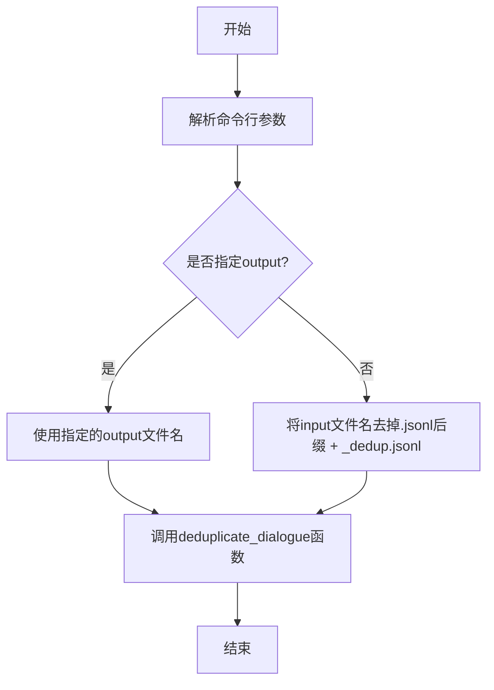
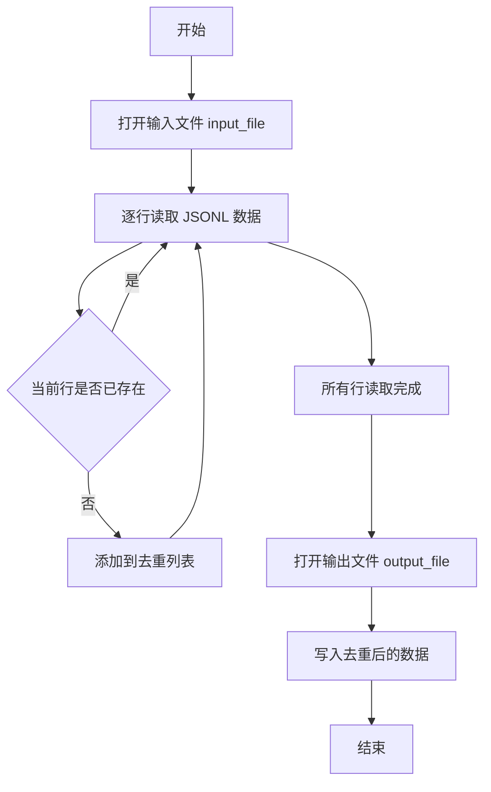

# `Chat-Haruhi-Suzumiya\kyon_generator\chatlog2dialogue.py` 详细设计文档

这是Chat凉宫春日项目中的聊天记录处理工具，用于将jsonl格式的聊天记录文件转换为对话形式，并去除重复的对话内容，支持通过命令行参数指定输入输出文件路径。

## 整体流程



## 类结构

```

```

## 全局变量及字段


### `input_file`
    
输入的聊天记录文件路径（jsonl格式）

类型：`str`
    


### `output_file`
    
输出的去重对话文件路径（jsonl格式）

类型：`str`
    


### `parser`
    
命令行参数解析器对象

类型：`argparse.ArgumentParser`
    


### `args`
    
解析后的命令行参数命名空间对象

类型：`argparse.Namespace`
    


    

## 全局函数及方法


### `deduplicate_dialogue`

该函数是程序的核心处理逻辑，用于读取包含聊天记录的 JSONL（JSON Lines）文件，识别并去除其中重复的对话内容，最终将去重后的结果写入指定的输出文件。

参数：

- `input_file`：`str`，输入的聊天记录文件路径，文件格式为 JSONL。
- `output_file`：`str`，输出的去重后的对话文件路径。

返回值：`None`，该函数主要通过文件 IO 操作保存结果，不返回具体数据值。

#### 流程图



#### 带注释源码

```python
import json

def deduplicate_dialogue(input_file, output_file):
    """
    对聊天记录文件进行去重处理
    
    参数:
        input_file (str): 输入的聊天记录文件路径 (jsonl格式)
        output_file (str): 输出的去重后的文件路径 (jsonl格式)
        
    返回:
        None: 该函数直接写入文件，不返回数据
    """
    
    # 用于存储已见过的对话内容，以实现去重
    seen_dialogues = set()
    
    # 存储去重后的对话列表
    deduplicated_data = []
    
    try:
        # 以只读模式打开输入文件
        with open(input_file, 'r', encoding='utf-8') as f_in:
            # 遍历文件的每一行
            for line in f_in:
                # 去除首尾空白字符
                line = line.strip()
                
                # 跳过空行
                if not line:
                    continue
                
                try:
                    # 解析 JSON 行数据
                    dialogue = json.loads(line)
                    
                    # 将对话对象转换为可哈希的字符串形式以便比较
                    # 假设对话记录的主要唯一键为 'content' 或整条记录
                    dialogue_str = json.dumps(dialogue, sort_keys=True)
                    
                    # 检查是否已存在该对话
                    if dialogue_str not in seen_dialogues:
                        # 不存在，则加入集合和结果列表
                        seen_dialogues.add(dialogue_str)
                        deduplicated_data.append(dialogue)
                    # else: 如果已存在，则忽略该行，实现去重
                    
                except json.JSONDecodeError:
                    # 如果某一行不是合法的 JSON，跳过并记录（可选）
                    print(f"Warning: Skipping invalid JSON line: {line}")
                    continue
                    
        # 写入去重后的数据到输出文件
        with open(output_file, 'w', encoding='utf-8') as f_out:
            for item in deduplicated_data:
                # 写入 JSON 字符串并换行
                f_out.write(json.dumps(item, ensure_ascii=False) + '\n')
                
        print(f"去重完成，共处理 {len(deduplicated_data)} 条对话。")
        
    except FileNotFoundError:
        print(f"错误：找不到输入文件 {input_file}")
    except IOError as e:
        print(f"错误：IO操作失败 {e}")
```

## 关键组件


### 命令行参数解析器

使用argparse模块创建命令行参数解析器，支持-input和-output两个参数，用于指定输入输出文件。

### 文件路径处理逻辑

自动处理输出文件名，如果未指定output，则在输入文件名基础上添加_dedup后缀。

### deduplicate_dialogue函数

核心去重函数，目前为TODO状态，计划用于去除聊天记录中的重复对话。

### JSONL文件处理流程

支持jsonl格式的聊天记录读取和对话转换处理。


## 问题及建议


### 已知问题

-   **核心功能未实现**：`deduplicate_dialogue`函数体仅为`pass`，没有实际去重逻辑，该程序目前无法完成其声称的功能
-   **TODO注释未完成**：代码中虽有TODO注释标记需要实现去重功能，但尚未实现
-   **缺少错误处理**：没有对文件不存在、文件读写权限、JSON格式错误等异常情况进行处理
-   **无效的print语句**：`print("")`仅输出空行，无实际意义，可删除或替换为有意义的日志输出
-   **命令行参数命名不规范**：使用单破折号`-input`而非标准双破折号`--input`
-   **输出文件名生成逻辑缺陷**：使用`rstrip('.jsonl')`可能导致异常输出，例如输入`file.jsonl`会输出`file_dedup.jsonl`，但若输入已含`_dedup`后缀则可能产生非预期结果
-   **缺少输入验证**：未验证输入文件是否为有效的JSONL格式
-   **缺少运行时反馈**：程序执行过程中无任何进度或状态提示，用户无法得知程序是否正常运行
-   **缺少必要的模块导入**：未导入`os`、`sys`等可能需要的标准库

### 优化建议

-   实现`deduplicate_dialogue`函数的具体去重逻辑
-   添加文件存在性检查和异常捕获机制（使用try-except）
-   将`-input`改为`--input`以符合命令行参数规范
-   替换无效的空print语句为有意义的日志输出（如使用logging模块）
-   优化输出文件名生成逻辑，避免字符串处理错误
-   添加输入文件格式验证，确保为有效的JSONL文件
-   添加程序执行状态反馈，提升用户体验
-   考虑添加--help说明和程序版本信息

## 其它


### 设计目标与约束

本程序的核心目标是将聊天记录文件（JSONL格式）转换为对话形式，并去除重复的对话内容。设计约束包括：输入文件必须为JSONL格式，每行包含有效的JSON聊天记录；输出文件默认为输入文件名加上"_dedup"后缀；程序需支持命令行参数指定输入输出文件。

### 错误处理与异常设计

程序应处理以下异常情况：输入文件不存在或无法读取时抛出FileNotFoundError并提示用户；输入文件格式非JSONL或包含无效JSON时抛出json.JSONDecodeError并记录错误行号；输出目录无写入权限时抛出PermissionError；处理过程中磁盘空间不足时抛出IOError。异常信息应包含具体的文件名和行号以便定位问题。

### 数据流与状态机

数据流如下：命令行参数解析 → 读取输入文件 → 逐行解析JSON → 对话去重处理 → 写入输出文件。状态机包含三个状态：初始状态（解析命令行参数）、处理状态（读取和去重对话）、完成状态（写入结果并退出）。去重逻辑应在内存中维护已见过的对话集合，避免重复写入相同内容。

### 外部依赖与接口契约

本程序依赖Python标准库：argparse（命令行参数解析）、json（JSON解析）。接口契约方面：输入文件每行应为有效的JSON对象，包含对话相关字段；deduplicate_dialogue函数接收两个字符串参数（输入文件路径、输出文件路径），无返回值；函数应保证输出的JSONL文件格式正确，每行一个JSON对象。

### 性能考虑

对于大型聊天记录文件，应考虑流式处理而非一次性加载全部内容到内存；去重操作可使用哈希集合或布隆过滤器提高效率；建议添加进度显示功能，以便用户了解处理进度。

### 安全性考虑

应验证输入文件路径防止路径遍历攻击；对输入内容进行合理的大小限制，防止恶意超大文件；输出文件路径应防止覆盖系统重要文件。

### 日志设计

建议添加日志功能，记录程序运行的关键信息：程序启动时的参数信息、处理进度（已处理行数）、处理完成的统计信息（总行数、去重后行数）、任何警告或错误信息。日志级别可分为INFO（正常流程）、WARNING（可恢复问题）、ERROR（致命错误）。

### 测试策略

建议编写单元测试验证以下场景：正常输入文件处理、空输入文件处理、包含重复内容的输入文件、格式错误的JSONL文件、不存在的输入文件。测试用例应覆盖去重逻辑的正确性，确保重复对话被正确识别和去除。

### 部署与运维

程序为命令行工具，建议通过setup.py或pyproject.toml打包分发；可添加--verbose参数支持详细输出模式；建议添加版本信息显示功能，便于问题排查和版本追踪。


    