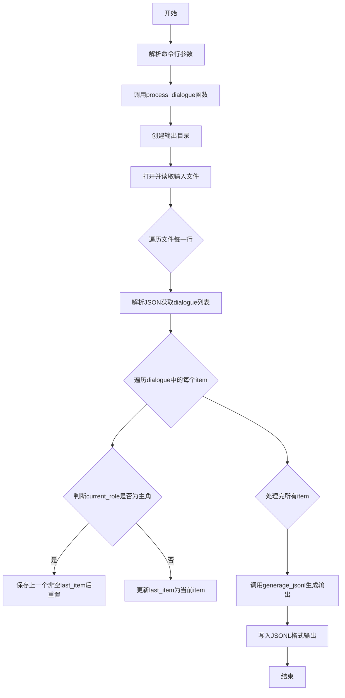
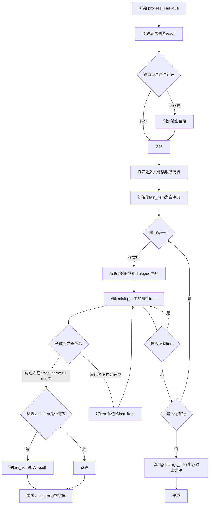
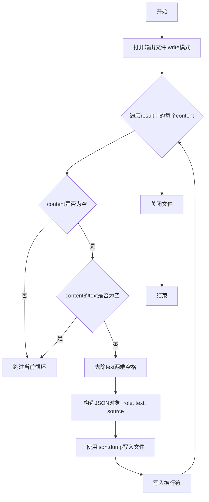

# `Chat-Haruhi-Suzumiya\kyon_generator\dialogue2chat.py` 详细设计文档

该脚本用于处理Chat凉宫春日项目中的聊天记录数据，通过解析JSONL格式的对话文件，根据指定的主角名称过滤并抽取所有非主角的对话，最终输出为新的JSONL格式文件。

## 整体流程



## 类结构

```
该脚本为扁平化结构，无类层次
仅包含两个核心函数模块
└── process_dialogue (主处理函数)
└── generage_jsonl (输出生成函数)
```

## 全局变量及字段


### `result`
    
存储从聊天记录中提取的非主角对话列表

类型：`list`
    


### `output_dir`
    
输出文件的绝对路径目录

类型：`str`
    


### `cnt`
    
计数器，记录已处理的行数

类型：`int`
    


### `f_read`
    
输入文件的文件对象，用于读取聊天记录

类型：`file`
    


### `lines`
    
输入文件的所有行内容列表

类型：`list`
    


### `last_item`
    
记录上一个非主角的对话项，用于判断是否需要添加到结果中

类型：`dict`
    


### `line`
    
当前正在处理的原始JSON行字符串

类型：`str`
    


### `content`
    
从JSON行中解析出的dialogue内容

类型：`list/dict`
    


### `item`
    
遍历dialogue列表时的当前对话项

类型：`dict`
    


### `current_role`
    
当前对话项的角色名称

类型：`str`
    


### `fw`
    
输出文件的文件对象，用于写入处理后的对话

类型：`file`
    


### `content`
    
遍历结果列表时的当前对话项

类型：`dict`
    


### `parser`
    
argparse命令行参数解析器对象

类型：`ArgumentParser`
    


### `args`
    
解析后的命令行参数命名空间对象

类型：`Namespace`
    


### `input_file`
    
输入聊天记录文件路径

类型：`str`
    


### `output_file`
    
输出文件路径，若未指定则默认为输入文件加后缀

类型：`str`
    


### `role`
    
主角名称，用于过滤非主角对话

类型：`str`
    


### `other_names`
    
主角的其他名字列表，用于更全面地识别主角

类型：`list`
    


    

## 全局函数及方法


### `process_dialogue`

该函数是Chat凉宫春日项目中的核心处理函数，用于从聊天记录文件中抽取所有非主角的对话内容，通过识别主角角色名称（包括别名）来过滤对话，并将符合条件的非主角对话输出为JSONL格式文件。

参数：

- `input_file`：`str`，输入的聊天记录文件路径，格式为JSONL，每行包含一个JSON对象，对象中包含dialogue字段
- `output_file`：`str`，输出的非主角对话文件路径，格式为JSONL
- `role`：`str`，主角的名称，用于识别主角身份，默认为"春日"
- `other_names`：`list[str]`，主角的其他名称列表，用于匹配主角的多个称呼

返回值：`None`，该函数直接调用`generage_jsonl`函数进行文件输出，不返回具体值

#### 流程图



#### 带注释源码

```python
def process_dialogue(input_file, output_file, role, other_names):
    """
    核心函数，用于处理聊天记录，从中抽取非主角的对话
    
    参数:
        input_file: 输入的聊天记录文件路径
        output_file: 输出的非主角对话文件路径  
        role: 主角的名称
        other_names: 主角的其他名称列表
    
    返回:
        None: 该函数直接写入文件,不返回具体值
    """
    # 初始化结果列表,用于存储非主角的对话
    result = []
    
    # 获取输出文件的绝对路径并检查目录是否存在
    output_dir = os.path.abspath(os.path.dirname(output_file))
    if not os.path.exists(output_dir):
        # 如果输出目录不存在,则创建目录结构
        os.makedirs(output_dir)
    
    # 初始化计数器,用于追踪处理进度
    cnt = 0
    
    # 以UTF-8编码打开输入文件进行读取
    f_read = open(input_file, 'r',encoding='utf-8')
    # 读取所有行到内存中
    lines = f_read.readlines()
    
    # 初始化last_item为空字典,用于暂存当前连续的非主角对话
    last_item = {}
    
    # 遍历输入文件中的每一行
    for line in lines:
        cnt += 1
        # 解析JSON行,提取dialogue字段(对话内容列表)
        content = json.loads(line)["dialogue"]
        
        # 遍历对话列表中的每个对话项
        for item in content:
            # 获取当前对话项的角色名
            current_role = item["role"]
            
            # 判断当前角色是否为主角(包括角色名和别名)
            if current_role in other_names + [role]:
                # 如果是主角对话,且last_item中有暂存的非主角对话,则保存到结果中
                if last_item and not last_item["text"] == "": 
                    result.append(last_item)
                # 重置last_item,开始新的对话段
                last_item = {}
            else:
                # 如果是非主角对话,暂存到last_item中
                # 注意:这里会覆盖之前的非主角对话,只保留最后一段
                last_item = item
    
    # 处理完成后,调用generage_jsonl函数生成输出文件
    # 注意:这里有拼写错误,应该是generate_jsonl
    return generage_jsonl(result, output_file)
```


### `generage_jsonl`

该函数负责将处理后的非主角对话数据写入JSONL格式的输出文件，对每条对话的文本进行去空格处理后，以JSON格式逐行写入，并指定来源为"dialogue"。

参数：

- `result`：`list`，包含从聊天记录中抽取的非主角对话列表，每个元素为一个包含role和text字段的字典
- `output_file`：`str`，输出文件的路径

返回值：`None`，该函数无返回值，仅执行文件写入操作

#### 流程图



#### 带注释源码

```python
def generage_jsonl(result, output_file):
    """
    将处理后的对话数据写入JSONL格式的文件
    :param result: 对话列表，包含非主角的所有对话记录
    :param output_file: 输出文件路径
    """
    # 以写入模式打开输出文件，编码为UTF-8
    fw = open(output_file, 'w+', encoding='utf-8')
    
    # 遍历每一条对话记录
    for content in result:
        # 检查当前对话内容是否有效（非空字典）
        if content:
            # 对文本进行strip处理，去除两端空白字符
            content["text"] = content["text"].strip()
            # 确保文本不为空字符串
            if content["text"] != '':
                # 构造标准化的JSON对象，包含role、text和source字段
                json.dump(
                    {"role": content["role"], "text": content["text"], "source": "dialogue"}, 
                    fw, 
                    ensure_ascii=False  # 允许写入非ASCII字符（如中文）
                )
                # 每条记录以换行符分隔，形成JSONL格式
                fw.write("\n")
    
    # 确保文件资源被正确释放
    fw.close()
```

## 关键组件


### 对话处理核心函数 process_dialogue

负责从输入的聊天记录文件中解析JSON格式的对话内容，根据主角名称（role）和别名（other_names）过滤出非主角的对话，并返回处理结果列表。函数首先确保输出目录存在，然后逐行读取JSONL文件，解析对话内容，遍历每条消息判断当前说话者是否为主角或主角别名，如果是则将上一条非主角对话保存到结果中，否则更新last_item为当前对话项。

### JSONL输出函数 generage_jsonl

将处理后的对话结果写入JSONL格式的输出文件。函数遍历结果列表，对每条对话的文本进行strip()处理，过滤空文本后以JSON格式写入文件，每行包含role、text和source三个字段，其中source固定为"dialogue"。

### 命令行参数解析模块

使用argparse库解析四个命令行参数：-input指定输入文件路径（必填），-output指定输出文件路径（可选，默认输入文件名的one_line_chat变体），-role指定主角名称（默认"春日"），-other_names指定主角的其他名字列表（默认空列表）。

### 文件目录创建逻辑

在写入输出文件前检查输出目录是否存在，如果不存在则使用os.makedirs()创建完整目录路径，确保输出文件可以正常写入。

### 对话过滤逻辑

通过比较每条对话的role字段与主角名称和别名列表来判断是否为非主角对话。采用last_item机制：当遇到主角发言时，将之前保存的非主角对话追加到结果中并清空last_item；当遇到非主角发言时，更新last_item为当前对话项，从而实现连续非主角对话的捕获。

### 编码处理

所有文件操作均使用encoding='utf-8'确保中文字符正确读写，包括输入文件读取、输出文件写入和JSON序列化。


## 问题及建议


### 已知问题

- **拼写错误**：函数名 `generage_jsonl` 拼写错误，应为 `generate_jsonl`
- **资源未正确释放**：`f_read` 和 `fw` 未使用 `with` 语句，可能导致文件句柄泄漏
- **缺少异常处理**：文件读写、JSON解析等操作均无异常捕获，程序可能直接崩溃
- **逻辑缺陷**：当 `last_item` 为空字典时，`if last_item` 判断为 False，导致首次遇到主角对话时不输出之前的对话
- **变量命名不一致**：参数 `role` 与循环中的 `current_role` 命名风格不统一
- **无输入文件验证**：未检查输入文件是否存在即直接打开
- **一次性加载文件**：`readlines()` 会将整个文件加载到内存，大文件可能导致内存溢出

### 优化建议

- 修复函数名拼写错误
- 使用 `with` 语句管理文件资源
- 添加 `try-except` 捕获文件操作和JSON解析异常
- 优化 `last_item` 的判断逻辑，使用 `if last_item and last_item.get("text")` 或显式检查键是否存在
- 添加输入文件存在性和可读性检查
- 考虑使用生成器或分块读取处理大文件
- 添加日志记录功能以便追踪执行状态
- 考虑添加 `--encoding` 参数以支持多种文件编码

## 其它


### 设计目标与约束

本程序的设计目标是从聊天记录文件中抽取非主角的对话，并将结果输出为JSONL格式。约束条件包括：输入文件必须为JSONL格式，每行包含有效的JSON对象，且对象中必须包含"dialogue"字段；输出文件为JSONL格式，每行为包含"role"、"text"、"source"字段的JSON对象。

### 错误处理与异常设计

程序在文件读取时使用UTF-8编码，防止中文编码问题；使用json.loads()解析每行JSON，解析失败会导致程序崩溃；文件路径处理使用os.path.abspath()获取绝对路径；output_dir不存在时使用os.makedirs()创建；当输入文件不存在或格式错误时，程序会抛出异常并终止执行。建议增加异常捕获机制，对JSON解析错误、文件不存在等常见错误进行处理并给出友好提示。

### 数据流与状态机

程序的数据流为：读取输入文件 → 逐行解析JSON → 遍历dialogue数组 → 判断角色是否为主角 → 收集非主角对话 → 写入输出文件。状态机逻辑：维护last_item变量记录上一个对话项，当遇到主角对话时输出上一个非主角对话并清空last_item，否则更新last_item为当前对话项。

### 外部依赖与接口契约

外部依赖包括Python标准库：argparse（命令行参数解析）、os（文件路径操作）、json（JSON数据处理）。输入接口：命令行参数 -input（必选）、-output（可选）、-role（可选，默认"春日"）、-other_names（可选，默认空列表）。输入文件格式要求：JSONL格式，每行为包含{"dialogue": [...]}的JSON对象，dialogue数组中每个元素包含role和text字段。输出接口：输出文件路径，JSONL格式，每行为{"role": "...", "text": "...", "source": "dialogue"}。

### 性能考虑与优化空间

当前实现使用readlines()一次性加载整个文件到内存，当文件较大时可能导致内存占用过高。建议改为逐行读取（for line in f_read）以降低内存占用；可添加进度显示功能，方便用户了解处理进度；可考虑添加批处理能力，支持处理多个文件。

### 安全性考虑

程序未对输入文件路径进行安全检查，可能存在路径遍历风险；未对输出文件路径进行覆盖确认，可能导致意外覆盖已有文件；建议增加输入验证和确认机制。

### 可维护性与代码质量

代码中存在拼写错误："generage_jsonl"应为"generate_jsonl"；process_dialogue函数内部打开文件但未在finally块中关闭，存在资源泄漏风险，建议使用with语句；函数注释和代码注释较少，影响可读性；建议添加详细的文档字符串和使用示例。

### 配置管理与参数设计

命令行参数设计合理，提供了必要的默认值；但other_names参数使用nargs='*'时，若不提供参数会得到空列表而非[""]，与注释中的"凉宫春日，凉宫"示例不符；建议在文档中明确说明参数的使用方式。

### 测试策略建议

建议添加单元测试，测试用例应包括：正常流程测试、角色名称匹配测试（精确匹配）、空输入测试、无效JSON处理测试、大文件处理测试、输出格式验证测试。

### 部署与环境要求

程序为Python脚本，需要Python 3.x环境运行；无需额外安装第三方库，直接使用Python标准库；部署时需确保输入文件路径正确且有读写权限。


    