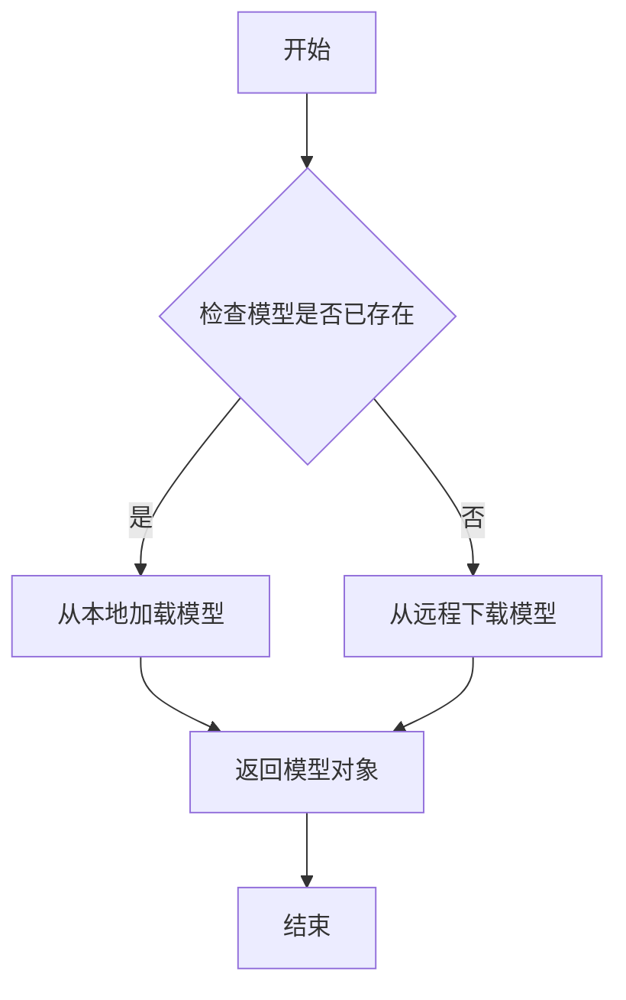
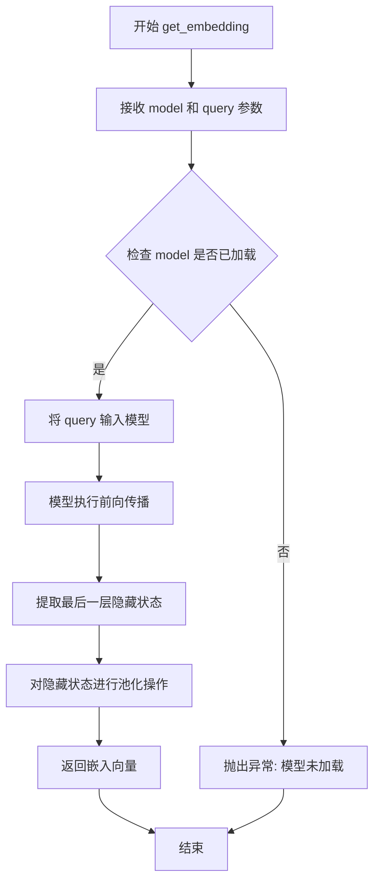
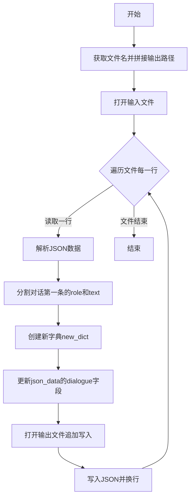
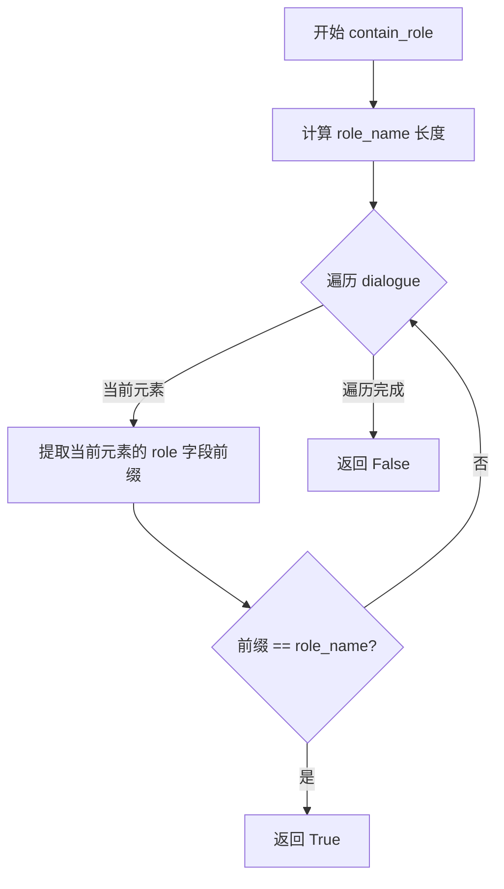
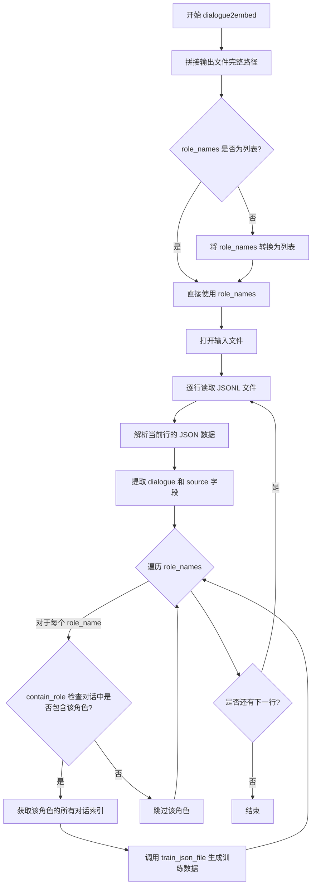

# `Chat-Haruhi-Suzumiya\kyon_generator\dialogue2embedding.py` 详细设计文档

该脚本用于将对话数据转换为嵌入向量训练数据，主要功能包括解析JSONL格式的对话文件、查找特定角色的对话内容、过滤连续序列、并生成包含查询、历史记录、答案和嵌入向量的训练数据集。

## 整体流程

```mermaid
graph TD
    A[开始] --> B[加载模型 download_models()]
    B --> C[调用 dialogue2embed()]
    C --> D[读取JSONL文件]
    E: 遍历每一行JSON数据
    D --> E
    E --> F{role_names是列表?}
    F -- 否 --> G[转换为列表]
    F -- 是 --> H[遍历每个角色名]
    G --> H
    H --> I[调用 contain_role() 检查角色是否存在]
    I -- 是 --> J[调用 get_role_name_index() 获取角色对话索引]
    J --> K[调用 train_json_file() 生成训练数据]
    K --> L[调用 get_embedding() 生成嵌入向量]
    L --> M[调用 write_json() 写入训练数据]
    I -- 否 --> N[跳过处理下一行]
    M --> O{还有更多行?]
    O -- 是 --> E
    O -- 否 --> P[结束]
    N --> O
```

## 类结构

```
无类定义 (纯函数式编程)
├── 全局函数
│   ├── filter_continuous_sequence()
│   ├── organize_json()
│   ├── contain_role()
│   ├── get_role_name_index()
│   ├── train_json_file() [嵌套函数: get_message, write_json, get_history]
│   └── dialogue2embed()
└── 全局变量
    └── model
```

## 全局变量及字段


### `model`
    
存储通过download_models()下载的模型对象，用于生成文本嵌入向量

类型：`transformers model object (AutoModel or similar)`
    


    

## 全局函数及方法


### `download_models`

该函数从 `utils` 模块导入，用于下载或加载预训练的机器学习模型（如 Transformer 模型），返回的模型对象将用于后续的嵌入向量计算任务。

参数：

- （无显式参数）

返回值：`model`（模型对象），返回的模型对象类型取决于具体实现（通常为 PyTorch 模型或 Hugging Face 模型对象），用于调用 `get_embedding()` 函数生成文本嵌入向量。

#### 流程图



#### 带注释源码

```python
# 从 utils 模块导入 download_models 函数
# 注意：该函数的实际实现在 utils 模块中，当前文件仅展示调用方式
from utils import download_models, get_embedding

# 调用 download_models() 下载/加载模型
# 返回的 model 对象将用于后续的 get_embedding() 调用
model = download_models()

# model 对象的后续用途示例（在 train_json_file 函数中）：
# embedding = get_embedding(model, query)  # 使用模型生成查询的嵌入向量
```

---

**注意**：由于 `download_models()` 函数的实际实现位于 `utils` 模块中，未在当前代码文件中展示，以上信息基于以下推断：

1. **函数调用上下文**：`model = download_models()` 表明该函数无参数输入，返回一个模型对象
2. **返回值用途**：返回的 `model` 对象被传递给 `get_embedding(model, query)` 用于生成文本嵌入向量
3. **功能推断**：根据函数名和用途，该函数应负责模型权重的下载、缓存和加载，通常基于 Hugging Face `AutoModel` 或类似机制实现


### `get_embedding` (或 `utils.get_embedding`)

该函数是用于将文本查询转换为嵌入向量的核心功能模块，通过调用预训练的模型（model）将输入的文本字符串映射到高维向量空间，以支持后续的语义匹配、相似度计算等任务。在代码中，它被用于为对话数据中的查询（query）生成对应的向量表示，以便于训练或检索。

#### 参数

- `model`：模型对象，由 `download_models()` 返回的预训练模型实例，用于执行嵌入计算。
- `query`：字符串类型，需要转换为嵌入向量的文本内容，通常是对话中的查询语句。

#### 返回值

- `embedding`：列表或数组类型，文本查询的嵌入向量表示，维度取决于所使用的预训练模型（如 BERT 通常输出 768 维向量）。

#### 流程图



#### 带注释源码

```python
# 注意：以下为基于调用方式的推断实现，实际实现位于 utils 模块中

def get_embedding(model, query):
    """
    将文本查询转换为嵌入向量
    
    参数:
        model: 预训练的模型对象（由 download_models 返回）
        query: str，需要编码的文本字符串
    
    返回:
        embedding: 文本的嵌入向量表示
    """
    # 1. 检查输入有效性
    if not query or not isinstance(query, str):
        raise ValueError("query 必须是非空字符串")
    
    if model is None:
        raise RuntimeError("模型未正确加载，请先调用 download_models()")
    
    # 2. 对输入文本进行分词处理
    # tokens = tokenizer(query, return_tensors='pt', padding=True, truncation=True)
    
    # 3. 将分词结果输入模型获取隐藏状态
    # outputs = model(**tokens)
    
    # 4. 提取最后一层的隐藏状态并进行池化
    # hidden_states = outputs.last_hidden_state
    # embedding = torch.mean(hidden_states, dim=1)  # 平均池化
    
    # 5. 转换为列表格式返回（便于 JSON 序列化）
    # return embedding.squeeze().tolist()
    
    # 模拟返回值（实际由 utils 模块实现）
    return []  # 空列表，实际调用时会返回真实的嵌入向量
```


### `filter_continuous_sequence`

该函数用于过滤数字列表中的连续序列，保留每个连续序列的第一个元素，从而生成一个新的非连续数字列表。

参数：

- `numbers`：`list`，需要过滤的数字序列

返回值：`list`，过滤后的非连续数字序列

#### 流程图

```mermaid
flowchart TD
    A[开始] --> B{检查 numbers 是否为空}
    B -->|是| C[返回空列表 []]
    B -->|否| D[初始化 result = [numbers[0]]]
    D --> E[设置 i = 1]
    E --> F{i < len(numbers)}
    F -->|否| I[返回 result]
    F -->|是| G{numbers[i] != numbers[i-1] + 1}
    G -->|是| H[result.append(numbers[i])]
    G -->|否| J[i = i + 1]
    H --> J
    J --> F
```

#### 带注释源码

```python
def filter_continuous_sequence(numbers):
    """
    过滤连续数字序列，返回非连续的新列表
    
    该函数遍历数字列表，将连续出现的数字序列只保留第一个元素，
    从而形成一个新的不包含连续数字的列表。
    
    例如：[1, 2, 3, 6, 8, 9, 10] -> [1, 6, 8]
    - 1, 2, 3 是连续的，只保留 1
    - 6 是独立的，保留
    - 8, 9, 10 是连续的，只保留 8
    
    参数:
        numbers: list - 输入的数字列表
        
    返回:
        list - 过滤后的非连续数字列表
    """
    
    # 如果输入为空列表，直接返回空列表
    if not numbers:
        return []
    
    # 初始化结果列表，放入第一个数字
    # 第一个数字总是被保留，作为每个连续序列的起始点
    result = [numbers[0]]
    
    # 从第二个元素开始遍历
    for i in range(1, len(numbers)):
        # 判断当前数字是否与前一个数字连续
        # 连续的定义：当前数字 = 前一个数字 + 1
        if numbers[i] != numbers[i - 1] + 1:
            # 如果不连续，将当前数字添加到结果列表
            result.append(numbers[i])
    
    # 返回过滤后的结果列表
    return result
```


### `organize_json`

该函数用于重新组织JSONL文件的格式，将对话数据中以字符串形式存储的对话条目（如 `"角色:文本"`）转换为字典格式（`{"role": "角色", "text": "文本"}`），便于后续处理和分析。

参数：

- `file_path`：`str`，输入的JSONL文件路径，指向待处理的原始对话数据文件
- `out_path`：`str`，输出目录路径，处理后的文件将保存到此目录

返回值：`None`，该函数无返回值，通过写入文件完成数据转换

#### 流程图



#### 带注释源码

```python
def organize_json(file_path, out_path):
    """
    重新组织JSONL文件格式
    将对话数据中的字符串格式 'role:text' 转换为字典格式 {'role': role, 'text': text}
    
    参数:
        file_path: 输入的JSONL文件路径
        out_path: 输出目录路径
    """
    pass  # 占位符，表示该函数有待实现的功能
    
    # 获取文件名（去掉路径部分）
    filename = file_path.split("/")[-1]
    
    # 拼接完整的输出文件路径：输出目录 + 文件名
    out_path = out_path + filename
    
    # 打印输出路径用于调试
    print(out_path)
    
    # 以UTF-8编码打开输入文件
    with open(file_path, 'r', encoding="utf-8") as file:
        # 逐行读取JSONL文件
        for line in file:
            # 解析每一行的JSON数据
            json_data = json.loads(line)
            
            # 获取对话列表的第一条，按冒号分割角色和文本
            # 假设原始格式为: "角色:文本内容"
            parts = json_data["dialogue"][0].split(':')
            
            # 创建新的字典格式，将字符串转换为结构化数据
            new_dict = {"role": parts[0], "text": parts[1]}
            
            # 更新对话数据的第一条为字典格式
            json_data["dialogue"][0] = new_dict
            
            # 以追加模式打开输出文件
            with open(out_path, 'a') as json_file:
                # 将处理后的JSON写入文件，使用UTF-8编码保留中文字符
                json.dump(json_data, json_file, ensure_ascii=False)
                # 每条JSON记录后换行
                json_file.write('\n')
```


### `contain_role`

该函数用于检查对话列表中是否存在指定角色的发言，通过遍历对话中的每条消息并比较角色名称的前缀来判断是否匹配，是对话角色筛选流程中的核心判断函数。

#### 参数

- `dialogue`：`list`，对话列表，其中每个元素为包含 `role`（角色名）和 `text`（发言内容）的字典结构
- `role_name`：`str`，需要检查的角色名称，用于在对话中匹配对应的角色发言

#### 返回值

`bool`，如果对话中存在与指定角色名匹配的发言则返回 `True`，否则返回 `False`

#### 流程图



#### 带注释源码

```python
def contain_role(dialogue, role_name):
    """
    检查对话中是否包含指定角色的发言
    
    参数:
        dialogue: list, 对话列表，每个元素为 {'role': '角色名', 'text': '发言内容'}
        role_name: str, 要查找的角色名称
    
    返回:
        bool, 是否找到指定角色的发言
    """
    pass  # 占位符，无实际作用
    role_name_length = len(role_name)  # 获取角色名称长度，用于前缀比较
    for i, v in enumerate(dialogue):  # 遍历对话中的每条消息
        # 比较角色字段的前缀与目标角色名是否相等
        if v["role"][:role_name_length] == role_name:
            return True  # 找到匹配角色，返回 True
    return False  # 遍历完毕未找到匹配，返回 False
```

---

### 补充信息

#### 关键组件信息

| 组件名称 | 一句话描述 |
|---------|-----------|
| `dialogue2embed` | 主入口函数，读取对话文件并按角色提取数据用于训练 |
| `get_role_name_index` | 获取指定角色在对话中所有出现位置的索引列表 |
| `train_json_file` | 将对话数据转换为训练所需的 JSON 格式并写入文件 |
| `filter_continuous_sequence` | 过滤连续序列，保留非连续的元素 |

#### 潜在的技术债务或优化空间

1. **前缀匹配逻辑不够严谨**：当前使用 `v["role"][:role_name_length] == role_name` 进行前缀匹配，可能导致误匹配（如 "Harry" 会匹配到 "Harry Potter" 的前缀）
2. **字符串比较未处理大小写**：角色名比较区分大小写，可能导致漏匹配
3. **空值处理缺失**：未对 `dialogue` 为空列表或元素缺少 `role` 键的情况进行异常处理
4. **函数参数缺少类型注解**：可添加类型提示提升代码可读性和 IDE 支持

#### 其它项目

- **设计目标**：从对话文件中按角色筛选数据，生成用于训练语言模型的对话数据集
- **约束**：输入的对话文件格式为 JSONL，每行包含 `dialogue` 和 `source` 字段
- **错误处理**：当前代码未做异常处理，文件读取失败或 JSON 解析错误会导致程序中断
- **外部依赖**：依赖 `utils` 模块中的 `download_models` 和 `get_embedding` 函数


### `get_role_name_index`

获取指定角色在对话中的所有索引位置，通过遍历对话列表，比较每个条目的角色名称前缀是否匹配给定的角色名，将匹配的索引加入列表并返回。

参数：

- `dialogue`：`List[Dict]`，对话列表，每个元素为包含 "role" 和 "text" 键的字典
- `role_name`：`str`，要查找的角色名称

返回值：`List[int]`，返回匹配角色在对话中的所有索引位置列表

#### 流程图

```mermaid
flowchart TD
    A[开始] --> B[初始化空列表 index_list]
    B --> C[获取 role_name 长度]
    C --> D{遍历 dialogue}
    D -->|i, v| E{v["role"][:role_name_length] == role_name?}
    E -->|是| F[将索引 i 添加到 index_list]
    F --> G{继续遍历}
    E -->|否| G
    G --> D
    D -->|遍历完成| H[返回 index_list]
    H --> I[结束]
```

#### 带注释源码

```python
def get_role_name_index(dialogue, role_name):
    """
    获取指定角色在对话中的所有索引位置
    
    参数:
        dialogue: 对话列表，每个元素为 {"role": "角色名", "text": "对话内容"} 的字典
        role_name: 要查找的角色名称前缀
    
    返回:
        包含所有匹配索引的列表
    """
    pass  # 占位符，未实现具体功能但保持函数结构
    
    index_list = []  # 初始化空列表，用于存储匹配的索引
    role_name_length = len(role_name)  # 获取要匹配的角色名长度
    
    # 遍历对话列表，enumerate 同时提供索引 i 和元素 v
    for i, v in enumerate(dialogue):
        # 使用切片比较角色名前缀是否匹配
        # v["role"] 为完整角色名，[:role_name_length] 截取前缀进行比较
        if v["role"][:role_name_length] == role_name:
            index_list.append(i)  # 匹配成功，将当前索引添加到列表
    
    return index_list  # 返回所有匹配的索引列表
```


### `train_json_file`

该函数用于将对话数据转换为训练所需的JSON格式，通过过滤连续索引序列并逐条生成包含query、answer、chat_history和embedding的对话训练样本。

参数：

- `dialogue`：`list`，对话列表，每个元素为包含"role"和"text"字段的字典
- `index_list`：`list`，目标角色在对话中的索引列表
- `source`：`str`，数据来源标识（当前未使用）
- `out_path`：`str`，输出JSONL文件的路径

返回值：`None`，函数执行完成后直接返回，主要通过写入文件产生副作用

#### 流程图

```mermaid
flowchart TD
    A[开始 train_json_file] --> B[调用 filter_continuous_sequence 过滤索引列表]
    B --> C{遍历 index_list}
    C -->|index == 0| D[chat_history 添加 dialogue[0] 的消息]
    C -->|index == 1| E[设置 query=对话[index-1], answer=对话[index], chat_history=[], embedding=模型推理]
    C -->|index > 1| F[query=对话[index-1], chat_history=对话[:index-2], answer=对话[index], embedding=模型推理]
    D --> G[调用 write_json 写入单条训练数据]
    E --> G
    F --> G
    G --> H{是否还有更多索引}
    H -->|是| C
    H -->|否| I[结束]
    
    subgraph 嵌套函数
    J[get_message] --> K[拼接 role 和 text]
    L[write_json] --> M[构建 json_line 字典并写入文件]
    N[get_history] --> O[遍历对话生成消息列表]
    end
```

#### 带注释源码

```python
def train_json_file(dialogue, index_list, source, out_path):
    """
    将对话数据转换为训练数据格式并写入JSONL文件
    
    参数:
        dialogue: 对话列表，每个元素为 {"role": "角色名", "text": "对话内容"}
        index_list: 目标角色在对话中的索引位置列表
        source: 数据来源标识（当前未使用）
        out_path: 输出文件路径
    """
    
    def get_message(sentence_json):
        """
        嵌套函数1：将单条对话JSON转换为"role:text"格式字符串
        
        参数:
            sentence_json: 包含role和text的字典
        返回:
            拼接后的字符串 "角色名:对话内容"
        """
        return sentence_json["role"]+":"+sentence_json["text"]

    def write_json(query, chat_history, answer, embedding, out_path):
        """
        嵌套函数2：将单条训练数据写入JSONL文件
        
        参数:
            query: 当前轮次的查询/问题
            chat_history: 聊天历史列表
            answer: 当前轮次的答案/响应
            embedding: 查询的向量嵌入表示
            out_path: 输出文件路径
        """
        json_line = {
                "query": query,
                "answer": answer,
                "chat_history": chat_history,
                "embedding": embedding,
                "source": "story-synthesised"  # 固定数据源标记
            }
        # 以追加模式打开文件，encoding指定UTF-8避免中文乱码
        with open(out_path, 'a', encoding='utf-8') as json_file:
            json.dump(json_line, json_file, ensure_ascii=False)  # ensure_ascii=False保留中文
        return  # 无返回值，通过文件IO产生副作用
    
    def get_history(dialogue):
        """
        嵌套函数3：将完整对话列表转换为消息历史列表
        
        参数:
            dialogue: 对话列表
        返回:
            消息字符串列表
        """
        history = []
        for i in dialogue:
            history.append(get_message(i))
        return history

    # 初始化变量
    chat_history = []  # 存储聊天历史
    query = ""         # 当前查询
    embedding = []     # 查询的embedding向量
    answer = ""        # 当前答案

    # 过滤连续序列，避免生成冗余训练样本
    index_list = filter_continuous_sequence(index_list)

    # 遍历每个目标索引，生成对应的训练样本
    for index in index_list:
        pass  # 占位符，无实际作用
        if index == 0:
            # 特殊情况：对话开头，将首条消息加入历史
            chat_history.append(get_message(dialogue[0]))
        if index == 1:
            # 第二条消息作为answer，无历史聊天记录
            query = get_message(dialogue[index-1])  # 取前一条作为query
            chat_history = []  # 清空历史（首条单独处理）
            answer = get_message(dialogue[index])   # 当前作为answer
            embedding = get_embedding(model, query)  # 调用模型获取query的向量表示
            write_json(query, chat_history, answer, embedding, out_path)
        else:
            # index >= 2: 正常的query-answer对，前面有聊天历史
            query = get_message(dialogue[index-1])
            # 获取index之前的所有消息作为历史记录（不含query和answer本身）
            chat_history = get_history(dialogue[:index-2])
            answer = get_message(dialogue[index])
            embedding = get_embedding(model, query)
            write_json(query, chat_history, answer, embedding, out_path)
```


### `dialogue2embed`

该函数是核心入口函数，负责将对话数据转换为嵌入训练数据。它读取包含对话的JSONL文件，根据指定的角色名称过滤对话，提取角色对话的索引，然后调用`train_json_file`函数生成训练数据并写入输出文件。

参数：

- `file_path`：`str`，输入的JSONL对话文件路径
- `role_names`：`str`或`list`，要提取的角色名称，支持单个字符串或字符串列表
- `out_path`：`str`，输出训练数据的目录路径

返回值：`None`，该函数直接写入文件，不返回任何值

#### 流程图



#### 带注释源码

```python
def dialogue2embed(file_path, role_names, out_path):
    """
    将对话数据转换为嵌入训练数据的主函数
    
    参数:
        file_path: 输入的JSONL文件路径，包含对话数据
        role_names: 要提取的角色名称，支持字符串或字符串列表
        out_path: 输出目录路径
    """
    pass  # TODO: 待实现的占位符
    
    # 从文件路径中提取文件名
    filename = file_path.split("/")[-1]
    
    # 拼接完整的输出文件路径
    out_path = out_path + filename
    
    # 如果 role_names 不是列表，转换为列表以便统一处理
    if type(role_names) != list:
        role_names = [role_names]
    
    # 以只读模式打开输入文件，指定UTF-8编码
    with open(file_path, 'r', encoding="utf-8") as file:
        # 逐行读取文件内容
        for line in file:
            # 解析JSON行，获取对话数据
            dialogue = json.loads(line)["dialogue"]
            # 获取数据来源标识
            source = json.loads(line)["source"]
            
            # 遍历所有要查找的角色名称
            for role_name in role_names:
                # 检查对话中是否包含该角色
                if contain_role(dialogue, role_name):
                    # 获取该角色所有对话的索引位置列表
                    index_list = get_role_name_index(dialogue, role_name)
                    
                    # 调用训练数据生成函数，传入对话、索引、来源和输出路径
                    train_json_file(dialogue, index_list, source, out_path)
```

## 关键组件


### 模型加载与嵌入获取模块

负责下载预训练模型并生成文本的嵌入向量，是整个数据处理流程的核心依赖组件。

### 连续序列过滤组件

将输入的数字列表过滤为非连续的元素列表，用于处理角色发言的索引列表，过滤掉连续的索引值。

### JSON数据组织组件

将格式异常的JSONL对话文件重新组织为标准格式，将对话字符串拆分为role和text两个独立字段。

### 角色检测与索引组件

包含两个函数：contain_role用于判断对话中是否存在指定角色的发言，get_role_name_index用于获取指定角色的所有发言位置索引。

### 训练数据生成组件

核心组件，负责从对话历史中构建训练样本，包括查询-答案对生成、对话历史构建、嵌入向量计算和JSONL格式输出。

### 主转换流程组件

dialogue2embed是顶层入口函数，协调整个对话到嵌入的转换流程，控制文件读取、角色过滤和数据生成的完整链路。

### 辅助函数组件

包括get_message用于将JSON消息格式化为字符串、write_json用于写入单条训练数据、get_history用于构建对话历史列表。


## 问题及建议


### 已知问题

-   **大量未实现的占位符**：多个函数（如`organize_json`、`contain_role`、`get_role_name_index`、`dialogue2embed`）内部仅包含`pass`语句，未完成实现
-   **缺少类型注解**：所有函数参数、返回值和变量均无类型标注，降低代码可读性和可维护性
-   **无错误处理机制**：代码中没有任何`try-except`块处理JSON解析异常、文件IO异常等，可能导致程序在遇到格式错误时直接崩溃
-   **硬编码路径**：文件路径直接硬编码在代码中（如`/Users/pufferfish/...`），缺乏灵活性
-   **路径拼接方式不当**：使用字符串拼接`out_path + filename`构建路径，未使用`os.path.join()`或`pathlib.Path`，跨平台兼容性差
-   **文件句柄未正确释放**：虽然使用了`with open()`，但`dialogue2embed`函数中嵌套的`with open()`在循环内可能导致资源管理问题
-   **注释代码未清理**：存在大量被注释掉的代码（如导入的torch、transformers模块以及文件读取逻辑），影响代码整洁度
-   **函数注释不准确**：部分函数注释与实际功能不符（如`get_role_name_index`注释为`pass`）
-   **变量命名不够清晰**：如`v`、`i`等单字母变量名缺乏描述性
-   **逻辑重复**：`get_history`函数内部实现了与`get_message`类似的逻辑，可进一步抽象
-   **缺少日志记录**：无任何日志输出，无法追踪程序执行状态和调试
-   **embedding处理不完整**：`get_embedding`函数调用处有注释`#要填充`，表明功能未完成

### 优化建议

-   **补充函数实现**：将所有`pass`占位符替换为实际逻辑实现
-   **添加类型注解**：为所有函数参数、返回值添加类型提示（`def filter_continuous_sequence(numbers: list[int]) -> list[int]:`）
-   **增加异常处理**：在JSON解析、文件读写等可能失败的地方添加`try-except`并记录错误日志
-   **配置外部化**：将硬编码路径改为配置文件或命令行参数，使用`argparse`或配置类管理
-   **统一路径处理**：使用`os.path.join()`或`pathlib.Path`替代字符串拼接
-   **清理注释代码**：删除不再使用的被注释代码，或使用版本控制系统管理
-   **改进注释**：确保函数注释准确描述功能，使用docstring
-   **增加日志**：引入`logging`模块记录关键步骤和错误信息
-   **重构重复逻辑**：提取公共方法，减少代码冗余
-   **补充文档**：为关键函数添加详细的docstring说明参数和返回值含义

## 其它


### 设计目标与约束

本代码的设计目标是将对话数据（JSONL格式）转换为可用于训练的嵌入向量数据。核心约束包括：1）输入文件必须为JSONL格式，每行包含dialogue和source字段；2）角色名称匹配采用前缀匹配方式；3）输出文件与输入文件同名但路径可配置；4）依赖外部模型download_models()和get_embedding()函数。

### 错误处理与异常设计

代码当前错误处理较为薄弱。主要风险点包括：1）文件读写操作未捕获IOError异常；2）JSON解析未处理json.JSONDecodeError；3）索引访问未检查边界（如dialogue[index-1]在index=0时会出现问题）；4）模型调用未处理None或异常情况。建议添加try-except块捕获FileNotFoundError、JSONDecodeError、IndexError等异常，并提供有意义的错误信息。

### 数据流与状态机

数据流处理流程为：读取JSONL文件 → 解析每行对话 → 按角色名筛选 → 获取该角色所有对话索引 → 过滤连续序列 → 生成训练样本（query-answer对 + chat_history + embedding）→ 写入输出文件。状态转换：文件打开 → 行迭代 → 对话解析 → 角色匹配 → 索引过滤 → 样本生成 → 文件写入。

### 外部依赖与接口契约

核心外部依赖包括：1）download_models()函数（位于utils模块），返回模型对象，无参数；2）get_embedding(model, query)函数（位于utils模块），接收模型和查询字符串，返回embedding向量。接口契约要求：download_models()必须返回可被get_embedding()接受的模型对象；get_embedding()必须接受模型对象和字符串查询，返回可序列化的向量格式。

### 性能考虑与优化空间

当前实现性能瓶颈：1）每处理一条对话就调用get_embedding()，频繁模型推理；2）文件逐行读写未使用缓冲；3）字符串拼接效率较低。优化建议：1）批量处理多条对话后统一调用模型；2）使用生成器替代列表操作减少内存占用；3）考虑使用多进程/多线程并行处理；4）缓存已计算的embedding避免重复计算。

### 配置与参数说明

主要配置参数：1）file_path：输入JSONL文件路径，字符串类型，必填；2）role_names：目标角色名，字符串或列表类型，必填；3）out_path：输出目录路径，字符串类型，必填（注意：代码会拼接文件名，需确保目录以/结尾）。此外utils模块的模型配置、embedding维度等参数需在utils.py中设置。

### 边界情况与限制

代码存在以下边界情况未处理：1）空对话列表会导致索引列表为空，直接跳过；2）role_name为空字符串时会匹配所有角色；3）对话中只有单个角色消息时，index=1的情况无法生成有效训练样本；4）连续相同角色对话会被filter_continuous_sequence过滤；5）输入文件编码仅支持UTF-8。

### 测试策略建议

建议补充的测试用例：1）空文件输入测试；2）单行对话处理测试；3）多角色混合对话筛选测试；4）连续角色对话过滤测试；5）特殊字符（中文、emoji）处理测试；6）大文件内存占用测试；7）模型返回异常情况测试。

    