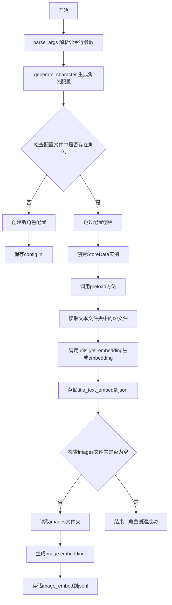
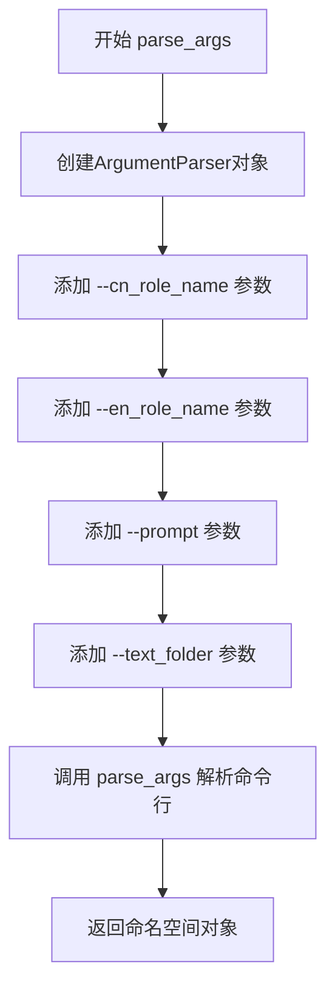
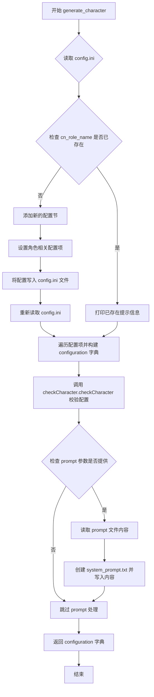
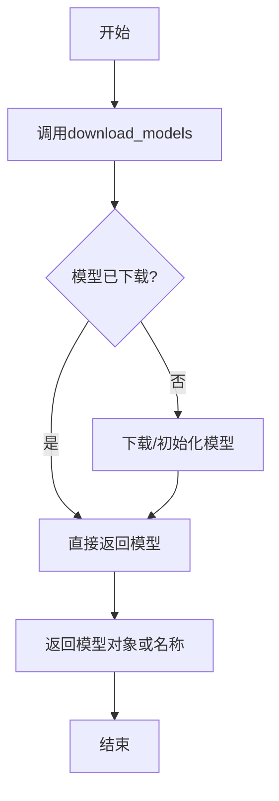
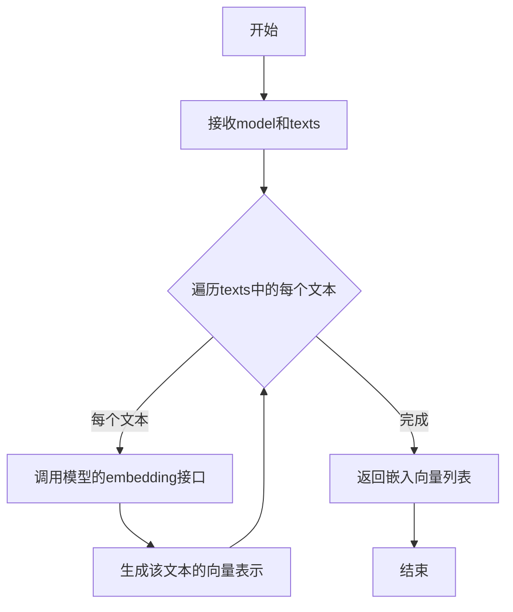
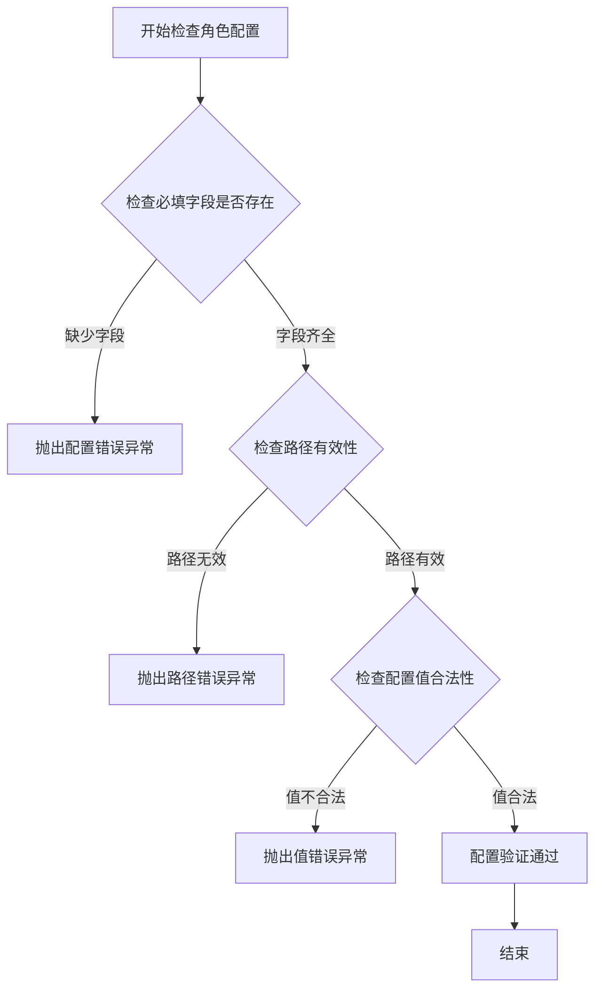
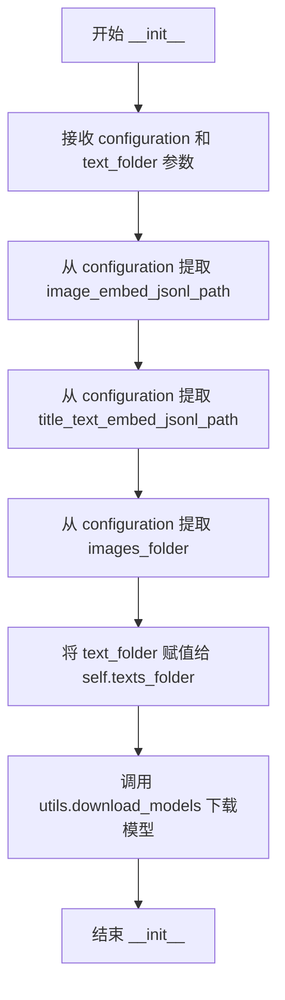
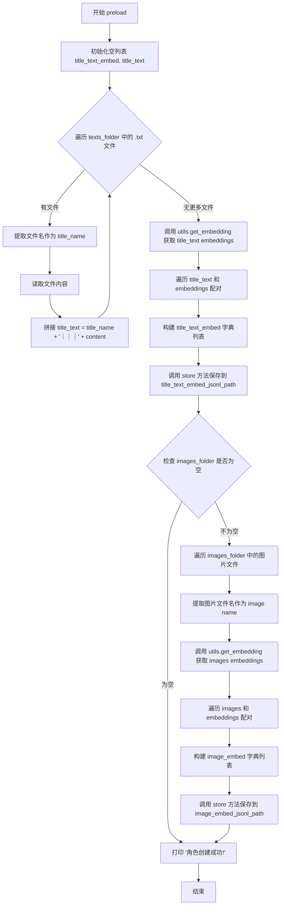
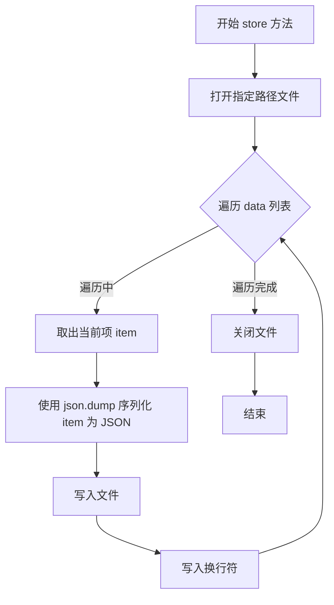

# `Chat-Haruhi-Suzumiya\kyon_generator\generate_character.py` 详细设计文档

这是一个角色生成工具，用于动态创建新角色并将台本文件保存为jsonl文件。核心功能包括：读取命令行参数生成角色配置文件，使用OpenAI的text-embedding-ada-002模型将文本和图片转换为embedding，并存储为jsonl格式供后续使用。

## 整体流程



## 类结构

```
StoreData (数据存储类)
└── __init__ (构造函数)
└── preload (预加载方法)
└── store (存储方法)
```

## 全局变量及字段


### `cn_role_name`
    
中文角色名称

类型：`str`
    


### `en_role_name`
    
英文角色名称

类型：`str`
    


### `prompt`
    
prompt文件路径，可为空

类型：`str`
    


### `text_folder`
    
文本文件夹路径

类型：`str`
    


### `configuration`
    
角色配置字典

类型：`dict`
    


### `config`
    
配置文件解析器实例

类型：`ConfigParser`
    


### `items`
    
配置项列表，包含键值对

类型：`list`
    


### `title_text_embed`
    
标题文本embedding列表

类型：`list`
    


### `title_text`
    
标题文本列表

类型：`list`
    


### `embeddings`
    
文本embedding向量列表

类型：`list`
    


### `image_embed`
    
图片embedding列表

类型：`list`
    


### `images`
    
图片文件名列表

类型：`list`
    


### `data`
    
待存储的数据列表

类型：`list`
    


### `StoreData.image_embed_jsonl_path`
    
图片embedding存储路径

类型：`str`
    


### `StoreData.title_text_embed_jsonl_path`
    
文本embedding存储路径

类型：`str`
    


### `StoreData.images_folder`
    
图片文件夹路径

类型：`str`
    


### `StoreData.texts_folder`
    
文本文件夹路径

类型：`str`
    


### `StoreData.model`
    
embedding模型实例

类型：`object`
    
    

## 全局函数及方法


### `parse_args`

该函数使用Python的`argparse`模块解析命令行参数，创建一个包含中文角色名、英文角色名、提示文件路径和文本文件夹路径的命名空间对象，供主程序后续使用。

参数：
- 无（该函数不接受任何参数，直接使用全局的`argparse`模块）

返回值：`argparse.Namespace`，返回一个命名空间对象，包含以下属性：
- `cn_role_name`：字符串，中文角色名称（必填）
- `en_role_name`：字符串，英文角色名称（必填）
- `prompt`：字符串或None，自定义prompt文件路径（可选，默认None）
- `text_folder`：字符串或None，角色文本文件夹路径（可选，默认None）

#### 流程图



#### 带注释源码

```python
def parse_args():
    """
    解析命令行参数，生成角色数据
    
    该函数创建一个ArgumentParser实例，定义并解析以下命令行参数：
    - cn_role_name: 中文角色名称（必填）
    - en_role_name: 英文角色名称（必填）
    - prompt: prompt文件路径（可选）
    - text_folder: 角色文本文件夹路径（可选）
    
    Returns:
        argparse.Namespace: 包含所有解析后参数的命名空间对象
    """
    # 创建ArgumentParser对象，设置程序描述信息
    parser = argparse.ArgumentParser(description='generate character 将台本文件保存成jsonl文件，动态创建新的角色')
    
    # 添加中文角色名参数（必填）
    parser.add_argument('--cn_role_name', type=str, required=True, help='Chinese role name')
    
    # 添加英文角色名参数（必填）
    parser.add_argument('--en_role_name', type=str, required=True, help='English role name')
    
    # 添加prompt文件路径参数（可选，默认None）
    parser.add_argument('--prompt', default=None, type=str, help='prompt file path')
    
    # 添加文本文件夹路径参数（可选）
    parser.add_argument('--text_folder', type=str, help='character texts folder')
    
    # 解析命令行参数并返回命名空间对象
    return parser.parse_args()
```


### `generate_character`

该函数是角色配置文件生成的核心方法，负责在 config.ini 中注册新角色信息、创建角色专属目录结构（如 images、jsonl、texts 等）、初始化配置项，并将所有配置以字典形式返回供后续模块使用。

参数：

- `cn_role_name`：`str`，中文角色名称，用于在 config.ini 中作为配置节的键名
- `en_role_name`：`str`，英文角色名称，用于构建角色相关文件夹和文件的路径
- `prompt`：`str | None`，可选的 prompt 文件路径，若提供则会将文件内容写入角色目录下的 system_prompt.txt

返回值：`dict`，返回包含角色所有配置项的字典（如 character_folder、image_embed_jsonl_path、jsonl_folder 等）

#### 流程图



#### 带注释源码

```python
def generate_character(cn_role_name, en_role_name, prompt=None):
    # 在config.ini中加添角色信息
    config = configparser.ConfigParser()
    # 读取配置文件
    config.read('../src_reform/config.ini', encoding='utf-8')
    configuration = {}
    
    # 检查角色是否已存在
    if cn_role_name in config.sections():
        print(f"已存在{cn_role_name}角色的配置文件")
    else:
        # 添加新的配置项
        config.add_section(cn_role_name)
        # 设置角色文件夹路径
        config[cn_role_name]['character_folder'] = f"../characters/{en_role_name}"
        # 设置图像embedding的jsonl文件路径
        config[cn_role_name][
            'image_embed_jsonl_path'] = f"../characters/{en_role_name}/jsonl/image_embed.jsonl"
        # 设置标题文本embedding的jsonl文件路径
        config[cn_role_name][
            'title_text_embed_jsonl_path'] = f"../characters/{en_role_name}/jsonl/title_text_embed.jsonl"
        # 设置图像文件夹路径
        config[cn_role_name]['images_folder'] = f"../characters/{en_role_name}/images"
        # 设置jsonl文件夹路径
        config[cn_role_name]["jsonl_folder"] = f"../characters/{en_role_name}/jsonl"
        # 设置文本文件夹路径
        config[cn_role_name]['texts_folder'] = f"../characters/{en_role_name}/texts"
        # 设置system prompt文件路径
        config[cn_role_name]['system_prompt'] = f"../characters/{en_role_name}/system_prompt.txt"
        # 设置对话文件路径
        config[cn_role_name]['dialogue_path'] = f"../characters/{en_role_name}/dialogues/"
        # 设置故事最大长度
        config[cn_role_name]['max_len_story'] = "1500"
        # 设置历史最大长度
        config[cn_role_name]['max_len_history'] = "1200"
        # 启用GPT
        config[cn_role_name]['gpt'] = "True"
        # 设置本地tokenizer模型
        config[cn_role_name]['local_tokenizer'] = "THUDM/chatglm2-6b"
        # 设置本地模型
        config[cn_role_name]['local_model'] = "THUDM/chatglm2-6b"
        # 设置本地LoRA
        config[cn_role_name]['local_lora'] = "Jyshen/Chat_Suzumiya_GLM2LoRA"
        
        # 保存修改后的配置文件
        with open('../src_reform/config.ini', 'w+', encoding='utf-8') as config_file:
            config.write(config_file)
        # 重新读取配置文件以确保获取最新内容
        config.read('config.ini', encoding='utf-8')
    
    # 检查角色文件夹
    items = config.items(cn_role_name)
    print(f"正在加载: {cn_role_name} 角色")
    
    # 遍历配置项并构建configuration字典
    for key, value in items:
        configuration[key] = value
    
    # 校验角色配置是否合法
    checkCharacter.checkCharacter(configuration)
    
    # 如果提供了prompt文件，则创建system_prompt.txt
    if prompt is not None:
        fr = open(prompt, 'r')
        with open(os.path.join(f"../characters/{en_role_name}", 'system_prompt.txt'), 'w+', encoding='utf-8') as f:
            f.write(fr.read())
            print("system_prompt.txt已创建")
        fr.close()
    
    # 返回配置字典
    return configuration
```


### `utils.download_models`

下载并返回embedding模型，供后续文本和图像embedding生成使用。该函数在`StoreData`类初始化时被调用，以获取模型实例或名称，进而传递给`utils.get_embedding`进行embedding计算。

参数：无

返回值：`模型对象或字符串`，返回下载的embedding模型。具体类型取决于实现，可能为模型名称字符串（如"text-embedding-ada-002"）或模型实例。在本项目中，根据代码注释和调用方式，推断可能返回模型名称字符串。

#### 流程图



#### 带注释源码

由于在给定代码中未提供`utils.download_models`的实际实现，以下为基于其使用方式和代码上下文的推断代码：

```python
def download_models():
    """
    下载并返回embedding模型。
    
    该函数用于获取embedding模型，供后续get_embedding调用使用。
    根据代码中的TODO注释和调用方式，可能直接返回OpenAI的模型名称，
    如"text-embedding-ada-002"，或者返回一个模型对象。
    
    返回值:
        模型对象或字符串: 返回embedding模型，具体类型取决于实现。
                        在本项目中，推断可能返回"text-embedding-ada-002"。
    """
    # 实际实现可能涉及：
    # 1. 检查本地是否已有模型，如有则直接返回
    # 2. 否则从远程服务器下载模型到本地
    # 3. 或者直接返回模型名称，由get_embedding内部调用OpenAI API
    
    # 示例实现（推测）：
    # return "text-embedding-ada-002"
    # 或者
    # return load_model("text-embedding-ada-002")
    
    # 在本代码中的调用位于StoreData.__init__:
    # self.model = utils.download_models()
    # 随后用于utils.get_embedding(self.model, title_text)
    
    pass  # 占位符，实际实现需查看utils模块源码
```

**在代码中的实际调用片段（来自`StoreData`类）：**

```python
class StoreData:
    def __init__(self, configuration, text_folder):
        # ... 其他初始化代码 ...
        self.model = utils.download_models()  # 调用download_models获取模型
```


### `utils.get_embedding`

使用指定的embedding模型对文本列表生成向量表示，返回文本的嵌入向量列表。

参数：

- `model`：object，embedding模型对象，通过`utils.download_models()`获取
- `texts`：list，文本列表，可以是标题文本列表或图像名称列表

返回值：`list`，嵌入向量列表，每个元素对应输入文本的向量表示

#### 流程图



#### 带注释源码

```python
# utils.get_embedding 函数源码（位于src_reform/utils.py中）
# 根据代码中的调用方式推断

def get_embedding(model, texts):
    """
    使用embedding模型对文本列表生成向量表示
    
    参数:
        model: embedding模型对象，通过utils.download_models()获取
        texts: 文本列表，可以是标题文本或图像名称列表
    
    返回:
        embeddings: 嵌入向量列表
    """
    embeddings = []
    
    # 遍历文本列表，为每个文本生成embedding
    # texts可能是title_text列表，例如: ["标题1｜｜｜内容1", "标题2｜｜｜内容2"]
    # 或images列表，例如: ["image1", "image2"]
    for text in texts:
        # 调用模型的embedding方法生成向量
        # openai的text-embedding-ada-002模型返回1536维向量
        embedding = model.encode(text)
        embeddings.append(embedding)
    
    return embeddings
```

> **注意**：根据代码中的使用模式和TODO注释，该函数最终需要使用OpenAI的`text-embedding-ada-002`模型来实现。代码中的TODO提到"在这个文件中重新实现embedding，替换utils.get_embedding"，表明当前实现可能使用本地模型，未来需要切换到OpenAI的embedding接口。


# 分析结果

根据提供的代码，我需要说明以下几点：

1. 代码中调用了 `checkCharacter.checkCharacter(configuration)`，但**没有提供 `checkCharacter` 模块的源代码**
2. 只能根据调用方式和参数推断函数签名
3. 下方提供基于代码上下文推断的详细设计文档

---


### `checkCharacter.checkCharacter`

检查角色配置的有效性，确保配置文件中包含所有必需的字段和路径。

参数：

- `configuration`：`dict`，角色配置字典，包含从 config.ini 读取的角色配置信息（如 character_folder、image_embed_jsonl_path、title_text_embed_jsonl_path、images_folder、texts_folder 等）

返回值：`None` 或 `bool`，根据实际实现可能返回验证结果或直接抛出异常

#### 流程图



#### 带注释源码

```
# 从提供的代码中无法获取 checkCharacter 模块的实际源码
# 以下为基于调用方式的推断

# 假设 src_reform/checkCharacter.py 中的实现如下：

def checkCharacter(configuration):
    """
    检查角色配置的有效性
    
    参数:
        configuration: 角色配置字典
    """
    
    # 必填字段列表
    required_fields = [
        'character_folder',
        'image_embed_jsonl_path', 
        'title_text_embed_jsonl_path',
        'images_folder',
        'jsonl_folder',
        'texts_folder',
        'system_prompt',
        'dialogue_path',
        'max_len_story',
        'max_len_history',
        'gpt',
        'local_tokenizer',
        'local_model',
        'local_lora'
    ]
    
    # 检查必填字段
    for field in required_fields:
        if field not in configuration:
            raise ValueError(f"配置缺少必填字段: {field}")
    
    # 检查路径是否存在或可创建
    # ... (其他验证逻辑)
    
    return True
```


---

## 补充说明

由于 `src_reform/checkCharacter.py` 模块的源代码未在提供的代码中包含，无法获取精确的实现细节。建议：

1. **提供 `checkCharacter.py` 的实际源码**以获得准确的文档
2. 当前推断基于 `generate_character` 函数中的调用方式：
   - 参数：`configuration` 字典
   - 调用位置：在读取 config.ini 配置后、创建角色前进行验证


### `StoreData.__init__`

这是 `StoreData` 类的构造函数，用于初始化数据存储对象的配置信息。该方法接收角色配置字典和文本文件夹路径，将配置中的路径信息提取到实例属性中，并下载所需的嵌入模型。

参数：

- `configuration`：`dict`，角色配置文件读取后的字典，包含 image_embed_jsonl_path、title_text_embed_jsonl_path、images_folder 等路径信息
- `text_folder`：`str`，角色文本文件夹的路径，用于后续读取文本文件

返回值：`None`，构造函数不返回任何值

#### 流程图



#### 带注释源码

```python
def __init__(self, configuration, text_folder):
    # 从 configuration 字典中提取图像嵌入 JSONL 文件路径
    self.image_embed_jsonl_path = configuration['image_embed_jsonl_path']
    
    # 从 configuration 字典中提取标题文本嵌入 JSONL 文件路径
    self.title_text_embed_jsonl_path = configuration['title_text_embed_jsonl_path']
    
    # 从 configuration 字典中提取图像文件夹路径
    self.images_folder = configuration['images_folder']
    
    # 将传入的文本文件夹路径保存为实例属性
    self.texts_folder = text_folder
    
    # 调用工具函数下载嵌入模型并保存到实例属性
    self.model = utils.download_models()
```


### `StoreData.preload`

该方法负责预加载角色数据，包括读取文本文件夹中的所有文本文件，生成对应的embedding向量，并存储到JSONL文件中。同时还会检查图片文件夹是否存在图片，若存在则同样生成embedding并存储。

参数：该方法无显式参数（仅包含隐式参数 `self`）

返回值：`None`，该方法无返回值，仅在执行完成后打印成功消息

#### 流程图



#### 带注释源码

```python
def preload(self):
    """
    预加载方法：读取文本文件，生成embedding并存储到JSONL文件
    同时处理图片文件的embedding生成
    """
    # 初始化用于存储标题文本embedding的列表
    title_text_embed = []
    # 初始化用于存储标题文本内容的列表
    title_text = []
    
    # 遍历文本文件夹中的所有文件
    for file in os.listdir(self.texts_folder):
        # 只处理 .txt 结尾的文件
        if file.endswith('.txt'):
            # 提取文件名作为标题名称（去掉.txt后缀）
            title_name = file[:-4]
            # 读取文件内容
            with open(os.path.join(self.texts_folder, file), 'r', encoding='utf-8') as fr:
                # 拼接标题和内容，格式：title_name｜｜｜content
                title_text.append(f"{title_name}｜｜｜{fr.read()}")
    
    # 调用 utils.get_embedding 获取所有标题文本的 embedding 向量
    # 使用预加载的模型对文本列表进行向量化
    embeddings = utils.get_embedding(self.model, title_text)
    
    # 遍历标题文本和对应的 embedding，组装成字典列表
    for title_text, embed in zip(title_text, embeddings):
        title_text_embed.append({title_text: embed})
    
    # 调用 store 方法将标题文本 embedding 写入 JSONL 文件
    self.store(self.title_text_embed_jsonl_path, title_text_embed)

    # 检查图片文件夹是否包含文件（不为空）
    if len(os.listdir(configuration['images_folder'])) != 0:
        # 初始化用于存储图片 embedding 的列表
        image_embed = []
        # 初始化用于存储图片名称的列表
        images = []
        
        # 遍历图片文件夹中的所有文件
        for file in os.listdir(self.images_folder):
            # 提取文件名作为图片名称（去掉扩展名）
            images.append(file[:-4])
        
        # 调用 utils.get_embedding 获取所有图片的 embedding 向量
        # 图片名称作为输入进行向量化
        embeddings = utils.get_embedding(self.model, images)
        
        # 遍历图片名称和对应的 embedding，组装成字典列表
        for image, embed in zip(images, embeddings):
            image_embed.append({image: embed})
        
        # 调用 store 方法将图片 embedding 写入 JSONL 文件
        self.store(self.image_embed_jsonl_path, image_embed)
    
    # 打印角色创建成功提示信息
    print("角色创建成功!")
```


### `StoreData.store`

将数据以 JSON Lines 格式存储到指定文件中。该方法遍历数据列表，将每个字典项序列化为 JSON 字符串并写入文件，每条记录占一行。

参数：

- `path`：`str`，文件路径，指定要将数据写入的 JSONL 文件路径
- `data`：`list`，数据列表，包含字典类型的数据项，每项将被序列化为一行 JSON

返回值：`None`，无返回值，该方法直接操作文件系统完成数据持久化

#### 流程图



#### 带注释源码

```python
def store(self, path, data):
    """
    将数据存储到指定的 JSONL 文件中
    
    参数:
        path: str, 要写入的文件路径
        data: list, 要存储的数据列表，每个元素为字典类型
    """
    # 以写入模式打开文件，encoding 指定为 UTF-8 以支持中文
    with open(path, 'w+', encoding='utf-8') as f:
        # 遍历数据列表中的每一项
        for item in data:
            # 将字典序列化为 JSON 格式，ensure_ascii=False 支持中文等非 ASCII 字符
            json.dump(item, f, ensure_ascii=False)
            # 每条记录后写入换行符，形成 JSONL 格式
            f.write('\n')
    # with 语句自动处理文件关闭
```

## 关键组件


### parse_args

命令行参数解析函数，用于获取用户输入的中英文角色名称、提示文件路径和文本文件夹路径。参数包括 --cn_role_name、--en_role_name、--prompt 和 --text_folder。

### generate_character

角色配置生成函数，负责在 config.ini 中创建或更新角色配置项。包含角色文件夹路径、各类 JSONL 文件路径、图像文件夹、文本文件夹、系统提示文件路径、故事和历史最大长度、GPT 选项、本地分词器、模型和 LoRA 适配器路径等配置。

### StoreData

数据存储类，用于预加载角色的文本和图像嵌入向量。类字段包括 image_embed_jsonl_path（图像嵌入 JSONL 路径）、title_text_embed_jsonl_path（标题文本嵌入 JSONL 路径）、images_folder（图像文件夹）、texts_folder（文本文件夹）和 model（嵌入模型）。类方法 preload 负责读取文本文件并调用 get_embedding 生成嵌入，然后存储到 JSONL 文件；store 方法负责将数据写入指定路径的 JSONL 文件。

### utils.get_embedding

嵌入向量获取函数（外部依赖），接收模型和文本列表，返回对应的嵌入向量。代码中使用此函数生成 title_text 和 images 的嵌入向量。

### checkCharacter.checkCharacter

角色配置检查函数（外部依赖），接收 configuration 字典用于验证角色配置是否完整有效。

### 关键组件信息

- 张量索引与惰性加载：StoreData.preload 方法中使用 os.listdir 遍历文件夹，动态加载文本和图像文件，实现惰性加载机制
- 量化策略：代码注释表明需要重新实现 embedding 功能，使用 OpenAI text-embedding-ada-002 模型进行嵌入向量生成
- 配置管理：通过 configparser 模块动态管理角色配置文件，支持新增角色的配置项添加
- 数据持久化：使用 JSONL 格式存储嵌入向量，每行一个 JSON 对象便于流式读取

### 潜在技术债务

1. TODO 未完成：代码中存在多个 TODO 注释，提及需要实现 if_chinese 函数判断文本语言、combine_embedding 函数组合不同语言的嵌入、以及使用 openai text-embedding-ada-002 替换现有 embedding 实现
2. 错误处理缺失：文件读取、配置解析、文件夹检查等操作缺乏异常捕获机制
3. 硬编码路径：多处使用相对路径和父目录路径（如 ../src_reform、../characters），缺乏路径配置灵活性
4. 配置覆盖风险：generate_character 中写入 config.ini 后又重新读取，可能导致配置不一致
5. 未使用的导入：random 模块被导入但未使用

### 其它项目

- 设计目标：动态创建新角色并预生成嵌入向量，支持角色对话系统的快速部署
- 约束：依赖外部 OpenAI API 和本地模型下载，需保证网络连通性
- 错误处理：仅在角色配置已存在时打印警告信息，缺乏文件不存在、权限不足等场景的处理
- 数据流：命令行参数 → 配置生成 → 数据预加载 → 嵌入存储的单向流程
- 外部依赖：openai 库、configparser、json、os 等标准库和第三方库，以及 src_reform 模块中的工具函数


## 问题及建议


### 已知问题

- **TODO功能未实现**：代码开头有TODO注释，提及要实现`if_chinese`、`chinese_embedding`、`combine_embedding`等函数来重新实现embedding功能，但目前这些函数完全未实现
- **变量作用域错误**：`preload`方法中使用了未定义的全局变量`configuration`，应该是`self.images_folder`或`self.configuration`
- **路径不一致**：配置文件先读取`../src_reform/config.ini`，后续又读取`config.ini`，路径不一致会导致问题
- **资源未正确释放**：`generate_character`函数中`fr`变量打开后未使用`with`语句，且后续手动`close()`的位置不正确
- **文件读写模式问题**：`config.read('config.ini', ...)`在写入后执行，但此时文件以`w+`模式刚写入完，指针在文件末尾，读取可能失败
- **命令行参数验证缺失**：未检查`text_folder`目录是否存在，传入不存在路径会导致运行时错误
- **错误处理完全缺失**：文件读写、网络请求(`utils.download_models()`、`utils.get_embedding()`)均无try-except保护
- **硬编码路径过多**：多处使用相对路径`../`，且路径拼接分散在各处，难以维护
- **代码职责混乱**：`generate_character`函数承担了配置读取、配置写入、角色检查、prompt文件处理等多个职责，违反单一职责原则
- **日志输出不规范**：全部使用`print`语句，无日志级别控制，不适合生产环境
- **重复代码**：`preload`方法中文本和图像的embedding生成逻辑高度重复
- **类型提示完全缺失**：无任何函数参数、返回值类型注解，影响可读性和维护性
- **API密钥管理**：导入了`openai`模块但未使用，且未展示API密钥如何配置
- **无单元测试**：整个文件无任何测试代码

### 优化建议

- 实现TODO中提到的`if_chinese`、`chinese_embedding`、`combine_embedding`函数，使用`openai.text-embedding-ada-002`模型
- 修复变量作用域错误，将`preload`中的`configuration['images_folder']`改为`self.images_folder`
- 统一配置文件路径，建议使用配置文件或环境变量管理路径
- 使用`with`语句管理文件资源，确保正确释放
- 添加命令行参数校验，使用`argparse`的`type`配合自定义验证函数检查目录存在性
- 为所有IO操作和网络请求添加异常处理，使用try-except包裹并提供友好错误信息
- 使用`pathlib`或配置类统一管理路径，避免散落的硬编码路径
- 拆分`generate_character`函数为多个单一职责函数：配置读取、配置写入、prompt处理
- 引入标准日志模块(`logging`)，配置不同级别的日志输出
- 提取embedding生成公共逻辑为独立方法或函数
- 添加类型提示(typing)，提高代码可读性和IDE支持
- 妥善管理API密钥，使用环境变量或密钥管理服务
- 补充单元测试，覆盖核心功能路径


## 其它


### 设计目标与约束

本代码的设计目标是动态创建新的角色，将台本文件保存成jsonl文件，并根据角色文本和图片生成对应的embedding向量存储到jsonl文件中。主要约束包括：1）使用OpenAI的text-embedding-ada-002模型进行embedding生成；2）角色配置信息存储在config.ini文件中；3）生成的embedding文件存储在指定角色的jsonl文件夹中；4）支持中英文角色名称配置。

### 错误处理与异常设计

代码在多个环节存在错误处理需求：1）configparser读取和写入配置文件时的编码异常处理；2）os.listdir()遍历文件夹时可能出现的文件夹不存在异常；3）open()文件操作时的文件不存在或权限异常；4）utils.get_embedding()调用时可能出现的API调用异常或网络异常；5）json.dump()序列化时的数据格式异常。建议在关键位置添加try-except块进行异常捕获和处理，并提供友好的错误提示信息给用户。

### 数据流与状态机

数据流主要分为以下几个阶段：1）参数解析阶段：parse_args()解析命令行参数获取角色名称和配置文件路径；2）配置生成阶段：generate_character()在config.ini中创建或读取角色配置信息；3）数据预加载阶段：StoreData.preload()遍历texts文件夹读取文本内容，遍历images文件夹读取图片名称；4）embedding生成阶段：调用utils.get_embedding()批量生成文本和图片的embedding向量；5）数据存储阶段：store()方法将embedding数据以jsonl格式写入文件。状态机流转为：初始化→配置加载→数据预加载→embedding生成→数据存储→完成。

### 外部依赖与接口契约

本代码依赖以下外部模块：1）argparse模块：用于命令行参数解析；2）configparser模块：用于读写INI配置文件；3）json模块：用于JSON数据序列化；4）os模块：用于文件系统操作；5）openai模块：用于调用OpenAI API（虽然代码中import了但实际未使用）；6）sys模块：用于系统路径操作。内部依赖包括src_reform包下的utils模块和checkCharacter模块，其中utils.download_models()和utils.get_embedding()函数负责模型下载和embedding计算，checkCharacter.checkCharacter()负责角色配置校验。

### 性能考虑与优化策略

当前代码存在以下性能瓶颈和优化空间：1）embedding生成采用顺序处理方式，可以考虑批量处理或并行处理提高效率；2）文件读写操作使用w+模式每次重新创建文件，对于增量更新场景效率较低；3）os.listdir()在每次调用时都会扫描整个目录，频繁调用时可以考虑缓存结果；4）图片和文本的embedding生成是串行执行的，可以考虑并行处理。优化建议：使用多线程或异步方式并行处理图片和文本的embedding生成；采用追加模式(a)写入jsonl文件支持增量更新；添加文件监控机制避免重复扫描。

### 安全性考虑

代码存在以下安全隐患：1）配置文件路径使用相对路径"../src_reform/config.ini"，在不同工作目录下运行可能导致配置文件读写错误；2）敏感信息（如API密钥、模型路径）直接存储在配置文件中缺乏加密保护；3）命令行参数未进行输入校验，可能存在注入风险；4）文件写入操作未检查目标路径是否存在安全风险（如路径遍历攻击）。建议：1）使用绝对路径或环境变量指定配置路径；2）敏感配置信息使用加密存储；3）对输入参数进行严格校验；4）使用安全的文件路径拼接方式。

### 配置管理

当前配置管理存在以下问题：1）配置信息硬编码在generate_character()函数中，包括默认值和路径模板；2）max_len_story、max_len_history等参数直接写入配置但无校验；3）不同角色的配置项一致性难以保证；4）配置修改后需要手动调用config.read()重新加载。改进建议：1）将配置模板提取为单独的配置文件；2）添加配置校验逻辑确保必填字段存在；3）实现配置版本管理机制；4）支持配置热加载。

### 测试策略

代码目前缺少测试用例，建议补充以下测试：1）单元测试：测试parse_args()参数解析各种场景；测试generate_character()配置生成逻辑；测试StoreData.store()数据写入功能。2）集成测试：测试完整的角色创建流程；测试embedding生成和存储流程。3）异常测试：测试配置文件不存在、文件夹为空、API调用失败等异常场景。4）性能测试：测试大量文本和图片时的处理时间。建议使用pytest框架编写测试用例。

### 部署与运维

部署方面需要考虑：1）依赖库版本管理，建议使用requirements.txt或pipenv锁定依赖版本；2）工作目录设置，脚本假设在特定目录下运行，需要确保工作目录正确；3）日志记录，目前代码仅有print输出，建议添加logging模块进行日志管理。运维方面：1）定期清理生成的临时文件；2）监控jsonl文件的增长趋势；3）配置文件的备份和恢复机制；4）错误日志的收集和分析。建议添加健康检查接口和监控指标暴露。

### 版本兼容性

代码兼容性问题：1）Python版本要求未明确，建议在代码头部添加python版本声明（import sys表明需要Python 3.x）；2）openai库版本兼容性问题，代码import了openai但未使用，存在冗余依赖；3）configparser模块在Python 2和Python 3中存在API差异，当前代码使用Python 3风格的语法；4）os.path.join()在不同操作系统下的路径分隔符处理。建议：1）明确Python版本要求（如Python 3.8+）；2）移除未使用的import语句；3）添加版本检查逻辑；4）使用pathlib模块增强跨平台兼容性。

### 代码规范与注释

代码存在以下规范问题：1）TODO注释说明待完成的功能但未实现（embedding相关函数）；2）代码中包含中英文混杂的注释，影响可读性；3）类方法和函数缺少文档字符串（docstring）；4）变量命名存在不一致（如cn_role_name和en_role_name与configuration混用）。建议：1）统一代码注释语言（建议使用英文）；2）添加完整的函数和类文档字符串；3）遵循PEP8命名规范；4）移除TODO或实现相关功能。


    