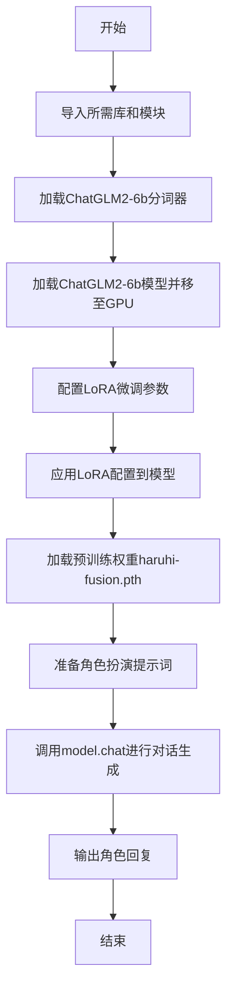
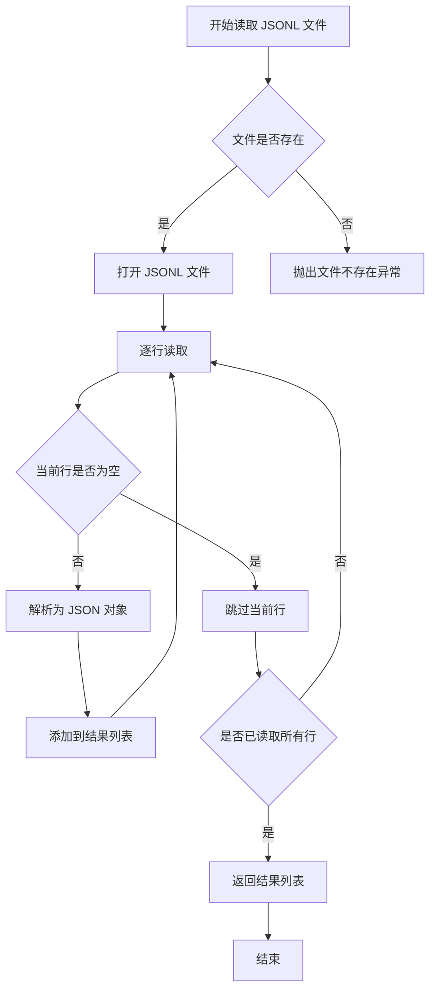
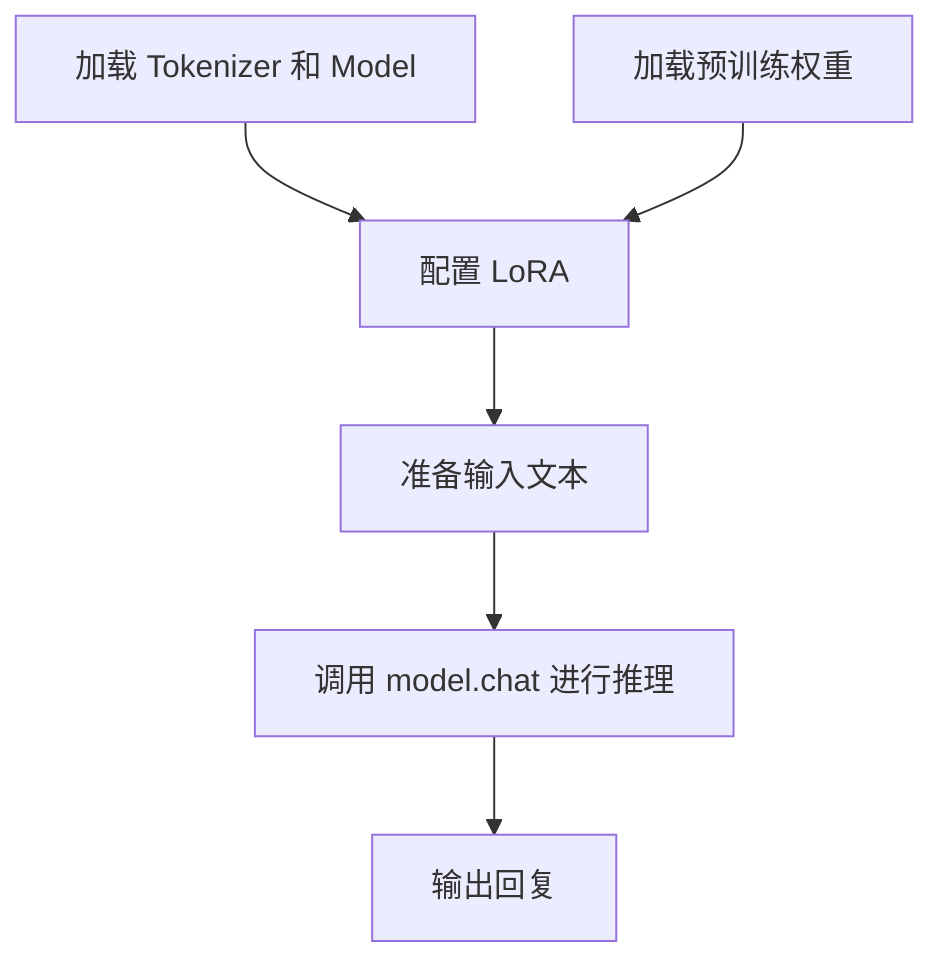
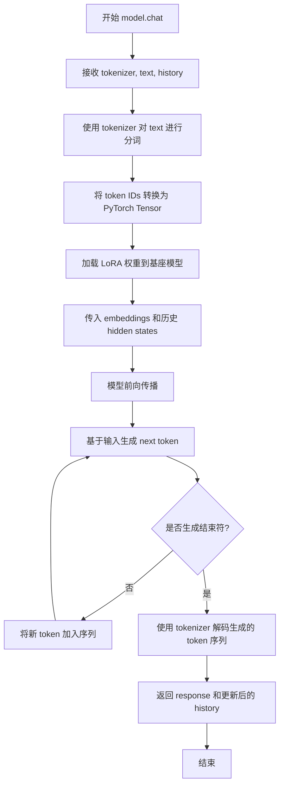

# `Chat-Haruhi-Suzumiya\kyon_generator\inference.py` 详细设计文档

该代码实现了一个基于ChatGLM2-6b模型的角色扮演推理系统，通过加载预训练的LoRA权重（haruhi-fusion.pth）使模型能够扮演《天龙八部》中的王语嫣角色，并对用户输入进行对话生成。

## 整体流程



## 类结构

```
主程序文件 (haruhi_inference.py)
└── dataset模块 (dataset.py)
    ├── CharacterDataset
    ├── read_jsonl_file
    └── collate_fn
```

## 全局变量及字段


### `tokenizer`
    
ChatGLM2-6b模型的Tokenizer，用于文本分词和编码

类型：`AutoTokenizer`
    


### `model`
    
经过LoRA微调并加载了checkpoint的ChatGLM2-6b模型，用于角色扮演对话生成

类型：`PeftModel (AutoModel)`
    


### `config`
    
LoRA微调配置参数，包含秩、alpha值、dropout等超参数

类型：`LoraConfig`
    


### `checkpoint`
    
从文件加载的模型权重检查点，用于恢复模型状态

类型：`OrderedDict`
    


### `text`
    
输入的角色扮演提示文本，包含人物设定和对话场景

类型：`str`
    


### `response`
    
模型生成的角色扮演回复文本

类型：`str`
    


### `history`
    
聊天历史记录列表，用于维护对话上下文

类型：`list`
    


    

## 全局函数及方法


### `read_jsonl_file`

该函数用于从指定的 JSONL（JSON Lines）文件中逐行读取数据，将每行解析为 JSON 对象并返回一个包含所有记录的列表，通常用于加载训练数据集或对话历史等结构化文本数据。

参数：

-  `file_path`：`str`，待读取的 JSONL 文件路径

返回值：`List[dict]`，返回包含所有 JSON 对象的列表，每个元素为一个字典

#### 流程图



#### 带注释源码

```python
import jsonlines  # 引入 jsonlines 库用于高效读取 JSONL 文件

def read_jsonl_file(file_path):
    """
    读取 JSONL 格式的文件并返回包含所有记录的列表
    
    参数:
        file_path (str): 要读取的 JSONL 文件路径
        
    返回值:
        List[dict]: 返回包含所有 JSON 对象的列表，每个元素为字典类型
    """
    # 初始化空列表用于存储读取的数据
    data = []
    
    # 使用 jsonlines 打开文件，'r' 表示读取模式
    with jsonlines.open(file_path, 'r') as reader:
        # 遍历文件中的每一行
        for obj in reader:
            # 将每行的 JSON 对象添加到列表中
            data.append(obj)
    
    # 返回读取的所有数据
    return data

# 使用示例：
# data = read_jsonl_file('/path/to/your/file.jsonl')
# for item in data:
#     print(item)
```

**注意**：当前代码中仅展示了该函数的导入语句（`from dataset import read_jsonl_file`），实际函数实现位于 `dataset` 模块中。以上源码为基于常见 JSONL 读取模式的推测实现。


# 分析结果

经过仔细分析提供的代码，我发现代码中**并没有直接定义 `collate_fn` 函数**。该函数是通过以下导入语句从外部模块引入的：

```python
from dataset import CharacterDataset, read_jsonl_file, collate_fn
```

这意味着 `collate_fn` 的实际定义位于 `dataset` 模块中，而该模块的代码未在当前提供的代码片段中展示。

---

## 无法生成文档的原因

由于 `collate_fn` 函数的实际源码不可见，我无法提取以下信息：
- 参数名称和类型
- 返回值类型和描述
- 实际的函数逻辑
- 完整的流程图

---

## 可能的解决方案

1. **提供 `dataset.py` 模块的代码**：如果您能提供 `dataset.py` 文件的完整内容，我可以从中提取 `collate_fn` 函数的具体实现。

2. **根据上下文推断**：`collate_fn` 是 PyTorch DataLoader 中常用的数据整理函数，通常用于将 batch 中的样本整理成张量形式。基于其在导入语句中的位置（与 `CharacterDataset` 和 `read_jsonl_file` 一起），可以推断它可能是用于处理 `CharacterDataset` 数据的批处理函数。

---

## 代码中可分析的部分

尽管无法获取 `collate_fn` 的具体实现，但当前代码展示了一个完整的**对话模型推理流程**：

### 核心功能概述
该代码实现了一个基于 ChatGLM2-6B 模型的对话推理系统，使用 LoRA 微调技术加载预训练权重，并支持角色扮演（如"王语嫣"）的对话生成。

### 主要组件

| 组件 | 描述 |
|------|------|
| `tokenizer` | ChatGLM2-6B 的分词器 |
| `model` | 经过 LoRA 微调的 ChatGLM2-6B 模型 |
| `LoraConfig` | LoRA 微调配置参数 |
| `model.chat()` | 模型对话接口 |

### 整体运行流程



---

如果您能提供 `dataset.py` 模块的代码，我将能够完整提取 `collate_fn` 的所有详细信息并生成完整的文档。


### `model.chat`

该方法是一个基于 ChatGLM2-6B 架构的对话生成方法，通过 LoRA 微调后的模型接收分词器、输入文本和历史对话上下文，生成符合角色设定的自然语言回复。

参数：

- `tokenizer`：`AutoTokenizer`，ChatGLM2-6B 的分词器对象，用于将输入文本转换为模型可处理的 token 序列
- `text`：`str`，用户输入的提示词文本，包含角色设定和对话场景描述
- `history`：`list`，历史对话记录列表，默认为空列表，用于维护多轮对话的上下文连贯性

返回值：

- `response`：`str`，模型生成的回复文本
- `history`：`list`，更新后的历史对话记录，包含本轮对话的输入和输出

#### 流程图



#### 带注释源码

```python
# 导入必要的库
import json
import torch
from transformers import AutoTokenizer, AutoModel
from peft import LoraConfig, get_peft_model

# 加载分词器和预训练模型
tokenizer = AutoTokenizer.from_pretrained("THUDM/chatglm2-6b", trust_remote_code=True)
model = AutoModel.from_pretrained("THUDM/chatglm2-6b", trust_remote_code=True).half().cuda()

# 配置 LoRA 微调参数
config = LoraConfig(
    r=16,                        # LoRA 矩阵的秩
    lora_alpha=32,               # LoRA 缩放系数
    inference_mode=False,        # 设置为推理模式
    lora_dropout=0.05,           # Dropout 概率
    task_type="CAUSAL_LM"        # 任务类型：因果语言模型
)

# 将 LoRA 适配器应用到模型上
model = get_peft_model(model, config)

# 加载训练好的 LoRA 权重
checkpoint = torch.load('/data/workspace/haruhi-fusion.pth')
model.load_state_dict(checkpoint)

# 使用 torch.no_grad() 禁用梯度计算，节省显存
with torch.no_grad():
    # 定义输入文本，包含角色设定和对话场景
    text = 'I want you to act like 王语嫣 from 天龙八部...'
    
    # 调用模型的 chat 方法进行对话生成
    # 参数说明：
    #   tokenizer: 分词器，用于编码输入和解码输出
    #   text: 输入的提示词
    #   history: 历史对话记录，初始为空列表
    # 返回值：
    #   response: 模型生成的回复
    #   history: 更新后的对话历史
    response, history = model.chat(tokenizer, text, history=[])
    
    # 打印生成的回复
    print(response)
```

## 关键组件


### 模型加载与配置

使用Hugging Face的AutoModel和AutoTokenizer从预训练模型"THUDM/chatglm2-6b"加载对话生成模型，并配置trust_remote_code=True以支持自定义代码

### LoRA微调配置

通过PEFT库的LoraConfig设置低秩适配参数：r=16（秩）、lora_alpha=32（缩放系数）、lora_dropout=0.05（dropout率），task_type="CAUSAL_LM"指定因果语言模型任务

### PEFT模型封装

使用get_peft_model将原始模型与LoRA配置结合，实现参数高效微调，在保持原始模型权重冻结的同时添加可训练的低秩适配器

### 检查点加载与权重恢复

通过torch.load加载预训练权重文件（/data/workspace/haruhi-fusion.pth），使用load_state_dict将权重加载到PEFT模型中，实现特定人物（如王语嫣）的角色扮演能力

### 对话生成接口

调用model.chat方法进行多轮对话生成，输入文本包含角色设定和场景描述，模型基于LoRA微调后的权重生成符合角色特征的回复，支持历史记录管理

### 数据集模块引用

从dataset模块导入CharacterDataset类、read_jsonl_file函数和collate_fn，用于处理自定义数据集，可能用于进一步的微调或数据处理

### Half精度与GPU部署

使用.half()将模型转换为FP16精度以加速推理，.cuda()将模型部署到GPU设备，提升推理效率

### 数据处理流水线

ConcatDataset可能用于合并多个数据集，DataLoader提供批量数据加载功能，支持训练过程中的数据批量处理


## 问题及建议


### 已知问题

- **未使用的导入**：代码导入了大量未使用的模块，包括 `Dataset`、`DataLoader`、`ConcatDataset`、`Trainer`、`TrainingArguments`、`load_dataset`、`json`、`jsonlines` 等，增加了加载时间和内存占用
- **硬编码问题严重**：模型路径 `/data/workspace/haruhi-fusion.pth`、模型名称 `"THUDM/chatglm2-6b"`、测试文本均硬编码在代码中，无配置管理机制
- **变量未定义**：代码中存在 `his` 变量引用（`generate_text(his,text)` 被注释），但该变量未定义
- **缺少错误处理**：模型加载、checkpoint加载、推理过程均无任何 try-except 异常捕获，可能导致程序直接崩溃
- **GPU 检查缺失**：直接调用 `.cuda()` 而未检查 CUDA 是否可用，在 CPU 环境下会报错
- **资源未释放**：使用完模型后未进行任何清理工作（如 `del model`、`torch.cuda.empty_cache()`）
- **代码结构混乱**：所有代码均在全局作用域执行，未封装成函数，难以测试和复用
- **类型注解缺失**：所有变量、函数参数、返回值均无类型注解，降低代码可读性和可维护性
- **文档注释缺失**：核心逻辑无任何 docstring 或注释说明
- **checkpoint 加载风险**：`load_state_dict` 未设置 `strict=False`，可能导致加载失败

### 优化建议

- **清理未使用导入**：移除 `Dataset`、`DataLoader`、`ConcatDataset`、`Trainer`、`TrainingArguments`、`load_dataset`、`json`、`jsonlines` 等未使用的模块
- **配置外置**：使用配置文件（如 `config.yaml` 或 `config.json`）管理模型路径、checkpoint 路径、LoRA 参数等，避免硬编码
- **添加错误处理**：为模型加载、checkpoint 加载、推理等关键步骤添加 try-except 异常处理和适当的错误提示
- **GPU 可用性检查**：在调用 `.cuda()` 前检查 `torch.cuda.is_available()`
- **代码重构**：将推理逻辑封装为独立函数（如 `load_model()`, `load_checkpoint()`, `generate_response()`），提高代码可测试性和可复用性
- **添加类型注解**：为函数参数和返回值添加类型注解，使用 Python typing 模块
- **添加 docstring**：为关键函数和类添加文档字符串，说明功能、参数、返回值
- **资源管理**：使用完模型后添加适当的清理逻辑，考虑使用上下文管理器
- **strict 参数调整**：checkpoint 加载时设置 `strict=False` 以提高兼容性
- **日志记录**：引入 `logging` 模块记录关键操作和错误信息，便于调试和问题追踪


## 其它


### 设计目标与约束

本项目旨在实现一个基于ChatGLM2-6B模型的个性化角色扮演推理系统，通过LoRA微调技术使模型能够扮演《天龙八部》中的王语嫣角色。核心约束包括：模型必须使用THUDM/chatglm2-6b作为基础模型，LoRA配置中r=16、lora_alpha=32、lora_dropout=0.05，推理时使用FP16精度加速（.half()），必须使用CUDA加速（.cuda()），推理模式关闭梯度计算（torch.no_grad()）。

### 错误处理与异常设计

代码中未显式实现错误处理机制。潜在异常包括：模型加载失败（文件路径错误/磁盘空间不足）、tokenizer初始化失败、GPU内存不足（CUDA out of memory）、checkpoint文件损坏或格式不匹配、输入文本编码问题。改进建议：添加try-except捕获异常、添加模型/文件存在性检查、添加GPU内存检测、添加checkpoint完整性校验（检查state_dict的key是否匹配）。

### 数据流与状态机

数据流分为三个阶段：初始化阶段（加载tokenizer、模型、LoRA配置、checkpoint）→ 推理准备阶段（将模型转为PEFT模型、加载权重、移到GPU）→ 推理执行阶段（接收文本输入、调用model.chat生成回复、输出response）。状态转换：Model Loading → PEFT Wrapping → Checkpoint Loading → GPU Transfer → Inference Ready → Generating Response。

### 外部依赖与接口契约

主要外部依赖包括：transformers（AutoTokenizer/AutoModel/Trainer/TrainingArguments）、peft（LoraConfig/get_peft_model）、torch、datasets（load_dataset）、huggingface_hub（login）、jsonlines、json。接口契约：model.chat(tokenizer, text, history)接收文本字符串和历史记录列表，返回(response, history)元组，其中response为字符串类型，history为列表类型。

### 性能考虑

当前实现使用FP16半精度推理（.half()）提升推理速度，使用torch.no_grad()禁用梯度计算减少显存占用，使用CUDA加速。潜在优化点：使用量化技术（INT8/INT4）进一步减少显存，可以使用transformers的generate方法替代chat方法实现批量推理，考虑使用vLLM等推理加速框架。

### 安全性考虑

代码中未包含输入验证和过滤机制。安全风险：用户输入可能包含恶意Prompt注入攻击。改进建议：添加输入长度限制（max_length）、添加敏感词过滤、添加输出内容审核、避免在推理过程中泄露模型内部状态。

### 配置管理

当前配置硬编码在代码中，包括模型路径（THUDM/chatglm2-6b）、LoRA参数（r=16, lora_alpha=32, lora_dropout=0.05）、checkpoint路径（/data/workspace/haruhi-fusion.pth）。改进建议：将配置抽离为独立的配置文件（config.yaml或config.json），支持命令行参数传递，实现配置与代码解耦。

### 资源要求

模型资源：ChatGLM2-6B基础模型约13GB，LoRA微调权重约几十MB（取决于rank和层数）。GPU显存需求：FP16推理至少需要约14GB显存，推荐使用24GB显存的GPU（如A100/V100）。磁盘空间：基础模型+checkpoint约需15GB。

### 测试策略

当前代码缺少单元测试和集成测试。建议测试覆盖：模型加载测试（验证tokenizer和model正确初始化）、LoRA配置测试（验证PEFT模型结构正确）、checkpoint加载测试（验证权重匹配）、推理功能测试（验证输入输出格式正确）、边界情况测试（空输入、超长输入、特殊字符）。

### 部署相关

当前代码为单脚本推理模式。部署建议：封装为RESTful API服务（使用FastAPI或Flask），支持流式输出（streaming response），添加日志记录和监控指标，考虑使用Docker容器化部署，配置模型热加载和优雅关闭机制。

### 版本兼容性

代码依赖的版本约束：transformers≥4.30.0、torch≥2.0.0、peft≥0.3.0、datasets≥2.0.0。建议使用requirements.txt或environment.yml固定具体版本号，避免依赖兼容性问题。

    