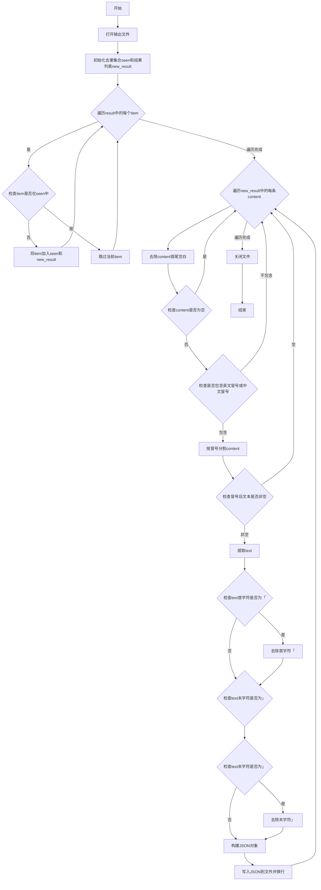
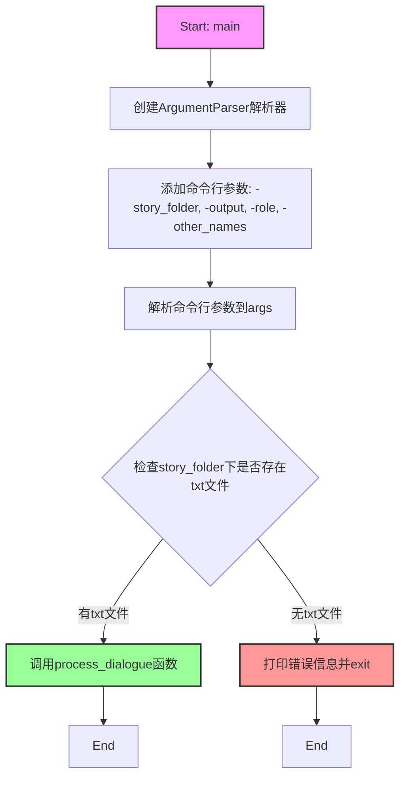

# `Chat-Haruhi-Suzumiya\kyon_generator\story2chat.py` 详细设计文档

该程序是Chat凉宫春日项目的一部分，用于从故事文本文件中提取非主角角色的对话，并将其转换为JSONL格式。程序通过识别文本中的冒号或中文冒号来解析对话角色，过滤掉主角（默认为春日）的对话，保留其他角色的对话内容。

## 整体流程

```mermaid
graph TD
A[开始] --> B[解析命令行参数]
B --> C{检查story_folder是否有txt文件}
C -- 否 --> D[打印错误信息并退出]
C -- 是 --> E[调用process_dialogue函数]
E --> F[遍历每个txt文件]
F --> G{逐行读取文件}
G --> H{判断是否包含冒号}
H -- 是 --> I[提取角色名]
H -- 否 --> J[角色名为空]
I --> K{角色名是否在主角列表中}
K -- 是 --> L[保存上一条非主角对话并清空]
K -- 否 --> M[累加到last_content]
J --> M
L --> N[调用generage_jsonl函数]
M --> G
N --> O[去重处理]
O --> P{遍历每条对话]
P --> Q[去除首尾空白]
Q --> R{判断是否有冒号]
R -- 是 --> S[分割对话内容和文本]
R -- 否 --> P
S --> T{处理特殊字符「」}]
T --> U[写入JSONL文件]
U --> V[结束]
```

## 类结构

```
该脚本为面向过程编程，无类定义
```

## 全局变量及字段


### `input_files`
    
传入参数，需要处理的故事文件路径列表

类型：`list[str]`
    


### `output_file`
    
传入参数，输出JSONL文件的路径

类型：`str`
    


### `role`
    
传入参数，主角的名称，用于判断是否跳过该角色的对话

类型：`str`
    


### `other_names`
    
传入参数，主角的其他名字列表，用于匹配角色名

类型：`list[str]`
    


### `result`
    
函数内局部变量，存储从故事文本中提取的非主角对话内容

类型：`list[str]`
    


### `output_dir`
    
函数内局部变量，输出文件的绝对目录路径

类型：`str`
    


### `cnt`
    
函数内局部变量，已处理文件的计数器（定义后未实际使用）

类型：`int`
    


### `f_read`
    
文件对象，用于读取输入的故事文件

类型：`TextIOWrapper`
    


### `lines`
    
列表，存储读取的文件所有行内容

类型：`list[str]`
    


### `last_content`
    
字符串，暂存上一条非主角的对话内容用于拼接

类型：`str`
    


### `current_role`
    
字符串，当前行解析出的角色名称

类型：`str`
    


### `seen`
    
集合，用于去重记录已见过的对话内容

类型：`set[str]`
    


### `new_result`
    
列表，去重后的对话内容列表

类型：`list[str]`
    


### `content`
    
字符串，当前遍历处理的对话文本

类型：`str`
    


### `res`
    
列表，将对话按冒号分割后的结果[角色名, 对话内容]

类型：`list[str]`
    


### `text`
    
字符串，提取出的实际对话文本内容

类型：`str`
    


### `fw`
    
文件对象，用于写入JSONL输出文件

类型：`TextIOWrapper`
    


### `txt_files`
    
列表，story_folder下所有txt文件的路径

类型：`list[str]`
    


### `args`
    
命名空间对象，存储解析后的命令行参数

类型：`Namespace`
    


### `story_folder`
    
字符串，故事文本文件夹的路径

类型：`str`
    


### `args.role`
    
字符串，从命令行参数中获取的主角名称

类型：`str`
    


### `args.other_names`
    
列表，从命令行参数中获取的主角其他名字

类型：`list[str]`
    


    

## 全局函数及方法


### `process_dialogue`

该函数是故事转对话处理的核心函数，遍历输入的故事文本文件列表，识别并提取所有非主角角色的对话内容，将其传递给 JSONL 生成函数写入输出文件。

参数：

- `input_files`：`list`，输入的故事文本文件路径列表，通常为包含故事内容的 `.txt` 文件
- `output_file`：`str`，输出 JSONL 文件的路径，存储提取后的对话数据
- `role`：`str`，主角的名称，用于过滤掉主角的对话，只保留其他角色的内容
- `other_names`：`list`，主角的其他名字列表（如别名），用于更全面地过滤主角对话

返回值：`None`，该函数直接调用 `generage_jsonl` 函数并将结果写入文件，无显式返回值

#### 流程图

```mermaid
flowchart TD
    A[开始 process_dialogue] --> B[创建结果列表 result]
    B --> C[获取输出文件所在目录并创建目录]
    C --> D{遍历 input_files 中的每个文件}
    D -->|是| E[打开当前文件并读取所有行]
    E --> F[初始化 last_content 为空字符串]
    F --> G{遍历文件的每一行}
    G --> H{判断行中是否包含冒号}
    H -->|是 ":" | I[使用 ":" 分割行并提取角色名]
    H -->|是 "：" | J[使用 "：" 分割行并提取角色名]
    H -->|否| K[将 current_role 设为空字符串]
    I --> L
    J --> L
    K --> L{判断 current_role 是否为主角或别名}
    L -->|是| M{判断 last_content 是否非空}
    M -->|是| N[将 last_content 添加到 result]
    M -->|否| O[将 last_content 置空]
    N --> O
    O --> P[继续下一行]
    L -->|否| Q[将当前行设置为 last_content]
    Q --> P
    P --> G
    G -->|遍历结束| R[调用 generage_jsonl 生成 JSONL 文件]
    R --> S[结束]
    D -->|遍历结束| S
```

#### 带注释源码

```python
def process_dialogue(input_files, output_file, role, other_names):
    """
    处理故事文本文件，提取非主角的对话内容
    
    参数:
        input_files: 输入的故事文本文件列表
        output_file: 输出的 JSONL 文件路径
        role: 主角名字，用于过滤主角对话
        other_names: 主角的其他名字列表（别名）
    
    返回:
        None: 直接将结果写入输出文件
    """
    # 存储提取到的非主角对话内容
    result = []
    
    # 获取输出文件的目录路径，并确保该目录存在
    output_dir = os.path.abspath(os.path.dirname(output_file))
    if not os.path.exists(output_dir):
        # 如果目录不存在则创建（包含父目录）
        os.makedirs(output_dir)
    
    # 计数器，记录处理的文件数量（代码中未实际使用）
    cnt = 0
    
    # 遍历每个输入的故事文件
    for file in input_files:
        cnt += 1
        # 以 UTF-8 编码打开文件
        f_read = open(file, 'r', encoding='utf-8')
        # 读取文件所有行
        lines = f_read.readlines()
        
        # 记录上一条对话内容，用于判断对话归属
        last_content = ""
        
        # 遍历文件的每一行
        for line in lines:
            # 判断行中使用中文冒号还是英文冒号来标识角色
            if ":" in line:
                # 使用英文冒号分割，提取角色名
                current_role = line.split(":")[0]
            elif '：' in line:
                # 使用中文冒号分割，提取角色名
                current_role = line.split("：")[0]
            else:
                # 行中没有冒号，则角色名为空
                current_role = ""
            
            # 判断当前角色是否为主角或主角的别名
            if current_role in other_names + [role]:
                # 如果遇到主角的对话，说明之前的对话段落已结束
                if not last_content == "":
                    # 将上一段非主角对话添加到结果列表
                    result.append(last_content)
                # 重置对话内容，准备接收下一段对话
                last_content = ""
            else:
                # 当前行属于非主角角色，累积对话内容
                last_content = line
        
        # 关闭文件句柄
        f_read.close()
    
    # 调用 generage_jsonl 函数生成 JSONL 格式输出文件
    return generage_jsonl(result, output_file)
```


### `generage_jsonl(result, output_file)`

该函数接收对话内容列表和输出文件路径，首先对对话内容进行去重处理，然后逐条解析对话中的角色和文本，移除多余的标点符号，最后将处理后的数据以JSON Lines格式写入指定文件。

参数：

- `result`：`list`，包含从故事文本中提取的非主角对话内容列表
- `output_file`：`str`，输出JSONL文件的路径

返回值：`None`，该函数没有返回值，执行完成后直接关闭文件

#### 流程图



#### 带注释源码

```python
def generage_jsonl(result, output_file):
    """
    将对话结果写入JSONL文件
    
    参数:
        result: 包含对话内容的列表
        output_file: 输出文件路径
    返回:
        None
    """
    # 以读写模式打开输出文件，utf-8编码
    fw = open(output_file, 'w+', encoding='utf-8')
    """
    {"role": "阿虚", "text": "「奇特的社团和运动社团有什么不同？」", "source": "synthesized "}
    """
    
    # 使用集合进行去重，初始化空集合和空列表
    seen = set()
    new_result = []
    # 遍历原始结果列表
    for item in result:
        # 如果元素未出现过
        if item not in seen:
            # 加入已见集合和结果列表
            seen.add(item)
            new_result.append(item)
            
    # 遍历去重后的对话内容
    for content in new_result:       
        # 去除首尾空白
        content = content.strip()
        # 如果内容非空
        if content:
            # 检查是否包含英文冒号
            if ":" in content:
                # 按英文冒号分割
                res = content.split(':')
            # 检查是否包含中文冒号
            elif '：' in content:
                # 按中文冒号分割
                res = content.split('：')
            
            # 检查冒号后文本是否非空
            if res[1] != '':
                # 提取文本内容
                text = res[1]
                # 如果文本以「开头，去除首字符
                if text[0] == "「":
                    text = text[1:]
                # 如果文本以」结尾，去除末字符
                if text[-1] == "」":
                    text = text[:-1]
                
                # 构建JSON对象并写入文件，使用story作为来源
                json.dump({"role": res[0], "text": text, "source": "story"}, fw, ensure_ascii=False)
                # 写入换行符
                fw.write("\n")
    # 关闭文件
    fw.close()
```


### `main` (隐式入口函数)

这是该脚本的核心入口函数，通过 `if __name__ == '__main__'` 块实现，负责解析命令行参数、检查输入文件并调用核心处理函数。

参数：

- `story_folder`：`str`，故事文件夹路径（通过 `-story_folder` 参数传入）
- `output`：`str`，输出文件路径（通过 `-output` 参数传入）
- `role`：`str`，主角名字（通过 `-role` 参数传入，默认为"春日"）
- `other_names`：`list`，主角的其他名字列表（通过 `-other_names` 参数传入，默认为空列表）

返回值：`None`，该函数无显式返回值，主要通过调用 `process_dialogue` 函数处理数据并将结果写入文件

#### 流程图



#### 带注释源码

```python
if __name__ == '__main__':
    # 解析命令行参数
    parser = argparse.ArgumentParser(
        description='Process story data for Chat Haruhi Suzumiya project',
        epilog='author:LengYue(https://github.com/zealot52099)'
    )

    # 添加-story_folder参数：必选，故事文件夹路径
    parser.add_argument('-story_folder', required=True, help='Story folder path')
    # 添加-output参数：必选，输出文件路径
    parser.add_argument('-output', required=True, help='Output file path')
    # 添加-role参数：可选，主角名字，默认为"春日"
    parser.add_argument('-role', default='春日', help='Main role name (default: 春日)')
    # 添加-other_names参数：可选，其他角色名字列表，用于匹配主角的不同称呼
    parser.add_argument('-other_names', nargs='*', default=[], help='Other role names (default: None)')
    # 解析所有命令行参数
    args = parser.parse_args()

    # 从args中提取各参数值
    story_folder = args.story_folder    # 故事文件夹路径
    output_file = args.output           # 输出文件路径
    role = args.role                    # 主角名字
    other_names = args.other_names      # 主角的其他名字列表

    # 使用glob模块查找story_folder下所有的.txt文件
    txt_files = glob.glob(os.path.join(story_folder, '*.txt'))
    # 检查是否找到txt文件，如果没有则打印错误信息并退出程序
    if not txt_files:
        print(f"No txt files found in {story_folder}")
        exit(1)

    # 调用核心处理函数process_dialogue进行对话提取
    # 传入：txt文件列表、输出文件路径、主角名字、其他名字
    process_dialogue(txt_files, output_file, role, other_names)
```

## 关键组件


### 命令行参数解析模块

使用argparse库解析四个命令行参数：story_folder（故事文件夹路径）、output（输出文件路径）、role（主角名字，默认"春日"）、other_names（主角的其他名字列表）。通过ArgumentParser配置程序描述和作者信息，返回解析后的命名空间对象。

### 文件扫描与路径处理模块

使用glob模块的glob函数配合os.path.join扫描story_folder目录下的所有.txt文件，并使用os.path.abspath和os.path.dirname处理输出文件的绝对路径。包含目录不存在时自动创建的逻辑。

### 对话内容提取模块

process_dialogue函数为核心处理逻辑，遍历输入文件列表逐行读取内容。通过检测中英文冒号（":"和"："）识别角色名，判断当前行是否属于主角（比较current_role与role和other_names列表），将非主角的对话内容收集到result列表中，最后调用generage_jsonl生成输出。

### JSONL格式输出模块

generage_jsonl函数负责将对话结果写入JSONL文件，首先进行去重处理（使用set记录已见内容），然后逐行处理对话内容。能够识别并去除中文引号「」包裹的文本，将处理后的对话以JSON格式写入文件，每行包含role、text和source三个字段。

### 字符编码处理模块

整个程序统一使用UTF-8编码进行文件的读取和写入操作，确保能够正确处理中文字符。在open函数中显式指定encoding='utf-8'参数。

### 错误处理与验证模块

包含基本的文件验证逻辑，检查story_folder下是否存在txt文件，若不存在则打印错误信息并以状态码1退出程序。但整体错误处理机制较为薄弱，缺乏异常捕获和更详细的错误提示。


## 问题及建议


### 已知问题

- **拼写错误**：`generage_jsonl` 函数名少了一个 'n'，应为 `generate_jsonl`
- **未使用变量**：`process_dialogue` 函数中的 `cnt` 变量被递增但从未使用
- **资源泄漏风险**：`f_read = open(file, 'r', encoding='utf-8')` 未使用 `with` 语句或显式 `close()`，可能导致文件句柄泄漏
- **变量定义前使用**：`generage_jsonl` 函数中 `res = content.split(':')` 后直接使用 `res[1]`，但如果 `content` 不包含冒号，`res` 可能只有一個元素导致 `IndexError`
- **返回值未使用**：`process_dialogue` 函数返回 `generage_jsonl()` 的结果，但调用处未接收该返回值
- **逻辑冗余**：`:` 和 `：` 的分割逻辑在 `process_dialogue` 和 `generage_jsonl` 中重复出现
- **类型注解缺失**：所有函数均无类型提示，降低了代码可维护性和IDE支持
- **硬编码字符串**：JSON输出中的 `"source": "story"` 为硬编码，可考虑作为参数配置

### 优化建议

- 修正 `generage_jsonl` 的拼写错误，并添加完整的类型注解
- 使用 `with` 语句管理文件资源，确保文件正确关闭
- 在访问 `res[1]` 前检查 `res` 的长度，避免索引越界异常
- 删除未使用的 `cnt` 变量，或将其用于日志输出
- 抽取重复的分割逻辑为独立工具函数，减少代码冗余
- 添加异常处理机制，例如文件读取失败时的优雅降级
- 考虑将 `source` 字段参数化，增强函数的可配置性

## 其它


### 设计目标与约束

本代码的设计目标是从故事文本文件夹中提取所有非主角的对话，并将其转换为JSONL格式，用于Chat凉宫春日项目的对话数据处理。主要约束包括：1) 仅处理UTF-8编码的txt文件；2) 主角名称通过命令行参数灵活指定；3) 支持中英文冒号分隔符；4) 输出JSONL格式必须包含role、text、source三个字段。

### 错误处理与异常设计

代码包含以下错误处理机制：1) 文件夹不存在时自动创建输出目录；2) 当story_folder下没有txt文件时打印错误信息并以状态码1退出；3) 文件读取使用UTF-8编码，捕获编码异常；4) 对空行和空白内容进行过滤；5) 对话内容为空时跳过写入。潜在的改进空间包括：添加更具体的异常捕获（如FileNotFoundError、PermissionError）、添加日志记录而非仅使用print、添加重试机制处理临时文件访问失败。

### 数据流与状态机

数据流分为三个主要阶段：输入阶段通过glob获取指定文件夹下所有txt文件；处理阶段逐行读取文件，根据冒号分隔判断说话者角色，如果说话者不是主角则将其对话内容加入结果列表；输出阶段对结果去重并转换为JSONL格式。状态机表现为：读取状态（逐行处理）→ 判断状态（是否为主角）→ 收集状态（非主角对话）→ 输出状态（生成JSONL）。

### 外部依赖与接口契约

本代码仅使用Python标准库，无需外部依赖。具体依赖包括：argparse（命令行参数解析）、os（文件路径操作）、glob（文件匹配）、json（JSON序列化）。接口契约方面：命令行接受-story_folder（必需）、-output（必需）、-role（可选默认春日）、-other_names（可选默认空列表）四个参数；输出文件格式为JSONL，每行包含{"role":str,"text":str,"source":"story"}格式的JSON对象。

### 性能考虑与优化空间

当前实现存在以下性能问题：1) 每次append操作可能触发列表扩容，建议初始化时预估大小；2) 使用item not in seen在列表中查找会导致O(n)时间复杂度，应改为在集合中检查后再操作；3) 文件逐个处理，大批量文件时可考虑并行处理；4) 字符串操作（split、strip）可优化减少不必要的调用。优化建议：使用列表推导式替代部分循环、使用生成器减少内存占用、考虑使用pandas处理大批量数据。

### 安全性考虑

代码涉及文件读取操作，安全性考虑包括：1) 输入路径未做严格验证，恶意构造的路径可能导致目录遍历攻击；2) 输出文件路径未做安全检查，可能覆盖系统重要文件；3) 文件名处理未过滤特殊字符。改进建议：添加路径规范化检查、使用pathlib进行更安全的路径处理、对输出目录做白名单限制。

### 测试策略建议

建议添加以下测试用例：1) 单元测试：测试process_dialogue函数处理空文件、单行文件、多行文件的正确性；2) 集成测试：测试完整流程从命令行参数到输出文件的正确性；3) 边界测试：测试只有主角对话的文件、只有非主角对话的文件、包含中英文混合冒号的文件；4) 性能测试：测试处理大文件的内存和时间消耗。

### 代码可维护性与扩展性

可维护性问题：1) generage_jsonl函数名存在拼写错误（应为generate）；2) 魔法字符串"story"应定义为常量；3) 缺少类型注解和文档字符串；4) 硬编码的中文冒号判断逻辑可抽象为通用函数。扩展性方面：当前仅支持txt文件，可扩展支持pdf、docx等格式；可添加配置文件支持而非仅命令行参数；可添加插件机制支持不同的输出格式。


    