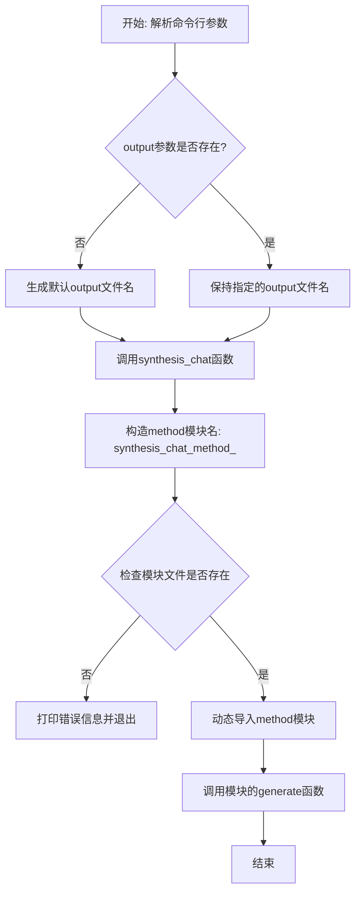
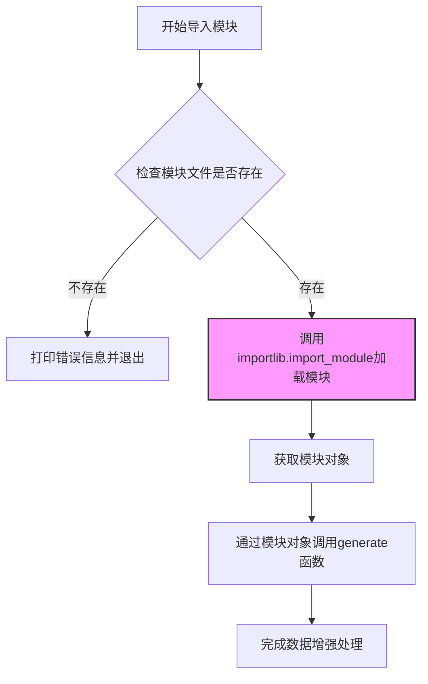
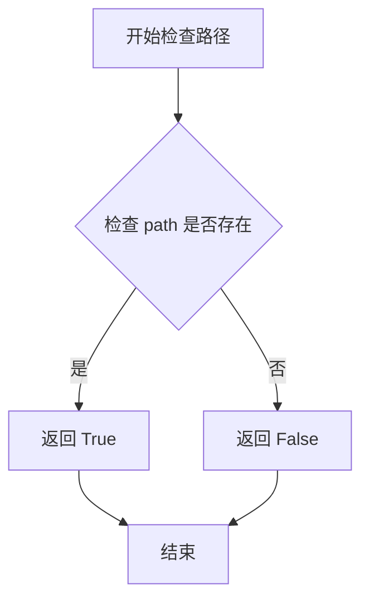
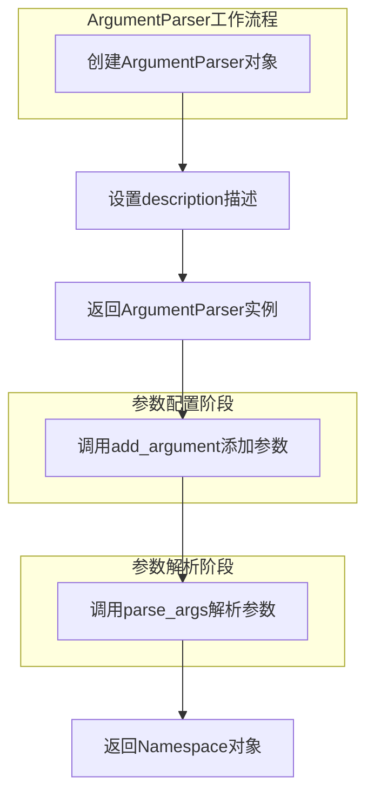
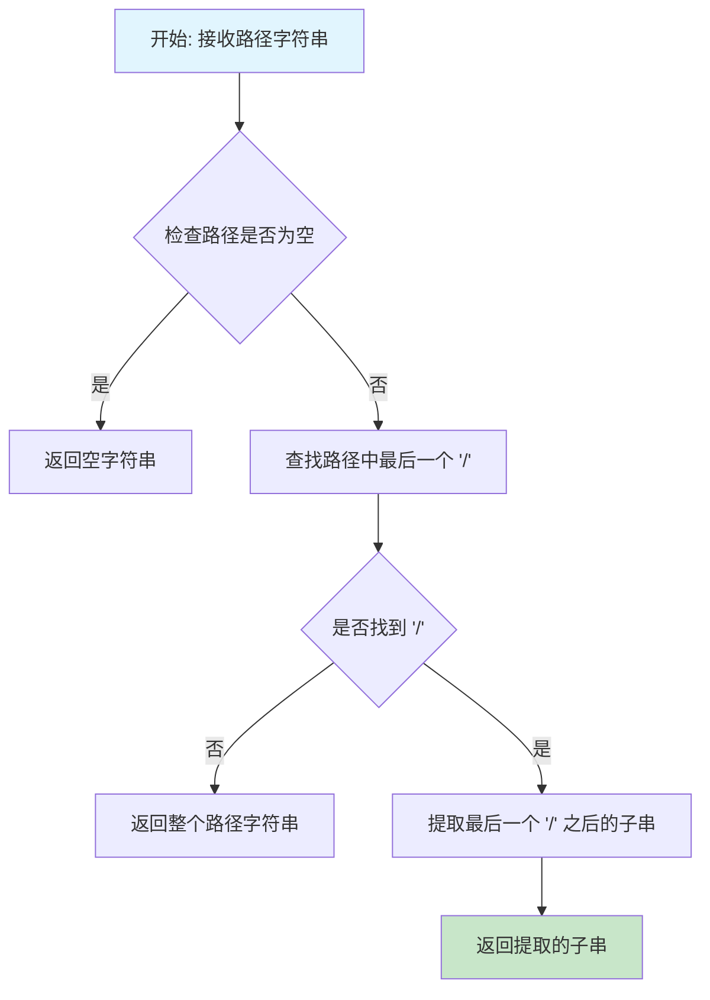
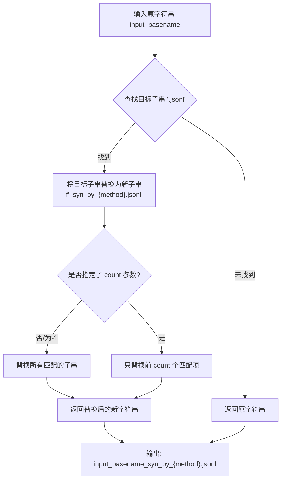

# `Chat-Haruhi-Suzumiya\kyon_generator\synthesis_chat.py` 详细设计文档

这是一个命令行数据增强工具，用于从真实用户的jsonl文件中调用特定增强方法生成增广的jsonl文件，支持动态加载自定义增强算法模块。

## 整体流程



## 类结构

```
synthesis_chat (主程序入口)
└── synthesis_chat (核心函数)
    └── importlib.import_module (动态加载)
        └── synthesis_chat_method_<method>.generate (增强方法实现)
```

## 全局变量及字段


### `input_file`
    
输入的jsonl文件路径

类型：`str`
    


### `output_file`
    
输出的jsonl文件路径

类型：`str`
    


### `method`
    
增广方法的名字，默认为'foo'

类型：`str`
    


### `additional_config`
    
增广方法的配置文件路径，默认为None

类型：`str or None`
    


### `method_full_name`
    
动态生成的模块完整名称（synthesis_chat_method_xxx）

类型：`str`
    


### `module`
    
动态导入的方法模块对象

类型：`module`
    


### `parser`
    
命令行参数解析器对象

类型：`ArgumentParser`
    


### `args`
    
解析后的命令行参数命名空间对象

类型：`Namespace`
    


    

## 全局函数及方法


### `synthesis_chat`

核心函数，动态加载指定的方法模块并调用其生成函数，以实现对输入的jsonl文件进行数据增广处理。

参数：

- `input_file`：`str`，输入的真实用户jsonl文件路径
- `output_file`：`str`，输出的增广后的jsonl文件路径
- `method`：`str`，增广方法的名字（用于构建模块名 synthesis_chat_method_{method}）
- `additional_config`：`str`，可选，增广方法的配置文件路径

返回值：`None`，该函数通过调用外部模块的 generate 函数产生输出，不直接返回值

#### 流程图

```mermaid
flowchart TD
    A[开始 synthesis_chat] --> B[构建方法模块名: synthesis_chat_method_{method}]
    B --> C{检查模块文件是否存在}
    C -->|文件不存在| D[打印错误信息: Method {method} not found]
    D --> E[调用 exit(1) 退出程序]
    C -->|文件存在| F[使用 importlib.import_module 动态导入模块]
    F --> G[调用模块的 generate 函数]
    G --> H[结束]
    
    style D fill:#ffcccc
    style E fill:#ffcccc
```

#### 带注释源码

```python
def synthesis_chat(input_file, output_file, method, additional_config=None):
    """
    核心函数，调用特定算法生成增广的jsonl文件
    
    参数:
        input_file: 输入的jsonl文件路径
        output_file: 输出的jsonl文件路径
        method: 增广方法名称
        additional_config: 可选的配置文件路径
    """
    # 根据method参数拼接完整的模块名称
    # 例如 method='foo' -> 'synthesis_chat_method_foo'
    method_full_name = 'synthesis_chat_method_' + method

    # 检查method_full_name的py文件是否存在
    if not os.path.exists(method_full_name + '.py'):
        # 文件不存在时打印错误信息并退出程序
        print(f"Method {method} not found, file {method_full_name}.py not found")
        exit(1)

    # 动态导入指定的模块
    # 例如 method='foo' -> import synthesis_chat_method_foo
    module = importlib.import_module(method_full_name)
    
    # 调用导入模块中的 generate 函数执行实际的增广逻辑
    # 该函数负责读取 input_file，处理后写入 output_file
    module.generate(input_file, output_file, additional_config)
```


### `importlib.import_module`

该函数是 Python 标准库 `importlib` 模块中的核心函数，用于动态导入指定名称的模块。在本代码中，它根据传入的方法名称字符串（如 `synthesis_chat_method_foo`）动态加载对应的 Python 模块，从而实现插件化的方法扩展机制。

参数：

- `name`：`str`，要导入的模块名称，传入的是通过字符串拼接生成的完整方法模块名（如 `synthesis_chat_method_foo`）
- `package`：`str`（可选），用于相对导入的包名，本代码中未使用

返回值：`types.ModuleType`，返回导入成功的模块对象，随后可通过该对象调用模块内的 `generate` 函数

#### 流程图



#### 带注释源码

```python
# 在 synthesis_chat 函数中调用 importlib.import_module
def synthesis_chat(input_file, output_file, method, additional_config=None):
    """
    核心函数，调用特定算法生成增广的jsonl文件
    """
    # 1. 根据方法名拼接完整的模块名称
    method_full_name = 'synthesis_chat_method_' + method

    # 2. 检查方法对应的Python文件是否存在
    if not os.path.exists(method_full_name + '.py'):
        print(f"Method {method} not found, file {method_full_name}.py not found")
        exit(1)

    # 3. 动态导入模块 - 使用importlib.import_module
    # 参数：method_full_name - 需要导入的模块名称（字符串）
    # 返回：types.ModuleType - 导入成功后的模块对象
    module = importlib.import_module(method_full_name)
    
    # 4. 通过导入的模块对象调用其内部的generate函数
    # 传入输入文件、输出文件和额外配置参数
    module.generate(input_file, output_file, additional_config)
```


### `os.path.exists`

检查指定路径（文件或目录）是否存在，返回布尔值表示检查结果。

参数：

- `path`：字符串类型，要检查的路径，可以是文件或目录的路径

返回值：`布尔类型`，如果路径存在返回 `True`，否则返回 `False`

#### 流程图



#### 带注释源码

```python
# os.path.exists 是 Python os 模块提供的路径检查函数
# 用于判断给定的文件或目录路径是否存在

# 在用户代码中的调用方式：
if not os.path.exists(method_full_name + '.py'):
    # 语法：os.path.exists(path)
    # 参数 path: str - 要检查的文件路径
    # 返回值: bool - 路径存在返回 True，否则返回 False
    
    print(f"Method {method} not found, file {method_full_name}.py not found")
    exit(1)

# 源码实现逻辑（Python标准库内部实现简化版）：
def exists(path):
    """
    测试路径是否存在
    
    参数:
        path: str - 文件或目录的路径
        
    返回:
        bool - 路径存在返回True，否则返回False
    """
    try:
        # 尝试使用os.stat获取文件信息
        os.stat(path)
        return True
    except OSError:
        # 如果抛出OSError，说明路径不存在
        return False
```


### `argparse.ArgumentParser`

`argparse.ArgumentParser` 是 Python 标准库 `argparse` 模块中的核心类，用于创建命令行参数解析器。它能够自动生成帮助信息、处理命令行输入，并将解析结果封装为命名空间对象供程序使用。

参数：

- `description`：`str`，在帮助信息中显示的程序功能描述文本

返回值：`ArgumentParser`，返回一个新的参数解析器对象，后续可通过 `add_argument()` 方法添加命令行参数，通过 `parse_args()` 方法解析命令行输入。

#### 流程图



#### 带注释源码

```python
# 创建参数解析器实例，设置程序描述信息
parser = argparse.ArgumentParser(description='Synthesize chat data using a specific method')

# 添加 -input 参数（必需）
# required=True 表示该参数必须提供
parser.add_argument('-input', required=True, help='Input file path')

# 添加 -output 参数（可选）
# 如果未提供，则为 None
parser.add_argument('-output', help='Output file path')

# 添加 -method 参数，默认值为 'foo'
# 当用户未指定时使用默认值
parser.add_argument('-method', default='foo', help='Synthesis method name (default: foo)')

# 添加 -additional_config 参数，默认值为空字符串
parser.add_argument('-additional_config', default='', help='Additional config file (default: config.txt)')

# 解析命令行参数
# 从 sys.argv 中读取参数并解析
# 返回一个命名空间对象，包含所有解析后的参数
args = parser.parse_args()
```

#### 实际使用示例

```python
# 提取解析后的参数值
input_file = args.input           # 获取 -input 参数值
output_file = args.output         # 获取 -output 参数值
method = args.method              # 获取 -method 参数值
additional_config = args.additional_config  # 获取 -additional_config 参数值
```


### `os.path.basename`

`os.path.basename` 是 Python 标准库 `os.path` 模块中的一个函数，用于从指定路径中提取最后一部分（文件名或目录名）。该函数接受一个路径字符串作为输入，并返回该路径的最后一个组件（即路径中最后一个斜杠之后的部分）。

参数：

- `path`：`str`，需要处理的路径字符串，可以是文件路径或目录路径

返回值：`str`，返回路径的最后一个组件。如果路径以路径分隔符结尾，则返回空字符串。

#### 流程图



#### 带注释源码

```python
# os.path.basename 是 Python 标准库 os.path 模块的一部分
# 以下是简化的实现逻辑说明

# 使用示例：
# import os
# 
# file_path = '/home/user/documents/report.pdf'
# base_name = os.path.basename(file_path)
# # 返回: 'report.pdf'
# 
# dir_path = '/home/user/documents/'
# base_name = os.path.basename(dir_path)
# # 返回: '' (因为路径以 '/' 结尾)

# 实际实现（在 PosixPath 中）:
# def basename(path):
#     """Returns the final component of a pathname"""
#     split = os.path.split(path)
#     return split[1]

# os.path.split() 会将路径分割为 (directory, filename) 元组
# basename 只需要返回元组的第二个元素（filename）
```

#### 使用示例

```python
import os

# 基本用法
print(os.path.basename('/home/user/file.txt'))      # 输出: 'file.txt'
print(os.path.basename('/home/user/dir/'))          # 输出: ''
print(os.path.basename('file.txt'))                 # 输出: 'file.txt'

# Windows 路径
print(os.path.basename('C:\\Users\\test.docx'))    # 输出: 'test.docx'
```


### `str.replace`

字符串的替换方法，用于将字符串中的指定子串替换为新子串，返回替换后的新字符串，原字符串保持不变。

参数：

- `old`：`str`，需要被替换的子字符串（目标字符串）
- `new`：`str`，用于替换的新字符串
- `count`：`int`，可选参数，指定最大替换次数，默认为 -1 表示替换所有出现的目标字符串

返回值：`str`，返回替换后的新字符串

#### 流程图



#### 带注释源码

```python
# 假设 input_basename = "conversation.jsonl", method = "foo"
# 则 f'_syn_by_{method}.jsonl' -> "_syn_by_foo.jsonl"

input_basename = "conversation.jsonl"
method = "foo"

# 调用 str.replace 方法进行字符串替换
# 语法: str.replace(old, new, count=-1)
#   - old: 需要被替换的子串 '.jsonl'
#   - new: 替换后的新串 '_syn_by_foo.jsonl'
#   - count: -1 表示替换所有出现的子串（默认行为）
output_file = input_basename.replace('.jsonl', f'_syn_by_{method}.jsonl')

# 上述代码等价于:
# output_file = "conversation.jsonl".replace(".jsonl", "_syn_by_foo.jsonl")
# 结果: "conversation_syn_by_foo.jsonl"

# 扩展说明:
# 如果指定 count 参数，例如 count=1，则只替换第一次出现的子串:
# "conversation.jsonl.jsonl".replace('.jsonl', '_syn', 1) 
# 结果: "conversation_syn.jsonl"
```


## 关键组件


### 命令行参数解析器

使用argparse模块解析四个命令行参数：-input（输入文件路径，必填）、-output（输出文件路径，可选）、-method（增广方法名称，默认foo）、-additional_config（配置文件，默认config.txt）

### 默认输出文件名生成器

当用户未指定输出文件时，程序自动将输入文件名中的.jsonl后缀替换为_syn_by_<method_name>.jsonl，实现自动命名

### 方法模块动态加载器

使用importlib.import_module动态导入synthesis_chat_method_<method_name>模块，实现插件化设计，支持扩展不同的增广方法

### 方法文件存在性检查器

在加载模块前检查method_full_name对应的py文件是否存在，如不存在则打印错误信息并退出程序

### 核心处理函数 synthesis_chat

协调整个增广流程：检查方法文件存在性→动态导入模块→调用模块的generate函数生成增广数据

### 模块generate函数接口契约

期望被导入的method模块必须提供generate(input_file, output_file, additional_config)函数，作为实际的增广算法实现入口


## 问题及建议


### 已知问题

- **错误处理缺失**：对文件不存在、模块导入失败、generate函数调用异常等情况未捕获处理，程序会直接崩溃退出
- **安全风险**：使用`importlib.import_module`动态导入模块，未对method参数进行安全校验，存在代码注入风险
- **参数验证不足**：未验证输入文件是否存在、是否有读取权限、输出路径是否可写
- **默认值不一致**：argparse中`additional_config`默认值为空字符串`''`，但代码注释说是`config.txt`
- **假设性代码**：假设被导入的模块必定存在`generate`函数，若不存在会抛出 AttributeError
- **耦合度高**：核心逻辑与命令行参数解析、文件I/O紧密耦合，不利于单元测试
- **日志薄弱**：仅使用`print`输出，无结构化日志，无法追踪调试
- **类型提示缺失**：无任何类型注解，降低了代码可读性和IDE支持

### 优化建议

- 添加try-except捕获异常，提供友好的错误信息和退出码
- 对method参数进行白名单校验或正则验证，防止路径遍历攻击
- 在处理前验证文件存在性和路径合法性
- 统一配置文件默认值，建议改为`None`并在注释中说明默认行为
- 使用`hasattr`检查模块是否有`generate`函数，提供明确错误提示
- 将参数解析、文件处理、核心逻辑分离，提高可测试性
- 引入日志模块`logging`替代print，支持不同级别和格式
- 添加函数和变量的类型注解，提升代码质量
- 考虑将模块导入方式改为插件机制，定义清晰的接口契约

## 其它


### 设计目标与约束

**设计目标**：提供一个通用的命令行工具框架，通过动态加载外部方法模块来对jsonl格式的聊天数据进行数据增强，支持灵活的方法扩展和配置管理。

**设计约束**：
- 方法模块必须遵循统一的接口规范（包含generate函数）
- 方法模块文件名必须以"synthesis_chat_method_"为前缀
- 输入输出文件均为jsonl格式
- additional_config为可选配置文件，默认空字符串

### 错误处理与异常设计

**异常处理策略**：
- **FileNotFoundError**：当指定的方法模块文件不存在时，捕获并打印错误信息后调用exit(1)终止程序
- **ImportError**：当importlib.import_module加载模块失败时会抛出异常，当前未捕获处理
- **SystemExit**：方法文件不存在时显式调用exit(1)退出

**待改进点**：
- 缺少对ImportError的异常处理
- 缺少对输入输出文件不存在或格式错误的检查
- 缺少对additional_config文件存在性的验证

### 数据流与状态机

**数据流转过程**：
1. 命令行参数解析 → 获取input_file、output_file、method、additional_config
2. 参数校验与默认值处理 → output_file未指定时生成默认命名
3. 动态模块加载 → 使用importlib加载method对应的模块
4. 方法调用 → 调用module.generate(input_file, output_file, additional_config)
5. 数据增强执行 → 由具体方法实现完成数据处理

**状态机描述**：
- START → PARSING → VALIDATING → LOADING → EXECUTING → END

### 外部依赖与接口契约

**外部依赖**：
- `argparse`：命令行参数解析（Python标准库）
- `os`：文件系统操作（Python标准库）
- `importlib`：动态模块导入（Python标准库）
- `synthesis_chat_method_*.py`：用户实现的方法模块（外部扩展）

**接口契约**：
- 方法模块必须存在`generate(input_file, output_file, additional_config)`函数
- generate函数接受三个参数：输入文件路径(str)、输出文件路径(str)、配置文件路径(str/None)
- generate函数无返回值要求，由方法内部负责文件写入

### 版本兼容性说明

**Python版本要求**：Python 3.x（使用importlib需要Python 3.0+）

**平台兼容性**：跨平台（依赖标准库）

### 使用示例与帮助信息

```
python synthesis_chat.py -input user_chat.jsonl -output augmented.jsonl -method foo -additional_config config.txt
python synthesis_chat.py -input data.jsonl -method bar
```

### 安全性考虑

- **路径遍历风险**：未对input_file和output_file路径进行安全校验
- **模块注入风险**：通过命令行动态加载模块，存在潜在的模块注入风险
- **文件覆盖风险**：未检查output_file是否已存在，可能覆盖已有文件

### 配置管理

- 方法配置通过additional_config参数传递
- 当前实现中additional_config默认为空字符串
- 配置文件的解析和处理由具体方法模块负责

### 性能考量

- 模块加载使用importlib，支持热加载
- 数据增强性能完全依赖于具体方法实现
- 当前未实现批量处理或并行处理机制


    