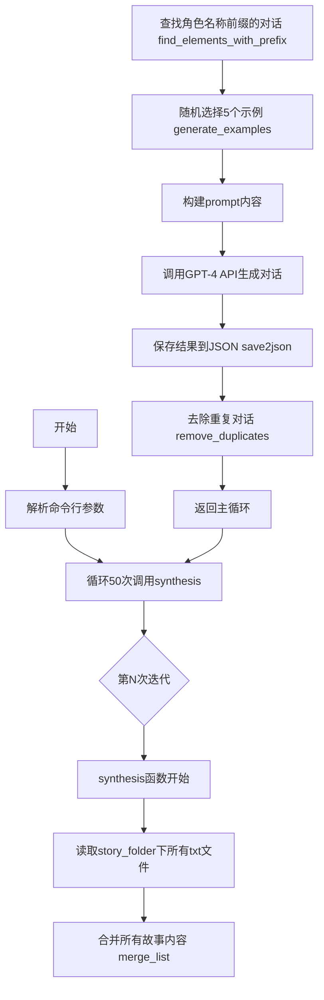
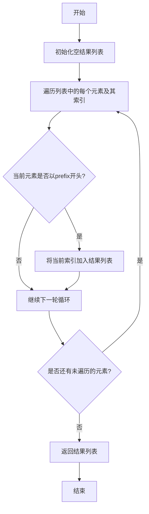
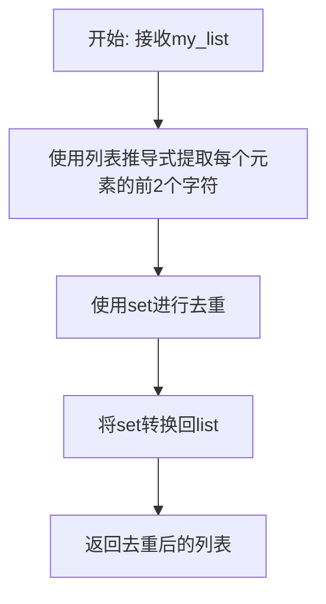
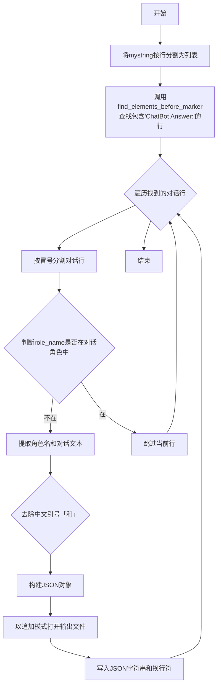
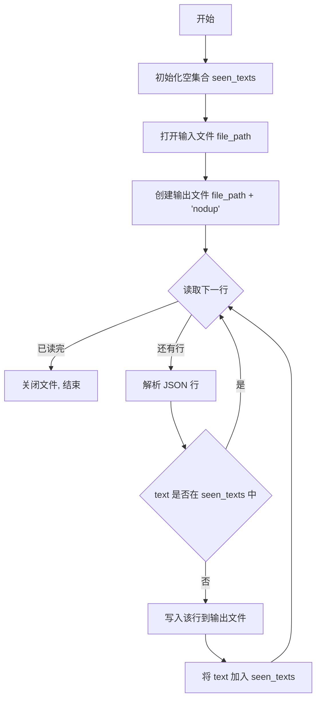
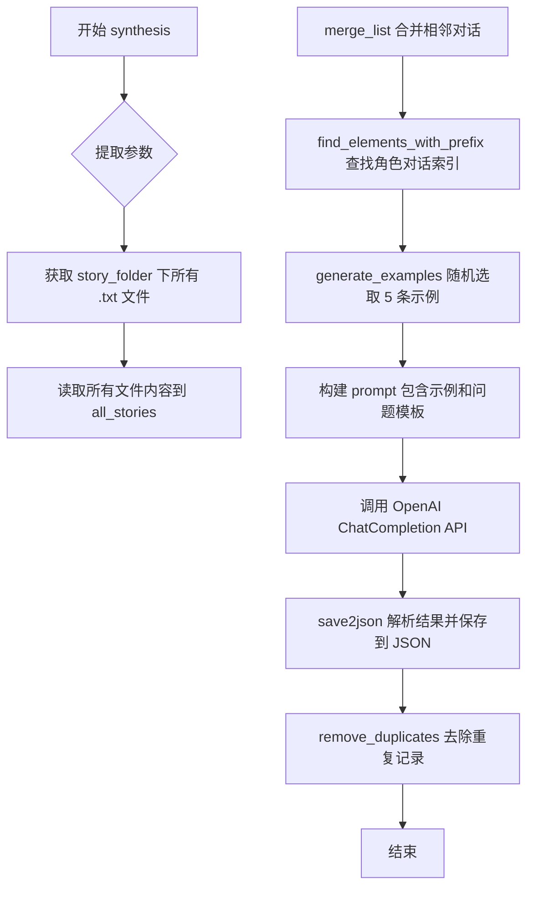

# `Chat-Haruhi-Suzumiya\kyon_generator\synthesis_chat_from_story.py` 详细设计文档

该脚本是一个对话数据生成工具，用于从指定角色的故事文本中提取对话示例，然后调用GPT-4 API生成多样化的测试对话，最终以JSONL格式保存并去重，可用于评估聊天机器人在特定角色扮演场景下的表现。

## 整体流程



## 类结构

```
该脚本采用函数式编程风格，无类定义
所有功能通过全局函数实现
主要函数模块：数据处理、API调用、数据持久化
```

## 全局变量及字段


### `openai.api_base`
    
OpenAI API base URL endpoint for API requests

类型：`str`
    


### `openai.api_key`
    
OpenAI API authentication key concatenated from two parts

类型：`str`
    


### `instruction`
    
System instruction prompt for ChatGPT describing the dialogue generation task

类型：`str`
    


### `requirements`
    
Detailed requirements for generating diverse test dialogues in Chinese

类型：`str`
    


### `role_name`
    
Name of the character role to generate dialogues for

类型：`str`
    


### `world_name`
    
Name of the world or story universe the character belongs to

类型：`str`
    


### `story_folder`
    
File system path to the folder containing story text files

类型：`str`
    


### `output`
    
File system path for the output JSON file to save synthesized dialogues

类型：`str`
    


### `txt_files`
    
List of file paths matching the .txt pattern in the story folder

类型：`list`
    


### `all_stories`
    
List containing all lines read from all story text files

类型：`list`
    


### `merged_stories`
    
Processed list with adjacent entries from same character merged together

类型：`list`
    


### `role_list`
    
List of indices where list elements start with the role name prefix

类型：`list`
    


### `random_examples`
    
List of randomly selected question-answer pairs from role's dialogue history

类型：`list`
    


### `content`
    
Complete prompt string sent to OpenAI API including instruction and examples

类型：`str`
    


### `result`
    
Response object returned from OpenAI ChatCompletion API call

类型：`openai.OpenAIObject`
    


### `lines_list`
    
List of lines split from the API response string by newline characters

类型：`list`
    


### `r_list`
    
List of dialogue lines found immediately before ChatBot Answer markers

类型：`list`
    


### `dialogue`
    
List resulting from splitting a line by colon separator

类型：`list`
    


### `text`
    
Extracted text content from dialogue or JSON object

类型：`str`
    


### `savejson`
    
Dictionary containing role, text, and source keys for JSON serialization

类型：`dict`
    


### `json_string`
    
JSON string representation of savejson dictionary with Unicode support

类型：`str`
    


### `seen_texts`
    
Set tracking unique text values to remove duplicate dialogue entries

类型：`set`
    


### `file_path`
    
File system path to the file being processed for deduplication

类型：`str`
    


### `my_list`
    
Input list parameter in utility functions for processing

类型：`list`
    


### `prefix`
    
String prefix parameter used for filtering list elements

类型：`str`
    


### `index`
    
Integer index counter in list enumeration loops

类型：`int`
    


### `item`
    
Individual element item from list during iteration

类型：`Any`
    


### `mystring`
    
Multi-line string parameter containing raw API response text

类型：`str`
    


### `params`
    
Dictionary of parameters passed to synthesis function

类型：`dict`
    


    

## 全局函数及方法


### `find_elements_with_prefix`

该函数接收一个列表和前缀字符串，返回列表中所有以该前缀开头的元素的索引（位置）组成的列表。

参数：

- `my_list`：`list`，需要进行搜索的列表
- `prefix`：`str`，用于匹配列表元素的前缀字符串

返回值：`list[int]`，返回所有匹配元素的索引（索引从0开始）

#### 流程图



#### 带注释源码

```python
def find_elements_with_prefix(my_list, prefix):
    """
    在列表中查找所有以指定前缀开头的元素的索引
    
    参数:
        my_list: 要搜索的列表
        prefix: 要匹配的前缀字符串
    
    返回:
        包含所有匹配元素索引的列表
    """
    # 使用列表推导式遍历列表，enumerate同时获取索引和元素
    # 如果元素以prefix开头，则将该索引加入结果列表
    return [index for index, item in enumerate(my_list) if item.startswith(prefix)]
```


### `get_all_characters`

该函数用于从输入列表中提取所有唯一的前缀字符（每个元素的前两个字符），常用于从角色对话列表中提取所有角色的名称前缀。

参数：

- `my_list`：`list`，输入的字符串列表，从中提取前两个字符作为角色标识

返回值：`list`，返回去重后的角色前缀列表

#### 流程图



#### 带注释源码

```python
def get_all_characters(my_list):
    """
    从列表中提取所有唯一的前两个字符作为角色标识
    
    参数:
        my_list: 字符串列表，每个元素代表一条对话或文本
        
    返回:
        去重后的角色前缀列表
    """
    # 遍历my_list中的每个item，提取前两个字符
    # 然后使用set去重，最后转回list返回
    return list(set([item[:2] for item in my_list]))
```


### `merge_list`

该函数用于合并列表中具有相同前缀（前2个字符相同）的元素，将它们拼接在一起，并返回合并后的列表。

参数：

- `mylist`：`list`，需要合并的列表

返回值：`list`，合并后的列表

#### 流程图

```mermaid
flowchart TD
    A[开始] --> B[创建merged_list副本]
    B --> C[初始化jumped_index为空列表]
    C --> D[设置cur_value为mylist[0]]
    D --> E{遍历mylist}
    E -->|value[:2] == cur_value[:2]| F[将index加入jumped_index]
    F --> G[合并merged_list[index]和mylist[index]]
    G --> E
    E -->|value[:2] != cur_value[:2]| H[更新cur_value为value]
    H --> E
    E --> I[遍历结束]
    I --> J[将jumped_index中的位置设为空字符串]
    J --> K[重置merged_list[0]为mylist[0]]
    K --> L[过滤空字符串创建filtered_list]
    L --> M[返回merged_list]
```

#### 带注释源码

```python
def merge_list(mylist):
    """
    合并列表中具有相同前缀（前2个字符）的元素
    
    参数:
        mylist: 输入的字符串列表
        
    返回:
        合并后的列表
    """
    # 创建输入列表的副本
    merged_list = [i for i in mylist]
    
    # 记录需要跳过的索引（已被合并的元素）
    jumped_index = []
    # 当前值，初始化为列表第一个元素
    cur_value = mylist[0]
    
    # 遍历列表，找出具有相同前缀的元素进行合并
    for index, value in enumerate(mylist):
        if value[:2] == cur_value[:2]:
            # 如果前2个字符相同，将当前元素合并到已跳过的索引位置
            jumped_index.append(index)
            merged_list[index] = merged_list[index] + mylist[index]
        else:
            # 如果前2个字符不同，更新当前值
            cur_value = value
    
    # 将已被合并的位置设为空字符串
    for i, v in enumerate(merged_list):
        if i in jumped_index:
            merged_list[i] = ""
    
    # 确保第一个元素保持原值
    merged_list[0] = mylist[0]
    
    # 创建过滤后的列表（移除空字符串）
    filtered_list = [item for item in merged_list if item != '']
    
    # 返回合并后的列表（注意：这里返回的是未过滤的merged_list）
    return merged_list
```


### `generate_examples`

该函数从角色对话列表中随机选取指定数量的对话配对样本，每个样本包含当前对话及其前一句对话，用于为聊天机器人测试生成多样化示例。

参数：

- `my_list`：`list`，包含所有合并后故事的对话列表，用于从中提取对话内容
- `role_index`：`list`，整数索引列表，指向该角色在 my_list 中的所有对话位置
- `number`：`int`，需要随机选取的对话样本数量

返回值：`list`，返回对话配对列表，每个元素为 `[前一句对话, 当前对话]` 的二元列表

#### 流程图

```mermaid
flowchart TD
    A[开始 generate_examples] --> B{验证 number <= len(role_index)}
    B -->|是--> C[从 role_index 随机抽取 number 个不重复索引]
    C --> D[遍历每个随机索引 i]
    D --> E[从 my_list 获取 my_list[i-1] 作为前一句]
    D --> F[从 my_list 获取 my_list[i] 作为当前句]
    E --> G[组成配对 [前一句, 当前句]]
    F --> G
    D --> H{处理完所有随机索引?}
    H -->|否--> D
    H -->|是--> I[返回 example_lst 列表]
    B -->|否--> J[抛出异常或返回空列表]
```

#### 带注释源码

```python
def generate_examples(my_list, role_index, number):
    """
    从角色对话列表中随机生成对话配对样本
    
    Args:
        my_list: 包含所有对话的列表，通常是经过 merge_list 处理后的合并对话
        role_index: 角色对话在 my_list 中的所有索引位置列表
        number: 需要生成的样本数量
    
    Returns:
        example_lst: 对话配对列表，每个元素是 [前一句, 当前句] 的二元列表
    """
    # 从 role_index 中随机抽取 number 个不重复的索引
    # random.sample 确保选取的索引不会重复
    random_elements = random.sample(role_index, number)
    
    # 使用列表推导式构建对话配对
    # 对每个随机选取的索引 i，获取 my_list[i-1]（前一句）和 my_list[i]（当前句）
    # 注意：这里假设 role_index 中的索引对应的前一句也是有意义的对话
    example_lst = [[my_list[i-1], my_list[i]] for i in random_elements]
    
    # 返回生成的对话示例列表
    return example_lst
```


### `find_elements_before_marker`

该函数用于在列表中查找指定标记（marker）前面的元素，并返回这些元素组成的列表。它遍历整个列表，当找到与标记匹配的元素时，将其前一个元素添加到结果中，确保不会访问列表开头之前的索引。

参数：

- `lst`：`list`，需要进行搜索的输入列表
- `marker`：`str`，用于匹配的标记元素

返回值：`list`，返回所有在 marker 元素之前出现的元素组成的列表

#### 流程图

```mermaid
flowchart TD
    A[开始] --> B[初始化空结果列表]
    B --> C[遍历列表索引 i 从 0 到 len lst-1]
    C --> D{判断 lst[i] == marker}
    D -->|是| E{判断 i > 0}
    D -->|否| F{i = i + 1}
    E -->|是| G[将 lst[i-1] 添加到结果列表]
    E -->|否| F
    G --> F
    F --> H{是否还有未遍历的索引}
    H -->|是| C
    H -->|否| I[返回结果列表]
    I --> J[结束]
```

#### 带注释源码

```python
def find_elements_before_marker(lst, marker):
    """
    在列表中查找指定标记前面的元素
    
    参数:
        lst: 输入列表
        marker: 要匹配的标记元素
    
    返回:
        包含所有在 marker 之前出现的元素的列表
    """
    result = []  # 初始化结果列表
    for i in range(len(lst)):  # 遍历列表的每个索引
        if lst[i] == marker:  # 如果当前元素等于标记
            if i > 0:  # 确保不是列表的第一个元素（避免索引越界）
                result.append(lst[i - 1])  # 将标记前的元素加入结果
    return result  # 返回结果列表
```


### `save2json`

该函数用于将LLM生成的对话文本解析并保存为JSONL格式，每行包含角色名称、对话文本和来源标记。

参数：

- `role_name`：`str`，角色名称，用于过滤不属于该角色的对话
- `mystring`：`str`，LLM生成的原始对话文本，包含多行对话内容
- `output`：`str`，输出文件路径，JSONL格式的对话数据将追加写入此文件

返回值：`None`，该函数无返回值，仅执行文件写入操作

#### 流程图



#### 带注释源码

```python
def save2json(role_name, mystring, output):
    """
    将LLM生成的对话文本解析并保存为JSONL格式
    
    参数:
        role_name: 角色名称，用于过滤不属于该角色的对话
        mystring: LLM生成的原始对话文本
        output: 输出文件路径
    
    返回:
        None
    """
    pass  # 占位符，无实际作用
    # 步骤1: 将输入字符串按行分割成列表
    lines_list = mystring.splitlines()
    
    # 步骤2: 查找所有包含"ChatBot Answer:"标记的行（即用户问题前一行）
    r_list = find_elements_before_marker(lines_list, "ChatBot Answer:")
    
    # 步骤3: 遍历每个找到的对话行
    for i in r_list:
        # 按冒号分割，获取角色名和对话内容
        dialogue = i.split(":")
        
        # 步骤4: 过滤不属于指定角色的对话
        if (role_name not in dialogue[0]):
            # 提取角色名称
            role = dialogue[0]
            
            # 步骤5: 去除中文引号「和」
            if "「" in dialogue[1]:
                text = dialogue[1].replace("「","")
            if "」" in dialogue[1]:
                text = text.replace("」","")
            
            # 步骤6: 构建JSON对象，包含角色、文本和来源
            savejson = {"role": f"{role}", "text": f"{text}","source":"synthesized"}
            
            # 步骤7: 将JSON对象序列化为字符串
            json_string = json.dumps(savejson, ensure_ascii=False)
            
            # 步骤8: 以追加模式打开文件并写入
            with open(output, "a", encoding='utf-8') as file:
                file.write(json_string + "\n")
```


### `remove_duplicates`

该函数用于读取一个 JSONL（JSON Lines）格式的文件，去除其中 `text` 字段重复的行，并将去重后的结果写入原文件名加上 "nodup" 后缀的新文件中。

#### 参数

- `file_path`：`str`，需要去重的 JSONL 文件路径

#### 返回值

`None`，该函数没有返回值（返回类型为 `None`）

#### 流程图



#### 带注释源码

```python
def remove_duplicates(file_path):
    """
    去除 JSONL 文件中 text 字段重复的行
    参数:
        file_path: str, 输入的 JSONL 文件路径
    返回:
        None
    """
    pass  # 占位符，无实际作用
    seen_texts = set()  # 用于存储已见过的 text 内容
    
    # 打开输入文件（UTF-8 编码）
    with open(file_path, encoding='utf-8') as f_in:
        # 打开输出文件，文件名 = 原文件名 + "nodup"
        with open(file_path+"nodup", 'w', encoding='utf-8') as f_out:
            # 逐行读取输入文件
            for line in f_in:
                # 将每行解析为 JSON 对象
                obj = json.loads(line)
                # 提取 text 字段
                text = obj['text']
                # 如果该 text 未出现过
                if text not in seen_texts:
                    # 写入原行到输出文件
                    f_out.write(line)
                    # 将 text 加入已见集合
                    seen_texts.add(text)
```


### `synthesis`

该函数是代码的核心功能模块，用于根据指定角色和故事文本，通过 OpenAI GPT-4 API 自动生成多样化的测试对话，并保存为 JSON 格式。

参数：

- `**params`：`dict`，可变关键字参数，包含以下键值对：
  - `role_name`：`str`，角色名称，用于筛选故事中该角色的对话
  - `world_name`：`str`，作品/世界名称，用于生成测试指令的上下文
  - `story_folder`：`str`，故事文本文件夹路径，包含多个 `.txt` 文件
  - `output`：`str`，输出 JSON 文件的路径

返回值：`None`，该函数无返回值，通过文件 IO 产生副作用

#### 流程图



#### 带注释源码

```python
def synthesis(**params):
    """
    使用 OpenAI GPT-4 API 根据角色故事文本生成测试对话
    
    参数通过 **params 传入，包含:
        role_name: 角色名称
        world_name: 作品世界名称
        story_folder: 故事文本文件夹路径
        output: 输出 JSON 文件路径
    """
    pass  # 占位符，无实际作用
    
    # 从参数字典中提取各参数值
    if (params.get("role_name")):
        role_name = params["role_name"]
    if (params.get("world_name")):
        world_name = params["world_name"]
    if (params.get("story_folder")):
        story_folder = params["story_folder"]
    if (params.get("output")):
        output = params["output"]
    
    # 使用 glob 模块获取指定文件夹下所有 .txt 文件路径
    txt_files = glob.glob(os.path.join(story_folder, '*.txt'))
    
    all_stories = []
    # 遍历所有 txt 文件，读取内容并追加到 all_stories 列表
    for txt_file in txt_files:
        with open(txt_file, 'r', encoding='utf-8') as file:
            content = file.readlines()
            all_stories += content
    
    # 合并相邻的同角色对话，减少碎片化
    merged_stories = merge_list(all_stories)

    # 查找所有以角色名开头的对话索引
    role_list = find_elements_with_prefix(merged_stories, role_name)
    
    # 随机生成 5 个对话示例用于 few-shot 学习
    random_examples = generate_examples(merged_stories, role_list, 5)
    print(random_examples)
    
    # 构建提示词内容，从 requirements 模板开始
    content = requirements
    # 将随机示例格式化为 Question/Answer 对
    for i in random_examples:
        if (len(i[0]) < 10 or len(i[1]) < 10):
            continue  # 跳过过短的对话
        content += "\n"
        content += "###"
        content += "\n"
        content += "Question:"
        content += "\n"
        content += i[0]
        content += "ChatBot Answer:"
        content += "\n"
        content += i[1]
    content += "\n"
    content += "###"
    content += "\n"
    content += "Question:"
    
    # 调用 OpenAI ChatCompletion API 生成新对话
    result = openai.ChatCompletion.create(
        model="gpt-4",
        messages=[
            {"role": "system", "content": instruction},
            {"role": "user", "content": content},
        ],
        temperature = 0.1  # 低温度系数，保持输出稳定性
    )
    
    # 解析 API 返回结果并保存到 JSON 文件
    save2json(role_name, result['choices'][0]['message']['content'], output)
    
    # 去除重复的对话记录
    remove_duplicates(output)
```

## 关键组件


### 文本合并与预处理模块

负责读取故事文件夹中的所有文本文件，将相邻的相同角色对话进行合并处理，并支持按角色名前缀筛选文本段落。

### 对话生成与API调用模块

整合OpenAI GPT-4模型能力，根据角色名称、世界背景和随机选取的故事样例，自动生成多样化的测试对话内容。

### 数据持久化与去重模块

将生成的对话结果保存为JSONL格式，并支持对重复对话进行自动去重处理，确保输出数据的唯一性。

### 随机样例选取模块

从合并后的故事文本中，随机选取指定数量的角色对话作为GPT-4生成的上下文示例，确保测试数据的多样性和代表性。

### 命令行参数解析模块

通过argparse定义并解析role_name、world_name、story_folder和output四个核心参数，支持脚本的灵活调用和配置。

### 文本查找与索引模块

提供按前缀查找元素、获取所有角色名称、查找标记前元素等功能，支撑故事文本的结构化处理逻辑。


## 问题及建议


### 已知问题

- **硬编码API密钥**：API密钥和端点直接写在代码中，存在严重的安全风险
- **错误处理不足**：使用裸`except:`捕获所有异常且不记录日志，无法追踪失败原因
- **未使用的代码**：大量被注释的代码（如`merge_list`函数中的注释段落）未清理
- **文件覆盖问题**：`synthesis`函数中每次调用`save2json`都使用`"a"`模式追加，但`remove_duplicates`在循环外只执行一次，导致每次循环都重新去重，整个流程会被执行50次
- **字符串处理bug**：`save2json`函数中同时存在`「`和`」`的替换逻辑有缺陷，当只有其中一个符号时会出错
- **缺少参数验证**：命令行参数未验证文件路径是否存在、未检查必需参数是否为空
- **魔法数字**：随机选取5个样本、循环50次等硬编码数字缺乏说明
- **函数定义与实现分离**：部分函数（如`save2json`、`remove_duplicates`）定义中只有`pass`，实际逻辑在后面，与Python风格不符
- **缺少类型注解**：所有函数和变量都缺少类型提示，降低可维护性
- **没有日志记录**：没有任何日志输出，生产环境无法调试和问题追踪

### 优化建议

- 将API密钥和敏感配置移至环境变量或配置文件
- 使用结构化日志记录（`logging`模块）替换`print`语句
- 为所有异常处理添加具体异常类型和错误日志
- 清理所有被注释的代码段落
- 在`save2json`中修复字符串替换逻辑，使用`replace`链式调用
- 添加参数验证：检查`story_folder`路径存在性、`output`路径可写性
- 将魔法数字提取为配置常量或命令行参数
- 为关键函数添加类型注解（使用`typing`模块）
- 使用`pathlib`替代`os.path`提升路径处理可读性
- 考虑将`remove_duplicates`移至循环内部或使用生成器避免重复处理

## 其它


### 设计目标与约束

**设计目标：**
- 自动从故事文本中提取对话样本
- 利用GPT-4生成多样化的测试对话，用于评估特定角色聊天机器人
- 支持批量生成，去除重复内容，确保数据质量

**约束条件：**
- 依赖OpenAI GPT-4 API，需要有效的API密钥
- 输入故事文本必须是UTF-8编码的TXT文件
- 输出为JSON Lines格式，每行一个JSON对象
- 需要网络连接才能调用OpenAI API
- 单次运行最多尝试50次生成（循环控制）

### 错误处理与异常设计

**异常处理机制：**
- 网络异常捕获：main函数中使用try-except捕获所有异常，继续循环尝试
- 文件读写异常：通过编码指定'utf-8'，使用with语句确保资源释放
- JSON解析异常：remove_duplicates函数中无异常处理，可能导致程序崩溃
- API调用异常：synthesis函数无try-except，API调用失败会导致整个脚本停止

**当前问题：**
- 全局异常捕获过于宽泛，隐藏了真实错误信息
- 无重试机制，API调用失败直接跳过
- 无日志记录，调试困难
- remove_duplicates中的json.loads无异常保护

### 数据流与状态机

**数据流转过程：**
1. **输入阶段**：读取story_folder下所有.txt文件 → 合并为all_stories列表
2. **预处理阶段**：merge_list合并相邻同角色对话 → find_elements_with_prefix定位角色对话索引
3. **采样阶段**：generate_examples随机选取5对对话样本
4. **生成阶段**：构建prompt调用GPT-4 API → 获得10条新对话
5. **后处理阶段**：save2json解析结果写入JSON → remove_duplicates去重

**关键状态：**
- all_stories：原始对话列表
- merged_stories：合并后的对话列表
- role_list：目标角色对话索引列表
- random_examples：随机选取的对话样本对
- content：最终发送给GPT-4的完整prompt

### 外部依赖与接口契约

**外部依赖：**
- `openai`库：用于调用GPT-4 API
- `argparse`：命令行参数解析
- `glob`：文件路径匹配
- `os`：操作系统接口
- `random`：随机数生成
- `json`：JSON序列化

**接口契约：**
- synthesis函数：接收role_name, world_name, story_folder, output四个参数
- 命令行参数：--role_name, --world_name, --story_folder, --output（均为必需参数）
- API配置：openai.api_base和openai.api_key需要在脚本中硬编码

### 配置文件与常量

**硬编码配置（存在安全风险）：**
- API端点：http://api.ai-gaochao.com/v1
- API密钥：直接明文写在代码中（严重安全风险）
- 指令模板：instruction和requirements字符串常量
- 温度参数：temperature=0.1（用于控制生成随机性）

### 性能优化建议

**当前性能瓶颈：**
- 串行处理：50次生成请求顺序执行，效率低下
- 重复读取：每次synthesis调用都重新读取所有文件
- 内存占用：all_stories列表可能包含大量文本数据

**优化方向：**
- 使用asyncio或线程池实现并行API调用
- 缓存已读取的故事文本
- 使用生成器替代列表推导式减少内存占用

### 安全审计问题

**严重安全问题：**
- API密钥明文硬编码在源代码中
- API密钥直接拼接，无任何保护
- 密钥长度和格式无验证
- 无访问控制，任何人都可使用该密钥

**建议改进：**
- 使用环境变量存储API密钥
- 使用配置文件或密钥管理服务
- 添加密钥有效性检查
- 实现密钥轮换机制

### 测试与验证建议

**测试覆盖：**
- 单元测试：各函数独立测试（find_elements_with_prefix, merge_list等）
- 集成测试：完整流程测试（需要Mock OpenAI API）
- 边界测试：空文件、单行文件、特殊字符处理

**验证要点：**
- 输出JSON格式正确性
- 去重功能有效性
- 随机采样分布均匀性
- 中文编码处理正确性
</content>
    