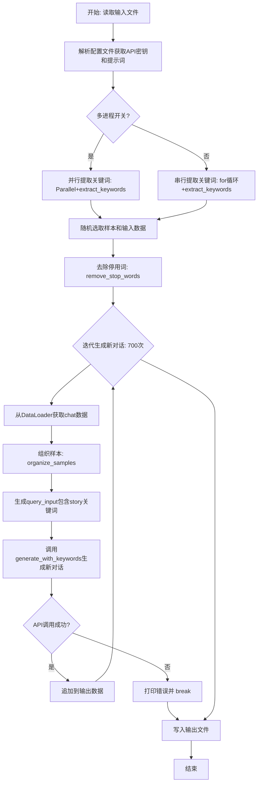
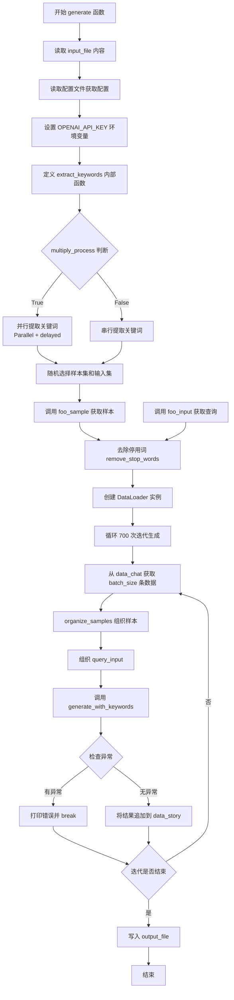
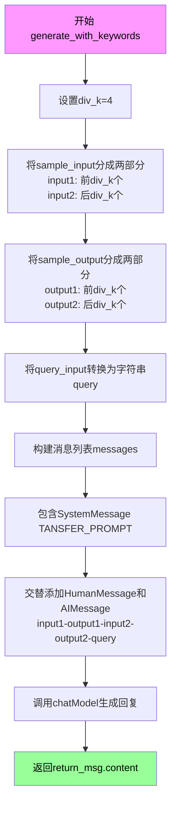
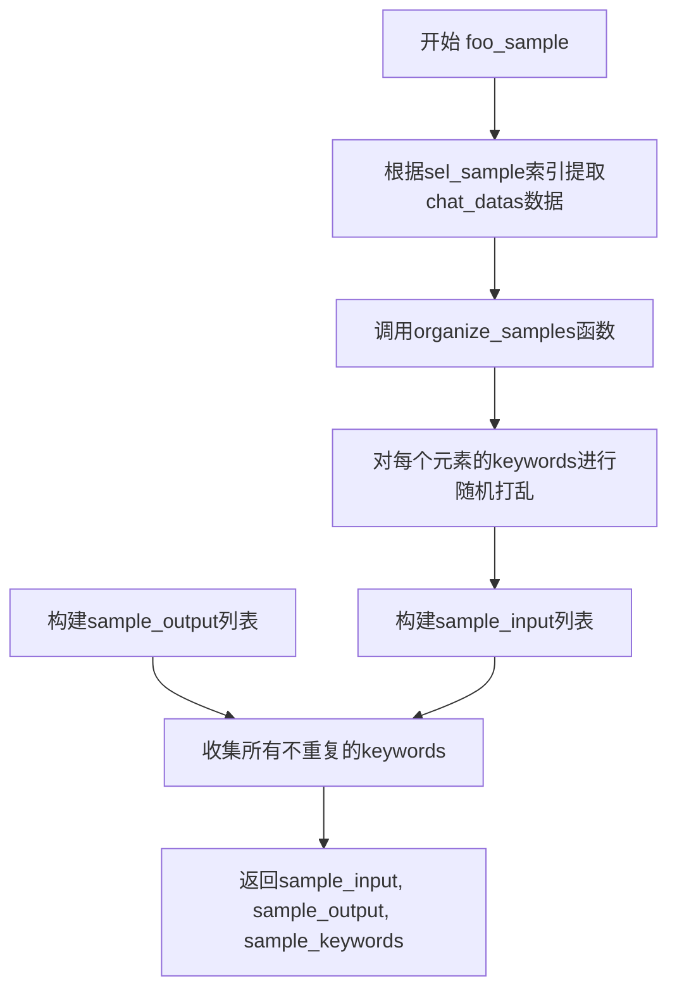
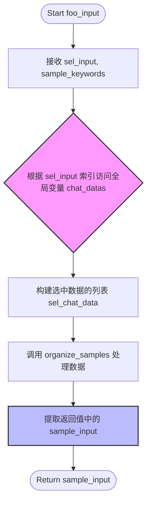
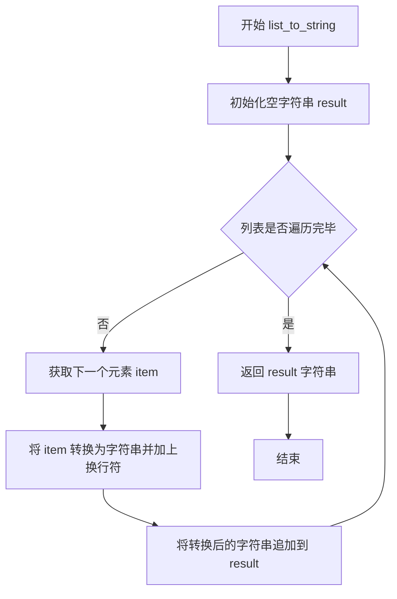
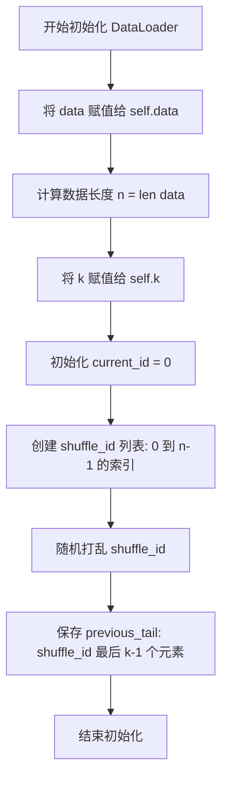
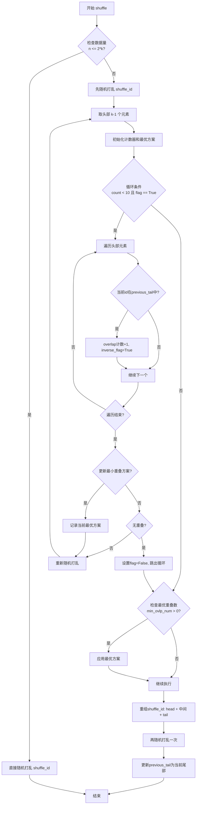

# `Chat-Haruhi-Suzumiya\kyon_generator\synthesis_chat_method_foo.py` 详细设计文档

该代码是Chat凉宫春日项目的数据增强模块，通过调用OpenAI的ChatGPT API从输入对话中提取关键词，然后基于这些关键词和预设模板生成新的对话内容，实现对训练数据的扩充。

## 整体流程



## 类结构

```
DataLoader (数据加载器类)
└── 用于批量加载和打乱训练数据
```

## 全局变量及字段


### `chatModel`
    
全局ChatGPT模型实例

类型：`ChatOpenAI`
    


### `keyword_list`
    
全局关键词列表(未使用)

类型：`List`
    


### `role_list`
    
全局角色列表(未使用)

类型：`List`
    


### `OPENAI_API_KEY`
    
OpenAI API密钥，从配置中读取

类型：`str`
    


### `stop_words`
    
停用词列表，用于过滤关键词

类型：`List[str]`
    


### `input1`
    
配置中的输入示例1，用于few-shot学习

类型：`str`
    


### `output1`
    
配置中的输出示例1，用于few-shot学习

类型：`str`
    


### `input2`
    
配置中的输入示例2，用于few-shot学习

类型：`str`
    


### `output2`
    
配置中的输出示例2，用于few-shot学习

类型：`str`
    


### `KEYWORD_PROMPT`
    
关键词提取提示词模板

类型：`str`
    


### `TANSFER_PROMPT`
    
文本转换提示词模板

类型：`str`
    


### `DataLoader.data`
    
输入数据列表

类型：`List`
    


### `DataLoader.n`
    
数据长度

类型：`int`
    


### `DataLoader.k`
    
批次大小

类型：`int`
    


### `DataLoader.current_id`
    
当前读取位置

类型：`int`
    


### `DataLoader.shuffle_id`
    
打乱后的索引

类型：`List`
    


### `DataLoader.previous_tail`
    
上次的尾部索引

类型：`List`
    
    

## 全局函数及方法


### `generate`

核心函数，使用LLM方法将input_file（包含对话数据的jsonl文件）进行数据增广，生成增强后的jsonl文件保存到output_file。该函数通过提取关键词、组织样本、使用LangChain调用OpenAI API进行上下文感知的对话生成。

参数：

- `input_file`：`str`，输入的jsonl文件路径，包含待增广的对话数据
- `output_file`：`str`，输出的jsonl文件路径，用于保存增广后的数据
- `additional_config`：`str`，配置文件路径，默认为None，用于读取API密钥和prompt配置

返回值：`None`，无返回值，结果直接写入output_file

#### 流程图



#### 带注释源码

```python
def generate(input_file, output_file, additional_config=None):
    """
    核心函数，使用foo方法将input_file生成增广的jsonl文件保存到output_file
    """
    # 1. 读取输入文件内容
    with open(input_file, 'r',encoding = 'utf-8') as f:
        data = f.read()
    
    # 2. 获取配置信息
    config = ConfigParser()
    config.read(additional_config)
    
    # 设置OpenAI API密钥
    os.environ["OPENAI_API_KEY"] = config['Synthesis']['OPENAI_API_KEY']
    
    # 从配置读取停用词列表
    stop_words = config['Synthesis']['stop_words'].split(',')
    
    # 读取示例输入输出和Prompt模板
    input1 = config['Synthesis']['input1']
    output1 = config['Synthesis']['output1']
    input2 = config['Synthesis']['input2']
    output2 = config['Synthesis']['output2']
    KEYWORD_PROMPT = config['Synthesis']['KEYWORD_PROMPT']
    TANSFER_PROMPT = config['Synthesis']['TANSFER_PROMPT']
 
    # 3. 定义内部函数：提取关键词
    def extract_keywords( new_query ):
        # 构建消息列表，包含System示例和HumanMessage
        messages = [
            SystemMessage(content=KEYWORD_PROMPT),
            HumanMessage(content=input1),
            AIMessage(content=output1),
            HumanMessage(content=input2),
            AIMessage(content=output2)
        ]
        # 添加待处理的查询文本
        messages.append(HumanMessage(content=new_query['text']))
        
        # 调用Chat模型获取响应
        return_msg = chatModel(messages)
        response = return_msg.content
        # 将提取的关键词添加到查询对象中
        new_query['keywords'] = response['Entity']

    # 4. 并行或串行处理数据提取关键词
    multiply_process = True  # 在测试的时候可以改成False
    if multiply_process:  # 并行运行
        # 使用joblib并行处理，利用CPU核心
        Parallel(n_jobs=max(os.cpu_count() - 1, 1))(
                delayed(extract_keywords)(item)
                for item in tqdm(data)
                )
    else:  # 串行运行
        for item in tqdm(data):
            extract_keywords(item)
 

    
    # 5. 随机选择样本和输入数据
    n = len(data)
    sel_all = random.sample(range(0, n), 20)  # 随机选择20个索引
    sel_sample = sel_all[:10]  # 前10个作为样本
    sel_input = sel_all[10:]   # 后10个作为输入
    
    # 调用foo_sample获取样本数据
    sample_input, sample_output, sample_keywords = foo_sample(sel_sample)
    # 调用foo_input获取查询输入
    query_input = foo_input(sel_input, sample_keywords)

    # 6. 去除停用关键词
    data = remove_stop_words(data, stop_words)
    sample_keywords = remove_stop_words(sample_keywords, stop_words)


    # 7. 定义内部函数：使用关键词生成内容
    def generate_with_keywords( sample_input, sample_output, query_input ):
        div_k = 4  # 分割点
        # 将样本输入输出按分割点分组
        input1 = list_to_string( sample_input[:div_k] )
        output1 = list_to_string( sample_output[:div_k] )
        input2 = list_to_string( sample_input[div_k:] )
        output2 = list_to_string( sample_output[div_k:] )

        query = list_to_string(query_input)

        # 构建消息模板
        messages = [
            SystemMessage(content=TANSFER_PROMPT),
            HumanMessage(content=input1),
            AIMessage(content=output1),
            HumanMessage(content=input2),
            AIMessage(content=output2),
            HumanMessage(content=query)
        ]
        # 调用Chat模型生成内容
        return_msg = chatModel(messages)
        return return_msg.content   
    

    # 8. 创建DataLoader用于数据迭代
    # data_story: 故事关键词数据加载器
    data_story = DataLoader(sample_keywords, 10)
    # data_chat_as_story: 将聊天数据作为故事的数据加载器
    data_chat_as_story = DataLoader(data, 10)
    # data_chat: 聊天数据加载器
    data_chat = DataLoader(data, 10)


    batch_size = 10
    # 9. 循环迭代生成内容（700次）
    for iter_time in tqdm(range(700),desc='autoGenerating'):

        chat_data = []

        # 获取一批聊天数据
        for _ in range(batch_size):
            chat_data.append( data_chat.get_data() )

        # 组织样本
        sample_input, sample_output, sample_keywords = organize_samples(chat_data)

        # 组织query_input
        query_input = []

        # 为每个输入组织查询关键词
        for input in sample_input:
            target_n = len( input['keywords'] )
            target_n = max(2, target_n )  # 至少2个关键词

            count_time = 0
            max_len = -999
            max_len_plan = []

            # 循环尝试找到足够的关键词
            while count_time < 15:
                count_time = count_time + 1
                # 交替从故事数据或聊天数据中获取关键词
                if iter_time % 2 == 0:
                    story_keyword = data_story.get_data()
                else:
                    story_keyword = data_chat_as_story.get_data()

                # 过滤掉已在样本中的关键词
                filtered_keyword = [w for w in story_keyword["keywords"] if w not in sample_keywords]
                if len(filtered_keyword) >= target_n:
                    # 随机选择目标数量的关键词
                    story_keyword['keywords'] = random.sample(filtered_keyword, min(target_n, len(filtered_keyword)))
                    break
                else:
                    # 记录最长候选方案
                    if len(filtered_keyword)>max_len:
                        max_len = len(filtered_keyword)
                        max_len_plan = filtered_keyword.copy()

            # 如果找不到足够的关键词，使用最长候选方案
            if len(story_keyword['keywords'] ) < target_n:
                story_keyword['keywords'] = max_len_plan
            
            # 添加到query_input
            query_input.append( {'keywords':story_keyword['keywords']} )

            # 更新样本关键词集合
            for keyword in story_keyword['keywords']:
                sample_keywords.append(keyword)

        # 10. 调用生成函数，带异常处理
        try:
            response = generate_with_keywords(sample_input, sample_output, query_input)
        except Exception as e:
            print(f"An error occurred while running the script: {e}")
            break


    # 11. 写入输出文件
    with open(output_file, 'w') as f:
        # 将增广数据写入output_file
        f.write(data)
```


### `generate.extract_keywords`

该内部函数用于调用OpenAI Chat模型，从输入文本中提取关键词。它通过构建包含系统提示、示例输入输出以及待处理文本的消息列表，发送给语言模型，并将提取的关键词结果直接更新到输入字典的 `keywords` 字段中。

参数：

- `new_query`：`Dict`，待处理的查询字典，必须包含 `text` 字段，函数执行后会添加 `keywords` 字段

返回值：`None`，该函数直接修改传入字典的内容，无返回值

#### 流程图

```mermaid
flowchart TD
    A[开始 extract_keywords] --> B[构建消息列表]
    B --> C[添加系统提示 KEYWORD_PROMPT]
    C --> D[添加示例1: input1 + output1]
    D --> E[添加示例2: input2 + output2]
    E --> F[添加用户查询 new_query.text]
    F --> G[调用 chatModel 发送消息]
    G --> H[获取模型返回内容]
    H --> I[提取 response['Entity']]
    I --> J[更新 new_query['keywords']]
    J --> K[结束]
```

#### 带注释源码

```python
def extract_keywords( new_query ):
    """
    内部函数：调用API提取关键词
    参数:
        new_query: Dict，包含'text'字段的查询字典，执行后添加'keywords'字段
    返回:
        无返回值，直接修改new_query字典
    """
    # 构建消息列表，包含系统提示和Few-shot示例
    messages = [
        # 系统消息：定义任务要求
        SystemMessage(content=KEYWORD_PROMPT),
        # 第一个示例：输入
        HumanMessage(content=input1),
        # 第一个示例：输出
        AIMessage(content=output1),
        # 第二个示例：输入
        HumanMessage(content=input2),
        # 第二个示例：输出
        AIMessage(content=output2)
    ]
    # 将待处理的文本作为用户消息追加
    messages.append(HumanMessage(content=new_query['text']))
    
    # 调用ChatOpenAI模型获取响应
    return_msg = chatModel(messages)
    
    # 从响应内容中提取Entity字段作为关键词
    # 注意：此处response被当作字典访问，但content是字符串
    # 可能存在潜在bug：应该先json.loads或直接使用return_msg.content
    response = return_msg.content
    new_query['keywords'] = response['Entity']
```


### `generate_with_keywords`

这是一个内部函数，调用ChatOpenAI API基于示例输入、示例输出和查询关键词生成新的对话内容。该函数通过few-shot learning方式，利用预先定义的TANSFER_PROMPT模板和示例数据，引导模型生成符合凉宫春日风格的新对话。

参数：

- `sample_input`：`List[Dict]`，包含示例输入的列表，每个元素是一个字典，其中包含`keywords`键
- `sample_output`：`List[Dict]`，包含示例输出的列表，每个元素包含`keywords`、`role`和`text`键
- `query_input`：`List[Dict]`，查询输入列表，每个元素包含`keywords`键，用于指定需要生成对话的关键词

返回值：`str`，返回模型生成的对话内容字符串

#### 流程图



#### 带注释源码

```python
def generate_with_keywords( sample_input, sample_output, query_input ):
    """
    内部函数：使用few-shot learning方式调用API生成新对话
    
    参数:
        sample_input: 示例输入列表，包含关键词
        sample_output: 示例输出列表，包含关键词、角色和文本
        query_input: 查询输入列表，包含要生成的关键词
    返回:
        模型生成的对话内容字符串
    """
    # 将示例数据分成两组进行few-shot学习
    div_k = 4
    
    # 取前div_k个示例作为第一组输入输出对
    input1 = list_to_string( sample_input[:div_k] )
    output1 = list_to_string( sample_output[:div_k] )
    
    # 取剩余示例作为第二组输入输出对
    input2 = list_to_string( sample_input[div_k:] )
    output2 = list_to_string( sample_output[div_k:] )

    # 将查询输入转换为字符串格式
    query = list_to_string(query_input)

    # 构建消息列表，使用few-shot prompting
    messages = [
        # 系统消息：包含TANSFER_PROMPT指令
        SystemMessage(content=TANSFER_PROMPT),
        # 第一组示例：人类消息+AI消息
        HumanMessage(content=input1),
        AIMessage(content=output1),
        # 第二组示例：人类消息+AI消息
        HumanMessage(content=input2),
        AIMessage(content=output2),
        # 实际查询：需要模型生成的内容
        HumanMessage(content=query)
    ]
    
    # 调用ChatOpenAI模型获取响应
    return_msg = chatModel(messages)
    
    # 返回模型生成的内容
    return return_msg.content   
```


### `foo_sample`

从给定的索引列表中选取样本数据，通过调用organize_samples函数将原始聊天数据转换为训练所需的输入、输出和关键词格式。

参数：

- `sel_sample`：`List[int]`，要选取的样本索引列表，用于从chat_datas全局变量中提取对应的聊天数据

返回值：`Tuple[List[Dict], List[Dict], List[str]]`，返回三个元素的元组：
- `sample_input`：样本输入列表，每个元素是包含关键词的字典
- `sample_output`：样本输出列表，每个元素包含关键词、角色和文本信息
- `sample_keywords`：所有样本关键词的去重列表

#### 流程图



#### 带注释源码

```python
def foo_sample(sel_sample):
    """
    选取样本数据函数
    
    参数:
        sel_sample: List[int] - 样本索引列表，用于从chat_datas中选取数据
    
    返回:
        Tuple[List[Dict], List[Dict], List[str]] - 
            sample_input: 样本输入列表
            sample_output: 样本输出列表  
            sample_keywords: 所有关键词列表
    """
    # 根据索引列表从全局chat_datas中提取对应的聊天数据
    sel_chat_data = [chat_datas[i] for i in sel_sample]

    # 调用organize_samples函数组织样本数据
    sample_input, sample_output, sample_keywords = organize_samples(sel_chat_data)

    # 返回处理后的样本输入、样本输出和关键词
    return sample_input, sample_output, sample_keywords
```


### `foo_input`

该函数根据传入的索引列表从全局聊天数据中检索对应的记录，并利用 `organize_samples` 方法将其整理为模型所需的输入格式（Sample Input），同时忽略传入的关键词列表参数。

参数：
- `sel_input`：`List[int]`，待选取数据的索引列表，通常来源于随机生成的索引范围。
- `sample_keywords`：`List[str]`，从样本中提取的关键词列表（**注意：该参数在函数体中未被使用，属于冗余参数**）。

返回值：`List[Dict]`，格式化后的样本输入列表，包含关键词等结构化信息，用于后续的对话生成。

#### 流程图



#### 带注释源码

```python
def foo_input(sel_input, sample_keywords):
    """
    根据索引选取输入数据。
    
    注意：参数 sample_keywords 在当前实现中未被使用。
    """
    # 使用列表推导式，根据 sel_input 中的索引从全局数据源 chat_datas 中取出对应的聊天记录
    # chat_datas 应该是预先加载到内存中的聊天数据列表
    sel_chat_data = [chat_datas[i] for i in sel_input]

    # 将选中的聊天数据传入 organize_samples 函数进行格式化
    # 该函数返回一个元组：(sample_input, sample_output, all_keywords)
    # 这里我们只取第一个返回值 sample_input，丢弃了 output 和 keywords
    sample_input, _ , _ = organize_samples(sel_chat_data)

    # 返回组织好的样本输入数据
    return sample_input
```

### 潜在的技术债务或优化空间

1.  **冗余参数**：函数签名中包含了参数 `sample_keywords`，但在函数体内完全没有使用此参数。这导致调用处的代码逻辑看起来不完整（传入了参数但未起作用），可能是开发遗留或逻辑缺失。建议移除该参数或补充其实际用途。
2.  **全局状态依赖**：函数内部直接引用了全局变量 `chat_datas`，而没有将其作为参数传入。这降低了函数的独立性和可测试性，在多线程或并行处理时（如代码中使用的 `Parallel`）可能导致作用域混淆或数据不同步。
3.  **返回值部分丢弃**：调用 `organize_samples` 获取了三个返回值，但只使用了第一个。虽然这是 `foo_input` 的设计目的（只取 input），但这种“获取全量再丢弃”的模式在数据量大的情况下可能存在轻微的性能浪费（尽管微乎其微）。


### `list_to_string`

这是一个简单的工具函数，用于将列表中的所有元素转换为带有换行符的字符串格式。

参数：

- `lst`：`List[Any]`，输入的列表对象，列表中的元素可以是任意类型

返回值：`str`，返回拼接后的字符串，每个元素后跟一个换行符 `\n`

#### 流程图



#### 带注释源码

```python
def list_to_string(lst):
    """
    将输入列表转换为字符串表示
    参数:
        lst: 输入的列表，元素可以是任意可转换为字符串的类型
    返回:
        返回拼接后的字符串，每个元素后跟换行符
    """
    result = ''  # 初始化空字符串用于存储结果
    for item in lst:  # 遍历列表中的每个元素
        result += str(item) + '\n'  # 将元素转为字符串并添加换行符后拼接
    return result  # 返回拼接完成的字符串
```

---

#### 设计说明

| 项目 | 说明 |
|------|------|
| **设计目标** | 提供一种简单的方式将列表数据格式化为文本形式，适用于构造聊天模型的输入prompt |
| **调用场景** | 在 `generate_with_keywords` 函数中用于将 sample_input、sample_output 和 query_input 列表格式化为符合对话格式的字符串 |
| **技术债务** | 使用 `+=` 字符串拼接在列表较长时效率较低，建议使用 `join()` 方法优化 |
| **边界情况** | 空列表将返回空字符串；列表元素为复杂对象时会调用其 `__str__` 方法 |


### `remove_stop_words`

该函数用于从数据集中移除预定义的停用词，过滤掉每个数据项中包含的停用关键词，保留非停用词部分。

参数：

- `data`：`List[Dict]`，包含 `keywords` 字段的数据列表，每个元素为一个字典，需确保包含 `keywords` 键
- `stop_words`：`List[str]`，停用词列表，用于指定需要过滤掉的关键词

返回值：`List[Dict]`，返回过滤后的数据列表，每个元素的 `keywords` 字段已移除停用词

#### 流程图

```mermaid
flowchart TD
    A[开始 remove_stop_words] --> B[将 stop_words 转换为 set 集合]
    B --> C{遍历 data 中的每个 item}
    C -->|遍历项| D[对 item['keywords'] 进行过滤]
    D --> E[保留不在 stop_words_set 中的关键词]
    C --> F[返回过滤后的 data]
    E --> C
    F --> G[结束]
```

#### 带注释源码

```python
def remove_stop_words(data, stop_words):
    """
    去除数据中的停用词
    
    参数:
        data: 包含关键词的数据列表，每个元素应为包含 'keywords' 键的字典
        stop_words: 停用词列表，用于过滤的关键词
    
    返回:
        过滤后的数据列表
    """
    # 将停用词列表转换为集合，提升查找效率（O(1) vs O(n)）
    stop_words_set = set(stop_words)
    
    # 遍历数据集中的每一项
    for item in data:
        # 使用列表推导式过滤关键词，只保留不在停用词集合中的词
        # 移除 item["keywords"] 中所有出现在 stop_words_set 中的元素
        item["keywords"] = [w for w in item["keywords"] if w not in stop_words_set]
    
    # 返回过滤后的数据（原地修改，引用不变）
    return data
```


### `organize_samples`

该函数用于将选定的聊天数据样本组织成模型输入所需的格式。它遍历聊天数据列表，对每个元素的关键词进行随机打乱，分别构建只包含关键词的输入样本和包含关键词、角色、文本的输出样本，并收集所有关键词用于后续处理。

参数：
- `sel_chat_datas`：`List[Dict[str, str]]`，待处理的聊天数据列表，每个元素包含 'keywords'、'role' 和 'text' 字段

返回值：`Tuple[List[Dict], List[Dict], List[str]]`，返回三个元素：sample_input（关键词列表）、sample_output（含关键词/角色/文本的字典列表）、all_keywords（所有关键词的列表）

#### 流程图

```mermaid
flowchart TD
    A[开始: sel_chat_datas] --> B[初始化空列表 sample_input, sample_output]
    B --> C[初始化空集合 all_keywords]
    C --> D{遍历 sel_chat_datas 中的每个 element}
    D -->|每次迭代| E[提取 element 的 keywords]
    E --> F[随机打乱 keywords 顺序]
    F --> G[构建 sample_input 元素: {'keywords': keywords}]
    G --> H[构建 sample_output 元素: {keywords, role, text}]
    H --> I[将 keywords 添加到 all_keywords 集合]
    I --> D
    D -->|遍历完成| J[将 all_keywords 转为列表]
    J --> K[返回 sample_input, sample_output, all_keywords]
```

#### 带注释源码

```python
def organize_samples(sel_chat_datas: List[Dict[str, str]]) -> Tuple[List[Dict], List[Dict], List[str]]:
    """
    组织样本数据格式
    
    参数:
        sel_chat_datas: 聊天数据列表，每个元素是包含 'keywords', 'role', 'text' 的字典
    
    返回值:
        sample_input: 只包含关键词的输入样本列表
        sample_output: 包含关键词、角色和文本的输出样本列表
        all_keywords: 所有样本的关键词集合（去重）
    """
    # 初始化输入样本列表
    sample_input = []
    # 初始化输出样本列表
    sample_output = []
    # 初始化关键词集合（用于去重）
    all_keywords = set()
    
    # 遍历每个聊天数据元素
    for element in sel_chat_datas:
        # 提取该元素的关键词列表
        keywords = element['keywords']  # [kw for kw in element['keywords'] if kw not in stop_words]
        
        # 使用numpy随机打乱关键词顺序，增加样本多样性
        np.random.shuffle(keywords)
        
        # 构建输入样本：只保留关键词字段
        sample_input.append({'keywords': keywords})
        
        # 构建输出样本：包含完整信息
        output_element = {
            'keywords': keywords,
            'role': element['role'],
            'text': element['text'],
        }
        sample_output.append(output_element)
        
        # 收集所有关键词到集合中（自动去重）
        for kw in keywords:
            all_keywords.add(kw)
    
    # 返回组织好的三个样本数据
    return sample_input, sample_output, list(all_keywords)
```


### `DataLoader.__init__`

初始化数据加载器，设置数据容器、采样窗口大小、当前索引，并执行首次随机打乱以准备后续的数据获取操作。

参数：

- `self`：`DataLoader`，DataLoader 实例本身
- `data`：`List[Any]`，要加载的数据列表，作为数据源
- `k`：`int`，可选，默认为 10，滑动窗口大小，用于控制每次采样时与前一批数据的重叠上限

返回值：`None`，构造函数无返回值，仅初始化实例属性

#### 流程图



#### 带注释源码

```python
def __init__(self, data, k=10):
    """
    初始化 DataLoader 实例
    
    参数:
        data: 要加载的数据列表
        k: 滑动窗口大小，控制与前一批数据的重叠上限
    """
    # 将传入的数据列表赋值给实例属性 data
    self.data = data
    
    # 计算数据列表的长度
    self.n = len(data)
    
    # 将窗口大小 k 赋值给实例属性
    self.k = k
    
    # 初始化当前读取位置为 0
    self.current_id = 0
    
    # 创建索引列表，值为 0 到 n-1 的整数
    self.shuffle_id = list(range(self.n))
    
    # 随机打乱索引顺序，实现数据随机采样
    random.shuffle(self.shuffle_id)
    
    # 记录打乱后的最后 k-1 个索引，作为下一批数据的尾部参考
    # 用于后续 shuffle 时计算与上一批数据的重叠度
    self.previous_tail = self.shuffle_id[-self.k+1:]
```


### DataLoader.shuffle

该方法实现了数据加载器的打乱功能，通过智能算法确保连续批次间的数据重叠最小化，避免模型在训练过程中重复看到相同的样本组合。

参数：
- `self`：隐式参数，表示 DataLoader 实例本身

返回值：`None`，直接修改实例状态（`self.shuffle_id` 和 `self.previous_tail`）

#### 流程图



#### 带注释源码

```python
def shuffle(self):
    """
    打乱数据加载器的顺序，确保连续批次间重叠最小
    通过智能算法避免在连续的数据批次中重复出现相同或相似的样本组合
    """
    # 情况1：数据量不足时直接随机打乱
    # 如果数据量小于等于2*k，无法进行有效的重叠控制，直接完全打乱即可
    if self.n <= 2 * self.k:
        random.shuffle(self.shuffle_id)
    else:
        # 情况2：数据量足够，进行智能打乱以最小化批次间重叠
        # 首先进行一轮随机打乱
        random.shuffle(self.shuffle_id)
        
        # 取出头部k-1个元素作为当前批次（即将获取的数据）
        head = self.shuffle_id[:self.k-1]
        
        # flag表示是否还需要继续尝试更优方案
        flag = True
        # count记录尝试次数，最多尝试10次
        count = 0

        # min_ovlp_num记录最小重叠数量
        min_ovlp_num = 999
        # min_ovlp_plan记录获得最小重叠时的shuffle_id方案
        min_ovlp_plan = []

        # 最多尝试10次寻找最优打乱方案
        while count < 10 and flag == True:
            count = count + 1
            # inverse_flag标记当前方案是否有重叠
            inverse_flag = False
            # ovlp_num统计当前头部与上次尾部的重叠数量
            ovlp_num = 0
            
            # 遍历头部元素，检查每个id是否在上次批次的尾部中
            for id in head:
                if id in self.previous_tail:
                    ovlp_num = ovlp_num + 1
                    # 存在重叠，设置inverse_flag为True
                    inverse_flag = True

            # 如果当前重叠数小于历史最小值，更新最优方案
            if ovlp_num < min_ovlp_num:
                min_ovlp_num = ovlp_num
                min_ovlp_plan = self.shuffle_id.copy()

            # 如果没有重叠，说明已经找到理想方案，可以提前结束
            if False == inverse_flag:
                flag = False
                break

            # 否则继续随机打乱，尝试寻找更好的方案
            random.shuffle(self.shuffle_id)
            # 更新头部为新的前k-1个元素
            head = self.shuffle_id[:self.k-1]

        # 如果存在重叠，应用找到的最优方案
        # print('shuffle test time ', count, ' min ovlp = ', min_ovlp_num)

        if min_ovlp_num > 0:
            self.shuffle_id = min_ovlp_plan

        # 重新组织shuffle_id的结构
        # 将中间部分移到前面，保持头部和尾部的特殊位置
        head = self.shuffle_id[self.k-1:]  # 去掉头部后的部分
        tail = self.shuffle_id[-self.k+1:]  # 尾部k-1个元素
        
        # 重新组合：[中间部分] + [头部] + [尾部]
        self.shuffle_id = head + self.shuffle_id[:self.k-1] + tail
        
        # 最后再打乱一次，增加随机性
        random.shuffle(self.shuffle_id)
        
        # 更新previous_tail，为下一次shuffle调用准备
        self.previous_tail = tail
```


### DataLoader.get_data

获取单条数据，当遍历完所有数据时自动触发洗牌操作，确保数据随机性。

参数：
- `self`：`DataLoader`，DataLoader类的实例，隐式参数，包含数据加载器所有状态

返回值：`Any`，从数据集中根据随机顺序获取的单条数据

#### 流程图

```mermaid
flowchart TD
    A[开始 get_data] --> B{current_id >= n?}
    B -->|是| C[调用 shuffle 方法]
    C --> D[current_id = 0]
    D --> E[根据 shuffle_id[current_id] 获取数据]
    E --> F[current_id += 1]
    F --> G[返回 data]
    B -->|否| E
    
    style A fill:#f9f,stroke:#333
    style G fill:#9f9,stroke:#333
```

#### 带注释源码

```python
def get_data(self):
    """
    获取单条数据
    
    工作流程：
    1. 检查是否已经遍历完所有数据
    2. 如果遍历完，调用shuffle重新洗牌
    3. 根据shuffle_id[current_id]从data中获取数据
    4. current_id向后移动一位
    5. 返回获取的数据
    """
    # 检查是否需要重新洗牌
    if self.current_id >= self.n:
        # 当前索引已达到数据末尾，需要重新洗牌
        self.shuffle()
        # 重置当前索引到开头
        self.current_id = 0
    
    # 根据shuffle_id中存储的随机顺序获取数据索引
    # shuffle_id存储的是data的随机排列顺序
    data = self.data[self.shuffle_id[self.current_id]]
    
    # 将当前索引向后移动，为下一次获取做准备
    self.current_id += 1
    
    # 返回获取到的单条数据
    return data
```

## 关键组件


### generate函数

核心函数，使用LangChain的ChatOpenAI模型进行多线程关键词提取，然后通过迭代组织和生成增广数据。包含并行/串行处理选择、样本组织、关键词生成和迭代增广逻辑。

### extract_keywords函数

从单条查询文本中提取关键词，使用few-shot learning方式构建prompt，通过chatModel调用OpenAI API返回关键词列表。

### generate_with_keywords函数

根据样本输入输出和查询关键词生成新对话内容，使用TANSFER_PROMPT模板进行内容补全，返回模型生成的响应内容。

### foo_sample函数

从chat_datas中根据索引选取样本数据，调用organize_samples组织成sample_input、sample_output和sample_keywords返回。

### foo_input函数

从chat_datas中根据索引选取输入数据，调用organize_samples仅返回sample_input部分。

### organize_samples函数

将原始聊天数据列表转换为样本格式，包含关键词打乱、输入输出结构构建和关键词集合汇总，返回三元组。

### DataLoader类

自定义数据加载器，支持shuffle操作并尽量避免连续批次间的元素重叠。包含数据索引管理、shuffle逻辑和最小重叠算法实现。

### list_to_string函数

将列表中的元素逐个转换为字符串并用换行符连接，返回拼接后的字符串。

### remove_stop_words函数

从数据的keywords字段中过滤掉停用词，返回处理后的数据列表。

### chatModel全局变量

ChatOpenAI实例，temperature设置为0，用于生成确定性的对话响应。

### 并行处理模块

使用joblib的Parallel和delayed进行多线程关键词提取，根据multiply_process开关选择并行或串行执行。


## 问题及建议


### 已知问题

- **未定义的全局变量引用**：代码中 `foo_sample` 和 `foo_input` 函数引用了全局变量 `chat_datas`，但该变量从未被定义或赋值，会导致 `NameError`。
- **未使用的全局变量**：`keyword_list` 和 `role_list` 被定义但从未使用。
- **数据变量覆盖混乱**：`generate` 函数中 `data` 变量被重复用于多个目的（原始读取的数据、去除停用词后的数据、最终的字符串输出），导致语义混乱且容易产生bug。
- **API调用效率低下**：`extract_keywords` 内部每次调用都重新构建包含 `input1/output1/input2/output2` 的 messages 列表，这些是常量应在函数外构建。
- **结果未被利用**：`generate_with_keywords` 函数在循环中被调用并返回 `response`，但结果从未被保存或写入输出文件，整个生成逻辑实际上没有产生任何有效输出。
- **配置文件读取无校验**：`config.read(additional_config)` 后直接访问 `config['Synthesis']` 的各项配置，未检查必要参数是否存在会导致 KeyError。
- **并行处理结果丢失**：`Parallel` 执行 `extract_keywords` 时，函数通过修改输入对象的 `keywords` 属性返回结果，但由于并行执行的顺序不确定性，且未显式收集返回值，可能导致数据不一致。
- **停用词处理副作用**：`remove_stop_words` 函数直接修改传入的 `data` 列表中的元素，没有进行深拷贝，可能影响原始数据。
- **类型注解缺失**：重要函数如 `generate`、`extract_keywords`、`generate_with_keywords` 缺少参数和返回值类型注解。
- **随机性未控制**：代码中多处使用 `random` 和 `np.random.shuffle` 但未设置随机种子，导致结果不可复现。

### 优化建议

- 修复 `chat_datas` 变量引用问题，应该从 `data` 解析后的 JSON 对象中获取。
- 删除未使用的全局变量 `keyword_list` 和 `role_list`。
- 使用不同变量名区分不同阶段的数据（如 `raw_data`、`processed_data`、`output_data`），避免覆盖混淆。
- 将 `input1`, `output1`, `input2`, `output2` 常量移到 `extract_keywords` 函数外部，减少重复构建开销。
- 将 `generate_with_keywords` 的返回值收集到列表中，循环结束后写入输出文件。
- 添加配置文件读取的校验逻辑，使用 `config.has_option()` 检查必要参数。
- 为并行处理添加结果收集机制，或改用更安全的串行处理。
- 在 `remove_stop_words` 函数开始时对数据进行深拷贝 `import copy; data = copy.deepcopy(data)`。
- 为关键函数添加类型注解，提升代码可维护性。
- 在脚本开头设置随机种子 `random.seed(42)` 和 `np.random.seed(42)` 确保可复现性。
- 考虑将 `extract_keywords` 和 `generate_with_keywords` 移出 `generate` 函数作为模块级函数，提高代码组织结构。
- 添加日志记录而非仅使用 `print`，便于生产环境调试。
- 将 `multiply_process` 作为函数参数而非硬编码的 `True`，增加灵活性。


## 其它


### 设计目标与约束

本代码的核心设计目标是通过LLM实现对话数据的自动增广，生成符合凉宫春日角色风格的训练语料。具体约束包括：1) 必须使用OpenAI API进行关键词提取和文本生成；2) 生成的数据需排除停用词（stop_words）；3) 并行处理时需控制线程数不超过CPU核心数减一；4) 生成过程需保持角色一致性，role不可为春日或凉宫春日；5) 单次迭代batch_size为10，总迭代次数为700轮。

### 错误处理与异常设计

代码采用多层级异常处理策略：1) API调用使用try-except捕获异常，当generate_with_keywords执行失败时打印错误信息并跳出循环；2) 文件操作使用with open确保资源正确释放；3) 配置读取假设配置文件存在且格式正确，缺少相关字段会导致KeyError；4) DataLoader的shuffle方法中包含边界检查，当数据量不足2*k时会进行特殊处理；5) 关键词过滤循环中设置了最大尝试次数（15次）防止无限循环。

### 外部依赖与接口契约

主要外部依赖包括：1) openai库用于API调用；2) langchain库的ChatOpenAI、ChatPromptTemplate等组件；3) numpy用于数组操作；4) tqdm用于进度条显示；5) joblib用于并行处理；6) configparser读取ini配置文件。输入文件要求为jsonl格式，每行包含text、role、keywords字段；输出文件为jsonl格式；配置文件采用标准ini格式，包含Synthesissection的所有参数。

### 性能考虑与优化空间

当前实现存在以下性能特征：1) 并行处理使用joblib.Parallel，n_jobs设置为cpu_count()-1；2) DataLoader的shuffle算法尝试最小化相邻批次间的重叠元素；3) 700轮迭代中每轮调用一次LLM生成，API调用开销是主要瓶颈。优化方向包括：1) 批量API调用减少网络往返；2) 添加API重试机制和指数退避；3) 实现本地缓存避免重复生成；4) 考虑使用流式处理减少内存占用；5) DataLoader的shuffle逻辑可简化为更高效的算法。

### 配置管理

配置通过configparser从ini文件读取，必需的配置项包括：OPENAI_API_KEY（API密钥）、stop_words（逗号分隔的停用词列表）、input1/output1/input2/output2（few-shot示例）、KEYWORD_PROMPT（关键词提取提示词）、TANSFER_PROMPT（文本生成提示词）。配置在generate函数开始时读取并设置环境变量，当前设计要求配置文件必须存在且包含完整配置项，缺少配置会导致程序无法运行。

### 数据格式与契约

输入jsonl文件每行应为包含text（字符串）、role（字符串）、keywords（字符串列表）三个字段的JSON对象。输出文件格式与输入相同，增广后的数据包含生成的新对话内容。中间数据结构sample_input为字典列表，每个元素包含keywords字段；sample_output包含keywords、role、text字段；sample_keywords为字符串列表。DataLoader内部维护shuffle_id数组实现数据的随机访问。

    