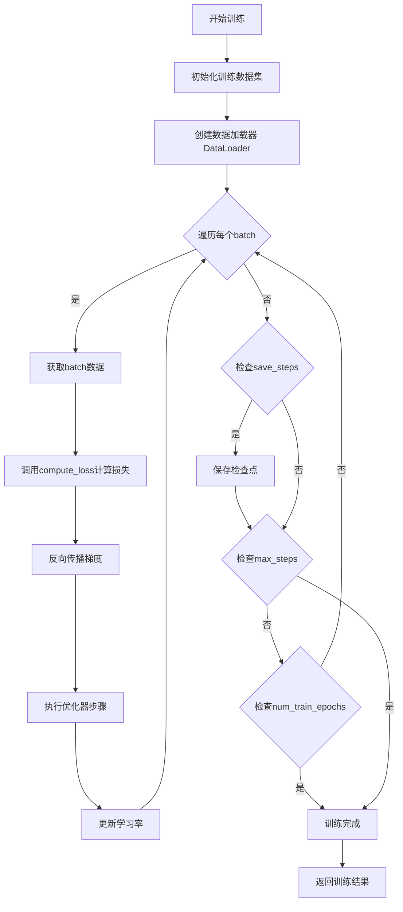

# `Chat-Haruhi-Suzumiya\kyon_generator\train.py` 详细设计文档

这是一个用于微调ChatGLM2-6B大语言模型的训练脚本，使用LoRA（低秩适应）技术对模型进行微调，从HuggingFace Hub加载对话数据集，经过预处理后使用自定义Trainer进行两轮训练，并支持模型推送至Hub。

## 整体流程


## 类结构

```
ModifiedTrainer (继承自transformers.Trainer)
└── compute_loss (重写父类方法)
```

## 全局变量及字段


### `tokenizer`
    
从预训练模型THUDM/chatglm2-6b加载的分词器，用于对文本进行编码和解码

类型：`AutoTokenizer`
    


### `model`
    
ChatGLM2-6B预训练语言模型，已转换为FP16精度并移至CUDA设备用于加速推理

类型：`AutoModel`
    


### `dataset`
    
从Hugging Face Hub加载的silk-road/Chat_Suzumiya_Fusion对话融合数据集

类型：`Dataset`
    


### `model_inputs`
    
经过preprocess_dialogue函数处理后的模型输入数据集，包含input_ids和seq_len字段

类型：`Dataset`
    


### `config`
    
LoRA微调配置文件，设置秩为16、alpha为32、dropout为0.05、任务类型为CAUSAL_LM

类型：`LoraConfig`
    


### `training_args`
    
训练参数配置对象，定义2个训练epoch、批量大小32、学习率1e-4、FP16训练、每500步保存一次等

类型：`TrainingArguments`
    


### `trainer`
    
定制的Trainer子类实例，用于执行ChatGLM2模型的LoRA微调训练流程

类型：`ModifiedTrainer`
    


### `Trainer.ModifiedTrainer`
    
继承自Transformers Trainer的定制训练器类，重写compute_loss方法直接返回模型损失

类型：`class`
    
    

## 全局函数及方法


### `preprocess_dialogue`

该函数用于预处理对话数据，将原始的上下文（context）和目标回复（target）文本编码为模型可接受的token ID序列，并返回拼接后的完整输入序列以及上下文部分的长度信息，为后续的模型训练提供准备。

参数：

- `example`：`Dict`，包含"context"（上下文文本）和"target"（目标回复文本）两个键的字典样本

返回值：`Dict`，返回包含"input_ids"（拼接后的完整token序列）和"context_seq_len"（上下文部分的token长度）的字典

#### 流程图


#### 带注释源码

```python
def preprocess_dialogue(example):
    """
    预处理对话数据，将context和target编码为token序列
    
    参数:
        example: 包含"context"和"target"字段的字典
            - context: str, 对话上下文/提示语
            - target: str, 目标回复/期望输出
    
    返回:
        dict: 包含编码后信息的字典
            - input_ids: list, 拼接后的完整token序列 [prompt_ids + target_ids]
            - seq_len: int, 上下文部分的token长度，用于后续labels掩码处理
    """
    # 从样本中提取对话上下文和目标回复
    prompt = example["context"]
    target = example["target"]
    
    # 使用tokenizer将上下文编码为token ids
    # truncation=True: 超过最大长度时截断
    # add_special_tokens=True: 添加特殊token（如[BOS],[EOS]等）
    prompt_ids = tokenizer.encode(prompt, truncation=True, add_special_tokens=True)
    
    # 使用tokenizer将目标回复编码为token ids
    # add_special_tokens=False: 不添加特殊token，保持目标序列的连续性
    target_ids = tokenizer.encode(target, truncation=True, add_special_tokens=False)
    
    # 拼接上下文和目标的token序列，形成完整输入
    input_ids = prompt_ids + target_ids
    
    # 返回编码后的序列和上下文长度
    # seq_len用于后续data_collator中生成正确的labels掩码
    return {"input_ids": input_ids, "seq_len": len(prompt_ids)}
```


### `data_collator`

自定义批处理函数，处理变长序列并生成labels。该函数接收一个特征列表，找出最长序列长度，对特征按长度降序排序，然后将所有序列填充（padding）至最长长度，同时生成对应的labels（其中prompt部分和padding部分使用-100标记，以在训练时忽略这些位置的loss）。

参数：

- `features`：`list`，包含多个样本特征的列表，每个特征是一个字典，必须包含 `input_ids`（输入序列的token ids）和 `seq_len`（prompt部分的长度）字段

返回值：`dict`，返回包含 `input_ids`（填充后的输入序列，类型为 `torch.LongTensor`）和 `labels`（对齐后的标签序列，类型为 `torch.LongTensor`）的字典

#### 流程图

```mermaid
flowchart TD
    A[接收 features 列表] --> B[计算每个特征的 input_ids 长度]
    B --> C[找出最长长度 longest]
    C --> D[按长度降序排序特征]
    D --> E[遍历每个特征]
    E --> F[获取 input_ids 和 seq_len]
    F --> G[生成 labels: -100 × (seq_len-1) + target_ids + -100 × (longest - ids_l)]
    G --> H[对 input_ids 填充 pad_token_id 至 longest]
    I[将所有 ids 转为 LongTensor] --> J[将所有 labels 转为 LongTensor]
    H --> I
    E --> K[所有特征处理完成]
    K --> L[stack 堆叠所有 input_ids]
    L --> M[stack 堆叠所有 labels]
    M --> N[返回 {input_ids, labels} 字典]
```

#### 带注释源码

```python
def data_collator(features: list) -> dict:
    """
    自定义批处理函数，处理变长序列并生成labels
    
    参数:
        features: 包含多个样本特征的列表，每个特征包含 input_ids 和 seq_len
    
    返回:
        包含 input_ids 和 labels 的字典
    """
    # 步骤1: 提取所有特征的input_ids长度
    len_ids = [len(feature["input_ids"]) for feature in features]
    
    # 步骤2: 找出最长序列长度
    longest = max(len_ids)
    
    # 初始化存储列表
    input_ids = []
    labels_list = []
    
    # 步骤3: 按长度降序排序处理（优化填充效率）
    # 使用 -x[0] 实现降序排列，优先处理长的序列
    for ids_l, feature in sorted(zip(len_ids, features), key=lambda x: -x[0]):
        # 获取当前特征的input_ids和seq_len（prompt长度）
        ids = feature["input_ids"]
        seq_len = feature["seq_len"]
        
        # 步骤4: 生成labels
        # -100是 Hugging Face 的默认忽略标记，用于:
        #   1. (seq_len - 1): 忽略prompt部分（保留位置0的特殊token）
        #   2. ids[(seq_len - 1):]: target部分（包含实际学习内容）
        #   3. (longest - ids_l): 填充部分（忽略pad）
        labels = (
            [-100] * (seq_len - 1) + ids[(seq_len - 1) :] + [-100] * (longest - ids_l)
        )
        
        # 步骤5: 对input_ids进行padding至最长长度
        # tokenizer.pad_token_id 默认为 [PAD] token的id
        ids = ids + [tokenizer.pad_token_id] * (longest - ids_l)
        
        # 步骤6: 转换为PyTorch LongTensor
        _ids = torch.LongTensor(ids)
        labels_list.append(torch.LongTensor(labels))
        
        # 收集处理后的数据
        input_ids.append(_ids)
    
    # 步骤7: 堆叠所有tensor
    input_ids = torch.stack(input_ids)
    labels = torch.stack(labels_list)
    
    # 步骤8: 返回整理后的批次数据
    return {
        "input_ids": input_ids,
        "labels": labels,
    }
```


### `login`

`login` 函数是 HuggingFace Hub 的官方登录接口，用于通过访问令牌（Access Token）进行身份验证，以便访问私有模型、数据集和进行模型推送等操作。在代码中该函数被注释未执行。

参数：

- `token`：`str`，HuggingFace 的访问令牌（HF_TOKEN），用于身份验证
- `add_to_git_credential`：`bool`（可选），是否将令牌添加到 Git 凭证中，默认为 `False`
- `library_name`：`str`（可选），使用此登录的库名称
- `library_version`：`str`（可选），库版本号
- `library_url`：`str`（可选），库的主页 URL

返回值：`bool`，登录是否成功的标志

#### 流程图


#### 带注释源码

```python
# 导入 HuggingFace Hub 登录函数
# from huggingface_hub import login

# 定义 HuggingFace 访问令牌（已被注释，未生效）
# HF_TOKEN = 'hflcAlYNF'  # 第一个令牌（已注释）
# HF_TOKEN = "nPhmtMVuXy"  # 第二个令牌（已注释）

# 调用 login 函数进行登录（已被注释，未执行）
# login(token=HF_TOKEN)

# 说明：
# 1. login 函数用于将本地环境通过令牌认证到 HuggingFace Hub
# 2. 认证后可访问私有模型/数据集，或将训练好的模型推送到 Hub
# 3. 在当前代码中该功能被注释，属于潜在的技术债务（未启用但可能需要）
# 4. 如需启用，需取消注释并确保 HF_TOKEN 是有效的访问令牌
```

---

### 潜在技术债务与优化空间

1. **未启用的 HuggingFace 登录功能**：代码中定义了 `HF_TOKEN` 并导入了 `login` 函数，但将其注释掉，导致无法将训练后的模型推送到 Hub（`push_to_hub` 方法在代码末尾也被注释）。如需启用模型分享功能，需取消相关注释。

2. **硬编码的令牌**：令牌直接以明文形式写在代码中，存在安全隐患，建议使用环境变量或配置文件管理敏感信息。

3. **未完整实现的数据加载**：代码中大量数据加载相关的逻辑被注释（如 `jsonl_file_path`、`character_path` 等），仅保留了一个远程数据集加载，可能导致代码可读性下降。


### `load_dataset`

该函数是HuggingFace `datasets`库的核心函数，用于从HuggingFace Hub或本地文件系统加载数据集，支持多种数据格式（JSONL、CSV、Parquet等），并返回标准化的`Dataset`或`DatasetDict`对象供后续训练使用。

参数：

-  `path`：`str`，HuggingFace Hub上的数据集名称（如"silk-road/Chat_Suzumiya_Fusion"）或本地数据集路径
-  `name`：`str`（可选），数据集的具体配置名称，用于区分同一数据集的不同子版本
-  `split`：`str`（可选），指定要加载的数据集拆分，如"train"、"test"或"validation"
-  `trust_remote_code`：`bool`（可选），是否信任远程代码执行，默认值为`False`

返回值：`datasets.DatasetDict` 或 `datasets.Dataset`，返回HuggingFace数据集对象，通常是`DatasetDict`类型，包含多个拆分（如train、test等），每个拆分包含多列数据。

#### 流程图


#### 带注释源码

```python
# 导入datasets库的load_dataset函数
from datasets import load_dataset, Dataset

# 使用load_dataset从HuggingFace Hub加载数据集
# 参数为数据集在Hub上的名称：'silk-road/Chat_Suzumiya_Fusion'
# 该数据集是一个对话合成数据集，用于训练角色扮演对话模型
dataset = load_dataset('silk-road/Chat_Suzumiya_Fusion')

# 打印加载后的数据集信息
# 通常输出格式类似：DatasetDict({
#     train: Dataset({
#         features: ['context', 'target'],
#         num_rows: xxx
#     })
# })
print(dataset)
```


### `read_jsonl_file`

该函数为本地模块函数，从 `dataset` 模块导入，用于读取 JSONL（JSON Lines）格式的文件，将每行 JSON 数据解析为 Python 字典并返回包含所有记录的列表。

参数：

- `file_path`：`str`，JSONL 文件的路径，指向需要读取的 .jsonl 文件

返回值：`list[dict]`，返回包含所有 JSON 对象的列表，每个元素为一个字典，代表文件中的一行数据

#### 流程图


#### 带注释源码

```python
# 注意：此函数从 dataset.py 模块导入，当前文件仅展示调用方式
# 完整的函数定义应在 dataset.py 中，以下为基于函数名的合理推断实现

def read_jsonl_file(file_path: str) -> list[dict]:
    """
    读取 JSONL 格式文件并返回字典列表
    
    Args:
        file_path: JSONL 文件的路径
        
    Returns:
        包含所有 JSON 记录的字典列表
    """
    results = []
    
    # 使用 jsonlines 库高效读取大文件
    with jsonlines.open(file_path, 'r') as reader:
        for obj in reader:
            # 每一行都是一个完整的 JSON 对象
            results.append(obj)
    
    return results


# 在 Train.py 中的调用方式示例：
# jsonl_file = '/path/to/file.jsonl'
# jsonl_data = read_jsonl_file(jsonl_file)  # 返回 list[dict] 类型
# c = CharacterDataset(jsonl_data, character, 8, 2000)
```

---

#### 补充说明

| 项目 | 说明 |
|------|------|
| **模块来源** | `dataset` 模块（本地自定义模块） |
| **依赖库** | `jsonlines`（用于高效流式读取大文件） |
| **输入格式** | JSONL - 每行一个有效的 JSON 对象 |
| **输出格式** | Python 列表，包含多个字典对象 |
| **使用场景** | 在数据预处理阶段读取对话训练数据 |
| **错误处理** | 文件不存在时抛出 `FileNotFoundError` |


根据您提供的代码，我需要指出一个重要问题：**`collate_fn` 函数是从 `dataset` 模块导入的，但该模块的源代码并未在您提供的代码中**。

在 `Train.py` 中，有以下导入语句：
```python
from dataset import CharacterDataset, read_jsonl_file, collate_fn
```

但是在当前代码中，我只能看到 `data_collator` 函数（第111-126行）被用作 `Trainer` 的数据整理函数。

**由于缺少 `dataset.py` 的源代码，我无法提取 `collate_fn` 的具体实现。**

---

## 可用的替代信息

虽然无法提供 `collate_fn` 的具体实现，但根据代码上下文，我可以提供以下分析：

### `data_collator` 函数（实际使用的整理函数）

这是实际在 Trainer 中使用的 collate 函数，位于 Train.py 第111-126行。

### collate_fn 的调用上下文

在原代码中（被注释掉的部分），`collate_fn` 的使用方式如下：

```python
data_loader = DataLoader(combined_dataset, batch_size=batch_size, collate_fn=collate_fn)
```

---

## 建议

为了获得完整的 `collate_fn` 设计文档，请您提供：

1. **`dataset.py`** 文件的源代码，或者
2. 确认是否需要分析 **`data_collator`** 函数（因为它是实际被使用的）

---

如果您能提供 `dataset.py` 的代码，我将立即为您生成完整的详细设计文档，包括：
- 函数名称、参数、返回值
- Mermaid 流程图
- 带注释的源代码
- 潜在技术债务和优化建议


### ModifiedTrainer.compute_loss

该方法是 `ModifiedTrainer` 类的核心成员，负责在训练过程中计算模型损失。它覆盖了 Hugging Face `Trainer` 类的默认实现，通过调用模型的前向传播并直接提取损失值，简化了训练循环。

参数：
- `self`：隐含参数，指向 `ModifiedTrainer` 实例本身。
- `model`：`torch.nn.Module`（具体为微调后的 `PreTrainedModel`），用于计算损失的模型实例。
- `inputs`：`Dict[str, torch.Tensor]`，包含键 `"input_ids"`（输入序列的 ID）和 `"labels"`（目标标签）的字典。
- `return_outputs`：`bool`，可选参数，默认为 `False`。控制是否返回模型输出对象。当前实现忽略此参数，始终只返回损失。

返回值：`torch.Tensor`，计算得到的损失值（标量张量）。

#### 流程图


#### 带注释源码

```python
def compute_loss(self, model, inputs, return_outputs=False):
    """
    计算模型损失的函数。

    参数:
        model: 用于计算损失的模型。
        inputs: 包含 input_ids 和 labels 的字典。
        return_outputs: 是否返回模型输出（当前版本忽略此参数）。

    返回:
        损失值。
    """
    # 调用模型的前向传播，传入输入 IDs 和标签
    # model() 返回一个包含 loss 属性的对象（如 CausalLMOutput）
    outputs = model(
        input_ids=inputs["input_ids"],
        labels=inputs["labels"],
    )
    
    # 提取并返回损失值
    return outputs.loss
```


### ModifiedTrainer.__init__

`ModifiedTrainer` 类的初始化方法继承自 `transformers.Trainer`，用于创建一个自定义的训练器实例，支持自定义的损失计算逻辑。

参数：

- `model`：`torch.nn.Module`，需要训练的模型实例
- `train_dataset`：`datasets.Dataset`，训练数据集
- `args`：`TrainingArguments`，训练参数配置对象
- `data_collator`：函数，数据整理函数，用于将一批数据整理成模型输入格式

返回值：`ModifiedTrainer`，返回初始化后的训练器实例

#### 流程图


#### 带注释源码

```python
class ModifiedTrainer(Trainer):
    """
    ModifiedTrainer 类
    继承自 transformers.Trainer，自定义了 compute_loss 方法
    注意：该类未显式定义 __init__ 方法，因此使用父类 Trainer 的初始化逻辑
    """
    
    def compute_loss(self, model, inputs, return_outputs=False):
        """
        自定义损失计算方法
        
        参数：
        - model: 需要计算损失的模型
        - inputs: 输入数据字典，包含 input_ids 和 labels
        - return_outputs: 是否返回输出
        
        返回值：
        - 模型的损失值
        """
        return model(
            input_ids=inputs["input_ids"],
            labels=inputs["labels"],
        ).loss


# 实例化 ModifiedTrainer（调用继承的 __init__ 方法）
trainer = ModifiedTrainer(
    model=model,                        # 训练用的模型（已配置LoRA）
    train_dataset=model_inputs['train'], # 训练数据集
    args=training_args,                  # 训练参数配置
    data_collator=data_collator,         # 数据整理函数
)
```


### ModifiedTrainer.train

该方法继承自 `transformers.Trainer` 类，用于执行模型训练流程。它通过数据加载器迭代训练数据集，计算损失（调用被重写的 `compute_loss` 方法），并根据 `TrainingArguments` 中的配置执行梯度下降、参数更新和学习率调度等操作。

参数：

- 无直接参数（继承自父类，通过 `__init__` 时传入的配置运行）

返回值：`TrainerOutput`，包含训练指标（如总训练步数、损失等）

#### 流程图



#### 带注释源码

```python
class ModifiedTrainer(Trainer):
    """
    ModifiedTrainer类：继承自transformers.Trainer的自定义训练器
    主要重写了compute_loss方法以适配特定的模型输出格式
    """
    
    def compute_loss(self, model, inputs, return_outputs=False):
        """
        计算模型损失的定制实现
        
        参数：
            model: 要训练的模型
            inputs: 包含input_ids和labels的字典
            return_outputs: 是否返回模型输出（默认为False）
            
        返回：
            如果return_outputs为False，返回loss（标量张量）
            否则返回(loss, outputs)元组
        """
        # 调用模型前向传播，传入输入IDs和标签
        # 模型返回包含loss属性的输出对象
        outputs = model(
            input_ids=inputs["input_ids"],
            labels=inputs["labels"],
        )
        
        # 提取损失值
        loss = outputs.loss
        
        # 根据参数决定是否同时返回输出
        return (loss, outputs) if return_outputs else loss


# 训练器实例化和执行的代码（在主脚本中）
trainer = ModifiedTrainer(
    model=model,                           # 经过PEFT适配的LoRA模型
    train_dataset=model_inputs['train'],   # 预处理后的训练数据集
    args=training_args,                   # 训练参数配置
    data_collator=data_collator,           # 自定义批处理整理函数
)

# 调用继承自Trainer基类的train方法开始训练
# 该方法内部会：
# 1. 设置模型为训练模式
# 2. 按epoch和step遍历训练数据
# 3. 对每个batch调用compute_loss（此处使用重写版本）
# 4. 执行反向传播和参数更新
# 5. 按照save_steps保存检查点
# 6. 返回训练结果
trainer.train()
```


### `ModifiedTrainer.evaluate`

该方法是 `ModifiedTrainer` 类从父类 `Trainer` 继承而来的评估方法，用于在验证集上评估模型的性能，计算损失和其他指标，并返回评估结果。

参数：

-  `eval_dataset`：可选的 `Dataset` 类型，验证数据集，如果不提供则使用训练时定义的验证集
-  `ignore_keys`：可选的 `List[str]` 类型，评估时需要忽略的键
-  `metric_key_prefix`：字符串类型，默认值为 `"eval"`，用于指标名称的前缀

返回值：`Dict[str, float]` 类型，返回一个字典，包含评估过程中的各项指标（如 loss、eval_loss 等）

#### 流程图


#### 带注释源码

```python
# ModifiedTrainer 继承自 Trainer，evaluate 方法从父类继承
# 以下是 Trainer 类中 evaluate 方法的典型实现逻辑

class ModifiedTrainer(Trainer):
    def compute_loss(self, model, inputs, return_outputs=False):
        """计算损失的方法（当前类中重写的唯一方法）"""
        return model(
            input_ids=inputs["input_ids"],
            labels=inputs["labels"],
        ).loss
    
    # evaluate 方法从 Trainer 父类继承，以下为其功能说明：
    # def evaluate(
    #     self,
    #     eval_dataset: Optional[Dataset] = None,
    #     ignore_keys: Optional[List[str]] = None,
    #     metric_key_prefix: str = "eval"
    # ) -> Dict[str, float]:
    #     """
    #     在验证集上运行评估并返回指标
    #     
    #     参数:
    #         eval_dataset: 验证数据集，不提供则使用训练时定义的验证集
    #         ignore_keys: 评估时忽略的键列表
    #         metric_key_prefix: 指标名称前缀
    #     
    #     返回:
    #         包含评估指标的字典
    #     """
    #     # 1. 设置评估模式
    #     # 2. 使用 data_collator 处理数据
    #     # 3. 对每个 batch 进行前向传播
    #     # 4. 计算损失和其他指标
    #     # 5. 返回指标字典
```


### ModifiedTrainer.save_model (继承)

该方法继承自 Hugging Face 的 `Trainer` 基类，用于将训练好的模型（包括模型权重、配置以及分词器）保存到指定的输出目录。

参数：

- `output_dir`：`Optional[str]`，模型保存的目标目录路径
- `security_dimensions`：`int`，安全维度参数（继承自基类，默认值为 2）

返回值：`Optional[str]`，返回保存的目录路径，如果保存失败则返回 None

#### 流程图


#### 带注释源码

```python
# 继承自 transformers.Trainer 的 save_model 方法
# ModifiedTrainer 类本身未重写此方法，因此调用父类实现
class ModifiedTrainer(Trainer):
    def compute_loss(self, model, inputs, return_outputs=False):
        """
        自定义损失计算方法
        """
        return model(
            input_ids=inputs["input_ids"],
            labels=inputs["labels"],
        ).loss
    
    # save_model 方法继承自 Trainer 基类，未在此处重写
    # 其典型实现逻辑如下：
    """
    def save_model(self, output_dir: Optional[str] = None, _internal_call: bool = False):
        # 输出目录优先级：参数 > 配置中的output_dir
        output_dir = output_dir if output_dir is not None else self.args.output_dir
        
        # 创建输出目录
        os.makedirs(output_dir, exist_ok=True)
        
        # 保存模型权重和配置
        self.model.save_pretrained(output_dir)
        
        # 如果存在tokenizer，一并保存
        if self.tokenizer is not None:
            self.tokenizer.save_pretrained(output_dir)
        
        # 保存训练相关配置
        if self.args.generation_config is not None:
            self.args.generation_config.save_pretrained(output_dir)
            
        # 保存训练参数
        torch.save(self.args, os.path.join(output_dir, 'training_args.bin'))
        
        # 保存 tokenizer 配置文件
        if self.tokenizer is not None:
            self.tokenizer.save_vocabulary(output_dir)
            
        return output_dir
    """
```

> **注意**：由于 `ModifiedTrainer` 类只重写了 `compute_loss` 方法，`save_model` 方法完全继承自 Hugging Face `Trainer` 基类的默认实现。如需自定义保存行为，需在该类中重写此方法。


### `ModifiedTrainer.push_to_hub`

该方法是继承自 `Trainer` 类的 `push_to_hub` 方法，用于将训练好的模型和相关文件推送到 Hugging Face Hub。

参数：

- `self`：自动传入的实例引用
- `repo_id`：`str`，要推送到的 Hugging Face 仓库 ID（例如 `"username/model_name"`）
- `repo_type`：`str`，可选，仓库类型（`"model"`、`"dataset"` 或 `"space"`）
- `commit_message`：`str`，可选，提交信息，默认为 `"Push from training script"`
- `private`：`bool`，可选，是否创建私有仓库，默认为 `False`
- `token`：`str`，可选，Hugging Face 认证 token
- `use_auth_token`：`str`，可选，已废弃参数，建议使用 `token`
- `create_repo`：`bool`，可选，若仓库不存在是否创建，默认为 `True`
- `allow_patterns`：`list`，可选，仅推送匹配这些模式的文件
- `ignore_patterns`：`list`，可选，排除匹配这些模式的文件
- `delete_patterns`：`list`，可选，删除仓库中匹配这些模式的文件

返回值：`str`，推送后仓库的 URL。

#### 流程图


#### 带注释源码

```python
# ModifiedTrainer 继承自 Trainer，push_to_hub 方法继承自 Trainer 类
# 以下是 Trainer.push_to_hub 的简化逻辑说明

class Trainer:
    # ... 其他方法 ...
    
    def push_to_hub(
        self,
        repo_id: str,
        repo_type: str = "model",
        commit_message: str = "Add new model",
        private: bool = False,
        token: Optional[str] = None,
        create_repo: bool = True,
        allow_patterns: Optional[List[str]] = None,
        ignore_patterns: Optional[List[str]] = None,
        delete_patterns: Optional[List[str]] = None,
    ) -> str:
        """
        将训练好的模型推送到 Hugging Face Hub。
        
        参数:
            repo_id: 目标仓库 ID
            repo_type: 仓库类型 (model/dataset/space)
            commit_message: 提交信息
            private: 是否私有
            token: 认证 token
            create_repo: 仓库不存在时是否创建
            allow_patterns: 只包含匹配的文件
            ignore_patterns: 排除匹配的文件
            delete_patterns: 删除匹配的文件
        """
        # 1. 验证并规范化 repo_id
        if "/" not in repo_id:
            # 如果没有前缀，自动添加用户名
            repo_id = f"{self.args.hub_model_id or 'your-username'}/{repo_id}"
        
        # 2. 创建或获取仓库
        repo = self._create_or_get_repo(
            repo_id=repo_id,
            repo_type=repo_type,
            token=token,
            private=private,
            create_repo=create_repo,
        )
        
        # 3. 保存模型到临时目录
        saved_path = self.args.output_dir
        # Trainer 会调用 model.save_pretrained() 保存模型权重
        # 同时保存 tokenizer、配置文件等
        
        # 4. 上传到 Hub
        # 使用 huggingface_hub 的 upload_folder 方法
        return repo.repo_url
```

> **注意**：在提供的代码中，`ModifiedTrainer` 类本身**没有显式定义** `push_to_hub` 方法，该方法是继承自父类 `Trainer`。代码中使用的是 `model.push_to_hub(...)`（第173行，被注释），而不是 `trainer.push_to_hub(...)`。

## 关键组件


### 1. 模型加载与初始化
使用AutoTokenizer和AutoModel加载THUDM/chatglm2-6b预训练模型，并配置半精度(FP16)和CUDA加速

### 2. LoRA配置与PEFT模型封装
通过LoraConfig设置LoRA微调参数(r=16, lora_alpha=32, lora_dropout=0.05)，使用get_peft_model将原始模型转换为可训练的LoRA模型

### 3. 数据预处理流程
preprocess_dialogue函数将对话上下文和目标文本编码为input_ids，data_collator函数处理批量数据并生成padding后的input_ids和labels

### 4. 自定义训练器
ModifiedTrainer继承自HuggingFace Trainer，重写compute_loss方法直接返回模型的loss用于反向传播

### 5. 训练参数配置
TrainingArguments配置训练超参数：2个epoch、batch_size=32、学习率1e-4、梯度累积、FP16混合精度训练

### 6. 数据集加载
使用load_dataset从HuggingFace Hub加载silk-road/Chat_Suzumiya_Fusion对话数据集

### 7. 模型冻结与梯度检查点
通过param.requires_grad=False冻结原始模型参数，启用gradient_checkpointing_enable()减少显存占用


## 问题及建议


### 已知问题

- **变量引用错误**：代码第73行使用了 `train_dataset`，但在第60行实际定义的是 `dataset`（来自 `load_dataset('silk-road/Chat_Suzumiya_Fusion')`），这会导致 `NameError`
- **数据类型不一致**：在冻结模型时将参数转换为 `torch.float32`，但未明确确保LoRA参数保持原始精度，可能导致训练不稳定或内存问题
- **DataLoader配置矛盾**：数据准备阶段使用 `batch_size=1` 创建了 `data_loader`，但训练时 `TrainingArguments` 中设置 `per_device_train_batch_size=32`，两者不匹配
- **训练数据未正确分割**：使用 `model_inputs['train']` 访问数据集，但未对原始 `dataset` 进行 `preprocess_dialogue` 处理，`model_inputs` 变量在使用前未正确定义
- **缺少资源检查**：未检查CUDA是否可用，代码直接调用 `.cuda()` 可能导致在CPU环境下运行失败
- **硬编码凭证风险**：存在被注释掉的 `HF_TOKEN` 硬编码在代码中（虽然已注释，但仍然存在信息泄露风险）
- **冗余代码遗留**：大量被注释的数据加载路径和代码块未清理，影响代码可读性和可维护性
- **collator重复定义**：同时存在 `collate_fn`（从dataset模块导入）和自定义 `data_collator`，功能重复且容易混淆
- **训练参数优化不足**：未设置 `logging_steps`，无法实时监控训练过程；`save_steps=500` 频率较高但无评估策略配合

### 优化建议

- 修复变量引用链：`dataset` → `model_inputs` 正确调用 `map()` 方法处理整个数据集，并确保使用正确的键名访问（如 `dataset['train']`）
- 添加GPU可用性检查：`if not torch.cuda.is_available(): raise RuntimeError("CUDA is required for training")`
- 统一batch_size配置：移除或修复DataLoader中的batch_size设置，统一使用TrainingArguments中的配置
- 将超参数提取为配置常量：创建配置文件或命令行参数处理，避免魔法数字散落在代码中（如 `r=16`, `lora_alpha=32`, `learning_rate=1e-4` 等）
- 清理注释代码：移除所有被注释掉的代码块，或使用版本控制管理历史版本
- 添加日志和监控：设置 `logging_steps=50` 并集成wandb或tensorboard进行训练监控
- 优化内存使用：在训练循环外添加 `torch.cuda.empty_cache()` 调用，考虑使用 `gradient_accumulation_steps` 减少显存压力
- 添加错误处理：为数据加载、模型加载、训练过程添加try-except异常处理和重试机制

## 其它


### 设计目标与约束

本代码旨在实现基于ChatGLM2-6B模型的LoRA微调训练，用于角色对话生成任务。核心约束包括：GPU显存要求至少16GB（使用fp16混合精度训练），训练数据格式为JSONL，包含context和target对话对，单次训练batch_size为32，最大序列长度受tokenizer限制，数据集来源为HuggingFace Hub的'silk-road/Chat_Suzumiya_Fusion'。

### 错误处理与异常设计

代码中缺乏显式的错误处理机制。潜在的异常场景包括：模型加载失败（网络问题或磁盘空间不足）、数据集下载失败、tokenizer初始化异常、GPU内存不足导致OOM、梯度累积导致显存溢出、checkpoint保存失败等。建议增加try-except块捕获Exception基类，记录错误日志并输出友好提示，同时设置合理的重试机制。

### 数据流与状态机

数据流转路径为：加载HuggingFace数据集 → tokenizer编码（context+target拼接）→ 数据预处理（map函数）→ 自定义data_collator处理变长序列 → ModifiedTrainer执行训练 → 模型保存至output目录。状态机包含：数据加载态、预处理态、模型初始化态、训练态、保存态。

### 外部依赖与接口契约

主要外部依赖包括：transformers>=4.30.2、torch>=2.0、peft、datasets、loralib、huggingface_hub。模型来源为THUDM/chatglm2-6b，数据集来源为silk-road/Chat_Suzumiya_Fusion。接口契约方面：tokenizer输入为字符串，输出为编码后的token IDs；preprocess_dialogue接收example字典返回包含input_ids和seq_len的字典；data_collator接收features列表返回包含input_ids和labels的字典；compute_loss接收model和inputs返回loss张量。

### 安全性考虑

代码中存在硬编码的token注释（已注释掉），若启用需注意Token安全。模型和数据集从HuggingFace Hub加载，需确保来源可信。建议使用环境变量存储敏感信息，避免明文写入代码。模型推送至Hub时需使用use_auth_token参数进行认证。

### 性能优化建议

当前实现存在以下优化空间：batch_size=32在部分GPU上可能导致OOM，建议增加梯度累积steps或减小batch_size；未使用DeepSpeed加速；训练数据未做缓存，可添加load_from_cache_file参数；模型未使用bitsandbytes量化，可降低显存占用；可考虑使用FlashAttention2加速注意力计算；save_steps=500可能导致训练中断时丢失大量进度，建议增加checkpoint频率或使用分布式存储。

### 配置管理

配置分散在代码各位置，建议抽取为独立配置文件（config.yaml或config.json），包含：模型路径、数据集名称、LoRA参数（r=16, lora_alpha=32, lora_dropout=0.05）、训练参数（num_train_epochs=2, learning_rate=1e-4, per_device_train_batch_size=32）、输出路径等。便于不同实验场景下的参数调整。

### 版本兼容性

代码注释显示要求transformers==4.30.2，但实际import未指定版本。ChatGLM2模型持续更新，不同版本可能有API变化。torch版本要求>=2.0，但未指定具体版本。建议在requirements.txt中锁定兼容版本组合：transformers==4.30.2、torch==2.0.1、peft==0.3.0等。

### 部署相关

当前为单机训练脚本，部署时需考虑：GPU环境配置（CUDA、cuDNN版本匹配）、多GPU分布式训练支持（添加--nproc_per_node参数）、训练进程管理（使用tmux或supervisor）、模型输出目录持久化（绑定挂载卷）、训练中断后的resume功能（TrainingArguments支持load_best_model_at_end和resume_from_checkpoint）。

### 监控与日志

代码仅使用print输出基本训练信息，缺乏结构化日志。建议集成TensorBoard或WandB进行训练过程可视化监控，包括：loss曲线、learning_rate变化、GPU内存使用、训练速度（samples/sec）等指标。添加日志级别控制（DEBUG、INFO、WARNING、ERROR），将关键事件（训练开始/结束、checkpoint保存、异常发生）记录至日志文件。

### 测试策略

建议增加以下测试用例：单元测试验证preprocess_dialogue函数正确性（边界条件：空字符串、超长序列）、单元测试验证data_collator处理变长batch的正确性、集成测试验证模型加载和训练一个step的完整性、压力测试验证大数据集处理的内存使用、Mock测试验证与HuggingFace Hub的交互（使用responses库）。

    