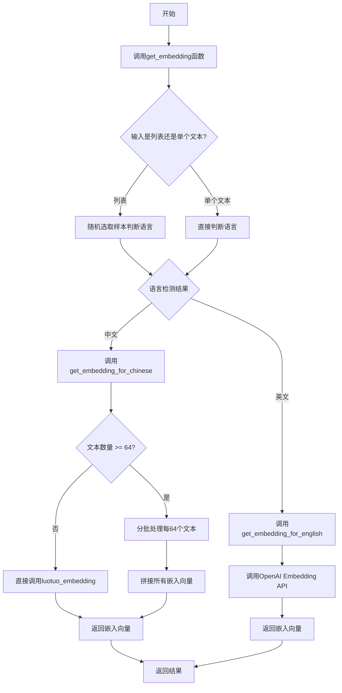
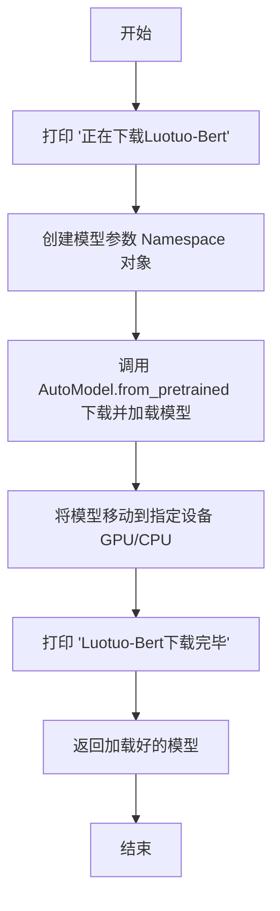
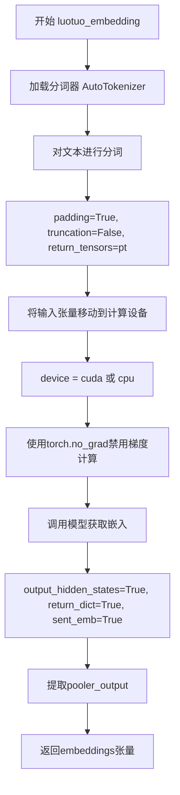
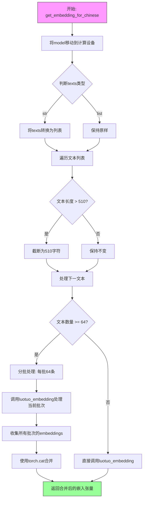
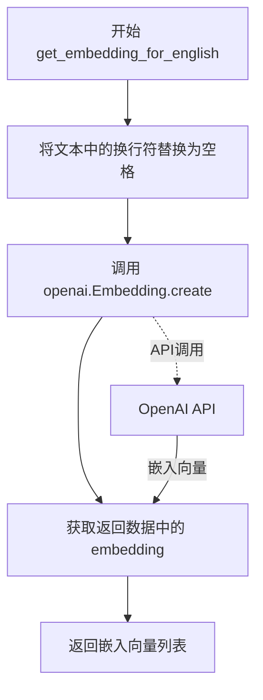

# `Chat-Haruhi-Suzumiya\kyon_generator\utils.py` 详细设计文档

这是一个多语言文本嵌入服务，能够根据输入文本的语言（中文或英文）自动选择合适的嵌入模型：中文文本使用本地部署的Luotuo-Bert模型生成嵌入向量，英文文本则调用OpenAI的text-embedding-ada-002模型获取嵌入，支持批量处理和自动语言检测。

## 整体流程



## 类结构

```
无类定义 (基于函数的模块化设计)
├── 全局变量
│   └── device (torch设备)
├── 工具函数
│   └── is_chinese_or_english (语言检测)
├── 核心嵌入函数
│   ├── get_embedding (主入口)
│   ├── get_embedding_for_chinese (中文嵌入)
│   ├── get_embedding_for_english (英文嵌入)
│   └── luotuo_embedding (Luotuo模型推理)
└── 模型加载函数
    └── download_models (模型下载)
```

## 全局变量及字段


### `device`
    
全局计算设备，根据CUDA可用性自动选择GPU或CPU

类型：`torch.device`
    


    

## 全局函数及方法


### `download_models`

该函数负责从预训练模型仓库下载并加载Luotuo-Bert中文embedding模型到指定计算设备，支持自动下载和模型参数配置。

参数：

- 无参数

返回值：`torch.nn.Module`，返回加载好的Luotuo-Bert模型对象

#### 流程图



#### 带注释源码

```python
def download_models():
    """
    下载并加载Luotuo-Bert预训练模型
    
    该函数执行以下操作：
    1. 打印下载提示信息
    2. 配置模型参数（池化类型、温度等）
    3. 从HuggingFace Hub自动下载silk-road/luotuo-bert-medium模型
    4. 将模型加载到指定设备（GPU或CPU）
    5. 返回加载完成的模型对象
    """
    # 打印下载开始提示信息，告知用户模型开始下载
    print("正在下载Luotuo-Bert")
    
    # =============================================
    # 配置模型参数
    # =============================================
    # 使用Namespace创建模型配置对象
    # 参数说明：
    # - do_mlm: 是否使用MLM任务，None表示不使用
    # - pooler_type: 池化类型，"cls"表示使用[CLS] token的输出
    # - temp: 温度参数，用于对比学习，值越小分布越尖锐
    # - mlp_only_train: 是否只在训练阶段使用MLP
    # - init_embeddings_model: 初始化embedding的模型，None表示使用默认
    model_args = Namespace(
        do_mlm=None, 
        pooler_type="cls",  # 使用CLS token作为句子嵌入
        temp=0.05,          # 温度系数，控制嵌入的平滑程度
        mlp_only_train=False,
        init_embeddings_model=None
    )
    
    # =============================================
    # 加载预训练模型
    # =============================================
    # 使用transformers的AutoModel自动下载并加载模型
    # 参数说明：
    # - "silk-road/luotuo-bert-medium": HuggingFace上的模型名称
    # - trust_remote_code=True: 允许执行远程模型代码（自定义模型）
    # - model_args: 传递给模型的配置参数
    # - .to(device): 将模型参数移动到指定设备（GPU/CPU）
    model = AutoModel.from_pretrained(
        "silk-road/luotuo-bert-medium", 
        trust_remote_code=True, 
        model_args=model_args
    ).to(device)
    
    # 打印下载完成提示信息
    print("Luotuo-Bert下载完毕")
    
    # 返回加载完成的PyTorch模型对象
    return model
```


### `luotuo_embedding`

该函数是中文嵌入生成的核心函数，接收预训练的Luotuo-Bert模型和文本列表，通过分词器将文本转换为张量输入模型，提取模型的pooler_output作为文本的嵌入向量返回。

参数：

- `model`：`transformers.AutoModel`，预训练的中文嵌入模型（Luotuo-Bert），用于生成文本的嵌入表示
- `texts`：`List[str]`，待处理的中文文本列表，函数将对该列表中的所有文本同时进行嵌入计算

返回值：`torch.Tensor`，形状为`(batch_size, hidden_size)`的嵌入向量张量，其中batch_size为输入文本数量，hidden_size为模型隐藏层维度，通常为768或1024

#### 流程图



#### 带注释源码

```python
def luotuo_embedding(model, texts):
    """
    使用Luotuo-Bert模型生成中文文本的嵌入向量
    
    参数:
        model: 预训练的AutoModel模型对象
        texts: 文本列表，支持批量处理
    
    返回:
        torch.Tensor: 文本的嵌入向量表示
    """
    
    # Step 1: 加载预训练分词器
    # 从HuggingFace Hub下载并加载Luotuo-Bert的分词器
    tokenizer = AutoTokenizer.from_pretrained("silk-road/luotuo-bert-medium")
    
    # Step 2: 对输入文本进行分词处理
    # padding=True: 将不同长度的文本填充到相同长度
    # truncation=False: 不进行截断，保留完整文本
    # return_tensors="pt": 返回PyTorch张量格式
    inputs = tokenizer(texts, padding=True, truncation=False, return_tensors="pt")
    
    # Step 3: 将分词后的输入移动到计算设备
    # 根据CUDA可用性自动选择GPU或CPU
    inputs = inputs.to(device)
    
    # Step 4: 提取嵌入向量
    # 使用torch.no_grad()上下文管理器，禁用梯度计算以节省显存
    # output_hidden_states=True: 返回所有隐藏层状态
    # return_dict=True: 以字典形式返回结果，便于访问
    # sent_emb=True: 输出句子级别的嵌入（pooler_output）
    with torch.no_grad():
        embeddings = model(**inputs, output_hidden_states=True, return_dict=True, sent_emb=True).pooler_output
    
    # Step 5: 返回嵌入向量
    # pooler_output是[CLS]token经过线性层和Tanh激活的输出
    # 形状: (batch_size, hidden_size)
    return embeddings
```


### `get_embedding_for_chinese`

该函数是中文文本嵌入处理的核心入口函数，接收模型对象和文本列表作为输入，通过批量截断过长的文本（最大510字符）和分批处理大量文本（每批64条）的方式，调用Luotuo-Bert模型生成中文文本的嵌入向量表示，并返回合并后的嵌入张量。

参数：

- `model`：模型对象，需要是已经加载的Luotuo-Bert模型实例
- `texts`：文本列表或单个文本字符串，支持str类型或list[str]类型

返回值：`torch.Tensor`，返回模型处理后的嵌入张量，形状为(batch_size, embedding_dim)

#### 流程图



#### 带注释源码

```python
def get_embedding_for_chinese(model, texts):
    """
    处理中文文本并生成嵌入向量
    
    参数:
        model: 预加载的Luotuo-Bert模型对象
        texts: 单个文本字符串或文本列表
    
    返回:
        torch.Tensor: 嵌入向量张量
    """
    # 将模型移动到计算设备(CPU或GPU)
    model = model.to(device)
    
    # 统一输入格式：如果是单个字符串则转为列表
    # 支持两种输入形式：str 或 list[str]
    texts = texts if isinstance(texts, list) else [texts]
    
    # 文本长度截断处理
    # Luotuo-Bert模型最大支持512_tokens，但[CLS]和[SEP]占2个token
    # 所以保留510个字符作为安全阈值
    for i in range(len(texts)):
        if len(texts[i]) > 510:
            texts[i] = texts[i][:510]  # 字符级截断，可能导致词粒度不准确
    
    # 分批处理判断
    # 当文本数量>=64时进行分批处理，避免显存溢出
    if len(texts) >= 64:
        embeddings = []
        chunk_size = 64  # 固定批处理大小
        # 按批次循环处理
        for i in range(0, len(texts), chunk_size):
            # 切片获取当前批次的文本
            batch_texts = texts[i: i + chunk_size]
            # 调用底层嵌入函数获取当前批次embedding
            embeddings.append(luotuo_embedding(model, batch_texts))
        # 沿第0维(批次维度)拼接所有批次的嵌入向量
        return torch.cat(embeddings, dim=0)
    else:
        # 文本数量较少时直接处理
        return luotuo_embedding(model, texts)
```


# 详细设计文档

## 一段话描述

该代码文件实现了一个多语言文本嵌入（Text Embedding）处理系统，支持中文和英文文本的向量化表示，通过判断输入文本的语言类型选择合适的嵌入模型（中文使用Luotuo-Bert模型，英文使用OpenAI的text-embedding-ada-002模型）。

## 文件整体运行流程

1. **模型下载阶段**：通过`download_models()`函数下载Luotuo-Bert中文预训练模型
2. **嵌入获取阶段**：`get_embedding()`函数作为主入口，接收文本或文本列表
3. **语言判断阶段**：使用`is_chinese_or_english()`函数判断文本语言类型
4. **向量化阶段**：
   - 中文文本调用`get_embedding_for_chinese()` → `luotuo_embedding()` → Transformer模型
   - 英文文本调用`get_embedding_for_english()` → OpenAI API

---

### `is_chinese_or_english`

该函数用于检测输入文本的语言类型，通过统计文本中中文字符和英文字符的数量，以数量多者判定文本语言归属。

参数：
-  `text`：`str`，待检测的文本字符串

返回值：`str`，返回值为 `"chinese"` 或 `"english"` 字符串，表示检测到的语言类型

#### 流程图

```mermaid
flowchart TD
    A[开始 is_chinese_or_english] --> B[将text转换为字符列表]
    B --> C[初始化计数器 is_chinese=0, is_english=0]
    C --> D{遍历字符列表}
    D --> E{字符在\u4e00-\u9fa5范围?}
    E -->|是| F[is_chinese += 1]
    E -->|否| G{字符在A-Z, a-z, !-~范围?}
    G -->|是| H[is_english += 1]
    G -->|否| I[不计数]
    F --> D
    H --> D
    I --> D
    D --> J{遍历结束?}
    J -->|否| D
    J -->|是| K{is_chinese >= is_english?}
    K -->|是| L[返回 "chinese"]
    K -->|否| M[返回 "english"]
    L --> N[结束]
    M --> N
```

#### 带注释源码

```python
def is_chinese_or_english(text):
    """
    判断输入文本是中文还是英文
    
    参数:
        text (str): 待检测的文本字符串
    
    返回值:
        str: 返回 'chinese' 或 'english'
    """
    # 将字符串转换为字符列表，便于逐字符处理
    text = list(text)
    # 初始化中英文字符计数器
    is_chinese, is_english = 0, 0
    # 遍历文本中的每个字符
    for char in text:
        # 判断字符的Unicode值是否在中文字符的Unicode范围内
        # Unicode范围 \u4e00-\u9fa5 覆盖了大部分常用中文字符
        if '\u4e00' <= char <= '\u9fa5':
            is_chinese += 1
        # 判断字符是否为英文字符（包括大小写字母和常见标点符号）
        # \u0041-\u005a: 大写字母 A-Z
        # \u0061-\u007a: 小写字母 a-z
        # \u0021-\u007e: 常见标点符号和可打印ASCII字符
        elif ('\u0041' <= char <= '\u005a') or ('\u0061' <= char <= '\u007a') or ('\u0021' <= char <= '\u007e'):
            is_english += 1
    # 比较中英文计数，数量多者判定为文本主要语言
    # 若计数相同，默认为中文
    if is_chinese >= is_english:
        return "chinese"
    else:
        return "english"
```

---

## 关键组件信息

| 组件名称 | 一句话描述 |
|---------|-----------|
| `download_models()` | 下载并加载Luotuo-Bert中文预训练模型到指定设备 |
| `luotuo_embedding()` | 使用Transformer模型生成文本的嵌入向量表示 |
| `get_embedding_for_chinese()` | 处理中文文本批量嵌入，支持长文本截断和批量处理 |
| `get_embedding_for_english()` | 调用OpenAI API获取英文文本的嵌入向量 |
| `get_embedding()` | 统一入口函数，根据语言类型分发到对应的嵌入处理函数 |

---

## 潜在的技术债务或优化空间

1. **语言检测逻辑过于简单**：`is_chinese_or_english()`函数仅通过Unicode范围判断，未考虑多语言混合、数字、特殊符号等情况，可能导致误判
2. **硬编码的模型名称**："silk-road/luotuo-bert-medium"和"text-embedding-ada-002"硬编码在代码中，缺乏配置化管理
3. **缺乏错误处理**：OpenAI API调用未做异常捕获和网络重试机制
4. **设备管理不统一**：部分函数显式调用`.to(device)`，部分未调用，存在潜在的设备不一致问题
5. **批量处理限制**：中文嵌入批量处理固定chunk_size=64，缺乏灵活配置

---

## 其它项目

### 设计目标与约束
- **目标**：实现一个支持中英文的文本向量化处理系统
- **约束**：中文模型使用本地Luotuo-Bert，英文模型使用OpenAI API

### 错误处理与异常设计
- 缺少对空字符串、None值的输入校验
- OpenAI API调用缺少超时处理和重试机制
- CUDA设备不可用时的降级处理已在全局层面实现

### 数据流与状态机
```
输入文本 → 语言检测(is_chinese_or_english) 
         → [中文: get_embedding_for_chinese → luotuo_embedding → Model]
         → [英文: get_embedding_for_english → OpenAI API]
         → 输出嵌入向量
```

### 外部依赖与接口契约
- **依赖**：PyTorch、Transformers、OpenAI、argparse
- **模型**：silk-road/luotuo-bert-medium（中文）、text-embedding-ada-002（英文）
- **接口**：`get_embedding(texts)` 支持str或list输入，返回list类型的嵌入向量


### `get_embedding_for_english`

该函数用于获取英文文本的嵌入向量，通过调用 OpenAI 的 Embedding API 将文本转换为向量表示，支持自定义模型参数，默认使用 text-embedding-ada-002 模型。

参数：

- `text`：`str`，需要获取嵌入向量的英文文本输入
- `model`：`str`，可选参数，默认为 "text-embedding-ada-002"，指定使用的 OpenAI 嵌入模型

返回值：`list`，返回 OpenAI API 的嵌入向量，为浮点数列表形式

#### 流程图



#### 带注释源码

```python
def get_embedding_for_english(text, model="text-embedding-ada-002"):
    """
    获取英文文本的嵌入向量
    
    参数:
        text: str - 输入的英文文本
        model: str - OpenAI 嵌入模型名称，默认为 text-embedding-ada-002
    
    返回:
        list - 嵌入向量数组
    """
    # 将文本中的换行符替换为空格，以符合 OpenAI API 的要求
    text = text.replace("\n", " ")
    
    # 打印调试信息，表示函数被调用
    print("over here")
    
    # 调用 OpenAI Embedding API 创建嵌入向量
    # input: 要嵌入的文本列表
    # model: 使用的模型名称
    # 返回结果是一个包含 'data' 字段的字典
    # data[0]['embedding'] 包含实际的嵌入向量
    return openai.Embedding.create(input=[text], model=model)['data'][0]['embedding']
```


### `get_embedding`

该函数是嵌入功能的主入口，根据输入文本的语言类型自动选择合适的中文或英文嵌入模型进行处理，支持单个文本或文本列表的嵌入，最终返回嵌入向量的Python列表。

#### 参数

- `model`：对象，用于中文嵌入的预训练模型（如Luotuo-Bert）
- `texts`：字符串或列表，需要进行嵌入的文本内容

#### 返回值

`列表`，嵌入向量列表，每个元素为一个浮点数列表

#### 流程图

```mermaid
flowchart TD
    A[开始 get_embedding] --> B{texts是否为列表?}
    B -->|是| C[随机选择文本索引]
    C --> D[使用is_chinese_or_english判断语言]
    D --> E{语言是中文?}
    E -->|是| F[调用get_embedding_for_chinese]
    E -->|否| G[调用get_embedding_for_english逐个处理]
    B -->|否| H[使用is_chinese_or_english判断语言]
    H --> I{语言是中文?}
    I -->|是| J[调用get_embedding_for_chinese]
    I -->|否| K[调用get_embedding_for_english]
    F --> L[遍历嵌入结果]
    L --> M[embed.cpu().tolist]
    G --> N[返回英文嵌入列表]
    J --> O[get_embedding_for_chinese返回结果]
    O --> P[取第一个元素]
    P --> Q[embed[0].cpu().tolist]
    K --> R[返回英文嵌入]
    M --> S[返回中文嵌入列表]
    Q --> T[返回单个中文嵌入]
    N --> U[返回最终结果]
    S --> U
    T --> U
```

#### 带注释源码

```python
def get_embedding(model, texts):
    """
        return type: list
    """
    # 判断输入是否为列表类型
    if isinstance(texts, list):
        # 随机选择一个文本样本来判断语言类型
        index = random.randint(0, len(texts) - 1)
        # 根据语言类型选择对应的嵌入方法
        if is_chinese_or_english(texts[index]) == "chinese":
            # 中文：使用本地模型嵌入，结果转换为Python列表
            return [embed.cpu().tolist() for embed in get_embedding_for_chinese(model, texts)]
        else:
            # 英文：调用OpenAI API嵌入，逐个处理每个文本
            return [get_embedding_for_english(text) for text in texts]
    else:
        # 单个文本的处理逻辑
        if is_chinese_or_english(texts) == "chinese":
            # 中文：调用模型嵌入并取第一个结果（因为输入是单个文本）
            return get_embedding_for_chinese(model, texts)[0].cpu().tolist()
        else:
            # 英文：直接调用API嵌入
            return get_embedding_for_english(texts)
```

## 关键组件


### 模型下载与加载 (download_models)

负责下载并加载 Luotuo-Bert 中文本embedding模型，使用 transformers 库的 AutoModel.from_pretrained 自动下载预训练模型 "silk-road/luotuo-bert-medium"，并将其移动到指定设备（GPU或CPU）。

### 中文文本嵌入生成 (luotuo_embedding)

调用 Hugging Face transformers 库的 AutoTokenizer 对中文文本进行分词，然后使用 Luotuo-Bert 模型提取 [CLS] token 的 pooler_output 作为句子嵌入，返回 torch.Tensor 类型的嵌入向量。

### 中文文本批处理与分块 (get_embedding_for_chinese)

处理中文文本的批量嵌入请求，自动将超过510字符的文本截断；当文本数量≥64时，采用64为单位的分块策略调用模型生成嵌入，最后使用 torch.cat 合并各批次结果，避免显存溢出。

### 语言检测 (is_chinese_or_english)

基于 Unicode 编码范围判断输入文本是中文还是英文，中文范围为 \u4e00-\u9fa5，英文范围为 \u0041-\u005a、\u0061-\u007a、\u0021-\u007e，通过统计两类字符数量并比较返回 "chinese" 或 "english" 字符串。

### 英文文本嵌入生成 (get_embedding_for_english)

调用 OpenAI Embedding API (text-embedding-ada-002 模型) 生成英文文本嵌入，将换行符替换为空格后调用 openai.Embedding.create 接口，返回 Python list 类型的嵌入向量。

### 统一嵌入入口 (get_embedding)

作为主要入口函数，根据输入文本类型（单字符串或列表）以及语言检测结果，动态路由到中文或英文嵌入生成函数，将 torch.Tensor 结果转换为 CPU 上的 Python list 后返回。

### 设备管理 (device)

全局变量 torch.device 对象，根据 CUDA 可用性自动选择 'cuda' 或 'cpu'，用于模型和 tensors 的设备分配。


## 问题及建议


### 已知问题

- **设备重复转换**：在 `get_embedding_for_chinese` 函数中，模型已经被 `download_models()` 转换到指定设备，但在该函数中又调用 `model.to(device)`，造成冗余操作
- **分词器重复加载**：`luotuo_embedding` 函数每次调用都重新加载分词器 `AutoTokenizer.from_pretrained`，严重影响性能
- **语言判断逻辑不稳定**：`get_embedding` 函数使用随机索引 `random.randint` 来判断输入文本的语言，当列表中包含中英文混合时，结果不可预测且不稳定
- **硬编码问题**：模型名称、chunk_size、截断长度等参数多处硬编码，缺乏配置管理
- **API 调用缺乏异常处理**：`get_embedding_for_english` 函数调用 OpenAI API 没有任何异常捕获和重试机制
- **未使用的参数**：`get_embedding_for_english` 函数接收 `model` 参数但未实际使用，函数签名误导
- **中文批量处理逻辑冗余**：当 `len(texts) >= 64` 时才分块处理，但实际使用 `chunk_size=64` 时刚好不会触发分块逻辑，导致分块逻辑形同虚设
- **无类型提示**：所有函数都缺少类型注解和返回值类型提示
- **资源未释放**：使用完模型和分词器后没有明确的释放或清理机制

### 优化建议

- 将分词器缓存为全局变量或作为参数传递，避免重复加载
- 语言判断应基于所有文本的统计结果，而非随机抽样
- 使用配置文件或环境变量管理模型名称、API key 等配置
- 为 API 调用添加重试机制和异常处理
- 移除 `get_embedding_for_english` 中未使用的 `model` 参数，或正确使用
- 简化批量处理逻辑，统一处理流程
- 添加完整的类型注解
- 使用 `logging` 模块替代 `print` 语句进行日志记录
- 考虑使用上下文管理器或 `finally` 块确保资源释放

## 其它


### 设计目标与约束

本模块旨在提供一个统一的文本嵌入接口，能够自动识别输入文本的语言（中文或英文），并分别调用对应的嵌入模型进行向量化处理。约束条件包括：中文文本使用本地Luotuo-Bert模型（需要GPU支持），英文文本依赖OpenAI API（需要有效的API Key），单文本长度限制在510个字符以内，批量处理中文时每批最大64条。

### 错误处理与异常设计

模型下载失败时抛出异常并打印错误信息；OpenAI API调用失败时需要捕获`openai.error`相关异常；GPU不可用时自动回退到CPU但可能影响性能；文本超出长度时进行截断处理；API返回格式异常时需要做格式校验。

### 数据流与状态机

主流程：输入文本→语言检测→分支处理（中文调用Luotuo-Bert/英文调用OpenAI API）→返回嵌入向量。状态转换：初始状态→模型加载状态→就绪状态→处理中状态→完成状态。

### 外部依赖与接口契约

依赖包括：transformers库（AutoModel、AutoTokenizer）、torch、openai、argparse。外部服务依赖：OpenAI API（需要网络连接和有效API Key）、HuggingFace模型仓库（silk-road/luotuo-bert-medium）。接口契约：所有get_embedding系列函数接收文本或文本列表，返回Python列表格式的嵌入向量。

### 性能考虑与优化建议

当前实现存在的问题：1）每次调用`get_embedding_for_chinese`都重新加载tokenizer，建议在模块初始化时一次性加载；2）英文嵌入采用逐条调用API的方式，效率低下，建议改为批量调用；3）随机选取样本进行语言判断不够严谨，建议对所有文本进行语言检测；4）可考虑添加缓存机制避免重复计算相同文本的嵌入。

### 安全性考虑

OpenAI API Key应通过环境变量或安全配置方式传入，避免硬编码；网络请求建议添加超时设置；处理用户输入时应考虑潜在的恶意输入。

### 配置与可扩展性

当前硬编码了模型名称（silk-road/luotuo-bert-medium、text-embedding-ada-002），建议抽取为配置项；支持自定义模型路径或API端点；可扩展支持更多语言的嵌入模型。

### 测试策略建议

单元测试应覆盖：语言检测函数的各种边界情况、中英文文本的嵌入结果维度一致性、批量处理和单文本处理的返回格式、异常场景（网络失败、模型加载失败）的错误处理。

### 使用示例

```python
from your_module import get_embedding, download_models

# 下载模型（首次使用）
model = download_models()

# 单文本嵌入
text = "你好世界"
embedding = get_embedding(model, text)

# 批量文本嵌入
texts = ["中文文本", "English text", "混合文本"]
embeddings = get_embedding(model, texts)
```

    