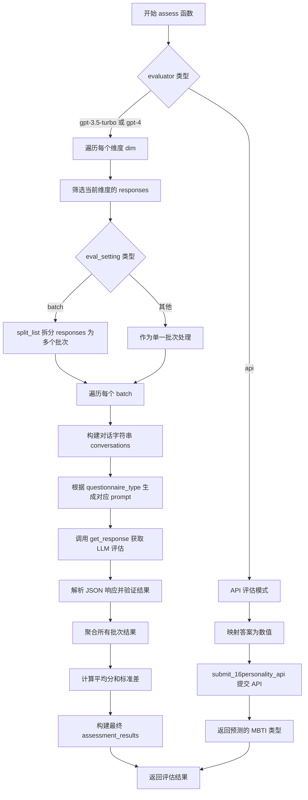

# `Chat-Haruhi-Suzumiya\research\personality\code\assess_personality.py` 详细设计文档

该代码是一个基于LLM的角色人格评估工具，通过模拟与虚拟角色的对话访谈，使用MBTI或Big Five问卷评估角色的人格特征，并将评估结果与真实标签进行对比。

## 整体流程


## 类结构

```
assess_personality.py (主模块)
├── 命令行参数解析 (argparse)
├── NAME_DICT (角色名称映射)
├── dims_dict (问卷维度定义)
├── 核心函数
│   ├── load_questionnaire()
│   ├── subsample_questionnaire()
│   ├── split_list()
│   ├── build_character_agent()
│   ├── get_experimenter()
│   ├── interview()
│   ├── assess()
│   └── personality_assessment()
└── 主执行入口 (if __name__ == '__main__')
```

## 全局变量及字段


### `parser`
    
命令行参数解析器

类型：`argparse.ArgumentParser`
    


### `args`
    
解析后的命令行参数

类型：`argparse.Namespace`
    


### `NAME_DICT`
    
中文角色名到英文代码的映射字典

类型：`dict`
    


### `dims_dict`
    
问卷类型对应的维度字典

类型：`dict`
    


### `mbti_labels`
    
角色MBTI真实标签

类型：`dict`
    


### `config`
    
配置文件内容

类型：`dict`
    


    

## 全局函数及方法


### `load_questionnaire`

加载指定类型的问卷数据，根据传入的问卷名称（如 'mbti' 或 'bigfive'）从 `data` 目录中读取对应的 JSONL 格式问卷文件，并返回包含所有问卷问题的列表。

参数：

- `questionnaire_name`：`str`，问卷类型名称，用于确定要加载的问卷文件（如 'mbti' 或 'bigfive'）

返回值：`list`，返回解析后的问卷问题列表，每个元素为一个字典，代表一道问卷问题

#### 流程图


#### 带注释源码

```python
def load_questionnaire(questionnaire_name):
    """
    加载指定类型的问卷数据
    
    Parameters:
        questionnaire_name (str): 问卷类型名称，如 'mbti' 或 'bigfive'
    
    Returns:
        list: 包含问卷问题的列表，每个元素是一个字典
    """
    # 使用 os.path.join 构建跨平台兼容的文件路径
    # 路径格式: ../data/{questionnaire_name}_questionnaire.jsonl
    q_path = os.path.join('..', 'data', f'{questionnaire_name}_questionnaire.jsonl')

    # 读取 JSONL (JSON Lines) 格式的文件
    # 每行是一个独立的 JSON 对象，代表一道问卷问题
    with open(q_path, 'r') as f:
        # 使用列表推导式逐行读取并解析 JSON
        # json.loads() 将 JSON 字符串转换为 Python 字典
        questionnaire = [json.loads(line) for line in f]
    
    # 返回包含所有问卷问题的列表
    return questionnaire
```


### `subsample_questionnaire`

该函数用于对问卷进行子采样，以减少问题数量。它支持两种问卷类型（bigfive 和 mbti），通过按维度（dimension）或子维度（sub_dimension）均匀采样问题来确保采样后的问卷仍保持原始的维度分布特性。

参数：
- `questionnaire`：`List[dict]`，问卷问题列表，每个问题是一个字典，包含 `dimension`、`sub_dimension`（仅 bigfive）等键
- `n`：`int`，目标采样问题数量，默认为 20

返回值：`List[dict]`，采样后的问题列表

#### 流程图

```mermaid
flowchart TD
    A[开始 subsample_questionnaire] --> B{检查 questionnaire[0] 是否有 'sub_dimension' 键}
    B -->|是 bigfive| C[按 'dimension' 分组问题到 dimension_questions]
    B -->|否 mbti| D[直接调用 subsample 函数, key='dimension']
    
    C --> E[遍历每个 dimension]
    E --> F[对每个 dimension 调用 subsample, key='sub_dimension']
    F --> G[采样数量为 n // len(dimension_questions)]
    G --> H[将采样结果添加到 new_questionnaire]
    D --> I[返回 subsample 结果到 new_questionnaire]
    H --> J[返回 new_questionnaire]
    I --> J
    
    subgraph subsample 内部逻辑
    K[获取 key 的所有唯一值] --> L[计算每个 key 的基础采样数 base_per_key = n // n_keys]
    L --> M[计算余数 remaining = n % n_keys]
    M --> N[随机选择 remaining 个 key 获取额外一个问题]
    N --> O[遍历每个 key_value]
    O --> P[筛选该 key 对应的问题]
    P --> Q[计算该 key 的采样数 num_samples]
    Q --> R{num_samples <= len(filtered_questions)?}
    R -->|是| S[随机采样 num_samples 个问题]
    R -->|否| T[采样所有可用问题, 更新 n]
    S --> U[将采样问题添加到结果]
    T --> U
    O --> V{还有剩余问题需要采样?}
    V -->|是| W[从剩余问题中随机采样补充]
    V -->|否| X[返回采样结果]
    W --> X
    end
    
    K --> L
```

#### 带注释源码

```python
def subsample_questionnaire(questionnaire, n=20):
    """
    对问卷进行子采样以减少问题数量
    
    参数:
        questionnaire: 问卷问题列表 (List[dict])
        n: 目标采样数量，默认为 20
    
    返回:
        采样后的问卷列表 (List[dict])
    """
    
    def subsample(questions, key, n):
        """
        从问题列表中按 key 均匀采样 n 个问题
        
        参数:
            questions: 问题列表
            key: 用于分组的键（如 'dimension' 或 'sub_dimension'）
            n: 采样数量
        
        返回:
            采样后的问题列表
        """
        # 获取该 key 的所有唯一值
        key_values = list(set([q[key] for q in questions]))
        n_keys = len(key_values)
        
        # 计算每个 key 的基础采样数
        base_per_key = n // n_keys
        # 计算余数，用于分配额外的采样名额
        remaining = n % n_keys

        # 随机选择 remaining 个 key，这些 key 将额外获得一个问题
        keys_w_additional_question = random.sample(key_values, remaining)
        subsampled_questions = []

        for key_value in key_values:
            # 筛选当前 key 对应的问题
            filtered_questions = [q for q in questions if q[key] == key_value]

            # 确定该 key 的采样数量：如果在额外名单中则+1
            num_samples = base_per_key + 1 if key_value in keys_w_additional_question else base_per_key

            # 如果该 key 的问题数量不足，调整采样数
            num_samples = min(num_samples, len(filtered_questions))
            
            # 随机采样并添加到结果中
            subsampled_questions += random.sample(filtered_questions, num_samples)
            n -= num_samples

        # 极端情况：如果某些 key 问题数量不足，导致未能采够 n 个问题
        # 从剩余问题中补充采样
        remaining_questions = [q for q in questions if q not in subsampled_questions]
        if n > 0 and len(remaining_questions) >= n:
            subsampled_questions += random.sample(remaining_questions, n)

        return subsampled_questions

    # 判断问卷类型：检查是否有 'sub_dimension' 键
    if 'sub_dimension' in questionnaire[0].keys():  # bigfive
        # 按 dimension 分组问题
        dimension_questions = {} 
        for q in questionnaire:
            if q['dimension'] not in dimension_questions.keys():
                dimension_questions[q['dimension']] = []
            
            dimension_questions[q['dimension']].append(q)
        
        new_questionnaire = []
        # 对每个 dimension 分别进行子采样
        for dim, dim_questions in dimension_questions.items():
            # 每个 dimension 采样 n // dimension数量 个问题
            new_questionnaire += subsample(dim_questions, 'sub_dimension', n // len(dimension_questions.keys()))

    else:  # mbti
        # MBTI 直接按 dimension 采样
        new_questionnaire = subsample(questionnaire, 'dimension', n)
    
    return new_questionnaire
```


### `split_list`

该函数用于将输入列表均匀地分割成多个子列表，每个子列表的长度控制在 n-1 到 n 之间（当无法完全等分时，通过从前面的子列表中抽取元素补齐最后一个子列表，使其长度尽可能均匀）。

参数：

- `input_list`：`list`，待分割的输入列表
- `n`：`int`，默认值为 4，目标子列表大小

返回值：`list[list]`，分割后的二维列表

#### 流程图

```mermaid
flowchart TD
    A[开始] --> B[使用列表推导式按步长n分割列表]
    B --> C[计算需要补齐的元素个数: num_to_pop = n - 1 - len(result[-1])]
    C --> D{num_to_pop > 0?}
    D -->|是| E[循环num_to_pop次]
    D -->|否| F[断言验证每个子列表长度在n-1到n之间]
    E --> G[从result[i]弹出最后一个元素并追加到result[-1]]
    E --> F
    F --> H[返回结果列表]
```

#### 带注释源码

```python
def split_list(input_list, n=4):
    # 第一步：使用列表推导式将列表按每n个元素进行分块
    # 例如：input_list=[1,2,3,4,5,6,7], n=4 时
    # result = [[1,2,3,4], [5,6,7]]
    result = [input_list[i:i+n] for i in range(0, len(input_list), n)]
    
    # 第二步：检查最后一个子列表的长度
    # 计算需要从前面子列表中补充的元素个数
    # n-1 是因为允许最后一个子列表最短为 n-1 个元素
    num_to_pop = n - 1 - len(result[-1])
    
    # 第三步：如果最后一个子列表长度不足 n-1，则从前面各子列表中各取一个元素补齐
    # 循环次数为 num_to_pop，每次从 result[i] 取出最后一个元素追加到 result[-1]
    for i in range(num_to_pop):
        result[-1].append(result[i].pop())

    # 第四步：断言验证
    # 确保每个子列表的长度都在 [n-1, n] 范围内
    # 这是该函数的核心契约：每个块至少 n-1 个元素，最多 n 个元素
    assert( all([len(_) >= n-1 and len(_) <= n for _ in result]) )
    
    return result
```


### `build_character_agent`

该函数用于构建角色对话Agent，通过调用`ChatHaruhi`库初始化指定角色的对话代理，并配置LLM（如OpenAI）的API密钥和温度参数，确保Agent能够以指定角色的身份进行对话。

参数：

- `character_code`：`str`，角色代码或英文名称（如"haruhi"、"hutao"等），用于指定要构建的角色
- `agent_llm`：`str`，代理使用的大型语言模型标识（如"gpt-3.5-turbo"、"openai"、"GLMPro"、"ChatGLM2GPT"）

返回值：`ChatHaruhi`对象，返回配置好的角色对话Agent实例

#### 流程图


#### 带注释源码

```python
def build_character_agent(character_code, agent_llm):
    """
    构建角色对话Agent
    
    参数:
        character_code: 角色代码/英文名
        agent_llm: 使用的LLM类型
    返回:
        配置好的ChatHaruhi角色Agent实例
    """
    # 动态导入ChatHaruhi库，用于创建角色对话代理
    from chatharuhi import ChatHaruhi
    haruhi_path = './content/Haruhi-2-Dev' 

    '''
    # 备选方案：可以从zip文件解压角色数据（当前被注释）
    # 1. 检查zip文件是否存在
    # 2. 解压到指定目录
    # 3. 读取角色数据库和system prompt
    # 4. 创建ChatHaruhi实例（使用story_db和system_prompt参数）
    '''
    
    # GPT-3.5-Turbo需要转换为openai标识符
    if agent_llm == 'gpt-3.5-turbo': 
        agent_llm = 'openai'

    # 设置OpenAI API密钥（仅当使用openai后端时需要）
    if agent_llm == 'openai':
        # 从config.json读取API密钥并设置为环境变量
        os.environ["OPENAI_API_KEY"] = config['openai_apikey']

    # 创建角色对话Agent实例
    # role_name: 指定角色名称（英文代码）
    # llm: 指定使用的语言模型后端
    character_agent = ChatHaruhi(role_name = character_code, llm = agent_llm)
    
    # 设置温度为0，使模型输出更确定性/稳定
    character_agent.llm.chat.temperature = 0 

    return character_agent
```


### `get_experimenter(character_name)`

获取与角色对应的实验者名称，返回与给定角色名称相关联的实验者名称（用于访谈中代表实验者/提问者）

参数：

- `character_name`：`str`，角色名称（中文或英文），用于在实验者字典中查找对应的实验者

返回值：`str`，返回与输入角色名称对应的实验者名称

#### 流程图


#### 带注释源码

```python
def get_experimenter(character_name):
    """
    获取与角色对应的实验者名称
    
    参数:
        character_name: str, 角色名称（中文或英文）
    
    返回:
        str: 对应的实验者名称
    """
    
    # 定义角色到实验者的映射字典
    # 键为角色名称，值为对应的实验者/访谈者名称
    # 包含多种角色：金庸小说人物、哈利波特角色、生活大爆炸角色、原神角色等
    EXPERIMENTER_DICT = {
        '汤师爷': '张牧之',           # 电影《让子弹飞》角色
        '慕容复': '王语嫣',           # 《天龙八部》角色
        '李云龙': '赵刚',             # 电视剧《亮剑》角色
        'Luna': 'Harry',              # 哈利波特系列
        '王多鱼': '夏竹',             # 电影《西虹市首富》
        'Ron': 'Hermione',            # 哈利波特系列
        '鸠摩智': '慕容复',           # 《天龙八部》角色
        'Snape': 'Dumbledore',        # 哈利波特系列
        '凉宫春日': '阿虚',           # 《凉宫春日的忧郁》
        'Malfoy': 'Crabbe',          # 哈利波特系列
        '虚竹': '乔峰',               # 《天龙八部》角色
        '萧峰': '阿朱',               # 《天龙八部》角色
        '段誉': '乔峰',               # 《天龙八部》角色
        'Hermione': 'Harry',         # 哈利波特系列
        'Dumbledore': 'McGonagall',  # 哈利波特系列
        '王语嫣': '段誉',             # 《天龙八部》角色
        'Harry': 'Hermione',         # 哈利波特系列
        'McGonagall': 'Dumbledore',  # 哈利波特系列
        '白展堂': '佟湘玉',           # 电视剧《武林外传》
        '佟湘玉': '白展堂',           # 电视剧《武林外传》
        '郭芙蓉': '白展堂',           # 电视剧《武林外传》
        '旅行者': '派蒙',             # 原神角色
        '钟离': '旅行者',             # 原神角色
        '胡桃': '旅行者',             # 原神角色
        'Sheldon': 'Leonard',        # 《生活大爆炸》
        'Raj': 'Leonard',            # 《生活大爆炸》
        'Penny': 'Leonard',          # 《生活大爆炸》
        '韦小宝': '双儿',             # 《鹿鼎记》
        '乔峰': '阿朱',               # 《天龙八部》角色
        '神里绫华': '旅行者',         # 原神角色
        '雷电将军': '旅行者',         # 原神角色
        '于谦': '郭德纲'              # 相声演员
    }
    
    # 从字典中返回对应角色的实验者名称
    # 注意：如果 character_name 不在字典中，会抛出 KeyError 异常
    return EXPERIMENTER_DICT[character_name]
```


### `interview`

执行角色访谈函数，用于与构建的角色代理进行互动问答，遍历问卷中的所有问题，获取角色的开放性回答，并整理成结果列表。

参数：

- `character_agent`：`ChatHaruhi`（或类似角色代理对象），由 `build_character_agent` 函数创建的角色代理实例，负责与角色进行对话
- `questionnaire`：`list`，问卷列表，每个元素是一个包含问题内容的字典，必须包含 `question_{language}` 字段（language 参数指定语言）以及 `id` 和 `dimension` 字段
- `experimenter`：`str`，采访者名称（角色名），用于在对话中作为提问者
- `language`：`str`，语言标识符，支持 `'cn'`（中文）或 `'en'`（英文），用于从问卷中提取对应语言的问题
- `evaluator`：`str`，评估器类型，当前参数预留（代码中被注释），可支持 `'api'`、`'gpt-3.5-turbo'` 或 `'gpt-4'` 等值

返回值：`list`，返回包含所有问答结果的列表，每个元素是一个字典，包含以下键值对：

- `id`：问题 ID（int 或 str）
- `question`：问题内容（str）
- `response_open`：角色对问题的开放性回答（str）
- `dimension`：问题所属维度（str），如 MBTI 的 'E/I'、'S/N' 等

#### 流程图


#### 带注释源码

```python
def interview(character_agent, questionnaire, experimenter, language, evaluator):
    """
    执行角色访谈的主函数
    
    参数:
        character_agent: 角色代理对象，负责与角色进行对话交互
        questionnaire: 问卷列表，每个元素是一个包含问题的字典
        experimenter: 采访者名称，用于在对话中扮演提问者角色
        language: 语言类型，'cn' 或 'en'，用于获取对应语言的问题
        evaluator: 评估器类型（当前预留，代码中已注释相关逻辑）
    
    返回:
        results: 包含所有问答结果的列表
    """
    
    # 初始化结果列表，用于存储每个问题的问答结果
    results = []

    # 遍历问卷中的每一个问题，使用 tqdm 显示进度条
    for question in tqdm(questionnaire):
        # 根据指定语言从问题字典中获取对应的问题文本
        # 例如: language='cn' 时获取 'question_cn' 字段
        q = question[f'question_{language}']
        
        # 在每次提问前清空角色代理的对话历史
        # 确保每次问答都是独立的，不受之前对话的影响
        character_agent.dialogue_history = []

        # 调用角色代理的 chat 方法进行对话
        # 参数 role 指定提问者身份（experimenter）
        # 参数 text 指定要提问的问题内容
        open_response = character_agent.chat(role = experimenter, text = q)

        # 构建当前问题的结果字典
        result = {
            'id': question['id'],                    # 问题的唯一标识符
            'question': q,                            # 问题内容
            'response_open': open_response,           # 角色的开放性回答
            'dimension': question['dimension'],       # 问题所属的心理测量维度
        }

        '''
        以下代码块已被注释，表示预留的评估逻辑
        如果 evaluator == 'api'，可以生成封闭式选项问题
        但当前版本未启用此功能
        
        if evaluator == 'api':
            # 准备封闭式问题的提示模板
            close_prompt_template = prompts.close_prompt_template
            close_prompt = close_prompt_template.format(q)
            # 获取封闭式回答
            close_response = character_agent.chat(role = experimenter, text = close_prompt)
            result['response_close'] = close_response
        '''

        # 将当前问题的结果添加到结果列表中
        results.append(result)

    # 遍历完成后，返回所有问答结果
    return results
```


### `assess`

该函数是人格评估的核心函数，负责根据问卷调查结果和实验者对话内容，使用LLM或API评估角色的人格类型（MBTI或大五人格）。函数支持批量处理、集体评估和采样三种评估模式，并返回结构化的人格评估结果。

参数：

- `character_name`：`str`，被评估角色的中文名称
- `experimenter`：`str`，进行访谈的实验者名称
- `questionnaire_results`：`list`，包含角色对问卷问题回答的列表，每个元素包含问题、回答和维度信息
- `questionnaire_type`：`str`，问卷类型，支持'mbti'或'bigfive'
- `evaluator`：`str`，评估器类型，支持'gpt-3.5-turbo'、'gpt-4'或'api'
- `eval_setting`：`str`，评估设置，支持'batch'（批量）、'collective'（集体）、'sample'（采样）

返回值：`dict`，结构化的人格评估结果，键为维度名称，值为包含预测结果、分数、标准差和批次详细结果的字典

#### 流程图



#### 带注释源码

```python
def assess(character_name, experimenter, questionnaire_results, questionnaire_type, evaluator, eval_setting):
    """
    评估角色人格的核心函数
    
    参数:
        character_name: 角色中文名称
        experimenter: 实验者名称
        questionnaire_results: 问卷调查结果列表
        questionnaire_type: 问卷类型 ('mbti' 或 'bigfive')
        evaluator: 评估器 ('gpt-3.5-turbo', 'gpt-4', 'api')
        eval_setting: 评估设置 ('batch', 'collective', 'sample')
    
    返回:
        assessment_results: 人格评估结果字典
    """
    # 获取对应问卷类型的维度列表
    # MBTI: ['E/I', 'S/N', 'T/F', 'P/J']
    # BigFive: ['openness', 'extraversion', 'conscientiousness', 'agreeableness', 'neuroticism']
    dims = dims_dict[questionnaire_type]
    
    # 导入工具函数
    from utils import get_response 
    
    # 初始化结果字典
    assessment_results = {}
    
    # ====== LLM 评估模式 ======
    if evaluator in ['gpt-3.5-turbo', 'gpt-4']:
        # 如果是 collective 模式且使用 3.5-turbo，切换到 16k 版本以处理更长上下文
        if evaluator == 'gpt-3.5-turbo' and eval_setting == 'collective':
            evaluator = 'gpt-3.5-turbo-16k'

        # 遍历每个维度进行评估
        for dim in tqdm(dims):
            # 筛选当前维度的所有响应
            dim_responses = [r for r in questionnaire_results if r['dimension'] == dim]

            # 根据 eval_setting 决定如何分组
            if eval_setting == 'batch':
                # 将维度响应分成多个子列表，每个3-4个元素
                dim_responses_list = split_list(dim_responses)
            else:
                # 整体作为一个批次
                dim_responses_list = [dim_responses] 

            batch_results = [] 

            # 处理每个批次的响应
            for batch_responses in dim_responses_list:
                conversations = ''
                # 构建对话字符串
                for i, r in enumerate(batch_responses):
                    # 添加问题
                    conversations += f'{i+1}.\n'
                    conversations += f"{experimenter}: 「{r['question']}」\n"
                    # 添加回答，确保格式统一
                    if not r['response_open'].startswith(character_name):
                        r['response_open'] = character_name + ': 「' + r['response_open'] + '」'
                    conversations += f"{r['response_open']}\n"
                
                # 根据问卷类型生成对应的 prompt
                if questionnaire_type == 'mbti':
                    # 分割维度如 'E/I' -> 'E' 和 'I'
                    dim_cls1, dim_cls2 = dim.split('/')
                    # 使用 MBTI 评估模板生成 prompt
                    prompt = prompts.mbti_assess_prompt_template.format(
                        dim, 
                        prompts.mbti_dimension_prompt[dim], 
                        character_name, 
                        conversations, 
                        character_name, 
                        dim_cls1, 
                        dim_cls2, 
                        dim, 
                        dim_cls1, 
                        dim_cls2
                    )
                else:
                    # 使用 BigFive 评估模板生成 prompt
                    prompt = prompts.bigfive_assess_prompt_template.format(
                        dim, 
                        prompts.bigfive_dimension_prompt[dim], 
                        character_name, 
                        conversations, 
                        character_name, 
                        dim, dim, dim, dim, dim, dim
                    )

                # 分割 system prompt 和 user input
                sys_prompt, user_input = prompt.split("I've invited a participant")
                user_input = "I've invited a participant" + user_input

                # 调用 LLM 获取评估结果
                llm_response = get_response(sys_prompt, user_input, model=evaluator)
                # 解析 JSON 响应
                llm_response = json.loads(llm_response)

                # 验证并转换结果格式
                try:
                    if questionnaire_type == 'mbti':
                        # 将字符串分数转换为整数，确保总和为100
                        llm_response['result'] = {k: int(float(v)) for k, v in llm_response['result'].items()}
                        assert (sum(llm_response['result'].values()) == 100)
                    else:
                        # BigFive 直接转为浮点数
                        llm_response['result'] = float(llm_response['result'])
                except:
                    raise ValueError(f"Error parsing llm response {llm_response}")
                
                # 保存批次结果
                batch_results.append({
                    'batch_responses': batch_responses, 
                    'result': llm_response['result'], 
                    'analysis': llm_response['analysis']
                })

            # ====== 聚合批次结果 ======
            if questionnaire_type == 'mbti':
                # 使用 dim_cls1 的分数进行聚合
                all_scores = [dim_res['result'][dim_cls1] for dim_res in batch_results]
            else:
                all_scores = [dim_res['result'] for dim_res in batch_results]
            
            count_group = len(batch_results)

            # 计算平均分
            avg_score = sum(all_scores) / count_group
            # 计算标准差（样本标准差）
            if count_group > 1:
                std_score = math.sqrt(sum([(s - avg_score)**2 for s in all_scores]) / (count_group - 1))
            else:
                std_score = None
            
            # 构建最终结果
            if questionnaire_type == 'mbti':
                # 计算两个维度的分数并选择较高的作为预测
                score = {dim_cls1: avg_score, dim_cls2: 100 - avg_score}
                pred = max(score, key=score.get)

                assessment_results[dim] = {
                    'result': pred,           # 预测的维度类型
                    'score': score,           # 详细分数
                    'standard_variance': std_score,   # 标准差
                    'batch_results': batch_results,   # 批次详细结果
                }
            else:  # bigfive
                assessment_results[dim] = {
                    'score': avg_score,              # 平均分数
                    'standard_variance': std_score,  # 标准差
                    'batch_results': batch_results,   # 批次详细结果
                }

    # ====== API 评估模式 ======
    elif evaluator == 'api':
        # API 模式仅支持 MBTI
        assert(questionnaire_type == 'mbti')
        
        # 定义选项到数值的映射
        options = ['fully agree', 'generally agree', 'partially agree', 
                   'neither agree nor disagree', 'partially disagree', 
                   'generally disagree', 'fully disagree']
        ans_map = {option: i - 3 for i, option in enumerate(options)}

        answers = []
        # 遍历所有问卷结果
        for i, response in enumerate(questionnaire_results):
            # 生成将开放回答转换为选项的 prompt
            sys_prompt = prompts.to_option_prompt_template.format(character_name, experimenter)

            conversations = ''
            conversations += f"{experimenter}: 「{response['question']}」\n"
            # 确保回答格式统一
            if not response['response_open'].startswith(character_name):
                response['response_open'] = character_name + ': 「' + response['response_open']} + '」'
            conversations += f"{response['response_open']}\n"
            
            user_input = conversations

            # 调用 LLM 获取选项答案
            llm_response = get_response(sys_prompt, user_input, model="gpt-3.5-turbo").strip('=\n')
            llm_response = json.loads(llm_response)

            # 获取答案并映射为数值
            answer = llm_response['result']
            answers.append(ans_map[answer])

        # 导入并调用 16Personality API
        from api_16personality import submit_16personality_api
        pred = submit_16personality_api(answers)
        
        # 直接返回预测的 MBTI 类型
        assessment_results = pred
    
    return assessment_results
```


### `personality_assessment`

该函数是主评估流程的入口函数，负责协调整个角色人格评估流程。它首先根据角色名称解析对应的角色代码，加载指定类型的问卷（MBTI或Big Five），构建角色Agent，然后依次执行访谈、评估并输出结果。

参数：

- `character`：`str`，角色名称（中文或英文代码），用于在NAME_DICT中查找对应的角色信息
- `agent_llm`：`str`，Agent使用的LLM模型，支持'gpt-3.5-turbo'、'openai'、'GLMPro'、'ChatGLM2GPT'
- `questionnaire_type`：`str`，问卷类型，支持'mbti'或'bigfive'
- `eval_setting`：`str`，评估设置，支持'batch'（批量）、'collective'（集体）、'sample'（抽样）
- `evaluator`：`str`，评估器，支持'api'、'gpt-3.5-turbo'、'gpt-4'
- `language`：`str`，语言选项，暂时支持'cn'（中文）和'en'（英文）

返回值：`None`，该函数不返回任何值，结果直接保存到JSON文件并通过logger输出

#### 流程图


#### 带注释源码

```python
def personality_assessment(character, agent_llm, questionnaire_type, eval_setting, evaluator, language):
    # 步骤1: 解析角色名称和角色代码
    # character_name: 角色中文名
    # character_code: 角色英文代码
    if character in NAME_DICT.keys():
        character_name = character
        character_code = NAME_DICT[character]
    elif character in NAME_DICT.values():
        character_code = character
        # 通过列表推导式根据英文代码查找中文名
        character_name = [k for k, v in NAME_DICT.items() if v == character][0]
    else:
        raise ValueError(f"Character '{character}' not found in NAME_DICT. Here are the items: {list(NAME_DICT.items())}")
    
    # 步骤2: 加载问卷
    # 根据questionnaire_type加载对应的问卷数据（MBTI或Big Five）
    if questionnaire_type in ['bigfive', 'mbti']:
        questionnaire = load_questionnaire(questionnaire_type)
    else:
        raise NotImplementedError
    
    # 步骤3: 抽样处理（如果eval_setting为sample）
    # 如果是sample模式，对问卷进行均匀抽样以减少问题数量
    if eval_setting == 'sample':
        questionnaire = subsample_questionnaire(questionnaire)

    # 步骤4: 构建角色Agent
    # 使用ChatHaruhi框架构建角色对话Agent
    character_agent = build_character_agent(character_code, agent_llm) 
    logger.info(f'Character agent created for {character_name}')

    # 步骤5: 获取实验者
    # 根据角色获取对应的实验者（对话的另一方）
    experimenter = get_experimenter(character_name)
    
    # 步骤6: 执行访谈
    # 构建访谈结果保存路径
    interview_folder_path = os.path.join('..', 'results', 'interview')
    if not os.path.exists(interview_folder_path):
        os.makedirs(interview_folder_path)

    # 生成访谈结果文件名，包含角色、LLM、问卷类型、抽样设置、语言等信息
    interview_save_path = f'{character_name}_agent-llm={agent_llm}_{questionnaire_type}_sample={eval_setting=="sample"}_{language}_interview.json'
    interview_save_path = os.path.join(interview_folder_path, interview_save_path)
    
    # 检查是否已有访谈结果，避免重复执行
    if not os.path.exists(interview_save_path):
        logger.info('Interviewing...')
        # 执行访谈，获取角色对所有问卷问题的回答
        questionnaire_results = interview(character_agent, questionnaire, experimenter, language, evaluator)
        with open(interview_save_path, 'w') as f:
            json.dump(questionnaire_results, f, indent=4, ensure_ascii=False)
        logger.info(f'Interview finished... save into {interview_save_path}')
    else:
        # 直接加载已有的访谈结果
        logger.info(f'Interview done before. load directly from {interview_save_path}')
        with open(interview_save_path, 'r') as f:
            questionnaire_results = json.load(f)

    # 步骤7: 评估人格
    # 构建评估结果保存路径
    assessment_folder_path = os.path.join('..', 'results', 'assessment')
    if not os.path.exists(assessment_folder_path):
        os.makedirs(assessment_folder_path)

    assessment_save_path = f'{character_name}_agent-llm={agent_llm}_{questionnaire_type}_eval={eval_setting}-{evaluator}_{language}_interview.json'
    assessment_save_path = os.path.join(assessment_folder_path, assessment_save_path)

    # 检查是否已有评估结果
    if not os.path.exists(assessment_save_path):
        logger.info('Assessing...')
        # 调用assess函数进行人格评估
        assessment_results = assess(character_name, experimenter, questionnaire_results, questionnaire_type, evaluator, eval_setting)
        with open(assessment_save_path, 'w') as f:
            json.dump(assessment_results, f, indent=4, ensure_ascii=False)
        logger.info(f'Assess finished... save into {assessment_save_path}')
    else:
        # 直接加载已有的评估结果
        logger.info(f'Assess done before. load directly from {assessment_save_path}')
        with open(assessment_save_path, 'r') as f:
            assessment_results = json.load(f)

    # 步骤8: 输出评估结果
    # 根据问卷类型输出不同的日志信息
    if questionnaire_type == 'mbti':
        # 输出MBTI评估结果
        logger.info('MBTI assessment results:')
        logger.info('Character: ' + character_name)
        # 拼接四个维度的预测结果形成MBTI代码
        pred_code = ''.join([ assessment_results[dim]['result'] for dim in dims_dict['mbti']])
        # 获取真实标签用于对比
        label_code = mbti_labels[character_name]

        # 输出预测结果和真实结果
        logger.info(f'Prediction {pred_code}\tGroundtruth {label_code}')

        # 遍历每个维度输出详细信息
        for dim, result in assessment_results.items():
            if "score" in result:
                logger.info(f'{dim}: {result["score"]}')
            if "standard_variance" in result and result["standard_variance"] != None:
                logger.info(f'{std}: {result["standard_variance"]:.2f}')
            if "batch_results" in result:
                # 输出第一个batch的分析结果
                logger.info(f'{result["batch_results"][0]["analysis"]}')
    
    else:
        # 输出Big Five评估结果
        logger.info('Big Five assessment results:')
        logger.info('Character: ' + character_name)

        for dim, result in assessment_results.items():
            if "score" in result:
                logger.info(f'{dim}: {result["score"]}')
            if "standard_variance" in result and result["standard_variance"] != None:
                logger.info(f'{dim}: {result["standard_variance"]:.2f}')
            if "batch_results" in result:
                # 输出第一个batch的分析结果
                logger.info(f'{result["batch_results"][0]["analysis"]}')
```

## 关键组件


### 问卷加载与采样系统

负责从JSONL文件加载MBTI或Big Five问卷，并根据设置进行子采样以减少问题数量。

### 角色Agent构建系统

使用ChatHaruhi库构建特定角色的对话Agent，支持多种LLM后端（GPT-3.5、ChatGLM等），配置温度为0以保证一致性。

### 访谈执行系统

通过角色Agent与实验者进行多轮对话，收集开放性回答，支持中文和英文问题。

### 评估与推断系统

使用LLM对访谈结果进行人格评估，支持批量评估和聚合多批次结果，计算预测分数和标准差，支持MBTI和Big Five两种人格模型。

### 配置与参数管理系统

通过argparse管理命令行参数，支持问卷类型、角色、LLM模型、评估方式和语言等选项的配置。

### 数据持久化系统

负责将访谈结果和评估结果保存为JSON文件，支持结果缓存和重复加载。

### 角色与实验者映射系统

维护角色名称到代码的映射关系，以及每个角色对应的实验者（对话者）名称。


## 问题及建议


### 已知问题

- **硬编码路径和配置**：多处使用硬编码路径如 `'..', 'data', 'mbti_labels.jsonl'`、`'./content/Haruhi-2-Dev'`，缺乏可配置性
- **未使用的代码和导入**：存在大量被注释掉的代码（如 zip 文件处理逻辑、close-ended 选项逻辑），导入的 `zipfile` 模块未被使用，`pdb` 导入未使用
- **TODO 标记未完成**：`assess` 函数中有 TODO 注释标记 `evaluator == 'api'` 和 `questionnaire_type == 'bigfive'` 功能未实现
- **API Key 安全管理**：直接从 config 读取 openai_apikey 写入环境变量，缺乏安全的密钥管理机制
- **异常处理不完善**：文件读取、JSON 解析（`json.loads`）缺乏 try-except 保护，可能导致程序崩溃
- **重复代码**：文件路径构造逻辑在 `interview_save_path` 和 `assessment_save_path` 处重复，结果保存逻辑也重复
- **硬编码数据字典**：`NAME_DICT` 和 `EXPERIMENTER_DICT` 字典体积大且硬编码，应考虑外部配置或数据库
- **变量名错误**：在 MBTI 结果输出日志中存在 `logger.info(f'{std}: {result["standard_variance"]:.2f}')`，其中 `std` 变量未定义，应为 `dim`
- **缺少类型注解**：整个代码没有任何类型提示（type hints），影响可维护性和 IDE 支持
- **Magic Numbers**：多处使用魔数如 `random.seed(42)`、`temperature = 0`、`sum(llm_response['result'].values()) == 100`，缺乏常量定义
- **函数缺少文档字符串**：所有函数均无 docstring，无法快速理解函数用途
- **潜在的内存问题**：一次性加载整个问卷文件到内存，对于大型数据集可能存在性能瓶颈

### 优化建议

- **提取配置信息**：将路径、API 密钥、字典数据等抽取到独立的配置文件（如 config.yaml 或 .env）
- **清理未使用代码**：删除被注释掉的代码和未使用的导入，简化代码库
- **完善 TODO 功能**：实现 `evaluator == 'api'` 和 `questionnaire_type == 'bigfive'` 的支持
- **添加异常处理**：为文件 I/O、JSON 解析、API 调用等关键操作添加 try-except 异常捕获
- **消除重复代码**：将路径构造和结果保存逻辑封装为独立函数或使用模板方法模式
- **修复 bug**：修正日志中 `std` 变量未定义的问题
- **添加类型注解**：为所有函数参数和返回值添加类型提示
- **定义常量类**：将魔数提取为常量类或枚举，如 `TemperatureConfig`、`ScoreConstants`
- **添加文档字符串**：为每个函数添加 Google 风格的 docstring，说明参数、返回值和功能
- **考虑流式处理**：对于大型问卷数据，考虑使用生成器或分批加载方式减少内存占用
- **改进日志记录**：在关键决策点添加更详细的日志，便于调试和追踪
- **重构字典查找**：`get_experimenter` 函数使用大字典，可考虑使用配置文件或数据库，并添加找不到时的默认处理


## 其它


### 设计目标与约束

本项目旨在通过大语言模型（LLM）评估虚构角色的性格特征，支持MBTI和Big Five两种人格评估体系。系统设计遵循以下目标：1）支持多种LLM后端（GPT-3.5-turbo、GPT-4、GLMPro、ChatGLM2GPT）；2）支持中英文双语评估；3）提供批量评估和采样评估两种模式；4）实现评估结果的可复现性（通过随机种子42）。约束条件包括：API调用成本限制、LLM上下文窗口限制（如gpt-3.5-turbo-16k用于长对话）、角色代理依赖ChatHaruhi库。

### 错误处理与异常设计

系统采用分层错误处理策略：1）参数验证阶段通过argparse的choices参数限制合法取值范围；2）字符名称验证在personality_assessment函数中检查NAME_DICT，若未找到则抛出ValueError；3）LLM响应解析使用try-except块捕获json.loads异常，并验证评估结果的合理性（如MBTI分数总和必须为100）；4）文件操作检查路径是否存在，必要时创建目录；5）API评估器仅支持MBTI类型，调用时通过assert进行类型校验。

### 数据流与状态机

系统数据流分为三个主要阶段：**访谈阶段**：加载问卷→子采样（可选）→构建角色代理→遍历问题列表→获取开放回答→保存访谈结果；**评估阶段**：加载访谈结果→按维度分组→批量处理（batch模式）或单次处理（其他模式）→调用LLM进行性格评估→解析JSON响应→聚合多批次结果计算平均值和标准差→保存评估结果；**结果展示阶段**：根据问卷类型格式化输出MBTI四维字母或Big Five分数。

### 外部依赖与接口契约

系统依赖以下外部模块：1）**openai**库：提供GPT系列模型的API调用；2）**chatharuhi**库：角色扮演代理框架，build_character_agent函数通过role_name和llm参数创建代理实例；3）**prompts**模块：包含mbti_assess_prompt_template、bigfive_assess_prompt_template、mbti_dimension_prompt、bigfive_dimension_prompt等提示模板；4）**utils**模块：提供logger日志对象和get_response函数用于LLM调用；5）**api_16personality**模块：submit_16personality_api函数用于16人格API提交。配置文件config.json需包含openai_apikey字段。

### 配置管理与环境要求

系统配置通过三处管理：1）命令行参数：通过argparse定义questionnaire_type、character、agent_llm、evaluator、eval_setting、language六个配置项；2）config.json文件：存储openai_apikey用于API认证；3）环境变量：os.environ["OPENAI_API_KEY"]在agent_llm为openai时设置。运行环境要求Python 3.x、tqdm进度条库、json处理库、zipfile压缩库、random数学库、math计算库。

### 性能指标与基准

系统性能关注点包括：1）访谈阶段每个问题需要一次LLM调用，耗时与网络延迟和LLM响应时间相关；2）评估阶段batch模式下将3-4个问题合并为一次LLM调用以减少API请求次数；3）采样模式（sample）将问卷缩减至约20个问题以加快评估速度；4）访谈结果和评估结果均缓存至JSON文件避免重复计算。基准测试命令：python assess_personality.py --eval_setting sample --questionnaire_type mbti用于快速验证。

### 安全考虑

系统涉及的安全问题：1）API密钥管理：config.json中的openai_apikey为敏感信息，应通过环境变量或密钥管理服务注入，生产环境不应提交至版本控制；2）LLM生成内容：角色回答可能包含不当内容，需在上游ChatHaruhi层面进行内容过滤；3）文件路径安全：使用os.path.join构建路径避免路径遍历攻击。

### 测试策略

建议的测试覆盖：1）单元测试：验证subsample_questionnaire的采样均匀性、split_list的分块正确性、NAME_DICT的字符映射完整性；2）集成测试：使用已知MBTI类型的角色（如haruhi→INFP）运行完整流程并验证预测准确性；3）Mock测试：对openai API调用进行mock以加速CI/CD流程；4）边界测试：测试超长角色名称、空问卷文件、API响应格式异常等边界情况。

### 版本兼容性说明

当前代码存在版本兼容性问题：1）argparse的help参数中包含中文可能在某些终端显示乱码；2）ChatHaruhi库的API可能随版本变化，build_character_agent函数中的llm参数映射（gpt-3.5-turbo→openai）需与库版本匹配；3）JSON解析依赖LLM输出格式的严格性，需关注openai模型版本更新导致的输出格式变化。

### 部署架构

推荐部署方式：1）开发/调试环境：直接运行Python脚本，通过命令行参数指定配置；2）生产环境：封装为REST API服务，接收JSON格式的评估请求，返回JSON格式的评估结果；3）批量评估场景：结合任务调度系统（如Airflow）批量处理角色列表，将结果存储至数据库或对象存储。

    