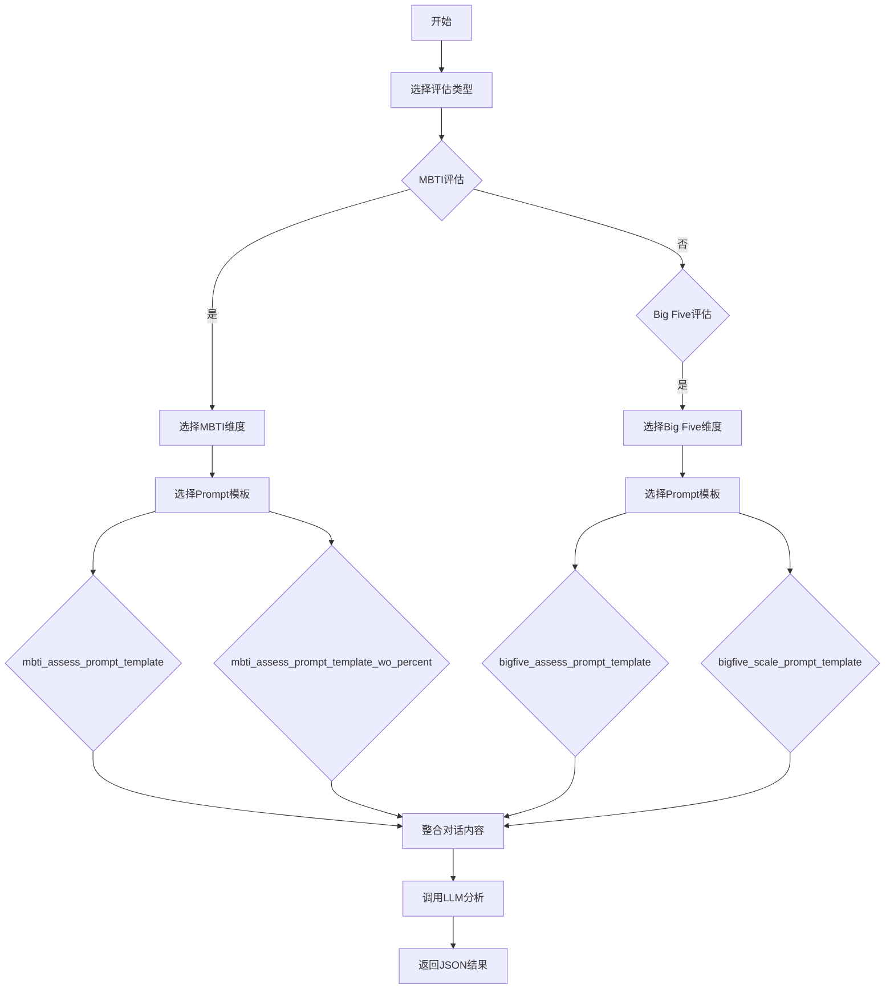

# `Chat-Haruhi-Suzumiya\research\personality\code\prompts.py` 详细设计文档

该文件定义了用于MBTI和Big Five人格评估的提示词模板，包含了多种评估场景下的prompt，包括量表评分、维度分析、选项分类等，为大语言模型提供结构化的人格测评分析能力。

## 整体流程



## 类结构

```
无类层次结构（该文件仅包含全局变量和字符串模板）
```

## 全局变量及字段


### `close_prompt_template`
    
用于生成结束对话时的提示模板，引导用户从给定的选项中选择一个答案

类型：`str`
    


### `bigfive_scale_prompt_template`
    
大五人格量表的评分提示模板，用于让AI根据心理评估报告输出人格分数和原因

类型：`str`
    


### `mbti_assess_prompt_template_wo_percent`
    
MBTI评估的提示模板（不含百分比），用于分析用户在某个MBTI维度上的倾向并输出分析结果和二元结果

类型：`str`
    


### `bigfive_assess_prompt_template`
    
大五人格评估的详细提示模板，用于分析用户在特定大五人格维度上的表现并给出-5到5的分数

类型：`str`
    


### `mbti_assess_prompt_template`
    
MBTI评估的提示模板（含百分比），用于分析用户在某个MBTI维度上两种类型的占比并输出百分比

类型：`str`
    


### `mbti_dimension_prompt`
    
包含MBTI四个维度（E/I、S/N、T/F、P/J）详细定义和特征描述的字典，用于评估时提供维度背景知识

类型：`dict`
    


### `to_option_prompt_template`
    
将用户的开放式回答分类为七个标准选项之一的提示模板，用于标准化 Likert 量表回答

类型：`str`
    


### `bigfive_dimension_prompt`
    
包含大五人格五个维度（尽责性、开放性、宜人性、外向性、神经质）详细定义和六个子维度的字典

类型：`dict`
    


    

## 全局函数及方法


## 关键组件


### close_prompt_template

封闭式问题提示模板，用于将开放性回答转换为七级李克特量表选项（完全同意到完全不同意）

### bigfive_scale_prompt_template

大五人格量表评分提示模板，根据报告内容生成-5到5分的评分及理由

### mbti_assess_prompt_template_wo_percent

MBTI评估提示模板（无百分比版本），用于判断参与者在MBTI某维度上倾向于两端中的哪一端

### bigfive_assess_prompt_template

大五人格评估提示模板，根据对话内容评估参与者在特定大五人格维度上的高低倾向

### mbti_assess_prompt_template

MBTI评估提示模板（含百分比版本），输出参与者在MBTI某维度上两端的百分比分布

### mbti_dimension_prompt

MBTI四维度定义字典，包含E/I、S/N、T/F、P/J各维度的详细心理学解释

### to_option_prompt_template

开放式回答转选项提示模板，将中文回答分类为七个标准化同意程度选项

### bigfive_dimension_prompt

大五人格维度详细定义字典，包含尽责性、开放性、宜人性、外向性、神经质五个维度及其六个子维度的完整说明


## 问题及建议


### 已知问题

-   **魔法字符串和硬编码值**：大量提示模板中的字段名、选项值等以硬编码形式存在，缺乏常量定义，不利于维护和修改
-   **重复代码**：mbti_assess_prompt_template 与 mbti_assess_prompt_template_wo_percent 存在大量重复，代码冗余
-   **字符串格式化方式不统一**：混合使用了 % 格式化、.format()、f-string 以及手动替换 {}，风格不一致
-   **中英文混杂**：变量名用英文但提示模板内容混用中英文，close_prompt_template 完全是中文而其他模板是英文
-   **to_option_prompt_template 语法错误**：模板中存在 "one the the" 笔误，应为 "one of the"
-   **JSON占位符格式不统一**：mbti_assess_prompt_template 使用 {{}} 转义大括号，而 mbti_assess_prompt_template_wo_percent 使用 <> 尖括号
-   **bigfive_dimension_prompt 初始化方式不当**：先定义空字典再逐个填充，可读性差
-   **缺乏文档注释**：模块级和代码块均无文档字符串，难以理解设计意图
-   **模板定界符不统一**：同时使用三引号 """ 和单引号 '''，缺乏一致性
-   **变量命名不一致**：close_prompt_template 使用驼峰命名，而其他变量使用下划线命名

### 优化建议

-   **提取常量**：将选项列表、字段名等提取为常量或枚举类，如 OPTIONS = ['完全同意', '基本同意', ...]
-   **消除重复**：合并 mbti_assess_prompt_template 和 mbti_assess_prompt_template_wo_percent，通过参数控制是否包含百分比
-   **统一格式化风格**：统一使用 f-string 或 .format() 进行字符串格式化
-   **统一语言**：建议统一使用英文或中文，或明确区分国际化场景
-   **修复语法错误**：更正 to_option_prompt_template 中的 "one the the" 为 "one of the"
-   **统一JSON格式**：统一使用大括号 {} 作为JSON输出的占位符，避免尖括号 <>
-   **改进字典初始化**：直接初始化 bigfive_dimension_prompt 包含所有维度，而非先空后填充
-   **添加文档注释**：为模块添加 docstring，说明整体功能；为复杂代码块添加注释
-   **统一定界符**：统一使用一种引号风格，如全部使用三引号定义多行字符串
-   **统一命名风格**：统一变量命名风格，建议全部使用下划线命名（snake_case）


## 其它


### 设计目标与约束

该代码库的核心设计目标是为MBTI（迈尔斯-布里格斯类型指标）和Big Five（大五人格）心理测评提供标准化的提示词模板，支持通过大型语言模型（LLM）进行自动化心理测评分析。主要约束包括：1）模板内容需符合心理学理论框架；2）输出格式严格限定为JSON以便于解析；3）所有提示词需支持中文对话内容分析；4）大五人格评分范围限定在-5到5分之间。

### 错误处理与异常设计

由于本代码仅为模板定义，不涉及运行时逻辑处理，因此错误处理主要体现在模板设计层面：1）LLM输出可能不符合JSON格式，需在调用层进行JSON解析异常捕获；2）LLM返回的分数超出-5到5范围时，需进行边界值校验和修正；3）对话内容为空或过短时，模板中通过提示词要求LLM返回0分表示无法判断。

### 数据流与状态机

数据流遵循以下路径：1）用户输入对话内容 → 2）选择对应测评维度的提示词模板 → 3）填充模板中的占位符（参与者姓名、对话内容、维度名称、维度说明等）→ 4）发送给LLM处理 → 5）解析LLM返回的JSON结果。状态机主要涉及测评类型选择状态（MBTI四维或大五人格五维）和评估结果状态（分析文本+量化分数/百分比）。

### 外部依赖与接口契约

外部依赖包括：1）大型语言模型API（如OpenAI GPT系列），需支持JSON格式输出；2）调用层系统需提供对话历史记录和参与者信息。接口契约要求：LLM输入为格式化后的提示词字符串，输出必须为有效JSON，包含analysis和result两个字段。

### 性能考虑与资源使用

本代码为纯文本模板，无运行时性能开销。模板字符串在系统启动时加载至内存，预估占用内存约50-100KB。关键性能优化点：1）bigfive_dimension_prompt和mbti_dimension_prompt可考虑缓存以避免重复构建；2）大型对话历史需进行截断处理以控制token消耗。

### 安全性考虑

模板中不涉及敏感个人信息存储，但需注意：1）通过LLM处理的心理测评对话内容可能包含用户隐私数据，需在调用层确保数据传输和存储的安全性；2）模板中占位符填充时需对特殊字符进行转义处理，防止提示词注入攻击；3）LLM输出结果应进行内容审核，避免产生有害分析。

### 国际化与本地化

当前模板主要面向中文用户群体，所有维度说明和评估要求均提供中英文对照。扩展方向：1）可增加其他语言（如英文、日文）的维度说明；2）可支持多语言输出分析；3）选项列表（同意程度）目前为英文，可考虑提供中文版本如"完全同意"等。

### 配置与扩展性

配置设计：1）维度说明文本（mbti_dimension_prompt、bigfive_dimension_prompt）可独立配置；2）评分规则可通过参数化配置调整；3）输出JSON格式可通过模板灵活定义。扩展性支持：1）新增MBTI或大五人格的子维度时只需在对应字典中添加新条目；2）支持自定义评估维度；3）可插拔不同的LLM适配器。

### 测试策略

测试覆盖范围：1）模板字符串格式验证，确保占位符完整；2）JSON输出格式验证，通过模拟LLM响应测试解析逻辑；3）边界条件测试，包括空输入、超长输入、特殊字符等；4）评分边界验证，确保-5到5分范围控制；5）多维度组合测试，验证MBTI四维和大五五维的完整测评流程。

### 部署与运维

部署要求：1）作为共享库模块集成到主系统中；2）依赖管理需明确Python版本兼容性（建议3.7+）；3）模板内容可通过配置文件热更新。运维监控：1）记录LLM调用日志用于分析模板有效性；2）监控JSON解析失败率以评估模板调整需求；3）定期更新心理学维度说明以保持专业性。

### 潜在技术债务与优化空间

1）模板字符串存在冗余，mbti_assess_prompt_template_wo_percent和mbti_assess_prompt_template可合并为参数化版本；2）bigfive_dimension_prompt和bigfive_assess_prompt_template中的评分说明存在重复，可提取为独立配置；3）当前硬编码的提示词模板不便于非技术人员调整，建议引入配置中心或模板引擎；4）缺少对LLM输出一致性校验的机制，可能导致相同输入产生不同评分标准。

    