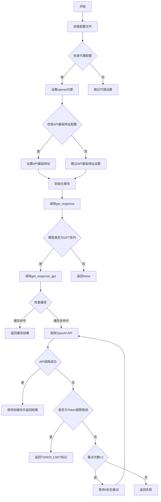
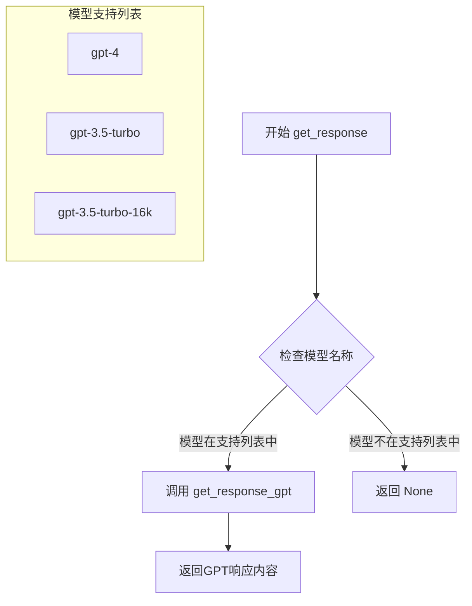

# `Chat-Haruhi-Suzumiya\research\personality\code\utils.py` 详细设计文档

该代码是一个OpenAI GPT模型的Python封装客户端，提供了对ChatGPT API的调用功能，支持响应缓存、错误重试、代理配置和日志记录，适用于需要频繁调用大语言模型的场景。

## 整体流程



## 类结构

```
该文件为模块文件，无类定义
采用函数式编程范式
包含装饰器模式和缓存模式
```

## 全局变量及字段


### `cache_sign`
    
缓存开关标志，控制是否启用函数结果缓存

类型：`bool`
    


### `config`
    
从config.json加载的配置字典，包含proxy、openai_apibase、openai_apikey等配置

类型：`dict`
    


### `cache`
    
运行时缓存对象，用于存储函数调用结果以避免重复请求

类型：`dict|None`
    


### `logger`
    
模块级日志记录器，用于记录程序运行日志

类型：`Logger`
    


### `file_handler`
    
文件日志处理器，将日志写入log.log文件

类型：`FileHandler`
    


### `console_handler`
    
控制台日志处理器，将日志输出到标准输出

类型：`StreamHandler`
    


### `formatter`
    
日志格式化器，定义日志输出格式

类型：`Formatter`
    


    

## 全局函数及方法


### `cached`

`cached` 是一个用于缓存函数执行结果的装饰器，通过将函数调用的输入参数作为键，将函数结果持久化到 pickle 文件中，从而避免重复计算，提高程序执行效率。

#### 参数

- `func`：`function`，被装饰的原始函数

#### 返回值

- `function`，返回包装后的函数 `wrapper`

#### 流程图

```mermaid
flowchart TD
    A[调用被装饰的函数] --> B{全局变量 cache == None?}
    B -->|是| C{缓存文件 cache.pkl 存在?}
    C -->|否| D[初始化 cache = {}]
    C -->|是| E[从 pickle 文件加载缓存]
    E --> F[生成缓存键 key]
    D --> F
    B -->|否| F
    F --> G{cache_sign == True<br/>且 key 在 cache 中<br/>且 cache[key] 不是 None/'[TOKEN LIMIT]'}
    G -->|是| H[直接返回缓存结果]
    G -->|否| I[执行原函数 func]
    I --> J{result != 'busy'<br/>且 result != None}
    J -->|是| K[更新 cache[key] = result]
    K --> L[将 cache 写入 pickle 文件]
    J -->|否| M[不更新缓存]
    L --> N[返回 result]
    M --> N
    H --> N
```

#### 带注释源码

```python
# 装饰器：函数结果缓存
# 用途：将函数调用结果缓存到本地文件系统，避免重复计算
def cached(func):
    """
    装饰器工厂：接受一个函数作为参数，返回包装后的函数
    包装后的函数会先检查缓存，若命中则直接返回缓存结果
    否则执行原函数并将结果存入缓存
    """
    def wrapper(*args, **kwargs):
        """
        包装函数：实际执行的函数
        - *args: 位置参数列表
        - **kwargs: 关键字参数字典
        """
        global cache  # 声明使用全局变量 cache
        
        cache_path = 'cache.pkl'  # 缓存文件路径
        
        # 如果全局 cache 尚未初始化
        if cache == None:
            # 检查缓存文件是否存在
            if not os.path.exists(cache_path):
                cache = {}  # 不存在则创建空字典
            else:
                # 存在则从 pickle 文件加载已有缓存
                cache = pickle.load(open(cache_path, 'rb'))  
        
        # 生成缓存键：使用函数名 + 位置参数 + 关键字参数
        key = (func.__name__, str(args), str(kwargs.items()))
        
        # 检查缓存条件：
        # 1. cache_sign 全局开关为 True（启用缓存）
        # 2. key 存在于缓存中
        # 3. 缓存值不是 None 或 '[TOKEN LIMIT]'（无效结果）
        if cache_sign and key in cache and cache[key] not in [None, '[TOKEN LIMIT]']:
            # 命中缓存，直接返回
            return cache[key]
        else:
            # 未命中，执行原函数
            result = func(*args, **kwargs)
            
            # 只有有效结果才写入缓存
            # 排除 'busy'（忙碌中）和 None（无结果）
            if result != 'busy' and result != None:
                cache[key] = result  # 更新内存缓存
                # 持久化到 pickle 文件
                pickle.dump(cache, open(cache_path, 'wb'))
            
            # 返回函数执行结果
            return result
    
    # 返回包装函数
    return wrapper
```

#### 关键组件信息

| 组件名称 | 说明 |
|---------|------|
| `cache` | 全局缓存字典，存储函数调用结果 |
| `cache_sign` | 全局开关，控制是否启用缓存功能 |
| `cache_path` | 缓存文件路径，默认为 `cache.pkl` |
| `wrapper` | 装饰器内部包装函数，负责缓存逻辑 |

#### 潜在技术债务与优化空间

1. **全局变量滥用**：使用 `global cache` 声明全局变量，违反函数式编程原则，建议改为闭包或类封装
2. **线程安全问题**：多线程环境下对 cache 字典的读写没有加锁，可能导致数据竞争
3. **缓存键生成不够健壮**：使用 `str(args)` 和 `str(kwargs.items())` 生成键，可能因参数顺序或类型差异导致缓存未命中
4. **异常处理不完整**：文件 I/O 操作（`pickle.load/dump`）未捕获异常，文件损坏时可能导致程序崩溃
5. **缓存无限增长**：没有缓存过期机制或最大缓存大小限制，长期运行可能导致缓存文件过大
6. **魔法字符串**：使用硬编码的 `'[TOKEN LIMIT]'` 和 `'busy'` 字符串，应提取为常量

#### 其他项目说明

- **设计目标**：通过缓存函数结果避免重复调用 OpenAI API，节省 Token 成本和时间
- **约束条件**：缓存仅对纯函数（相同输入必有相同输出）有效，有副作用的函数不适合使用此装饰器
- **错误处理**：仅捕获了特定业务错误（InvalidRequestError），缓存加载失败时会重新初始化为空字典
- **数据流**：缓存数据通过 pickle 序列化持久化到本地文件，可跨进程共享


### `get_response`

该函数是GPT模型调度的入口函数，根据传入的模型名称进行路由分发，将请求转发至对应的GPT模型处理函数，支持GPT-4、GPT-3.5-Turbo等模型的调用。

参数：

- `sys_prompt`：`str`，系统提示词，用于设定AI助手的角色和行为上下文
- `inputs`：`str`，用户输入内容，即需要AI处理的实际请求内容
- `model`：`str`，可选参数，指定要使用的GPT模型名称，默认为 `'gpt4'`

返回值：`str`，返回GPT模型生成的回答内容，若模型不在支持列表中则返回 `None`

#### 流程图



#### 带注释源码

```python
def get_response(sys_prompt, inputs, model='gpt4'):
    """
    GPT模型调度的入口函数，根据模型名称路由到对应的处理函数
    
    参数:
        sys_prompt: 系统提示词，定义AI助手的角色和行为
        inputs: 用户输入的查询内容
        model: 目标GPT模型名称，默认为'gpt4'
    
    返回:
        str: GPT模型生成的回答内容，不匹配则返回None
    """
    # 标准化模型名称：转小写并移除空格
    model = model.lower().replace(' ', '')

    # 检查模型是否在支持列表中
    if model in ['gpt-4', 'gpt-3.5-turbo', 'gpt-3.5-turbo-16k']:
        # 路由到具体的GPT处理函数
        return get_response_gpt(sys_prompt, inputs, model)
    else:
        # 不支持的模型返回None
        return None
```


### `get_response_gpt`

这是一个全局函数，实际调用 OpenAI ChatGPT API 获取对话响应的核心函数，支持重试机制和异常处理，并通过装饰器实现响应缓存。

#### 参数

- `sys_prompt`：`str`，系统提示词（System Prompt），用于设定 AI 的行为角色和上下文
- `inputs`：`str`，用户输入内容（User Input），即要发送给 ChatGPT 的问题或请求
- `model`：`str`，模型名称，默认为 `'gpt-4'`，支持 `'gpt-4'`、`'gpt-3.5-turbo'`、`'gpt-3.5-turbo-16k'` 等模型
- `retry_count`：`int`，重试计数器，默认为 `0`，用于追踪当前重试次数（内部使用）

#### 返回值

- `str`，返回 ChatGPT 的对话响应内容；如果遇到 token 限制返回字符串 `'[TOKEN LIMIT]'`；如果重试耗尽失败返回 `None`

#### 流程图

```mermaid
flowchart TD
    A[开始 get_response_gpt] --> B[构建消息列表 query]
    B --> C[调用 openai.ChatCompletion.create API]
    C --> D{是否成功?}
    D -->|是| E[提取并返回 response.choices[0].message.content]
    D -->|否| F{InvalidRequestError?}
    F -->|是| G[记录日志, 返回 '[TOKEN LIMIT]']
    F -->|否| H{retry_count < 2?}
    H -->|否| I[打印失败信息, 返回 None]
    H -->|是| J[睡眠5秒]
    J --> K[递归调用 get_response_gpt, retry_count+1]
    K --> C
    E --> L[结束]
    G --> L
    I --> L
```

#### 带注释源码

```python
@cached  # 使用缓存装饰器，若缓存命中则直接返回结果，避免重复调用API
def get_response_gpt(sys_prompt, inputs, model='gpt-4', retry_count=0):
    """
    实际调用 ChatGPT API 的函数
    
    参数:
        sys_prompt: 系统提示词，用于设定AI角色
        inputs: 用户输入内容
        model: 使用的模型名称，默认gpt-4
        retry_count: 重试次数计数器，默认0
    
    返回:
        ChatGPT的响应内容字符串，或特殊标记字符串
    """
    
    # 构建消息列表，包含system和user两个角色
    query = [ {'role': 'system', 'content': sys_prompt}]
    if len(inputs) > 0:
        query.append({'role': 'user', 'content': inputs})
    
    try:
        # 记录日志：输出系统提示词和用户输入（截取前100字符）
        logger.info('ChatGPT SysPrompt:  ' + sys_prompt[:100])
        logger.info('ChatGPT Input:  ' + inputs[:100])
        
        # 调用 OpenAI ChatCompletion API
        response = openai.ChatCompletion.create(
            api_key=config['openai_apikey'],      # 从配置读取API密钥
            model= model ,                         # 对话模型的名称
            messages=query,                        # 消息列表
            temperature=0,                         # 值在[0,1]之间，越大表示回复越具有不确定性
            top_p=1,                               # 核采样参数
            frequency_penalty=0.0,                # [-2,2]之间，该值越大则更倾向于产生不同的内容
            presence_penalty=0.0,                 # [-2,2]之间，该值越大则更倾向于产生不同的内容
            request_timeout=100                   # 请求超时时间100秒
        )
        
        # 记录日志：输出GPT响应内容（截取前100字符）
        logger.info('GPT Output: ' + response.choices[0]['message']['content'][:100])
        
        # 返回第一个选项的消息内容
        return response.choices[0]['message']['content']

    # 捕获无效请求错误（通常是token超限）
    except openai.error.InvalidRequestError as e:
        logger.exception(e)
        # 标记为token限制，返回特殊标记字符串
        return '[TOKEN LIMIT]'

    # 捕获其他所有异常（如RateLimit超时等）
    except Exception as e:
        # 记录未知异常日志
        logger.exception(e)

        # 检查是否还可以重试（最多重试2次）
        if retry_count < 2:
            time.sleep(5)  # 睡眠5秒后重试
            logger.warn("[OPEN_AI] RateLimit exceed, 第{}次重试".format(retry_count+1))
            # 递归调用自身，增加重试计数
            return get_response_gpt(sys_prompt, inputs, model, retry_count+1) 

        # 重试耗尽，打印失败信息并返回None
        print(f'Fail to get response after {retry_count} retry')
```

## 关键组件


### 日志系统

通过logging模块配置了文件日志和控制台日志，支持错误追踪和运行监控，包含自定义格式化器记录时间、模块名、级别和消息。

### 配置管理

从config.json文件加载配置，支持proxy代理、openai_apibase和openai_apikey等参数，用于控制OpenAI API的访问和请求路由。

### 缓存装饰器 (@cached)

使用装饰器模式实现函数结果缓存，基于函数名和参数生成缓存key，使用pickle持久化缓存到cache.pkl文件，支持缓存开关和TOKEN_LIMIT标记。

### OpenAI API 客户端

封装ChatCompletion.create调用，支持GPT-3.5和GPT-4模型，配置temperature、top_p、frequency_penalty等参数，设置100秒请求超时。

### 重试机制

在API调用失败时实现自动重试逻辑，最多重试2次，间隔5秒处理速率限制(RateLimit)异常。

### 异常处理

捕获InvalidRequestError（令牌限制）和通用Exception，记录日志并返回特定标记（如'[TOKEN LIMIT]'或'busy'）。


## 问题及建议


### 已知问题

-   **日志配置重复**：在代码中定义了两个 `console_handler`，第二个会覆盖第一个，且两个 handler 使用了不同的 formatter，导致日志格式不一致
-   **未使用的导入**：导入了 `pdb`、`re`、`random`、`jsonlines`、`requests`、`io` 等模块但未使用，增加了加载时间和代码冗余
-   **缓存实现非线程安全**：全局变量 `cache` 没有锁保护，在多线程环境下可能导致数据竞争和缓存损坏
-   **缓存键生成不稳定**：使用 `str(args)` 和 `str(kwargs.items())` 作为缓存键，可能产生碰撞且顺序不确定时应排序处理
-   **缓存无清理机制**：缓存文件 `cache.pkl` 无限增长，没有 TTL（过期时间）或最大容量限制
-   **异常返回值不一致**：`get_response` 函数在异常情况下可能返回 `None`，而 `get_response_gpt` 在无效请求时返回 `'[TOKEN LIMIT]'`，调用方难以统一处理
-   **重试逻辑问题**：`retry_count` 限制为 2 次但实际会重试 3 次（因为初始调用算第 0 次），且重试间隔固定为 5 秒，未使用指数退避
-   **配置文件依赖无容错**：`config.json` 不存在时程序直接崩溃，没有默认配置或错误提示
-   **API 密钥明文风险**：虽然从配置文件读取，但配置文件中以明文存储 API 密钥存在安全风险
-   **缺少类型注解**：所有函数和变量都缺少类型提示，降低了代码可读性和 IDE 支持

### 优化建议

-   移除重复的 `console_handler` 定义，统一日志格式；删除未使用的导入语句
-   使用 `threading.Lock` 或第三方库实现线程安全的缓存，或使用 Redis 等分布式缓存
-   对缓存键进行哈希处理（如 `hashlib`），并对 `kwargs.items()` 进行排序以确保一致性
-   为缓存添加过期时间和最大容量限制，定期清理过期或不常用的缓存条目
-   统一异常返回值类型，考虑定义枚举或常量表示不同状态（如成功、限流、错误）
-   使用指数退避策略（exponential backoff）实现重试机制，如 `sleep(2 ** retry_count)`
-   添加配置文件缺失的异常处理，提供默认值或友好的错误提示
-   建议使用环境变量或密钥管理服务存储敏感 API 密钥，避免明文配置文件
-   为关键函数和类添加类型注解，提升代码可维护性和可读性

## 其它


### 设计目标与约束

本代码旨在封装OpenAI ChatGPT API调用，提供统一的响应获取接口，并通过缓存机制减少API调用次数和成本。设计约束包括：仅支持OpenAI聊天模型(gpt-3.5-turbo、gpt-4等)；缓存以pickle文件形式持久化存储；代理配置通过config.json动态设置；API调用超时设置为100秒。

### 错误处理与异常设计

代码采用分层异常处理策略：InvalidRequestError特判为token超限，返回'[TOKEN LIMIT]'标记；通用Exception用于捕获网络错误、速率限制等未知异常，支持最多2次重试，每次重试间隔5秒。日志记录采用logging模块，区分info/warn/exception三种级别，异常信息通过logger.exception()完整输出堆栈跟踪。API返回None或'busy'时不写入缓存，防止缓存污染。

### 数据流与状态机

主流程：main函数调用get_response() → 根据模型名称路由到get_response_gpt() → 检查缓存是否命中 → 未命中则调用openai.ChatCompletion.create() → 响应结果写入缓存并返回。缓存键由函数名、参数args、kwargs元组组成。状态转换：缓存未命中→API调用中→API调用成功/失败。

### 外部依赖与接口契约

核心依赖包括：openai(Python SDK)、requests(HTTP请求)、json(配置解析)、pickle(缓存序列化)、logging(日志记录)。配置文件config.json必须包含openai_apikey字段，可选字段包括proxy和openai_apibase。函数get_response()接受三个参数：sys_prompt(系统提示词)、inputs(用户输入)、model(模型名称，默认gpt-4)，返回字符串类型的模型回复。

### 性能考虑与优化建议

缓存机制有效减少重复API调用，但pickle序列化效率较低，可考虑改用json或redis。logging重复添加StreamHandler导致日志重复输出，应在初始化时检查handler是否存在。当前缓存键生成包含str(args)和str(kwargs.items())，对于复杂参数可能导致键过长，建议使用hashlib生成哈希键。retry_count参数传递方式不够优雅，可考虑使用functools.wraps保留原函数签名。

### 安全性考虑

openai_apikey存储在config.json中明文保存，存在泄露风险，建议使用环境变量或密钥管理系统。缓存文件cache.pkl可被恶意篡改，建议添加签名验证。proxy配置未经安全校验直接使用，可能引入中间人攻击风险。日志输出包含prompt和response前100字符，可能泄露敏感信息，建议添加脱敏处理。

### 配置管理

配置通过config.json文件集中管理，采用JSON格式存储。必需配置项：openai_apikey(API密钥)；可选配置项：proxy(代理地址)、openai_apibase(自定义API端点)。配置读取在模块加载时执行，使用with语句确保文件句柄正确关闭。

    