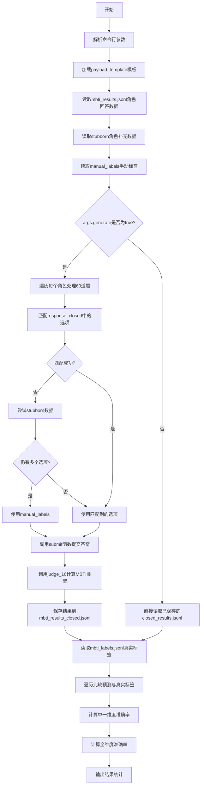
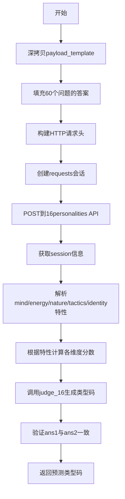

# `Chat-Haruhi-Suzumiya\research\personality\raw_code\eval_mbti_closed.py` 详细设计文档

该代码是一个MBTI人格测试自动化工具，通过调用16personalities.com的API接口，将模拟角色的问卷答案提交并获取对应的人格类型，然后与真实标签进行比对计算准确率。主要功能包括：构建测试载荷、映射问卷选项分数、提交答案、解析API返回结果、计算单一维度和全维度准确率。

## 整体流程



## 类结构

```
无类层次结构 (该脚本为面向过程设计)
├── 全局函数
│   ├── judge_16() - MBTI类型判断
│   └── submit() - API提交与结果解析
└── 数据结构
    ├── payload_template - 测试载荷模板
    ├── NAME_DICT - 角色名称映射
    └── 各类结果字典
```

## 全局变量及字段


### `parser`
    
命令行参数解析器，用于解析脚本运行时传入的命令行参数

类型：`argparse.ArgumentParser`
    


### `args`
    
解析后的命令行参数对象，包含通过argparse解析的参数属性

类型：`argparse.Namespace`
    


### `payload_template`
    
MBTI测试问题模板字典，包含60道心理测试题目及初始占位答案

类型：`dict`
    


### `NAME_DICT`
    
角色中英文名称映射字典，将中文角色名映射为英文ID用于文件命名

类型：`dict`
    


### `character_names`
    
角色名称列表，包含所有待测试角色的中文名称

类型：`list`
    


### `character_responses`
    
角色回答字典，键为角色名，值为该角色对所有问题的回答列表

类型：`dict`
    


### `stubborn_results`
    
倔强角色补充结果列表，包含对部分角色二次测试的开放式和闭合式回答数据

类型：`list`
    


### `stubborn_characters`
    
倔强角色名称列表，包含需要二次测试的角色名称

类型：`list`
    


### `stubborn_character_responses`
    
倔强角色回答字典，存储二次测试中各角色的回答数据

类型：`dict`
    


### `save_name`
    
输出文件名，指定封闭式测试结果保存的JSONL文件路径

类型：`str`
    


### `count_options`
    
选项计数字典，用于统计各Likert量表选项被选择的次数

类型：`dict`
    


### `options`
    
Likert量表选项列表，包含从完全同意到不同意的7级量表选项

类型：`list`
    


### `manual_labels`
    
手动标签字典，存储无法自动匹配时的人工标注答案

类型：`dict`
    


### `ans_map`
    
选项到分数的映射，将Likert量表选项映射为-3到3的数值分数

类型：`dict`
    


### `closed_results`
    
封闭式测试结果字典，存储每个角色的闭合式测试答案和预测的MBTI类型

类型：`dict`
    


### `labels`
    
真实标签字典，从外部文件读取的角色真实MBTI类型标签

类型：`dict`
    


### `count_single`
    
单一维度计数，统计参与单维度正确率计算的标签总数

类型：`int`
    


### `right_single`
    
单一维度正确数，统计单维度预测正确的次数

类型：`int`
    


### `count_full`
    
全维度计数，统计参与全维度正确率计算的角色总数

类型：`int`
    


### `right_full`
    
全维度正确数，统计四个维度全部预测正确的角色数

类型：`int`
    


### `possible_chars`
    
有效字符集合，包含MBTI类型中所有可能的单字符标签

类型：`set`
    


    

## 全局函数及方法


### `judge_16(score_list)`

根据传入的五维分数列表判断MBTI人格类型，返回16人格类型代码（如"INTJ"）及对应的角色名称（如"Architect"）。

参数：

- `score_list`：`List[int]`，长度为5的分数列表，依次代表Mind（E/I）、Energy（S/N）、Nature（T/F）、Tactics（J/P）、Identity（A/T）五个维度的得分，每个分数范围通常为0-100

返回值：`Tuple[str, str]`，返回包含MBTI类型代码（如"INTJ-A"）和对应角色名称（如"Architect"）的元组

#### 流程图

```mermaid
flowchart TD
    A[开始 judge_16] --> B[初始化空字符串code]
    B --> C{score_list[0] >= 50?}
    C -->|是| D[code += 'E']
    C -->|否| E[code += 'I']
    D --> F{score_list[1] >= 50?}
    E --> F
    F -->|是| G[code += 'N']
    F -->|否| H[code += 'S']
    G --> I{score_list[2] >= 50?}
    H --> I
    I -->|是| J[code += 'T']
    I -->|否| K[code += 'F']
    J --> L{score_list[3] >= 50?}
    K --> L
    L -->|是| M[code += 'J']
    L -->|否| N[code += 'P']
    M --> O[在all_codes中查找code对应的索引cnt]
    N --> O
    O --> P{score_list[4] >= 50?}
    P -->|是| Q[code += '-A']
    P -->|否| R[code += '-T']
    Q --> S[返回 code 和 all_roles[cnt]]
    R --> S
```

#### 带注释源码

```python
def judge_16(score_list):
    """
    根据分数列表判断MBTI类型
    
    参数:
        score_list: 包含5个分数的列表，分别对应:
            - score_list[0]: Mind (E/I) 维度
            - score_list[1]: Energy (S/N) 维度  
            - score_list[2]: Nature (T/F) 维度
            - score_list[3]: Tactics (J/P) 维度
            - score_list[4]: Identity (A/T) 维度
            每个分数范围为0-100，>=50选择前者，否则选择后者
    
    返回:
        tuple: (MBTI类型代码, 角色名称)
            例如: ('INTJ-A', 'Architect')
    """
    code = ''
    
    # 第一维度: Mind - Extraverted(E) vs Introverted(I)
    if score_list[0] >= 50:
        code = code + 'E'
    else:
        code = code + 'I'

    # 第二维度: Energy - Intuitive(N) vs Observant(S)
    if score_list[1] >= 50:
        # Intuition: N, Observant: S
        code = code + 'N'
    else:
        code = code + 'S'

    # 第三维度: Nature - Thinking(T) vs Feeling(F)
    if score_list[2] >= 50:
        code = code + 'T'
    else:
        code = code + 'F'

    # 第四维度: Tactics - Judging(J) vs Prospecting(P)
    if score_list[3] >= 50:
        code = code + 'J'
    else:
        code = code + 'P'

    # 16种MBTI基础类型码表
    all_codes = ['ISTJ', 'ISTP', 'ISFJ', 'ISFP', 'INFJ', 'INFP', 'INTJ', 'INTP', 
                 'ESTP', 'ESTJ', 'ESFP', 'ESFJ', 'ENFP', 'ENFJ', 'ENTP', 'ENTJ']
    
    # 对应的角色名称
    all_roles = ['Logistician', 'Virtuoso', 'Defender', 'Adventurer', 'Advocate', 
                 'Mediator', 'Architect', 'Logician', 'Entrepreneur', 'Executive', 
                 'Entertainer', 'Consul', 'Campaigner', 'Protagonist', 'Debater', 'Commander']
    
    # 查找当前4字母代码在列表中的索引位置
    for i in range(len(all_codes)):
        if code == all_codes[i]:
            cnt = i
            break

    # 第五维度: Identity - Assertive(A) vs Turbulent(T)
    if score_list[4] >= 50:
        code = code + '-A'
    else:
        code = code + '-T'

    # 返回完整的MBTI类型代码和对应角色名称
    return code, all_roles[cnt]
```


### `submit(Answers)`

该函数用于将用户的性格测试答案提交到16personalities API，获取用户的MBTI性格类型（包含四个维度和一个变体），并返回最终的性格类型代码（如"ENFP-A"）。

参数：

- `Answers`：`List[int]`，一个包含60个整数分数的列表，每个分数代表用户对对应问题的回答（范围通常是-3到3）

返回值：`str`，返回MBTI性格类型代码，例如"ENFP-A"或"ISTJ-T"

#### 流程图

```mermaid
flowchart TD
    A[开始: submit(Answers)] --> B[深拷贝payload_template]
    B --> C[将Answers填入payload的questions数组]
    C --> D[设置HTTP请求头headers]
    D --> E[创建requests会话并发送POST请求]
    E --> F[获取API响应]
    F --> G[发送GET请求获取session数据]
    G --> H[解析session中的scores和traits]
    H --> I{检查mind trait是否为Extraverted}
    I -->|是| J[mind_value = (101 + scores[0]) // 2, ans1 += 'E']
    I -->|否| K[mind_value = 100 - (101 + scores[0]) // 2, ans1 += 'I']
    J --> L{检查energy trait是否为Intuitive}
    K --> L
    L -->|是| M[energy_value = (101 + scores[1]) // 2, ans1 += 'N']
    L -->|否| N[energy_value = 100 - (101 + scores[1]) // 2, ans1 += 'S']
    M --> O{检查nature trait是否为Thinking}
    N --> O
    O -->|是| P[nature_value = (101 + scores[2]) // 2, ans1 += 'T']
    O -->|否| Q[nature_value = 100 - (101 + scores[2]) // 2, ans1 += 'F']
    P --> R{检查tactics trait是否为Judging}
    Q --> R
    R -->|是| S[tactics_value = (101 + scores[3]) // 2, ans1 += 'J']
    R -->|否| T[tactics_value = 100 - (101 + scores[3]) // 2, ans1 += 'P']
    S --> U{检查identity trait是否为Assertive}
    T --> U
    U -->|是| V[identity_value = (101 + scores[4]) // 2]
    U -->|否| W[identity_value = 100 - (101 + scores[4]) // 2]
    V --> X[调用judge_16计算最终代码和角色]
    W --> X
    X --> Y[assert验证ans1和ans2一致性]
    Y --> Z[返回ans1: MBTI类型代码]
```

#### 带注释源码

```python
def submit(Answers):
    """
    提交答案到16personalities API并获取MBTI性格类型结果
    
    参数:
        Answers: 包含60个整数分数的列表，每个分数代表用户对问题的回答
        
    返回值:
        str: MBTI性格类型代码（如"ENFP-A"）
    """
    # 1. 深拷贝问题模板，避免修改原始模板
    payload = copy.deepcopy(payload_template)
    
    # 2. 将用户答案填入对应的问题中
    for index, A in enumerate(Answers):
        payload['questions'][index]["answer"] = A

    
    # 3. 设置HTTP请求头，模拟浏览器访问
    headers = {
    "accept": "application/json, text/plain, */*",
    "accept-encoding": "gzip, deflate, br",
    "accept-language": "en,zh-CN;q=0.9,zh;q=0.8",
    "content-length": "5708",
    "content-type": "application/json",
    "origin": "https://www.16personalities.com",
    "referer": "https://www.16personalities.com/free-personality-test",
    "sec-ch-ua": "'Not_A Brand';v='99', 'Google Chrome';v='109', 'Chromium';v='109'",
    "sec-ch-ua-mobile": "?0",
    "sec-ch-ua-platform": "Windows",
    "sec-fetch-dest": "empty",
    "sec-fetch-mode": "cors",
    "sec-fetch-site": "same-origin",
        'content-type': 'application/json',
        'user-agent': 'Mozilla/5.0 (Windows NT 10.0; Win64; x64) AppleWebKit/537.36 (KHTML, like Gecko) Chrome/81.0.4044.122 Safari/537.36',}
    
    # 4. 创建会话并发送POST请求提交答案
    session = requests.session()
    # 注意：使用data参数发送JSON字符串，而不是json参数
    r = session.post('https://www.16personalities.com/test-results', data=json.dumps(payload), headers=headers)

    # 5. 获取响应信息（此处未使用）
    a = r.headers['content-type']
    b = r.encoding
    c = r.json()

    # 6. 发送GET请求获取用户的测试结果session
    sess_r = session.get("https://www.16personalities.com/api/session")

    # 7. 解析返回的分数数据
    scores = sess_r.json()['user']['scores']
    
    # 8. 初始化结果字符串
    ans1 = ''
    session = requests.session()  # 重新创建session（此处可能有bug，会丢失之前的session）
    
    # 9. 根据mind trait计算外向/内向维度
    # 如果是Extraverted，计算正向值；否则计算反向值
    if sess_r.json()['user']['traits']['mind'] != 'Extraverted':
        mind_value = 100 - (101 + scores[0]) // 2
        ans1 += 'I'  # Introverted
    else:
        mind_value = (101 + scores[0]) // 2
        ans1 += 'E'  # Extraverted
        
    # 10. 根据energy trait计算直觉/实感维度
    if sess_r.json()['user']['traits']['energy'] != 'Intuitive':
        energy_value = 100 - (101 + scores[1]) // 2
        ans1 += 'S'  # Observant
    else:
        energy_value = (101 + scores[1]) // 2
        ans1 += 'N'  # Intuitive
        
    # 11. 根据nature trait计算思考/情感维度
    if sess_r.json()['user']['traits']['nature'] != 'Thinking':
        nature_value = 100 - (101 + scores[2]) // 2
        ans1 += 'F'  # Feeling
    else:
        nature_value = (101 + scores[2]) // 2
        ans1 += 'T'  # Thinking
        
    # 12. 根据tactics trait判断判断/知觉维度
    if sess_r.json()['user']['traits']['tactics'] != 'Judging':
        tactics_value = 100 - (101 + scores[3]) // 2
        ans1 += 'P'  # Prospecting
    else:
        tactics_value = (101 + scores[3]) // 2
        ans1 += 'J'  # Judging

    # 13. 根据identity trait判断自信/动荡变体
    if sess_r.json()['user']['traits']['identity'] != 'Assertive':
        identity_value = 100 - (101 + scores[4]) // 2
    else:
        identity_value = (101 + scores[4]) // 2
    
    # 14. 调用judge_16函数计算完整的MBTI代码（包括变体后缀-A/-T）
    code, role = judge_16([mind_value, energy_value, nature_value, tactics_value, identity_value])
    
    # 15. 提取前四个字母用于对比
    ans2 = code[:4]

    # 16. 断言验证两种计算方式的结果一致性（注意：assert语法错误，应为assert ans1 == ans2）
    assert(ans1, ans2)

    # 17. 返回完整的MBTI类型代码（如"ENFP-A"）
    return ans1
```

## 关键组件


### 一段话描述

该代码是一个MBTI（迈尔斯-布里格斯类型指标）性格测试分析工具，通过读取角色对60道性格问题的回答，将其映射到Likert量表分数，提交给16personalities.com API获取预测的性格类型，并与真实标签进行对比评估准确率。

### 文件整体运行流程

1. 解析命令行参数（--generate标志）
2. 定义payload_template（16personalities API请求模板，包含60道性格问题）
3. 定义judge_16函数将分数转换为MBTI类型码和角色名
4. 定义submit函数提交答案到16personalities并获取结果
5. 读取mbti_results.jsonl文件，按角色（每60题一个角色）组织回答
6. 读取stubborn_results.jsonl处理需要重试的角色
7. 若启用--generate：对每个角色匹配封闭式回答选项，计算分数，调用submit获取预测结果并保存
8. 读取真实标签文件mbti_labels.jsonl
9. 评估预测准确率并输出单一维度和全维度准确率

### 全局变量详情

| 名称 | 类型 | 描述 |
|------|------|------|
| args | Namespace | 命令行参数对象，包含generate标志 |
| payload_template | dict | 16personalities API的请求体模板，包含60个问题及空答案 |
| NAME_DICT | dict | 中文角色名到英文ID的映射字典 |
| character_names | list | 所有角色名称列表 |
| character_responses | dict | 按角色组织的开放式和封闭式回答 |
| stubborn_characters | list | 需要重试的角色列表 |
| stubborn_character_responses | dict | 重试角色的回答数据 |
| save_name | str | 输出结果文件名 'mbti_results_closed.jsonl' |
| options | list | Likert量表选项列表（7级） |
| ans_map | dict | 选项到分数的映射（-3到3） |
| closed_results | dict | 封闭式测试的预测结果 |
| labels | dict | 真实MBTI标签映射 |
| possible_chars | set | 合法的MBTI字符集合 |

### 函数详情

#### judge_16函数

- **名称**: judge_16
- **参数**: score_list (list) - 5个维度的分数列表
- **参数描述**: 包含mind, energy, nature, tactics, identity五个维度的分数
- **返回值类型**: tuple (str, str)
- **返回值描述**: MBTI类型码（如INTJ-A）和角色名称（如Architect）
- **mermaid流程图**:
```mermaid
flowchart TD
    A[开始] --> B{score_list[0] >= 50?}
    B -->|是| C[code += 'E']
    B -->|否| D[code += 'I']
    C --> E{score_list[1] >= 50?}
    D --> E
    E -->|是| F[code += 'N']
    E -->|否| G[code += 'S']
    F --> H{score_list[2] >= 50?}
    G --> H
    H -->|是| I[code += 'T']
    H -->|否| J[code += 'F']
    I --> K{score_list[3] >= 50?}
    J --> K
    K -->|是| L[code += 'J']
    K -->|否| M[code += 'P']
    L --> N[查找code对应的角色]
    M --> N
    N --> O{score_list[4] >= 50?}
    O -->|是| P[code += '-A']
    O -->|否| Q[code += '-T']
    P --> R[返回code和角色]
    Q --> R
```
- **带注释源码**:
```python
def judge_16(score_list):
    code = ''
    # Mind维度: E/I
    if score_list[0] >= 50:
        code = code + 'E'
    else:
        code = code + 'I'

    # Energy维度: N/S
    if score_list[1] >= 50:
        code = code + 'N'
    else:
        code = code + 'S'

    # Nature维度: T/F
    if score_list[2] >= 50:
        code = code + 'T'
    else:
        code = code + 'F'

    # Tactics维度: J/P
    if score_list[3] >= 50:
        code = code + 'J'
    else:
        code = code + 'P'

    # 查找16种MBTI类型对应的角色名
    all_codes = ['ISTJ', 'ISTP', 'ISFJ', 'ISFP', 'INFJ', 'INFP', 'INTJ', 'INTP', 'ESTP', 'ESTJ', 'ESFP', 'ESFJ', 'ENFP', 'ENFJ', 'ENTP', 'ENTJ']
    all_roles = ['Logistician', 'Virtuoso', 'Defender', 'Adventurer', 'Advocate', 'Mediator', 'Architect', 'Logician', 'Entrepreneur', 'Executive', 'Entertainer',
                 'Consul', 'Campaigner', 'Protagonist', 'Debater', 'Commander']
    for i in range(len(all_codes)):
        if code == all_codes[i]:
            cnt = i
            break

    # Identity维度: A/T
    if score_list[4] >= 50:
        code = code + '-A'
    else:
        code = code + '-T'

    return code, all_roles[cnt]
```

#### submit函数

- **名称**: submit
- **参数**: Answers (list) - 60个问题的答案分数列表
- **参数描述**: 每个元素是-3到3的Likert量表分数
- **返回值类型**: str
- **返回值描述**: 预测的MBTI类型码（如INTJ-A）
- **mermaid流程图**:

- **带注释源码**:
```python
def submit(Answers):
    # 复制模板避免修改原数据
    payload = copy.deepcopy(payload_template)
    # 将答案填入对应问题的answer字段
    for index, A in enumerate(Answers):
        payload['questions'][index]["answer"] = A

    # 构造HTTP请求头，模拟浏览器访问
    headers = {
    "accept": "application/json, text/plain, */*",
    "accept-encoding": "gzip, deflate, br",
    "accept-language": "en,zh-CN;q=0.9,zh;q=0.8",
    "content-length": "5708",
    "content-type": "application/json",
    "origin": "https://www.16personalities.com",
    "referer": "https://www.16personalities.com/free-personality-test",
    "sec-ch-ua": "'Not_A Brand';v='99', 'Google Chrome';v='109', 'Chromium';v='109'",
    "sec-ch-ua-mobile": "?0",
    "sec-ch-ua-platform": "Windows",
    "sec-fetch-dest": "empty",
    "sec-fetch-mode": "cors",
    "sec-fetch-site": "same-origin",
    'content-type': 'application/json',
    'user-agent': 'Mozilla/5.0 (Windows NT 10.0; Win64; x64) AppleWebKit/537.36'}
    
    # 创建会话并发送POST请求
    session = requests.session()
    r = session.post('https://www.16personalities.com/test-results', 
                    data=json.dumps(payload), headers=headers)

    # 获取响应内容
    a = r.headers['content-type']
    b = r.encoding
    c = r.json()

    # 获取session信息以获取评分
    sess_r = session.get("https://www.16personalities.com/api/session")
    scores = sess_r.json()['user']['scores']
    
    # 根据用户特性计算各维度值
    ans1 = ''
    session = requests.session()
    # Mind: Extraverted vs Introverted
    if sess_r.json()['user']['traits']['mind'] != 'Extraverted':
        mind_value = 100 - (101 + scores[0]) // 2
        ans1 += 'I'
    else:
        mind_value = (101 + scores[0]) // 2
        ans1 += 'E'
    # Energy: Intuitive vs Observant
    if sess_r.json()['user']['traits']['energy'] != 'Intuitive':
        energy_value = 100 - (101 + scores[1]) // 2
        ans1 += 'S'
    else:
        energy_value = (101 + scores[1]) // 2
        ans1 += 'N'
    # Nature: Thinking vs Feeling
    if sess_r.json()['user']['traits']['nature'] != 'Thinking':
        nature_value = 100 - (101 + scores[2]) // 2
        ans1 += 'F'
    else:
        nature_value = (101 + scores[2]) // 2
        ans1 += 'T'
    # Tactics: Judging vs Prospecting
    if sess_r.json()['user']['traits']['tactics'] != 'Judging':
        tactics_value = 100 - (101 + scores[3]) // 2
        ans1 += 'P'
    else:
        tactics_value = (101 + scores[3]) // 2
        ans1 += 'J'

    # Identity: Assertive vs Turbulent
    if sess_r.json()['user']['traits']['identity'] != 'Assertive':
        identity_value = 100 - (101 + scores[4]) // 2
    else:
        identity_value = (101 + scores[4]) // 2
    
    # 生成最终MBTI类型码
    code, role = judge_16([mind_value, energy_value, nature_value, tactics_value, identity_value])
    ans2 = code[:4]

    # 断言验证两种计算方式一致
    assert(ans1, ans2)

    return ans1
```

### 关键组件信息

#### 张量索引与惰性加载

本代码不涉及张量操作，但存在数据惰性加载模式：对于匹配失败的stubborn角色回答，延迟到需要时才从stubborn_character_responses中获取，体现了按需加载的设计思想。

#### 反量化支持

代码中的ans_map将7级Likert量表（完全同意到完全不同意）反量化回-3到+3的数值分数，实现从文本标签到数值分数的双向转换。

#### 量化策略

将连续分数（0-100）通过阈值50进行二值化判断，生成E/I、N/S、T/F、J/P、A/T等二进制维度，类似于信号量化过程。

### 潜在技术债务或优化空间

1. **重复代码**: judge_16函数和submit函数中都有重复的if-else分支判断，建议抽取为通用映射函数
2. **硬编码Magic Numbers**: content-length: 5708、API URL等硬编码，应提取为配置常量
3. **API响应多次解析**: submit函数中多次调用sess_r.json()，应缓存解析结果
4. **错误处理缺失**: API请求无超时设置、无重试机制、无异常捕获
5. **数据一致性问题**: 使用//整数除法可能导致分数偏差
6. **断言使用不当**: assert(ans1, ans2)写法不会抛出预期错误，应使用assert ans1 == ans2

### 其它项目

#### 设计目标与约束

- 目标：自动化评估AI角色扮演模型的MBTI性格类型预测准确率
- 约束：依赖16personalities.com外部API，需模拟浏览器请求头

#### 错误处理与异常设计

- 缺少网络请求超时和重试机制
- 答案匹配失败时依赖manual_labels人工标注
- 未处理API返回错误状态码的情况

#### 数据流与状态机

- 数据流：JSONL输入 → 角色分组 → 选项匹配 → 分数转换 → API提交 → 结果评估
- 无显式状态机，使用流程控制语句实现状态转换

#### 外部依赖与接口契约

- 依赖requests库进行HTTP通信
- 依赖16personalities.com的两个API端点：/test-results（提交答案）和/api/session（获取结果）
- 输入格式：mbti_results.jsonl（包含id, question, response_open, response_closed字段）
- 输出格式：mbti_results_closed.jsonl（包含character, 60个问题的response和label, 预测的label字段）


## 问题及建议


### 已知问题

-   **硬编码配置过多**：`payload_template`、`NAME_DICT`、API URL、请求头等均硬编码在代码中，无法灵活配置
-   **重复调用JSON解析**：`sess_r.json()['user']`被重复调用至少7次，每次调用都会解析JSON，效率低下
-   **错误的assert用法**：`assert(ans1, ans2)`语法错误，assert不会比较两个值，而是检查第一个参数的真值
-   **缺少异常处理**：网络请求、文件读写、JSON解析等操作均无异常捕获，容易导致程序崩溃
-   **调试代码残留**：导入了`pdb`但未使用或未清理，应在生产代码中移除
-   **脆弱的答案解析**：使用字符串包含判断解析答案选项，容易因文本格式变化而失败
-   **魔法数字缺乏解释**：代码中多处使用50、100、101等数值，未注释说明含义
-   **未使用的变量**：变量`a`（content-type）、`b`（encoding）、`c`（json响应）未被使用
-   **代码重复**：多次构建类似的headers字典，部分逻辑重复
-   **缺乏输入验证**：假设输入文件格式正确、角色数量和问题数量固定，未做校验

### 优化建议

-   **配置外置**：将payload_template、NAME_DICT、API URL、headers等配置提取到独立的JSON/YAML配置文件或环境变量
-   **缓存JSON解析结果**：将`sess_r.json()`结果存储到变量，避免重复解析
-   **修复assert逻辑**：改用`assert ans1 == ans2`或`if ans1 != ans2: raise AssertionError`
-   **添加异常处理**：为网络请求、文件读写添加try-except捕获和重试逻辑
-   **移除调试代码**：删除未使用的`pdb`导入和调试用的print语句
-   **改进答案解析**：使用更健壮的解析方式，如正则表达式匹配或结构化数据
-   **添加常量定义**：将魔法数字定义为有意义的常量并添加注释
-   **清理未使用变量**：删除未使用的变量`a`、`b`、`c`等
-   **提取重复代码**：将重复的headers构建逻辑提取为函数
-   **添加输入验证**：验证文件格式、角色数量（60个问题/角色）等的正确性

## 其它


### 设计目标与约束

本项目旨在实现一个自动化的MBTI人格测试系统，通过分析角色在特定场景下的开放式和封闭式回答，预测其MBTI类型，并验证预测准确性。设计目标包括：1）支持批量处理多个虚构角色的回答数据；2）通过16personalities.com的官方API获取标准化的MBTI结果；3）提供准确率评估功能，支持单一维度和全维度评价。约束条件包括：依赖外部API接口（可能受网络限制和速率限制）、需要预先准备包含60道题目的回答数据、角色数量必须能被60整除。

### 错误处理与异常设计

代码中的错误处理主要体现在以下几个方面：1）文件读取使用try-except逻辑（虽然代码中未明确写出，但open()调用会抛出FileNotFoundError）；2）在匹配答案选项时，使用多重逻辑处理特殊情况（如同时匹配到多个选项时优先选择单引号或书名号包裹的选项）；3）使用assert语句进行关键断言，包括角色回答数量验证（必须为60个问题）、预测结果和真实标签的有效性检查（必须在possible_chars范围内）；4）对于匹配失败的答案，优先使用备用数据集（stubborn_character_responses）进行二次匹配，最后回退到手动标注数据。潜在改进方向：添加网络请求重试机制、完善的异常日志记录、JSON解析错误的容错处理。

### 数据流与状态机

数据流主要分为三个阶段：第一阶段为数据准备阶段，读取mbti_results.jsonl和mbti_results_stubborn.jsonl文件，按角色分割回答数据，构建character_responses和stubborn_character_responses字典；第二阶段为答案转换阶段，将开放式和封闭式回答映射为MBTI测试选项分数（-3到+3的数值），使用ans_map进行转换；第三阶段为API提交与结果获取阶段，调用submit()函数将分数转换为标准化分数，提交到16personalities API，获取计算后的MBTI类型。状态机方面，程序首先处于数据加载态，然后进入答案匹配态（可能需要回退到备用数据），接着进入API提交态，最后进入结果评估态。

### 外部依赖与接口契约

外部依赖包括：1）requests库：用于发送HTTP POST请求到16personalities API和GET请求获取session数据；2）json库：用于解析JSON格式的数据文件和API响应；3）copy库：用于深拷贝payload模板；4）argparse库：用于处理命令行参数；5）pdb库：用于调试（代码中导入但未使用）。接口契约方面，submit()函数接收Answers参数（分数列表），返回预测的MBTI类型编码（如ENFJ-A）；API端点包括POST https://www.16personalities.com/test-results 用于提交答案，GET https://www.16personalities.com/api/session 用于获取计算结果和分数；输入数据格式要求mbti_results.jsonl每行包含id、question、response_open、response_closed四个字段，mbti_results_manual.jsonl包含character和manual_labels字段。

### 配置与常量定义

代码中包含多个关键配置：payload_template定义了完整的60题MBTI测试模板，包含问题文本和答案占位符；options数组定义了7级Likert量表选项（从"完全同意"到"完全不同意"）；NAME_DICT提供了32个中英文角色名称到英文ID的映射；stubborn_characters数组列出了10个需要使用备用数据进行二次实验的角色；possible_chars定义了有效的人格维度字符集（E/I/S/N/T/F/P/J/X）。配置文件硬编码在代码中，缺乏外部配置化设计，这可能导致修改测试参数时需要修改源代码。

### 性能考量与优化空间

当前实现存在以下性能问题：1）每次调用submit()函数都会创建新的requests session，导致连接复用效率低下；2）API调用逐个处理角色数据，未实现批量提交；3）多次重复调用sess_r.json()解析同一JSON响应（如代码中多次访问sess_r.json()['user']['traits']），增加了解析开销；4）文件I/O操作使用逐行读取而非批量读取，大文件场景下效率较低。优化方向包括：复用session对象、缓存JSON解析结果、使用生成器模式处理大文件、考虑添加请求间隔避免API限流。

### 安全与合规性

代码涉及以下安全考量：1）HTTP请求中硬编码了特定的用户代理、Origin、Referer等请求头，存在被反爬虫机制拦截的风险；2）API请求的content-length设置为硬编码值5708，与实际payload可能不匹配；3）未对API响应进行充分验证，直接使用r.json()可能导致JSON解析异常；4）代码未实现任何身份认证机制，所有请求均为匿名访问。合规性方面，自动化的MBTI测试提交可能违反16personalities.com的服务条款，建议仅用于研究目的并遵守相关法律法规。

### 测试与验证策略

当前代码的验证逻辑包括：使用assert语句验证回答数量为60、验证预测结果在有效字符集内、计算单一维度准确率和全维度准确率。测试覆盖存在以下不足：1）缺乏单元测试对judge_16()函数的边界条件进行测试；2）未对网络请求失败的情况进行模拟测试；3）答案匹配逻辑的复杂分支（多重选项匹配、备用数据回退、手动标注回退）缺乏测试覆盖；4）未对payload_template的数据完整性进行验证。建议补充：Mock网络请求的单元测试、边界条件测试用例、端到端的集成测试脚本。

### 版本与变更历史

当前代码版本为初始实现，存在以下已知问题和待改进项：1）代码注释提到"执行上面这行代码报错"，但未说明具体错误原因和解决方案；2）assert(ans1, ans2)的用法不正确，assert语句只接受一个表达式参数，这里应该使用assert ans1 == ans2；3）mbti_results.jsonl文件中缺少character_name字段，需要通过索引计算角色名称；4）硬编码的content-length值（5708）需要根据实际payload动态计算。这些问题反映了开发过程中的技术债务，建议在后续版本中逐步修复。

    