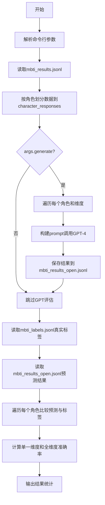
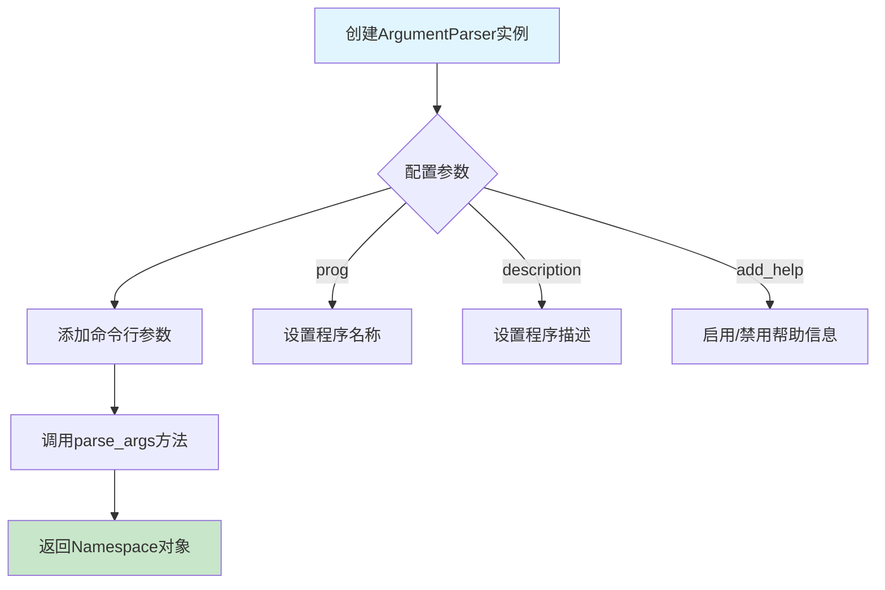
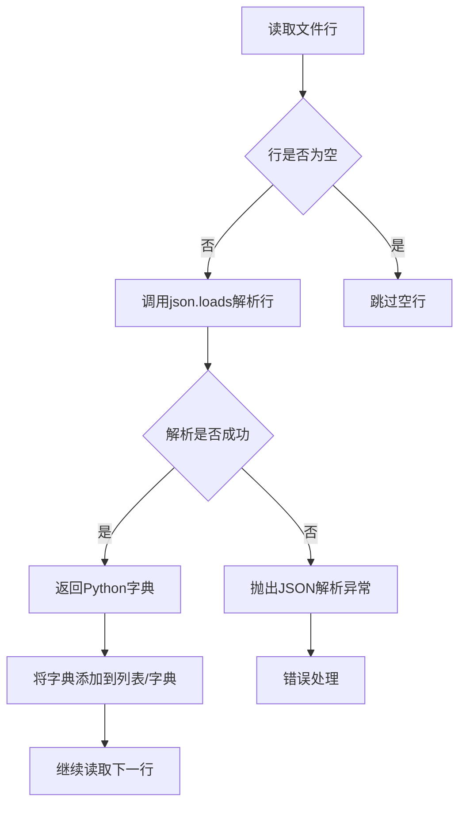
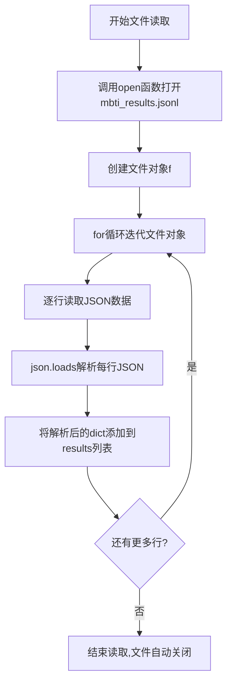
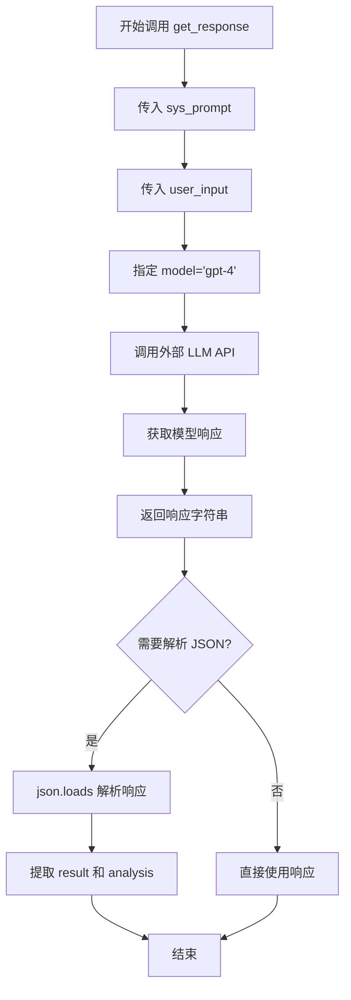

# `Chat-Haruhi-Suzumiya\research\personality\raw_code\eval_mbti_open.py` 详细设计文档

该脚本用于分析MBTI测试结果，通过读取包含角色问答的JSONL文件，按角色划分数据，并可选地调用GPT-4对开放式回答进行MBTI维度（E/I, S/N, T/F, P/J）评估，最终与真实标签对比计算准确率。

## 整体流程



## 类结构

```
无类定义（过程式脚本）
└── 全局函数: get_response (从utils模块导入)
```

## 全局变量及字段


### `args`
    
命令行参数对象，通过argparse解析得到，包含generate参数

类型：`argparse.Namespace`
    


### `results`
    
存储从mbti_results.jsonl文件读取的原始数据列表

类型：`list`
    


### `NAME_DICT`
    
角色中文名到英文名的映射字典，包含30个角色名称对应关系

类型：`dict`
    


### `character_names`
    
所有角色名称列表，从NAME_DICT的键提取

类型：`list`
    


### `character_responses`
    
按角色分组的回答数据字典，每个角色对应一组response数据

类型：`dict`
    


### `save_name`
    
输出文件名，指定为mbti_results_open.jsonl用于保存GPT评估结果

类型：`str`
    


### `dims`
    
MBTI四个维度列表['E/I', 'S/N', 'T/F', 'P/J']

类型：`list`
    


### `open_prompt_template`
    
GPT-4评估的提示模板字符串，用于生成开放式问题评估的prompt

类型：`str`
    


### `open_dimension_prompt`
    
各MBTI维度的定义说明字典，包含E/I、S/N、T/F、P/J四个维度的详细描述

类型：`dict`
    


### `labels`
    
角色到真实MBTI标签的映射字典，从mbti_labels.jsonl文件读取

类型：`dict`
    


### `open_results`
    
GPT预测结果字典，键为角色名，值为该角色的各维度评估结果

类型：`dict`
    


### `possible_chars`
    
有效字符集合，包含MBTI各类别字母E,I,S,N,T,F,P,J以及未知X

类型：`set`
    


### `count_single`
    
单一维度评估的总数，统计所有非X标签的评估次数

类型：`int`
    


### `right_single`
    
单一维度正确数，统计预测与真实标签匹配的次数

类型：`int`
    


### `count_full`
    
全维度评估的总数，即参与评估的角色总数

类型：`int`
    


### `right_full`
    
全维度全部正确数，统计四个维度全部预测正确的角色数量

类型：`int`
    


    

## 全局函数及方法


### `argparse.ArgumentParser`

用于创建命令行参数解析器实例，支持定义程序参数、生成帮助信息等核心功能。

#### 参数

-  `prog`：字符串，程序名（可选，默认取 `sys.argv[0]` 的文件名部分）
-  `usage`：字符串，usage信息（可选，默认自动生成）
-  `description`：字符串，程序描述信息（可选，出现在usage之前）
-  `epilog`：字符串，程序结尾说明信息（可选）
-  `parents`：列表，ArgumentParser对象列表，用于继承参数（可选）
-  `formatter_class`：格式化类，控制帮助信息格式（可选）
-  `prefix_chars`：字符串，前缀字符集合（可选，默认'-'）
-  `fromfile_prefix_chars`：字符串，文件前缀字符（可选）
-  `argument_default`：默认值，参数的全局默认值（可选）
-  `conflict_handler`：字符串，冲突处理方式（可选，默认'error'）
-  `add_help`：布尔值，是否添加 -h/--help 选项（可选，默认True）
-  `allow_abbrev`：布尔值，是否允许长选项缩写（可选，默认True）

> 注：代码中未传递任何参数，全部使用默认值。

#### 返回值

`argparse.ArgumentParser`，返回创建的参数解析器对象实例，用于后续添加参数和解析命令行。

#### 流程图



#### 带注释源码

```python
# 创建 ArgumentParser 实例
# 参数说明：
# - prog: 程序名称，默认使用 sys.argv[0]
# - description: 程序描述，显示在usage之后
# - epilog: 结尾说明，显示在所有参数之后
# - add_help: 是否自动添加 -h/--help 选项
# - allow_abbrev: 是否允许长选项缩写匹配
parser = argparse.ArgumentParser()  # 使用所有默认配置

# 向解析器添加命令行参数
# 参数说明：
# --generate: 参数名
# action='store_true': 当参数出现时值为True，不出现时为False
# default=False: 默认值
parser.add_argument('--generate', action='store_true', default=False)

# 解析命令行参数
# 从 sys.argv 解析参数，返回 Namespace 对象
# args.generate 可以通过 args.generate 访问
args = parser.parse_args()
```


### `json.loads`

解析JSON字符串为Python对象。在本代码中用于从JSONL文件中读取每行JSON数据并转换为Python字典。

参数：

- `s`：`str`，要解析的JSON字符串（来自文件读取的每一行）

返回值：`dict`，解析后的Python字典对象

#### 流程图



#### 带注释源码

```python
# 第一次使用：从mbti_results.jsonl读取数据
with open('mbti_results.jsonl', encoding='utf-8') as f:
    for line in f:
        # 将JSON字符串解析为Python字典
        data = json.loads(line)
        results.append(data)

# 第二次使用：从mbti_labels.jsonl读取标签
with open('mbti_labels.jsonl', encoding='utf-8') as f:
    for line in f:
        data = json.loads(line)
        labels[data['character']] = data['label']

# 第三次使用：从mbti_results_open.jsonl读取开放式测试结果
with open('mbti_results_open.jsonl', encoding='utf-8') as f:
    for line in f:
        data = json.loads(line)
        open_results[data['character']] = data

# 第四次使用：解析GPT-4返回的JSON响应
llm_response = get_response(sys_prompt, user_input, model="gpt-4")
# 将LLM返回的JSON字符串解析为Python字典
llm_response = json.loads(llm_response)
```


### `open/file.read`

该函数是Python内置的文件I/O操作，用于读取`mbti_results.jsonl`文件。代码通过`open()`函数以UTF-8编码打开文件，并使用for循环迭代读取每一行，将每行的JSON数据解析后存入`results`列表。这是数据管道的第一个环节，为后续按角色划分测试结果提供原始数据。

参数：

-  `file_path`：`str`，要打开的文件路径，此处为`'mbti_results.jsonl'`
-  `mode`：`str`，打开模式，此处为`'r'`（只读）
-  `encoding`：`str`，字符编码，此处为`'utf-8'`

返回值：`file object`，返回文件对象，用于迭代读取

#### 流程图



#### 带注释源码

```python
# 读取mbti_results.jsonl文件，里面每行是一个json，包含了id，question，response_open，response_closed四个字段
# 其中response_open是开放式回答，response_closed是闭合式回答
results = []  # 用于存储所有解析后的JSON数据

# 使用open函数打开文件，指定UTF-8编码以正确处理中文
# 'r'模式表示只读，文件对象赋值给变量f
with open('mbti_results.jsonl', encoding='utf-8') as f:
    # 迭代文件对象f，每次读取一行
    # Python的for循环隐式调用了f.__iter__()方法
    for line in f:
        # 解析JSON字符串为Python字典对象
        data = json.loads(line)
        # 将解析后的字典添加到results列表中
        # data结构: {id, question, response_open, response_closed}
        results.append(data)
# with语句块结束时自动关闭文件，无需显式调用f.close()
```


### `get_response`

该函数为从 `utils` 模块导入的 LLM（大型语言模型）调用函数，用于与 GPT-4 等语言模型进行交互，传入系统提示词和用户输入，获取模型的响应结果。

参数：

-  `sys_prompt`：`str`，系统提示词（system prompt），用于设定模型的角色和行为背景
-  `user_input`：`str`，用户输入内容（user input），即需要模型处理的具体问题或任务
-  `model`：`str`，模型名称，默认为 `"gpt-4"`，指定使用哪个语言模型进行推理

返回值：`str`，返回模型生成的响应内容，通常为 JSON 格式字符串，需要通过 `json.loads()` 解析为字典结构。

#### 流程图



#### 带注释源码

```python
# 从 utils 模块导入 get_response 函数
from utils import get_response 

# 构建完成后，调用 get_response 获取 LLM 评估结果
# 参数1: sys_prompt - 系统提示词，定义模型作为 MBTI 专家的角色
# 参数2: user_input - 用户输入，包含参与者信息和对话内容
# 参数3: model="gpt-4" - 指定使用 GPT-4 模型
llm_response = get_response(sys_prompt, user_input, model="gpt-4")

# 将返回的 JSON 字符串解析为字典
# 返回格式示例: {"analysis": "分析内容", "result": "E"}
llm_response = json.loads(llm_response)

# 提取结果并存储
open_results[cname][dim] = llm_response
```

---

> **注意**：由于 `get_response` 是从外部 `utils` 模块导入的，上述源码仅为调用处的代码片段，而非函数实现。该函数的完整实现位于 `utils.py` 模块中，从调用方式推断其内部应封装了与 OpenAI API 或其他 LLM 服务的 HTTP 请求逻辑。

## 关键组件


### 数据加载与解析模块

负责从mbti_results.jsonl文件中读取JSON格式的测试数据，每行包含id、question、response_open和response_closed四个字段，将每行解析为Python字典并存储到results列表中。

### 角色名称映射字典

NAME_DICT是一个中英文角色名称映射字典，包含30个角色（如汤师爷、慕容复、李云龙等），用于将角色中文名映射为英文标识符，作为后续数据划分和结果存储的基准。

### 角色响应分组模块

根据角色索引将results列表中的数据分配到character_responses字典中，每个角色分配60条记录（每个MBTI维度15条），实现按角色分组的数据组织结构。

### MBTI维度评估提示词模板

open_prompt_template是用于GPT-4评估的提示词模板，包含维度说明、参与者信息、对话内容，格式化输出JSON格式的analysis和result字段，用于区分E/I、S/N、T/F、P/J四个维度的倾向性。

### MBTI维度定义字典

open_dimension_prompt字典存储四个MBTI维度的详细定义：E/I（外向/内向）、S/N（感觉/直觉）、T/F（思考/情感）、P/J（知觉/判断），每个维度包含两类性格特征的详细描述，用于GPT-4理解评估标准。

### 开放式回答评估模块

当args.generate为True时执行，遍历每个角色和每个MBTI维度，构造包含角色对话的提示词，调用get_response函数获取GPT-4的评估结果，解析JSON响应后追加写入mbti_results_open.jsonl文件。

### 标签加载模块

从mbti_labels.jsonl文件中读取每个角色的真实MBTI标签，存储到labels字典中，标签为四字符字符串如"ENTJ"。

### 评估结果加载模块

从mbti_results_open.jsonl文件中读取GPT-4的开放式评估结果，解析每个角色在各维度上的预测结果，存储到open_results字典中。

### 准确率计算模块

遍历所有角色，对比预测结果和真实标签，分别计算单一维度准确率（count_single/right_single）和全维度准确率（count_full/right_full），输出详细的评估报告。

### 命令行参数解析

使用argparse模块定义--generate参数，控制是否执行GPT-4评估生成流程，默认为False即只进行结果比对。


## 问题及建议


### 已知问题

- **硬编码问题**：文件路径（`mbti_results.jsonl`、`mbti_labels.jsonl`、`mbti_results_open.jsonl`）、角色数量（60）、维度列表（`dims`）和角色名称字典（`NAME_DICT`）均采用硬编码方式，缺乏灵活配置
- **Magic Number**：使用 `idx // 60` 划分角色，60这个数字没有任何解释，且未定义为常量
- **缺少错误处理**：文件读取时无异常捕获（`json.loads`失败、文件不存在等），`get_response` API调用缺乏重试机制和错误处理
- **重复代码**：文件读取逻辑在多处重复（读取results和labels），未封装为函数
- **注释掉的调试代码**：存在大量被注释的代码（如打印角色结果数量的代码），影响代码可读性
- **文件IO效率低**：在循环中频繁打开关闭文件（`with open(save_name, 'a')`），每处理一个角色都写入一次，应批量处理
- **变量命名不一致**：`save_name`、`open_prompt_template`等命名风格不统一，且`results`和`open_results`容易混淆
- **断言使用不当**：使用`assert`进行业务逻辑校验（角色数量检查），在Python以-O优化模式下会被跳过
- **缺乏类型注解**：所有函数和变量都缺少类型提示，影响代码可维护性和IDE支持
- **函数过长**：`if args.generate:`分支下的代码嵌套过深，缺乏适当的函数封装
- **字符串拼接效率低**：使用`+=`拼接大量字符串（conversations），应使用列表join或f-string
- **设计模式缺失**：缺乏配置管理、结果缓存、API调用封装等设计

### 优化建议

- 将配置信息（文件路径、维度、角色字典等）提取到独立的配置文件或命令行参数
- 定义常量 `QUESTIONS_PER_CHARACTER = 60` 替代magic number
- 为文件读取操作添加try-except异常处理，特别是JSON解析部分
- 封装通用函数：`read_jsonl_file()`、`write_jsonl_file()`、`call_llm_api()`
- 移除或整理注释掉的调试代码，保持代码整洁
- 将结果缓存到内存或使用批量写入，减少文件IO次数
- 统一变量命名规范，明确区分不同变量的用途
- 使用`logging`模块替代print进行日志输出
- 将`if args.generate:`分支内的逻辑拆分为独立函数，如`generate_open_results()`
- 使用`''.join(list)`替代字符串`+=`操作
- 添加完整的类型注解（typing）
- 考虑添加单元测试，验证核心逻辑
- 考虑添加配置文件管理多环境（开发/生产）


## 其它


### 设计目标与约束

本代码旨在对MBTI测试结果进行自动化评估，通过GPT-4模型对开放式回答进行分析，生成每个角色在E/I、S/N、T/F、P/J四个维度上的MBTI类型推断，并计算与真实标签的匹配准确率。设计约束包括：输入文件必须为UTF-8编码的JSONL格式，角色数量固定为30个，每个角色需包含60条测试结果（每个维度15条），输出结果追加写入JSONL文件。

### 错误处理与异常设计

代码主要依赖assert语句进行关键检查：验证每个角色在每个维度上恰好有15条记录（60条总计）。文件读取使用try-except机制捕获json.loads可能引发的JSON解析异常。参数args.generate为布尔标志，控制是否执行GPT-4评估流程。若输入文件不存在或格式错误，程序将抛出FileNotFoundError或json.JSONDecodeError。LLM调用失败时可能导致程序中断，当前未实现重试机制。

### 数据流与状态机

数据流分为三个阶段：加载阶段读取mbti_results.jsonl并按角色名建立映射；生成阶段（当args.generate为True）遍历每个角色和维度，构造prompt调用get_response生成评估结果并持久化；评估阶段读取mbti_labels.jsonl和mbti_results_open.jsonl，计算单一维度和全维度准确率。状态转换由命令行参数args.generate控制，生成与评估为串行执行。

### 外部依赖与接口契约

主要外部依赖包括：json模块处理JSON序列化；argparse模块解析命令行参数；pdb模块（虽已导入但未使用）。关键外部函数get_response位于utils模块，签名为get_response(sys_prompt: str, user_input: str, model: str) -> str，接收系统提示、用户输入和模型名称，返回JSON格式的LLM响应。输入文件mbti_results.jsonl每行包含id、question、response_open、response_closed、factor、test_role字段；mbti_labels.jsonl每行包含character和label字段。

### 性能考虑

代码采用单线程顺序处理，30个角色×4个维度共120次LLM调用，未使用并发或批处理。文件I/O采用逐行读取和追加写入，适合中等规模数据。当前实现中每次LLM调用独立进行，无缓存机制，GPT-4 API调用可能成为主要性能瓶颈。

### 安全考虑

代码直接读取本地JSONL文件，需确保文件路径安全且内容可信。LLM调用结果直接使用json.loads解析，未对响应内容进行严格校验，可能存在注入风险。NAME_DICT硬编码在源码中，若需扩展角色集需修改代码。

### 配置与可扩展性

维度列表dims、prompt模板、维度描述字典open_dimension_prompt均为硬编码常量。角色名称映射NAME_DICT定义了30个角色的中英文对照。save_name输出文件名可参数化但当前固定。若需添加新维度或新角色，需同步修改dims、open_dimension_prompt和NAME_DICT，可考虑提取为配置文件。

### 测试策略

当前代码未包含单元测试。关键验证点包括：输入文件格式完整性检查、LLM响应JSON结构验证、评估指标计算准确性。建议添加对get_response mock的单元测试，以及针对不同输入边界条件的异常处理测试。

    