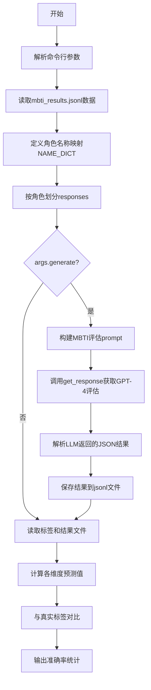

# `Chat-Haruhi-Suzumiya\research\personality\raw_code\eval_mbti_open_multigroup.py` 详细设计文档

该代码是一个MBTI人格评估脚本，通过调用GPT-4模型分析角色对开放式问题的回答，计算其在E/I、S/N、T/F、P/J四个维度上的倾向百分比，并与真实标签对比计算准确率。

## 整体流程



## 类结构

```
该脚本为无类定义的脚本文件
主要包含全局变量、全局函数和主执行流程
```

## 全局变量及字段


### `parser`
    
命令行参数解析器，用于处理--generate和--split等命令行选项

类型：`ArgumentParser`
    


### `args`
    
解析后的命令行参数对象，包含generate和split属性

类型：`Namespace`
    


### `model`
    
使用的LLM模型名称，默认为gpt-4

类型：`str`
    


### `results`
    
从mbti_results.jsonl文件读取的原始数据列表，每项包含id、question、response_open、response_closed等字段

类型：`list[dict]`
    


### `NAME_DICT`
    
中文角色名到英文名的映射字典，包含30个角色

类型：`dict[str, str]`
    


### `character_names`
    
所有角色名称列表，从NAME_DICT的键提取

类型：`list[str]`
    


### `character_responses`
    
按角色分组的回答数据，键为角色名，值为该角色的所有回答列表

类型：`dict[str, list[dict]]`
    


### `save_name`
    
输出文件名，格式为mbti_results_open_multigroup_split={split}_{model}.jsonl

类型：`str`
    


### `dims`
    
MBTI四个维度列表：['E/I', 'S/N', 'T/F', 'P/J']

类型：`list[str]`
    


### `open_prompt_template`
    
GPT评估的prompt模板，用于开放式MBTI维度评估

类型：`str`
    


### `open_dimension_prompt`
    
各维度的详细说明字典，包含E/I、S/N、T/F、P/J的详细定义

类型：`dict[str, str]`
    


### `labels`
    
从mbti_labels.jsonl文件读取的真实MBTI标签，键为角色名，值为四维标签字符串

类型：`dict[str, str]`
    


### `open_results`
    
从文件读取的GPT评估结果，包含每个角色各维度的评分

类型：`dict[str, dict]`
    


### `count_single`
    
单维度评价的统计计数，记录比较的维度总数

类型：`int`
    


### `right_single`
    
单维度评价的正确计数，记录预测正确的维度数量

类型：`int`
    


### `count_full`
    
全维度评价的统计计数，记录参与评估的角色总数

类型：`int`
    


### `right_full`
    
全维度评价的正确计数，记录四维全部预测正确的角色数量

类型：`int`
    


### `possible_chars`
    
有效的MBTI字符集，包含E、I、S、N、T、F、P、J和X（未知）

类型：`set[str]`
    


    

## 全局函数及方法


### `split_list`

将输入列表按每4个元素进行拆分，当最后一个子列表长度不足3个时，从前面的子列表中依次提取元素进行补充，直至满足条件。该函数主要用于将MBTI测试的响应数据分组，以便进行批量处理。

参数：

- `input_list`：`list`，需要拆分的输入列表

返回值：`list`，拆分后的二维列表，每个子列表的元素数量在3到4之间

#### 流程图

```mermaid
flowchart TD
    A[开始 split_list] --> B[按每4个元素拆分列表]
    B --> C[获取最后一个子列表 result[-1]]
    C --> D{len result[-1] < 3?}
    D -->|是| E[从倒数第二个子列表取元素补充到最后一个]
    D -->|否| H
    E --> F{len result[-1] < 3?}
    F -->|是| G[从倒数第三个子列表取元素补充到最后一个]
    F -->|否| H
    G --> H[断言检查: 所有子列表长度在3-4之间]
    H --> I[返回结果列表]
```

#### 带注释源码

```python
def split_list(input_list):
    # 步骤1: 使用列表切片按每4个元素拆分列表
    # 例如: [0,1,2,3,4,5,6,7,8] -> [[0,1,2,3], [4,5,6,7], [8]]
    result = [input_list[i:i+4] for i in range(0, len(input_list), 4)]
    
    # 步骤2: 检查最后的子列表长度是否小于3
    # 根据业务需求，每个分组至少需要3个元素
    if len(result[-1]) < 3: 
        # 步骤3: 从前面的子列表中各取一个元素来补足最后一个子列表
        # 先从倒数第二个子列表取元素
        result[-1].append(result[-2].pop())
        
        # 步骤4: 如果补充后仍然不足3个，继续从倒数第三个子列表取元素
        if len(result[-1]) < 3:
            result[-1].append(result[-3].pop())

    # 步骤5: 断言验证 - 确保所有子列表的元素数量都在3-4之间
    # 这是为了保证后续处理的数据一致性
    assert( all([len(_) >= 3 and len(_) <= 4 for _ in result]) )
    
    # 步骤6: 返回拆分后的结果列表
    return result
```

## 关键组件


### 命令行参数解析

通过argparse模块解析--generate和--split两个布尔参数，控制是否生成新评估结果和是否按组分割测试数据。

### 数据加载与预处理

从mbti_results.jsonl文件逐行读取JSON格式的MBTI测试数据，包含id、question、response_open、response_closed和factor字段，并将数据按角色进行分组整理。

### 角色名称映射

NAME_DICT字典建立中文角色名到英文ID的映射关系，包含32个角色（如汤师爷、慕容复、李云龙、Luna等），用于统一角色标识。

### 数据分割逻辑

split_list函数将维度响应列表按每4个元素分割，并处理尾数组长度不足3个元素的情况，通过从前面的子列表借用元素来补足，确保每个子列表包含3-4个元素。

### MBTI评估Prompt模板

open_prompt_template定义了GPT-4评估所需的提示词结构，包含维度背景说明、角色对话内容，并要求输出JSON格式的百分比评估结果。

### MBTI维度定义

open_dimension_prompt字典存储四个MBTI维度（E/I、S/N、T/F、P/J）的详细定义，描述每种倾向的特征和行为表现，用于帮助LLM理解维度含义。

### LLM响应获取

通过utils模块的get_response函数调用GPT-4模型，传入系统提示词和用户输入，返回JSON格式的评估结果。

### 结果验证与处理

对LLM返回的JSON结果进行验证，确保百分比总和为100，并将字符串数值转换为整数格式，同时处理可能的解析异常。

### 标签加载

从mbti_labels.jsonl文件读取角色的真实MBTI标签，用于后续准确率计算。

### 评估指标计算

遍历每个角色的预测结果，计算各维度的平均分数和标准差，判断预测类型与真实标签是否匹配，统计单一维度准确率和全维度准确率。

### 方差分析

当存在多个分组结果时，计算各维度分数的标准差，用于评估评估结果的一致性和稳定性。


## 问题及建议


### 已知问题

- **硬编码配置**：多处关键配置硬编码在代码中，包括模型名称（`model = "gpt-4"`）、角色名称字典（`NAME_DICT`）、维度列表（`dims`）、文件路径（`mbti_results.jsonl`、`mbti_labels.jsonl`）等，缺乏灵活性和可维护性
- **调试代码残留**：存在`pdb.set_trace()`调试语句和注释掉的代码（打印角色结果数量的循环），生产环境中不应包含调试代码
- **文件覆盖无提示**：`--generate`模式下直接清空结果文件，没有任何确认或警告机制，可能导致意外数据丢失
- **缺失字符名存储**：`mbti_results.jsonl`文件中缺少`character_name`字段，导致需要通过索引计算角色名称（`cname = character_names[idx // 60]`），这种映射关系脆弱且易出错
- **异常处理不足**：`json.loads`、`文件读写`、`get_response`调用等关键操作缺少完整的异常捕获和处理机制
- **未使用的代码**：导入了`argparse`、`math`模块并计算了token数量（通过tiktoken），但实际未使用这些功能
- **函数职责过载**：`split_list`函数逻辑复杂，特别是补足子列表长度的逻辑难以理解，缺乏清晰的文档说明
- **重复字符串拼接**：在循环中多次使用`+=`进行字符串拼接，效率较低，应使用列表 join 或 f-string 优化

### 优化建议

- **配置外部化**：将所有配置项（模型名称、文件路径、维度定义等）提取到独立的配置文件（如YAML或JSON）或通过命令行参数传递
- **清理调试代码**：移除所有`pdb.set_trace()`、注释掉的代码，以及其他仅用于调试的语句
- **增强错误处理**：为所有文件读写、JSON解析、API调用等操作添加try-except异常处理，并提供有意义的错误日志
- **数据完整性校验**：在处理数据前验证文件是否存在、格式是否正确、必需字段是否完整
- **重构分割逻辑**：简化`split_list`函数的逻辑，增加详细的文档注释和类型注解，提高可读性
- **优化字符串操作**：使用f-string或`''.join()`替代循环中的字符串拼接
- **添加日志模块**：使用Python的`logging`模块替代print语句，便于调试和监控
- **代码结构优化**：考虑将相关功能封装成类或模块，提高代码的模块化和可测试性

## 其它


### 设计目标与约束

本代码的设计目标是基于GPT-4模型，通过分析参与者在开放式MBTI测试中的对话内容，评估其在E/I、S/N、T/F、P/J四个维度上的性格倾向，并计算评估结果的准确率。核心约束包括：使用gpt-4模型、每个角色包含60个问题（每个维度15个）、支持分组评估模式（split参数）、结果输出为JSONL格式。

### 错误处理与异常设计

代码采用多层错误处理机制：(1) JSON解析使用try-except捕获json.loads()可能抛出的异常，防止单条数据损坏导致整个流程中断；(2) 使用assert断言验证数据完整性，包括问题数量验证（每个角色60个问题）、分组列表长度验证（3-4个元素）、百分比总和验证（必须等于100%）；(3) 对于严重错误使用pdb.set_trace()进入调试模式；(4) 对于格式不正确的评估结果会打印错误信息并中断执行。

### 数据流与状态机

整体数据流分为五个阶段：【输入阶段】从mbti_results.jsonl读取原始对话数据 → 【分组阶段】按角色（30个角色）和维度（4个维度）进行数据分组 → 【评估阶段】对每个角色每个维度调用GPT-4 API进行评估（如开启split则将数据进一步分组） → 【输出阶段】将评估结果追加写入mbti_results_open_multigroup_split={}_{}.jsonl → 【计算阶段】读取标签文件和评估结果，计算单一维度和全维度准确率。没有复杂状态机，主要为线性流程。

### 外部依赖与接口契约

主要外部依赖包括：(1) utils模块的get_response函数，接口签名为get_response(sys_prompt: str, user_input: str, model: str) -> str，返回JSON字符串；(2) argparse模块用于命令行参数解析；(3) json模块用于JSON序列化和反序列化。输入文件依赖：mbti_results.jsonl（包含id、question、response_open、response_closed、factor、test_role字段）和mbti_labels.jsonl（包含character和label字段）。输出文件为mbti_results_open_multigroup_split={}_{}.jsonl。

### 性能考虑

代码存在以下性能瓶颈：(1) 大量GPT-4 API调用，每个角色4个维度，如有split参数则更多，耗时较长且产生高额API费用；(2) 未实现并发调用，完全串行执行；(3) 每次API调用前使用tiktoken计算token数但实际未使用该数据。优化方向：可考虑实现异步并发调用、添加token使用量统计和成本监控、缓存已评估结果避免重复调用。

### 安全性考虑

代码安全性考虑包括：(1) API密钥通过环境变量或配置文件管理，不应硬编码；(2) 输入文件路径固定（mbti_results.jsonl、mbti_labels.jsonl），存在路径注入风险，建议使用相对路径或配置化；(3) 输出文件名称可通过args.split参数控制，存在文件名注入风险；(4) 代码中包含pdb调试语句，生产环境应移除。

### 可扩展性

代码具备以下可扩展性：(1) 角色列表NAME_DICT可轻松添加新角色；(2) 维度列表dims可扩展支持更多MBTI维度；(3) split_list函数可调整分组策略；(4) open_dimension_prompt模板可定制化不同语言的评估标准；(5) 支持通过命令行参数控制生成和分割行为。限制：评估模型固定为gpt-4，评估维度固定为四个。

### 配置管理

配置管理主要通过命令行参数实现：--generate标志控制是否重新生成评估结果（覆盖模式）；--split标志控制是否按组分割数据。模型名称硬编码为"gpt-4"，可通过变量修改。文件路径、角色映射字典NAME_DICT、维度定义dims均为代码内硬编码，缺乏外部配置文件管理，建议抽取到config.json或config.yaml中。

### 测试考虑

当前代码测试覆盖不足：(1) 仅依赖assert进行基础验证，缺乏单元测试；(2) split_list函数有明确的输入输出契约，适合单元测试；(3) get_response函数为外部依赖，建议使用mock进行测试；(4) 缺少对边界条件的测试（如空数据、单条数据、极端分组情况）。建议补充：单元测试覆盖核心函数、集成测试验证完整流程、Mock外部API调用。

### 日志与监控

代码日志和监控机制较为简单：(1) 使用print输出评估进度（角色名、预测结果、标签）；(2) 错误信息通过print输出；(3) 最终统计信息包括单一维度准确率、全部维度准确率、平均方差。改进方向：使用logging模块替代print实现分级日志、添加时间戳和执行耗时监控、记录API调用次数和token使用量。

### 部署与运行环境

部署环境要求：(1) Python 3.7+；(2) 安装依赖包：json（标准库）、pdb（标准库）、argparse（标准库）、math（标准库）、tiktoken（需pip安装）、utils模块（需项目内提供）；(3) 需要访问OpenAI API并具备有效密钥；(4) 工作目录下必须存在mbti_results.jsonl和mbti_labels.jsonl文件。运行命令：python eval_mbti_open_multigroup.py --generate --split

    