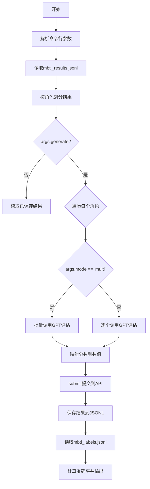
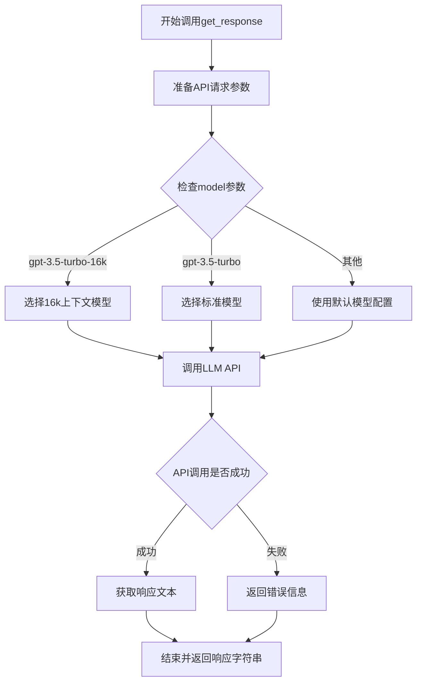

# `Chat-Haruhi-Suzumiya\research\personality\raw_code\eval_mbti_open_to_score.py` 详细设计文档

这是一个MBTI人格评估工具，通过读取角色对话数据，使用GPT模型对开放式MBTI问题回答进行评分，然后将评分结果提交到16Personalities API获取最终人格类型，并计算预测准确率。

## 整体流程



## 类结构

```
该脚本为扁平化结构，无类定义
主要包含两个核心函数：
├── judge_16 (判断16型人格)
└── submit (提交答案到API)
```

## 全局变量及字段


### `parser`
    
命令行参数解析器，用于定义和解析脚本的命令行参数

类型：`ArgumentParser`
    


### `args`
    
解析后的命令行参数对象，包含generate和mode属性

类型：`Namespace`
    


### `payload_template`
    
MBTI测试问题模板，包含60个问题的JSON结构，用于提交到16personalities API

类型：`dict`
    


### `results`
    
从mbti_results.jsonl读取的原始结果列表，每个元素包含角色的对话数据

类型：`list`
    


### `NAME_DICT`
    
角色名中英文映射字典，将中文角色名映射到英文ID

类型：`dict`
    


### `character_names`
    
所有角色名称的列表，用于遍历和索引角色

类型：`list`
    


### `character_responses`
    
按角色分组的结果字典，每个角色对应60个问题的回答数据

类型：`dict`
    


### `save_name`
    
输出文件名，根据mode参数生成对应的评估结果文件名

类型：`str`
    


### `dims`
    
MBTI四个维度列表，包含E/I, S/N, T/F, P/J四个维度

类型：`list`
    


### `options`
    
评分选项英文列表，包含七个同意程度级别

类型：`list`
    


### `options_cn`
    
评分选项中文列表，对应英文选项的中文翻译

类型：`list`
    


### `ans_map`
    
选项到数值的映射字典，将同意程度映射到-3到3的数值

类型：`dict`
    


### `open_results`
    
GPT评估结果字典，存储每个角色每个问题的LLM评估结果

类型：`dict`
    


### `labels`
    
真实标签字典，从mbti_labels.jsonl读取各角色的真实MBTI类型

类型：`dict`
    


### `count_single`
    
单维度评估的计数总数，用于统计评估的字符总数

类型：`int`
    


### `right_single`
    
单维度评估的正确数量，用于计算单维度准确率

类型：`int`
    


### `count_full`
    
全维度评估的计数总数，用于统计完全匹配评估的次数

类型：`int`
    


### `right_full`
    
全维度评估的正确数量，用于计算全维度准确率

类型：`int`
    


### `possible_chars`
    
有效MBTI字符集合，用于验证预测和真实标签的合法性

类型：`set`
    


    

## 全局函数及方法


### `judge_16(score_list)`

根据分数列表判断16型人格代码和角色名，将MBTI四个维度（E/I, S/N, T/F, J/P）和身份维度（A/T）的分数转换为对应的人格类型代码，并返回人格角色名称。

参数：

- `score_list`：`list`，包含5个分数的列表，分别对应MBTI的四个维度（mind/能量、energy/直觉、nature/自然、tactics/策略）和identity/身份维度

返回值：`tuple`，返回包含两个元素的元组，第一个元素为16型人格代码（如"INTJ-A"），第二个元素为对应的角色名称（如"Architect"）

#### 流程图

```mermaid
flowchart TD
    A[开始 judge_16] --> B[初始化空字符串 code]
    B --> C{score_list[0] >= 50?}
    C -->|是| D[code += 'E']
    C -->|否| E[code += 'I']
    D --> F{score_list[1] >= 50?}
    E --> F
    F -->|是| G[code += 'N']
    F -->|否| H[code += 'S']
    G --> I{score_list[2] >= 50?}
    H --> I
    I -->|是| J[code += 'T']
    I -->|否| K[code += 'F']
    J --> L{score_list[3] >= 50?}
    K --> L
    L -->|是| M[code += 'J']
    L -->|否| N[code += 'P']
    M --> O[在all_codes中查找code对应的索引cnt]
    N --> O
    O --> P{score_list[4] >= 50?}
    P -->|是| Q[code += '-A']
    P -->|否| R[code += '-T']
    Q --> S[返回 code 和 all_roles[cnt]]
    R --> S
    S --> T[结束]
```

#### 带注释源码

```python
def judge_16(score_list):
    """
    根据分数列表判断16型人格代码和角色名
    
    参数:
        score_list: 包含5个分数的列表
            - score_list[0]: mind维度 (E/I)
            - score_list[1]: energy维度 (S/N)
            - score_list[2]: nature维度 (T/F)
            - score_list[3]: tactics维度 (J/P)
            - score_list[4]: identity维度 (A/T)
    
    返回:
        tuple: (16型人格代码, 角色名称)
    """
    # 初始化空字符串用于构建人格代码
    code = ''
    
    # 判断第一个维度: mind (外向E/内向I)
    if score_list[0] >= 50:
        code = code + 'E'  # 外向型
    else:
        code = code + 'I'  # 内向型

    # 判断第二个维度: energy (直觉N/感觉S)
    if score_list[1] >= 50:
        # Intuition: N, Observant: S
        code = code + 'N'  # 直觉型
    else:
        code = code + 'S'  # 感觉型

    # 判断第三个维度: nature (思考T/情感F)
    if score_list[2] >= 50:
        code = code + 'T'  # 思考型
    else:
        code = code + 'F'  # 情感型

    # 判断第四个维度: tactics (判断J/知觉P)
    if score_list[3] >= 50:
        code = code + 'J'  # 判断型
    else:
        code = code + 'P'  # 知觉型

    # 16种MBTI人格类型代码列表
    all_codes = ['ISTJ', 'ISTP', 'ISFJ', 'ISFP', 'INFJ', 'INFP', 'INTJ', 'INTP', 
                 'ESTP', 'ESTJ', 'ESFP', 'ESFJ', 'ENFP', 'ENFJ', 'ENTP', 'ENTJ']
    
    # 对应的人格角色名称
    all_roles = ['Logistician', 'Virtuoso', 'Defender', 'Adventurer', 'Advocate', 
                 'Mediator', 'Architect', 'Logician', 'Entrepreneur', 'Executive', 
                 'Entertainer', 'Consul', 'Campaigner', 'Protagonist', 'Debater', 'Commander']
    
    # 在all_codes中查找当前code对应的索引位置
    cnt = 0  # 默认索引
    for i in range(len(all_codes)):
        if code == all_codes[i]:
            cnt = i
            break

    # 判断第五个维度: identity (自信A/动荡T)
    if score_list[4] >= 50:
        code = code + '-A'  # 自信型
    else:
        code = code + '-T'  # 动荡型

    # 返回完整的人格代码和对应的角色名称
    return code, all_roles[cnt]
```


### `submit`

该函数接收用户的MBTI测试答案列表，将答案填充到预设的payload模板中，发送POST请求到16Personalities API，获取用户性格分数，然后根据分数计算并返回预测的MBTI类型（如"ENFJ-A"）。

参数：

- `Answers`：`List[int]`，包含60个整数答案（范围-3到3，对应从"完全不同意"到"完全同意"的7级Likert量表），每个答案对应payload_template中的一个问题

返回值：`str`，返回预测的MBTI类型代码（如"ENFJ-A"），格式为4字母+E/A或T/T的组合

#### 流程图

```mermaid
flowchart TD
    A[开始 submit Answers] --> B[深拷贝payload_template]
    B --> C[将Answers填入payload的questions]
    C --> D[构建HTTP请求头headers]
    D --> E[创建requests session并POST到16personalities测试接口]
    E --> F[获取session信息 GET /api/session]
    F --> G[解析user.scores获取5个维度分数]
    G --> H{判断mind特征}
    H -->|Extraverted| I[mind_value = (101+scores[0])//2]
    H -->|Introverted| J[mind_value = 100 - (101+scores[0])//2]
    I --> K[拼接E/I字符]
    J --> K
    K --> L{判断energy特征}
    L -->|Intuitive| M[energy_value = (101+scores[1])//2]
    L -->|Observant| N[energy_value = 100 - (101+scores[1])//2]
    M --> O[拼接N/S字符]
    N --> O
    O --> P{判断nature特征}
    P -->|Thinking| Q[nature_value = (101+scores[2])//2]
    P -->|Feeling| R[nature_value = 100 - (101+scores[2])//2]
    Q --> S[拼接T/F字符]
    R --> S
    S --> T{判断tactics特征}
    T -->|Judging| U[tactics_value = (101+scores[3])//2]
    T -->|Prospecting| V[tactics_value = 100 - (101+scores[3])//2]
    U --> W[拼接J/P字符]
    V --> W
    W --> X{判断identity特征}
    X -->|Assertive| Y[identity_value = (101+scores[4])//2]
    X -->|Turbulent| Z[identity_value = 100 - (101+scores[4])//2]
    Y --> AA[添加-A或-T后缀]
    Z --> AA
    AA --> AB[调用judge_16验证结果]
    AB --> AC[返回最终MBTI类型字符串]
```

#### 带注释源码

```python
def submit(Answers):
    """
    提交答案到16Personalities API并返回预测的MBTI类型
    
    参数:
        Answers: List[int], 包含60个答案的列表，每个值为-3到3的整数
                 对应: -3=完全不同意, -2=基本不同意, -1=不太同意, 
                       0=既不同意也不否认, 1=部分同意, 2=基本同意, 3=完全同意
    
    返回:
        str: MBTI类型代码，如 "ENFJ-A" 或 "INTJ-T"
    """
    # 深拷贝模板，避免修改原始payload_template
    payload = copy.deepcopy(payload_template)
    
    # 将用户答案填入payload中对应的每个问题
    # payload_template包含60个问题，每个问题的answer字段被设置为对应的答案
    for index, A in enumerate(Answers):
        payload['questions'][index]["answer"] = A

    
    # 构建HTTP请求头，模拟浏览器访问
    # 包含必要的headers以通过16Personalities的反爬虫检测
    headers = {
    "accept": "application/json, text/plain, */*",
    "accept-encoding": "gzip, deflate, br",
    "accept-language": "en,zh-CN;q=0.9,zh;q=0.8",
    "content-length": "5708",
    "content-type": "application/json",
    "origin": "https://www.16personalities.com",
    "referer": "https://www.16personalities.com/free-personality-test",
    "sec-ch-ua": "'Not_A Brand';v='99', 'Google Chrome';v='', 'Chromium';v='109'",
    "sec-ch-ua-mobile": "?0",
    "sec-ch-ua-platform": "Windows",
    "sec-fetch-dest": "empty",
    "sec-fetch-mode": "cors",
    "sec-fetch-site": "same-origin",
        'content-type': 'application/json',
        'user-agent': 'Mozilla/5.0 (Windows NT 10.0; Win64; x64) AppleWebKit/537.36 (KHTML, like Gecko) Chrome/81.0.4044.122 Safari/537.36',
    }
    
    # 创建session对象维持Cookie和连接
    session = requests.session()
    # 发送POST请求提交答案到测试接口
    r = session.post('https://www.16personalities.com/test-results', data=json.dumps(payload), headers=headers)

    # 获取响应头和编码信息（实际未使用）
    a = r.headers['content-type']
    b = r.encoding
    c = r.json()

    # 通过session接口获取用户的详细分数和性格特征
    # 这个接口返回用户的5个维度分数和4个性格特质标签
    sess_r = session.get("https://www.16personalities.com/api/session")

    # 提取用户分数列表，包含5个维度的得分
    scores = sess_r.json()['user']['scores']
    
    # 初始化结果字符串和新建session（此处session变量被重新赋值，可能导致之前session丢失）
    ans1 = ''
    session = requests.session()
    
    # 处理mind维度：Extraverted vs Introverted
    # API返回的mind标签为'Extraverted'时表示外向，否则为内向
    # 分数转换公式：(101+原始分数)//2 将分数转换为0-100
    if sess_r.json()['user']['traits']['mind'] != 'Extraverted':
        mind_value = 100 - (101 + scores[0]) // 2  # 转换为内向(I)分数
        ans1 += 'I'
    else:
        mind_value = (101 + scores[0]) // 2  # 转换为外向(E)分数
        ans1 += 'E'
    
    # 处理energy维度：Intuitive vs Observant
    if sess_r.json()['user']['traits']['energy'] != 'Intuitive':
        energy_value = 100 - (101 + scores[1]) // 2  # 转换为感觉(S)分数
        ans1 += 'S'
    else:
        energy_value = (101 + scores[1]) // 2  # 转换为直觉(N)分数
        ans1 += 'N'
    
    # 处理nature维度：Thinking vs Feeling
    if sess_r.json()['user']['traits']['nature'] != 'Thinking':
        nature_value = 100 - (101 + scores[2]) // 2  # 转换为情感(F)分数
        ans1 += 'F'
    else:
        nature_value = (101 + scores[2]) // 2  # 转换为思考(T)分数
        ans1 += 'T'
    
    # 处理tactics维度：Judging vs Prospecting
    if sess_r.json()['user']['traits']['tactics'] != 'Judging':
        tactics_value = 100 - (101 + scores[3]) // 2  # 转换为知觉(P)分数
        ans1 += 'P'
    else:
        tactics_value = (101 + scores[3]) // 2  # 判断(J)分数
        ans1 += 'J'

    # 处理identity维度：Assertive vs Turbulent
    if sess_r.json()['user']['traits']['identity'] != 'Assertive':
        identity_value = 100 - (101 + scores[4]) // 2  # 转换为Turbulent(T)
    else:
        identity_value = (101 + scores[4]) // 2  # 转换为Assertive(A)
    
    # 调用judge_16函数根据分数确定MBTI代码和角色名称
    # 注意：此处只使用了前4个维度的值，identity在函数内部通过第5个参数处理
    code, role = judge_16([mind_value, energy_value, nature_value, tactics_value, identity_value])
    
    # 取MBTI的4字母部分（不含-A/-T后缀）
    ans2 = code[:4]

    # 断言验证两种计算方式的结果是否一致（存在bug：assert参数应为两个值）
    assert(ans1, ans2)

    return ans1  # 返回构建的MBTI类型字符串
```


### `get_response`

该函数是用于调用大型语言模型（LLM）获取响应的核心工具函数，通过传入系统提示词、用户输入和模型标识符，封装了对外部LLM API的调用逻辑，并返回模型生成的文本响应。

参数：

- `sys_prompt`：`str`，系统提示词，用于设定LLM的角色和行为上下文
- `user_input`：`str`，用户输入内容，包含需要LLM处理的问题或对话内容
- `model`：`str`，模型标识符，指定使用的LLM模型版本（如"gpt-3.5-turbo"、"gpt-3.5-turbo-16k"等）

返回值：`str`，返回LLM生成的响应文本，通常为JSON格式字符串或普通文本

#### 流程图



#### 带注释源码

```python
# 从utils模块导入get_response函数
# 该函数在代码中被多次调用，用于获取LLM对不同问题的回答
from utils import get_response

# 示例调用方式1：使用gpt-3.5-turbo-16k模型处理多问题场景
llm_response = get_response(
    sys_prompt,           # 系统提示词：设定LLM为MBTI专家角色
    user_input,           # 用户输入：包含多个问题的对话内容
    model="gpt-3.5-turbo-16k"  # 模型选择：16k版本支持更长上下文
)

# 示例调用方式2：使用gpt-3.5-turbo模型处理单个问题场景
llm_response = get_response(
    sys_prompt,           # 系统提示词：设定LLM为MBTI专家角色
    user_input,           # 用户输入：单个问题的对话内容
    model="gpt-3.5-turbo" # 模型选择：标准版本
)

# 返回值处理：通常为JSON格式字符串，需要json.loads()解析
try:
    llm_response = json.loads(llm_response)
except:
    # 如果解析失败，使用修复提示词重新调用
    llm_response = get_response(fix_prompt, llm_response, model="gpt-3.5-turbo-16k")
    llm_response = json.loads(llm_response)
```

#### 补充说明

该函数是项目与外部LLM服务交互的**唯一入口**，实现了以下核心功能：

1. **API封装**：隐藏了具体的HTTP请求细节，提供简洁的函数调用接口
2. **模型选择**：支持不同版本的GPT模型，以适应不同场景的需求（长上下文 vs 标准场景）
3. **错误处理**：调用方通过try-except机制处理可能的JSON解析错误

**潜在优化点**：

- 缺乏重试机制：API调用失败时直接返回错误，应增加重试逻辑
- 无超时控制：长时间等待可能导致程序阻塞，应设置合理的请求超时
- 缺少日志记录：无法追踪API调用状态和调试问题
- 模型参数硬编码：温度、top_p等生成参数未暴露给调用方

## 关键组件


### 命令行参数解析模块

使用argparse模块解析命令行参数，支持--generate标志和--mode选项（single/multi），用于控制评分模式和执行流程。

### MBTI测试问题模板

payload_template定义了完整的MBTI测试JSON结构，包含60道题目，每题包含text和answer字段，以及gender、inviteCode等元数据字段。

### 16型人格判断函数 judge_16

根据五个维度的分数（E/I, S/N, T/F, J/P, A/T）计算并返回对应的MBTI类型代码及角色名称，支持16种MBTI组合。

### 在线提交函数 submit

将用户答案封装为HTTP请求Payload，模拟浏览器行为向16personalities.com发送POST请求，获取用户评分并计算各维度原始分数值。

### 角色响应数据处理模块

将mbti_results.jsonl中的原始数据按角色名称进行分组映射，使用NAME_DICT维护角色名称与响应数量的对应关系，每个角色包含60道题目的回答。

### 开放式评分Prompt模板

open_prompt_template_multi和open_prompt_template_single分别定义批量和单题场景下调用GPT模型进行MBTI选项分类的Prompt模板，包含分析指导和输出格式要求。

### 答案映射表 ans_map

将英文和中文的七级Likert量表选项（fully agree到fully disagree）映射到-3到3的数值，用于后续分数计算。

### GPT响应获取模块 get_response

从utils模块导入的函数，用于调用GPT-3.5-Turbo模型获取开放式问题的评分结果，支持16k和标准两种模型规格。

### JSON修复Prompt fix_prompt

当GPT返回的JSON格式不合法时，使用此Prompt引导模型修正JSON字符串为标准可解析格式。

### 结果保存模块

将每个角色的评分结果（包括原始响应、LLM标签、预测MBTI类型）以JSONL格式保存到mbti_results_open2score_{mode}.jsonl文件。

### 准确率评估模块

对比预测结果与mbti_labels.jsonl中的真实标签，分别计算单一维度准确率和全维度匹配准确率，输出评估指标。


## 问题及建议


### 已知问题

- **assert使用错误**：`submit`函数中使用`assert(ans1, ans2)`，这个写法永远不会触发断言失败，应改为`assert ans1 == ans2`
- **重复调用API**：在`submit`函数中多次调用`sess_r.json()`获取相同数据，应缓存结果避免重复请求
- **硬编码配置过多**：payload_template、headers、维度映射等大量硬编码，可配置化或使用常量类管理
- **缺少异常处理**：网络请求、JSON解析等关键操作缺少try-except包裹，程序容易崩溃
- **命名不一致**：`NAME_DICT`中定义的角色名与实际使用时可能不匹配，且部分角色名未包含在字典中
- **未使用的导入**：`pdb`模块导入但未使用，`copy`模块仅部分使用
- **代码重复**：`submit`函数中大量重复的if-else逻辑判断每个维度，可提取为通用方法
- **文件路径硬编码**：直接使用`mbti_results.jsonl`、`mbti_labels.jsonl`等文件名，缺少配置管理
- **评分映射不完整**：`ans_map`仅覆盖中英文选项，未知选项会抛出KeyError
- **HTTP头信息硬编码**：content-length等动态值硬编码，容易导致请求失败

### 优化建议

- 将`submit`函数重构，提取公共逻辑为辅助方法，并添加异常捕获和重试机制
- 使用`functools.lru_cache`或变量缓存`session.get()`的响应结果，避免重复调用
- 建立配置模块，将URL、headers、维度映射等抽离为配置文件或环境变量
- 使用`logging`模块替代print语句进行调试输出，区分正式日志和调试信息
- 添加类型注解和详细的函数docstring，提升代码可读性和可维护性
- 将`NAME_DICT`和`character_names`合并为单一数据源，确保数据一致性
- 将评分映射改为更健壮的实现，对未知选项返回默认值或抛出明确异常
- 清理未使用的导入和注释掉的代码，保持代码整洁

## 其它


### 设计目标与约束

本代码的核心目标是通过大语言模型（GPT）对中国经典人物（如《天龙八部》、《哈利波特》等角色的对话）进行MBTI人格测试评估，并将评估结果提交至16personalities.com网站获取正式评分。设计约束包括：1）仅支持单轮对话（single）或批量多轮对话（multi）两种评估模式；2）依赖外部API（16personalities.com和OpenAI GPT）进行人格判断；3）结果输出格式为JSONL，便于后续数据分析；4）每次评估需严格遵循60道MBTI题目的顺序和维度划分。

### 错误处理与异常设计

代码中主要存在以下错误处理机制和潜在风险点：1）JSON解析失败时使用fix_prompt进行重试（第228-231行），但未设置最大重试次数限制，可能导致无限循环；2）HTTP请求依赖requests库，未设置超时（timeout）参数，远程服务不可用时会阻塞；3）submit函数中直接使用r.json()解析响应（第144行），未检查HTTP状态码，若返回非JSON或错误页面会导致程序崩溃；4）缺少网络异常、API限流、字符编码错误的处理；5）assert语句使用不当（第199、263行），在生产环境中应替换为自定义异常。

### 数据流与状态机

数据流主要分为三个阶段：1）数据加载阶段：从mbti_results.jsonl读取原始对话数据，按角色名（NAME_DICT）划分到对应角色的60道题目；2）评估阶段：根据mode参数选择single或multi模式调用GPT API进行题目评分，将LLM返回的文本标签映射为数值（-3到+3）；3）提交阶段：将数值评分转换为16personalities.com要求的答案格式，POST提交后通过session API获取最终得分和人格类型。状态机表现为：文件读取→角色分组→LLM评估→结果映射→API提交→得分解析→结果输出。

### 外部依赖与接口契约

主要外部依赖包括：1）requests库：用于HTTP POST提交答案和GET获取评分结果，接口地址为https://www.16personalities.com/test-results和https://www.16personalities.com/api/session；2）OpenAI GPT API：通过utils.get_response函数调用gpt-3.5-turbo或gpt-3.5-turbo-16k模型进行MBTI题目评分；3）tqdm库：用于显示批量处理的进度条；4）json、copy、os、argparse等标准库。接口契约方面，16personalities.com的API需要特定的请求头（Content-Type、Origin、Referer等）和payload格式（包含questions数组、gender、inviteCode等字段），且session API返回的scores和traits字段结构需严格解析。

### 安全性设计

代码存在以下安全隐患：1）硬编码的HTTP请求头（第127-139行）包含固定的sec-ch-ua等浏览器指纹信息，容易被检测为机器人行为；2）未对用户输入进行任何过滤，cname和response_open字段直接拼接到prompt中，可能存在提示注入风险；3）payload_template中的inviteCode和teamInviteKey为空字符串，未实现真实的用户身份验证；4）API响应未做脱敏处理，直接打印和存储可能包含敏感信息；5）文件操作未检查路径遍历漏洞，save_name参数可被恶意构造。

### 性能优化建议

当前实现存在以下性能瓶颈：1）single模式下逐条调用GPT API（第250-264行），网络往返开销大，建议批量处理；2）每次HTTP请求都创建新的session对象（第125、147行），未复用连接池；3）submit函数中多次重复调用sess_r.json()解析同一响应（第149-172行），浪费计算资源；4）所有角色串行处理，可考虑多线程或异步并发；5）llm_response的JSON解析失败时重试机制未实现指数退避，可能触发API限流。

### 配置管理

配置通过命令行参数传递：1）--generate：布尔标志，控制是否执行评估流程；2）--mode：字符串参数，取值为"single"或"multi"，决定GPT调用的粒度。配置项包括：模型选择（gpt-3.5-turbo用于single，gpt-3.5-turbo-16k用于multi）、输入输出文件路径（mbti_results.jsonl、mbti_labels.jsonl、mbti_results_open2score_{mode}.jsonl）、角色名称映射字典（NAME_DICT）、MBTI维度定义（dims = ['E/I', 'S/N', 'T/F', 'P/J']）。当前配置硬编码程度较高，建议抽取为独立的配置文件。

### 可扩展性设计

代码在以下方面具备扩展能力：1）NAME_DICT可轻松添加新角色，仅需修改字典并确保mbti_results.jsonl中有对应数量的数据；2）dims列表可扩展支持额外的心理维度评估；3）judge_16函数可适配新的人格类型体系；4）评分映射逻辑（ans_map）支持多语言标签扩展。但存在限制：submit函数的16personalities.com API耦合度高，网站结构变更需大幅修改代码；GPT prompt模板与业务逻辑紧耦合，新评估维度需同步修改提示词。

### 部署与运维注意事项

1）依赖管理：需安装requests、tqdm、openai（utils模块依赖）库；2）环境变量：需配置OpenAI API Key，建议使用os.environ或dotenv管理；3）执行方式：通过命令行python eval_mbti_open_to_score.py --generate --mode multi运行；4）输出文件：每次运行会覆盖或删除已存在的mbti_results_open2score_{mode}.jsonl，需做好备份；5）日志：仅依赖print输出，无结构化日志，建议增加logging模块；6）资源监控：批量处理大量角色时需监控API调用配额和内存使用。


    