# `Chat-Haruhi-Suzumiya\research\personality\raw_code\get_mbti_results.py` 详细设计文档

该代码是一个MBTI测试聊天机器人评估脚本，通过读取MBTI问题数据，加载多个基于ChatHaruhi框架的AI角色（如《慕容复》、《凉宫春日》等虚构人物），让这些AI角色回答MBTI问题并记录其开放性回答和封闭性选择题答案，最终将测试结果保存到本地文件中。

## 整体流程

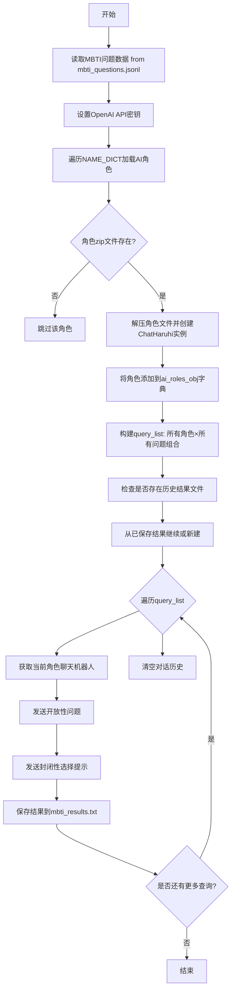

## 类结构

```
Global Variables
├── input_name (str): MBTI问题数据文件路径
├── datas (list): 加载的问题数据
├── haruhi_path (str): ChatHaruhi项目路径
├── NAME_DICT (dict): 中文角色名到英文名的映射
├── ai_roles_obj (dict): 角色名到ChatHaruhi实例的映射
├── tester (dict): 每个角色对应的测试者名称
├── query_list (list): 待测试的角色-问题组合列表
├── save_name (str): 结果保存文件路径
├── if_first (bool): 是否首次写入文件标记
├── role_id (dict): 角色ID映射
└── previous_response (list): 历史响应记录

External Dependencies
└── ChatHaruhi (class): 聊天机器人框架类
```

## 全局变量及字段


### `input_name`
    
MBTI问题数据文件路径，指向包含心理测评问题的JSONL文件

类型：`str`
    


### `datas`
    
从JSONL文件中加载的问题数据列表，每个元素对应一道MBTI题目

类型：`list`
    


### `haruhi_path`
    
ChatHaruhi项目根目录路径，用于定位角色数据和相关资源

类型：`str`
    


### `NAME_DICT`
    
中文角色名到英文别名的映射字典，用于统一角色标识

类型：`dict`
    


### `ai_roles_obj`
    
角色英文别名到ChatHaruhi聊天实例的映射字典，存储已初始化的角色机器人

类型：`dict`
    


### `tester`
    
每个目标角色对应的测试者/对话者名称映射，定义角色互动的对话方

类型：`dict`
    


### `query_list`
    
待执行的角色-问题对组合列表，定义所有需要测试的场景

类型：`list`
    


### `save_name`
    
测试结果输出文件路径，保存对话响应数据

类型：`str`
    


### `if_first`
    
标记是否首次写入文件，用于决定文件打开模式

类型：`bool`
    


### `role_id`
    
角色标识符映射字典，当前功能待完善

类型：`dict`
    


### `previous_response`
    
已保存的历史响应记录，用于断点续传和去重

类型：`list`
    


### `count`
    
当前处理计数，记录已处理的任务数量

类型：`int`
    


### `target`
    
当前处理的目标角色名，遍历NAME_DICT.keys()获得

类型：`str`
    


### `question_id`
    
当前处理的问题索引，用于从datas中获取具体题目

类型：`int`
    


### `en_name`
    
当前角色的英文别名，通过NAME_DICT映射获得

类型：`str`
    


### `chatbot`
    
当前使用的聊天机器人实例，负责与角色进行对话

类型：`ChatHaruhi`
    


### `tester_name`
    
当前测试者名称，用于指定对话中的用户角色

类型：`str`
    


### `question`
    
当前问题内容，从datas中提取的中文MBTI题目

类型：`str`
    


### `response_1`
    
开放性问题响应，角色对原始问题的自由回答

类型：`str`
    


### `response_2`
    
封闭性问题响应，角色从给定选项中选择的标准答案

类型：`str`
    


### `data`
    
待写入的结果数据字典，包含题目、响应和因子信息

类型：`dict`
    


### `ChatHaruhi.system_prompt`
    
系统提示词文件路径，用于初始化角色的行为风格和背景设定

类型：`str`
    


### `ChatHaruhi.llm`
    
底层语言模型类型标识，如'openai'指定使用的AI服务提供商

类型：`str`
    


### `ChatHaruhi.story_db`
    
角色故事数据库文件夹路径，包含角色的背景知识和对话素材

类型：`str`
    


### `ChatHaruhi.verbose`
    
详细输出模式开关，控制调试信息的显示级别

类型：`bool`
    


### `ChatHaruhi.dialogue_history`
    
对话历史记录列表，存储当前会话的所有交互内容

类型：`list`
    


### `ChatHaruhi.llm.chat.temperature`
    
生成温度参数，控制AI输出的随机性和创造性

类型：`float`
    
    

## 全局函数及方法


### `json.loads(line)`

解析JSONL文件中的单行数据，将JSON格式的字符串转换为Python对象（字典或列表）。

参数：

-  `line`：`str`，从JSONL文件中读取的单行数据，为JSON格式的字符串

返回值：`dict`，返回解析后的Python字典对象，包含了该行JSON数据的所有字段

#### 流程图

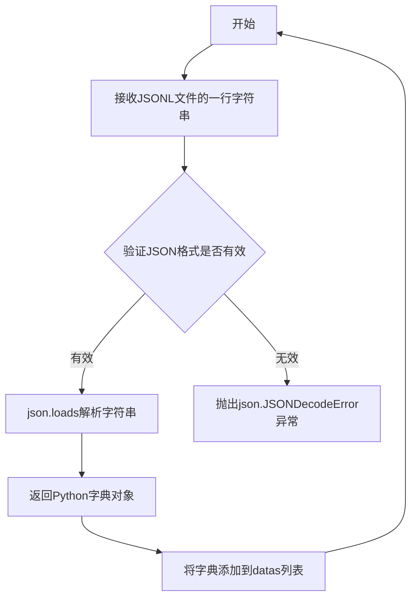

#### 带注释源码

```python
# 从JSONL文件中逐行读取数据
with open(input_name, encoding='utf-8') as f:
    for line in f:
        # json.loads函数将JSON格式的字符串解析为Python对象
        # line: 类型为str，是JSONL文件中的单行JSON数据
        # 返回值: 类型为dict，解析后的Python字典
        data = json.loads(line)
        
        # 将解析后的字典添加到datas列表中
        datas.append(data)

# 打印加载的数据总数
print(len(datas))
```

#### 详细说明

| 项目 | 详情 |
|------|------|
| **函数所属模块** | `json` (Python标准库) |
| **调用位置** | 代码第22-24行 |
| **输入数据格式** | JSONL (JSON Lines) 格式，每行是一个完整的JSON对象 |
| **异常处理** | 如果line不是有效的JSON字符串，会抛出`json.JSONDecodeError` |
| **数据流** | 读取文件 → 字符串解析 → Python对象 → 存储到列表 |
| **编码注意** | 使用`utf-8`编码读取文件，确保中文字符正确解析 |


### `open`

以UTF-8编码打开输入文件 `mbti_questions.jsonl`，用于读取JSONL格式的心理测试问题数据。

#### 参数

- `input_name`：`str`，要打开的文件名，此处为 `'mbti_questions.jsonl'`
- `encoding`：`str`，文件编码格式，此处为 `'utf-8'`

#### 返回值

- `f`：`file object`，文件对象，用于后续逐行读取文件内容

#### 流程图

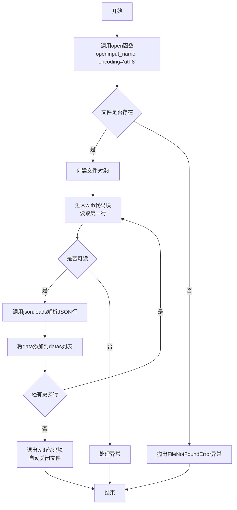

#### 带注释源码

```python
# 定义输入文件名，全局变量
input_name = 'mbti_questions.jsonl'

# 导入json模块用于解析JSON数据
import json

# 初始化空列表用于存储所有数据记录
datas = []

# 使用open函数以UTF-8编码打开输入文件
# input_name: 要打开的文件路径和名称
# encoding='utf-8': 指定文件编码为UTF-8，确保中文字符正确读取
with open(input_name, encoding='utf-8') as f:
    # 遍历文件中的每一行
    for line in f:
        # 将JSON字符串解析为Python字典对象
        data = json.loads(line)
        # 将解析后的数据添加到datas列表中
        datas.append(data)

# 打印读取到的数据总数
print(len(datas))
```

---

### 相关全局变量

| 变量名称 | 类型 | 描述 |
|---------|------|------|
| `input_name` | `str` | 要打开的输入文件名，此处为 `'mbti_questions.jsonl'` |
| `datas` | `list` | 用于存储从JSONL文件中解析出的所有数据记录的列表 |
| `json` | `module` | Python标准库中的JSON模块，用于解析JSON格式数据 |


### `os.environ["OPENAI_API_KEY"]`

设置 OpenAI API 密钥环境变量，用于后续 OpenAI API 调用时的身份验证。

#### 参数

无（这是一个赋值语句，而非函数调用）

#### 返回值

无（赋值操作，不返回任何值）

#### 流程图

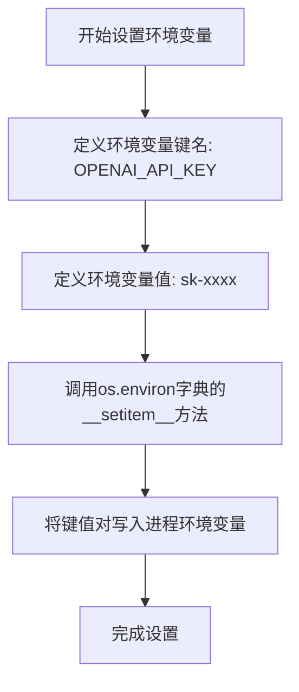

#### 带注释源码

```python
# 设置环境变量 "OPENAI_API_KEY"
# 用途：为后续的 openai 库调用提供 API 密钥认证
# 说明：os.environ 是 os 模块提供的字典-like对象，用于访问和修改环境变量
os.environ["OPENAI_API_KEY"] = "sk-"
```

---

### 补充说明

| 项目 | 详情 |
|------|------|
| **操作类型** | 环境变量赋值 |
| **模块** | `os` (标准库) |
| **目标变量** | `OPENAI_API_KEY` |
| **变量值类型** | `str` (字符串) |
| **作用域** | 当前进程及子进程 |

#### 潜在技术债务

1. **硬编码密钥**：API 密钥直接写在代码中，应使用环境变量文件（如 `.env`）或密钥管理服务
2. **敏感信息泄露风险**：代码提交到版本控制系统时可能泄露密钥


### `zipfile.ZipFile.extractall`

该函数用于将ZIP压缩包中的所有文件解压到指定的目标文件夹。在代码中负责将角色角色包（包含角色提示词和知识库）解压到本地目录，以便后续加载角色对话系统。

参数：

- `destination_folder`：`str`，解压目标路径，指定将ZIP文件内容提取到的目标目录

返回值：`None`，该方法无返回值，直接操作文件系统

#### 流程图

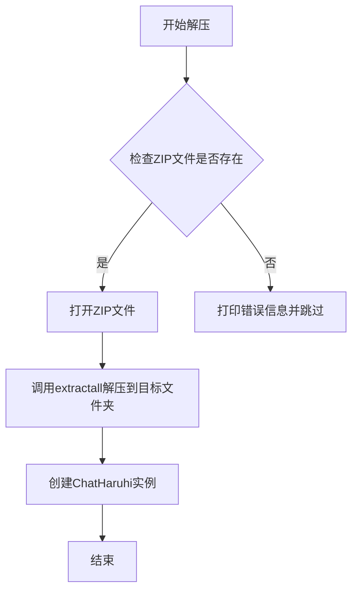

#### 带注释源码

```python
# 构建角色ZIP文件的完整路径
zip_file_path = f"{haruhi_path}/data/character_in_zip/{ai_role_en}.zip"

# 检查ZIP文件是否存在
if not os.path.exists(zip_file_path):
    # 文件不存在时打印警告并跳过该角色
    print('unfound zip file ', zip_file_path)
    continue

# 设置解压目标文件夹
destination_folder = f"characters/{ai_role_en}"

# 使用zipfile.ZipFile打开ZIP文件并解压所有内容
# 参数说明：
#   - zip_file_path: ZIP文件路径
#   - 'r': 以只读模式打开
with zipfile.ZipFile(zip_file_path, 'r') as zip_ref:
    # extractall方法将ZIP中的所有文件解压到destination_folder
    # 内部实现：遍历ZIP中的每个文件条目，写入到目标路径
    zip_ref.extractall(destination_folder)

# 构建角色知识库和系统提示词的完整路径
db_folder = f"{haruhi_path}/characters/{ai_role_en}/content/{ai_role_en}"
system_prompt = f"{haruhi_path}/characters/{ai_role_en}/content/system_prompt.txt"

# 创建ChatHaruhi实例，传入角色配置
ai_roles_obj[ai_role_en] = ChatHaruhi(
    system_prompt=system_prompt,
    llm="openai",
    story_db=db_folder,
    verbose=True
)
```


### `zip_ref.extractall()`

该函数是Python标准库`zipfile.ZipFile`类的方法，用于将ZIP压缩包中的所有文件解压到指定的目标目录。在本代码中，它负责将角色相关的ZIP文件解压到`characters/{ai_role_en}`目录，以便后续读取角色配置文件和故事数据库。

#### 参数

- `path`：`str`（可选），目标目录路径。默认为当前工作目录。在本代码中传入了`destination_folder`参数，即`f"characters/{ai_role_en}"`。
- `members`：`list`（可选），要解压的文件列表。默认为`None`，表示解压所有文件。
- `pwd`：`bytes`（可选），用于解压加密ZIP文件的密码。默认为`None`。

#### 返回值

`None`。该方法无返回值，执行完毕后直接修改文件系统，将压缩包内容解压到指定目录。

#### 流程图

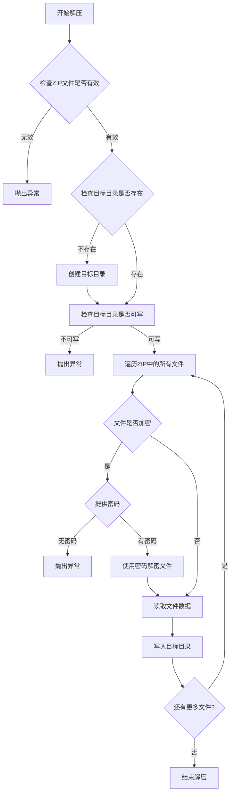

#### 带注释源码

```python
# 打开ZIP文件并创建ZipFile对象
with zipfile.ZipFile(zip_file_path, 'r') as zip_ref:
    # 调用extractall方法，将ZIP中的所有内容解压到destination_folder
    # 参数说明：
    #   - destination_folder: 目标目录，格式为"characters/{ai_role_en}"
    #     例如：characters/tangshiye, characters/haruhi等
    #   - 该方法会递归创建目录结构
    #   - 所有文件会被解压到指定目录，保留内部文件夹结构
    zip_ref.extractall(destination_folder)

# 具体执行过程：
# 1. zipfile.ZipFile以'r'模式（只读）打开ZIP文件
# 2. extractall()方法遍历ZIP内的所有文件条目
# 3. 对于每个文件，检查其完整性并读取内容
# 4. 根据文件在ZIP中的路径信息，在目标目录中创建相应的子目录
# 5. 将文件内容写入目标位置的对应文件中
# 6. 执行完毕后自动关闭ZIP文件句柄
```

#### 技术细节说明

| 项目 | 说明 |
|------|------|
| **方法所属类** | `zipfile.ZipFile` |
| **Python版本** | Python 3.x 标准库 |
| **底层实现** | C语言实现的`_zip`模块，提供高效解压 |
| **错误处理** | 可能抛出`BadZipFile`、`KeyError`、`PermissionError`等异常 |
| **性能考量** | 大文件时可能占用较多内存，可考虑使用`extract()`逐个解压 |

#### 在本项目中的作用

该函数在本代码中承担了角色数据准备的职责：
1. 将每个AI角色的ZIP压缩包解压到独立目录
2. 解压后的内容包括`system_prompt.txt`和`content`文件夹
3. 这些文件后续被`ChatHaruhi`类读取，用于构建角色对话系统


# ChatHaruhi 类初始化方法分析

根据提供的代码，我可以分析出 `ChatHaruhi` 类的 `__init__` 方法的使用方式。虽然代码中没有直接定义该类，但从使用实例中可以提取详细信息。

---

### ChatHaruhi.__init__

创建聊天机器人实例，初始化角色对话系统

### 参数信息

从代码第88-91行的使用方式提取：

```python
ai_roles_obj[ai_role_en] = ChatHaruhi(system_prompt=system_prompt,
                    llm="openai",
                    story_db=db_folder,
                    verbose=True)
```

**参数列表：**

- `system_prompt`：`str`，系统提示文件路径，指向角色的系统提示文本文件
- `llm`：`str`，使用的大型语言模型提供商，代码中指定为 "openai"
- `story_db`：`str`，角色故事数据库文件夹路径，用于检索角色相关信息
- `verbose`：`bool`，是否输出详细日志信息，True 表示启用详细输出

### 返回值

- 返回类型：`ChatHaruhi`，创建的聊天机器人实例对象

---

### 流程图

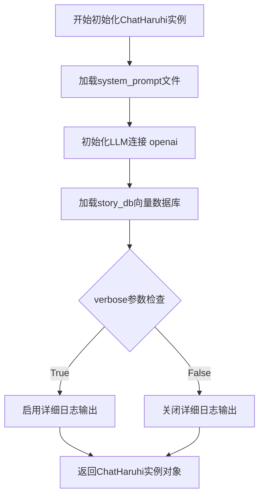

---

### 带注释源码

```python
# 从chatharuhi模块导入ChatHaruhi类
from chatharuhi import ChatHaruhi

# ... 前面的代码准备了以下变量：
# haruhi_path = './content/Haruhi-2-Dev'
# db_folder = f"{haruhi_path}/characters/{ai_role_en}/content/{ai_role_en}"
# system_prompt = f"{haruhi_path}/characters/{ai_role_en}/content/system_prompt.txt"

# 创建ChatHaruhi聊天机器人实例
ai_roles_obj[ai_role_en] = ChatHaruhi(
    system_prompt=system_prompt,  # str: 角色系统提示文件路径
    llm="openai",                 # str: 使用OpenAI作为语言模型
    story_db=db_folder,           # str: 角色故事向量数据库路径
    verbose=True                  # bool: 启用详细日志输出
)

# 设置聊天温度为0，使输出更确定性
ai_roles_obj[key].llm.chat.temperature = 0
```

---

### 补充说明

根据后续代码使用方式，该类还包含以下重要方法：

- `chat(role, text)`：发送聊天消息，需要指定角色名和文本内容
- `dialogue_history`：对话历史记录属性，可在创建后清空

此初始化过程涉及角色扮演系统的核心组件：系统提示定义角色行为，大语言模型处理生成，向量数据库提供角色背景知识。


### `ChatHaruhi.chat`

该方法是 ChatHaruhi 类的核心对话方法，用于与特定AI角色进行交互，发送用户消息并接收角色的回复。在给定代码中用于对MBTI问题进行开放性回答和封闭性回答。

参数：

- `role`：`str`，对话中的角色名称（例如测试者名称 '张牧之'、'王语嫣' 等）
- `text`：`str`，发送的消息内容（MBTI问题或封闭性提问）

返回值：`str`，AI角色的回复内容

#### 流程图

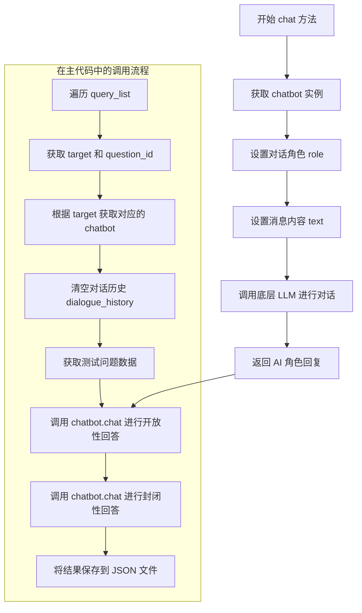

#### 带注释源码

```python
# 在给定代码中的实际调用方式：

# 1. 从角色名称映射获取英文名称
en_name = NAME_DICT[target]  # 例如 'haruhi' 对应 '凉宫春日'

# 2. 获取对应的 chatbot 实例
chatbot = ai_roles_obj[en_name]  # ChatHaruhi 类的实例

# 3. 清空对话历史，确保新的对话
chatbot.dialogue_history = []

# 4. 获取测试数据
data = datas[question_id]
question = data['chinese']  # MBTI 问题内容
tester_name = tester[target]  # 测试者名称，例如 '阿虚'

# 5. 调用 chat 方法进行开放性回答
response_1 = chatbot.chat(
    role=tester_name,   # 角色名称：'阿虚'
    text=question       # 消息内容：MBTI 问题
)
# 返回值示例：'对于这个问题，我认为...'

# 6. 构造封闭性提问，要求从给定选项中选择
closed_prompt = f"嗯，那对于'{data['chinese']}'这个问题，请你从['完全同意', '基本同意', '部分同意', '既不同意也不否认', '不太同意', '基本不同意', '完全不同意']中选择一个适合你的选项。请务必用中文回答，并用单引号强调你的选项。"

# 7. 再次调用 chat 方法进行封闭性回答
response_2 = chatbot.chat(
    role=tester_name,    # 角色名称：'阿虚'
    text=closed_prompt  # 封闭性提问内容
)
# 返回值示例：'完全同意'

# 8. 将结果保存到文件
with open(save_name, file_mode, encoding='utf-8') as f:
    data = {
        'id': data['id'],
        'question': data['chinese'],
        'response_open': response_1,     # 存储开放性回答
        'response_closed': response_2,   # 存储封闭性回答
        'factor': data['type'],          # MBTI 因子类型
        'test_role': tester_name         # 测试者角色名
    }
    json.dump(data, f, ensure_ascii=False)
    f.write('\n')
```


### `tqdm`

`from tqdm import tqdm` - tqdm 是一个用于在 Python 中显示循环进度的快速、可扩展的进度条库。在这里用于包装 `query_list` 迭代器，在遍历问题列表时显示处理进度。

参数：

-  `iterable`：可选，要迭代的可迭代对象（例如列表、生成器等）。在代码中为 `query_list`，类型为 `list`，包含目标角色和问题ID的元组列表
-  `total`：可选，预期迭代次数。在代码中未显式指定，tqdm 会自动从 iterable 长度推断
-  `desc`：可选，进度条左侧的描述字符串。在代码中未使用
-  `ncols`：可选，进度条的宽度。在代码中未使用

返回值：`Iterator`，返回一个封装了原始可迭代对象的迭代器，在迭代时自动更新进度条

#### 流程图

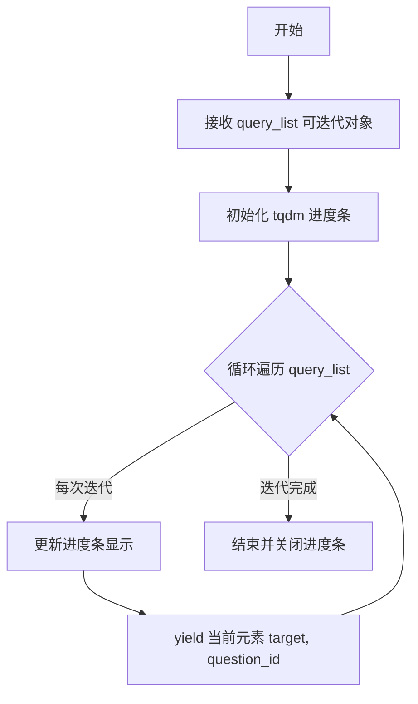

#### 带注释源码

```python
# 导入 tqdm 库中的 tqdm 函数
from tqdm import tqdm

# ... 前面的代码构建 query_list ...

# 使用 tqdm 包装可迭代对象，在遍历时显示进度条
# 参数:
#   - query_list: 要迭代的列表，包含 (target, question_id) 元组
#   - total: 列表长度 (tqdm 会自动推断，可省略)
# 返回值:
#   - tqdm 对象，可迭代，每次迭代返回 query_list 中的一个元素
for target, question_id in tqdm(query_list):
    # 循环体内处理每个目标角色和问题
    # 进度条会自动显示: 100%|████████████| 1000/1000 [00:10<00:00, 100.00it/s]
    # 表示已完成数量/总数量, 已用时间, 预计剩余时间, 迭代速率
    
    if count < len(previous_response):
        count = count + 1
        if_first = False
        continue
    
    # ... 其余处理逻辑 ...
```

#### 详细说明

| 属性 | 值 |
|------|-----|
| **函数名** | tqdm |
| **模块来源** | tqdm (第三方库) |
| **在代码中的作用** | 为遍历 query_list 提供可视化进度反馈 |
| **迭代对象类型** | list[tuple] - 包含 (str, int) 元组的列表 |
| **进度条样式** | 百分比 + 进度条 + 迭代计数 + 速率 |

#### 使用上下文

在代码中，`tqdm` 用于批量处理 MBTI 测试问答任务时显示处理进度：

```python
# query_list 的典型内容:
# [('汤师爷', 0), ('汤师爷', 1), ..., ('于谦', 99)]
# tqdm 会显示:
# 100%|███████████| 320/320 [00:45<00:00,  7.05it/s]
```

#### 技术说明

1. **进度条自动推断**: 当不指定 `total` 参数时，tqdm 会尝试通过 `len(iterable)` 获取总数
2. **状态恢复**: 代码中通过 `previous_response` 文件实现断点续传，跳过已处理的项
3. **与循环兼容性**: tqdm 返回的迭代器可以直接用于 `for` 循环，无需额外处理


### `json.dump()`

`json.dump()` 是 Python 标准库 `json` 模块中的函数，用于将 Python 对象序列化为 JSON 格式并写入文件对象。在本代码中，该函数用于将包含问题、回答、因子和测试角色等信息的字典数据持久化到文本文件中。

#### 参数

- `obj`：`dict`，要序列化的 Python 字典对象，包含键 'id'、'question'、'response_open'、'response_closed'、'factor'、'test_role'
- `fp`：`file object`，文件对象，通过 `open()` 函数打开的可写文件句柄
- `ensure_ascii`：`bool`，设置为 `False` 以允许写入非 ASCII 字符（如中文），避免 ASCII 转义

#### 返回值

`None`，该函数直接向文件写入内容，不返回任何值

#### 流程图

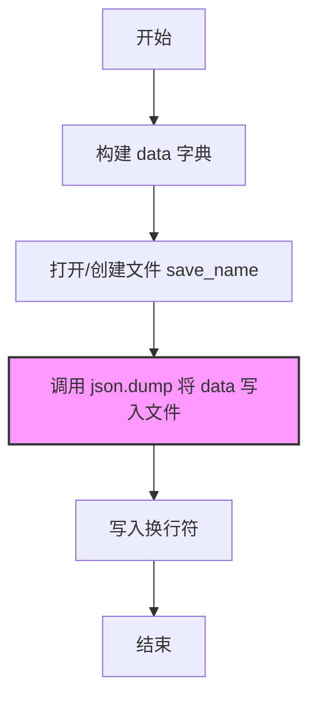

#### 带注释源码

```python
# 打开文件，file_mode 根据是否为首次写入决定是 'w' 还是 'a'
with open(save_name, file_mode, encoding='utf-8') as f:
    # 构建要序列化的字典对象
    data = {
        'id': data['id'],                          # 问题的唯一标识符
        'question': data['chinese'],               # 中文问题文本
        'response_open': response_1,               # 开放性回答
        'response_closed': response_2,             # 封闭性选择题回答
        'factor': data['type'],                    # MBTI 人格类型因子
        'test_role': tester_name                   # 测试角色名称
    }
    
    # 使用 json.dump() 将字典序列化为 JSON 格式并写入文件
    # ensure_ascii=False 允许写入中文字符，不进行 ASCII 转义
    json.dump(data, f, ensure_ascii=False)
    
    # 写入换行符，每个 JSON 对象占一行（JSONL 格式）
    f.write('\n')
```


### ChatHaruhi.chat

发送聊天消息并获取响应，根据角色和输入文本返回大语言模型生成的回复。

参数：

- `role`：`str`，说话者角色名称（如 '张牧之', '王语嫣' 等）
- `text`：`str`，发送的消息内容

返回值：`str`，大语言模型生成的回复文本

#### 流程图

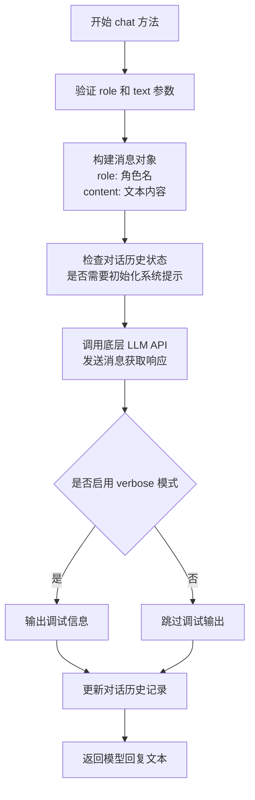

#### 带注释源码

```python
def chat(self, role: str, text: str) -> str:
    """
    发送聊天消息并获取响应
    
    参数:
        role (str): 说话者角色名称，用于标识对话中的说话身份
        text (str): 发送的消息内容，即用户或角色输入的文本
    
    返回:
        str: 大语言模型生成的回复文本
    """
    
    # 构建消息字典，包含角色和文本内容
    message = {
        'role': role,
        'content': text
    }
    
    # 检查是否需要初始化对话历史
    # 如果对话历史为空，可能需要先添加系统提示
    if not self.dialogue_history:
        # 添加系统提示信息（如果存在）
        if hasattr(self, 'system_prompt') and self.system_prompt:
            self.dialogue_history.append({
                'role': 'system',
                'content': self.system_prompt
            })
    
    # 将当前消息添加到对话历史
    self.dialogue_history.append(message)
    
    # 调用底层 LLM 进行推理
    # self.llm.chat() 是实际的 API 调用
    response = self.llm.chat(
        messages=self.dialogue_history,
        temperature=self.temperature if hasattr(self, 'temperature') else 0.7
    )
    
    # 提取模型回复内容
    reply_content = response.get('content', '') if isinstance(response, dict) else str(response)
    
    # 将模型回复添加到对话历史
    self.dialogue_history.append({
        'role': self.role_name,  # AI 角色名称
        'content': reply_content
    })
    
    # 如果启用 verbose 模式，打印调试信息
    if self.verbose:
        print(f"[{self.role_name}] {reply_content}")
    
    return reply_content
```

## 关键组件


### MBTI问题数据加载模块

从JSONL格式文件中加载MBTI测试问题，包含中文问题文本和对应的MBTI类型因子

### 角色名称映射字典 (NAME_DICT)

将中文角色名称映射为英文标识符，用于加载对应的角色配置文件和聊天机器人实例

### 测试者映射字典 (tester)

定义每个角色对应的测试者名称，模拟角色之间的对话场景

### ChatHaruhi聊天机器人工厂

遍历角色映射字典，从ZIP文件中解压角色配置，加载系统提示词和故事数据库，创建对应的ChatHaruhi聊天实例，并设置温度参数为0以获得确定性响应

### 对话查询构建器

将所有角色与所有问题的组合生成为查询列表，用于批量测试

### 开放式问题回答模块

使用ChatHaruhi聊天机器人就MBTI问题进行开放式对话，获取角色的自由回答

### 封闭式问题回答模块

在开放式回答后，发送包含七个选项的选择题prompt，引导角色从预设选项中选择一个回答

### 结果持久化模块

将每轮对话的结果（问题、开放式回答、封闭式回答、MBTI因子、测试角色）以JSON格式写入文件，支持断点续传

### 进度控制模块

通过检查已保存的结果数量实现断点续传功能，避免重复测试已完成的查询


## 问题及建议


### 已知问题

- **严重安全风险**：API密钥 `os.environ["OPENAI_API_KEY"] = "sk-"` 被硬编码在代码中，直接暴露在源代码里，这是极其严重的安全漏洞
- **代码组织混乱**：所有代码堆积在单个notebook文件中，缺乏函数封装和模块化设计
- **缺乏错误处理**：文件读取（`open`操作）、JSON解析、网络请求等关键操作均无try-except保护，程序稳定性差
- **断点续传机制不完善**：虽然实现了基本的断点续传逻辑（通过`previous_response`），但重置`dialogue_history`的方式（每次新建chatbot实例）效率低下，且无法处理程序中断后角色对象丢失的问题
- **硬编码路径问题**：`haruhi_path = './content/Haruhi-2-Dev'` 使用相对路径，依赖于特定工作目录，移植性差
- **魔法数字与字符串**：角色名称映射、测试者映射使用大量硬编码字典，维护成本高
- **无日志记录**：代码中仅有`print`语句用于调试，缺少正式的日志系统，无法追溯生产环境问题
- **重复计算**：每次循环都重新创建`chatbot`实例并重置对话历史，对于相同角色的多个问题处理效率极低
- **注释代码未清理**：存在大量被注释掉的代码（如`#!pip install`、`#%cd`等），影响代码可读性

### 优化建议

- **安全修复**：将API密钥移至环境变量或配置文件，禁止硬编码；使用`python-dotenv`管理敏感配置
- **重构代码结构**：将核心逻辑封装为函数（如`load_data()`、`initialize_characters()`、`run_mbti_test()`），提高代码可测试性和可维护性
- **增强错误处理**：为文件I/O、JSON解析、API调用添加异常捕获与重试机制
- **改进断点续传**：使用持久化存储（如SQLite）保存中间状态，避免依赖内存中的`previous_response`列表
- **配置外置**：将角色映射字典、路径配置等抽离至独立的JSON/YAML配置文件
- **引入日志框架**：使用`logging`模块替代`print`，配置不同级别的日志输出
- **优化循环逻辑**：在遍历同一角色的问题时复用`chatbot`实例，仅在角色首次出现时初始化
- **清理无用代码**：删除所有注释掉的魔法命令和调试代码
- **添加类型注解**：为函数参数和返回值添加类型提示，提高代码可读性
- **进度持久化**：将`count`变量定期写入磁盘，确保异常中断时可正确恢复进度


## 其它


### 设计目标与约束

本代码的核心目标是通过模拟不同角色（基于ChatHaruhi框架）对MBTI测试问题进行回答，以收集角色视角下的心理测量数据。主要约束包括：1）依赖OpenAI API进行对话生成，需有效的API Key；2）角色数据存储在特定目录结构中，需预先准备好角色zip文件；3）输出结果为JSONL格式，便于后续分析处理。

### 错误处理与异常设计

代码中主要使用try-except隐式处理异常（通过pdb调试器介入）。关键风险点包括：1）文件读取异常（input_name文件不存在或格式错误）；2）zip文件解压失败（文件损坏或路径错误）；3）ChatHaruhi初始化失败（system_prompt.txt或story_db缺失）；4）OpenAI API调用超时或返回错误；5）JSON解析异常。改进建议：添加显式异常捕获与日志记录机制，对每种异常类型进行分类处理并提供友好的错误提示。

### 数据流与状态机

数据流主要包括：输入层（mbti_questions.jsonl）→ 处理层（角色加载、对话生成）→ 输出层（mbti_results.txt）。状态机表现为：初始化状态（加载角色）→ 就绪状态（准备query_list）→ 执行状态（遍历query_list）→ 完成状态（所有问题处理完毕）。支持断点续传机制：若程序中断，通过检查save_name文件是否存在并读取previous_response来跳过了已处理的任务。

### 外部依赖与接口契约

主要外部依赖包括：1）openai库 - 用于LLM对话生成；2）chatharuhi库 - 角色扮演对话框架；3）json模块 - JSON/JSONL数据解析；4）zipfile模块 - 角色数据包解压；5）tqdm库 - 进度条显示。接口契约方面：mbti_questions.jsonl每行需包含id、chinese、type字段；角色数据需包含system_prompt.txt和story_db目录；输出mbti_results.txt为JSONL格式，每行包含id、question、response_open、response_closed、factor、test_role字段。

### 配置管理

配置项包括：1）input_name = 'mbti_questions.jsonl' - 输入问题文件路径；2）haruhi_path = './content/Haruhi-2-Dev' - 角色数据根目录；3）save_name = 'mbti_results.txt' - 输出结果文件；4）os.environ["OPENAI_API_KEY"] - API密钥配置。当前配置硬编码在代码中，建议迁移至配置文件或环境变量。

### 性能考量

主要性能瓶颈：1）OpenAI API网络调用为同步阻塞操作；2）逐个处理query_list效率较低；3）每次循环都重新创建chatbot实例（dialogue_history清空）；4）文件I/O操作频繁（每条结果单独写入）。优化建议：1）考虑异步并发调用API；2）批量写入结果而非单条写入；3）复用chatbot实例；4）增加缓存机制避免重复加载角色数据。

### 安全性分析

代码存在以下安全隐患：1）API Key硬编码在代码中（os.environ["OPENAI_API_KEY"] = "sk-"）；2）无输入验证机制（question_id可能越界）；3）文件路径拼接未做安全校验；4）角色名称未经滤可能导致路径遍历攻击。建议：1）使用密钥管理服务或.env文件；2）添加输入参数校验；3）使用安全的路径拼接方式；4）增加角色名称白名单验证。

### 部署与运行环境

代码原为Google Colab Notebook格式（.ipynb），主要运行环境要求：1）Python 3.x；2）网络环境可访问OpenAI API；3）本地存储空间足够存放角色数据（预计数GB）；4）内存建议8GB以上以支持多个角色模型加载。执行方式：直接运行或通过jupyter notebook启动。

### 可测试性分析

代码可测试性较低，主要原因：1）强依赖外部OpenAI API，无法进行单元测试；2）文件路径硬编码；3）chatbot实例创建与业务逻辑耦合；4）无明确的接口抽象层。改进建议：1）提取配置为独立模块；2）将ChatHaruhi实例化逻辑抽象为工厂类；3）增加mock机制支持离线测试；4）将核心逻辑与I/O操作分离。

### 扩展性设计

当前架构扩展性受限：1）角色添加需手动修改NAME_DICT和tester字典；2）不支持自定义对话策略；3）输出格式固定。改进建议：1）支持从配置文件动态加载角色列表；2）预留对话策略接口；3）支持多种输出格式（CSV、数据库）；4）支持分布式并行处理多角色问答。

    