# `Chat-Haruhi-Suzumiya\research\personality\raw_code\get_mbti_results_stubborn.py` 详细设计文档

该代码是一个MBTI人格测试聊天机器人实验脚本，通过加载ChatHaruhi框架中的多个角色（包含动漫、游戏、电视剧人物），使用OpenAI API与这些角色进行MBTI心理人格测试对话，并将测试结果保存到JSONL文件中。

## 整体流程

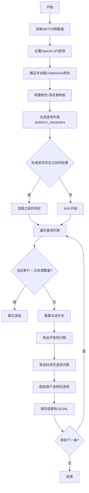

## 类结构

```
全局变量层
├── 配置文件 (input_name, save_name)
├── 数据存储 (datas, query_list, previous_response)
├── 角色映射 (NAME_DICT, tester, stubborn_characters)
└── 状态管理 (if_first, count, role_id)
ChatHaruhi (第三方库)
└── ChatHaruhi类实例 (ai_roles_obj)
```

## 全局变量及字段


### `input_name`
    
输入MBTI问题JSONL文件名

类型：`str`
    


### `datas`
    
存储解析后的MBTI问题数据

类型：`list`
    


### `haruhi_path`
    
ChatHaruhi项目路径

类型：`str`
    


### `NAME_DICT`
    
中文角色名到英文名的映射

类型：`dict`
    


### `ai_roles_obj`
    
存储已加载的角色聊天机器人实例

类型：`dict`
    


### `tester`
    
角色对应的测试者名称映射

类型：`dict`
    


### `stubborn_characters`
    
需要测试的坚持角色列表

类型：`list`
    


### `query_list`
    
待执行的测试查询列表

类型：`list`
    


### `save_name`
    
结果输出文件名

类型：`str`
    


### `if_first`
    
是否首次写入文件的标志

类型：`bool`
    


### `role_id`
    
角色ID映射

类型：`dict`
    


### `previous_response`
    
已存在的历史响应数据

类型：`list`
    


### `count`
    
已处理记录计数器

类型：`int`
    


### `options`
    
MBTI选项列表

类型：`list`
    


### `ChatHaruhi.system_prompt`
    
系统提示词，定义角色行为

类型：`str`
    


### `ChatHaruhi.llm`
    
语言模型类型标识

类型：`str`
    


### `ChatHaruhi.story_db`
    
故事数据库路径

类型：`str`
    


### `ChatHaruhi.dialogue_history`
    
对话历史记录列表

类型：`list`
    


### `ChatHaruhi.chat`
    
聊天接口对象，包含temperature等属性

类型：`object`
    


### `ChatHaruhi.chat.temperature`
    
生成文本的随机性参数

类型：`float`
    
    

## 全局函数及方法


### `json.loads(line)`

解析单行 JSON 数据，将 JSON 字符串转换为 Python 对象（字典或列表）。这是 Python 标准库 `json` 模块的核心函数，在本代码中用于从 JSONL 文件中读取和解析数据。

#### 参数

- `line`：`str`，需要解析的 JSON 格式字符串，通常是文件中的一行数据

#### 返回值

- `返回值类型`：`dict` 或 `list`
- `返回值描述`：解析后的 Python 对象，通常是字典（当 JSON 是对象时）或列表（当 JSON 是数组时）

#### 流程图

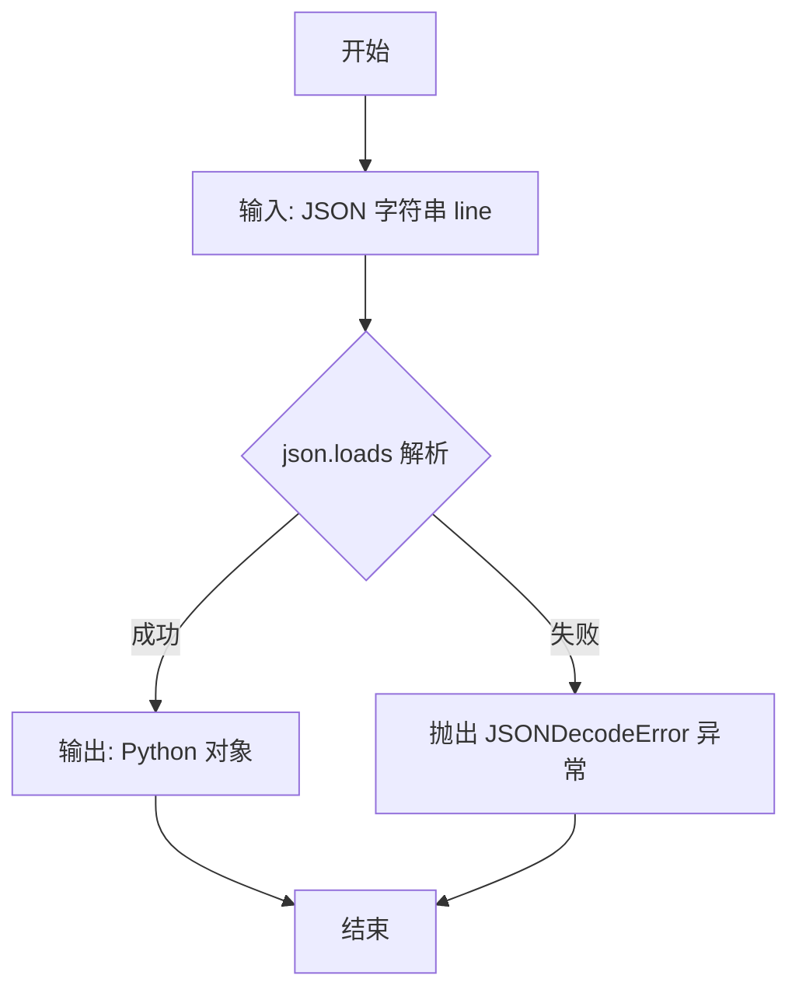

#### 带注释源码

```python
# 从文件读取一行 JSON 格式的字符串
data = json.loads(line)

# 说明：
# - json 是 Python 标准库中的 json 模块
# - loads() 方法将 JSON 字符串转换为 Python 对象
# - line 是从文件中读取的一行字符串
# - 返回的 data 通常是字典类型，包含了问题的各项属性
# - 如果 line 不是有效的 JSON 格式，会抛出 json.JSONDecodeError 异常
```

#### 实际使用示例

在代码中有两处使用：

**示例 1：读取问题数据**
```python
with open(input_name, encoding='utf-8') as f:
    for line in f:
        data = json.loads(line)  # 解析 JSONL 文件中的一行
        datas.append(data)       # 将解析后的字典添加到列表
```

**示例 2：读取已保存的结果**
```python
if os.path.exists(save_name):
    with open(save_name, encoding='utf-8') as f:
        for line in f:
            data = json.loads(line)  # 解析已保存的结果行
            previous_response.append(data)
```

#### 关键组件信息

| 组件名称 | 一句话描述 |
|---------|-----------|
| `json` 模块 | Python 标准库，用于 JSON 数据的序列化和反序列化 |
| `json.loads()` | 将 JSON 字符串转换为 Python 对象的方法 |
| `json.JSONDecodeError` | 解析失败时抛出的异常类型 |

#### 潜在的技术债务或优化空间

1. **错误处理缺失**：代码中使用 `json.loads(line)` 时没有显式的异常处理机制，如果遇到格式错误的 JSON 行，会导致程序崩溃
2. **编码问题**：虽然指定了 `encoding='utf-8'`，但未对 BOM 或其他编码问题进行处理
3. **验证缺失**：解析后的数据没有进行字段验证，可能导致后续代码访问不存在的键时出错

#### 其它项目

**错误处理与异常设计**：
- 当前代码未捕获 `JSONDecodeError` 异常，建议添加 try-except 块处理可能的解析错误
- 可以考虑记录错误行号和内容，便于调试

**数据流与状态机**：
- `json.loads()` 是数据流中的关键转换节点，将文件 I/O 的字符串流转换为内存中的 Python 对象流
- 解析后的数据被追加到 `datas` 列表中，作为后续处理的输入


### `open(file, mode, encoding)`

文件打开操作，用于以指定模式打开文件并返回文件对象供后续读写操作使用。

参数：

- `file`：`str`，要打开的文件路径，可以是相对路径或绝对路径
- `mode`：`str`，文件打开模式，常见值包括 'r'（读取）、'w'（写入）、'a'（追加）、'rb'（二进制读取）等，默认为 'r'
- `encoding`：`str`，文件编码方式，如 'utf-8'、'gbk' 等，用于文本文件的字符编码解码

返回值：`TextIOWrapper`（或 `BufferedReader`/`BufferedWriter` 等），返回文件对象，支持 read()、write()、readline() 等操作

#### 流程图

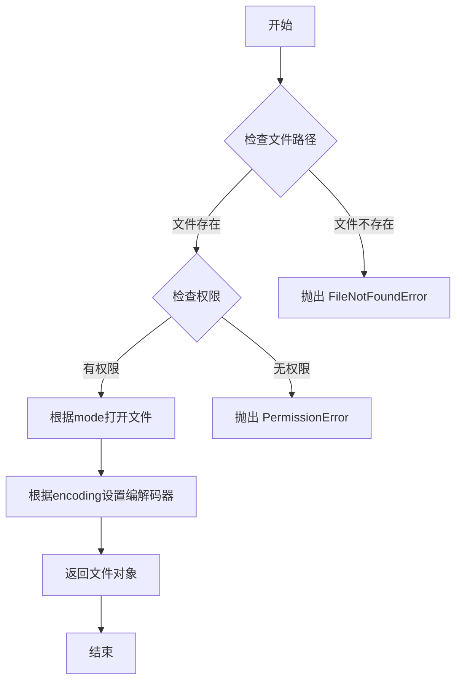

#### 带注释源码

```python
# 代码中使用 open() 函数的实际示例
input_name = 'mbti_questions.jsonl'  # 定义要打开的文件路径

# 使用 with 语句打开文件，确保自动关闭资源
# 参数说明：
#   - input_name: 文件路径字符串
#   - encoding='utf-8': 指定 UTF-8 编码读取文件内容
with open(input_name, encoding='utf-8') as f:
    # 遍历文件中的每一行
    for line in f:
        # 使用 json.loads 将每行 JSON 字符串解析为 Python 对象
        data = json.loads(line)
        # 将解析后的数据添加到 datas 列表中
        datas.append(data)

# 打印读取的数据条数
print(len(datas))
```

**说明**：在此代码中，`open()` 函数用于读取 MBTI 题目数据文件。`with` 语句确保文件在使用完毕后自动关闭，避免资源泄漏。`encoding='utf-8'` 参数确保中文字符能正确解码。


### `os.environ[key]`

设置指定名称的环境变量值为给定的字符串。

参数：

- `key`：字符串，环境变量的名称（如 `"OPENAI_API_KEY"`）
- `value`：字符串，环境变量的值（如 `"sk-"`）

返回值：`None`，赋值操作不返回任何值

#### 流程图

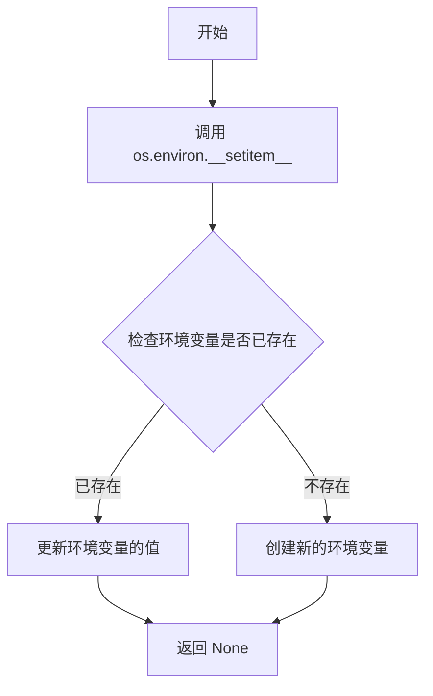

#### 带注释源码

```python
# 设置环境变量
# os.environ 是一个字典-like 对象,用于访问和修改环境变量
# 通过 __setitem__ 方法设置键值对
os.environ["OPENAI_API_KEY"] = "sk-"
# 等价于: os.environ.__setitem__("OPENAI_API_KEY", "sk-")
# 该操作会将环境变量 OPENAI_API_KEY 的值设置为 "sk-"
# openai 库会自动读取该环境变量用于API认证
```

---

**补充说明**：

- **设计目标**：为 OpenAI API 客户端提供认证凭据
- **约束**：环境变量 `OPENAI_API_KEY` 需要在调用 OpenAI API 之前设置
- **技术债务**：API Key 直接以明文形式硬编码在代码中，存在安全风险，应改为从配置文件或密钥管理系统读取


### `os.path.exists(path)`

检查指定路径（文件或目录）是否存在，返回布尔值结果。

参数：

- `path`：`str`，要检查的文件或目录路径

返回值：`bool`，如果指定路径存在返回 `True`，否则返回 `False`

#### 流程图

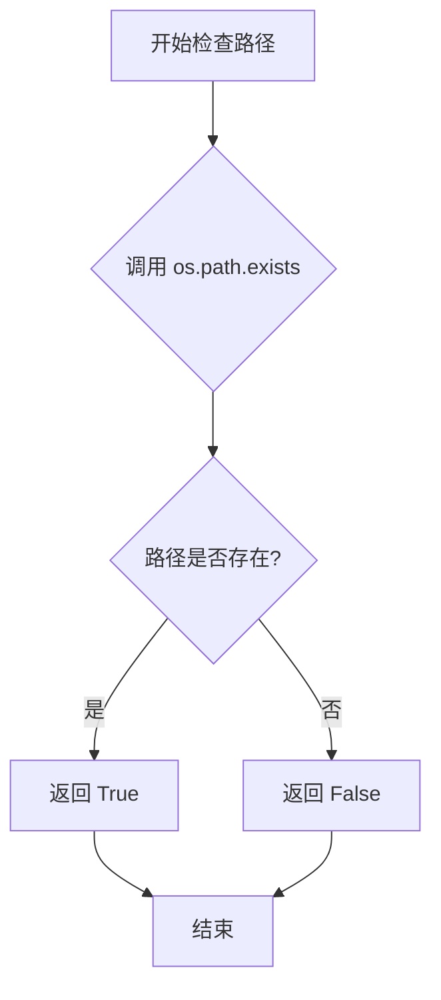

#### 带注释源码

```python
# 在代码中的第一个使用场景：检查角色zip文件是否存在
zip_file_path = f"{haruhi_path}/data/character_in_zip/{ai_role_en}.zip"
if not os.path.exists(zip_file_path):
    # 如果zip文件不存在，打印警告信息并跳过当前角色
    print('unfound zip file ', zip_file_path)
    continue

# 在代码中的第二个使用场景：检查结果保存文件是否存在
save_name = f'mbti_results_stubborn.jsonl'
if os.path.exists(save_name):
    # 如果结果文件已存在，读取已有数据以支持断点续传
    with open(save_name, encoding='utf-8') as f:
        for line in f:
            data = json.loads(line)
            previous_response.append(data)
```


### `zipfile.ZipFile.extractall()`

从ZIP归档文件中提取所有文件到指定目录。

参数：

- `path`：`str`，可选，目标目录路径，默认为当前目录（`None`）
- `members`：`list[ZipInfo]`，可选，要解压的文件列表，默认为ZIP内的所有文件
- `pwd`：`bytes`，可选，用于解密ZIP文件的密码

返回值：`None`，无返回值，直接将文件解压到指定目录

#### 流程图

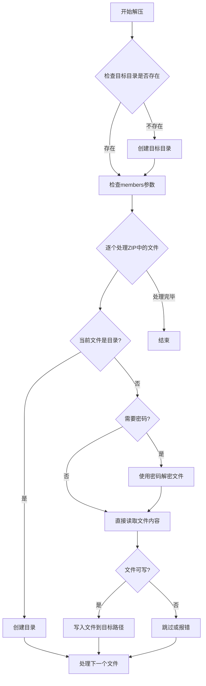

#### 带注释源码

```python
def extractall(self, path=None, members=None, pwd=None):
    """
    从ZIP文件中提取所有成员到指定目录
    
    参数:
        path: 目标目录，默认为当前目录
        members: 要提取的文件列表，默认为所有文件
        pwd: 解压密码（如果ZIP文件加密）
    """
    if path is None:
        # 如果未指定路径，使用当前工作目录
        path = os.getcwd()
    else:
        # 确保路径是绝对路径
        path = os.path.abspath(path)
    
    # 获取要解压的文件列表，默认为所有文件
    if members is None:
        members = self.namelist()
    
    # 遍历每个要解压的文件
    for zipinfo in members:
        # 调用extract方法单独解压每个文件
        self.extract(zipinfo, path, pwd)
```

```python
def extract(self, member, path=None, pwd=None):
    """
    从ZIP中提取单个文件
    
    参数:
        member: ZipInfo对象或文件名
        path: 目标目录
        pwd: 解压密码
    """
    if path is None:
        path = os.getcwd()
    
    # 获取ZipInfo对象
    if isinstance(member, ZipInfo):
        zipinfo = member
    else:
        zipinfo = self.getinfo(member)
    
    # 返回完整的目标文件路径
    return self._extract_one(zipinfo, path, pwd)
```

```python
def _extract_one(self, zipinfo, path, pwd):
    """内部方法：实际执行单文件解压"""
    # 构建目标文件完整路径
    outfile = os.path.join(path, zipinfo.filename)
    
    # 获取文件权限
    attr = zipinfo.external_attr
    
    # 创建父目录
    directory = os.path.dirname(outfile)
    if directory and not os.path.exists(directory):
        os.makedirs(directory)
    
    # 检查是否为符号链接
    if zipinfo.is_dir():
        # 是目录则创建目录
        if not os.path.exists(outfile):
            os.makedirs(outfile)
        return outfile
    
    # 打开ZIP文件和目标输出文件
    with self.open(zipinfo, pwd=pwd) as source:
        # 读取并写入文件内容
        with open(outfile, "wb") as target:
            shutil.copyfileobj(source, target)
    
    # 设置文件权限（Unix权限）
    if attr:
        # 从外部属性中提取Unix权限
        unix_attr = attr >> 16
        if unix_attr:
            os.chmod(outfile, unix_attr)
    
    return outfile
```


# ChatHaruhi 类设计文档

## 1. 一段话描述

ChatHaruhi 是一个基于大语言模型的角色扮演聊天框架，通过加载角色特定的系统提示词和故事数据库，使 AI 能够以特定角色的身份和性格特征与用户进行对话。

## 2. 文件的整体运行流程

该脚本是一个 MBTI 心理测试评估工具，主要流程如下：

1. **数据加载**：从 `mbti_questions.jsonl` 读取 MBTI 测试问题
2. **环境配置**：设置 OpenAI API 密钥
3. **角色初始化**：解压角色 ZIP 包并为每个角色创建 ChatHaruhi 实例
4. **测试执行**：遍历指定角色和问题，通过聊天机器人获取开放式和封闭式回答
5. **结果保存**：将测试结果保存为 JSONL 格式文件

## 3. 类的详细信息

### ChatHaruhi 类

#### 构造函数参数（用于创建实例）

| 参数名称 | 参数类型 | 参数描述 |
|---------|---------|---------|
| system_prompt | str | 角色系统提示词文件路径 |
| llm | str | 大语言模型类型（如 "openai"） |
| story_db | str | 角色故事数据库文件夹路径 |
| verbose | bool | 是否输出详细日志信息 |

#### 类字段（通过代码推断）

| 字段名称 | 类型 | 描述 |
|---------|------|------|
| dialogue_history | list | 存储对话历史记录 |
| llm | object | 大语言模型实例 |
| chat | object | 聊天接口对象 |

#### 类方法（通过代码推断）

| 方法名称 | 描述 |
|---------|------|
| chat(role, text) | 发送聊天消息并获取回复 |

## 4. ChatHaruhi 构造函数详细设计

### `ChatHaruhi(system_prompt, llm, story_db, verbose)`

创建聊天实例，初始化角色扮演聊天机器人

参数：

- `system_prompt`：`str`，角色系统提示词文件路径，包含角色的性格特征、背景故事和行为规范
- `llm`：`str`，指定使用的大语言模型提供程序（如 "openai"、"claude" 等）
- `story_db`：`str`，角色故事数据库文件夹路径，用于检索相关上下文
- `verbose`：`bool`，控制是否输出详细的调试和运行信息

返回值：`ChatHaruhi` 对象，返回初始化后的聊天实例

#### 流程图

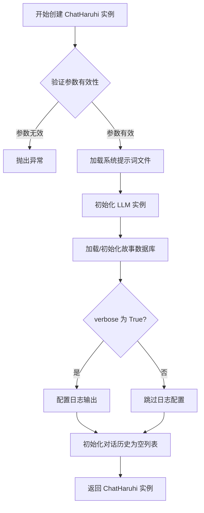

#### 带注释源码

```python
# 从导入语句可知 ChatHaruhi 来自 chatharuhi 模块
from chatharuhi import ChatHaruhi

# 角色系统提示词文件路径
system_prompt = f"{haruhi_path}/characters/{ai_role_en}/content/system_prompt.txt"

# 角色故事数据库文件夹路径
db_folder = f"{haruhi_path}/characters/{ai_role_en}/content/{ai_role_en}"

# 创建 ChatHaruhi 实例
ai_roles_obj[ai_role_en] = ChatHaruhi(
    system_prompt=system_prompt,  # 角色设定prompt文件路径
    llm="openai",                 # 使用 OpenAI 作为 LLM 提供者
    story_db=db_folder,          # 角色相关故事/知识库路径
    verbose=True                 # 开启详细日志输出
)

# 后续可访问 llm 属性设置温度参数
ai_roles_obj[key].llm.chat.temperature = 0
```

## 5. 关键组件信息

| 组件名称 | 一句话描述 |
|---------|-----------|
| ChatHaruhi 类 | 角色扮演聊天框架核心类 |
| system_prompt.txt | 存储角色设定和人格特征的文本文件 |
| story_db | 向量数据库，存储角色相关故事和上下文 |
| LLM 接口 | 统一的大语言模型调用封装 |
| dialogue_history | 对话上下文管理，记录历史消息 |

## 6. 潜在的技术债务或优化空间

1. **硬编码 API Key**：OpenAI API 密钥直接硬编码在代码中 (`os.environ["OPENAI_API_KEY"] = "sk-"`)，存在安全风险
2. **缺少错误处理**：文件解压、API 调用、JSON 解析等操作缺乏完善的异常捕获机制
3. **数据库路径耦合**：角色数据库路径拼接存在重复代码，可提取为工具函数
4. **配置分散**：角色名称映射、测试者映射等配置散布在代码各处
5. **状态持久化不完整**：对话历史重置逻辑 (`dialogue_history = []`) 可能导致跨问题上下文丢失
6. **依赖版本兼容性**：代码中注释显示使用 `chromadb==0.4.7`，版本锁定可能带来依赖冲突

## 7. 其它项目

### 设计目标与约束

- **目标**：通过角色扮演方式获取 MBTI 测试回答，评估 AI 角色的一致性
- **约束**：仅支持 OpenAI LLM，需预先准备角色 ZIP 包和 JSONL 格式问题集

### 错误处理与异常设计

- 文件不存在时打印警告并跳过：`print('unfound zip file ', zip_file_path)`
- 响应解析失败时打印详细信息但继续执行
- 缺少完善的异常向上传播机制

### 数据流与状态机

```
输入问题 → 加载角色配置 → 初始化对话 → 发送问题 → 获取响应 
→ 发送闭合式选项 → 解析选项 → 保存结果 → 下一个问题
```

### 外部依赖与接口契约

- **依赖库**：pdb, json, os, openai, zipfile, chatharuhi, tqdm
- **输入文件**：mbti_questions.jsonl（MBTI问题）、角色ZIP包、system_prompt.txt
- **输出文件**：mbti_results_stubborn.jsonl（测试结果）
- **环境变量**：OPENAI_API_KEY


### `ChatHaruhi.chat`

该方法是 ChatHaruhi 类的核心聊天方法，用于与特定角色进行交互式对话。它接收说话者角色和文本内容，调用底层语言模型生成符合角色设定的响应，并支持对话历史的管理。

参数：
-  `role`：`str`，表示说话者的角色名称，用于确定对话中的身份（如"张牧之"、"王语嫣"等）
-  `text`：`str`，表示说话者发送的具体文本内容，即用户或测试者提出的问题

返回值：`str`，返回 AI 角色生成的响应文本，内容取决于角色的设定和问题上下文

#### 流程图

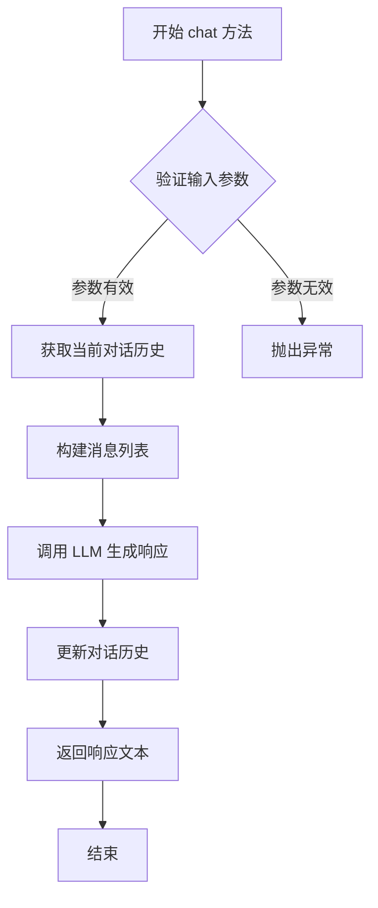

#### 带注释源码

```python
# 以下为 ChatHaruhi.chat 方法的调用示例源码

# 1. 创建 ChatHaruhi 实例（需要先导入 chatharuhi 模块）
from chatharuhi import ChatHaruhi

# 2. 配置角色参数
haruhi_path = './content/Haruhi-2-Dev'
db_folder = f"{haruhi_path}/characters/{ai_role_en}/content/{ai_role_en}"
system_prompt = f"{haruhi_path}/characters/{ai_role_en}/content/system_prompt.txt"

# 3. 初始化 chatbot 对象
chatbot = ChatHaruhi(
    system_prompt=system_prompt,
    llm="openai",
    story_db=db_folder,
    verbose=True
)

# 4. 设置对话温度参数（控制随机性，0 为确定性输出）
chatbot.llm.chat.temperature = 0

# 5. 清空对话历史并初始化
chatbot.dialogue_history = []
chatbot.dialogue_history.append((
    "你好，我即将对你进行一项心理人格测试，你必须配合。请你用中文回答如实我的问题。",
    "好，请开始吧，我将配合你进行这项心理测试。"
))

# 6. 调用 chat 方法进行对话
# 参数 role: 说话者角色名称
# 参数 text: 说话者发送的文本内容
response = chatbot.chat(role=tester_name, text=question)

# 7. 处理返回的响应
print(response)
```

#### 相关调用上下文

```python
# 在主循环中的完整调用流程
for target, question_id in tqdm(query_list):
    # ... 前置处理代码 ...
    
    # 创建 chatbot 实例
    chatbot = ai_roles_obj[en_name]
    
    # 重置对话历史
    chatbot.dialogue_history = []
    chatbot.dialogue_history.append(("你好，我即将对你进行一项心理人格测试，你必须配合。请你用中文回答如实我的问题。", "好，请开始吧，我将配合你进行这项心理测试。")) 

    # 获取问题数据
    data = datas[question_id]
    question = data['chinese']
    tester_name = tester[target]

    # 第一次调用 chat 方法 - 获取开放式回答
    response_1 = chatbot.chat(role=tester_name, text=question)
    
    # 第二次调用 chat 方法 - 获取封闭式回答
    closed_prompt = f"嗯，那对于'{data['chinese']}'这个问题，请你从['完全同意', '基本同意', '部分同意', '既不同意也不否认', '不太同意', '基本不同意', '完全不同意']中选择一个适合你的选项。请务必用中文回答，并用单引号强调你的选项。"
    response_2 = chatbot.chat(role=tester_name, text=closed_prompt)
```

#### 注意事项

1. **外部依赖**：该方法属于 `chatharuhi` 库的 `ChatHaruhi` 类，源代码未在当前文件中给出
2. **对话状态管理**：每次调用 `chat` 方法会自动更新 `dialogue_history`，如需重新开始对话需手动重置
3. **LLM 配置**：需要在环境中正确设置 `OPENAI_API_KEY` 环境变量
4. **角色匹配**：传入的 `role` 参数应与初始化时的角色定义匹配，否则可能导致角色扮演效果不佳


# chatbot.dialogue_history 对话历史管理

### chatbot.dialogue_history

该属性属于 ChatHaruhi 类，用于管理聊天机器人的对话历史记录。它以列表形式存储对话内容，列表中的每个元素是一个元组，包含角色名和对应的对话文本，用于维护对话上下文和状态。

参数：无（作为类属性直接访问）

返回值：`list`，返回对话历史列表

#### 流程图

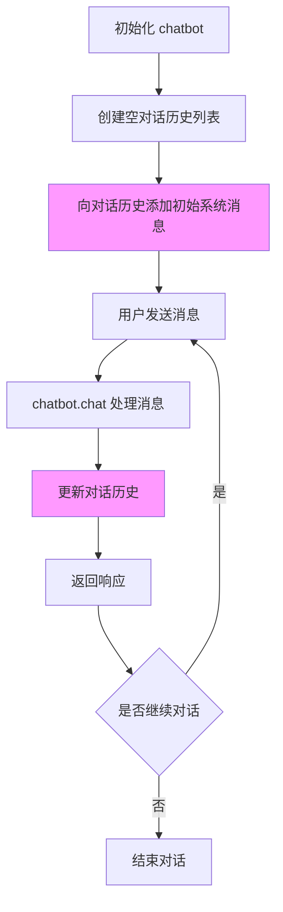

#### 带注释源码

```python
# 在代码中的使用位置（约第188-189行）

# 1. 初始化对话历史为空列表
#    - 作用：重置对话历史，确保每次测试从干净的状态开始
chatbot.dialogue_history = []

# 2. 添加初始系统消息到对话历史
#    - 作用：设置测试场景，告知角色即将进行心理测试
#    - 参数1：系统/测试者的初始发言
#    - 参数2：AI角色的确认回复
#    - 数据结构：元组 (role_message, assistant_message)
chatbot.dialogue_history.append(
    ("你好，我即将对你进行一项心理人格测试，你必须配合。请你用中文回答如实我的问题。", 
     "好，请开始吧，我将配合你进行这项心理测试。")
) 

# 后续在 chatbot.chat() 调用时
# 对话历史会自动更新，追加新的对话记录
# 格式保持为 (role, text) 元组的形式
```

#### 关键信息总结

| 属性 | 类型 | 描述 |
|------|------|------|
| `dialogue_history` | `list` | 存储对话历史的列表，包含 (角色, 消息) 元组 |

#### 技术债务与优化空间

1. **硬编码初始对话**：初始系统消息直接硬编码在代码中，建议提取为配置文件
2. **缺乏长度控制**：对话历史无限增长，可能导致内存问题，建议实现最大长度限制或历史截断策略
3. **状态持久性缺失**：对话历史仅存在于内存中，程序结束后丢失，无法进行历史回溯或断点续传
4. **错误处理缺失**：未对对话历史的异常情况（如非元组格式、None值等）进行处理


### `tqdm(iterable)`

这是从 `tqdm` 库导入的进度条显示函数，用于在迭代过程中显示进度条，提供视觉反馈。

参数：

-  `iterable`：`iterable`，要迭代的可迭代对象，可选。如果为 None，则返回可迭代的进度条包装器

返回值：`iterator`，返回包装了进度条的迭代器

#### 流程图

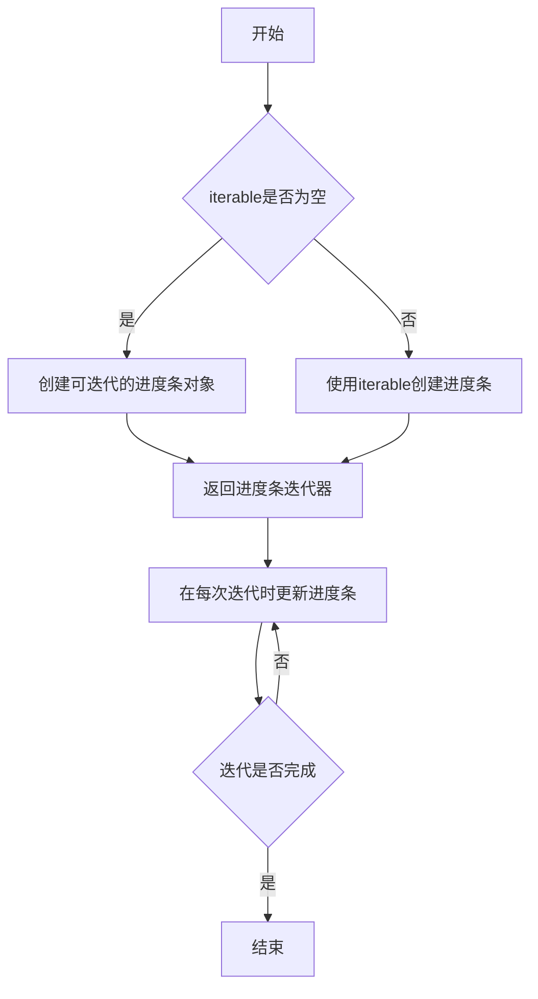

#### 带注释源码

```python
# tqdm 源码位于 https://github.com/tqdm/tqdm/blob/master/tqdm/std.py
# 以下为简化版注释说明

def tqdm(iterable=None, desc=None, total=None, leave=True, 
         file=None, ncols=None, mininterval=0.1, maxinterval=10.0,
         miniters=None, unit='it', unit_scale=False, dynamic_ncols=False,
         smoothing=0.3, bar_format=None, initial=0, position=None,
         postfix=None, unit_divisor=1000, write_bytes=False, lock_args=None,
         nrows=None, colour=None, delay=0, gui=False, **kwargs):
    """
    进度条显示函数
    
    参数说明:
    - iterable: 要迭代的可迭代对象
    - desc: 进度条描述字符串
    - total: 总迭代次数
    - leave: 迭代完成后是否保留进度条
    - file: 输出位置
    - ncols: 进度条宽度
    - mininterval: 最小更新间隔(秒)
    - maxinterval: 最大更新间隔(秒)
    - miniters: 最小迭代次数后更新
    - unit: 单位名称
    - unit_scale: 是否缩放单位
    - smoothing: 平滑因子
    - bar_format: 进度条格式
    - initial: 初始值
    - position: 多行位置
    - postfix: 后缀字典
    """
    
    # 创建进度条对象
    # 如果提供了 iterable，则直接包装它
    # 如果没有提供，则返回一个可迭代的包装器
    return _tqdm(*args, **kwargs)


# 在代码中的实际使用:
# for target, question_id in tqdm(query_list):
#     循环体，会显示当前进度
```

#### 实际代码中的调用方式

```python
from tqdm import tqdm

# 在代码中使用
for target, question_id in tqdm(query_list):
    # query_list 是固执角色列表
    # tqdm 会显示当前正在处理第几个角色
    if count < len(previous_response):
        count = count + 1
        if_first = False
        continue
    
    # ... 后续处理逻辑
```

#### 注意事项

- `tqdm` 是第三方库，需要先安装：`pip install tqdm`
- 在代码中用于显示角色问答测试的进度
- 参数 `query_list` 包含 10 个固执角色和多个问题的组合
- 进度条会在每次迭代时更新，帮助了解程序执行状态


### `json.dump(obj, f, ensure_ascii)`

该函数是Python标准库中的JSON序列化函数，用于将Python对象序列化为JSON格式并写入文件对象。在本代码中用于将心理测试结果字典序列化为JSON行格式写入文件。

参数：

- `obj`：`dict`，要序列化的Python对象（在本代码中为包含id、question、response_open、response_closed、factor、test_role字段的字典）
- `f`：`file object`，已打开的文件对象，用于写入JSON数据
- `ensure_ascii`：`bool`，是否将非ASCII字符转义为Unicode转义序列（本代码中设置为`False`，保留中文字符原样输出）

返回值：`None`，该函数直接写入文件，不返回任何值

#### 流程图

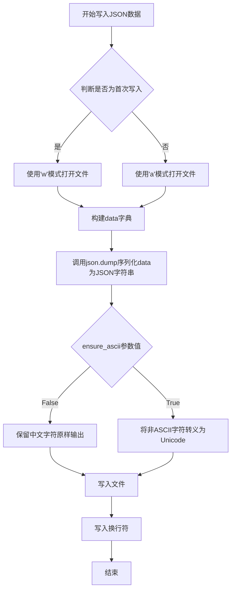

#### 带注释源码

```python
# 构建待序列化的数据字典
data = {
    'id': data['id'],                    # 题目ID
    'question': data['chinese'],          # 中文问题内容
    'response_open': response_1,          # 开放式回答
    'response_closed': response_2,        # 封闭式选择题回答
    'factor': data['type'],               # MBTI因子类型
    'test_role': tester_name              # 测试者角色名称
}

# 根据是否为首次写入决定文件打开模式
file_mode = 'w' if if_first else 'a'

# 更新首次写入标志
if_first = False

# 打开文件并写入JSON数据
with open(save_name, file_mode, encoding='utf-8') as f:
    # 调用json.dump进行序列化
    # obj: 要序列化的字典对象
    # f: 文件对象
    # ensure_ascii=False: 保留中文字符，不进行Unicode转义
    json.dump(data, f, ensure_ascii=False)
    
    # 写入换行符以形成JSONL格式（每行一个JSON对象）
    f.write('\n')
```

---

### 潜在的技术债务或优化空间

1. **错误处理缺失**：代码中未对`json.dump`的写入异常进行捕获，若磁盘空间不足或权限问题导致写入失败，程序会直接崩溃
2. **数据一致性风险**：`if_first`标志的逻辑与文件打开操作分离，中间可能发生状态不一致
3. **批量写入优化**：当前每条记录单独打开关闭文件，效率较低，可考虑批量缓存后统一写入


### ChatHaruhi.chat

该方法是ChatHaruhi库的核心聊天接口，用于与特定角色进行对话交互。它接收说话者角色和文本内容，调用底层语言模型生成符合角色人设的回复，并支持对话历史管理。

参数：

- `role`：`str`，对话中的说话者角色名称（如"张牧之"、"王语嫣"等）
- `text`：`str`，说话者发送的消息内容或问题

返回值：`str`，角色基于其人设和对话上下文生成的回复文本

#### 流程图

```mermaid
graph TD
    A[开始 chat(role, text)] --> B{检查角色对象是否存在}
    B -->|是| C[获取角色对话历史]
    B -->|否| D[抛出异常或返回错误]
    C --> E[将当前消息添加到对话历史]
    E --> F[构建对话上下文]
    F --> G[调用LLM生成回复]
    G --> H[解析LLM返回结果]
    H --> I[将角色回复添加到对话历史]
    I --> J[返回回复文本]
```

#### 带注释源码

```python
# 由于 ChatHaruhi 类来自外部库 chatharuhi，
# 以下是基于代码使用方式和常见聊天机器人模式推断的源码结构

class ChatHaruhi:
    def __init__(self, system_prompt, llm, story_db, verbose=False):
        """
        初始化ChatHaruhi实例
        - system_prompt: 角色系统提示词文件路径
        - llm: 使用的语言模型类型（如"openai"）
        - story_db: 角色故事数据库路径
        - verbose: 是否输出详细日志
        """
        self.system_prompt = system_prompt
        self.llm = llm  # LLM对象，包含chat方法
        self.story_db = story_db
        self.verbose = verbose
        self.dialogue_history = []  # 对话历史记录
    
    def chat(self, role, text):
        """
        与角色进行对话
        
        参数:
            role (str): 说话者角色名称
            text (str): 说话内容
        
        返回:
            str: 角色的回复
        """
        # 1. 将当前用户消息加入对话历史
        self.dialogue_history.append((role, text))
        
        # 2. 构建完整的提示词上下文
        # 包含系统提示、角色背景故事、对话历史
        prompt = self._build_prompt(role, text)
        
        # 3. 调用底层LLM生成回复
        if hasattr(self.llm, 'chat'):
            response = self.llm.chat(prompt)
        else:
            response = self.llm(prompt)
        
        # 4. 将角色回复加入对话历史
        # 这里的role是AI角色的英文名
        ai_role = self._get_ai_role_name()
        self.dialogue_history.append((ai_role, response))
        
        # 5. 返回回复内容
        return response
    
    def _build_prompt(self, role, text):
        """构建发送给LLM的完整提示词"""
        # 读取系统提示词
        system_prompt = self._load_system_prompt()
        
        # 构建对话上下文
        context = f"系统提示: {system_prompt}\n\n"
        context += "对话历史:\n"
        for speaker, message in self.dialogue_history:
            context += f"{speaker}: {message}\n"
        
        return context
    
    def _load_system_prompt(self):
        """加载角色系统提示词"""
        # 从system_prompt文件路径读取
        pass
    
    def _get_ai_role_name(self):
        """获取当前AI扮演的角色名称"""
        pass
```

---

## 补充说明

### 1. 核心功能概述

该代码实现了一个基于角色人设的多角色聊天系统，通过`ChatHaruhi`类加载不同角色的系统提示词和故事数据库，使用OpenAI GPT模型生成符合角色性格特征的对话响应。

### 2. 文件整体运行流程

1. 读取`mbti_questions.jsonl`中的心理测试问题
2. 初始化OpenAI API配置
3. 解压并加载多个角色的配置文件到`ai_roles_obj`字典
4. 遍历顽固角色列表和所有问题，构造查询任务
5. 对每个任务重置对话历史，插入初始引导语
6. 调用`chatbot.chat(role, text)`进行开放式问答
7. 再次调用`chat(role, text)`进行封闭式选择题
8. 将结果保存到`mbti_results_stubborn.jsonl`

### 3. 关键组件信息

| 组件名称 | 一句话描述 |
|---------|-----------|
| `ChatHaruhi` | 角色聊天机器人核心类，封装LLM调用和角色人设管理 |
| `ai_roles_obj` | 存储所有已加载角色实例的字典 |
| `NAME_DICT` | 中文角色名到英文名的映射 |
| `tester` | 每个角色对应的测试者角色映射 |
| `dialogue_history` | 管理当前对话轮次的上下文历史 |

### 4. 潜在技术债务与优化空间

- **硬编码API Key**：API密钥直接写在代码中，应使用环境变量或密钥管理服务
- **缺少错误处理**：文件读取、网络请求、LLM调用缺乏完善的异常捕获机制
- **重复初始化**：每次循环都重新创建`chatbot`对象，应在循环外初始化
- **对话历史管理**：未设置最大历史长度限制，可能导致上下文溢出
- **文件I/O效率**：每条结果单独写入文件，应批量写入或使用事务

### 5. 外部依赖与接口契约

- **依赖库**：`openai`、`chatharuhi`、`json`、`zipfile`、`tqdm`
- **外部服务**：OpenAI GPT API（需要有效API Key）
- **数据文件**：角色ZIP包、`mbti_questions.jsonl`、系统提示词文件


### `ChatHaruhi.chat.temperature`

该属性用于控制聊天模型生成回复的随机性，值越低生成结果越确定性，值越高随机性越强。在代码中通过 `llm.chat.temperature` 进行访问和设置。

参数：无（属性访问，不涉及方法参数）

返回值：`float`，返回当前设置的温度值（0.0-2.0之间的浮点数）

#### 流程图

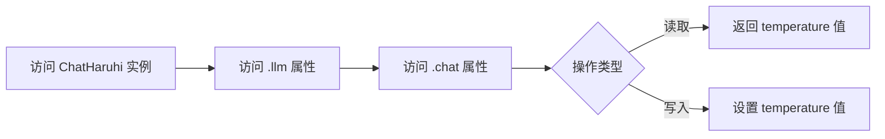

#### 带注释源码

```python
# 在代码中的实际使用方式
# ai_roles_obj[key] 是 ChatHaruhi 的实例
# .llm 是 ChatHaruhi 的语言模型接口
# .chat 是 llm 的聊天接口
# .temperature 是用于控制随机性的属性

# 设置温度为 0（低随机性，更确定性）
for key in ai_roles_obj.keys():
    ai_roles_obj[key].llm.chat.temperature = 0
```

#### 补充说明

由于 `ChatHaruhi` 类是从外部库 `chatharuhi` 导入的，其内部实现细节（`llm` 和 `chat` 对象的定义）未在当前代码文件中展示。上述分析基于代码中的使用模式进行推断。从使用方式来看，`temperature` 属性直接映射到 OpenAI API 的 `temperature` 参数，用于控制生成文本的多样性。常见的取值范围为 0.0 到 2.0，默认值通常为 0.7 或 1.0。


## 关键组件


### 数据读取模块

从mbti_questions.jsonl文件中读取MBTI测试问题数据，每行包含问题的中文版本、英文版本、ID和性格类型因子。

### OpenAI环境配置

设置OpenAI API密钥环境变量，用于后续调用ChatHaruhi的LLM接口。

### ChatHaruhi角色加载器

从ZIP压缩包中提取并初始化多个AI角色（包括《哈利波特》、《武林外传》、《原神》等角色），创建对应的ChatHaruhi实例并配置向量数据库和系统提示词。

### 角色-测试者映射表

定义每个AI角色对应的测试者名称，用于模拟对话场景。

### 顽固角色列表

指定需要进行MBTI测试的AI角色子集，包括Dumbledore、Malfoy、王语嫣等角色。

### 对话历史初始化模块

为每个角色设置初始对话："你好，我即将对你进行一项心理人格测试，你必须配合。请你用中文回答如实我的问题。"，建立测试场景。

### 开放式问答模块

调用chatbot.chat方法让AI角色以开放式方式回答MBTI问题，获取自然语言回答。

### 封闭式强制选择模块

通过closed_prompt强制AI角色从7个固定选项（完全同意、基本同意、部分同意、既不同意也不否认、不太同意、基本不同意、完全不同意）中选择一个，并要求用单引号强调。

### 选项解析器

从AI角色的回答中提取匹配的选项，使用列表推导式检查回答是否包含预定义选项。

### 结果持久化模块

将测试结果（问题ID、问题内容、开放式回答、封闭式回答、性格因子、测试者）以JSON格式写入mbti_results_stubborn.jsonl文件，支持增量追加。

### 进度恢复机制

通过检查已存在的保存文件，实现测试中断后的断点续传功能，避免重复测试。


## 问题及建议


### 已知问题

1. **API密钥硬编码风险**：第24行将API密钥直接硬编码在代码中 (`os.environ["OPENAI_API_KEY"] = "sk-"`)，存在严重安全隐患
2. **文件IO效率低下**：在循环中每处理一条数据就打开关闭文件（第152-167行），应使用批量写入或上下文管理器优化
3. **进度计数逻辑错误**：第126-132行使用 `count < len(previous_response)` 判断是否跳过，但循环中 `count` 始终为0，因为没有在循环内递增，导致无法正确恢复进度
4. **chatbot重复创建**：在第138行每次循环都重新创建 `chatbot` 实例，应该在循环外按角色创建一次并复用
5. **异常处理不完善**：第149-152行检测到空答案时仅打印日志，没有恢复机制，可能导致数据丢失
6. **路径硬编码**：多处使用硬编码路径（如第21行 `input_name`，第33行 `haruhi_path`），缺乏配置管理
7. **重复数据结构定义**：`NAME_DICT` 和 `tester` 字典中部分角色信息可能重复或不一致
8. **未使用的导入**：第10行导入 `pdb` 但未在正式逻辑中使用
9. **魔法命令残留**：第27-32行包含已注释的IPython魔法命令（`%cd`、`%pwd`），影响代码可读性
10. **对话历史未持久化**：每次运行从头开始，没有保存/加载对话历史的机制
11. **循环中重置对话历史**：第141行在每次问题迭代时重置 `dialogue_history`，导致同一角色的多个问题没有上下文连贯性
12. **变量命名不一致**：第123行 `if_first` 使用驼峰命名，而其他变量使用下划线命名
13. **代码注释缺失**：关键逻辑（如第145-148行的封闭问题处理）缺乏详细注释

### 优化建议

1. 将API密钥和敏感配置移至环境变量文件或配置中心，避免硬编码
2. 使用 `with` 语句批量写入结果，或在内存中累积结果后一次性写入
3. 修复进度恢复逻辑：`count = len(previous_response)` 后直接使用 `enumerate` 跳过已处理项
4. 按角色分组创建chatbot实例，在循环外初始化并维护角色到chatbot的映射
5. 为空答案情况添加重试机制或降级处理，记录到错误日志文件
6. 引入配置类或YAML/JSON配置文件集中管理路径参数
7. 提取角色信息为独立数据文件，避免多處定义导致不一致
8. 清理未使用的导入和注释掉的代码
9. 使用Python标准日志模块（`logging`）替代print语句进行调试和错误记录
10. 考虑在角色级别保持对话历史连续性，或提供状态持久化选项
11. 统一代码风格，遵循PEP8命名规范
12. 添加类型注解提升代码可维护性和IDE支持
13. 将JSONL数据读取改为流式处理，避免大数据量时内存溢出
14. 使用 `tqdm` 的正确方式：`for item in tqdm(list)` 而非手动计数


## 其它


### 设计目标与约束

本项目旨在利用ChatHaruhi角色扮演框架，对预定义的多个AI角色进行MBTI心理人格测试，评估不同角色在心理测试场景下的响应特征。约束条件包括：仅支持中文问题回答，使用OpenAI API作为底层语言模型，需通过环境变量配置API密钥，每个角色使用固定的测试者名称进行对话交互。

### 错误处理与异常设计

代码采用多层错误处理机制。在文件读取阶段，使用try-except结构捕获json.loads()可能引发的JSON解析异常；当API调用失败时，通过response内容检查判断是否为意外发生的情况，使用pdb.set_trace()进行调试；文件写入操作采用追加模式避免数据丢失；对于缺失的ZIP文件，使用os.path.exists()预先检查并打印警告信息后continue跳过，确保批量处理不会因单个角色失败而中断。

### 数据流与状态机

数据流遵循以下顺序：首先从mbti_questions.jsonl加载问题数据到datas列表；然后遍历stubborn_characters列表中的每个目标角色，对每个角色的每个问题生成查询任务；主循环中依次执行：加载角色ChatHaruhi实例→重置对话历史→添加初始引导语→发送开放性问题→发送封闭式选项选择提示→解析选项→写入JSONL结果文件。状态转换包括：初始化状态→对话中状态→结果保存状态，支持断点续传通过previous_response长度判断已处理任务数量。

### 外部依赖与接口契约

核心依赖包括：openai库用于API调用（需配置OPENAI_API_KEY环境变量），ChatHaruhi类来自chatharuhi包提供角色扮演对话能力，json库用于数据序列化，tqdm库提供进度条显示，os库处理文件系统操作。接口契约方面：ChatHaruhi构造函数接受system_prompt、llm、story_db、verbose参数，chat方法接受role和text参数返回字符串响应；文件格式要求input为JSONL每行包含id、chinese、type字段，output为JSONL每行包含id、question、response_open、response_closed、factor、test_role字段。

### 性能考虑与优化空间

当前实现采用串行处理方式，每个角色问题组合顺序执行。优化空间包括：引入异步并发处理多个API请求以提高吞吐量；使用连接池复用OpenAI连接减少开销；对于已处理的查询可以采用缓存机制避免重复调用；将tqdm进度条从for循环内部移至主循环以获得更准确的总体进度预估。代码中已实现断点续传功能，通过检查save_name文件是否存在并读取previous_response来跳过已处理任务，这对长时间运行的批量任务尤为重要。

### 安全性考虑

API密钥采用环境变量os.environ["OPENAI_API_KEY"]存储，避免硬编码在代码中；虽然当前代码中密钥以sk-开头显式设置，但实际部署时应从环境变量读取；文件操作使用相对路径，部署时需注意工作目录配置；输出文件包含对话内容，需注意隐私保护。

### 配置管理

角色名称映射通过NAME_DICT字典集中管理，中文名到英文简写的映射便于扩展；测试者映射通过tester字典定义每个角色的对应测试者；固执角色列表stubborn_characters单独定义，便于调整测试范围；文件路径配置包括haruhi_path、db_folder、system_prompt等均采用变量统一管理。

### 持久化机制

采用JSONL格式进行持久化存储，每条记录为独立JSON行便于流式读取和追加。输出文件mbti_results_stubborn.jsonl包含完整的测试问答记录，支持断点续传通过判断文件是否存在并读取已有记录数来实现。文件模式根据if_first标志在首次写入时用'w'模式，后续使用'a'模式追加。

### 并发处理

当前为单线程顺序执行，未使用多线程或多进程。对于API调用的网络延迟，理论上可引入asyncio或concurrent.futures实现并发，但需注意OpenAI API的速率限制。进度追踪使用tqdm库实现可视化进度显示。

### 日志记录

代码使用print语句进行关键节点日志输出，包括：ZIP文件缺失警告、处理结果打印、意外情况提示。调试时可启用pdb.set_trace()进行交互式调试。生产环境建议替换为标准logging模块实现分级日志管理。

    