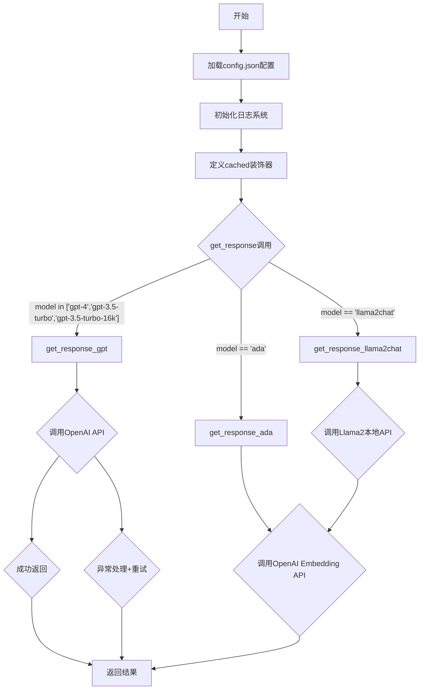
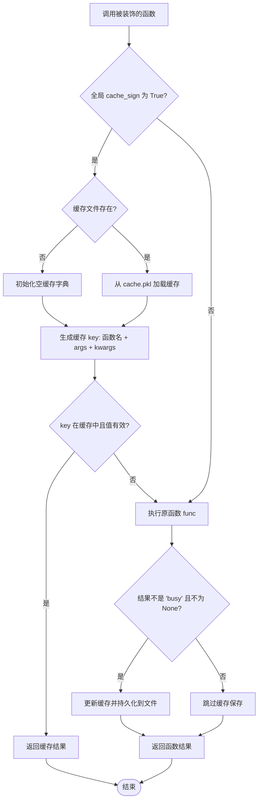
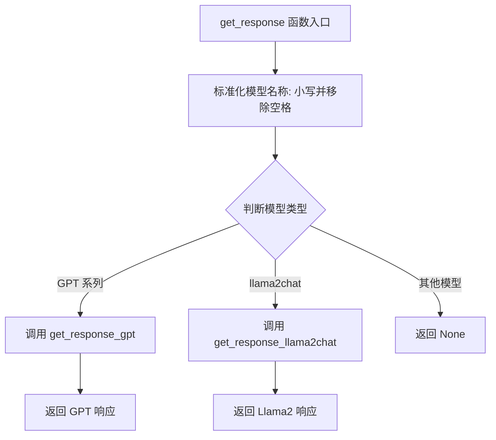

# `Chat-Haruhi-Suzumiya\research\personality\raw_code\utils.py` 详细设计文档

该代码实现了一个统一的语言模型API封装层，支持GPT系列模型（gpt-4、gpt-3.5-turbo）和Llama2聊天模型的调用，并提供了文本嵌入（ada-002）功能，同时集成了基于pickle的本地缓存机制和重试逻辑，支持通过配置文件设置代理和API端点。

## 整体流程



## 类结构

```
模块级配置与工具
├── 全局变量 (config, cache, cache_sign, logger)
├── 装饰器 (cached)
└── 函数集合
    ├── get_response (路由分发)
    ├── get_response_ada (嵌入生成)
    ├── get_response_llama2chat (Llama2对话)
    └── get_response_gpt (GPT对话)
```

## 全局变量及字段


### `logger`
    
日志记录器实例，用于记录程序运行过程中的信息、警告和错误

类型：`Logger`
    


### `file_handler`
    
文件日志处理器，将日志写入到log.log文件中，支持UTF-8编码

类型：`FileHandler`
    


### `console_handler`
    
控制台日志处理器，将日志输出到标准输出流（终端）

类型：`StreamHandler`
    


### `formatter`
    
日志格式器，定义了日志消息的输出格式，包含时间、名称、级别和消息内容

类型：`Formatter`
    


### `cache_sign`
    
缓存开关标志，控制是否启用函数结果缓存功能，True表示启用

类型：`bool`
    


### `config`
    
从config.json文件加载的配置字典，包含代理、API密钥、API基础地址等配置项

类型：`dict`
    


### `cache`
    
运行时缓存字典，用于存储函数调用结果以避免重复计算，初始化时为None

类型：`dict|None`
    


    

## 全局函数及方法


### `cached`

基于 pickle 的函数结果缓存装饰器，通过将函数调用结果序列化存储到本地文件，实现相同参数函数的快速返回，避免重复计算或 API 调用。

#### 参数

- `func`：`function`，需要被装饰的原始函数

#### 返回值

- `wrapper`：`function`，装饰后的函数闭包，包含缓存逻辑

#### 流程图



#### 带注释源码

```python
def cached(func):
    """
    基于 pickle 的函数结果缓存装饰器
    将函数调用结果序列化存储到本地文件，相同参数调用直接返回缓存
    """
    def wrapper(*args, **kwargs):
        global cache  # 声明使用全局变量 cache
        cache_path = './cache.pkl'  # 缓存文件路径
        
        # 初始化缓存：如果 cache 为 None，则尝试加载或创建缓存
        if cache == None:
            if not os.path.exists(cache_path):
                cache = {}  # 缓存文件不存在，创建空字典
            else:
                # 从 pickle 文件加载已有缓存
                cache = pickle.load(open(cache_path, 'rb'))  

        # 生成缓存键：使用函数名、位置参数、关键字参数组合唯一标识
        key = ( func.__name__, str(args), str(kwargs.items()))
        
        # 检查缓存是否命中且结果有效（非 None 且非 '[TOKEN LIMIT]'）
        if cache_sign and key in cache and cache[key] not in [None, '[TOKEN LIMIT]']:
            return cache[key]  # 直接返回缓存结果
        else:
            # 执行原函数获取结果
            result = func(*args, **kwargs)
            
            # 如果结果有效（不是繁忙标记或空值），则缓存并持久化
            if result != 'busy' and result != None:
                cache[key] = result
                # 将更新后的缓存字典序列化写入文件
                pickle.dump(cache, open(cache_path, 'wb'))
            
            return result  # 返回函数执行结果

    return wrapper  # 返回装饰后的函数
```


### `get_response`

路由分发函数：根据模型名称选择对应的响应获取函数，将请求分发到 GPT 系列模型或 Llama2 聊天模型的响应获取函数。

参数：

- `sys_prompt`：`str`，系统提示词，用于指导模型行为
- `inputs`：`str`，用户输入内容
- `model`：`str`，模型名称，默认为 `'gpt4'`

返回值：`str`，返回对应模型生成的响应内容

#### 流程图



#### 带注释源码

```python
def get_response(sys_prompt, inputs, model='gpt4'):
    """
    路由分发函数，根据模型名称选择对应的响应获取函数
    
    参数:
        sys_prompt: 系统提示词
        inputs: 用户输入
        model: 模型名称，默认为 'gpt4'
    
    返回:
        对应模型生成的响应内容字符串
    """
    # 标准化模型名称：转小写并移除空格
    model = model.lower().replace(' ', '')

    # 根据模型类型分发到不同的响应获取函数
    if model in ['gpt-4', 'gpt-3.5-turbo', 'gpt-3.5-turbo-16k']:
        # GPT 系列模型
        return get_response_gpt(sys_prompt, inputs, model)
    elif model == 'llama2chat':
        # Llama2 聊天模型
        return get_response_llama2chat(sys_prompt, inputs)
    
    # 注意：此处缺少对其他模型的默认处理（如 ada 嵌入模型未被处理）
    # 若模型不匹配任何已知类型，函数隐式返回 None
```

---

## 补充信息

### 关键组件信息

| 组件名称 | 一句话描述 |
|---------|-----------|
| `get_response` | 路由分发函数，根据模型名称选择对应的响应获取函数 |
| `get_response_gpt` | 调用 OpenAI ChatCompletion API 获取 GPT 系列模型响应 |
| `get_response_llama2chat` | 调用本地 Llama2 服务获取聊天响应 |
| `get_response_ada` | 调用 OpenAI Embedding API 获取文本嵌入向量 |
| `cached` | 装饰器，实现函数结果缓存机制 |
| `config` | 全局配置对象，从 config.json 加载 |
| `logger` | 日志记录器，记录程序运行信息 |

### 潜在的技术债务或优化空间

1. **路由不完整**：函数只处理了 GPT 系列和 llama2chat 模型，但代码中存在 `get_response_ada` 函数却未被路由调用
2. **隐式返回 None**：当模型名称不匹配时，函数没有明确处理，隐式返回 `None`，缺乏错误提示
3. **模型名称匹配硬编码**：支持的模型列表硬编码在 if 条件中，可考虑配置化或使用字典映射
4. **重试逻辑不一致**：`get_response_llama2chat` 调用了错误的重试函数 `get_response_llama2`（该函数不存在）

### 设计目标与约束

- **设计目标**：统一入口，根据模型类型动态选择响应获取函数
- **约束**：依赖外部 API 服务（OpenAI API 和本地 Llama2 服务）

### 错误处理与异常设计

- 当前函数本身不直接处理异常，异常由底层响应获取函数处理
- 底层函数均包含 try-except 块和重试机制

### 外部依赖与接口契约

| 依赖项 | 用途 |
|-------|------|
| `openai` 库 | 调用 OpenAI API |
| `requests` 库 | 调用本地 Llama2 服务 |
| `config.json` | 存储 API 密钥、服务地址等配置 |


### `get_response_ada`

这是一个嵌入获取函数，利用 OpenAI 的 `text-embedding-ada-002` 模型将输入文本转换为向量表示。该函数使用了 `@cached` 装饰器来实现结果缓存，以减少重复的 API 调用。函数内部包含了异常处理机制，当 API 调用失败时会记录日志并返回 `None`。

参数：

- `inputs`：`str` 或 `List[str]`，需要转换为嵌入向量的文本输入。OpenAI API 支持单个字符串或字符串数组。

返回值：`list` 或 `None`，返回文本对应的嵌入向量（浮点数数组）；如果发生错误或异常则返回 `None`。

#### 流程图

```mermaid
graph TD
    A([Start get_response_ada]) --> B[调用 openai.Embedding.create]
    B --> C{API 调用成功?}
    C -->|是| D[解析响应: response['data'][0]['embedding']]
    D --> E[返回嵌入向量列表]
    C -->|否| F[捕获异常 Exception]
    F --> G[记录日志: logger.exception(e)]
    G --> H[返回 None]
```

#### 带注释源码

```python
@cached  # 应用缓存装饰器，若输入已处理则直接返回缓存结果
def get_response_ada(inputs):
    """
    调用 OpenAI ADA-002 模型生成文本嵌入向量。
    
    参数:
        inputs (str or list): 要嵌入的文本。
        
    返回:
        list or None: 嵌入向量列表，失败返回 None。
    """
    try: 
        # 调用 OpenAI Embedding 接口创建嵌入
        response = openai.Embedding.create(
            api_key=config['openai_apikey'], # 从配置中获取 API Key
            input= inputs,                   # 输入文本
            model="text-embedding-ada-002"  # 指定的模型版本
        )
        # 从响应体中提取 embedding 数据
        embeddings = response['data'][0]['embedding']
        return embeddings 
    
    except Exception as e:
        # 捕获未知异常，记录错误日志
        logger.exception(e)
        return None
```


### `get_response_llama2chat`

该函数是一个调用本地Llama2聊天API的对话函数，通过向本地部署的Llama2服务发送POST请求，传入系统提示和用户输入，构建消息列表后获取模型响应，并包含重试机制以处理临时性错误。

参数：

- `sys_prompt`：`str`，系统提示词，用于设定AI助手的角色和行为方式
- `inputs`：`str`，用户输入内容，即需要发送给Llama2模型处理的问题或指令
- `retry_count`：`int`，重试计数器（默认值为0），用于追踪当前重试次数

返回值：`str`，返回Llama2模型生成的响应内容

#### 流程图

```mermaid
flowchart TD
    A[开始 get_response_llama2chat] --> B[构建查询消息列表]
    B --> C[包含system角色和user角色]
    C --> D{发送POST请求}
    D -->|成功| E[获取响应内容 response['ans']]
    E --> F[记录输入日志]
    F --> G[记录输出日志]
    G --> H[返回response]
    
    D -->|异常| I{检查retry_count < 2}
    I -->|是| J[等待5秒]
    J --> K[记录重试警告日志]
    K --> L[retry_count + 1]
    L --> A
    
    I -->|否| M[打印失败消息]
    M --> N[结束/返回None]
    
    style H fill:#90EE90
    style N fill:#FFB6C1
```

#### 带注释源码

```python
@cached  # 使用缓存装饰器，避免重复请求相同输入
def get_response_llama2chat(sys_prompt, inputs, retry_count=0):
    """
    Llama2对话函数：调用本地Llama2聊天API并返回响应
    
    Args:
        sys_prompt: 系统提示词
        inputs: 用户输入
        retry_count: 重试次数计数器
    
    Returns:
        str: 模型响应内容，失败时可能返回None
    """
    # 构建符合OpenAI格式的消息列表，包含system和user两个角色
    query = [ 
        {'role': 'system', 'content': sys_prompt}, 
        {'role': 'user', 'content': inputs} 
    ]

    try:
        # 向本地Llama2服务发送POST请求
        # config["llama_port"] 配置了本地API的端口
        response = requests.post(
            f'{config["llama_port"]}/chat', 
            json={'query': query}
        ).json()['ans']  # 从返回的JSON中提取答案字段
        
        # 记录输入日志，便于调试和追踪
        logger.info('LLAMA 2 Input:  ' + inputs)
        # 记录输出日志，便于调试和追踪
        logger.info('LLAMA 2 Output: ' + response)
        # 返回模型生成的响应内容
        return response

    except Exception as e:
        # 捕获所有未知异常并记录日志
        logger.exception(e)

        # 检查是否还可以重试（最多重试2次）
        if retry_count < 2:
            # 等待5秒后重试，避免频繁请求
            time.sleep(5)
            # 记录重试警告日志
            logger.warn("[LLAMA 2] RateLimit exceed, 第{}次重试".format(retry_count+1))
            # 递归调用自身进行重试（注意：此处调用了错误的函数名get_response_llama2）
            return get_response_llama2(sys_prompt, inputs, retry_count+1) 

        # 超过重试次数，打印失败消息
        print(f'Fail to get response after {retry_count} retry')
```


### `get_response_gpt`

该函数是GPT对话的核心实现，通过调用OpenAI ChatCompletion API与GPT模型进行交互，支持系统提示词和用户输入的组合查询，具备自动重试机制以应对限流错误，并使用缓存装饰器避免重复请求。

**参数：**

- `sys_prompt`：`str`，系统提示词，用于设定GPT的角色和行为
- `inputs`：`str`，用户输入内容，作为对话的用户消息
- `model`：`str`，可选参数，默认为`'gpt-4'，指定使用的GPT模型（如gpt-4、gpt-3.5-turbo等）
- `retry_count`：`int`，可选参数，默认为`0`，用于内部递归重试计数

**返回值：** `str`，返回GPT模型生成的回复内容；若遇到令牌限制错误返回`'[TOKEN LIMIT]'`；若所有重试失败返回`None`

#### 流程图

```mermaid
flowchart TD
    A[开始 get_response_gpt] --> B{检查缓存}
    B -->|命中缓存| C[返回缓存结果]
    B -->|未命中| D[构建查询消息列表]
    D --> E[添加系统提示词]
    E --> F{inputs长度>0?}
    F -->|是| G[添加用户消息]
    F -->|否| H[仅保留系统消息]
    G --> I
    H --> I[调用OpenAI ChatCompletion API]
    I --> J{是否抛出InvalidRequestError?}
    J -->|是| K[记录异常并返回 '[TOKEN LIMIT]']
    J -->|否| L{是否有其他异常?}
    L -->|是| M{retry_count < 2?}
    M -->|是| N[等待5秒]
    N --> O[递归调用get_response_gpt, retry_count+1]
    O --> I
    M -->|否| P[打印失败信息并返回None]
    L -->|否| Q[提取回复内容]
    Q --> R[记录日志]
    R --> S[更新缓存]
    S --> T[返回回复内容]
    K --> S
    
    style C fill:#90EE90
    style K fill:#FFB6C1
    style P fill:#FFB6C1
    style T fill:#90EE90
```

#### 带注释源码

```python
@cached  # 使用缓存装饰器，避免重复请求
def get_response_gpt(sys_prompt, inputs, model='gpt-4', retry_count=0):
    """
    调用OpenAI ChatGPT API并返回响应
    
    参数:
        sys_prompt: 系统提示词
        inputs: 用户输入
        model: 使用的模型名称
        retry_count: 重试次数计数器
    
    返回:
        GPT的回复内容字符串，或特殊标记
    """
    
    # 构建消息列表：首先添加系统提示词
    query = [ {'role': 'system', 'content': sys_prompt}]
    
    # 如果用户有输入内容，则添加用户消息
    if len(inputs) > 0:
        query.append({'role': 'user', 'content': inputs})
    
    try:
        # 记录日志：打印系统提示词和用户输入（截取前100字符）
        logger.info('ChatGPT SysPrompt:  ' + sys_prompt[:100])
        logger.info('ChatGPT Input:  ' + inputs[:100])
        
        # 调用OpenAI ChatCompletion API
        response = openai.ChatCompletion.create(
            api_key=config['openai_apikey'],  # 从配置读取API密钥
            model= model ,  # 对话模型的名称
            messages=query,  # 消息列表
            temperature=0,  # 值在[0,1]之间，越大表示回复越具有不确定性
            top_p=1,  # 核采样参数
            frequency_penalty=0.0,  # [-2,2]之间，该值越大则更倾向于产生不同的内容
            presence_penalty=0.0,  # [-2,2]之间，该值越大则更倾向于产生不同的内容
            request_timeout=300  # 请求超时时间设为300秒
        )
        
        # 记录GPT输出日志（截取前100字符）
        logger.info('GPT Output: ' + response.choices[0]['message']['content'][:100])
        
        # 返回GPT的回复内容
        return response.choices[0]['message']['content']

    # 处理令牌数量超限错误
    except openai.error.InvalidRequestError as e:
        logger.exception(e)
        # 返回特殊标记表示令牌限制
        return '[TOKEN LIMIT]'

    # 处理其他所有异常（API错误、网络超时等）
    except Exception as e:
        # 记录完整的异常堆栈信息
        logger.exception(e)

        # 检查是否还在重试次数限制内（最多重试2次）
        if retry_count < 2:
            # 等待5秒后重试
            time.sleep(5)
            logger.warn("[OPEN_AI] RateLimit exceed, 第{}次重试".format(retry_count+1))
            # 递归调用自身进行重试，递增重试计数器
            return get_response_gpt(sys_prompt, inputs, model, retry_count+1) 

        # 超过重试次数，打印失败信息
        print(f'Fail to get response after {retry_count} retry')
        
        # 返回None表示调用失败
        return None
```

## 关键组件


### 日志系统

负责配置和管理应用程序的日志记录，包括文件输出和控制台输出，支持不同级别的日志记录和格式化。

### 配置管理

从config.json文件加载应用程序配置，包括代理设置、API基础URL和OpenAI API密钥等参数。

### 缓存装饰器

基于pickle的函数结果缓存机制，通过装饰器模式为函数提供结果缓存能力，支持缓存开关控制和持久化存储。

### OpenAI GPT模型交互

与OpenAI GPT系列模型（GPT-4、GPT-3.5-Turbo等）进行API交互，支持聊天完成功能，包含请求重试和错误处理机制。

### Llama2本地模型交互

与本地部署的Llama2聊天模型进行HTTP交互，发送系统提示和用户输入，获取模型生成的响应。

### 嵌入生成

使用OpenAI的text-embedding-ada-002模型生成文本嵌入向量，支持将文本转换为高维向量表示。

### 响应路由

根据模型名称自动选择合适的响应获取函数，实现统一的接口分发逻辑。


## 问题及建议


### 已知问题

- **日志配置重复且不当**：创建了两个console_handler，第二个覆盖了第一个的配置，且第二个未添加到logger；日志格式不一致。
- **缓存实现存在缺陷**：global声明位置错误（应在wrapper函数内），每次调用都dump整个cache效率低下，pickle存在安全风险，缓存键生成使用str()不够健壮。
- **函数调用错误**：get_response_llama2chat函数在重试时调用了未定义的get_response_llama2函数，导致递归失败。
- **资源未正确释放**：使用open()未使用with语句，文件句柄未显式关闭。
- **缺少类型注解**：所有函数和变量均无类型提示，影响可维护性和IDE支持。
- **硬编码配置**：cache路径、日志路径等硬编码，缺乏配置管理。
- **未使用的导入**：nltk和wordnet导入后未使用。
- **retry_count逻辑不统一**：部分函数支持重试但未在所有函数中实现，重试次数限制为2次可能不足。
- **缓存键冲突风险**：使用str(args)作为缓存键，相同参数不同调用方式可能产生冲突。
- **API密钥明文风险**：config中直接存储API密钥，未使用环境变量或密钥管理服务。

### 优化建议

- **重构日志系统**：删除重复的console_handler，使用统一的日志配置，考虑使用logging.config.dictConfig。
- **改进缓存机制**：使用with语句管理文件操作，实现缓存过期机制，考虑使用hashlib生成缓存键，或使用更安全的序列化方式（如json）。
- **修复函数调用**：将重试中的get_response_llama2改为get_response_llama2chat。
- **添加类型注解**：为所有函数参数和返回值添加类型提示。
- **配置文件外置**：将硬编码路径移至config.json，使用环境变量或.env文件管理敏感配置。
- **清理未使用代码**：移除未使用的nltk导入，或实现wordnet相关功能。
- **统一重试逻辑**：提取公共重试装饰器或使用tenacity库；增加重试次数配置化。
- **安全加固**：使用密钥管理服务或环境变量存储API密钥，避免明文存储。

## 其它


### 设计目标与约束

本模块旨在提供一个统一的AI对话和嵌入服务接口，支持多种AI模型（GPT系列、Llama2、Ada嵌入）的调用。核心目标包括：1) 统一不同AI模型的调用入口；2) 通过缓存机制减少重复API调用降低成本；3) 实现失败重试机制提高系统稳定性；4) 支持代理配置以适应不同网络环境。约束条件包括：依赖外部AI服务API（OpenAI、Llama2），需要有效的API密钥，网络可用性要求，以及缓存存储空间限制。

### 错误处理与异常设计

代码采用分层异常处理策略。**第一层**是具体异常捕获：如`openai.error.InvalidRequestError`专门处理token超限情况，返回`'[TOKEN LIMIT]'`标记；**第二层**是通用异常捕获：通过`except Exception as e`捕获所有未知异常并记录日志；**第三层**是重试机制：当发生网络错误或速率限制时，最多重试2次，间隔5秒。异常情况下返回`None`或错误标记，调用方需自行处理。日志记录使用`logger.exception(e)`完整打印堆栈信息，便于问题排查。

### 数据流与状态机

**主数据流**：调用方通过`get_response(sys_prompt, inputs, model)`入口 → 根据model参数分发到对应函数 → `get_response_gpt()`调用OpenAI ChatCompletion API 或 `get_response_llama2chat()`调用本地Llama2服务 或 `get_response_ada()`调用OpenAI Embedding API → 返回结果。

**缓存状态机**：首次调用 → 检查缓存开关`cache_sign` → 计算缓存key → 查询缓存 → 命中则返回缓存结果 → 未命中则调用API → 结果非busy/None则存入缓存并持久化到`cache.pkl`文件。

**重试状态机**：首次调用 → 发生异常 → 检查重试计数<2 → 等待5秒 → 递归调用自身并+1重试计数 → 达到重试上限则放弃。

### 外部依赖与接口契约

**外部依赖**：1) `openai`库 - 调用OpenAI GPT和Embedding服务；2) `requests`库 - 调用本地Llama2服务；3) `nltk`库 - 导入wordnet（代码中未实际使用）；4) `config.json`配置文件 - 存储API密钥、代理、API端点等；5) `cache.pkl`本地缓存文件。

**接口契约**：`get_response()`函数接受三个参数：sys_prompt(str, 系统提示词)、inputs(str, 用户输入)、model(str, 模型名称如'gpt-4')，返回str类型的服务响应。`get_response_ada()`和`get_response_llama2chat()`被`@cached`装饰器包装，支持缓存。配置文件必须包含`openai_apikey`字段，可选包含`proxy`、`openai_apibase`、`llama_port`字段。

### 配置管理

配置通过`config.json`文件集中管理，采用JSON格式。配置加载在模块初始化时执行（`with open('config.json', 'r') as f: config = json.load(f)`）。配置项说明：1) `openai_apikey`（必需）- OpenAI API密钥；2) `proxy`（可选）- 代理服务器地址，配置后自动设置到`openai.proxy`；3) `openai_apibase`（可选）- OpenAI API自定义端点；4) `llama_port`（必需用于Llama2）- Llama2服务端口地址。配置变更需要重启服务才能生效，无运行时动态配置更新机制。

### 缓存机制设计

缓存采用磁盘持久化方式，使用Python的`pickle`模块序列化。缓存文件路径为`./cache.pkl`。缓存key的生成策略：`(func.__name__, str(args), str(kwargs.items()))`，将函数名和参数转为字符串组合成唯一key。缓存开关由全局变量`cache_sign`控制（默认True）。缓存命中条件：key存在且value不为`None`或`'[TOKEN LIMIT]'`。写入策略：函数执行结果不为'busy'且不为None时写入。缓存失效场景：token超限标记不被缓存，API返回None不缓存。潜在问题：缓存文件无大小限制和过期机制，可能随时间膨胀。

### 重试机制设计

重试机制针对可恢复性错误设计，包括网络超时、连接失败、服务端速率限制等。当前实现：1) 重试次数：最多2次（第0次为初始调用，第1、2次为重试）；2) 重试间隔：固定5秒；3) 重试函数：递归调用自身并增加retry_count参数；4) 特殊处理：`InvalidRequestError`（token超限）不重试，直接返回`'[TOKEN LIMIT]'`标记。存在的问题：重试时使用相同参数，可能导致连续失败时仍然重试；缺少指数退避策略；重试函数名有误（`get_response_llama2chat`中调用了`get_response_llama2`但实际函数名为`get_response_llama2chat`）。

### 日志设计

日志系统采用Python标准库`logging`，配置双输出：1) 文件输出到`log.log`，编码UTF-8，日志级别INFO，格式`'%(asctime)s - %(name)s - %(levelname)s - %(message)s'`；2) 控制台输出，日志级别INFO，格式`'%(name)s - %(levelname)s - %(message)s [%(filename)s:%(lineno)d]'`。日志内容包括：LLAMA2输入输出、GPT系统提示和用户输入（均截取前100字符）、GPT输出（截取前100字符）、异常信息、重试警告。存在问题：控制台handler被重复添加（先添加了一个，后又创建了一个新的），且未设置新handler的级别和格式。

### 性能考虑与优化空间

**当前性能特征**：1) 缓存命中时可避免API调用，显著降低延迟和成本；2) 同步阻塞式调用，高并发场景下效率受限；3) 每次API调用设置`request_timeout=300`，超时时间较长。

**优化建议**：1) 引入异步IO（asyncio/aiohttp）提升并发处理能力；2) 实现缓存大小限制和LRU淘汰策略，避免缓存文件无限增长；3) 考虑添加缓存过期机制，定期清理过期数据；4) 指数退避替代固定5秒重试间隔；5) Llama2重试函数存在递归调用错误（调用了不存在的`get_response_llama2`），需修复；6) 代码中导入了nltk但未实际使用，可移除减少依赖。

### 安全性考虑

**敏感信息处理**：1) API密钥存储在`config.json`文件中，明文存储存在泄露风险，建议使用环境变量或密钥管理服务；2) 日志中会打印输入输出内容，可能包含敏感信息，建议对敏感字段进行脱敏处理；3) 缓存文件`cache.pkl`使用pickle序列化，存在反序列化漏洞风险，建议使用更安全的序列化格式如JSON。

**网络安全**：1) 支持代理配置，但代理本身安全性需确保；2) 未验证SSL证书，存在中间人攻击风险；3) 未实现请求签名或加密机制。

### 并发和线程安全性

**当前实现**：1) 全局变量`cache`非线程安全，多线程同时读写可能导致数据竞争；2) 缓存文件读写使用同步阻塞方式，无文件锁保护，并发写入可能损坏缓存文件；3) 全局配置`config`字典在初始化后只读，理论上是线程安全的。

**建议改进**：1) 使用线程锁（`threading.Lock`）保护缓存读写操作；2) 使用文件锁（如`fcntl`或`filelock`库）保护缓存文件并发访问；3) 考虑使用线程安全的缓存实现（如`functools.lru_cache`配合持久化）；4) 考虑重构为异步架构以更好支持高并发场景。

### 代码质量与技术债务

**代码异味**：1) 重复定义`console_handler`（第21行和第28行），第一个handler未被使用；2) `get_response_llama2chat`中调用了未定义的`get_response_llama2`函数（第77行），应为`get_response_llama2chat`；3) 导入的模块部分未使用（`pdb`, `re`, `random`, `nltk`, `io`）；4) 硬编码字符串如`'./cache.pkl'`、'log.log'分散各处；5) 日志格式不一致（文件和控制台格式不同）。

**技术债务**：1) 无单元测试代码；2) 无类型注解，函数参数和返回值类型不明确；3) 错误处理不够细致，未区分不同类型的网络错误；4) 缓存机制简陋，缺少生命周期管理；5) 配置文件无校验，缺失必要字段会导致运行时错误。


    