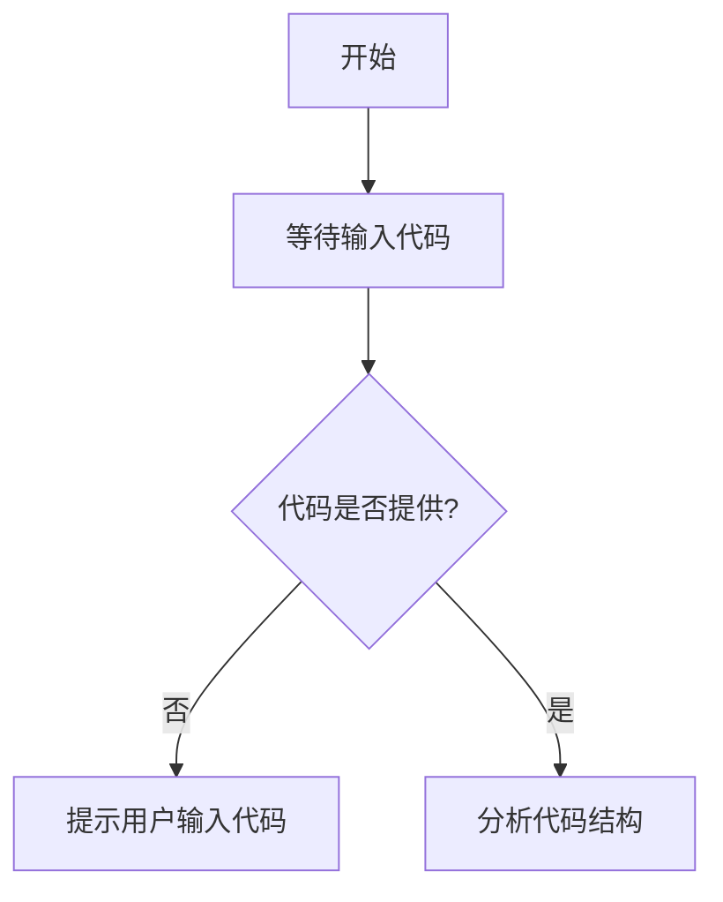

# `Chat-Haruhi-Suzumiya\yuki_builder\audio_feature_ext\__init__.py` 详细设计文档

未提供代码，无法生成描述

## 整体流程



## 类结构

```
等待代码输入后分析...
```

## 全局变量及字段


    

## 全局函数及方法


## 关键组件


## 问题及建议


### 已知问题

-   代码未提供，无法进行技术债务或优化空间分析

### 优化建议

-   请提供需要分析的代码，以便进行详细的技术债务识别和优化建议


## 其它


### 设计目标与约束

本代码的设计目标包括：实现核心业务逻辑、提供清晰的模块划分、确保代码可维护性和可扩展性。技术约束包括：使用的编程语言版本、运行时环境要求、依赖库版本范围等。性能约束包括：响应时间要求、并发处理能力、内存使用限制等。

### 错误处理与异常设计

异常分类：业务异常、技术异常、运行时异常。异常传播机制：向上抛出、捕获处理、记录日志。错误码设计：定义统一的错误码体系，包含错误级别、错误类别、错误描述信息。降级策略：核心功能失败时的备选方案、熔断机制、重试策略。

### 数据流与状态机

数据输入来源、数据处理流程、数据输出目标。状态定义：各模块可能处于的状态、状态转换条件、状态变更触发事件。状态管理：状态存储方式、状态持久化策略、状态一致性保证。

### 外部依赖与接口契约

第三方库依赖：依赖名称、版本要求、功能用途。外部系统接口：接口地址、请求格式、响应格式、认证方式。内部模块接口：接口定义、调用方式、参数规范、返回值约定。

### 安全考虑

身份认证：认证方式、token管理、会话控制。权限控制：角色定义、权限分配、访问控制列表。数据安全：敏感数据加密传输、数据存储加密、密钥管理。输入验证：参数校验、SQL注入防护、XSS防护。

### 性能要求

响应时间：各接口的响应时间要求、性能指标基线。并发处理：最大并发数、线程池配置、队列管理。资源使用：CPU使用率、内存使用量、网络带宽占用。缓存策略：缓存内容、缓存过期策略、缓存更新机制。

### 兼容性设计

向前兼容性：新版本对旧版本的兼容处理。向后兼容性：旧版本在新环境下的运行支持。平台兼容性：支持的操作系统、浏览器、硬件平台。版本管理：版本号规则、版本升级策略、版本回滚方案。

### 部署架构

部署方式：单机部署、集群部署、容器化部署。负载均衡：负载策略、健康检查、故障转移。服务发现：服务注册、服务订阅、动态路由。环境配置：开发环境、测试环境、生产环境配置差异。

### 监控与日志

监控指标：系统指标、业务指标、自定义指标。日志规范：日志级别、日志格式、日志存储、日志分析。告警机制：告警条件、告警方式、告警阈值。性能追踪：调用链追踪、性能瓶颈分析、分布式追踪。

### 测试策略

单元测试：测试覆盖率要求、测试框架、测试用例管理。集成测试：测试环境、测试数据、测试流程。端到端测试：测试场景、测试脚本、自动化测试。性能测试：压力测试、负载测试、稳定性测试。

### 配置管理

配置分类：系统配置、业务配置、环境配置。配置来源：配置文件、环境变量、配置中心。配置更新：热更新机制、配置生效策略、配置版本管理。敏感配置：加密存储、访问控制、变更审计。

### 版本兼容性

API版本管理：版本号定义、版本选择、版本废弃策略。数据版本兼容：数据结构变更、迁移策略、回滚方案。协议版本兼容：通信协议版本、协议协商、版本降级。

### 事务与一致性

事务管理：事务传播行为、事务隔离级别、分布式事务。一致性保证：最终一致性、弱一致性、强一致性。补偿机制：失败补偿、幂等处理、重试策略。

### 代码规范与约定

命名规范：变量命名、方法命名、类命名规范。代码结构：分层架构、模块划分、目录结构。注释规范：注释内容、注释位置、注释风格。文档规范：文档格式、文档更新、文档维护。


    