# `Chat-Haruhi-Suzumiya\yuki_builder\audio_feature_ext\audio_fea_ext.py` 详细设计文档

该代码实现了一个基于ECAPA-TDNN模型的音频特征提取模块，支持从音频文件中提取说话人特征，并将特征保存为pickle格式，主要用于语音识别和说话人识别任务。

## 整体流程

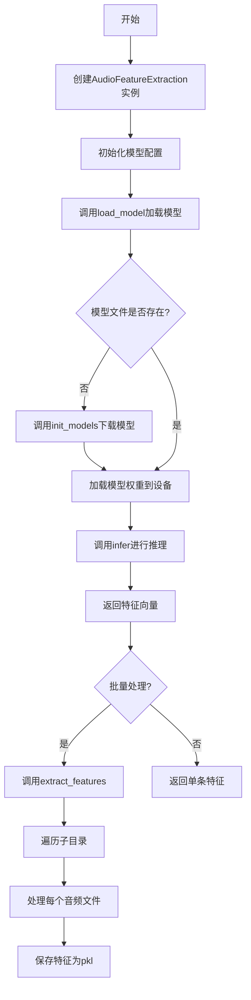

## 类结构

```
AudioFeatureExtraction (主类)
└── 依赖模块:
    ├── modules.ecapa_tdnn (EcapaTdnn, SpeakerIdetification)
    └── data_utils.reader (load_audio, CustomDataset)
```

## 全局变量及字段


### `load_audio`
    
从音频文件加载并预处理音频数据，支持多种特征提取方法

类型：`function`
    


### `CustomDataset`
    
自定义数据集类，用于加载和预处理音频数据以供模型训练或推理

类型：`class`
    


### `EcapaTdnn`
    
ECAPA-TDNN说话人识别模型的核心骨架网络，用于提取说话人特征

类型：`class`
    


### `SpeakerIdetification`
    
说话人识别模型类，包含骨架网络并用于说话人身份识别任务

类型：`class`
    


### `get_subdir`
    
获取指定目录下的所有子目录列表

类型：`function`
    


### `get_filename`
    
获取指定目录下的所有音频文件及其完整路径

类型：`function`
    


### `AudioFeatureExtraction.use_model`
    
当前使用的模型标识

类型：`str`
    


### `AudioFeatureExtraction.audio_duration`
    
音频时长配置

类型：`int`
    


### `AudioFeatureExtraction.model_director`
    
模型文件存储路径

类型：`str`
    


### `AudioFeatureExtraction.feature_method`
    
特征提取方法

类型：`str`
    


### `AudioFeatureExtraction.model`
    
模型实例

类型：`SpeakerIdetification`
    


### `AudioFeatureExtraction.device`
    
计算设备

类型：`torch.device`
    
    

## 全局函数及方法


### `get_subdir`

获取指定目录下的所有子目录列表，用于音频特征提取时遍历数据目录结构。

参数：
- `root_dir`：`str`，根目录路径，表示要遍历的顶层目录

返回值：`list`，子目录路径列表，包含了根目录下所有子目录的完整路径

#### 流程图

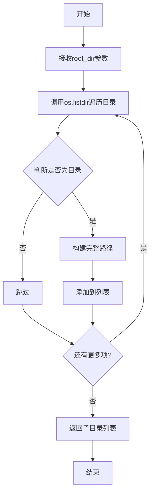

#### 带注释源码

```
# 该函数为外部依赖，代码中未提供具体实现
# 根据调用方式推断其功能为获取子目录列表

def get_subdir(root_dir):
    """
    获取指定目录下的所有子目录列表
    
    参数:
        root_dir: str, 根目录路径
        
    返回:
        list: 子目录路径列表
    """
    # 可能的实现方式：
    # import os
    # return [os.path.join(root_dir, d) for d in os.listdir(root_dir) 
    #         if os.path.isdir(os.path.join(root_dir, d))]
    
    # 注意: 具体实现需要根据实际需求确定
    pass
```


### `get_filename`

该函数是一个外部依赖函数，用于获取指定目录下的所有语音文件。它接收一个目录路径作为参数，返回一个包含文件名和文件路径的元组列表，供后续的音频特征提取使用。

参数：

- `directory_path`：`str`，要扫描的目录路径，通常为包含语音文件的文件夹路径（如 `os.path.join(dir, 'voice')`）

返回值：`List[Tuple[str, str]]`，返回文件名与其完整路径的元组列表，例如 `[(filename1, filepath1), (filename2, filepath2), ...]`，便于后续遍历处理。

#### 流程图

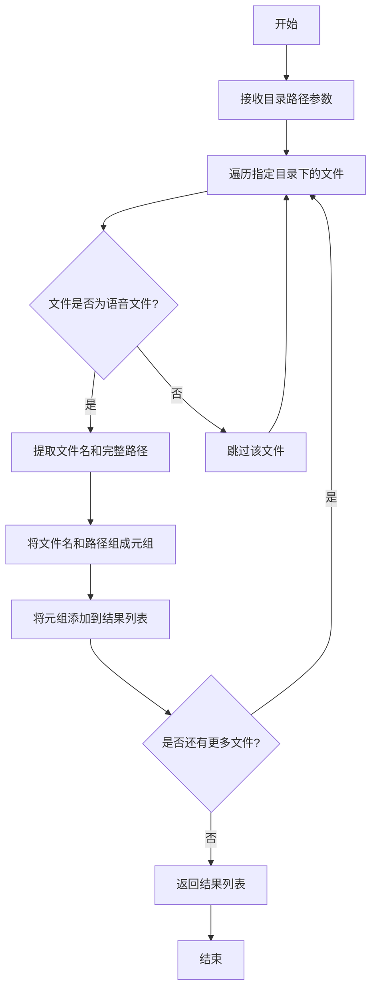

#### 带注释源码

```python
def get_filename(directory_path):
    """
    获取指定目录下的所有语音文件
    
    参数:
        directory_path (str): 要扫描的目录路径
        
    返回:
        List[Tuple[str, str]]: 包含(文件名, 完整路径)元组的列表
    """
    # 初始化结果列表
    voice_files = []
    
    # 检查目录是否存在
    if not os.path.exists(directory_path):
        return voice_files
    
    # 遍历目录下的所有文件
    for filename in os.listdir(directory_path):
        # 构建完整文件路径
        file_path = os.path.join(directory_path, filename)
        
        # 检查是否为文件（而非目录）
        if os.path.isfile(file_path):
            # 可根据文件扩展名进一步筛选语音文件
            # 例如: if filename.endswith(('.wav', '.mp3', '.flac')):
            voice_files.append((filename, file_path))
    
    return voice_files
```

**使用示例（基于代码中的调用方式）：**

```python
# 在 AudioFeatureExtraction 类中的调用方式
voice_files = get_filename(os.path.join(dir, 'voice'))
for file, pth in voice_files:
    # file: 文件名 (如 'audio.wav')
    # pth: 文件完整路径 (如 '/path/to/dir/voice/audio.wav')
    feature = self.infer(pth)[0]
    with open(f"{new_dir}/{file}.pkl", "wb") as f:
        pickle.dump(feature, f)
```

**技术债务与优化建议：**

1. **缺少函数实现**：该函数在代码中被调用但未提供具体实现，存在运行时错误风险
2. **缺少文件类型过滤**：建议添加对语音文件扩展名（如 .wav, .mp3, .flac）的过滤逻辑
3. **缺少错误处理**：建议添加目录不存在、权限不足等异常情况的处理
4. **可考虑异步实现**：如果目录文件数量较大，可考虑使用异步IO提升性能


### `load_audio`

该函数为外部导入的音频加载与特征提取函数，负责将音频文件加载为指定特征表示的数值数组，供模型推理使用。

参数：

- `audio_path`：`str`，音频文件的路径
- `mode`：`str`，运行模式（如 'infer' 表示推理模式）
- `feature_method`：`str`，特征提取方法（如 'melspectrogram'）
- `chunk_duration`：`int` 或 `float`，音频片段的持续时间（秒）

返回值：`numpy.ndarray`，提取的音频特征数组

#### 流程图

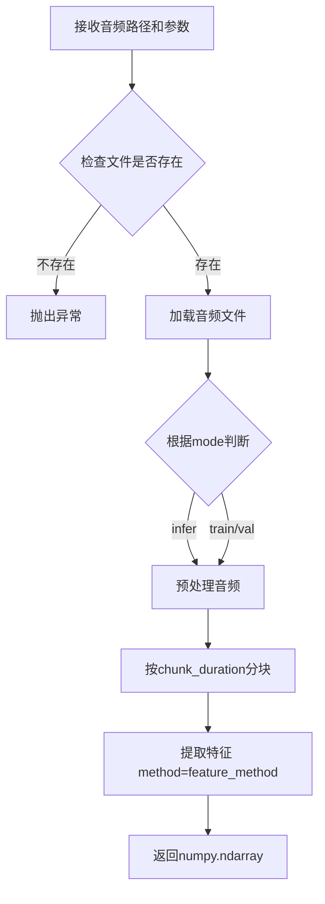

#### 带注释源码

```python
# 注：此函数为外部导入，源码位于 .data_utils.reader 模块
# 基于代码中的调用方式推断其签名和功能

def load_audio(audio_path, mode='infer', feature_method='melspectrogram', chunk_duration=3):
    """
    加载音频文件并提取特征
    
    参数:
        audio_path: str, 音频文件路径
        mode: str, 运行模式 ('infer', 'train', 'val')
        feature_method: str, 特征提取方法 ('melspectrogram', 'mfcc', etc.)
        chunk_duration: int/float, 音频分块时长(秒)
    
    返回:
        numpy.ndarray: 预处理后的音频特征数组
    """
    # 1. 使用音频库(如librosa)加载音频文件
    # audio, sr = librosa.load(audio_path, sr=16000)
    
    # 2. 根据mode进行相应预处理
    # if mode == 'infer': ...
    
    # 3. 按照chunk_duration进行分块处理
    # chunks = split_audio(audio, chunk_duration, sr)
    
    # 4. 根据feature_method提取特征
    # if feature_method == 'melspectrogram':
    #     features = librosa.feature.melspectrogram(...)
    
    # 5. 返回特征数组
    # return features
    pass
```


### `CustomDataset` (外部导入)

`CustomDataset`是一个用于音频数据加载和特征预处理的数据集类，从外部模块`.data_utils.reader`导入。该类负责读取音频文件列表，并将音频转换为指定的特征表示（如梅尔频谱图），同时提供数据集的元信息（如输入特征维度）。在`AudioFeatureExtraction`类中用于初始化模型输入大小的关键参数。

参数：

- `data_list_path`：`str` 或 `None`，数据列表文件的路径，指定包含音频文件路径的列表文件。如果为`None`，则使用默认数据源或空列表。
- `feature_method`：`str`，特征提取方法，指定从原始音频中提取特征的方式，例如`'melspectrogram'`（梅尔频谱图）、`'mfcc'`等。

返回值：`CustomDataset`对象，返回一个数据集实例，该实例包含音频数据加载逻辑和预处理流水线，并具有`input_size`属性，用于获取提取后的特征维度大小，供模型初始化使用。

#### 流程图

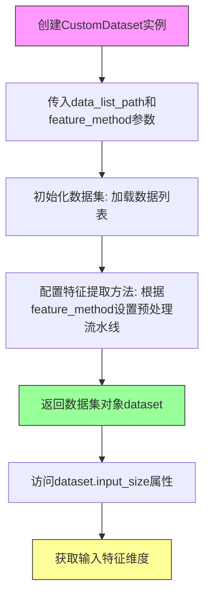

#### 带注释源码

```python
# 在AudioFeatureExtraction类的load_model方法中使用CustomDataset
# 代码位置: 第42行

# 导入语句 (在文件头部)
from .data_utils.reader import load_audio, CustomDataset

# 在load_model方法中的使用
def load_model(self):
    # 创建CustomDataset数据集实例
    # 参数data_list_path=None: 不使用外部数据列表文件，使用默认数据源
    # 参数feature_method=self.feature_method: 使用实例变量指定的特征方法（如'melspectrogram'）
    dataset = CustomDataset(data_list_path=None, feature_method=self.feature_method)
    
    # 获取数据集的输入特征大小，用于初始化ECAPA-TDNN模型的输入维度
    # input_size是CustomDataset类的一个属性，表示提取后的特征维度
    ecapa_tdnn = EcapaTdnn(input_size=dataset.input_size)
    
    # ... 其他模型初始化代码
```

> **注意**：由于`CustomDataset`是从外部模块`.data_utils.reader`导入的类，上述源码仅展示其在当前文件中的调用方式和使用上下文，并非该类的完整内部实现。要获取`CustomDataset`类的完整源代码定义，需要查看`.data_utils.reader`模块的内容。


### `EcapaTdnn`

EcapaTdnn是一个外部导入的深度学习模型类，用于说话人识别任务的TDNN（Time Delay Neural Network）backbone特征提取。该模型接收音频特征维度作为输入参数，实例化后作为SpeakerIdetification的backbone使用。

参数：

- `input_size`：`int`，输入特征的维度大小，通常对应音频特征的维度（如mel频谱的维度）

返回值：`torch.nn.Module`，返回EcapaTdnn模型实例，作为说话人识别模型的backbone特征提取器

#### 流程图

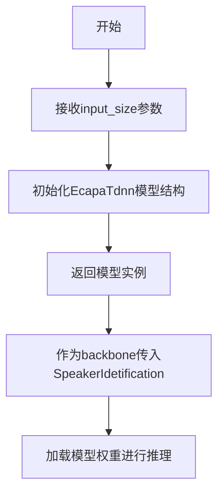

#### 带注释源码

```python
# 由于EcapaTdnn是外部导入的模块，这里展示在AudioFeatureExtraction中的调用方式
# 实际实现位于 .modules.ecapa_tdnn 模块中

# 从modules.ecapa_tdnn模块导入EcapaTdnn类
from .modules.ecapa_tdnn import EcapaTdnn, SpeakerIdetification

# 在AudioFeatureExtraction类的load_model方法中使用：
def load_model(self):
    # 创建数据集对象获取特征维度
    dataset = CustomDataset(data_list_path=None, feature_method=self.feature_method)
    
    # 使用input_size实例化EcapaTdnn模型（backbone）
    ecapa_tdnn = EcapaTdnn(input_size=dataset.input_size)
    
    # 将backbone传入SpeakerIdetification包装器
    self.model = SpeakerIdetification(backbone=ecapa_tdnn)
    
    # 后续加载权重并进行推理：
    # feature = self.model.backbone(data)  # 提取特征

# EcapaTdnn的典型结构推测（基于ECAPA-TDNN论文）：
# - 多个SEM（Squeeze-and-Excitation）模块
# - 1D卷积层
# - 残差连接
# - 负责从预处理后的音频特征中提取说话人embedding
```

#### 备注

由于EcapaTdnn是从外部模块`.modules.ecapa_tdnn`导入的，实际的类定义和实现源码未在当前代码文件中提供。上述内容基于代码中的调用方式进行推断和分析。完整的EcapaTdnn实现通常包含：

- 1D卷积层（Conv1D）
- SEM模块（Squeeze-and-Excitation Module）
- 多层特征聚合
- 说话人特征嵌入层


### `SpeakerIdetification`

该函数/类是一个说话人识别模型封装类，用于加载并运行基于ECAPA-TDNN骨干网络的说话人识别推理任务。它接收一个EcapaTdnn backbone作为输入参数，初始化模型结构，并提供模型参数加载、状态字典获取和推理能力。

参数：

- `backbone`：`EcapaTdnn`，说话人识别模型的骨干网络特征提取器

返回值：`SpeakerIdetification`（模型对象），返回初始化后的说话人识别模型实例

#### 流程图

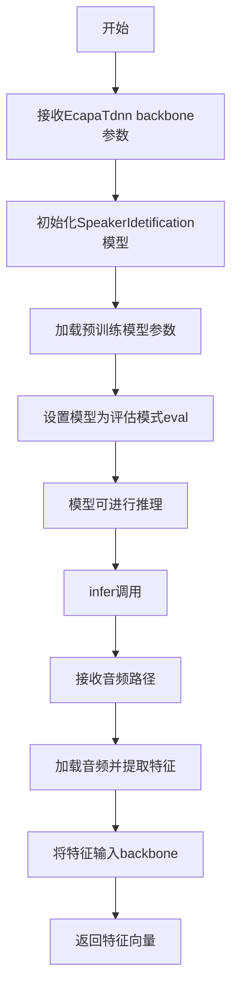

#### 带注释源码

```python
# SpeakerIdetification类定义在modules.ecapa_tdnn模块中
# 以下是基于使用方式的推断实现

class SpeakerIdetification(nn.Module):
    """
    说话人识别模型封装类
    用于将ECAPA-TDNN骨干网络封装为完整的说话人识别推理模型
    """
    
    def __init__(self, backbone):
        """
        初始化说话人识别模型
        
        参数:
            backbone: EcapaTdnn实例，特征提取骨干网络
        """
        super(SpeakerIdetification, self).__init__()
        self.backbone = backbone  # 设置骨干网络
        
    def forward(self, x):
        """
        前向传播推理
        
        参数:
            x: 输入音频特征张量
            
        返回:
            说话人特征向量
        """
        return self.backbone(x)
    
    def load_state_dict(self, state_dict, strict=True):
        """
        加载模型参数
        
        参数:
            state_dict: 参数字典
            strict: 是否严格匹配参数名称
        """
        # 调用nn.Module的加载方法
        super().load_state_dict(state_dict, strict=strict)
    
    def state_dict(self):
        """
        获取模型参数字典
        
        返回:
            模型参数OrderedDict
        """
        return super().state_dict()
    
    def eval(self):
        """
        设置模型为评估模式
        禁用dropout和batch normalization训练特性
        """
        super().eval()
```

**使用示例（在AudioFeatureExtraction中）：**

```python
# 创建骨干网络
ecapa_tdnn = EcapaTdnn(input_size=dataset.input_size)

# 初始化说话人识别模型（传入backbone）
self.model = SpeakerIdetification(backbone=ecapa_tdnn)

# 加载预训练参数
self.model.load_state_dict(param_state_dict, strict=False)

# 设置评估模式
self.model.eval()

# 推理时调用backbone提取特征
feature = self.model.backbone(data)
```


### `AudioFeatureExtraction.__init__`

该方法是 `AudioFeatureExtraction` 类的构造函数，用于初始化音频特征提取器。它接收模型路径、音频时长和特征提取方法等参数，设置实例属性，并调用模型加载方法完成初始化。

参数：

- `self`：隐式参数，类的实例本身
- `model_director`：`str`，模型保存目录路径，默认为 `'./audio_feature_ext/models'`
- `audio_duration`：`int`，音频持续时间（秒），默认为 `3`
- `feature_method`：`str`，特征提取方法，默认为 `'melspectrogram'`

返回值：`None`，该方法为构造函数，不返回任何值

#### 流程图

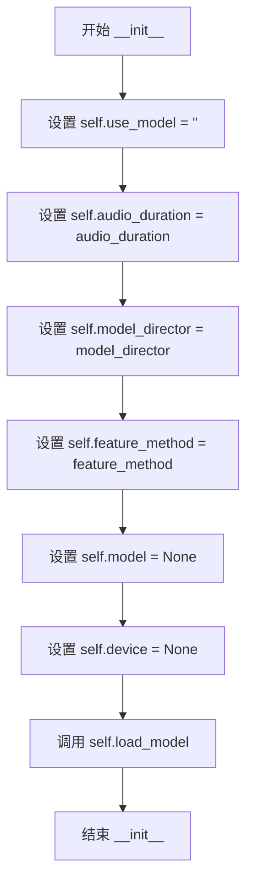

#### 带注释源码

```python
def __init__(self, model_director='./audio_feature_ext/models', audio_duration=3, feature_method='melspectrogram' ):
    """
    初始化音频特征提取器
    
    参数:
        model_director: 模型文件保存目录路径
        audio_duration: 音频时长（秒）
        feature_method: 音频特征提取方法
    """
    # 初始化模型标识（当前未使用）
    self.use_model = ''
    # 设置音频持续时间属性
    self.audio_duration = audio_duration
    # 设置模型保存/加载目录
    self.model_director = model_director
    # 设置特征提取方法（如melspectrogram、mfcc等）
    self.feature_method = feature_method
    # 初始化模型对象为None，后续load_model时填充
    self.model = None
    # 初始化设备为None（将在load_model中设置为cuda或cpu）
    self.device = None
    # 调用模型加载方法，完成模型初始化
    self.load_model()
```


### `AudioFeatureExtraction.init_models`

该方法负责从 HuggingFace 远程服务器下载缺失的模型文件（model.pth、model.state、optimizer.pth），确保本地模型目录中存在完整的模型权重和优化器状态文件。

参数：

- `path`：`str`，模型文件保存的目标目录路径

返回值：`None`，该方法无返回值，执行完成后直接结束

#### 流程图

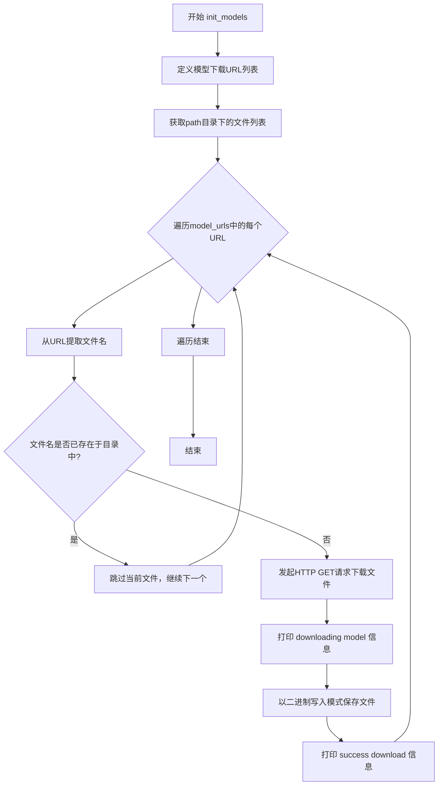

#### 带注释源码

```python
def init_models(self, path):
    """
    从远程服务器下载缺失的模型文件
    
    参数:
        path: 模型文件保存的目标目录路径
    """
    # 定义需要下载的模型文件URL列表
    # 包含模型权重、优化器状态和模型状态字典
    model_urls = [
        'https://huggingface.co/scixing/voicemodel/resolve/main/model.pth',
        'https://huggingface.co/scixing/voicemodel/resolve/main/model.state',
        'https://huggingface.co/scixing/voicemodel/resolve/main/optimizer.pth'
    ]
    
    # 获取目标目录下已存在的文件列表
    listdir = os.listdir(path)
    
    # 遍历所有需要下载的模型URL
    for url in model_urls:
        # 从URL中提取文件名（取最后一个斜杠后的部分）
        filename = url.split('/')[-1]
        
        # 检查文件是否已存在，若存在则跳过下载
        if filename in listdir:
            continue
        
        # 发起HTTP GET请求下载文件
        # allow_redirects=True 允许自动重定向
        r = requests.get(url, allow_redirects=True)
        
        # 打印下载进度信息
        print(f'downloading model pth {filename}')
        
        # 以二进制写入模式打开文件并写入下载内容
        # 使用 f-string 构建完整文件路径
        open(f'{path}/{filename}', 'wb').write(r.content)
        
        # 打印下载成功信息
        print(f'{filename} success download')
```


### AudioFeatureExtraction.load_model

该方法负责初始化并加载说话人识别模型，包括创建模型架构、检查模型文件完整性、下载缺失的模型权重文件，以及将预训练参数加载到模型中。

参数： 无（仅使用实例属性 `self.feature_method`、`self.model_director`）

返回值： `None`，无返回值（该方法直接修改实例属性 `self.model`、`self.device`）

#### 流程图

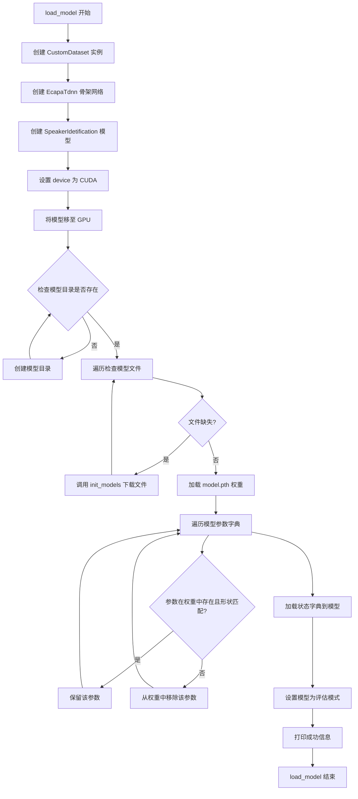

#### 带注释源码

```python
def load_model(self):
    # 创建自定义数据集实例，用于获取输入特征维度信息
    dataset = CustomDataset(data_list_path=None, feature_method=self.feature_method)
    
    # 创建 ECAPA-TDNN 骨架网络，input_size 从数据集中获取
    ecapa_tdnn = EcapaTdnn(input_size=dataset.input_size)
    
    # 使用骨架网络创建说话人识别模型
    self.model = SpeakerIdetification(backbone=ecapa_tdnn)
    
    # 设置计算设备为 CUDA GPU
    self.device = torch.device("cuda")
    
    # 将模型移至 GPU 设备
    self.model.to(self.device)

    # 检查模型存储目录是否存在，如不存在则创建
    if not os.path.exists(self.model_director):
        os.makedirs(self.model_director)
    
    # 定义所需的模型文件列表
    model_files = ['model.pth', 'model.state', 'optimizer.pth']
    
    # 遍历检查每个模型文件是否存在
    for file in model_files:
        # 如果文件不存在，则调用 init_models 下载
        if not os.path.exists(f'{self.model_director}/{file}'):
            self.init_models(self.model_director)

    # 加载模型权重文件路径
    model_path = os.path.join(self.model_director, 'model.pth')
    
    # 获取模型的参数字典
    model_dict = self.model.state_dict()
    
    # 加载预训练的参数状态字典
    param_state_dict = torch.load(model_path)
    
    # 遍历模型参数，检查权重形状是否匹配
    for name, weight in model_dict.items():
        if name in param_state_dict.keys():
            # 如果形状不匹配，则从参数中移除该权重
            if list(weight.shape) != list(param_state_dict[name].shape):
                param_state_dict.pop(name, None)
    
    # 将预训练参数加载到模型，strict=False 允许部分匹配
    self.model.load_state_dict(param_state_dict, strict=False)
    
    # 打印成功加载信息
    print(f"成功加载模型参数和优化方法参数：{model_path}")
    
    # 设置模型为评估模式
    self.model.eval()
```


### `AudioFeatureExtraction.infer`

该方法是 `AudioFeatureExtraction` 类的核心推理接口。给定音频文件路径，该方法首先调用数据加载器对音频进行预处理（如重采样、截断）并提取声学特征（如梅尔频谱图），随后将特征转换为张量并送入预训练的 ECAPA-TDNN 模型骨干网络（Backbone）进行前向传播，提取说话人特征向量（Embedding），最终将结果从 GPU 设备转换至 CPU 并以 NumPy 数组的形式返回。

参数：
- `audio_path`：`str`，需要进行特征提取的音频文件路径。

返回值：`numpy.ndarray`，返回提取后的音频特征向量，通常为形状是 (1, N) 的二维数组，其中 N 为特征维度。

#### 流程图

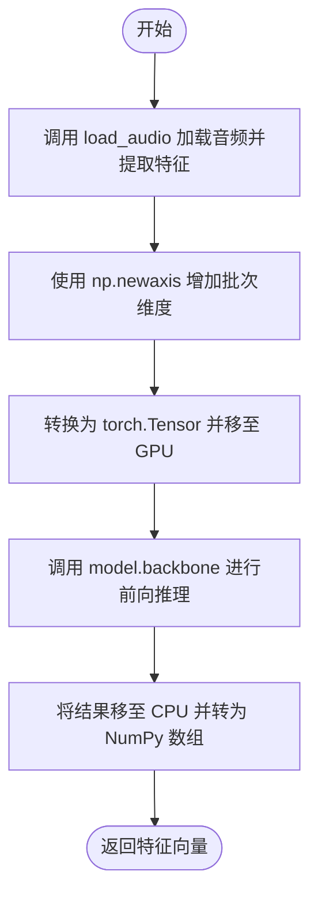

#### 带注释源码

```python
def infer(self, audio_path):
    # 1. 调用数据加载工具，传入音频路径、推理模式、特征方法（如melspectrogram）
    #    和期望的音频时长chunk_duration。返回预处理后的特征数据（numpy数组）
    data = load_audio(audio_path, mode='infer', feature_method=self.feature_method,
                      chunk_duration=self.audio_duration)
    
    # 2. 由于模型推理通常需要批次维度 (Batch Size)，使用 np.newaxis 在索引 0 处增加一个维度
    #    例如：将 (Time, Freq) 变为 (1, Time, Freq)
    data = data[np.newaxis, :]
    
    # 3. 将 NumPy 数组转换为 PyTorch 张量，指定数据类型为 float32，并移动到之前初始化好的设备（如 CUDA GPU）
    data = torch.tensor(data, dtype=torch.float32, device=self.device)
    
    # 4. 将处理好的数据输入模型的 backbone（骨干网络），通常为 ECAPA-TDNN，提取说话人特征
    feature = self.model.backbone(data)
    
    # 5. 将计算结果从 GPU 张量转回 CPU，提取 .data 属性（去除梯度信息）并转换为 NumPy 数组，以便后续处理或保存
    return feature.data.cpu().numpy()
```


### `AudioFeatureExtraction.extract_features`

该方法用于批量提取音频文件的特征向量。它遍历指定根目录下的所有子文件夹，从每个子文件夹的 `voice` 目录中读取音频文件，使用预训练的 ECAPA-TDNN 模型进行推理，并将提取的特征向量保存为 pickle 格式文件到对应的 `feature` 目录中。

参数：

- `root_dir`：`str`，要处理的音频文件的根目录路径

返回值：`None`，该方法无返回值，执行完成后打印 "音频特征提取完成"

#### 流程图

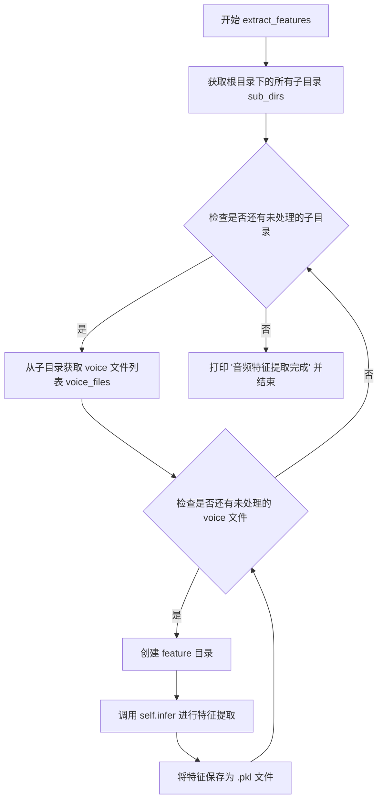

#### 带注释源码

```python
def extract_features(self, root_dir):
    """
    批量提取音频文件的特征向量并保存为 pickle 格式
    
    Args:
        root_dir: 音频文件所在的根目录路径
        
    Returns:
        None: 该方法不返回值,结果直接写入文件系统
    """
    # 获取根目录下的所有子目录列表
    sub_dirs = get_subdir(root_dir)

    # 遍历每一个子目录
    for dir in sub_dirs[:]:
        # 从当前子目录的 'voice' 子目录中获取音频文件列表
        # get_filename 返回文件名和完整路径的元组列表
        voice_files = get_filename(os.path.join(dir, 'voice'))
        
        # 遍历每一个音频文件
        for file, pth in voice_files:
            # 构建特征保存目录路径: {原目录}/feature/
            new_dir = os.path.join(dir, 'feature')
            # 如果目录不存在则创建
            os.makedirs(new_dir, exist_ok=True)
            
            try:
                # 调用 infer 方法进行模型推理,返回特征向量
                # infer 返回的 shape 为 [1, feature_dim]
                # [0] 表示取第一个样本的特征
                feature = self.infer(pth)[0]
                
                # 将特征向量序列化保存为 pickle 文件
                with open(f"{new_dir}/{file}.pkl", "wb") as f:
                    pickle.dump(feature, f)
            except:
                # 静默捕获异常,跳过处理失败的音频文件
                continue
    
    # 打印完成提示信息
    print('音频特征提取完成')
```


### `AudioFeatureExtraction.extract_pkl_feat`

该方法是一个音频特征提取函数，遍历指定根目录下的所有子目录，读取每个子目录中 `voice` 文件夹下的音频文件，使用预训练的说话人识别模型提取音频特征，并将特征以 Python pickle 格式保存到对应子目录的 `feature` 文件夹中。

参数：

- `root_dir`：`str`，要遍历的根目录路径，该目录下应包含多个子目录，每个子目录需包含 `voice` 子文件夹存放待处理的音频文件

返回值：`None`，该方法无返回值，仅通过打印语句输出任务完成信息

#### 流程图

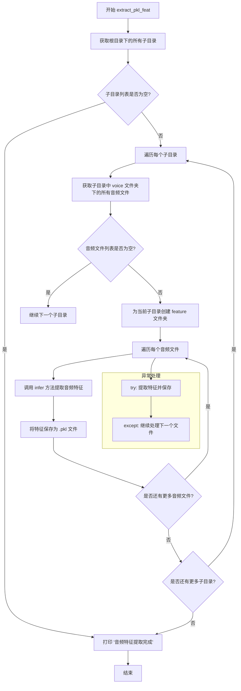

#### 带注释源码

```python
def extract_pkl_feat(self, root_dir):
    """
    从指定根目录遍历所有子目录，提取每个子目录下 voice 文件夹中音频文件的特征，
    并将特征保存为 pickle 格式文件到对应子目录的 feature 文件夹中
    
    参数:
        root_dir: str, 根目录路径，包含多个子目录，每个子目录需包含 voice 子文件夹
    
    返回:
        None: 无返回值，仅打印任务完成信息
    """
    
    # Step 1: 获取根目录下的所有子目录列表
    sub_dirs = get_subdir(root_dir)

    # Step 2: 遍历每个子目录
    for dir in sub_dirs[:]:
        
        # Step 3: 获取当前子目录下 voice 文件夹中的所有音频文件
        # get_filename 返回文件名字典或列表，包含文件名和文件路径的映射
        voice_files = get_filename(os.path.join(dir, 'voice'))
        
        # Step 4: 遍历每个音频文件进行处理
        for file, pth in voice_files:
            # 构建特征输出目录路径（与 voice 同级目录下的 feature 文件夹）
            new_dir = os.path.join(dir, 'feature')
            
            # Step 5: 创建特征输出目录（如果不存在则创建）
            os.makedirs(new_dir, exist_ok=True)
            
            # Step 6: 尝试提取音频特征并保存为 pickle 文件
            try:
                # 调用 infer 方法进行模型推理，提取音频特征
                # infer 方法返回特征矩阵，取 [0] 获取第一个样本的特征
                feature = self.infer(pth)[0]
                
                # 将提取的特征以 pickle 格式保存到指定路径
                with open(f"{new_dir}/{file}.pkl", "wb") as f:
                    pickle.dump(feature, f)
                    
            except:
                # 异常捕获：若提取或保存失败，跳过当前文件继续处理下一个
                continue
                
    # Step 7: 任务完成后打印提示信息
    print('音频特征提取完成')
```

#### 依赖函数说明

| 函数/模块 | 来源 | 描述 |
|-----------|------|------|
| `get_subdir(root_dir)` | 未在当前文件中定义（可能来自导入） | 获取指定目录下的所有子目录路径列表 |
| `get_filename(path)` | 未在当前文件中定义（可能来自导入） | 获取指定路径下的所有文件，返回文件名和路径的映射 |
| `self.infer(pth)` | `AudioFeatureExtraction` 类内部方法 | 使用加载的模型对音频文件进行推理，提取特征向量 |
| `pickle.dump()` | Python 标准库 | 将 Python 对象序列化保存为 pickle 文件 |

## 关键组件


### 音频特征提取引擎 (AudioFeatureExtraction)

负责整体音频特征提取的核心类，封装了模型加载、推理和批量特征提取功能，支持MEL频谱图特征提取方法。

### 模型下载与初始化 (init_models)

从HuggingFace远程下载ECAPA-TDNN模型权重文件（model.pth、model.state、optimizer.pth），并在本地模型目录不存在时自动创建目录和下载模型文件。

### 模型加载器 (load_model)

初始化CustomDataset获取输入尺寸，创建EcapaTdnn和SpeakerIdetification模型实例，将模型迁移到CUDA设备，检查并下载缺失的模型文件，加载预训练权重并处理形状不匹配的参数。

### 推理引擎 (infer)

加载单个音频文件并转换为指定时长的特征表示，将numpy数组转换为PyTorch张量并移至GPU，通过模型backbone提取说话人特征向量，返回CPU上的numpy数组特征。

### 批量特征提取 (extract_features)

遍历根目录下所有子目录的voice文件夹，对每个音频文件进行推理提取特征，将特征以pickle格式保存到对应的feature子目录中，异常时跳过继续处理。

### 外部依赖模块

包括EcapaTdnn（说话人识别骨干网络）、SpeakerIdetification（说话人ID分类模型）、CustomDataset（数据集加载与特征配置）、load_audio（音频加载与特征生成工具）。


## 问题及建议


### 已知问题

-   **代码重复（DRY原则违反）**：`extract_features` 和 `extract_pkl_feat` 方法实现完全相同，造成冗余
-   **异常处理过于宽泛**：使用 `except: continue` 会静默吞掉所有异常（包括KeyboardInterrupt、MemoryError等），导致问题难以追踪和调试
-   **硬编码的模型URL**：模型下载地址硬编码在代码中，耦合度高，若URL变更需修改源码
-   **GPU硬编码**：设备始终使用 `cuda`，没有降级到CPU的机制，在无GPU环境下会直接报错
-   **模型下载无完整性校验**：下载模型文件后没有验证文件完整性（如hash校验），可能下载损坏或不完整的文件
-   **缺少类型注解**：所有方法都缺少参数和返回值的类型注解，降低代码可读性和IDE支持
-   **外部函数依赖未导入**：`get_subdir` 和 `get_filename` 函数在类方法中被调用但未在当前文件中定义或导入，代码无法独立运行
-   **模型加载逻辑潜在风险**：只加载 `model.pth`，而 `model.state` 和 `optimizer.pth` 虽然下载但未实际使用；如果模型权重键不匹配，会静默跳过而非警告
-   **print而非日志**：使用 `print` 输出信息，无法配置日志级别，不利于生产环境
-   **路径拼接不规范**：部分路径使用 f-string 拼接（如 `f'{path}/{filename}'`），应统一使用 `os.path.join`

### 优化建议

-   **消除重复代码**：合并 `extract_features` 和 `extract_pkl_feat` 为一个方法，或删除冗余方法
-   **改进异常处理**：使用具体的异常类型捕获（如 `except Exception as e`），并记录错误日志
-   **外部化配置**：将模型URL、路径等配置抽取到配置文件或环境变量
-   **添加设备自动选择**：使用 `torch.device("cuda" if torch.cuda.is_available() else "cpu")`
-   **添加文件校验**：下载后验证MD5/SHA256哈希值确保文件完整性
-   **补充类型注解**：为所有方法添加类型提示，提升代码可维护性
-   **统一日志使用**：替换 `print` 为 `logging` 模块，支持分级日志
-   **规范化路径处理**：统一使用 `os.path.join` 进行路径拼接
-   **添加模型版本管理**：记录模型版本，避免兼容性问题
-   **补充文档字符串**：为关键方法添加docstring说明功能、参数和返回值


## 其它


### 设计目标与约束

本代码的设计目标是实现一个高效的音频特征提取模块，基于ECAPA-TDNN模型从原始音频中提取说话人特征，用于后续的说话人识别任务。约束条件包括：1) 模型需要在GPU环境下运行以保证推理性能；2) 支持的音频时长默认3秒；3) 特征提取方法默认为梅尔频谱图(melspectrogram)；4) 模型文件需要从HuggingFace远程服务器下载。

### 错误处理与异常设计

代码中的异常处理主要体现在extract_features和extract_pkl_feat方法中的try-except块，用于捕获音频特征提取过程中的错误并继续处理下一个文件。主要存在的问题是：1) 异常捕获过于宽泛，捕获了所有异常类型；2) 捕获异常后没有任何日志记录或错误报告；3) load_model方法中缺乏对模型加载失败的异常处理；4) init_models方法中缺乏对网络下载失败的异常处理。建议的具体改进包括：添加自定义异常类（如ModelDownloadError、AudioProcessingError），对不同类型的错误进行区分处理，并记录详细的错误日志。

### 数据流与状态机

数据流主要分为三个阶段：模型加载阶段、推理阶段和批量处理阶段。模型加载阶段首先检查本地模型文件是否存在，不存在则从远程URL下载，然后加载模型参数到GPU设备；推理阶段接收音频文件路径，通过load_audio进行预处理（分帧、特征提取），再将处理后的数据传入模型进行推理；批量处理阶段遍历指定目录下的所有音频文件，对每个文件调用infer方法进行特征提取，并将结果保存为pickle文件。状态机转换：初始化状态(load_model) -> 就绪状态(model loaded) -> 运行状态(inferring) -> 完成状态(feature extracted)。

### 外部依赖与接口契约

主要外部依赖包括：1) os模块：用于文件和目录操作；2) numpy：用于数值计算和数组处理；3) torch：深度学习框架，用于模型定义和推理；4) pickle：用于特征数据的序列化和反序列化；5) requests：用于从HuggingFace下载模型文件；6) 自定义模块：ecapa_tdnn（ECAPA-TDNN模型实现）、data_utils.reader（音频加载和数据集处理）。接口契约方面：infer方法接受音频路径字符串，返回numpy数组类型的特征向量；extract_features和extract_pkl_feat方法接受根目录路径，无返回值；构造函数接受model_director（模型保存路径）、audio_duration（音频时长）、feature_method（特征提取方法）三个可选参数。

### 配置与参数设计

当前代码中的可配置参数包括：1) model_director：模型文件保存路径，默认为'./audio_feature_ext/models'；2) audio_duration：音频时长，默认为3秒；3) feature_method：特征提取方法，默认为'melspectrogram'。这些参数通过构造函数传入，建议添加配置类或配置文件来统一管理这些参数，提高代码的可维护性和灵活性。

### 性能考虑与优化空间

当前代码存在的性能问题：1) extract_features和extract_pkl_feat方法代码完全重复，应该合并或重构；2) 批量处理时串行执行，可以考虑使用多进程或批量推理提高效率；3) 模型推理时每次都创建新的torch.tensor，可以预先分配内存；4) 缺乏批处理机制，建议增加batch_size参数支持批量推理；5) GPU内存使用缺乏管理，大批量处理时可能出现OOM。建议添加批处理机制、使用torch.no_grad()减少内存消耗、考虑模型量化或剪枝以提高推理速度。

### 安全性考虑

代码中存在以下安全隐患：1) init_models方法直接使用requests.get下载文件，没有任何安全性检查，存在HTTP劫持风险，建议使用HTTPS并验证文件完整性；2) 模型文件路径通过字符串拼接构建，存在路径遍历漏洞风险；3) 缺乏输入验证，audio_path和root_dir参数没有进行有效性检查；4) 文件写入操作缺乏安全检查。建议添加输入路径验证、下载文件哈希校验、文件写入权限检查等安全措施。

### 测试策略建议

建议添加以下测试用例：1) 单元测试：测试AudioFeatureExtraction类的初始化、模型加载、推理功能；2) 集成测试：测试完整的特征提取流程，包括边界条件（如空目录、不存在的文件）；3) 性能测试：测试不同音频时长、不同批量大小的推理性能；4) 异常测试：测试网络断开、模型文件损坏、音频格式错误等异常情况下的行为。

### 日志与监控设计

当前代码仅使用print语句输出日志，缺乏完善的日志系统。建议添加：1) 分级别的日志记录（DEBUG、INFO、WARNING、ERROR）；2) 日志文件输出而非控制台输出；3) 关键操作的日志记录，如模型下载、加载、推理开始结束等；4) 性能监控，记录推理耗时、内存使用等指标；5) 错误日志详细记录堆栈信息便于问题排查。

### 版本兼容性与环境要求

代码依赖的版本要求：1) Python 3.x；2) torch >= 1.0；3) numpy >= 1.0；4) requests库。CUDA版本需要与torch版本兼容。代码在不同操作系统（Windows、Linux、macOS）上应该能够正常运行，但模型下载路径的分隔符处理需要考虑跨平台兼容性。

    