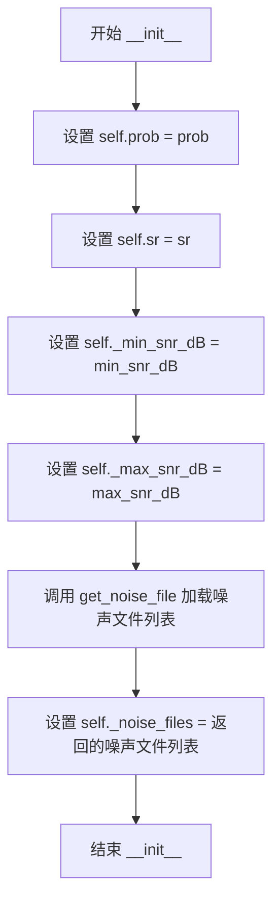
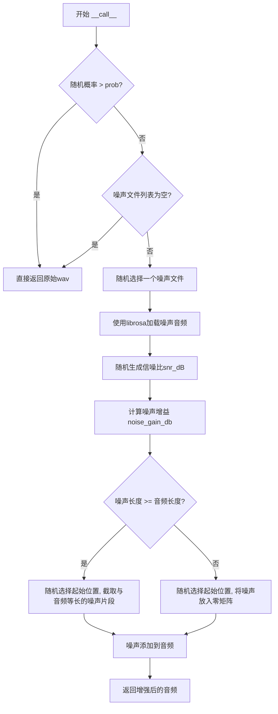
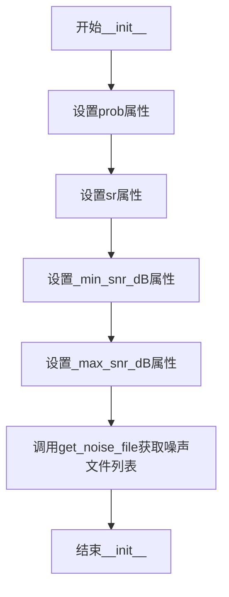
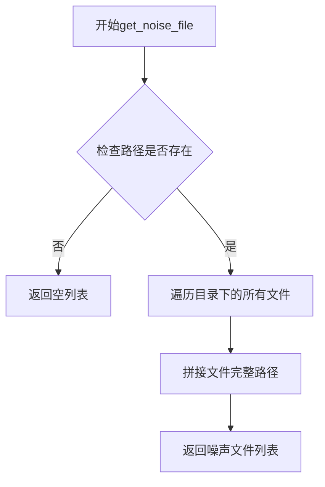
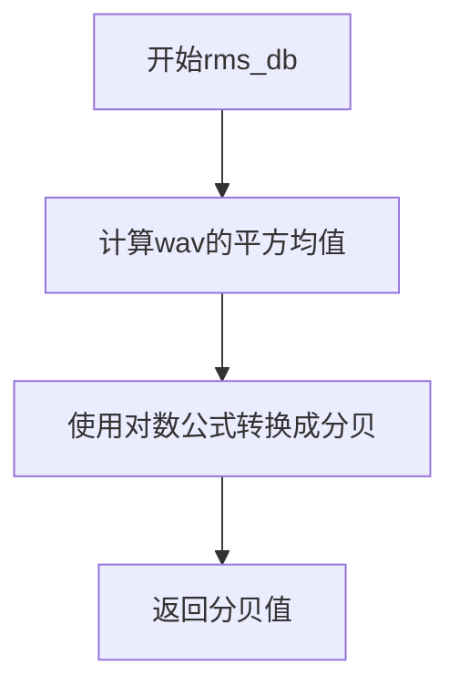

# `Chat-Haruhi-Suzumiya\yuki_builder\audio_feature_ext\data_utils\noise_perturb.py` 详细设计文档

这是一个音频数据增强工具类，通过在原始音频信号中叠加背景噪声来实现数据增强，支持可配置的信噪比范围、噪声文件路径、采样率和增强概率，主要用于提升语音识别或音频处理模型的鲁棒性。

## 整体流程

```mermaid
graph TD
    A[开始] --> B{random.random() > prob?}
    B -- 是 --> C[返回原始音频]
    B -- 否 --> D{噪声文件列表为空?}
    D -- 是 --> C
    D -- 否 --> E[随机选择噪声文件]
    E --> F[加载噪声音频]
    F --> G[计算信噪比增益]
    G --> H[调整噪声增益]
    H --> I{噪声长度 >= 音频长度?}
    I -- 是 --> J[随机截取等长噪声段]
    I -- 否 --> K[随机位置嵌入噪声]
    J --> L[叠加噪声到原始音频]
    K --> L
    L --> M[返回增强后的音频]
```

## 类结构

```
NoisePerturbAugmentor (音频噪声增强类)
```

## 全局变量及字段


### `os`
    
操作系统模块，提供文件路径操作和目录遍历功能

类型：`module`
    


### `random`
    
随机数生成模块，用于随机选择噪声文件和信噪比

类型：`module`
    


### `warnings`
    
警告控制模块，用于忽略第三方库的警告信息

类型：`module`
    


### `numpy as np`
    
数值计算库，用于音频数组操作和均方根能量计算

类型：`module`
    


### `librosa`
    
音频处理库，用于加载音频文件和进行音频处理

类型：`module`
    


### `NoisePerturbAugmentor.prob`
    
数据增强的概率，控制是否添加噪声

类型：`float`
    


### `NoisePerturbAugmentor.sr`
    
音频采样率，必须与训练数据一致

类型：`int`
    


### `NoisePerturbAugmentor._min_snr_dB`
    
最小信噪比(分贝)，用于控制噪声的最低强度

类型：`int`
    


### `NoisePerturbAugmentor._max_snr_dB`
    
最大信噪比(分贝)，用于控制噪声的最高强度

类型：`int`
    


### `NoisePerturbAugmentor._noise_files`
    
噪声文件路径列表，存储所有可用噪声文件的路径

类型：`list`
    
    

## 全局函数及方法


### `NoisePerturbAugmentor.__init__`

该方法是 `NoisePerturbAugmentor` 类的构造函数，用于初始化音频噪声增强器的配置参数，包括信噪比范围、噪声文件路径、采样率以及增强概率，并预加载噪声文件列表。

参数：

- `self`：隐式参数，代表类的实例本身
- `min_snr_dB`：`int`，最小的信噪比，以分贝为单位，默认为10
- `max_snr_dB`：`int`，最大的信噪比，以分贝为单位，默认为30
- `noise_path`：`str`，噪声文件夹路径，默认为"dataset/noise"
- `sr`：`int`，音频采样率，必须跟训练数据的一样，默认为16000
- `prob`：`float`，数据增强的概率，默认为0.5

返回值：`None`，构造函数不返回任何值

#### 流程图



#### 带注释源码

```python
def __init__(self, min_snr_dB=10, max_snr_dB=30, noise_path="dataset/noise", sr=16000, prob=0.5):
    """用于添加背景噪声的增强模型的初始化方法

    :param min_snr_dB: 最小的信噪比，以分贝为单位
    :type min_snr_dB: int
    :param max_snr_dB: 最大的信噪比，以分贝为单位
    :type max_snr_dB: int
    :param noise_path: 噪声文件夹路径
    :type noise_path: str
    :param sr: 音频采样率，必须跟训练数据的一样
    :type sr: int
    :param prob: 数据增强的概率
    :type prob: float
    """
    # 设置数据增强的概率，用于控制是否应用噪声增强
    self.prob = prob
    
    # 设置音频采样率，确保加载的噪声与输入音频采样率一致
    self.sr = sr
    
    # 设置最小信噪比（分贝），用于后续随机生成噪声增益
    self._min_snr_dB = min_snr_dB
    
    # 设置最大信噪比（分贝），用于后续随机生成噪声增益
    self._max_snr_dB = max_snr_dB
    
    # 获取噪声文件夹中的所有噪声文件路径列表
    # 如果文件夹不存在或为空，返回空列表
    self._noise_files = self.get_noise_file(noise_path=noise_path)
```


### `NoisePerturbAugmentor.get_noise_file`

这是一个静态方法，用于扫描指定目录并获取该目录下所有噪声音频文件的完整路径列表。它首先检查路径是否存在，如果不存在则直接返回空列表，否则遍历目录中的文件并拼接成绝对路径后返回。

参数：

-  `noise_path`：`str`，噪声文件夹的路径。

返回值：`List[str]`，包含所有噪声文件绝对路径的列表；如果路径不存在，则返回空列表。

#### 流程图

```mermaid
flowchart TD
    A[Start get_noise_file] --> B{os.path.exists<br/>noise_path}
    B -- No --> C[Return empty list<br/>[]]
    B -- Yes --> D[Get list of files<br/>os.listdir]
    D --> E{For each file in<br/>directory}
    E -- file --> F[Join paths<br/>os.path.join]
    F --> G[Append to noise_files<br/>list]
    G --> E
    E -- Done iterating --> H[Return noise_files<br/>list]
```

#### 带注释源码

```python
@staticmethod
def get_noise_file(noise_path):
    """获取指定噪声路径下的所有文件路径列表

    :param noise_path: 噪声文件夹路径
    :type noise_path: str
    :return: 噪声文件路径列表
    :rtype: list
    """
    # 初始化空列表用于存储噪声文件路径
    noise_files = []
    
    # 检查噪声路径是否存在，如果不存在则直接返回空列表
    if not os.path.exists(noise_path): 
        return noise_files
        
    # 遍历目录下的所有文件
    for file in os.listdir(noise_path):
        # 拼接完整路径并添加到列表中
        noise_files.append(os.path.join(noise_path, file))
        
    return noise_files
```


### `NoisePerturbAugmentor.rms_db`

该静态方法用于计算输入音频信号的均方根能量值（Root Mean Square），并将其转换为以分贝为单位的表示形式，常用于音频处理中的能量度量与信噪比计算。

参数：

- `wav`：`ndarray`， librosa 读取的音频数据（时域信号）

返回值：`float`， 均方根能量值（分贝）

#### 流程图

```mermaid
flowchart TD
    A[开始 rms_db] --> B[计算音频信号平方<br/>wav_squared = wav \*\* 2]
    B --> C[计算平方均值<br/>mean_square = np.mean(wav_squared)]
    C --> D[转换为分贝<br/>rms_db = 10 \* np.log10(mean_square)]
    D --> E[返回分贝值]
    E --> F[结束]
```

#### 带注释源码

```python
@staticmethod
def rms_db(wav):
    """返回以分贝为单位的音频均方根能量

    :return: 均方根能量(分贝)
    :rtype: float
    """
    # 第一步：计算音频信号的平方值
    # 将时域信号每个采样点进行平方运算，用于后续计算能量
    mean_square = np.mean(wav ** 2)
    
    # 第二步：转换为分贝单位
    # 使用对数尺度将线性能量值转换为分贝表示
    # 公式：dB = 10 * log10(能量值)
    # 乘以10是因为功率与幅度的关系（功率与幅度的平方成正比）
    return 10 * np.log10(mean_square)
```


### `NoisePerturbAugmentor.__call__`

该方法是NoisePerturbAugmentor类的核心调用接口，通过概率机制决定是否向输入的音频信号添加背景噪声。当触发增强时，随机选择噪声文件并根据信噪比计算噪声增益，然后将噪声与原始音频叠加后返回，以实现数据增强效果。

参数：

- `wav`：`ndarray`，librosa读取的音频数据

返回值：`ndarray`，处理后的音频数据（如果未触发增强则返回原始数据）

#### 流程图



#### 带注释源码

```python
def __call__(self, wav):
    """添加背景噪音音频

    :param wav: librosa 读取的数据
    :type wav: ndarray
    """
    # 步骤1: 概率检查 - 根据prob决定是否进行增强
    # 如果随机数大于增强概率,直接返回原始音频,不进行任何处理
    if random.random() > self.prob: return wav
    
    # 步骤2: 噪声文件检查 - 确保存在可用的噪声文件
    # 如果没有噪声文件,跳过增强过程,返回原始音频
    if len(self._noise_files) == 0: return wav
    
    # 步骤3: 随机选择噪声文件并加载
    # 从噪声文件列表中随机选择一个文件,使用指定的采样率sr加载
    noise, r = librosa.load(random.choice(self._noise_files), sr=self.sr)
    
    # 步骤4: 计算信噪比参数
    # 在最小和最大信噪比范围内随机生成一个信噪比值(单位:dB)
    snr_dB = random.uniform(self._min_snr_dB, self._max_snr_dB)
    
    # 步骤5: 计算噪声增益
    # 根据原始音频和噪声的RMS能量差以及目标信噪比,计算需要调整的噪声增益
    # 使用min(..., 300)防止增益过大导致数值溢出
    noise_gain_db = min(self.rms_db(wav) - self.rms_db(noise) - snr_dB, 300)
    
    # 步骤6: 应用噪声增益
    # 将噪声增益从dB转换为线性幅度并应用到噪声信号
    noise *= 10. ** (noise_gain_db / 20.)
    
    # 步骤7: 对齐噪声长度与音频长度
    # 创建一个与原始音频形状相同的零矩阵
    noise_new = np.zeros(wav.shape, dtype=np.float32)
    
    # 判断噪声长度与音频长度的关系,采用不同的对齐策略
    if noise.shape[0] >= wav.shape[0]:
        # 噪声长度大于等于音频长度:随机选择起始位置,截取等长片段
        start = random.randint(0, noise.shape[0] - wav.shape[0])
        noise_new[:wav.shape[0]] = noise[start: start + wav.shape[0]]
    else:
        # 噪声长度小于音频长度:随机选择起始位置,将噪声放入零矩阵
        start = random.randint(0, wav.shape[0] - noise.shape[0])
        noise_new[start:start + noise.shape[0]] = noise[:]
    
    # 步骤8: 叠加噪声并返回
    # 将处理后的噪声与原始音频叠加,返回增强后的音频
    wav += noise_new
    return wav
```


## 关键组件


### 噪声文件加载模块

负责扫描指定目录获取全部噪声音频文件路径，支持目录不存在时返回空列表

### RMS能量计算模块

计算音频信号的均方根能量并转换为分贝单位，用于后续信噪比计算

### 噪声叠加增强模块

核心数据增强逻辑，以指定概率添加背景噪声，包含信噪比随机采样、噪声增益计算、噪声与原始音频长度对齐等处理

### 信噪比控制模块

在指定分贝范围内随机生成目标信噪比，并计算所需的噪声增益系数

### 噪声长度对齐模块

处理噪声与原始音频长度不一致的情况，通过随机起始位置裁剪或填充零向量实现对齐


## 问题及建议


### 已知问题

-   **每次调用都重新加载噪声文件**：在 `__call__` 方法中，每次增强都会使用 `librosa.load` 重新加载噪声文件，这会导致严重的性能问题，I/O 操作非常耗时
-   **缺少参数验证**：构造函数没有验证 `min_snr_dB` 和 `max_snr_dB` 的有效性（如 min > max、负数），也没有验证 `prob` 是否在 [0, 1] 范围内
-   **噪声叠加可能溢出**：直接使用 `wav += noise_new` 进行叠加，没有对结果进行裁剪，可能导致音频数据溢出（超过 float32 的表示范围）
-   **硬编码的安全阈值**：`noise_gain_db` 的上界硬编码为 300，这个值没有明确的业务含义，也不便于配置
-   **递归扫描缺失**：`get_noise_file` 方法只扫描顶层目录，不会递归处理子文件夹中的噪声文件
-   **无效文件未过滤**：没有检查噪声文件是否为有效的音频文件，可能导致加载失败或异常
-   **缺少错误处理**：`librosa.load` 调用没有异常处理，如果文件损坏或格式不支持会导致整个增强流程失败

### 优化建议

-   **预加载噪声文件**：在初始化时将所有噪声文件加载到内存中，避免每次调用时重复 I/O 操作，可以显著提升性能
-   **添加参数验证**：在构造函数中添加参数校验逻辑，确保 `min_snr_dB <= max_snr_dB`、`0 <= prob <= 1`、`sr > 0`
-   **添加音频裁剪**：在叠加噪声后添加裁剪逻辑，确保音频值在合法范围内，如使用 `np.clip(wav, -1.0, 1.0)`
-   **提取配置常量**：将硬编码的 300 提取为类常量或构造函数参数，提高可配置性
-   **支持递归扫描**：使用 `os.walk` 替代 `os.listdir` 以支持递归扫描子目录
-   **添加文件类型过滤**：在扫描噪声文件时过滤常见的音频格式（.wav, .mp3, .flac 等）
-   **添加异常处理**：对 `librosa.load` 添加 try-except 捕获，记录错误并跳过损坏文件
-   **添加日志记录**：使用 `logging` 模块记录增强过程中的关键信息，便于调试和监控
-   **考虑缓存机制**：如果噪声文件很多，可以实现缓存或内存管理策略，避免内存占用过高
-   **添加类型提示**：为方法和函数添加详细的类型提示，提高代码可读性和 IDE 支持


## 其它


### 一段话描述

NoisePerturbAugmentor是一个用于音频数据增强的类，通过在原始音频信号中添加背景噪声来提高语音识别模型的鲁棒性。该类支持可配置的信噪比范围、噪声文件路径、采样率以及增强概率，使用librosa库加载噪声音频并使用numpy进行信号处理，最终返回混合了背景噪声的音频数据。

### 文件的整体运行流程

1. 初始化阶段：创建NoisePerturbAugmentor实例时，设置信噪比范围、噪声文件路径、采样率和增强概率，并扫描指定目录获取所有噪声文件路径列表
2. 调用阶段：当实例被作为函数调用时（__call__方法），首先根据概率决定是否进行增强，若概率检查通过则继续处理
3. 噪声加载：随机选择一个噪声文件，使用librosa加载为指定采样率的音频数据
4. 噪声计算：根据目标信噪比和原始音频的均方根能量计算噪声增益，并将噪声调整到适当音量
5. 噪声混合：将调整后的噪声与原始音频进行时域叠加，返回混合后的音频

### 类的详细信息

**类名**: NoisePerturbAugmentor
**父类**: object
**描述**: 用于添加背景噪声的音频数据增强类

### 类字段

**prob**
- 类型: float
- 描述: 数据增强的概率，控制是否执行噪声添加操作

**sr**
- 类型: int
- 描述: 音频采样率，必须与训练数据的采样率一致

**_min_snr_dB**
- 类型: int
- 描述: 最小信噪比，以分贝为单位

**_max_snr_dB**
- 类型: int
- 描述: 最大信噪比，以分贝为单位

**_noise_files**
- 类型: List[str]
- 描述: 噪声文件路径列表

### 类方法

**__init__**
- 参数: min_snr_dB (int, 最小信噪比，默认为10), max_snr_dB (int, 最大信噪比，默认为30), noise_path (str, 噪声文件夹路径，默认为"dataset/noise"), sr (int, 音频采样率，默认为16000), prob (float, 增强概率，默认为0.5)
- 返回值类型: None
- 描述: 构造函数，初始化增强器的各项参数并获取噪声文件列表
- 流程图: 


**get_noise_file (静态方法)**
- 参数: noise_path (str, 噪声文件夹路径)
- 返回值类型: List[str]
- 描述: 静态方法，扫描指定目录返回所有噪声文件的绝对路径列表，若目录不存在则返回空列表
- 流程图:


**rms_db (静态方法)**
- 参数: wav (ndarray, 音频数据)
- 返回值类型: float
- 描述: 计算并返回音频信号的均方根能量（分贝单位），用于后续信噪比计算
- 流程图:


**__call__**
- 参数: wav (ndarray, librosa读取的音频数据)
- 返回值类型: ndarray
- 描述: 核心增强方法，根据概率决定是否添加噪声，若添加则计算适当增益并混合噪声后返回
- 源码:
```python
def __call__(self, wav):
    """添加背景噪音音频

    :param wav: librosa 读取的数据
    :type wav: ndarray
    """
    # 根据概率决定是否进行增强
    if random.random() > self.prob: return wav
    # 如果没有噪声数据则跳过
    if len(self._noise_files) == 0: return wav
    # 随机选择一个噪声文件并加载
    noise, r = librosa.load(random.choice(self._noise_files), sr=self.sr)
    # 计算随机信噪比
    snr_dB = random.uniform(self._min_snr_dB, self._max_snr_dB)
    # 计算噪声增益并应用
    noise_gain_db = min(self.rms_db(wav) - self.rms_db(noise) - snr_dB, 300)
    noise *= 10. ** (noise_gain_db / 20.)
    # 准备与原始音频形状匹配的噪声数组
    noise_new = np.zeros(wav.shape, dtype=np.float32)
    # 根据噪声和音频长度关系进行对齐
    if noise.shape[0] >= wav.shape[0]:
        start = random.randint(0, noise.shape[0] - wav.shape[0])
        noise_new[:wav.shape[0]] = noise[start: start + wav.shape[0]]
    else:
        start = random.randint(0, wav.shape[0] - noise.shape[0])
        noise_new[start:start + noise.shape[0]] = noise[:]
    # 叠加噪声并返回
    wav += noise_new
    return wav
```

### 关键组件信息

**librosa音频加载模块**
- 描述: 用于加载噪声音频文件并转换为指定采样率的numpy数组

**numpy数组操作**
- 描述: 用于音频信号的数学运算，包括能量计算、噪声缩放和信号叠加

**random随机模块**
- 描述: 用于随机选择噪声文件和决定是否执行增强操作

### 设计目标与约束

1. **目标**: 通过添加背景噪声增强音频数据，提高模型在噪声环境下的识别性能
2. **约束**: 采样率必须与训练数据一致（默认16000Hz）
3. **约束**: 信噪比范围应合理设置（默认10-30dB），过低的信噪比可能导致信号完全被噪声淹没
4. **约束**: 噪声文件目录必须存在或提前准备好噪声数据集
5. **约束**: 输入音频格式必须为librosa加载后的numpy数组格式

### 错误处理与异常设计

1. **噪声目录不存在**: get_noise_file方法检查路径是否存在，若不存在则返回空列表，__call__方法会检查列表长度并跳过增强操作
2. **噪声文件为空**: 当_noise_files列表为空时，直接返回原始音频而不进行增强
3. **音频长度不匹配**: 通过随机起始位置截断或填充噪声来匹配原始音频长度
4. **警告过滤**: 使用warnings.filterwarnings("ignore")忽略librosa的警告输出
5. **数值限制**: 噪声增益设置了300dB的上限防止数值溢出

### 数据流与状态机

**数据输入流**:
- 输入: wav (numpy.ndarray) - librosa加载的原始音频数据
- 参数输入: min_snr_dB, max_snr_dB, noise_path, sr, prob

**数据处理流**:
1. 随机概率判断 → 决定是否执行增强
2. 噪声文件选择 → 随机从列表中选择
3. 噪声加载 → librosa.load转换为数组
4. 能量计算 → 计算原始音频和噪声的RMS分贝值
5. 增益计算 → 根据目标信噪比计算噪声增益
6. 噪声缩放 → 应用增益到噪声信号
7. 噪声对齐 → 处理长度不匹配问题
8. 信号叠加 → 将噪声加到原始音频

**数据输出流**:
- 输出: wav (numpy.ndarray) - 添加噪声后的音频数据

**状态机**:
- 初始态 → 判断态 → 加载态 → 计算态 → 混合态 → 完成态

### 外部依赖与接口契约

**依赖库**:
- os: 文件路径操作和目录遍历
- random: 随机数生成用于概率判断和文件选择
- warnings: 警告过滤
- numpy: 数值计算和数组操作
- librosa: 音频文件加载和处理

**接口契约**:
- 输入要求: wav参数必须是librosa.load返回的numpy.ndarray类型音频数据
- 输出保证: 返回与输入形状相同的numpy.ndarray音频数据
- 采样率要求: sr参数必须与训练数据采样率匹配
- 噪声文件格式: 支持librosa.load支持的所有音频格式（wav, mp3, flac等）

### 潜在的技术债务与优化空间

1. **缺少日志记录**: 建议添加日志功能记录增强操作，便于调试和监控
2. **异常处理不足**: 建议添加try-except捕获librosa加载失败等异常情况
3. **缓存机制缺失**: 建议缓存噪声文件避免重复加载，提高性能
4. **参数验证缺失**: 建议在__init__中验证参数合法性（如sr>0, 0<=prob<=1）
5. **类型提示不足**: 建议添加Python类型提示提高代码可读性和IDE支持
6. **噪声文件验证**: 建议验证加载的噪声数据是否有效（非空、合法音频）
7. **线程安全性**: 在多线程环境下random模块的使用可能存在竞争条件
8. **持久化能力**: 建议添加保存和加载配置的方法

    